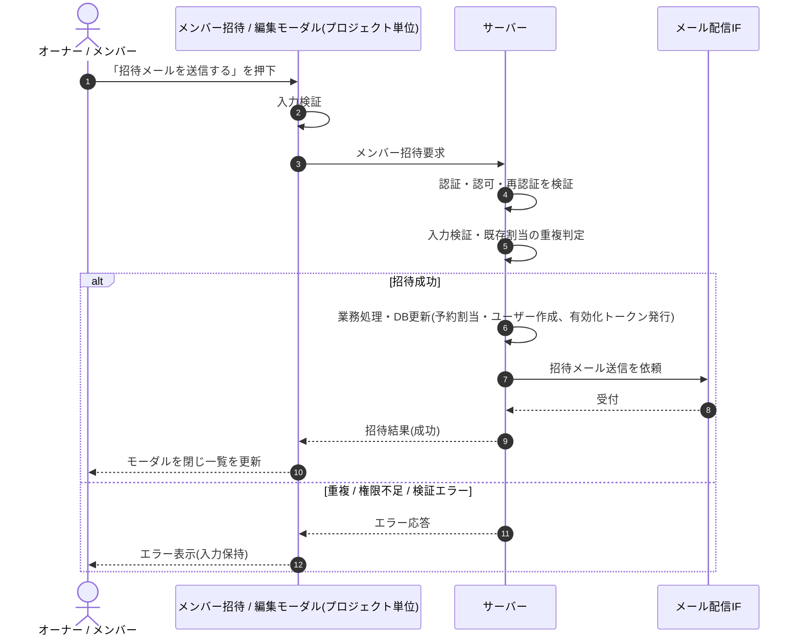

<!-- portal-top -->
[設計ポータル](../../README.md) ／ [基本設計](../index.md) ／ [シーケンス設計](index.md) ／ **SEQ-048: 「招待メールを送信する」を押下**
<!-- /portal-top -->

# SEQ-048: 「招待メールを送信する」を押下

> **このページは、業務ユースケース UC-126（「招待メールを送信する」を押下）のシーケンス図を定義します。**

*版数 v2.0 ・ 更新 2026-06-23 ・ ステータス ドラフト*

## 項目

| 項目 | 内容 |
|---|---|
| SEQ ID | `SEQ-048` |
| 対応業務ユースケース | [UC-126](../../01_requirements/04_business_usecases/UC-126.md#UC-126) |
| 業務要件 (BR) | 要確認 |
| 機能要件 (FR) | [FR-036](../../01_requirements/02_FunctionalRequirement/01_account-fr.md#FR-036) |
| 画面イベント (EVT) | [EVT-126](../02_screen_events/EVT-126.md#EVT-126) |
| 関連画面 | [SCR-014](../01_screens/SCR-014.md#SCR-014) |
| 関連 API | [API-021](../03_apis/API-021.md#API-021) |
| 関連テーブル | [TBL-003](../04_database/TBL-003.md#TBL-003) ・ [TBL-014](../04_database/TBL-014.md#TBL-014) |
| エラー (ERR) | [ERR-001](../07_errors/ERR-001.md#ERR-001) ・ [ERR-020](../07_errors/ERR-020.md#ERR-020) ・ [ERR-021](../07_errors/ERR-021.md#ERR-021) |
| メッセージ (MSG) | 要確認 |

## 概要

招待モーダルで「招待メールを送信する」を押下し、サーバーが予約割当行とユーザーを作成して有効化トークン（7 日）を発行し招待メールを送信する。成功時はモーダルを閉じて一覧を更新し、失敗時はモーダルを保持してエラーを表示する。

## シーケンス図

## 例外フロー

- 入力値の形式が不正な場合は検証エラーとし、モーダルを保持して入力欄にエラーを表示する。
- 招待先が既に当該プロジェクトに割り当て済みの場合は重複エラーとし、招待を中止する。
- 当該プロジェクトへの権限がない場合は権限不足エラーとして中止する。

## 備考

- 本図は基本設計レベルの抽象度(ユーザー / 画面 / サーバー、システム起点は外部システム・スケジューラ・バッチを加える)で記述する。DB 操作はサーバー自己メッセージで表し、テーブル別 CRUD は本図に書かず 関連テーブル 欄で示す。
- 図の出典は業務ユースケース [UC-126](../../01_requirements/04_business_usecases/UC-126.md#UC-126)。画面イベントとの対応は UC-126 を参照。

---

<!-- portal-bottom -->
[← シーケンス設計](index.md) ・ [基本設計](../index.md) ・ [↑ 設計ポータル](../../README.md)
<!-- /portal-bottom -->
