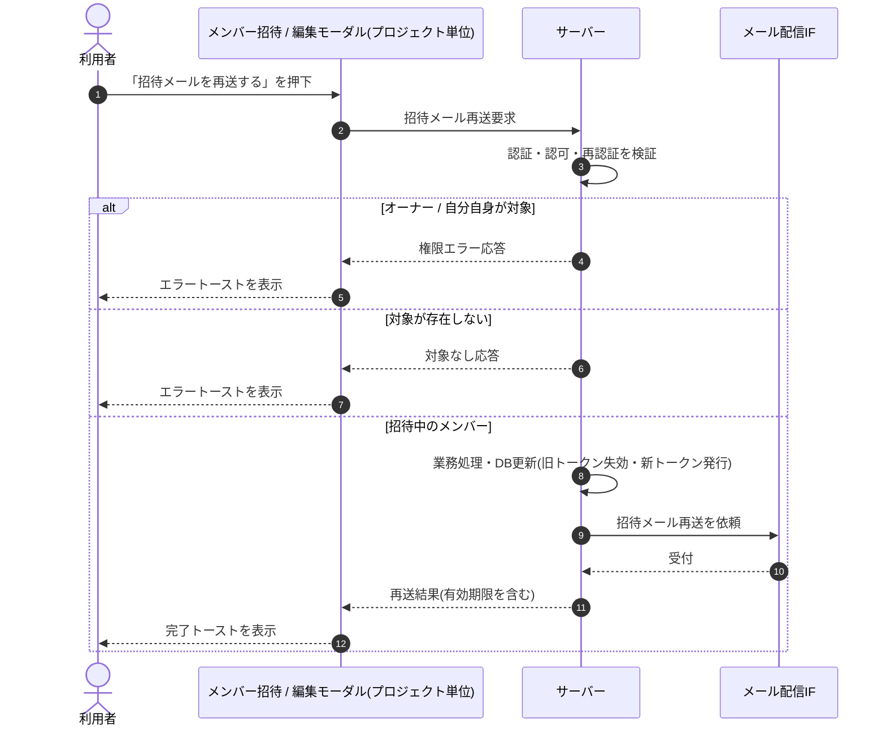

<!-- portal-top -->
[設計ポータル](../../README.md) ／ [基本設計](../index.md) ／ [シーケンス設計](index.md) ／ **SEQ-049: 「招待メールを再送する」を押下**
<!-- /portal-top -->

# SEQ-049: 「招待メールを再送する」を押下

> **このページは、業務ユースケース UC-019（「招待メールを再送する」を押下）のシーケンス図を定義します。**

*版数 v2.0 ・ 更新 2026-06-23 ・ ステータス ドラフト*

## 項目

| 項目 | 内容 |
|---|---|
| SEQ ID | `SEQ-049` |
| 対応業務ユースケース | [UC-019](../../01_requirements/04_business_usecases/UC-019.md#UC-019) |
| 業務要件 (BR) | 要確認 |
| 機能要件 (FR) | [FR-027](../../01_requirements/02_FunctionalRequirement/01_account-fr.md#FR-027) ・ [FR-022](../../01_requirements/02_FunctionalRequirement/01_account-fr.md#FR-022) ・ [FR-036](../../01_requirements/02_FunctionalRequirement/01_account-fr.md#FR-036) |
| 画面イベント (EVT) | [EVT-127](../02_screen_events/EVT-127.md#EVT-127) |
| 関連画面 | [SCR-014](../01_screens/SCR-014.md#SCR-014) |
| 関連 API | [API-024](../03_apis/API-024.md#API-024) |
| 関連テーブル | [TBL-014](../04_database/TBL-014.md#TBL-014) |
| エラー (ERR) | [ERR-019](../07_errors/ERR-019.md#ERR-019) ・ [ERR-023](../07_errors/ERR-023.md#ERR-023) ・ [ERR-024](../07_errors/ERR-024.md#ERR-024) |
| メッセージ (MSG) | 要確認 |

## 概要

オーナーまたは当該プロジェクトのメンバーが招待中の対象者に対して招待メールを再送する。成功時は旧リンクを失効させ新トークン（7 日）を発行して再送し完了トーストを表示し、失敗時はエラートーストを表示する。

## シーケンス図

## 例外フロー

- オーナーまたは自分自身を対象に指定した場合、権限エラー（[ERR-023](../07_errors/ERR-023.md#ERR-023) / [ERR-024](../07_errors/ERR-024.md#ERR-024)）を返しエラートーストを表示する。
- 対象メンバーが存在しない場合、対象なしエラー（[ERR-019](../07_errors/ERR-019.md#ERR-019)）を返しエラートーストを表示する。

## 備考

- 本図は基本設計レベルの抽象度（ユーザー / 画面 / サーバー、システム起点は外部システム・スケジューラ・バッチを加える）で記述する。DB 操作はサーバー自己メッセージで表し、テーブル別 CRUD は本図に書かず 関連テーブル 欄で示す。
- 図の出典は業務ユースケース [UC-019](../../01_requirements/04_business_usecases/UC-019.md#UC-019)。画面イベントとの対応は UC-019 を参照。

---

<!-- portal-bottom -->
[← シーケンス設計](index.md) ・ [基本設計](../index.md) ・ [↑ 設計ポータル](../../README.md)
<!-- /portal-bottom -->
