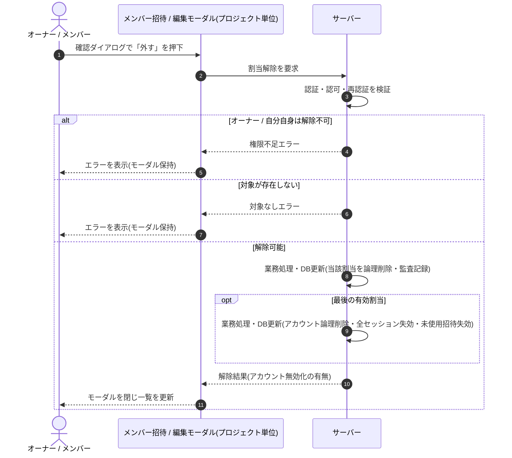

<!-- portal-top -->
[設計ポータル](../../README.md) ／ [基本設計](../index.md) ／ [シーケンス設計](index.md) ／ **SEQ-051: 割当解除の確認ダイアログで「外す」を押下**
<!-- /portal-top -->

# SEQ-051: 割当解除の確認ダイアログで「外す」を押下

> **このページは、業務ユースケース UC-021（割当解除の確認ダイアログで「外す」を押下）のシーケンス図を定義します。**

*版数 v2.0 ・ 更新 2026-06-23 ・ ステータス ドラフト*

## 項目

| 項目 | 内容 |
|---|---|
| SEQ ID | `SEQ-051` |
| 対応業務ユースケース | [UC-021](../../01_requirements/04_business_usecases/UC-021.md#UC-021) |
| 業務要件 (BR) | 要確認 |
| 機能要件 (FR) | [FR-027](../../01_requirements/02_FunctionalRequirement/01_account-fr.md#FR-027) ・ [FR-031](../../01_requirements/02_FunctionalRequirement/01_account-fr.md#FR-031) ・ [FR-024](../../01_requirements/02_FunctionalRequirement/01_account-fr.md#FR-024) |
| 画面イベント (EVT) | [EVT-130](../02_screen_events/EVT-130.md#EVT-130) |
| 関連画面 | [SCR-014](../01_screens/SCR-014.md#SCR-014) |
| 関連 API | [API-023](../03_apis/API-023.md#API-023) |
| 関連テーブル | [TBL-003](../04_database/TBL-003.md#TBL-003) ・ [TBL-014](../04_database/TBL-014.md#TBL-014) |
| エラー (ERR) | [ERR-019](../07_errors/ERR-019.md#ERR-019) ・ [ERR-021](../07_errors/ERR-021.md#ERR-021) ・ [ERR-023](../07_errors/ERR-023.md#ERR-023) ・ [ERR-024](../07_errors/ERR-024.md#ERR-024) |
| メッセージ (MSG) | 要確認 |

## 概要

確認ダイアログで「外す」を押下すると、当該プロジェクトの割当を解除し、変更を監査記録して当該メンバーへ通知する。最後の有効割当ならアカウントを論理削除し全セッションと未使用招待を無効化したうえで、モーダルを閉じて一覧を更新する。失敗時はモーダルを保持してエラーを表示する。

## シーケンス図

## 例外フロー

- 解除対象がオーナーの場合は解除を拒否し、モーダルを保持してエラーを表示する。
- 解除対象が自分自身の場合は解除を拒否し、モーダルを保持してエラーを表示する。
- 当該プロジェクトへの権限がない場合は解除を拒否し、モーダルを保持してエラーを表示する。
- 対象の割当が存在しない場合は対象なしとしてエラーを表示する。

## 備考

- 本図は基本設計レベルの抽象度(ユーザー / 画面 / サーバー、システム起点は外部システム・スケジューラ・バッチを加える)で記述する。DB 操作はサーバー自己メッセージで表し、テーブル別 CRUD は本図に書かず 関連テーブル 欄で示す。
- 図の出典は業務ユースケース [UC-021](../../01_requirements/04_business_usecases/UC-021.md#UC-021)。画面イベントとの対応は UC-021 を参照。

---

<!-- portal-bottom -->
[← シーケンス設計](index.md) ・ [基本設計](../index.md) ・ [↑ 設計ポータル](../../README.md)
<!-- /portal-bottom -->
