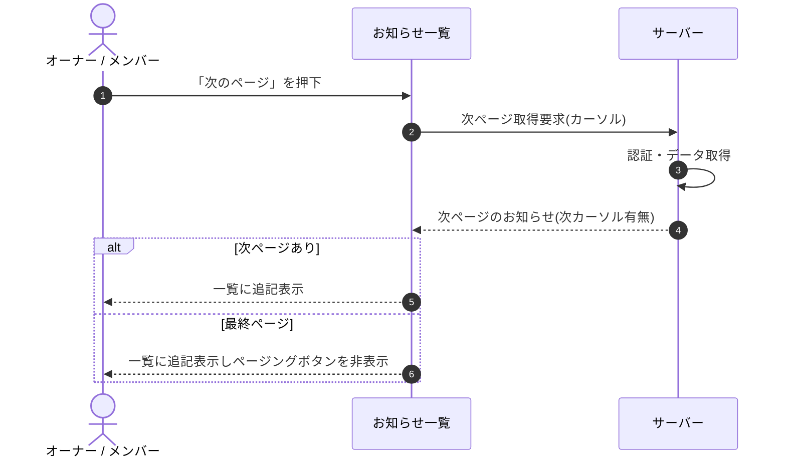

<!-- portal-top -->
[設計ポータル](../../README.md) ／ [基本設計](../index.md) ／ [シーケンス設計](index.md) ／ **SEQ-062: 「次のページ」を押下**
<!-- /portal-top -->

# SEQ-062: 「次のページ」を押下

> **このページは、業務ユースケース UC-145（「次のページ」を押下）のシーケンス図を定義します。**

*版数 v2.0 ・ 更新 2026-06-23 ・ ステータス ドラフト*

## 項目

| 項目 | 内容 |
|---|---|
| SEQ ID | `SEQ-062` |
| 対応業務ユースケース | [UC-145](../../01_requirements/04_business_usecases/UC-145.md#UC-145) |
| 業務要件 (BR) | 要確認 |
| 機能要件 (FR) | [FR-156](../../01_requirements/02_FunctionalRequirement/05_notification-fr.md#FR-156) ・ [FR-155](../../01_requirements/02_FunctionalRequirement/05_notification-fr.md#FR-155) ・ [FR-173](../../01_requirements/02_FunctionalRequirement/03_usage-fr.md#FR-173) |
| 画面イベント (EVT) | [EVT-145](../02_screen_events/EVT-145.md#EVT-145) |
| 関連画面 | [SCR-016](../01_screens/SCR-016.md#SCR-016) |
| 関連 API | [API-048](../03_apis/API-048.md#API-048) |
| 関連テーブル | [TBL-010](../04_database/TBL-010.md#TBL-010) ・ [TBL-021](../04_database/TBL-021.md#TBL-021) |
| エラー (ERR) | — |
| メッセージ (MSG) | 要確認 |

## 概要

お知らせ一覧で「次のページ」を押下すると、カーソル方式で次ページを取得して一覧に追記表示する。最終ページに到達したときはページングボタンを非表示にする。

## シーケンス図

## 備考

- 本図は基本設計レベルの抽象度(ユーザー / 画面 / サーバー、システム起点は外部システム・スケジューラ・バッチを加える)で記述する。DB 操作はサーバー自己メッセージで表し、テーブル別 CRUD は本図に書かず 関連テーブル 欄で示す。
- 図の出典は業務ユースケース [UC-145](../../01_requirements/04_business_usecases/UC-145.md#UC-145)。画面イベントとの対応は UC-145 を参照。

---

<!-- portal-bottom -->
[← シーケンス設計](index.md) ・ [基本設計](../index.md) ・ [↑ 設計ポータル](../../README.md)
<!-- /portal-bottom -->
