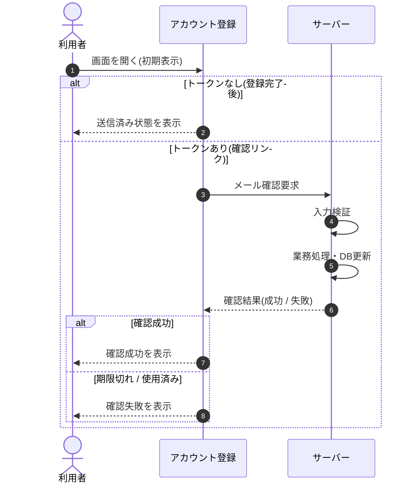

<!-- portal-top -->
[設計ポータル](../../README.md) ／ [基本設計](../index.md) ／ [シーケンス設計](index.md) ／ **SEQ-064: 初期表示**
<!-- /portal-top -->

# SEQ-064: 初期表示

> **このページは、業務ユースケース UC-151（初期表示）のシーケンス図を定義します。**

*版数 v2.0 ・ 更新 2026-06-23 ・ ステータス ドラフト*

## 項目

| 項目 | 内容 |
|---|---|
| SEQ ID | `SEQ-064` |
| 対応業務ユースケース | [UC-151](../../01_requirements/04_business_usecases/UC-151.md#UC-151) |
| 業務要件 (BR) | 要確認 |
| 機能要件 (FR) | [FR-003](../../01_requirements/02_FunctionalRequirement/01_account-fr.md#FR-003) |
| 画面イベント (EVT) | [EVT-151](../02_screen_events/EVT-151.md#EVT-151) |
| 関連画面 | [SCR-002](../01_screens/SCR-002.md#SCR-002) ・ [SCR-018](../01_screens/SCR-018.md#SCR-018) |
| 関連 API | [API-006](../03_apis/API-006.md#API-006) |
| 関連テーブル | [TBL-002](../04_database/TBL-002.md#TBL-002) |
| エラー (ERR) | [ERR-008](../07_errors/ERR-008.md#ERR-008) |
| メッセージ (MSG) | 要確認 |

## 概要

URL パラメータに確認トークンが無い場合は送信済み状態を表示し、確認トークンがある場合はサーバーで検証してメール確認状態を更新し、成功 / 失敗の結果を表示する。

## シーケンス図

## 例外フロー

- 確認トークンが期限切れ、または使用済みの場合、確認失敗を表示し、新規登録からのやり直しへ導く（有効期限 24 時間）。

## 備考

- 本図は基本設計レベルの抽象度(ユーザー / 画面 / サーバー、システム起点は外部システム・スケジューラ・バッチを加える)で記述する。DB 操作はサーバー自己メッセージで表し、テーブル別 CRUD は本図に書かず 関連テーブル 欄で示す。
- 図の出典は業務ユースケース [UC-151](../../01_requirements/04_business_usecases/UC-151.md#UC-151)。画面イベントとの対応は UC-151 を参照。

---

<!-- portal-bottom -->
[← シーケンス設計](index.md) ・ [基本設計](../index.md) ・ [↑ 設計ポータル](../../README.md)
<!-- /portal-bottom -->
