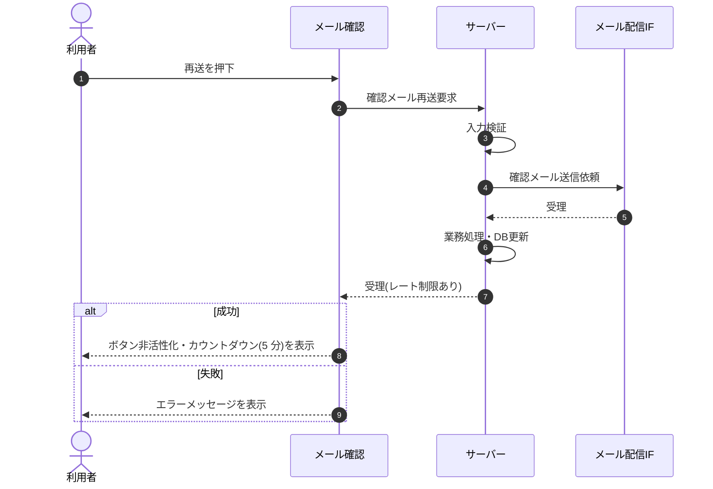

<!-- portal-top -->
[設計ポータル](../../README.md) ／ [基本設計](../index.md) ／ [シーケンス設計](index.md) ／ **SEQ-065: 「メールを再送する」を押下**
<!-- /portal-top -->

# SEQ-065: 「メールを再送する」を押下

> **このページは、業務ユースケース UC-152（「メールを再送する」を押下）のシーケンス図を定義します。**

*版数 v2.0 ・ 更新 2026-06-23 ・ ステータス ドラフト*

## 項目

| 項目 | 内容 |
|---|---|
| SEQ ID | `SEQ-065` |
| 対応業務ユースケース | [UC-152](../../01_requirements/04_business_usecases/UC-152.md#UC-152) |
| 業務要件 (BR) | 要確認 |
| 機能要件 (FR) | [FR-003](../../01_requirements/02_FunctionalRequirement/01_account-fr.md#FR-003) |
| 画面イベント (EVT) | [EVT-152](../02_screen_events/EVT-152.md#EVT-152) |
| 関連画面 | [SCR-018](../01_screens/SCR-018.md#SCR-018) |
| 関連 API | [API-001](../03_apis/API-001.md#API-001) |
| 関連テーブル | — |
| エラー (ERR) | [ERR-001](../07_errors/ERR-001.md#ERR-001) ・ [ERR-002](../07_errors/ERR-002.md#ERR-002) |
| メッセージ (MSG) | 要確認 |

## 概要

メール確認画面で再送を押下すると、サーバーが確認メールを再送する。成功時は画面が再送ボタンを非活性化し、レート制限のカウントダウン(5 分)を表示する。

## シーケンス図

## 例外フロー

- レート制限中は再送ボタンを非活性のままとし、カウントダウン終了で再活性化する。
- 確認メールの再送に失敗した場合はエラーメッセージを表示する。

## 備考

- 本図は基本設計レベルの抽象度(ユーザー / 画面 / サーバー、システム起点は外部システム・スケジューラ・バッチを加える)で記述する。DB 操作はサーバー自己メッセージで表し、テーブル別 CRUD は本図に書かず 関連テーブル 欄で示す。
- 図の出典は業務ユースケース [UC-152](../../01_requirements/04_business_usecases/UC-152.md#UC-152)。画面イベントとの対応は UC-152 を参照。

---

<!-- portal-bottom -->
[← シーケンス設計](index.md) ・ [基本設計](../index.md) ・ [↑ 設計ポータル](../../README.md)
<!-- /portal-bottom -->
