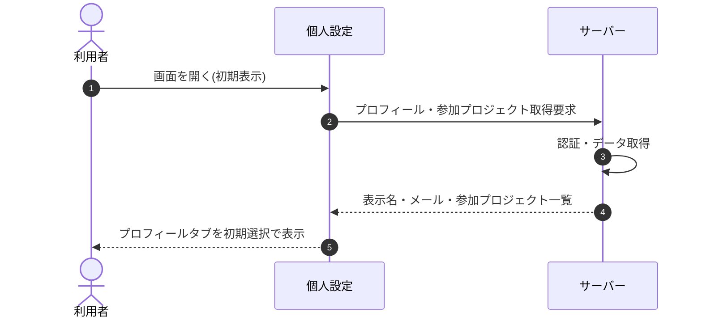

<!-- portal-top -->
[設計ポータル](../../README.md) ／ [基本設計](../index.md) ／ [シーケンス設計](index.md) ／ **SEQ-070: 初期表示**
<!-- /portal-top -->

# SEQ-070: 初期表示

> **このページは、業務ユースケース UC-008（初期表示）のシーケンス図を定義します。**

*版数 v2.0 ・ 更新 2026-06-23 ・ ステータス ドラフト*

## 項目

| 項目 | 内容 |
|---|---|
| SEQ ID | `SEQ-070` |
| 対応業務ユースケース | [UC-008](../../01_requirements/04_business_usecases/UC-008.md#UC-008) |
| 業務要件 (BR) | 要確認 |
| 機能要件 (FR) | [FR-001](../../01_requirements/02_FunctionalRequirement/01_account-fr.md#FR-001) ・ [FR-190](../../01_requirements/02_FunctionalRequirement/01_account-fr.md#FR-190) ・ [FR-191](../../01_requirements/02_FunctionalRequirement/01_account-fr.md#FR-191) |
| 画面イベント (EVT) | [EVT-173](../02_screen_events/EVT-173.md#EVT-173) |
| 関連画面 | [SCR-022](../01_screens/SCR-022.md#SCR-022) |
| 関連 API | — |
| 関連テーブル | [TBL-002](../04_database/TBL-002.md#TBL-002) ・ [TBL-003](../04_database/TBL-003.md#TBL-003) |
| エラー (ERR) | — |
| メッセージ (MSG) | 要確認 |

## 概要

認証済みの利用者が個人設定画面を開いたときに、自身の表示名・メールアドレスおよび参加プロジェクト一覧を取得し、プロフィールタブを初期選択状態で表示する。

## シーケンス図

## 備考

- 本図は基本設計レベルの抽象度(ユーザー / 画面 / サーバー、システム起点は外部システム・スケジューラ・バッチを加える)で記述する。DB 操作はサーバー自己メッセージで表し、テーブル別 CRUD は本図に書かず 関連テーブル 欄で示す。
- 図の出典は業務ユースケース [UC-008](../../01_requirements/04_business_usecases/UC-008.md#UC-008)。画面イベントとの対応は UC-008 を参照。

---

<!-- portal-bottom -->
[← シーケンス設計](index.md) ・ [基本設計](../index.md) ・ [↑ 設計ポータル](../../README.md)
<!-- /portal-bottom -->
