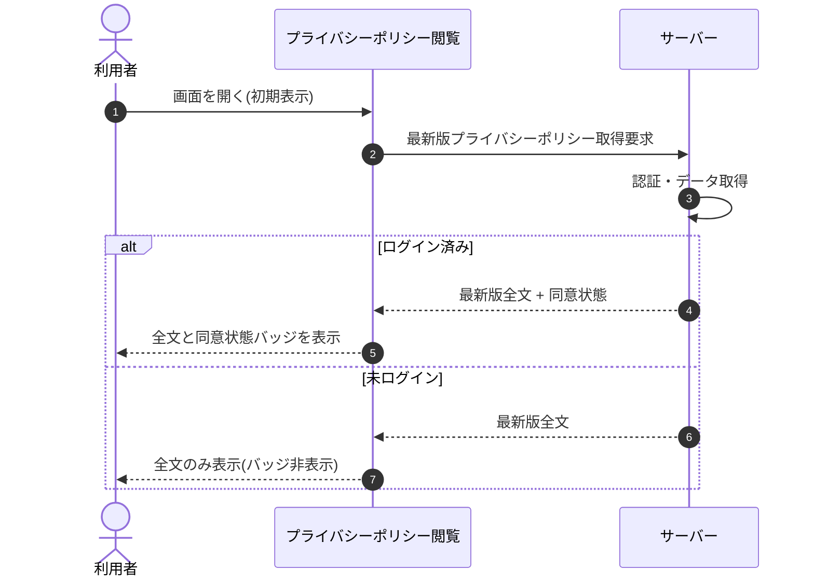

<!-- portal-top -->
[設計ポータル](../../README.md) ／ [基本設計](../index.md) ／ [シーケンス設計](index.md) ／ **SEQ-076: 初期表示**
<!-- /portal-top -->

# SEQ-076: 初期表示

> **このページは、業務ユースケース UC-196（初期表示）のシーケンス図を定義します。**

*版数 v2.0 ・ 更新 2026-06-23 ・ ステータス ドラフト*

## 項目

| 項目 | 内容 |
|---|---|
| SEQ ID | `SEQ-076` |
| 対応業務ユースケース | [UC-196](../../01_requirements/04_business_usecases/UC-196.md#UC-196) |
| 業務要件 (BR) | 要確認 |
| 機能要件 (FR) | [FR-137](../../01_requirements/02_FunctionalRequirement/06_security-fr.md#FR-137) ・ [FR-139](../../01_requirements/02_FunctionalRequirement/06_security-fr.md#FR-139) |
| 画面イベント (EVT) | [EVT-196](../02_screen_events/EVT-196.md#EVT-196) |
| 関連画面 | [SCR-025](../01_screens/SCR-025.md#SCR-025) |
| 関連 API | [API-053](../03_apis/API-053.md#API-053) |
| 関連テーブル | [TBL-012](../04_database/TBL-012.md#TBL-012) ・ [TBL-024](../04_database/TBL-024.md#TBL-024) |
| エラー (ERR) | — |
| メッセージ (MSG) | 要確認 |

## 概要

プライバシーポリシー閲覧画面を開いた利用者へ、最新版の全文を表示する。ログイン済みのときは同意状態バッジを併せて表示し、未ログインのときはバッジを非表示にする。

## シーケンス図

## 備考

- 本図は基本設計レベルの抽象度(ユーザー / 画面 / サーバー、システム起点は外部システム・スケジューラ・バッチを加える)で記述する。DB 操作はサーバー自己メッセージで表し、テーブル別 CRUD は本図に書かず 関連テーブル 欄で示す。
- 図の出典は業務ユースケース [UC-196](../../01_requirements/04_business_usecases/UC-196.md#UC-196)。画面イベントとの対応は UC-196 を参照。

---

<!-- portal-bottom -->
[← シーケンス設計](index.md) ・ [基本設計](../index.md) ・ [↑ 設計ポータル](../../README.md)
<!-- /portal-bottom -->
