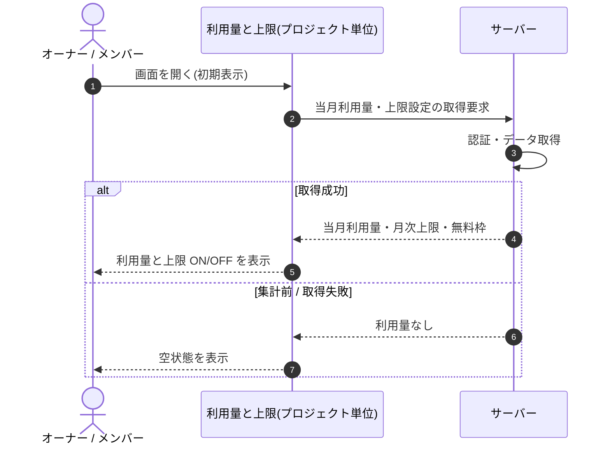

<!-- portal-top -->
[設計ポータル](../../README.md) ／ [基本設計](../index.md) ／ [シーケンス設計](index.md) ／ **SEQ-077: 初期表示**
<!-- /portal-top -->

# SEQ-077: 初期表示

> **このページは、業務ユースケース UC-034（初期表示）のシーケンス図を定義します。**

*版数 v2.0 ・ 更新 2026-06-23 ・ ステータス ドラフト*

## 項目

| 項目 | 内容 |
|---|---|
| SEQ ID | `SEQ-077` |
| 対応業務ユースケース | [UC-034](../../01_requirements/04_business_usecases/UC-034.md#UC-034) |
| 業務要件 (BR) | 要確認 |
| 機能要件 (FR) | [FR-088](../../01_requirements/02_FunctionalRequirement/03_usage-fr.md#FR-088) ・ [FR-089](../../01_requirements/02_FunctionalRequirement/03_usage-fr.md#FR-089) |
| 画面イベント (EVT) | [EVT-199](../02_screen_events/EVT-199.md#EVT-199) |
| 関連画面 | [SCR-026](../01_screens/SCR-026.md#SCR-026) |
| 関連 API | [API-041](../03_apis/API-041.md#API-041) ・ [API-046](../03_apis/API-046.md#API-046) |
| 関連テーブル | [TBL-009](../04_database/TBL-009.md#TBL-009) ・ [TBL-020](../04_database/TBL-020.md#TBL-020) |
| エラー (ERR) | — |
| メッセージ (MSG) | 要確認 |

## 概要

利用量と上限画面を開いたとき、当月の質問数利用量と月次上限・無料枠の設定を取得して表示する。取得できた場合は利用量と上限 ON/OFF を反映し、集計前または取得失敗時は空状態を表示する。

## シーケンス図

## 備考

- 本図は基本設計レベルの抽象度(ユーザー / 画面 / サーバー、システム起点は外部システム・スケジューラ・バッチを加える)で記述する。DB 操作はサーバー自己メッセージで表し、テーブル別 CRUD は本図に書かず 関連テーブル 欄で示す。
- 図の出典は業務ユースケース [UC-034](../../01_requirements/04_business_usecases/UC-034.md#UC-034)。画面イベントとの対応は UC-034 を参照。

---

<!-- portal-bottom -->
[← シーケンス設計](index.md) ・ [基本設計](../index.md) ・ [↑ 設計ポータル](../../README.md)
<!-- /portal-bottom -->
