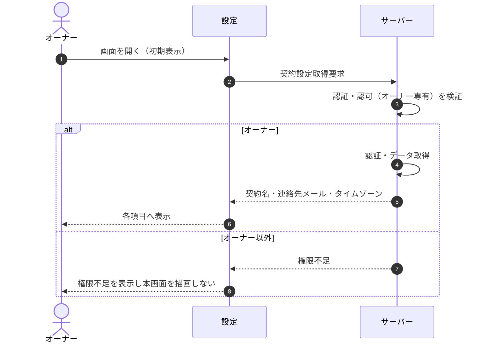

<!-- portal-top -->
[設計ポータル](../../README.md) ／ [基本設計](../index.md) ／ [シーケンス設計](index.md) ／ **SEQ-085: 初期表示**
<!-- /portal-top -->

# SEQ-085: 初期表示

> **このページは、業務ユースケース UC-022（初期表示）のシーケンス図を定義します。**

*版数 v2.0 ・ 更新 2026-06-23 ・ ステータス ドラフト*

## 項目

| 項目 | 内容 |
|---|---|
| SEQ ID | `SEQ-085` |
| 対応業務ユースケース | [UC-022](../../01_requirements/04_business_usecases/UC-022.md#UC-022) |
| 業務要件 (BR) | 要確認 |
| 機能要件 (FR) | [FR-009](../../01_requirements/02_FunctionalRequirement/01_account-fr.md#FR-009) |
| 画面イベント (EVT) | [EVT-215](../02_screen_events/EVT-215.md#EVT-215) |
| 関連画面 | [SCR-029](../01_screens/SCR-029.md#SCR-029) |
| 関連 API | [API-014](../03_apis/API-014.md#API-014) |
| 関連テーブル | [TBL-002](../04_database/TBL-002.md#TBL-002) |
| エラー (ERR) | [ERR-017](../07_errors/ERR-017.md#ERR-017) |
| メッセージ (MSG) | 要確認 |

## 概要

オーナーが設定画面を開くと、サーバーがオーナー専有の認可を検証したうえで契約名・連絡先メール・タイムゾーンを取得し、各項目へ表示する。オーナー以外には権限不足を表示し本画面を描画しない。

## シーケンス図

## 例外フロー

- オーナー以外が本画面へアクセスした場合は権限不足を表示し、本画面を描画しない。

## 備考

- 本図は基本設計レベルの抽象度(ユーザー / 画面 / サーバー、システム起点は外部システム・スケジューラ・バッチを加える)で記述する。DB 操作はサーバー自己メッセージで表し、テーブル別 CRUD は本図に書かず 関連テーブル 欄で示す。
- 図の出典は業務ユースケース [UC-022](../../01_requirements/04_business_usecases/UC-022.md#UC-022)。画面イベントとの対応は UC-022 を参照。

---

<!-- portal-bottom -->
[← シーケンス設計](index.md) ・ [基本設計](../index.md) ・ [↑ 設計ポータル](../../README.md)
<!-- /portal-bottom -->
