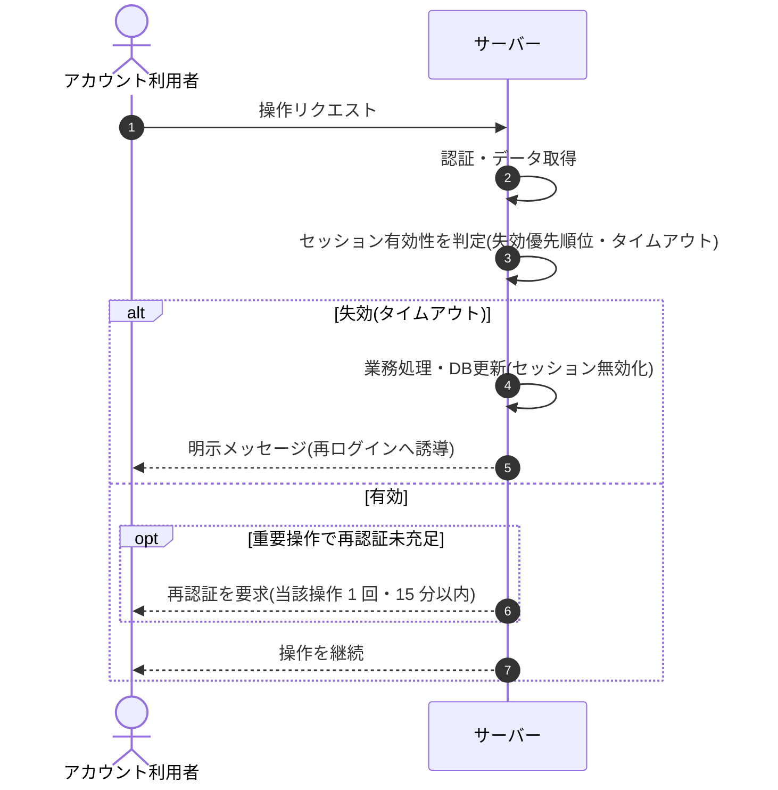

<!-- portal-top -->
[設計ポータル](../../README.md) ／ [基本設計](../index.md) ／ [シーケンス設計](index.md) ／ **SEQ-102: セッション失効・再認証**
<!-- /portal-top -->

# SEQ-102: セッション失効・再認証

> **このページは、業務ユースケース UC-072（セッション失効・再認証）のシーケンス図を定義します。**

*版数 v2.0 ・ 更新 2026-06-23 ・ ステータス ドラフト*

## 項目

| 項目 | 内容 |
|---|---|
| SEQ ID | `SEQ-102` |
| 対応業務ユースケース | [UC-072](../../01_requirements/04_business_usecases/UC-072.md#UC-072) |
| 業務要件 (BR) | 要確認 |
| 機能要件 (FR) | [FR-008](../../01_requirements/02_FunctionalRequirement/01_account-fr.md#FR-008) ・ [FR-005](../../01_requirements/02_FunctionalRequirement/01_account-fr.md#FR-005) |
| 画面イベント (EVT) | — |
| 関連画面 | — |
| 関連 API | [API-002](../03_apis/API-002.md#API-002) ・ [API-003](../03_apis/API-003.md#API-003) |
| 関連テーブル | [TBL-013](../04_database/TBL-013.md#TBL-013) |
| エラー (ERR) | [ERR-003](../07_errors/ERR-003.md#ERR-003) ・ [ERR-004](../07_errors/ERR-004.md#ERR-004) ・ [ERR-005](../07_errors/ERR-005.md#ERR-005) ・ [ERR-006](../07_errors/ERR-006.md#ERR-006) |
| メッセージ (MSG) | 要確認 |

## 概要

アカウント利用者の操作リクエストを契機に、失効の優先順位とタイムアウト（無操作・絶対）に従ってセッションの有効性を判定する。失効済みは無効化して再ログインへ誘導し、有効でも重要操作で再認証が未充足なら再認証を要求する。

## シーケンス図

## 例外フロー

- **同時失効**: 操作実行中にセッションが失効した場合は当該操作を許可せず、明示メッセージで再ログインへ誘導する。
- **再認証期限切れ**: 再認証が 15 分を超過、または別操作で消費済みの場合は再認証未充足として要求する。

## 備考

- 本図は基本設計レベルの抽象度(ユーザー / 画面 / サーバー、システム起点は外部システム・スケジューラ・バッチを加える)で記述する。DB 操作はサーバー自己メッセージで表し、テーブル別 CRUD は本図に書かず 関連テーブル 欄で示す。
- 図の出典は業務ユースケース [UC-072](../../01_requirements/04_business_usecases/UC-072.md#UC-072)。画面イベントとの対応は UC-072 を参照。

---

<!-- portal-bottom -->
[← シーケンス設計](index.md) ・ [基本設計](../index.md) ・ [↑ 設計ポータル](../../README.md)
<!-- /portal-bottom -->
