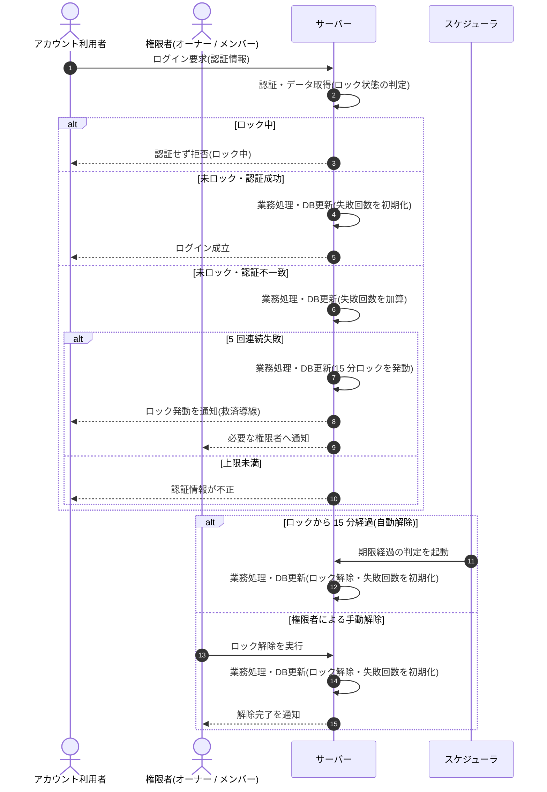

<!-- portal-top -->
[設計ポータル](../../README.md) ／ [基本設計](../index.md) ／ [シーケンス設計](index.md) ／ **SEQ-103: ログイン失敗ロックアウト・解除**
<!-- /portal-top -->

# SEQ-103: ログイン失敗ロックアウト・解除

> **このページは、業務ユースケース UC-073（ログイン失敗ロックアウト・解除）のシーケンス図を定義します。**

*版数 v2.0 ・ 更新 2026-06-23 ・ ステータス ドラフト*

## 項目

| 項目 | 内容 |
|---|---|
| SEQ ID | `SEQ-103` |
| 対応業務ユースケース | [UC-073](../../01_requirements/04_business_usecases/UC-073.md#UC-073) |
| 業務要件 (BR) | 要確認 |
| 機能要件 (FR) | [FR-007](../../01_requirements/02_FunctionalRequirement/01_account-fr.md#FR-007) |
| 画面イベント (EVT) | — |
| 関連画面 | — |
| 関連 API | [API-002](../03_apis/API-002.md#API-002) |
| 関連テーブル | — |
| エラー (ERR) | [ERR-003](../07_errors/ERR-003.md#ERR-003) ・ [ERR-004](../07_errors/ERR-004.md#ERR-004) ・ [ERR-005](../07_errors/ERR-005.md#ERR-005) ・ [ERR-006](../07_errors/ERR-006.md#ERR-006) |
| メッセージ (MSG) | 要確認 |

## 概要

連続ログイン失敗による総当たり攻撃を 5 回 / 15 分のロックで抑止し、ロック中の到達は認証せず拒否する。ロックは時間経過の自動解除または権限者の手動解除で解け、解除後は失敗回数を初期化して試行を再受付する。

## シーケンス図

## 例外フロー

- ロック中に追加のログイン試行が到達しても認証は行わず、一律にロック中として拒否する。
- 解除直後に再び 5 回連続失敗した場合は、改めて 15 分のロックを発動する。

## 備考

- 本図は基本設計レベルの抽象度(ユーザー / 画面 / サーバー、システム起点は外部システム・スケジューラ・バッチを加える)で記述する。DB 操作はサーバー自己メッセージで表し、テーブル別 CRUD は本図に書かず 関連テーブル 欄で示す。
- 図の出典は業務ユースケース [UC-073](../../01_requirements/04_business_usecases/UC-073.md#UC-073)。画面イベントとの対応は UC-073 を参照。

---

<!-- portal-bottom -->
[← シーケンス設計](index.md) ・ [基本設計](../index.md) ・ [↑ 設計ポータル](../../README.md)
<!-- /portal-bottom -->
