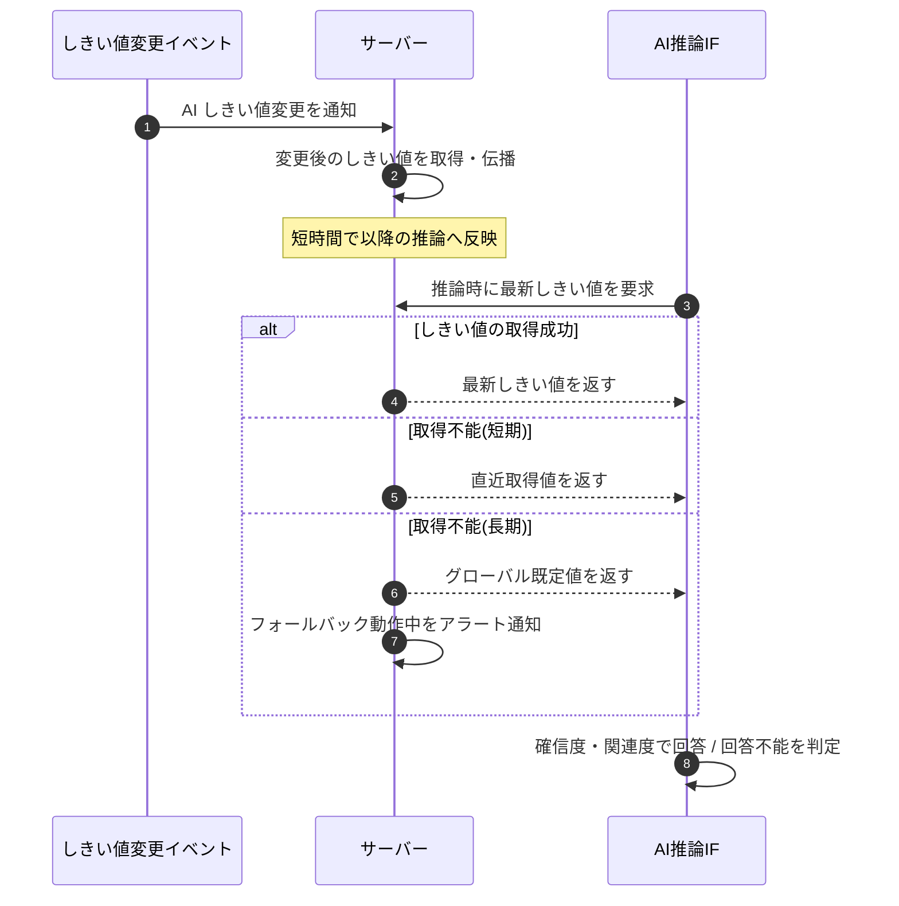

<!-- portal-top -->
[設計ポータル](../../README.md) ／ [基本設計](../index.md) ／ [シーケンス設計](index.md) ／ **SEQ-105: AI しきい値変更の伝播・フォールバック**
<!-- /portal-top -->

# SEQ-105: AI しきい値変更の伝播・フォールバック

> **このページは、業務ユースケース UC-245（AI しきい値変更の伝播・フォールバック）のシーケンス図を定義します。**

*版数 v2.0 ・ 更新 2026-06-23 ・ ステータス ドラフト*

## 項目

| 項目 | 内容 |
|---|---|
| SEQ ID | `SEQ-105` |
| 対応業務ユースケース | [UC-245](../../01_requirements/04_business_usecases/UC-245.md#UC-245) |
| 業務要件 (BR) | 要確認 |
| 機能要件 (FR) | [FR-193](../../01_requirements/02_FunctionalRequirement/02_faq-ai-fr.md#FR-193) |
| 画面イベント (EVT) | — |
| 関連画面 | — |
| 関連 API | [API-057](../03_apis/API-057.md#API-057) |
| 関連テーブル | [TBL-004](../04_database/TBL-004.md#TBL-004) |
| エラー (ERR) | — |
| メッセージ (MSG) | 要確認 |

## 概要

プロジェクトの AI しきい値が変更されると伝播処理がサーバーへ反映し、以降の推論は最新しきい値を参照して回答 / 回答不能を判定する。しきい値の取得が長期に行えないときは直近取得値またはグローバル既定値で推論を継続し、フォールバック動作中はアラート通知する。

## シーケンス図

## 例外フロー

- しきい値設定の取得が短期に行えないときは、直近に取得できたしきい値で推論を継続する。
- 直近取得値が無いまま取得が長期に行えないときは、グローバル既定値で推論を継続する。
- フォールバックで動作している間はアラート通知する。

## 詳細設計への移管候補

| 内容 | 移管先候補 | 理由 |
|---|---|---|
| しきい値キャッシュの具体的な伝播方式・反映遅延の上限 | 詳細設計 | 基本設計では「短時間で伝播」の抽象度に留め、配信機構の実装は詳細設計で定める |
| グローバル既定値の具体値・直近取得値の保持期間 | 詳細設計 / 業務ルール | 定量しきい値は本図に書かず、ルール・実装側で管理する |

## 備考

- 本図は基本設計レベルの抽象度(ユーザー / 画面 / サーバー、システム起点は外部システム・スケジューラ・バッチを加える)で記述する。DB 操作はサーバー自己メッセージで表し、テーブル別 CRUD は本図に書かず 関連テーブル 欄で示す。
- 図の出典は業務ユースケース [UC-245](../../01_requirements/04_business_usecases/UC-245.md#UC-245)。画面イベントとの対応は UC-245 を参照。

---

<!-- portal-bottom -->
[← シーケンス設計](index.md) ・ [基本設計](../index.md) ・ [↑ 設計ポータル](../../README.md)
<!-- /portal-bottom -->
