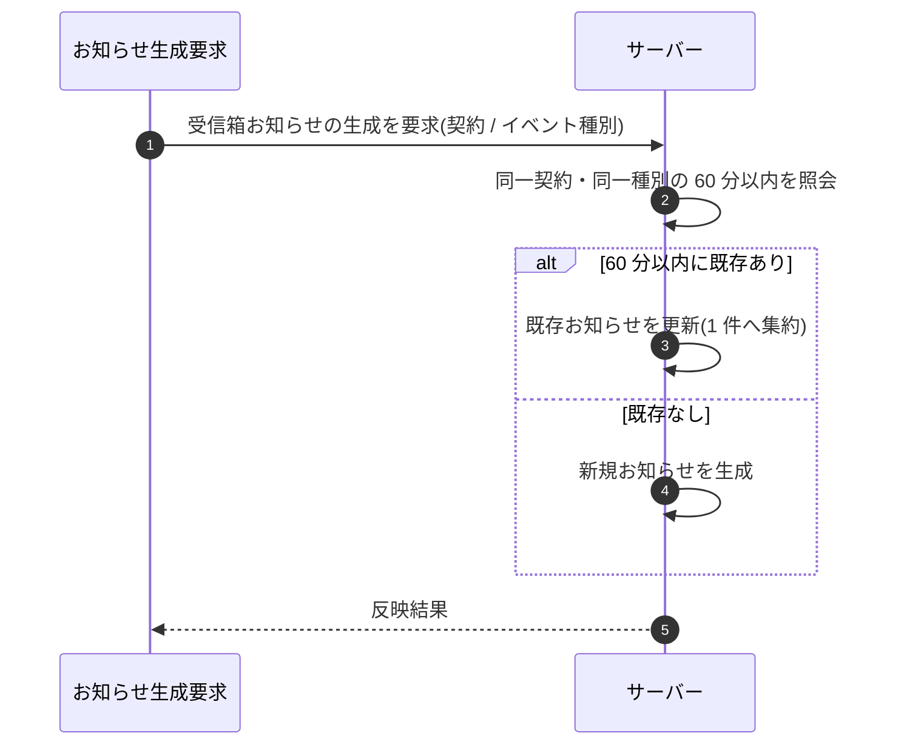

<!-- portal-top -->
[設計ポータル](../../README.md) ／ [基本設計](../index.md) ／ [シーケンス設計](index.md) ／ **SEQ-106: 受信箱の重複集約**
<!-- /portal-top -->

# SEQ-106: 受信箱の重複集約

> **このページは、業務ユースケース UC-246（受信箱の重複集約）のシーケンス図を定義します。**

*版数 v2.0 ・ 更新 2026-06-23 ・ ステータス ドラフト*

## 項目

| 項目 | 内容 |
|---|---|
| SEQ ID | `SEQ-106` |
| 対応業務ユースケース | [UC-246](../../01_requirements/04_business_usecases/UC-246.md#UC-246) |
| 業務要件 (BR) | 要確認 |
| 機能要件 (FR) | [FR-164](../../01_requirements/02_FunctionalRequirement/05_notification-fr.md#FR-164) ・ [FR-162](../../01_requirements/02_FunctionalRequirement/05_notification-fr.md#FR-162) ・ [FR-163](../../01_requirements/02_FunctionalRequirement/05_notification-fr.md#FR-163) |
| 画面イベント (EVT) | — |
| 関連画面 | — |
| 関連 API | — |
| 関連テーブル | [TBL-022](../04_database/TBL-022.md#TBL-022) |
| エラー (ERR) | — |
| メッセージ (MSG) | 要確認 |

## 概要

運用イベント等を契機に受信箱お知らせの生成要求が発生したとき、同一契約・同一イベント種別で 60 分以内に連続発火したお知らせを 1 件に集約し、重複したお知らせの生成を抑える。60 分窓を外れた発火や異なるイベント種別は別お知らせとして生成される。

## シーケンス図

## 備考

- 本図は基本設計レベルの抽象度(ユーザー / 画面 / サーバー、システム起点は外部システム・スケジューラ・バッチを加える)で記述する。DB 操作はサーバー自己メッセージで表し、テーブル別 CRUD は本図に書かず 関連テーブル 欄で示す。
- 図の出典は業務ユースケース [UC-246](../../01_requirements/04_business_usecases/UC-246.md#UC-246)。画面イベントとの対応は UC-246 を参照。

---

<!-- portal-bottom -->
[← シーケンス設計](index.md) ・ [基本設計](../index.md) ・ [↑ 設計ポータル](../../README.md)
<!-- /portal-bottom -->
