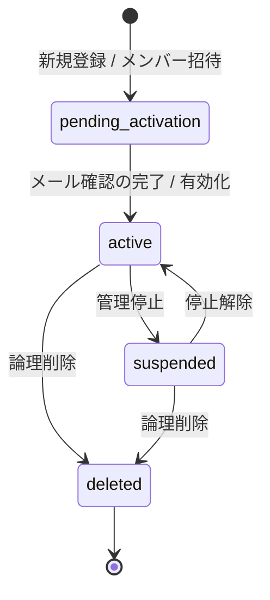
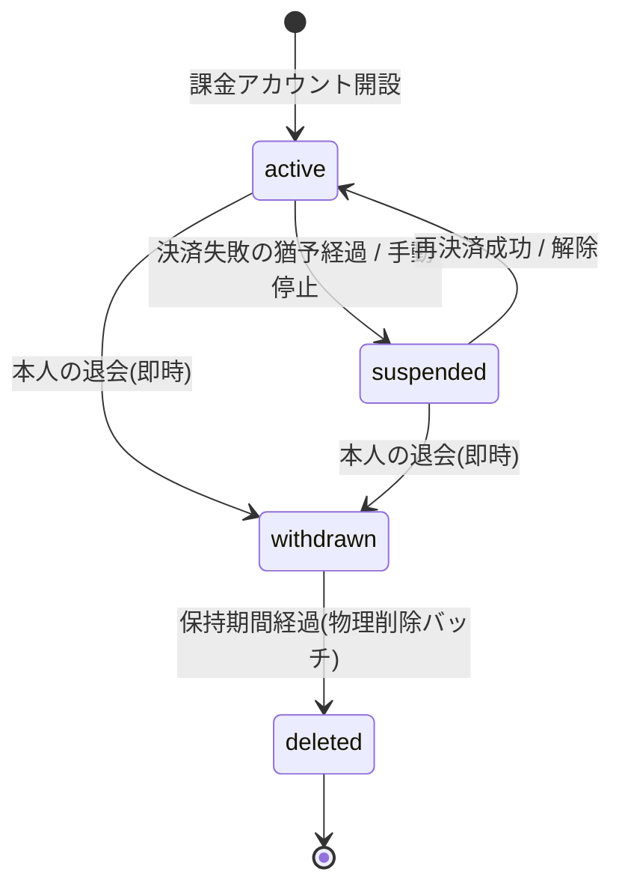
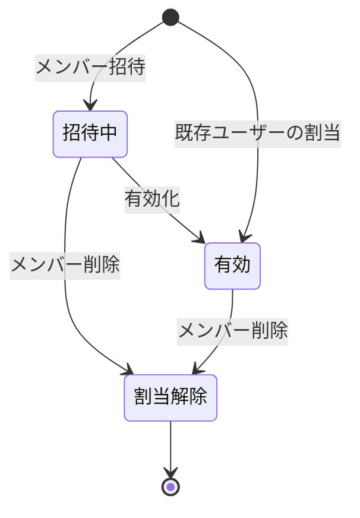
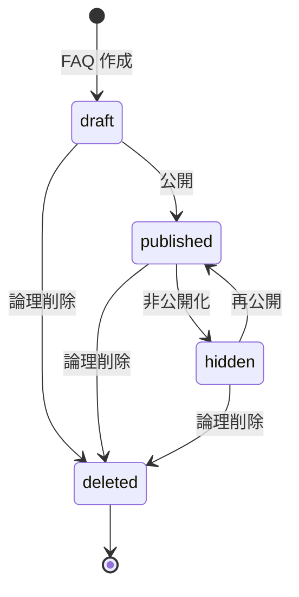
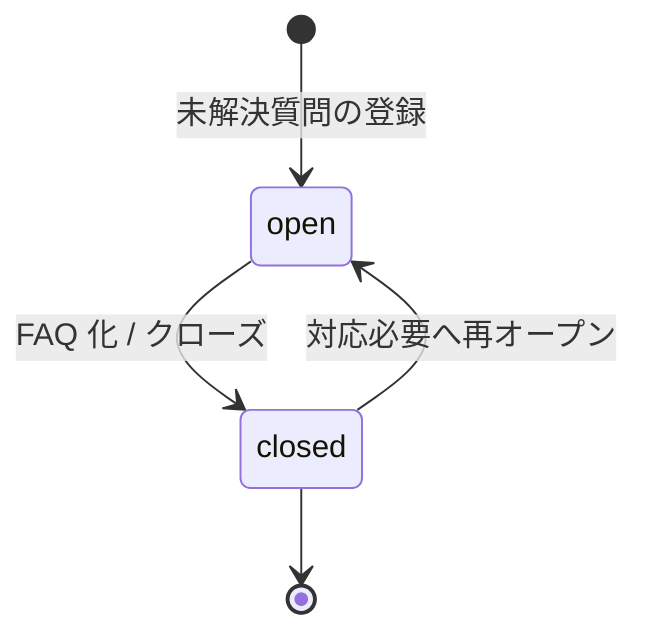
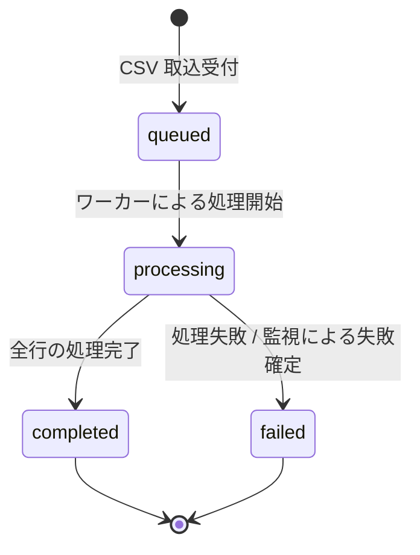
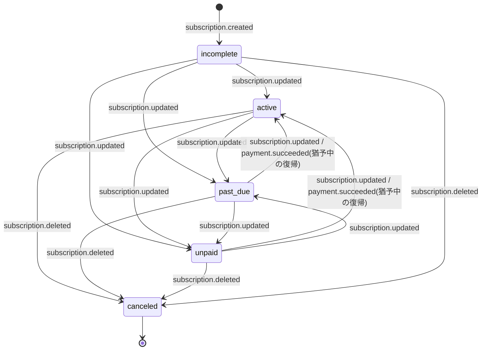
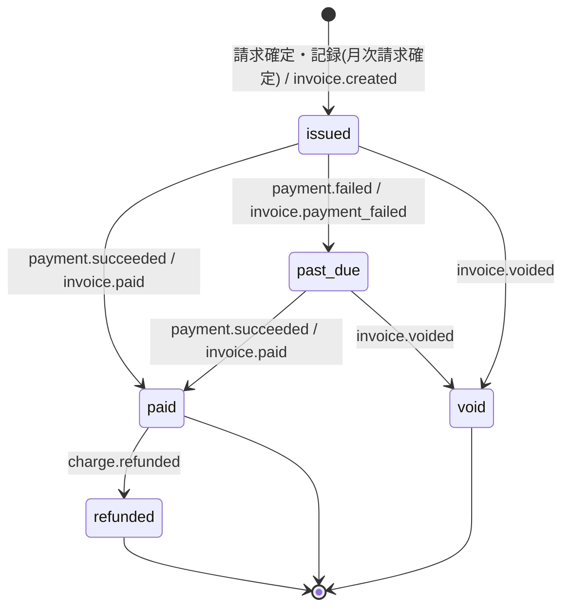
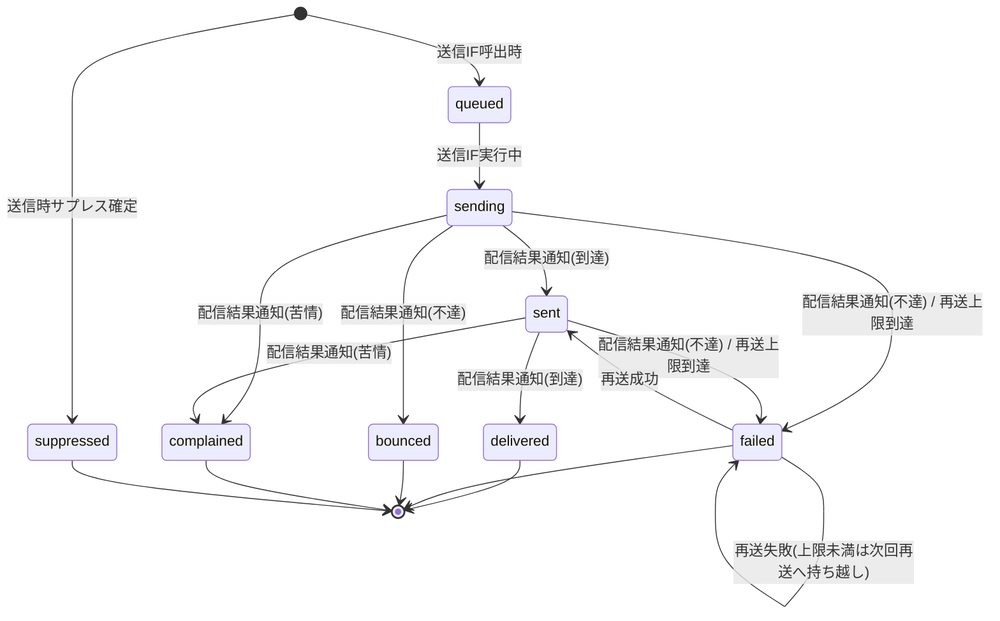
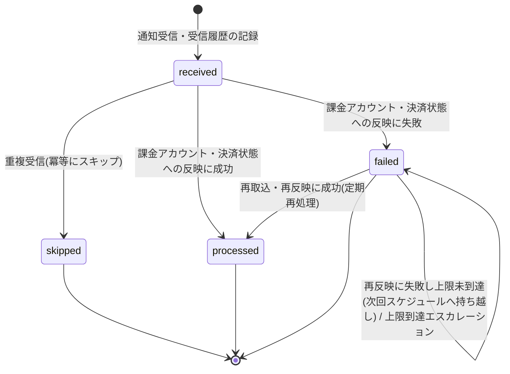

# 状態モデル(正本)

> **このページは、システムが扱う主要な状態(アカウント・課金アカウント・メンバー割当・プロジェクト・FAQ/未解決質問・ジョブ・課金/配信/Webhook)の一覧と遷移を一元管理する正本です。** 各設計書は状態名を本書に統一する。状態値の物理定義(テーブル CHECK 制約)は対応するテーブル設計を正本とし、本書は状態の意味と遷移を示す。保持期間・猶予期間などの具体値は [システム仕様書 §4](07_system-spec.md#4-データ保持期間削除猶予) を正本とする。

## 1. アカウント状態(`M_USER.status`)

アカウントは、新規登録直後の確認待ちから、メール確認による有効化、停止、論理削除までを 4 状態で表す。物理定義・CHECK 制約は [`M_USER`](02_backend/04_database/TBL-001.md#TBL-001) を正本とする。

| 状態値 | 意味 | 主な遷移契機 |
|----|----|----|
| `pending_activation` | サインアップ済み・メール確認待ち。メンバー招待直後の有効化待ちも含む | 新規登録 / メンバー招待 |
| `active` | 有効。全機能を利用できる | メール確認の完了 / 招待アカウントの有効化 |
| `suspended` | 停止。利用を一時的に制限する | 管理停止 |
| `deleted` | 論理削除。ログインできない | 論理削除 |

> **`active`⇄`suspended`(管理停止/停止解除)の実行操作(運用管理者によるアカウント停止)は MVP スコープ外・将来対応([FUT-08](../04_future/FUT-08.md#FUT-08))。停止状態は [SYS-030](02_backend/01_system/SYS-030.md#SYS-030)(停止時セッション一斉無効化)が消費するため状態定義は保持する。**

## 2. 課金アカウント状態(`M_BILLING_ACCOUNT.status`)

課金アカウントは、有効・サスペンション・退会・削除の 4 状態で表す。決済失敗猶予、退会後の保持期間などの具体値は [システム仕様書 §4](07_system-spec.md#4-データ保持期間削除猶予) を正本とする。物理定義・CHECK 制約は [`M_BILLING_ACCOUNT`](02_backend/04_database/TBL-002.md#TBL-002)、遷移条件は [課金・請求設計 §5](05_billing-design.md#5-課金アカウント状態ライフサイクル) を正本とする。

| 状態値 | 意味 | 主な遷移契機 |
|----|----|----|
| `active` | 有効。全機能を利用でき、ウィジェットは通常応答する | 課金アカウント開設 / 再決済成功 / 猶予中の決済成功 |
| `suspended` | サスペンション中。課金・退会のみ操作でき、作成プロジェクトのウィジェットは機能停止応答を返す | 決済失敗の猶予経過 / 手動停止 |
| `withdrawn` | 退会済み。本人はログインして請求情報の閲覧のみ行える | 本人の退会 |
| `deleted` | 削除済み。ログインできず、識別子は再利用しない | 保持期間経過後の物理削除バッチ |

## 3. メンバー割当状態

メンバー割当(ユーザー × プロジェクト)は、招待状態と割当の有効・無効の 2 軸で表す。招待状態は被招待ユーザーの [`M_USER.status`](02_backend/04_database/TBL-001.md#TBL-001)(`pending_activation`=招待中・有効化待ち / `active`=有効)で判定し、割当そのものの有効・無効は [`M_PRJ_USERS.valid`](02_backend/04_database/TBL-003.md#TBL-003)(`1`=有効割当 / `0`=割当解除)で持つ。招待トークンは [`T_ACCESS_TOKENS`](02_backend/04_database/TBL-014.md#TBL-014)(`purpose='activation'`)で保持する。

| 状態値 | 意味 | 主な遷移契機 |
|----|----|----|
| 招待中(`pending_activation`) | 招待済み・有効化待ち。被招待ユーザーが未有効化の割当 | メンバー招待 |
| 有効(`active`) | 有効なメンバー。当該プロジェクトを利用できる | 招待アカウントの有効化 / 既存ユーザーの割当 |
| 割当解除(`valid=0`) | 割当を解除したメンバー。当該プロジェクトを利用できない | メンバー削除 |

## 4. FAQ・未解決質問の状態

FAQ は下書き・公開・非公開・論理削除の 4 状態、未解決質問は対応必要・終了の 2 状態で表す。物理定義・CHECK 制約は FAQ が [`M_FAQS`](02_backend/04_database/TBL-006.md#TBL-006)、未解決質問が [`T_INQUIRIES`](02_backend/04_database/TBL-017.md#TBL-017) を正本とする。

### 4.1 FAQ 状態(`M_FAQS.status`)

| 状態値 | 意味 | 主な遷移契機 |
|----|----|----|
| `draft` | 下書き。利用者には公開しない | FAQ 作成 |
| `published` | 公開中。ウィジェットで利用者に表示する | 公開 |
| `hidden` | 非公開。公開を取り下げた状態 | 非公開化 |
| `deleted` | 論理削除 | 論理削除 |

### 4.2 未解決質問状態(`T_INQUIRIES.status`)

| 状態値 | 意味 | 主な遷移契機 |
|----|----|----|
| `open` | 対応必要。FAQ 登録前の未解決質問 | 未解決質問の登録 / closed からの再オープン |
| `closed` | 終了。対応を完了した | FAQ 化 / クローズ |

## 5. プロジェクト状態(`M_PROJECTS.status`)

プロジェクトは、有効・論理削除の 2 状態で表す。物理定義・CHECK 制約は [`M_PROJECTS`](02_backend/04_database/TBL-004.md#TBL-004) を正本とする。削除猶予・保持期間の具体値は [システム仕様書 §4](07_system-spec.md#4-データ保持期間削除猶予) を参照する。

| 状態値 | 意味 | 主な遷移契機 |
|----|----|----|
| `active` | 有効。管理画面・ウィジェットの対象になる | プロジェクト作成 |
| `deleted` | 論理削除。通常の一覧・操作対象から除外する | プロジェクト削除 / 退会に伴う削除 |

## 6. FAQ取込ジョブ状態(`TP_IMPORT_JOBS.status`)

FAQ CSV 取込ジョブは、受付・処理中・完了・失敗の 4 状態で表す。物理定義・CHECK 制約は [`TP_IMPORT_JOBS`](02_backend/04_database/TBL-033.md#TBL-033) を正本とする。

| 状態値 | 意味 | 主な遷移契機 |
|----|----|----|
| `queued` | 受付済みで処理開始を待つ | CSV 取込受付 |
| `processing` | 取込処理中 | ワーカーによる処理開始 |
| `completed` | 取込完了。全件成功と部分失敗を含む | 全行の処理完了 |
| `failed` | ジョブ異常終了またはタイムアウト | 処理失敗 / 監視による失敗確定 |

## 7. 課金サブスクリプション・請求書状態

課金サブスクリプションと請求書の状態意味を示す。物理定義・CHECK 制約は [`T_BILL_SUBS`](02_backend/04_database/TBL-018.md#TBL-018) と [`T_BILL_INVOICES`](02_backend/04_database/TBL-019.md#TBL-019) を正本とする。

### 7.1 課金サブスクリプション状態(`T_BILL_SUBS.status`)

| 状態値 | 意味 |
|----|----|
| `active` | 有効 |
| `past_due` | 支払遅延 |
| `canceled` | 解約済み |
| `unpaid` | 未払い |
| `incomplete` | 初回支払未完了 |

### 7.2 請求書状態(`T_BILL_INVOICES.status`)

`draft` は決済プロバイダ確定前の内部状態で、MVP では請求確定(`issued`)時に記録する。

| 状態値 | 意味 |
|----|----|
| `draft` | 下書き |
| `issued` | 発行済み |
| `paid` | 支払完了 |
| `past_due` | 支払遅延 |
| `refunded` | 返金済み |
| `void` | 無効化 |

## 8. 配信・通知・Webhook状態

配信状態と Webhook 取込状態の意味を示す。物理定義・CHECK 制約は [`T_ANNOUNCE_RCPT`](02_backend/04_database/TBL-021.md#TBL-021)、[`H_NOTIF_LOGS`](02_backend/04_database/TBL-026.md#TBL-026)、[`T_BILLING_WEBHOOK_LOG`](02_backend/04_database/TBL-032.md#TBL-032) を正本とする。

### 8.1 お知らせ配信状態(`T_ANNOUNCE_RCPT.delivery_status`)

| 状態値 | 意味 |
|----|----|
| `pending` | 配信待ち |
| `delivered` | 配信完了 |
| `failed` | 配信失敗 |

### 8.2 通知配信状態(`H_NOTIF_LOGS.delivery_state`)

`queued`/`sending`/`suppressed` の遷移契機はメール配信IF([API-058](02_backend/03_apis/API-058.md#API-058))。

| 状態値 | 意味 |
|----|----|
| `queued` | キュー投入済み |
| `sending` | 送信中 |
| `sent` | 送信成功 |
| `delivered` | 配信成功 |
| `failed` | 失敗 |
| `bounced` | バウンス |
| `complained` | スパム報告 |
| `suppressed` | サプレスリスト追加済み |

### 8.3 Webhook取込状態(`T_BILLING_WEBHOOK_LOG.status`)

| 状態値 | 意味 |
|----|----|
| `received` | 受信済み(未取込) |
| `processed` | 取込完了 |
| `failed` | 取込失敗(再処理対象) |
| `skipped` | 重複のため取込スキップ |

