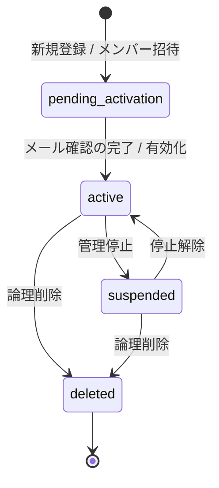
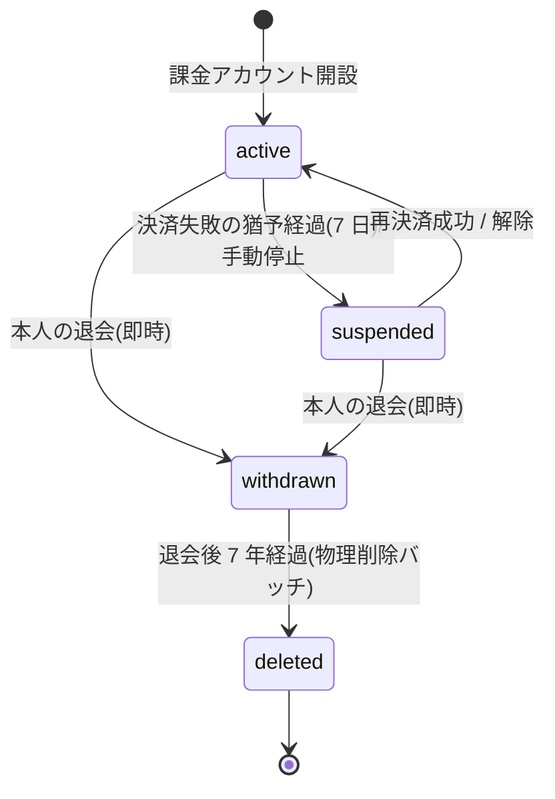
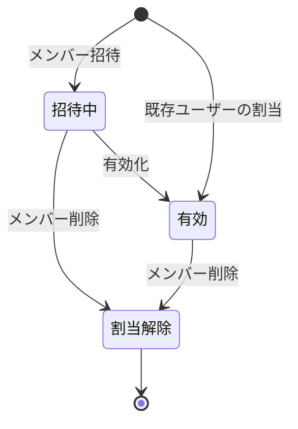
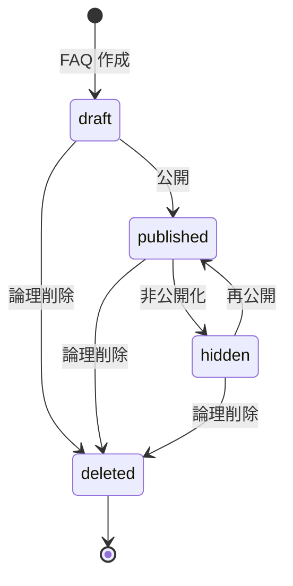
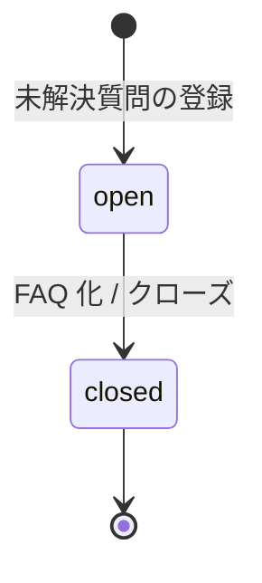

# 状態モデル(正本)

> **このページは、システムが扱う主要な状態(アカウント・課金アカウント・メンバー割当・FAQ/未解決質問)の一覧と遷移を一元管理する正本です。** 各設計書は状態名を本書に統一する。状態値の物理定義(テーブル CHECK 制約)は対応するテーブル設計を正本とし、本書は状態の意味と遷移を示す。

## 1. アカウント状態(`M_USER.status`)

アカウントは、新規登録直後の確認待ちから、メール確認による有効化、停止、論理削除までを 4 状態で表す。物理定義・CHECK 制約は [`M_USER`](02_backend/04_database/TBL-001.md#TBL-001) を正本とする。

| 状態値 | 意味 | 主な遷移契機 |
|----|----|----|
| `pending_activation` | サインアップ済み・メール確認待ち。メンバー招待直後の有効化待ちも含む | 新規登録 / メンバー招待 |
| `active` | 有効。全機能を利用できる | メール確認の完了 / 招待アカウントの有効化 |
| `suspended` | 停止。利用を一時的に制限する | 管理停止 |
| `deleted` | 論理削除。ログインできない | 論理削除 |

## 2. 課金アカウント状態(`M_BILLING_ACCOUNT.status`)

課金アカウントは、有効・サスペンション・退会・削除の 4 状態で表す。決済失敗の猶予は 7 日、退会は即時成立(猶予なし)で退会後のアカウント・請求データは 7 年保持する。物理定義・CHECK 制約は [`M_BILLING_ACCOUNT`](02_backend/04_database/TBL-002.md#TBL-002)、遷移条件は [課金・請求設計 §5](05_billing-design.md#5-課金アカウント状態ライフサイクル) を正本とする。

| 状態値 | 意味 | 主な遷移契機 |
|----|----|----|
| `active` | 有効。全機能を利用でき、ウィジェットは通常応答する | 課金アカウント開設 / 再決済成功 / 猶予中の決済成功 |
| `suspended` | サスペンション中。課金・退会のみ操作でき、作成プロジェクトのウィジェットは機能停止応答を返す | 決済失敗の猶予経過(7 日) / 手動停止 |
| `withdrawn` | 退会済み。本人はログインして請求情報の閲覧のみ行える(請求 7 年保持中) | 本人の退会(即時・猶予なし) |
| `deleted` | 削除済み。ログインできず、識別子は再利用しない | 退会後 7 年経過の物理削除バッチ |

## 3. メンバー割当状態

メンバー割当(ユーザー × プロジェクト)は、招待状態と割当の有効・無効の 2 軸で表す。招待状態は被招待ユーザーの [`M_USER.status`](02_backend/04_database/TBL-001.md#TBL-001)(`pending_activation`=招待中・有効化待ち / `active`=有効)で判定し、割当そのものの有効・無効は [`M_PRJ_USERS.valid`](02_backend/04_database/TBL-003.md#TBL-003)(`1`=有効割当 / `0`=割当解除)で持つ。招待トークンは [`T_ACCESS_TOKENS`](02_backend/04_database/TBL-014.md#TBL-014)(`purpose='activation'`)で保持する。

| 状態値 | 意味 | 主な遷移契機 |
|----|----|----|
| 招待中(`pending_activation`) | 招待済み・有効化待ち。被招待ユーザーが未有効化の割当 | メンバー招待 |
| 有効(`active`) | 有効なメンバー。当該プロジェクトを利用できる | 招待アカウントの有効化 / 既存ユーザーの割当 |
| 割当解除(`valid=0`) | 割当を解除したメンバー。当該プロジェクトを利用できない | メンバー削除 |

## 4. FAQ・未解決質問の状態

FAQ は下書き・公開・非公開・論理削除の 4 状態、未解決質問は対応必要・終了の 2 状態で表す。物理定義・CHECK 制約は FAQ が [`M_FAQS`](02_backend/04_database/TBL-006.md#TBL-006)、未解決質問が [`T_INQUIRIES`](02_backend/04_database/TBL-017.md#TBL-017) を正本とする。

### 4.1 FAQ 状態(`M_FAQS.status`)

| 状態値 | 意味 | 主な遷移契機 |
|----|----|----|
| `draft` | 下書き。利用者には公開しない | FAQ 作成 |
| `published` | 公開中。ウィジェットで利用者に表示する | 公開 |
| `hidden` | 非公開。公開を取り下げた状態 | 非公開化 |
| `deleted` | 論理削除 | 論理削除 |

### 4.2 未解決質問状態(`T_INQUIRIES.status`)

| 状態値 | 意味 | 主な遷移契機 |
|----|----|----|
| `open` | 対応必要。FAQ 登録前の未解決質問 | 未解決質問の登録 |
| `closed` | 終了。対応を完了した | FAQ 化 / クローズ |

