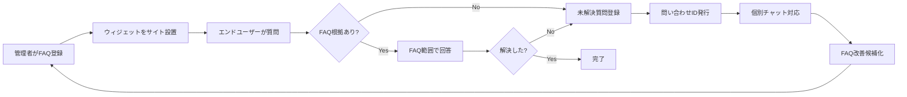

# FAQ AIウィジェット SaaS 顧客管理システム 要件定義書

| 項目 | 内容 |
|---|---|
| 文書種別 | 要件定義書 |
| 版 | v1.0 |
| 対象システム | FAQ AIウィジェット SaaS 顧客管理システム |
| サービス名 | open-faq |
| クラウド前提 | Cloudflare |
| アカウント管理 | 自前アカウント管理 |
| メール配信 | Resend |

---

## 改訂履歴

| 版 | 日付 | 改訂内容 | 改訂者 |
|---|---|---|---|
| 1.0 | 2026-05-17 | 初版作成 | - |

---

## 1. はじめに

### 1.1 本書の目的

本書は、FAQ AIウィジェット SaaS(SaaS=クラウド経由で利用するソフトウェアサービス。以下、本サービス)の要件を定義する文書である。

本サービスを開発・運用するうえで「何を実現するか」を明確にし、後続の基本設計書・詳細設計書の入力資料となることを目的とする。

本書では、技術実装の細かい中身ではなく、**システムで実現すべきこと(WHAT)** を記述する。どの技術をどう使うか(HOW)は、基本設計書および詳細設計書で扱う。

### 1.2 本書の位置づけ

本書は、次の文書群の中で「要件定義」工程の成果物に位置する。

```text
┌─────────────────┐
│  要件定義書(本書) │  ← WHAT(何を実現するか)
└────────┬────────┘
         ↓
┌─────────────────┐
│  基本設計書       │  ← HOW(どう実現するかの全体像)
└────────┬────────┘
         ↓
┌─────────────────┐
│  詳細設計書       │  ← HOW(実装可能な粒度)
└─────────────────┘
```

### 1.3 想定読者

| 読者 | 期待する読み方 |
|---|---|
| プロダクトオーナー | スコープ・優先度の確認、合意形成 |
| 設計者(基本/詳細) | 設計の入力資料、トレース元 |
| 開発者 | 実装すべき要件の確認 |
| QA | 受入条件・テスト観点の確認 |
| 運用担当者 | 運用要件・データ保持要件の確認 |
| 法務/プライバシー担当 | プライバシー要件・規約要件の確認 |

### 1.4 用語と記法

- 「○○できること」は、機能として実装する要件を示す。
- 「○○すること」は、方針・原則・遵守事項を示す。
- 表中の優先度は P0(必須) / P1(高) / P2(中以下)を示す。
- 専門用語は、各章で初めて登場した箇所に丸括弧で短い補足を付す。詳細はカテゴリ別の **付録A 用語集**、50音順での索引は **付録C 用語集** に集約する。略語の一覧は **付録B 略語一覧** を参照する。

### 1.5 サブシステム構成

本サービスは次の 2 サブシステムから成る。

| サブシステム | 主な対象 | 要件定義書 |
|---|---|---|
| メインシステム | 管理者ユーザー向け管理画面、およびエンドユーザー向け FAQ ウィジェット | `01_メインシステム/01_要件定義書.md` |
| 顧客管理システム | サービス運営者(`service_operator`)向け運用コンソール | `02_運営者システム/01_要件定義書.md` |

文書の同期・表記統一・検証に関する保守ルールは、リポジトリ直下の `CLAUDE.md` に置く。

### 1.6 本書のスコープ(MVP のみ)

本書は **MVP 範囲のみ** を記載する。MVP で実現する要件、初期値、受入条件、運用制約だけを本文に置く。

本書に残す情報と移送先は以下のとおりとする。

| 情報種別 | 本書での扱い | 正本 |
|---|---|---|
| 業務・機能・非機能の WHAT | MVP の要求事項、優先度、受入条件のみを記載 | 本書 |
| 方式・状態遷移・画面項目・外部連携方式 | 要件 ID から参照し、詳細な方式は本文に重複掲載しない | [02_基本設計書.md](02_基本設計書.md) |
| API / DDL / JSON Schema / Cron / Queue / 実装パラメータ | 要件本文には置かない | [03_詳細設計書.md](03_詳細設計書.md) |

---

## 2. 業務背景とサービス概要

### 2.1 業務背景

Webサイト運営者は、次のような課題を抱えている。

- 訪問者からの問い合わせ対応コストが増大している
- 回答する人によって品質がばらつく
- 夜間・休日には対応しきれない

これに対し、生成AI(文章を生成するAI)による自動応答は手軽に導入できる反面、社内に存在しない事実を「もっともらしく」回答してしまうリスクがある。これを **ハルシネーション**(AIが事実でない内容を、あたかも事実のように回答してしまう現象)と呼ぶ。誤情報の配信はサポート品質の低下と信頼喪失の原因となる。

本サービスは、この課題に対し「**公開済みFAQ(よくある質問とその回答)に記載された内容のみ**」を根拠にAIが回答する仕組みを提供することで、ハルシネーションを抑えながら問い合わせ自動化を実現する。

回答できなかった質問は、確実に人手による個別対応へ引き継ぎ、その内容を再度FAQに反映するループを回す。これにより、運用とともに自動回答率を高めることを狙う。

### 2.2 サービス概要

本サービスは、Webサイト運営者(管理者)が登録したFAQをもとに、サイト訪問者(エンドユーザー)からの問い合わせに自動応答するSaaSである。

| 観点 | 概要 |
|---|---|
| 提供形態 | クラウドサービス(SaaS) |
| 利用者 | Webサイト運営事業者、その従業員、Webサイト訪問者 |
| 提供価値 | FAQの自動応答、未解決問い合わせの集約と個別対応、FAQ改善ループ |
| 課金 | 従量課金制(利用量に応じて課金) |
| 設置形態 | 利用者サイトへのスクリプトタグ埋め込み(ウィジェット=Webページに埋め込む小さなUI部品) |

### 2.3 サービスの主要バリューチェーン



### 2.4 提供価値の差別化ポイント

| 差別化要素 | 内容 |
|---|---|
| ハルシネーション抑制 | 公開FAQ以外を根拠にしない設計を要件レベルで担保 |
| 未解決質問の確実な収集 | 回答不能を「失敗」ではなく「FAQ改善の入力」として活用 |
| 個別対応との連続性 | 問い合わせIDで個別チャットへスムーズに接続 |
| 運用と改善の循環 | 個別チャット内容をFAQへ昇格させる導線 |
| マルチプロジェクト | 1契約内で複数サイト/製品を並行管理 |

---

## 3. 用語定義

本書で繰り返し登場する主要用語の定義を以下に示す。本一覧の網羅版・カテゴリ別整理は **付録A 用語集**、50音順での索引は **付録C 用語集** に集約する。重複する場合は本表(§3)を正とする。

| 用語 | 定義 |
|---|---|
| 契約 | 本サービスを契約する組織単位。課金・データ分離の単位 |
| 利用者(オーナー / メンバー) | 契約に所属するSaaS利用者の総称。オーナーとメンバーから成る(メインシステム §3 と完全同期) |
| オーナー | 契約作成時に確定する利用者(オーナー / メンバー)で、契約別に 1 名固定。譲渡・降格・停止・削除不可。課金情報の操作・退会申請・規約再同意の承諾はオーナー専有(メインシステム §3 / FR-015a / FR-333 と整合) |
| メンバー | オーナーまたは「ユーザー管理」権限保持者から招待された利用者(オーナー / メンバー)。メンバー権限フラグ 5 種の組み合わせで操作範囲が決まる(メインシステム §3 / §6.2.0 と整合) |
| メンバー権限フラグ | メンバーに個別付与する権限の単位。MVP では「FAQ管理」「個別チャット対応」「ユーザー管理」「プロジェクト設定」「ログ参照」の 5 種(メインシステム §6.2 / §6.2.0 / §8.3 が正本) |
| オーナー専有機能 | メンバー権限フラグでは付与できず、オーナーのみが実行可能な機能。MVP では課金情報の閲覧・変更、月次予算上限変更、支払方法更新、退会申請・解約、規約再同意の承諾を含む(メインシステム §6.2 / FR-015c と整合) |
| プロジェクト | 1契約内でFAQ・ウィジェット・ログを分けて管理する単位(例:製品別、サイト別) |
| エンドユーザー | 管理者のWebサイトを訪問し、ウィジェットで質問する利用者 |
| サービス運営者 | 本SaaSを提供する側の運用担当者 |
| メインシステム | 本サービスのうち、管理者ユーザー向け管理画面およびエンドユーザー向け FAQ ウィジェットを提供するサブシステム |
| 顧客管理システム | 本サービスのうち、サービス運営者(`service_operator`)向けの運用コンソールを提供するサブシステム |
| 問い合わせID | 未解決質問ごとに発行される識別子。個別チャット部屋とエンドユーザー再入室に利用する |
| 未解決質問 | FAQで回答できなかった、またはユーザーが解決できなかった質問の記録 |
| FAQ候補 | 未解決質問のうち、管理者がFAQ化を検討する対象としてマークしたもの |
| 個別チャット部屋 | 問い合わせID単位で作成される対話空間。エンドユーザーと管理者ユーザーがやり取りする |
| ウィジェット | 管理者サイトに埋め込むJavaScriptで動作するUI |
| 質問ログ | エンドユーザーからの質問とその回答結果を記録したもの |
| 参照FAQ | AI回答が引用した公開中FAQ |
| 契約状態 | 契約の利用状態。「利用中」「サスペンション中」「解約手続き中」「解約完了」の 4 区分(メインシステム §3 / §9.10 参照) |
| サスペンション | 契約が課金未納等の事由により機能制限される状態。管理者ログインと請求情報更新は可能だが、ウィジェット応答・新規 FAQ 登録・新規質問受付は停止する(メインシステム §9.10 参照) |
| 信頼度 | AI回答における回答可否判定のスコア |
| 再入室 | エンドユーザーが過去の問い合わせID付きチャットに再度アクセスすること |
| 監査ログ | 重要操作の履歴。改ざん検知可能な形で保持する |
| バウンス | 送信メールが宛先に届かなかったこと |
| 苦情 | 受信者が当該メールをスパムと報告したこと |
| サプレス | 通知停止状態。再送信を行わない |
| 状況(未解決質問の状況) | 未解決質問について、利用者向けに 1 つにまとめた表示用ステータス(=画面に出すための状態区分)。値は「未解決 / 対応中 / 解決済み / 終了」の4種類。内部の案件状態と個別チャットの管理者ユーザー返信有無から派生する読み取り専用の値であり、SCR-011 一覧などで利用者がひと目で確認できるようにするためのもの |
| 対応不要終了 | 管理者ユーザーが、当該未解決質問にこれ以上対応する必要がないと判断したときに、明示的に「終了」状態へ変更する操作。任意で理由を記録できる。自動では行われない |
| ユーザー種別 | アカウントが本サービス上で持つ立場の区分。`admin`(管理者ユーザー)、`end_user`(エンドユーザー)、`service_operator`(サービス運営者)の3種類。本サービスの認可(=操作の可否判定)は、契約境界とユーザー種別を条件として適用する |
| お知らせ | 管理者宛にアプリ内で配信される通知。「請求確定」「運営お知らせ」「システム通知」の3種別を持つ。既存のメール通知と並行して、管理画面内のお知らせ受信箱で閲覧できる |
| お知らせ受信箱(Inbox) | 管理者ごとのお知らせコレクション(=お知らせの集まり)。一覧画面(SCR-021)と詳細画面(SCR-022)から閲覧する |
| お知らせ種別 | 「請求確定」「運営お知らせ」「システム通知」の 3 区分(メインシステム §3 と整合) |
| お知らせ重要度 | 「低」「通常」「重要」「最重要」の 4 段階。一覧の表示順とバッジ強調に反映する。「最重要」はメインシステム §12.5 の正本定義に従い、規約改定・重大セキュリティ通知・サスペンション確定など、管理者全員への強制メール通知が必要な場合に限定する |
| お知らせ既読状態 | 「未読」または「既読」の 2 値。一度既読にしたお知らせを未読に戻す操作は提供しない |

---

## 4. ステークホルダー

| ステークホルダー | 関心事 | 主な関与 |
|---|---|---|
| プロダクトオーナー | サービス価値の最大化、開発投資対効果 | 要件決定、優先度判断 |
| 管理者ユーザー(顧客) | 問い合わせ対応の自動化、運用負荷低減、個別対応の効率化 | サービス利用、フィードバック |
| エンドユーザー | 疑問の早期解決、個別問い合わせの容易さ | サービス利用(間接) |
| サービス運営者 | 安定稼働、不正利用対策、法令遵守 | 運用、監視、保守 |
| 開発者 | 要件の明確さ、実装容易性 | 設計・実装 |
| QA | 検証可能性、受入条件の明確さ | テスト計画・実施 |
| 法務/プライバシー担当 | 規約・プライバシー法令への適合 | 規約整備、対応方針策定 |
| 経営層 | 売上、コスト、リスク | 経営判断 |

---

## 5. システム化の方針

### 5.1 基本方針

本サービスの設計・運用にあたり、次の方針を上位の前提として置く。各方針は、後続の機能要件・非機能要件で具体化する。

| 方針 | 内容 |
|---|---|
| FAQ根拠限定 | AI回答は登録済みかつ公開中のFAQに限定する |
| 推測回答禁止 | FAQにない手順、仕様、価格、期間、原因、対処方法をAIが独自に作成しない |
| 言い換えの範囲明示 | AIはFAQの内容を要約・言い換え・整理できるが、新しい事実・数値・固有名詞・手順を追加しない |
| 未解決の蓄積 | FAQで回答できなかった質問はFAQ改善につなげる |
| 個別対応への接続 | 未解決時は問い合わせID付きの個別チャットへ誘導する |
| 再入室 | 問い合わせIDまたは通知メールから同じチャット部屋へ入れるようにする |
| 管理者確認 | 未解決質問からFAQ登録する場合も、管理者の確認・編集を必須とする |
| エラー分離 | FAQデータ不足とシステム処理エラーを別扱いにする |
| オーナー境界によるデータ分離 | 他契約(=他の契約組織)のデータが論理的にも物理的にも分離されるようにする |
| 最小権限 | 利用者には必要な範囲のみアクセスを許可する(=権限を最小限に絞る原則) |
| プロンプト注入耐性 | エンドユーザーの入力でAIの動作方針が変更されないようにする(プロンプト注入=AIの指示を上書きしようとする入力) |
| 個人情報最小化 | エンドユーザーから取得する個人情報は問い合わせ対応に必要な範囲に限定 |
| プライバシーバイデザイン | 設計初期段階からプライバシー保護を組み込む |
| アクセシビリティ配慮 | エンドユーザー向けUIはアクセシビリティ要件(=高齢者・障害のある利用者にも配慮した利用しやすさの基準)を満たす |
| 日本語対応 | 初期版は日本語 UI / 日本語メールテンプレートで提供する |
| SaaS運用 | 課金、利用量、データ保持、監査、障害対応を考慮する |

### 5.2 対象範囲

| 対象 | 内容 |
|---|---|
| 管理画面 | アカウント、オーナー / メンバー、管理者ユーザー、プロジェクト、FAQ、ウィジェット、質問ログ、未解決質問、個別チャット、課金、設定を管理する |
| 公開ウィジェット | Webサイト訪問者が質問し、FAQに基づくAI回答または個別チャット誘導を受ける |
| 個別チャット部屋 | 問い合わせID単位で、訪問者と管理者ユーザーがやり取りする |
| FAQ改善機能 | 未解決質問からFAQ候補を確認し、FAQ登録できる |
| 通知機能 | チャット投稿や重要な状態変更をメールで通知する |
| 運用機能 | ログ確認、障害対応、データ保持、退会処理、データエクスポート/削除に対応する |

### 5.3 MVP 安全境界

MVP では、AI が FAQ にない情報を作成しないこと、FAQ 公開に管理者確認を必須とすることを安全境界として固定する。

| 項目 | 方針 |
|---|---|
| AIによる独自回答 | FAQにない内容は推測回答しない |
| AIによるFAQ自動公開 | FAQ登録・公開は管理者確認を必須とする |

---

## 6. 利用者と権限

本サービスは、立場の異なる利用者を想定する。「認可範囲(=操作してよい対象の範囲)」は、契約境界とユーザー種別、および利用者(オーナー / メンバー)に付与されたメンバー権限フラグの組み合わせで決定する。利用者(オーナー / メンバー)は「オーナー(1 名固定)」と「メンバー(権限フラグ式)」の 2 区分から成り、ユーザー管理の正本はメインシステム §6 / §8.3 を参照する。

### 6.1 利用者種別

| 利用者 | 説明 | 主な操作 | 認可範囲 |
|---|---|---|---|
| オーナー | 契約作成時に確定する利用者(オーナー / メンバー)(1 名固定) | 契約内全機能、メンバー管理、課金情報操作、退会申請、規約再同意の承諾 | 自契約の全データ。停止・削除・降格・譲渡の対象とはならない |
| メンバー | オーナーまたは「ユーザー管理」権限保持者から招待された利用者 | メンバー権限フラグで許可された範囲。ダッシュボード(自分の通知・お知らせ受信箱)は権限不問 | 自契約のうち、保持する権限フラグで許可された範囲 |
| エンドユーザー | 管理者のWebサイト訪問者 | 質問入力、回答確認、解決可否回答、メール登録、個別チャット利用 | 自分の問い合わせIDに紐づくチャットのみ |
| サービス運営者 | 本SaaS提供者 | 障害対応、不正利用対応、課金確認、監査対応 | 運用に必要な範囲。契約データの中身は原則閲覧しない |

### 6.2 権限マトリクス概要

権限の凡例は **R(参照のみ)/ W(参照および更新)/ A(承認操作 - 別運営者によるレビューが必要)/ −(権限なし)** とする。「必要時のみ」表記は撤廃し、運営者の業務上必要な参照は脚注で例外条件を明示する。利用者(オーナー / メンバー)列はオーナー / メンバーへの細分化がメインシステム §6.2 にて正本管理される。本書では利用者(オーナー / メンバー)列を「利用者(オーナー / メンバー)(オーナー / 該当権限フラグ保持メンバー)」として運営者ロールとの対称配置を保つ。

| 操作分類 | 利用者(オーナー / メンバー) | エンドユーザー | 運営者 |
|---|:---:|:---:|:---:|
| FAQ登録・編集・公開 | W(オーナー / FAQ管理) | − | −[^op-faq] |
| プロジェクト管理 | W(オーナー / プロジェクト設定) | − | −[^op-faq] |
| メンバー招待・権限変更・停止・削除 | W(オーナー / ユーザー管理) | − | − |
| 未解決質問閲覧 | R/W | − | R[^op-incident] |
| 個別チャット返信 | W | W(自分のみ) | W[^op-incident] |
| 課金情報閲覧・変更 | W | − | R[^op-bill] |
| データエクスポート | W | − | −[^op-bill] |
| 監査ログ閲覧 | R(自契約分のみ) | − | R |
| 契約無効化(サスペンション中へ遷移) | − | − | A |
| 契約復元(利用中へ復帰) | − | − | A |
| 契約物理削除 | − | − | A |
| 従量単価表・無料枠の定義および改定 | − | − | A |
| 月次予算上限の設定・変更(自契約分) | W | − | − |
| AI推論パラメータ調整(信頼度・関連度しきい値、モデル切替) | − | − | A |
| 契約別レート制限・予算上限の上書き | − | − | A |
| 緊急契約停止・ウィジェット強制停止 | − | − | A |
| お知らせ受信箱(自契約宛) | R/W | − | − |
| 削除データ参照・復元 | − | − | A |

[^op-faq]: 運営者は FAQ 本文・プロジェクト設定の「更新」権限を持たない。重大インシデント時の参照は監査ログに記録のうえ、§6.2.3 4-eyes 原則の対象操作として実施する。
[^op-incident]: 運営者の未解決質問・個別チャット参照および返信は、利用者からのインシデント報告対応・SLA 違反調査・不正利用調査に限り認める。すべての参照・返信は監査ログに記録し、管理者ユーザーへ運営者操作通知を送信する(§8.20 / FR-211 系)。
[^op-bill]: 運営者は請求情報を **R(参照)** のみ可能とし、変更・代理エクスポートは行わない。管理者ユーザーからの調査依頼を受けた場合に限り §8.18 削除データ参照と同等の手続きで承認する。

権限マトリクス(=操作と利用者の対応表)の詳細は基本設計書・詳細設計書で定義する。

**「緊急区分」の定義(メインシステム要件 §6.2.1 を正本として参照)**:

権限マトリクス上の「緊急時のみ可」操作、および §6.2.3 4-eyes 原則対象操作のうち緊急バイパス(RB-014)を発動する場合の「緊急とみなす状況」は、メインシステム要件 §6.2.1(緊急区分の客観条件)を正本として参照する。本書では二重定義は行わず、顧客管理側の観測点(SCR-093 / SCR-096)・検知ソースを以下に補足する。

| 緊急区分 | メイン §6.2.1 客観条件の概要 | 顧客管理側 検知ソース(補足) |
|---|---|---|
| 区分1: 重大障害 | 連続 5 分以上の本番停止 等 | SCR-096(運営者ダッシュボード)バナー / 連携 IF #2 ヘルスチェック(基本設計 §8.2) |
| 区分2: 全員ロックアウト | 全管理者ユーザーがログイン不能 等 | SCR-093(運営者監査画面)でのロックアウト集約 |
| 区分3: セキュリティインシデント | 不正アクセス、完全性検証失敗 等 | SCR-093 / SCR-099 / セキュリティ監視 |
| 区分4: 法令対応即応 | 規制当局からの照会等 | 法務エスカレーション |

緊急区分の客観条件の正本はメイン要件 §6.2.1、発動条件 4 項目(チケット ID / 2 名承認 / 通知 / 監査ログ)はメイン要件 §6.2.2 を参照(両書共通定義)。検知 → 承認 → 記録の HOW フローおよび SLA は基本設計 §6.2.13(顧客管理側発行責務)を参照。

#### 6.2.3 4-eyes 原則対象操作

不可逆性が高い、または広範囲に影響を及ぼす運営者操作は、申請者と承認者を別運営者とする **4-eyes 原則**(=2 人による相互確認)を適用する。対象操作および承認要件は次のとおり。

| 対象操作 | 申請者 | 承認者 | 承認後の不可逆性 | 関連 FR |
|---|---|---|---|---|
| 契約無効化(利用中 → サスペンション中) | 運営者 | 別運営者 | 解除可(§9.10) | FR-211 系 |
| 契約復元(削除猶予中 → 利用中) | 運営者 | 別運営者 | 解除可 | FR-204 |
| 契約物理削除(解約手続き中 → 解約完了) | 運営者 | 別運営者 | **不可逆** | NFR-707 |
| 従量単価表・無料枠の改定 | 運営者 | 別運営者 | 改定で巻戻し可 | FR-220 系 |
| AI 推論パラメータ変更(信頼度/関連度しきい値、モデル切替) | 運営者 | 別運営者 | 変更で巻戻し可 | FR-061 |
| 契約別レート制限・予算上限の上書き | 運営者 | 別運営者 | 変更で巻戻し可 | FR-220 系 |
| 緊急ウィジェット強制停止 | 運営者 | 別運営者 | 解除可 | FR-211 系 |
| 削除データの復元 | 運営者 | 別運営者 | 復元後の整合性確認要 | FR-204 |
| マスター鍵ローテーション | 運営者 | 別運営者 | 基本設計で定める猶予期間内のみ巻戻し可 | NFR-320 / NFR-321 |
| ハードゲート一時無効化(緊急一時無効化。要件 §6.2.1 区分3 セキュリティインシデント発動時 + §6.2.2 発動条件成立時のみ) | 運営者 | 別運営者 | 切替で巻戻し可、ただしバイパス中の重大操作は不可逆 | FR-226 / §6.2.3(セキュリティ二段ガード) |

**MVP 適用範囲**:

| 区分 | 4-eyes 適用範囲 | 承認手段 |
|---|---|---|
| ハードゲート | ① 契約物理削除(解約手続き中 → 解約完了)、② AI 推論パラメータ変更(信頼度/関連度しきい値・モデル切替)、③ マスター鍵ローテーション | 別運営者の事前承認必須 |
| 承認ログ | その他の上表対象操作 | 単独実行 + 事後レビュー。運営者ダッシュボードで履歴を可視化 |

**自己取下げと他者却下の区別**: 4-eyes 申請は (a) 申請者本人による **自己取下げ**(誤申請の撤回、業務的判断不要)と (b) 別運営者による **却下**(承認すべきでないと判断)を別状態で管理する。両者は監査・KPI 集計で別カウントし、誤申請の検出と業務却下を区別する。

**ハードゲート対象操作の管理(セキュリティ二段ガード)**: MVP ハードゲート対象の 3 操作は基本設計で定める固定リストとして管理し、緊急一時無効化は要件 §6.2.1 区分3 セキュリティインシデント + §6.2.2 発動条件成立時のみ使用する。一時無効化操作自体が 4-eyes 対象(上表 10 行目)であり、誤操作で重大操作が単独実行可能になるリスクを排除する。実装方式は基本設計を正本とする。

---

## 7. 業務要件

### 7.1 業務要件一覧

| ID | 要件 | 優先度 |
|---|---|:---:|
| BR-001 | 管理者は自社サイト向けのFAQを管理できること | P0 |
| BR-002 | 管理者はウィジェットを自社サイトに設置できること | P0 |
| BR-003 | エンドユーザーはウィジェットから質問し、FAQに基づく回答を得られること | P0 |
| BR-004 | FAQ登録済みデータでは回答できない場合、AIは独自回答せず未解決質問として登録できること | P0 |
| BR-005 | 未解決質問には問い合わせIDを発行し、個別チャット部屋へ誘導できること | P0 |
| BR-006 | 個別チャット利用前にメールアドレス登録を必須とすること | P0 |
| BR-007 | 個別チャットに投稿があった場合、メール通知できること | P0 |
| BR-008 | 管理者は未解決質問をFAQ候補として確認できること | P0 |
| BR-009 | 管理者は未解決質問からFAQ登録できること | P0 |
| BR-010 | FAQ登録後、同様の質問に対して新しく登録したFAQを回答根拠にできること | P0 |
| BR-011 | 処理エラー時は未解決質問扱いにせず、エラー表示できること | P0 |
| BR-012 | 管理者は利用量、課金状態、質問ログ、未解決質問、個別チャットを確認できること | P0 |
| BR-013 | オーナーは同一契約のメンバーを招待・更新・停止・削除できること。メンバー権限「ユーザー管理」を持つメンバーも、オーナーを除く対象に対して同等の操作ができること(メインシステム BR-013 と完全同期) | P0 |
| BR-015 | 管理者は契約内のデータをエクスポートでき、退会時に削除されること | P0 |
| BR-016 | 管理者はFAQの登録元(未解決質問発祥か手動登録か)をトレースできること | P1 |
| BR-017 | サービス運営者は不正利用・濫用を検知して対処できること | P0 |
| BR-018 | サービス運営者はSaaS全体の利用状況を把握できること | P0 |
| BR-019 | 管理者ユーザーは、未解決質問について現在の状況(未解決 / 対応中 / 解決済み / 終了)を一覧および詳細で識別できること。状況は内部状態(案件状態・個別チャットでの管理者ユーザー返信有無)から派生して表示する | P0 |
| BR-020 | 管理者は、対応不要と判断した未解決質問を「終了」状態に明示的に設定できること。設定時には任意で理由を記録でき、誰がいつ終了させたかをトレースできること。「終了」設定は管理者のみが可能で、自動遷移しないこと | P0 |
| BR-021 | 管理者は、月次の請求が確定したタイミングで請求内容(対象期間・請求金額・内訳)をメールで受け取れること | P0 |
| BR-022 | サービス運営者は、メンテナンス予告・機能追加・規約改定・価格改定などのお知らせを、全契約または特定契約の管理者ユーザーにメールで通知できること | P0 |
| BR-023 | 管理者は、運営からのお知らせ・月次請求確定通知・システム通知を、管理画面内のお知らせ受信箱で一覧および詳細表示できること | P0 |
| BR-024 | 管理者は、お知らせを既読/未読で管理でき、個別および一括での既読化操作ができること | P0 |
| BR-025 | 管理者は、お知らせを種別および期間で絞り込めること | P1 |
| BR-026 | 管理画面のヘッダから、お知らせの未読件数(バッジ)および直近のお知らせを把握でき、ワンクリックで一覧画面へ遷移できること | P0 |
| BR-027 | 月次請求の確定および運営お知らせの配信が発生したタイミングで、対象管理者のお知らせ受信箱に該当お知らせが生成されること(既存のメール通知に加えて) | P0 |
| BR-028 | サービス運営者は、内部統制(セキュリティ・コンプライアンス・障害対応・課金正確性)を担保するために必要な運用機能(監査ログ閲覧、削除データ復元、4-eyes 原則対象操作、契約単位の運営者操作通知など)を持つこと | P0 |

### 7.2 主要業務シナリオ

本節では、利用者ごとの典型的な操作の流れを示す。各シナリオは個別の機能要件(8章)と対応している。

#### 7.2.1 FAQ整備〜公開シナリオ

1. 管理者が自社FAQを本サービスに登録する。
2. 管理者は内容を確認し、FAQを「公開」状態に変更する。
3. 公開されたFAQは、AI回答の根拠として利用可能になる。

#### 7.2.2 ウィジェット設置シナリオ

1. 管理者はプロジェクトを作成する。
2. 管理者は許可ドメイン(=ウィジェットの動作を許すサイトのドメイン)を設定する。
3. 管理者は埋め込みコードを取得し、自社サイトに貼り付ける。
4. ウィジェットは許可ドメイン上でのみ動作する。

#### 7.2.3 エンドユーザー質問シナリオ(回答可能)

1. エンドユーザーがウィジェットを開く。
2. 質問を入力する。
3. システムは公開FAQから根拠を検索する。
4. 根拠がある場合、FAQの内容に沿って回答する。
5. 参照したFAQをエンドユーザーに提示する。
6. エンドユーザーは「解決した」「解決しなかった」を選択できる。

#### 7.2.4 エンドユーザー質問シナリオ(回答不能)

1. エンドユーザーがウィジェットを開き、質問を入力する。
2. システムは公開FAQから根拠を検索するが、根拠がない、不足、または矛盾と判定する。
3. AIは独自回答を作成しない。
4. システムは未解決質問として登録し、問い合わせIDを発行する。
5. システムはエンドユーザーにメールアドレスの登録を促す。
6. エンドユーザーがメール登録を完了すると、個別チャット部屋が利用可能になる。
7. 投稿があると、相手にメール通知される。

#### 7.2.5 FAQ改善シナリオ

1. 管理者は未解決質問の一覧を確認する。
2. 改善対象を選び、未解決質問の詳細と個別チャットの内容を確認する。
3. 「FAQ登録」操作により、質問文と回答文を含むFAQ作成画面へ遷移する。
4. 管理者は内容を確認・編集のうえ、公開状態を選択して登録する。
5. 未解決質問の対応状態が「FAQ登録済み」に更新される。
6. 以降、同様の質問に対しては新しいFAQが回答根拠として利用される。

---

## 8. 機能要件

### 8.1 機能一覧

機能要件は、P0〜P2の優先度(P0=必須、P1=高、P2=中以下)を持つ。詳細はセクション8.2以降に示す。

各 FR-XXX は派生元の業務要件(BR-XXX)を持つこと。派生元 BR が無い運営者責務系の FR は、§7.1 BR-028(運営者の内部統制要件)に紐付ける。

| グループ | 概要 | 派生元BR |
|---|---|---|
| アカウント管理 | 登録、ログイン、再認証、パスワード再設定、退会 | BR-013, BR-015 |
| 管理者ユーザー管理 | 登録、登録完了、有効化、更新、停止、削除 | BR-013 |
| プロジェクト管理 | 作成、編集、削除、ドメイン設定、ウィジェット設定 | BR-001, BR-002 |
| FAQ管理 | 登録、編集、状態管理、検索、カテゴリ | BR-001, BR-009, BR-010, BR-016 |
| AI回答 | FAQ根拠回答、判定、ログ | BR-003, BR-004, BR-010 |
| 未解決質問登録 | 自動登録、状態管理、FAQ候補化 | BR-004, BR-005, BR-008, BR-019, BR-020 |
| 個別チャット | 部屋作成、メール登録、投稿、通知、再入室 | BR-005, BR-006, BR-007 |
| 未解決からFAQ登録 | 質問初期化、編集、登録、トレース | BR-009, BR-016 |
| 処理エラー | エラー判定、表示、再試行 | BR-011 |
| 利用量・課金 | 集計、上限、請求 | BR-012, BR-021 |
| 管理ダッシュボード | KPI表示 | BR-012, BR-018 |
| 通知 | 送信、再送、停止、配信状態管理 | BR-007, BR-021, BR-022 |
| ウィジェット | 設置、表示、許可ドメイン、テーマ | BR-002 |
| プライバシー・データ管理 | エクスポート、退会、規約再同意 | BR-015 |
| セキュリティ | 暗号化、レート制限、ドメイン検証、監査 | BR-017, BR-028 |
| お知らせ受信箱 | 種別管理、既読/未読、フィルタ、ヘッダバッジ | BR-023, BR-024, BR-025, BR-026, BR-027 |
| 削除データ参照・復元(運営者専用) | 検索、参照、復元、4-eyes 承認 | BR-014, BR-028 |
| 運営者の責務 | 不正検知、運営者操作通知、AI 推論パラメータ管理、サスペンション制御 | BR-017, BR-018, BR-022, BR-028 |

#### 8.1.1 FR 欠番一覧

本書の FR 番号は連番ではなく、メインシステム要件書 §8.1.1 と整合する形でブロック予約をしている。後続工程の設計者が「未記載要件があるのでは」と疑念を持つ手戻りを避けるため、欠番の理由を以下に明示する。**メインシステム側で正本管理する FR(本書未掲載)も併記し、両書の連番を完全に把握できるようにする**。

| 欠番範囲 | 理由分類 | 補足 |
|---|---|---|
| FR-012〜014 | 未使用 | 本書では要件なし |
| FR-023〜029 | 未使用 | 本書では要件なし |
| FR-037〜039 | 未使用 | 本書では要件なし |
| FR-049 | 未使用 | 本書では要件なし |
| FR-068, FR-069 | 未使用 | FR-061〜067 は本書で正本管理済 |
| FR-092〜099 | 未使用 | 本書では要件なし |
| FR-107〜109 | 未使用 | 本書では要件なし |
| FR-110〜114 | **メイン側で正本管理**(本書未掲載) | 処理エラー分類体系(メイン §8.10) |
| FR-115〜119 | 未使用 | 本書では要件なし |
| FR-120〜139 | **メイン側で正本管理**(本書未掲載) | 利用量・課金本体(メイン §8.11.1)。本書は §8.11 で課金プロバイダ連携の正本管理に分割(FR-300 系) |
| FR-130〜135 | **メイン側で正本管理** | 管理ダッシュボード(メイン §8.12) |
| FR-136〜139 | **メイン側で正本管理** | 課金処理本体(メイン §8.11)。本書 FR-302〜304 が顧客管理側の課金プロバイダ連携正本 |
| FR-140 注記 | メイン側で正本管理 | 通知本体は本書 §8.13 で正本管理だが、FR-140 はメイン §8.13 に存在し顧客管理側と整合 |
| FR-157〜159 | 未使用 | 本書では要件なし |
| FR-167〜169 | 未使用 | FR-160〜166 で正本管理済 |
| FR-193〜199 | **メイン側で正本管理** | FR-193 (API キーローテーション)、FR-194 (公開キー再発行)、FR-195 (不正利用検知) |
| FR-213〜219 | 未使用 | FR-200〜212 が正本 |
| FR-233〜259 | 未使用 | FR-220〜232 が正本 |
| FR-260〜299 | 未使用 | 本書では要件なし |
| FR-301 | 未使用 | 本書では要件なし |
| FR-311〜340 | 未使用 | 本書では要件なし |
| FR-330〜335 | **メイン側で正本管理**(セキュリティ追加要件) | IP 許可リスト(FR-330)・海外 IP 遮断(FR-331)・複数デバイス(FR-332)・orphan admin(FR-333)・自己利用状態変更不可(FR-334)・管理者ユーザー単一契約所属(FR-335) |
| FR-340〜342 | **メイン側で正本管理** | AI 拡張(FR-340 ストリーミング、FR-341 しきい値即時反映・縮退運転、FR-342 プロンプトテンプレ編集) |

**本書側で正本管理する FR 範囲の確定**(2026-05-13 改訂):

| 範囲 | 用途 | 正本 |
|---|---|---|
| FR-200〜212 | 運営者削除データ参照・復元 | 本書 §8.17 |
| FR-220〜232 | 運営者ロール・MFA・監査・SLA | 本書 §8.18 |
| FR-300〜310 | 課金プロバイダ Webhook・連携 IF・月次請求確定 | 本書 §8.19 |
| FR-061〜067 | AI 推論パラメータ設定の運営者側正本 | 本書 §8.7 |
| FR-064(b)(c)(d) | PII 誤検出ルール管理 | 本書 §8.16 |

**メインシステム要件書側との連番整合**(§1.5 検査項目 4 「同一 ID の重複定義検出」と整合):

両書で同一 FR 番号が異なる定義に使われていないことはリポジトリの文書保守ルールで検証する。新規採番時は本表を参照し、両書間の正本範囲に応じて採番先を選ぶ。

### 8.2 アカウント管理

| ID | 要件 | 優先度 |
|---|---|:---:|
| FR-001 | 管理者はメールアドレスとパスワードでアカウント登録できること | P0 |
| FR-002 | 登録時に利用規約とプライバシーポリシーへの同意を取得できること | P0 |
| FR-003 | メールアドレス確認(本人確認メール)ができること | P0 |
| FR-004 | ログイン、ログアウト、パスワード再設定ができること | P0 |
| FR-005 | 重要操作(パスワード変更、退会、課金情報変更、管理者ユーザー登録・停止・削除、月次予算上限変更)前に本人確認(再認証)を求めること。再認証方式は **MVP ではパスワード再入力**。**運営者は FR-222 のとおり MVP から MFA 必須**。再認証の有効期間は **当該操作 1 回のみかつ 15 分以内**とし、実装方式は基本設計を正本とする(メインシステム FR-005 と整合) | P0 |
| FR-006 | パスワードに最低長・複雑性要件を適用できること(最低 12 文字、英大文字・小文字・数字・記号のうち 3 種類以上)。パスワードリセットリンクの有効期限は **1 時間**(メインシステム FR-006 と整合) | P0 |
| FR-007 | ログイン試行の失敗回数制限ができること。**5 回連続失敗** で **15 分間ロック**し、時間経過または管理者解除で復旧できること。ロック単位、通知経路、監査記録の方式は基本設計を正本とする(メインシステム FR-007 と整合) | P0 |
| FR-008 | セッションタイムアウトを以下のとおり実装すること: (a) **無操作タイムアウト 30 分**、(b) **絶対タイムアウト 12 時間**(メインシステム FR-008 と整合) | P0 |
| FR-009 | 退会できること(猶予期間付き) | P0 |
| FR-011 | 利用規約・プライバシーポリシー改定時に再同意を取得できること | P0 |

### 8.3 ユーザー管理(オーナー + メンバー)

本節はメインシステム §8.3 がユーザー管理の機能要件正本であり、本書は参照側として整合を維持する。実装はメインシステムが担う。新規 ID(FR-015a〜c / FR-016a〜c / FR-018a〜b / FR-021a〜c / FR-336〜338)の定義はメインシステムを参照する。

| ID | 要件 | 優先度 |
|---|---|:---:|
| FR-015 | オーナーおよびメンバー権限「ユーザー管理」保持者は、メールアドレス、氏名、付与するメンバー権限フラグ(0〜5 個)を指定して同一契約へメンバーを招待できること(メインシステム FR-015 と整合) | P0 |
| FR-016 | 招待されたメンバーは招待リンクからアカウントを有効化できること。招待リンクの有効期限は **MVP 初期値 7 日**。期限切れの場合はオーナーまたは「ユーザー管理」保持者が再送信する(メインシステム FR-016 と整合) | P0 |
| FR-017 | 利用者(オーナー / メンバー)は同一契約内のオーナーおよびメンバーの一覧および詳細を参照できること(メインシステム FR-017 と整合) | P0 |
| FR-018 | オーナーおよび「ユーザー管理」保持者は、同一契約内のメンバーの氏名、メールアドレス、通知設定、利用状態を更新できること(メインシステム FR-018 と整合) | P0 |
| FR-019 | オーナーおよび「ユーザー管理」保持者は、同一契約内のメンバーを停止・削除できること。オーナーは停止・削除の対象外とする(メインシステム FR-019 / FR-333 と整合) | P0 |
| FR-020 | 招待リンクには有効期限を設けること | P0 |
| FR-021 | メンバー数の **ハード上限は NFR-113(管理者ユーザー 100 名/契約)に従う** ものとし、利用量しきい値(80%=80 名で警告、100%=登録拒否)に基づいて上限接近・超過を検知し、オーナーおよび「ユーザー管理」保持メンバーへアラート通知できること。ハード上限の引上げは運営者承認(§6.2.3 4-eyes 対象)で個別契約単位に上書き可能とすること(メインシステム FR-021 / FR-021a と整合) | P0 |

### 8.4 プロジェクト管理

| ID | 要件 | 優先度 |
|---|---|:---:|
| FR-030 | 管理者はプロジェクトを作成、編集、削除できること | P0 |
| FR-031 | プロジェクトごとにウィジェット設定を管理できること | P0 |
| FR-032 | プロジェクトごとにFAQ、質問ログ、未解決質問、個別チャットを分けて管理できること | P0 |
| FR-033 | 許可するWebサイトのドメインを複数設定できること | P0 |
| FR-034 | プロジェクト削除時の関連データ(FAQ、ログ、チャット)の取扱いを利用者が確認・選択できること | P0 |
| FR-035 | プロジェクト数の **ハード上限は NFR-113(プロジェクト 50 / 契約)に従う** ものとし、加えて利用状況を監視し急激な増加(不正利用兆候)を検知して管理者へ通知できること。ハード上限の引上げは運営者承認(§6.2.3 4-eyes 対象)で個別契約単位に上書き可能。検知ロジック、通知経路、バッチ失敗時の扱いは基本設計 / 詳細設計を正本とする | P1 |
| FR-036 | プロジェクトをアーカイブ状態にできること(削除せず利用停止) | P1 |

### 8.5 FAQ管理

| ID | 要件 | 優先度 |
|---|---|:---:|
| FR-040 | FAQを登録、編集、削除できること | P0 |
| FR-040b | FAQ・プロジェクト・管理者ユーザー・お知らせ・契約の削除は管理画面から復元できないこと(誤削除時はサポート窓口経由でのみ救済される) | P0 |
| FR-041 | FAQに質問文と回答文を登録できること | P0 |
| FR-042 | FAQを下書き、公開中、非公開の状態で管理できること | P0 |
| FR-043 | FAQをカテゴリで整理できること | P1 |
| FR-044 | FAQの検索、並び替え、絞り込みができること | P1 |
| FR-045 | FAQの公開前に管理者が内容を確認できること | P0 |
| FR-046 | FAQ件数および1件あたりの文字数の上限は契約共通の基準とし、極端に大きい場合は警告または登録拒否できること | P0 |
| FR-047 | FAQ更新時、楽観ロックで競合を検出できること | P1 |
| FR-048 | FAQの登録元(未解決質問IDまたは手動登録)を保持できること。保持項目、表示箇所、削除済み派生元の扱いは基本設計 / 詳細設計を正本とする | P1 |

### 8.6 AI回答

#### 8.6.1 AI スコアリング定義(参照)

信頼度・関連度の意味、MVP 初期値、設定階層は **メインシステム §8.6.1 が正本**である。本書からはそれを参照すること(同一表を両書に重複掲載しない)。算出方式、適用順位、矛盾検知方式、キャッシュ方式は基本設計 / 詳細設計を正本とする。

要点(詳細はメインシステム §8.6.1):

- 関連度 = 質問に該当する FAQ が存在するかを判定する指標、初期値 0.50
- 信頼度 = AI 回答を確定回答として提示してよいかを判定する指標、初期値 0.60
- 階層: グローバル < オーナー < プロジェクト(より具体的な設定が優先)
- 動作ルールはメイン側 FR-055 / 基本設計 §6.4 を参照
- 矛盾検知の MVP 方式は基本設計を参照

#### 8.6.2 機能要件

| ID | 要件 | 優先度 |
|---|---|:---:|
| FR-050 | エンドユーザーの質問に対し、公開中の登録済みFAQのみを根拠として回答できること | P0 |
| FR-051 | FAQに根拠がない内容をAIが独自に作成しないこと | P0 |
| FR-052 | AIはFAQの内容を要約・言い換え・整理・体裁整形(箇条書き化、敬体化、用語統一)できるが、参照FAQに含まれない事実・数値・固有名詞・日付・金額・期間・手順を追加・補完しないこと。略語の展開・複数FAQの統合は、参照FAQ内に明示的根拠がある場合のみ許可する | P0 |
| FR-053 | 回答に利用したFAQを記録し、利用者にも参照FAQを提示できること | P0 |
| FR-054 | 関連度しきい値を超えるFAQが2件以上選定された場合、それらの間で数値・固有名詞・手順の食い違いを検出し、矛盾と判定した場合はAI整形を行わず未解決質問として登録できること。判定アルゴリズムは運営者が調整可能な検出ルールに従い、検出時は質問ログに矛盾理由を記録できること。理由コード体系は基本設計を正本とする | P0 |
| FR-055 | 回答可否判定の信頼度しきい値およびFAQ検索の関連度しきい値を、運営者がグローバル/契約別/プロジェクト別の3階層で調整できること。設定値は保存と同時に有効化されること(再起動・再デプロイを要しない)。管理者ユーザーは自オーナー値の参照のみ可能とし、変更はできないこと | P1 |
| FR-056 | FAQ登録済みデータでは回答できなかった場合、未解決質問登録と個別チャット誘導を行えること | P0 |
| FR-057 | 処理エラーの場合は、未解決質問登録ではなくエラー表示を行えること | P0 |
| FR-058 | エンドユーザー入力により、AIの動作方針(FAQ限定回答方針)が変更されないこと(プロンプト注入耐性) | P0 |
| FR-059 | 利用する AI モデルや基盤の変更時に動作確認・切替を運営者が行えること。詳細な品質劣化判定基準・ロールバック条件は **メインシステム FR-059** および基本設計 / 詳細設計を正本とし、本書側では MVP の標準テストデータセット(FAQ × 想定質問 50 組以上)の管理を担うこと(FR-066 と整合) | P1 |
| FR-060 | AI 回答およびチャット投稿(エンドユーザー側・管理者ユーザー側双方)に対し、出力前に検査を行い、(a) 参照 FAQ 外の固有名詞・数値・手順を検出した AI 回答は返却せず未解決登録に倒すこと、(b) 個人情報(氏名・住所・電話番号・メールアドレス・クレジットカード番号・マイナンバー・銀行口座番号)を検出し、検出時は **`[情報型]` 形式**(例: `[電話番号]`)でマスキングして返却し、監査ログに検出種別を記録できること、(c) 管理者ユーザー投稿時は警告と再確認ダイアログを表示し「そのまま送信」オプションを提供できること、(d) エンドユーザー投稿時は警告のみ表示し送信を阻害しないこと。検出層の構成は基本設計を正本とする(メインシステム FR-060 と整合) | P0 |
| FR-061 | 信頼度しきい値・関連度しきい値を運営者が **グローバル / 契約別 / プロジェクト別の 3 階層**で調整できること。優先順位は **プロジェクト > オーナー > グローバル**(より具体的な設定が優先)。設定値は保存と同時に有効化されること。MVP 初期値は信頼度 0.60、関連度 0.50 とし、入力範囲・刻み・反映方式は基本設計 / 詳細設計を正本とする(メインシステム FR-055 と整合) | P1 |
| FR-062 | 複数のFAQを根拠として回答する場合、参照FAQの優先順位(関連度スコア降順)に従って文と根拠FAQの対応関係を保持し、エンドユーザー画面では最大3件まで参照FAQを提示できること。引用文ごとに対応するFAQ IDを内部的に保持し、質問ログから参照FAQごとの該当箇所をトレースできること | P1 |
| FR-063 | プロンプト注入耐性の検証として、既知の代表的な攻撃ベクタ(**役割再定義 / タグ脱出 / コード注入 / 言語切替誘導 / 指示上書き / ロール変更要求 / システムプロンプト開示要求 / 参照 FAQ 外の事実回答誘導 / 機密情報抽出誘導**)に対する回帰テストセット(最低 20 ケース)を運営者が保守できること。テストセットは **四半期ごとに更新**し、追加された新規攻撃パターンを反映すること。AI モデルまたはプロンプトテンプレート変更時、本テストセットを CI もしくはステージング環境で実行し、全件で「FAQ 限定回答方針」が維持されることを確認できること(NFR-318 / メインシステム FR-058 と整合) | P0 |
| FR-064 | 個人情報マスキング検出器の検出失敗および誤検出に対する救済として、(a) 検出器がエラー時は安全側に倒すこと、(b) 管理者ユーザー画面で「誤検出として報告」操作を提供し、報告は運営者ダッシュボードに集約されること、(c) 運営者は集約された誤検出報告を参照し、検出ルールを更新できること、(d) ルール更新後、**既にマスキングされた過去データの修正は行わない**(更新は今後の検出のみに適用)こと、(e) 誤検出報告フローはメインシステム FR-060 と整合し、管理者ユーザーまたは運営者経由で受け付けること。ルール更新方式は基本設計を正本とする | P1 |
| FR-065 | AI モデルまたは AI 推論基盤実装を切り替える際、運営者は (a) 品質回帰テスト(直近 30 日の質問ログから抽出した代表サンプル 100 件以上を再実行)、(b) 回答率・解決率・矛盾率の比較レポート生成、(c) 段階的ロールアウト(0% → 10% → 50% → 100%)、(d) 任意時点で旧モデルへロールバックできる手段を備えること。切替の各段階は監査ログに記録できること | P1 |
| FR-066 | AI回答の品質を継続的に観測するため、回答可能率、解決率、矛盾理由の分布、AI出力検査における個人情報検出件数、参照FAQ数の分布を運営者ダッシュボードで時系列確認できること。期間は 1日 / 7日 / 30日 で切替可能とすること。理由コード体系は基本設計を正本とする | P1 |
| FR-067 | AI推論基盤の障害発生時、未解決質問登録ではなく処理エラー(FR-110)として扱えること。エラー応答にはユーザー向け文言(「現在AI回答を生成できません。しばらく経ってからお試しください」)と再試行案内を含めること(FR-057と整合)。障害判定方式は基本設計を正本とする | P0 |

### 8.7 未解決質問登録

| ID | 要件 | 優先度 |
|---|---|:---:|
| FR-070 | FAQ登録済みデータでは回答できなかった質問を未解決質問として登録できること | P0 |
| FR-071 | ユーザーが「解決しなかった」を選択した場合、未解決質問として登録できること | P0 |
| FR-072 | 未解決質問には、元の質問、回答不可理由、発生日時、関連プロジェクト、関連質問ログIDを記録できること | P0 |
| FR-073 | 未解決質問には問い合わせIDを付与できること | P0 |
| FR-074 | 未解決質問を対応状態(未対応/解決済み/終了/FAQ登録済み)で管理できること。「終了」状態への変更は管理者ユーザーのみが行えること | P0 |
| FR-075 | 未解決質問をFAQ候補状態(未候補/候補/下書き作成済み/FAQ登録済み)で管理できること | P0 |
| FR-076 | 未解決質問に担当管理者ユーザーを割り当てられること | P0 |
| FR-077 | 未解決質問の状態変更履歴を残せること | P1 |
| FR-078 | 未解決質問について、現在の状況(未解決 / 対応中 / 解決済み / 終了)を一覧画面・詳細画面で確認できること。状況は永続値ではなく、案件状態と個別チャットの管理者ユーザー返信有無から派生させる | P0 |
| FR-079 | 管理者ユーザーは、対応不要と判断した未解決質問を「終了」操作で明示的に終了できること。終了時には任意で理由を記録でき、誰がいつ終了させたかを記録できること。終了状態の自動遷移は行わない | P0 |

### 8.8 個別チャット

| ID | 要件 | 優先度 |
|---|---|:---:|
| FR-080 | 問い合わせIDごとに個別チャット部屋を作成できること | P0 |
| FR-081 | エンドユーザーを個別チャット部屋へ誘導できること | P0 |
| FR-082 | 個別チャット利用前にメールアドレス登録を必須とすること | P0 |
| FR-083 | エンドユーザーは問い合わせIDまたは通知メールから同じチャット部屋へ再入室できること | P0 |
| FR-084 | 再入室の際、本人性を確認できる仕組み(メール送信トークン、有効期限付きリンク)を設けること。**トークン有効期限は MVP 初期値 30 日**。期限切れトークンでアクセスした場合はメール再送リンクから新規トークンを発行できる。同一メールアドレスで複数の問い合わせ ID がある場合は問い合わせ ID を識別できること(メインシステム FR-084 と整合) | P0 |
| FR-085 | エンドユーザーはチャットにメッセージを投稿できること | P0 |
| FR-086 | 管理者ユーザーはチャットに返信できること | P0 |
| FR-087 | チャット投稿時に相手側へメール通知できること | P0 |
| FR-088 | チャット部屋(オープン/クローズ)と問い合わせ案件の対応状態を分けて管理できること。誤クローズや再対応が必要となった場合のリカバリ手段として、管理者はクローズ済みの部屋を再オープンできること(運用判断、監査ログに記録) | P0 |
| FR-089 | 個別チャットの部屋状態(オープン / クローズ)を一定期間返信がない場合に自動でクローズへ切り替えるフローを提供すること。「返信なし」の定義および各段階のタイミング・自動クローズ後の再入室・通知メール失敗時の再送ポリシーは **メインシステム FR-089 を正本** とし、本書からはそれを参照する。要点: 段階 1=7 日(誰からも投稿なし、管理者へ保留確認)、段階 3=7 日(利用者待ち判定後にエンドユーザーから投稿なし)、段階 5=3 日(最終確認後にエンドユーザーから投稿なし)。自動クローズ後 30 日以内は同一部屋の再オープンが可能。通知メールバウンス時は 24 時間後に 1 回再送、最終失敗時は管理者にシステム通知のお知らせを生成し自動クローズ判定をスキップする。未解決質問の「終了」状態への自動遷移は行わない(管理者明示操作のみ) | P1 |
| FR-090 | チャット投稿に上限文字数および投稿頻度制限を設定できること | P0 |
| FR-091 | 機密情報(パスワード、決済情報等)入力を控えるよう注意喚起すること | P0 |

### 8.9 未解決質問からFAQ登録

| ID | 要件 | 優先度 |
|---|---|:---:|
| FR-100 | 管理者は未解決質問からFAQ登録画面へ遷移できること | P0 |
| FR-101 | 未解決質問の内容をFAQの質問文に初期反映できること | P0 |
| FR-102 | 個別チャットでの回答内容をFAQ回答文の参考にできること。MVP は管理者の手動選択のみとし、プリフィル、派生元保持、参照不可時の扱いは基本設計 / 詳細設計を正本とする | P1 |
| FR-103 | FAQ登録前に管理者が質問文、回答文、公開状態を確認・編集できること | P0 |
| FR-104 | AIが未解決質問からFAQを自動公開しないこと | P0 |
| FR-105 | FAQ登録後、未解決質問をFAQ登録済み状態に更新できること | P0 |
| FR-106 | 未解決質問から登録先FAQを参照できること | P1 |

### 8.10 処理エラー

| ID | 要件 | 優先度 |
|---|---|:---:|
| FR-110 | 通信エラー、タイムアウト、想定外エラー時はエラー表示できること | P0 |
| FR-111 | 処理エラーは未解決質問として自動登録しないこと | P0 |
| FR-112 | 一時的なエラーでは再試行案内を表示できること | P0 |
| FR-113 | 予期しないエラーは運用確認できるように記録できること。記録項目、保持先、通知しきい値、ログ書き込み失敗時の扱いは基本設計 / 詳細設計を正本とする | P0 |
| FR-114 | エラー記録には個人情報を含めないこと | P0 |

### 8.11 利用量・課金

本サービスの課金モデルは **完全従量課金制 + 月次無料枠** とする。プラン体系(月額固定)は採用せず、契約は使った分だけ課金される。月次無料枠を超過した分のみ単価課金する構造を取り、管理者ユーザーは予算上限(円)を任意に設定して暴走コストを防止できる。利用量超過時の三段階対応(80% / 100% / 125%、FR-122)は予算上限(円)に対して適用する。

#### 8.11.1 課金単位・計測・月次起点(参照)

課金単位・計測タイミング・失敗時扱い・月次起点・丸めルール・月次請求確定処理の冪等性・トライアル期間・支払い失敗リトライ等の **課金共通定義はメインシステム §8.11.1 が正本** である。本書からはそれを参照すること(同一表を両書に重複掲載しない)。

要点(詳細はメインシステム §8.11.1):

- **MVP 無料枠初期値**: 質問 1,000 件/月、FAQ 100 件、個別チャット 30 部屋/月。AI 利用コストはサービス側吸収(MVP)
- **月の境界**: JST 月初 〜 月末。無料枠は暦月でリセット
- **月次確定の冪等性**: 契約・請求月の組合せ単位で冪等。具体的な冪等キー構成は基本設計を正本とする
- **トライアル**: MVP 初期値 14 日間、終了日翌日に支払方法未登録の場合は自動サスペンション
- **質問数 100% 超過**: 拒否ではなく事後課金(エンドユーザー体験を優先)。FAQ・個別チャットは 100% 超過で新規作成を拒否

| ID | 要件 | 優先度 |
|---|---|:---:|
| FR-120 | 質問回数、回答回数、未解決質問数、個別チャット数、AI利用コスト(内部原価)を集計できること | P0 |
| FR-121 | 管理者ユーザーは自契約の **月次予算上限(円)** を任意に設定できること。(a) 予算上限の単位は 1 円刻みとし、最低額・最高額の入力ガードを設ける、(b) 未設定時は運営者が定義する全契約共通のデフォルト推奨値を適用し、青天井とならないこと、(c) 運営者は契約単位で予算上限の上書き(エンタープライズ向け臨時引き上げ等)を設定でき、上書き設定は理由・対応チケットIDとともに監査ログに記録すること。優先順位は「アカウント設定(オーナー設定) > 運営者上書き > デフォルト推奨値」とし、保存・反映方式は基本設計を正本とすること | P0 |
| FR-122 | 月次予算上限(円)に対し以下の三段階で対応できること: (a) 80%到達(警告)ではシステム通知のお知らせを管理者ユーザーの受信箱に生成し、メール通知できること(オプトアウト不可)、(b) 100%到達(上限)では課金対象機能(ウィジェット質問受付・新規個別チャット作成・FAQ 新規登録)を一括停止し、エンドユーザー向けには安全なメッセージを表示できること、(c) 125%到達(超過)は集計遅延・誤差対策の最終ガードとして位置づけ、追加の利用制限(管理者ユーザー登録停止等)を発動し、管理者ユーザー・運営者の双方に高重要度通知を送信すること。応答方式は基本設計を正本とする | P0 |
| FR-123 | 請求状態を管理画面で確認できること | P0 |
| FR-124 | 課金プロバイダから支払い失敗イベントを受信した場合、(a) 受信日から7日間(メインシステム FR-137 / §9.10 と整合)の猶予期間中は管理者ユーザーにメールおよび受信箱で再支払い依頼を通知できること、(b) 猶予期間中は再決済リトライを実施できること、(c) 猶予期間経過後は契約状態をサスペンション中へ遷移させ、ウィジェット稼働を停止すること、(d) サスペンション中も管理者ユーザーは管理画面の課金画面・データエクスポート画面・退会画面のみアクセス可能とすること、(e) 支払い完了イベント受信時に自動的に利用中状態へ復旧できること。通知頻度・リトライ回数・復旧方式は基本設計を正本とする | P0 |
| FR-125 | 予算上限・予算アラートの設定変更、および利用契約の解約申請ができること(再認証必須)。MVP では月途中の日割り計算は行わない。進行中リクエスト、通知、監査、Webhook 競合時の扱いは基本設計 / 詳細設計を正本とする | P0 |
| FR-126 | 利用量はリアルタイムまたは準リアルタイムで反映されること | P1 |
| FR-127 | 利用量(円換算)が設定した予算上限を超過しそうな場合に管理者へアラート通知できること | P0 |
| FR-128 | 公開機能・チャット機能・管理機能に対して DDoS / Bot / 暴走対策(セキュリティ目的)としてのレート制限を適用できること。制限値は運営者が契約単位で上書き可能とし、上限到達時は利用者にレート超過の旨を示す応答を返し、UI 側で連投警告を表示できること。具体値と反映方式は基本設計書 §11.7 リミット設計表に従う。なお、レート制限は課金管理とは独立の仕組みであり、超過時に金銭的ペナルティは発生しない | P0 |
| FR-300 | 本サービスは **完全従量課金制 + 月次無料枠** を採用する。課金対象は (a) 質問数(AI 回答生成 1 回ごと、AI コストは単価に内包)、(b) 個別チャットセッション数(部屋作成 1 回ごと)、(c) FAQ 件数(月末件数 × 月額単価のストレージ課金) の 3 項目とすること。各項目には月次無料枠を設け、超過分のみ単価課金とすること。管理者ユーザー数および API リクエスト数は無料とすること。無料枠の件数および単価は運営者が管理画面で改定可能とし、改定時は管理者ユーザーへの通知(システム通知のお知らせおよびメール)を必須とすること。MVP の無料枠初期値および単価は §20.2 残課題で管理する | P0 |
| FR-302 | 課金プロバイダからの Webhook 受信について、送信元の正当性検証、イベント識別子による冪等性、直近 30 日の受信履歴、運営者による再処理(リプレイ)、処理失敗時通知と再処理待ち滞留の仕組みを備えること。重複検査、ペイロード差分検出、応答コード、タイムアウト、除外フィールドは基本設計 / 詳細設計を正本とする | P0 |
| FR-303 | 月次請求の確定処理は (a) **月初の定期処理**(メインシステム §8.11.1 と整合)で前月分の利用量(質問数・チャット数・FAQ 件数)を集計し、各項目について「無料枠超過分 × 単価」を計算して請求書を生成できること(無料枠内に収まった契約は請求額 ¥0 の請求書を生成または請求書発行を省略する運用を選択可)、(b) 確定タイミングで FR-148(請求確定メール通知)および FR-187(請求確定の受信箱お知らせ生成)を同期実行できること、(c) 確定処理は再実行しても同月の請求が二重発行されないこと、(d) 確定後の請求内容に誤りがあった場合、運営者は訂正請求(クレジットメモ)を発行でき、管理者ユーザーへ通知できること。自動発行は禁止し運営者の手動操作のみとすること。冪等キー構成・実行スケジュールの実装仕様は基本設計を正本とする | P0 |
| FR-304 | AI 利用コストは内部原価管理用に集計するものとし、契約への請求項目には含めないこと。集計内容は (a) AI 推論基盤のトークン使用量を質問単位で記録し、(b) モデル別単価表(運営者が管理)に基づき契約別に按分計算できること、(c) 集計値は質問単価設定の根拠データおよび運営者ダッシュボードでの粗利分析に用いること、(d) 予算上限到達判定(FR-122 (b))は本データを利用せず、無料枠超過分の課金額(円)で判定すること | P0 |
| FR-305 | 予算上限超過時のエンドユーザー側挙動として、(a) 質問送信についてはレート超過の旨を示す応答を返却し、ウィジェット側に「ただいま大変混み合っております。しばらく経ってからお試しください。」等の安全な定型文を表示できること、(b) FAQ 新規登録は管理画面の登録機能がレート超過の旨を示す応答を返し、管理者ユーザーに予算上限引き上げ案内を表示できること、(c) 新規個別チャット部屋の作成のみ抑止し、既存部屋は引き続き利用できること | P0 |
| FR-306 | 管理者ユーザーは自契約の利用状況サマリ(当月の質問数・FAQ 件数・チャット数・無料枠消化率・課金対象別実績(円換算)・予算上限に対する達成率)を SCR-015 で確認できること。表示はリアルタイムまたは準リアルタイム(5分以内の遅延)とし、予算消化率に応じてバッジ(80%到達=黄、100%到達=赤)を表示できること | P0 |
| FR-307 | 管理者ユーザーは自契約の予算アラート(月間予算上限(円)が指定額に到達した場合に通知)を設定できること。アラート設定は通知頻度(初回到達時のみ / 達成額ごと等)を選択でき、通知はメールおよび受信箱で送信できること(FR-127 を具体化) | P0 |
| FR-308 | 運営者は SaaS 全体の課金状況として、(a) 月次・年次の総売上、(b) 従量帯別売上分布(無料枠内契約数 / 課金発生契約数 / 契約別月額分布)、(c) 平均契約単価および中央値、(d) 解約率(チャーン)、(e) 支払い失敗発生数、(f) 訂正請求発行数、(g) AI 内部原価および粗利率、を運営者ダッシュボードで確認できること | P1 |
| FR-309 | 管理者ユーザーは過去の請求書(月次)を PDF または HTML 形式でダウンロードできること。請求書には対象期間・契約情報・課金対象別の内訳(質問数: 実績数 / 無料枠 / 超過分 × 単価、個別チャット数: 同上、FAQ 件数: 同上)・合計金額・支払い状態を記載すること。請求書の保持期間は法令要請に従い最低7年間(国内法基準、要法務確認)とすること | P0 |
| FR-310 | 利用契約の解約後、解約手続き中の猶予期間が経過する直前まで、管理者ユーザーは自契約データのエクスポート(FR-162)を実行できること。エクスポート完了通知は猶予期間内であってもメールで送付できること。サスペンション中の契約については課金復旧前にもエクスポートのみ可能とすること(FR-124(d) と整合) | P0 |

### 8.12 管理ダッシュボード

| ID | 要件 | 優先度 |
|---|---|:---:|
| FR-130 | 質問数、解決数、未解決数を確認できること | P0 |
| FR-131 | 個別チャットの対応状況を確認できること | P0 |
| FR-132 | FAQ登録候補を確認できること | P0 |
| FR-133 | よく聞かれる質問や未解決傾向を確認できること | P1 |
| FR-134 | 期間絞り込みができること | P0 |
| FR-135 | 通知失敗・バウンス件数を確認できること | P0 |

### 8.13 通知

| ID | 要件 | 優先度 |
|---|---|:---:|
| FR-140 | チャット投稿、問い合わせID発行、チャット終了、FAQ登録完了、請求確定、運営からのお知らせなどの契機でメール通知できること | P0 |
| FR-141 | 通知の送信失敗時に再送できること | P0 |
| FR-142 | バウンスや無効アドレスを検知し、通知停止と管理者通知ができること | P0 |
| FR-143 | エンドユーザーはサポート遂行に不可欠な通知をオプトアウトできないこと。配信不能を起因とする送信停止はサプレスリスト方式に従い、詳細は基本設計 §9 を正本とする | P1 |
| FR-144 | 契約/プロジェクト単位で送信レート制限・バウンス率・苦情率を監視し、しきい値超過時に送信抑制・運営者通知ができること | P0 |
| FR-145 | エンドユーザーが入力した文字列を、メール件名・送信元情報など外部に露出する箇所にそのまま使わないこと(スパム埋め込み・なりすまし対策) | P0 |
| FR-146 | 通知配信状態(送信待ち/送信済み/配信済み/失敗/バウンス/苦情/停止)を可視化できること | P0 |
| FR-147 | 通知再送回数の上限を設けること | P0 |
| FR-148 | 月次の請求が確定したタイミングで、管理者ユーザーにメール通知できること。通知には請求対象期間、請求金額、内訳(質問数・各種上限の超過分など)、請求書/明細の確認導線を含めること。同タイミングで対象管理者のお知らせ受信箱に「請求確定」のお知らせを生成すること(FR-187 と整合) | P0 |
| FR-149 | サービス運営者が、特定契約または全契約に対して任意のお知らせ(メンテナンス予告、機能追加、規約改定、価格改定など)をメール通知できること。通知の作成・送信は運営者のみが行い、宛先範囲(全契約/特定契約/特定ユーザー種別)、件名、本文、送信予定日時を指定できること。受信者は管理者ユーザーを対象とし、種別ごとにオプトアウトの可否を設定できること(ただし規約改定・重要セキュリティ通知などは強制送信としオプトアウト不可)。同タイミングで対象契約の管理者ユーザーのお知らせ受信箱に「運営お知らせ」のお知らせを生成すること(FR-188 と整合)。配信前にプレビュー画面で件名・本文(無害化処理後)・宛先範囲・想定配信件数を確認できること。運営者は本人のメールアドレスへのテスト送信を実行できること。配信予定状態の運営お知らせは配信開始時刻の 5 分前まで取消できること。配信開始後の取消は不可とするが、後発の訂正告知を別途発行できること。運営者本人の入力した本文は永続化前および表示時の二段階で無害化処理を行うこと | P0 |

### 8.14 ウィジェット

| ID | 要件 | 優先度 |
|---|---|:---:|
| FR-150 | 管理者は埋め込みコードを取得し、自社サイトに設置できること | P0 |
| FR-151 | ウィジェットは指定された許可ドメイン上でのみ動作すること | P0 |
| FR-152 | ウィジェットの表示位置・カラーテーマ等の基本的な見た目をプロジェクトごとに設定できること | P1 |
| FR-153 | ウィジェットはモバイル端末でも利用できること | P0 |
| FR-154 | ウィジェットがアクセシビリティ要件(キーボード操作、スクリーンリーダー、コントラスト等)に配慮していること | P1 |
| FR-155 | ウィジェットはサポート対象ブラウザで動作すること | P0 |
| FR-156 | ウィジェット配信は高速化(CDN/キャッシュ)できること | P1 |

### 8.15 プライバシー・データ管理

| ID | 要件 | 優先度 |
|---|---|:---:|
| FR-160 | エンドユーザーに対し、入力内容の利用目的・保存期間を案内できること | P0 |
| FR-162 | 管理者は契約内データをエクスポートできること | P1 |
| FR-163 | 退会時に契約データを定められた猶予期間後に削除できること | P0 |
| FR-164 | 利用規約・プライバシーポリシー改定時に再同意を取得できること | P0 |
| FR-165 | 必要なデータ保存リージョンをサービス側で明示できること。MVP では利用者選択 UI を提供せず、日本リージョンで固定する。表示箇所、リージョン値、変更時の扱いは基本設計を正本とする | P1 |
| FR-166 | エンドユーザーの問い合わせ履歴を匿名化または削除できること | P0 |

### 8.16 セキュリティ

| ID | 要件 | 優先度 |
|---|---|:---:|
| FR-170 | 通信は暗号化されること(HTTPS) | P0 |
| FR-171 | 保存データのうち機密度の高い項目(パスワード、トークン、課金情報等)は暗号化または安全なハッシュで保存されること | P0 |
| FR-172 | API・ウィジェットに対してレート制限ができること | P0 |
| FR-173 | ウィジェットの埋め込み元ドメインを検証できること(許可ドメイン以外からの読み込み拒否) | P0 |
| FR-174 | 個別チャットへの再入室はメール経由のトークンや有効期限付きリンクで行えること | P0 |
| FR-175 | 管理者の操作ログを監査用に保持できること | P0 |
| FR-176 | アクセス制御は最小権限の原則に従うこと(オーナー境界によるデータ分離、ユーザー種別別認可) | P0 |
| FR-177 | Bot対策(CAPTCHA等)を必要に応じて実施できること | P1 |
| FR-178 | 不審なリクエスト(大量アクセス、未許可ドメイン等)を検知・記録できること | P0 |

### 8.17 お知らせ

| ID | 要件 | 優先度 |
|---|---|:---:|
| FR-180 | 管理者は自契約宛のお知らせ一覧を取得・表示できること | P0 |
| FR-181 | 管理者はお知らせの詳細(本文・種別・重要度・配信日時・関連リンク)を表示できること | P0 |
| FR-182 | 管理者はお知らせを個別および一括で既読化できること | P0 |
| FR-183 | 管理者はお知らせを種別(請求確定 / 運営お知らせ / システム通知)、既読状態、期間で絞り込みできること | P1 |
| FR-184 | 管理画面ヘッダの通知ベルに、未読件数のバッジを表示できること(0件時は非表示) | P0 |
| FR-185 | 管理画面ヘッダの通知ベルから、直近10件のお知らせをドロップダウンで表示できること | P1 |
| FR-186 | お知らせは管理者ユーザーのみ閲覧可能とし、エンドユーザーは画面・API ともに閲覧できないこと | P0 |
| FR-187 | 月次請求の確定タイミング(請求書発行確定状態への遷移)で、管理者ユーザーの受信箱に「請求確定」のお知らせを生成できること(FR-148 のメール通知と同期して実施) | P0 |
| FR-188 | 運営者が運営お知らせを配信したタイミングで、対象管理者ユーザーの受信箱に「運営お知らせ」のお知らせを生成できること(FR-149 のメール通知と同期して実施) | P0 |
| FR-189 | 上限接近・上限超過、通知配信失敗の急増、AI 利用上限到達などの運用イベントを「システム通知」として受信箱に生成できること。受信箱とメールの送信順序、失敗時再試行、文面要件は基本設計 / 詳細設計を正本とする | P1 |
| FR-190 | お知らせ受信箱は管理者ごとに保持し、アカウント無効化・退会時に削除されること | P0 |
| FR-191 | お知らせの未読件数は管理画面遷移時に取得し、画面滞在中は所定間隔(60秒目安)でポーリング更新できること | P1 |
| FR-192 | 一括既読操作は監査ログに記録できること(操作者、対象件数、実行日時) | P0 |

### 8.18 削除データ参照・復元(運営者専用)

利用者から「誤って削除した」等の問い合わせを受けた際の救済手段として、顧客管理システムは論理削除済み(=DB上は残るが利用上は削除済み扱いとなった状態)データの参照と復元を行えること。メインシステムの管理画面側にはこの機能を提供しない(復元の非対称性=削除は利用者側で行えるが、復元は運営者側でのみ行える設計)。

| ID | 要件 | 優先度 |
|---|---|:---:|
| FR-200 | 運営者は論理削除済み(削除済み / 無効化 / 解約手続き中)の FAQ・プロジェクト・アカウント・契約・お知らせを一覧・検索・詳細閲覧できること | P0 |
| FR-201 | 運営者は論理削除済みの FAQ を復元(復元後は下書き状態とする)できること | P0 |
| FR-202 | 運営者は論理削除済みのプロジェクトを復元(復元後はアーカイブ状態とする)できること | P0 |
| FR-203 | 運営者は無効化されたアカウントを復元(復元後は有効状態とする)できること | P0 |
| FR-204 | 運営者は退会猶予期間中の契約を復元できること(物理削除キュー投入後は不可)。復元には理由・チケット ID と §6.2.3 の承認を必須とし、復元時のロック、関連リソース有効化、副作用ロールバック、通知、失敗時の扱いは基本設計 / 詳細設計を正本とする | P0 |
| FR-205 | 運営者は下書き状態で削除されたお知らせを復元(復元後は下書き状態とする)できること | P0 |
| FR-206 | 復元操作にあたり、運営者は復元理由(自由記述、必須)および対応する問い合わせチケット ID(任意)を入力できること | P0 |
| FR-207 | 復元の権限は運営者(プラットフォームオペレーター)ロールのみに限定すること。管理者ユーザーは復元機能を実行できないこと | P0 |
| FR-208 | 復元操作は監査ログに記録できること(操作種別、操作者、対象、復元理由、チケット ID、変更前後ステータス) | P0 |
| FR-209 | 物理削除済みのレコードは復元対象外とし、復元機能はリソース不在の応答を返すこと | P0 |
| FR-211 | 管理者ユーザーには、自契約配下のリソースに対する高権限の運営者操作が発生した際にメールおよび受信箱で通知できること。対象操作、集約、通知期限、メール永久失敗時の扱いは基本設計 / 詳細設計を正本とする | P1 |
| FR-212 | バックアップからのリストアは障害復旧専用とし、利用者からの個別問い合わせ対応(誤削除救済)には用いないこと | P0 |

### 8.19 SCR 画面一覧(マスタ)

本節は、本サービスの全画面と対応 FR の **網羅マッピング** を提供する。基本設計書 §5 はこの一覧を起点に画面詳細(レイアウト、項目、入出力、エラー表示)を定義する。

| 画面ID | 画面名 | 利用者 | 主たる関連 FR | 優先度 | 主管書 |
|---|---|---|---|:---:|---|
| SCR-001 | ログイン | 管理者ユーザー | FR-004, FR-007, FR-008 | P0 | メイン |
| SCR-002 | アカウント登録 | 管理者 | FR-001, FR-002 | P0 | メイン |
| SCR-003 | パスワード再設定 | 管理者ユーザー | FR-004, FR-006 | P0 | メイン |
| SCR-010 | プロジェクト一覧/設定 | 管理者 | FR-030〜034 | P0 | メイン |
| SCR-011 | 未解決質問一覧/詳細 | 管理者ユーザー | FR-070〜079, BR-019, BR-020 | P0 | メイン |
| SCR-012 | FAQ管理(一覧/編集/インポート) | 管理者 | FR-040〜048, FR-100〜106 | P0 | メイン |
| SCR-013 | 個別チャット部屋 | 管理者ユーザー / エンドユーザー | FR-080〜091 | P0 | メイン |
| SCR-014 | ウィジェット設定 | 管理者 | FR-150〜159, FR-193 | P0 | メイン |
| SCR-015 | 利用状況・課金ダッシュボード | 管理者 | FR-120〜127, FR-148, FR-191 | P0 | メイン |
| SCR-016 | 設定(退会・課金画面入口) | 管理者 | FR-009, FR-125, FR-162 | P0 | メイン |
| SCR-017 | 管理者ユーザー管理(登録・更新・削除) | 管理者ユーザー | FR-015〜021 | P0 | メイン |
| SCR-018 | プライバシーポリシー / 利用規約閲覧 | 全利用者 | FR-160, FR-164, FR-168 | P0 | メイン |
| SCR-021 | お知らせ一覧 | 管理者 | FR-180, FR-181, FR-183 | P0 | メイン |
| SCR-022 | お知らせ詳細 | 管理者 | FR-181, FR-183 | P0 | メイン |
| SCR-023 | メール確認 | 管理者ユーザー | FR-003 | P0 | メイン |
| SCR-024 | 退会申請 | 管理者 | FR-009 | P0 | メイン |
| SCR-025 | 規約再同意割込み | 管理者ユーザー | FR-011, FR-164 | P0 | メイン |
| SCR-027 | エンドユーザー再入室画面 | エンドユーザー | FR-083, FR-084 | P0 | メイン |
| SCR-090 | 削除データ参照(運営者) | サービス運営者 | FR-200〜205, FR-223 | P0 | 顧客管理 |
| SCR-091 | 削除データ復元 | サービス運営者 | FR-206〜211, FR-222 | P0 | 顧客管理 |
| SCR-092 | AI 推論パラメータ設定(契約別上書き) | サービス運営者 | FR-061〜066, FR-222 / メイン FR-055 | P0 | 顧客管理 |
| SCR-093 | 契約別レート制限・予算上限管理(サプレスリスト復帰承認を含む) | サービス運営者 | FR-121, FR-224(b), §11.3 サプレスリスト復帰承認 / メイン FR-121, FR-122 | P0 | 顧客管理 |
| SCR-094 | お知らせ作成・配信(運営者) | サービス運営者 | FR-149, FR-188〜189 | P0 | 顧客管理 |
| SCR-096 | 運営者活動ダッシュボード(監査) | サービス運営者 | FR-229, FR-230, FR-232 | P0 | 顧客管理 |
| SCR-097 | 課金 Webhook リプレイ・再処理待ち滞留操作画面 | サービス運営者 | FR-302, NFR-808 / メイン FR-139 | P0 | 顧客管理 |
| SCR-098 | PII 誤検出報告管理(運営者) | サービス運営者 | FR-060, FR-064, NFR-805 | P0 | 顧客管理 |
| SCR-099 | Webhook ペイロード差分検出一覧(運営者) | サービス運営者 | FR-302, AC-041 | P0 | 顧客管理 |
| SCR-AUTH | 運営者ログイン | サービス運営者(未認証) | FR-220, FR-221, NFR-311 | P0 | 顧客管理 |
| SCR-AUTH-M1 | MFA 初回セットアップ | サービス運営者(限定セッション) | FR-220, RB-014, NFR-311 | P0 | 顧客管理 |
| SCR-APPROVALS | 承認待ち一覧(4-eyes) | サービス運営者 | FR-226, §6.2.3 | P0 | 顧客管理 |
| SCR-APPROVALS-M1 | 4-eyes 承認申請モーダル | サービス運営者 | FR-226, §6.2.3, FR-231 | P0 | 顧客管理 |
| SCR-APPROVALS-M2 | 4-eyes 承認 / 却下モーダル | サービス運営者 | FR-226, §6.2.3 | P0 | 顧客管理 |

注記:
- 「主管書」が「顧客管理」の SCR は本書(顧客管理システム要件)で正本管理し、「メイン」の SCR はメインシステム要件 §8.18 で正本管理する。両書とも本表(同一行集合)を保持する。
- 画面詳細(項目・バリデーション・エラー表示)は基本設計書 §5 で定義する。本書での FR 参照は本表の `SCR-XXX` を起点とする。

### 8.20 運営者の責務

本節は、サービス運営者(`service_operator` ロール、本SaaS提供者側のプラットフォームオペレーター)に求められる責務、運営者アカウントのライフサイクル、運営者操作の安全性・透明性に関する要件を定義する。8.18 で定義した削除データ復元機能の前提となるロール管理・本人確認・操作監査要件を本節で集約する。

| ID | 要件 | 優先度 |
|---|---|:---:|
| FR-220 | 運営者アカウントは、本 SaaS 提供者の特定された自然人 1 名につき 1 アカウントとし、任命・無効化・再任は本 SaaS 提供者の管理プロセス(本書スコープ外の組織内手続き)に従うこと。アカウント発行・無効化はシステム上、既存の運営者またはブートストラップ用の初期管理者のみが行えること | P0 |
| FR-221 | 運営者アカウントは多要素認証(TOTP または同等)を必須とすること。多要素認証未設定の運営者アカウントは管理画面・運営画面のいずれにもログインできないこと | P0 |
| FR-222 | 運営者操作のうち、SCR-091(削除データ復元)、SCR-092(AI推論パラメータ設定)、SCR-093(契約別レート制限設定)、SCR-094(お知らせ作成・配信)の各保存・実行操作には、直前の再認証(セッション内5分以内の再パスワード認証または再MFA認証)を要求すること | P0 |
| FR-223 | 運営者は本サービスの利用者側業務データの本文(FAQ本文、質問ログ本文、チャット本文、エンドユーザー個人情報)を平常時には閲覧できないこと。MVP で閲覧可能なのは、削除データ復元の確認に必要なメタデータおよび直前の主要属性プレビュー(SCR-090)に限定する | P0 |
| FR-224 | 運営者は緊急対応(メイン要件 §6.2.1 緊急区分のいずれかが発動 + §6.2.2 発動条件 4 項目を満たした場合)として以下の操作を行えること: (a) 特定契約のウィジェット強制停止(契約状態をサスペンション中へ遷移)、(b) 特定契約の利用レート制限の緊急引き下げ、(c) 特定 IP・ドメインからのアクセス遮断、(d) 進行中の AI 推論基盤切替の即時ロールバック。これらの操作はすべて事前に対応チケット ID 入力を必須とし、監査ログおよび管理者ユーザー通知の対象とすること(FR-211 と整合) | P0 |
| FR-225 | MVP では単一の運営者ロールで運用すること。ロール識別子は基本設計 / 詳細設計を正本とする | P1 |
| FR-226 | 運営者操作のうち、契約全体に影響する高権限操作は、MVP で §6.2.3 のハードゲート / 承認ログに従って統制できること | P2 |
| FR-229 | 運営者操作の事後監査として、(a) 監査ログには操作者アカウントID・操作元IP(マスク可)・対応チケットID・操作種別・対象・操作前後の値を記録すること、(b) 直近90日の運営者操作を時系列で運営者活動ダッシュボードで表示できること、(c) 操作頻度の異常(同一運営者による短時間での大量操作)を検知し、運営者全体に通知できること | P0 |
| FR-230 | 運営者は本サービスの全全契約横断で以下を確認できること: (a) アクティブ契約数・状態別件数、(b) MAU・質問数・解決率の SaaS 全体集計、(c) AI 推論コストおよび契約別按分結果、(d) 通知失敗率・バウンス率・苦情率、(e) 進行中の障害チケット件数。これらは運営者ダッシュボードで参照できること | P0 |
| FR-231 | 運営者は本サービスのサポート窓口問い合わせ管理機能(または外部チケットシステム ID の引用)と運営画面操作を紐づけられること。運営者が SCR-091〜094 の操作を行う際、対応チケット ID を入力し、監査ログから対応チケットへ逆引きできること。チケット ID 形式は任意の文字列で運営側が定めるものを許容する | P1 |

### 8.21 UI/UX 共通要件

本節は運営者コンソール全体の文言・操作性・誤操作防止に関する共通要件を定義する。本要件はメインシステム要件 §8.24〜§8.27 と整合する横断ルールであり、運営者コンソール特有の制約(4-eyes 承認、対応チケット ID、再認証 5 分、ハードゲート可視化)を追加する。

| ID | 要件 | 優先度 |
|---|---|:---:|
| FR-450 | 運営者コンソール全画面に **画面タイトル + 1 行の画面説明文** を表示し、運営者が現在の画面と目的を 1 ステップで認識できること。タイトル・説明文は基本設計の SCR 別画面表を正本とする | P0 |
| FR-451 | データ件数 0 件状態(空状態)では、(a) 空状態の説明文 と (b) 次に取れる主要アクション(または「該当なし」の理由)を表示すること。「データがありません」のみの表示は不可 | P0 |
| FR-452 | ボタン・リンクの文言は具体的な動詞表現で記述し、汎用語(「OK」「実行」「処理する」「確定」「送信」「こちら」)単独での使用を禁止すること。動詞は対象操作を明示する形(「復元する」「申請する」「ロールを更新する」等)とし、文言一覧は詳細設計を正本とする | P0 |
| FR-453 | エラーメッセージは **原因 + 解決策** をセットで提示すること。「エラーが発生しました」「不正な値です」「失敗しました」単独での表示を禁止する。運営者向けには技術的詳細(エラーコード)を併記してよいが、原因と解決策の文章説明を先行させる | P0 |
| FR-454 | 高権限操作(SCR-091 復元実行、SCR-092 AI パラメータ変更、SCR-094 即時配信、SCR-097 リプレイ・破棄、SCR-099 再処理 等)の確認ダイアログには、(a) 操作後の結果、(b) 取り消し可否、(c) 影響範囲(対象契約数・全契約か等)を必ず明記すること。4-eyes ハードゲート対象操作はその旨も明記する | P0 |
| FR-455 | 4-eyes 申請モーダル・承認モーダル(SCR-APPROVALS-M1 / M2)では、payload の **生 JSON ではなく要約(変更前 → 変更後の対比)** を主表示とし、生 JSON は折り畳みで提供すること。承認時の `payload_hash` 不一致は技術用語ではなく業務語(「申請内容が変更されている可能性があります」)で警告すること | P0 |
| FR-456 | 自己承認禁止(別運営者必須)時の UI は、対象 CTA を非活性化 + 補助文言「自分の申請は承認できません(他の運営者の承認が必要です)」を表示すること。403 エラー単独応答は不可 | P0 |
| FR-457 | 再認証(FR-222)が必要な操作は、Primary ボタン横に再認証アイコン(🛡 等)で視覚的に表示すること。再認証残時間(5 分)はモーダル内に常時表示すること | P1 |
| FR-458 | 対応チケット ID 入力欄には、(a) 受付フォーマット例(`JIRA-12345` / `INC-001` / `#1234` 等)を placeholder で提示、(b) 未入力時は Primary ボタンを非活性化すること | P1 |
| FR-459 | 一覧画面の **件数表示** は「1-50 / 全 N 件」のように現在位置と総数を併記すること。大量データ画面(SCR-096 監査ログ)では概算でも可とする | P2 |
| FR-460 | 一覧画面のフィルタ(検索条件)は画面上部に集約し、適用済フィルタをチップ表示 + 「すべてクリア」を常設すること | P1 |

### 8.22 ナビゲーション・情報構造要件

| ID | 要件 | 優先度 |
|---|---|:---:|
| FR-470 | 運営者コンソールの全画面(認証フロー・全画面割込みモーダルを除く)に **パンくず** を表示し、運営者が上位階層へ 1 クリックで戻れること。階層は最大 3 段とする | P1 |
| FR-471 | サイドメニューには未承認件数(SCR-APPROVALS)、DLQ 滞留件数(SCR-097)、PII 誤検出未判定件数(SCR-098)を **件数バッジ** で表示し、24 時間以上の滞留は赤強調すること | P1 |
| FR-472 | 4-eyes 申請を行った運営者には、申請の状態変化(承認・却下・撤回)を運営者 inbox および UI バッジで通知すること。通知タイミング・テンプレートは基本設計を正本とする | P1 |

### 8.23 ローディング・フィードバック要件

| ID | 要件 | 優先度 |
|---|---|:---:|
| FR-480 | 一覧画面・詳細画面の初期データ取得時は **スケルトン UI** を優先表示し、スピナー単独表示を避けること | P2 |
| FR-481 | API 応答時間が 3 秒を超える運営者操作(プリチェック実行、CSV エクスポート、Webhook リプレイ等)には進捗テキストを表示し、運営者が処理停止と誤認しないこと | P1 |
| FR-482 | 成功・警告・エラーの通知は **トースト(右上固定)** で表示し、表示時間は (a) 成功 4 秒、(b) 警告 6 秒、(c) エラーは手動閉じ とすること | P2 |

### 8.24 アクセシビリティ強化要件(参照: メイン §8.27)

| ID | 要件 | 優先度 |
|---|---|:---:|
| FR-490 | 状態を表すバッジ・インジケータは色のみで意味を伝えないこと。アイコン形状またはテキストラベルを併用すること。特にハードゲート(紫)・4-eyes 状態(緑/赤/灰)は色覚多様性に配慮した識別を行うこと | P0 |
| FR-491 | 運営者コンソールはキーボード操作のみで全画面操作が完了できること。フォーカス順は左→右→上→下、フォーカス表示は太線アウトライン | P0 |
| FR-492 | ボタンのタッチターゲットは PC 36×36px 以上を確保すること(運営者コンソールは PC 専用) | P2 |

---

## 9. 主要フロー要件

### 9.1 FAQで回答できる場合

| 段階 | システムで実現すること |
|---|---|
| 1 | エンドユーザーが質問を入力する |
| 2 | システムが公開中FAQから回答根拠を確認する |
| 3 | FAQに根拠がある場合のみ回答を生成・表示する(言い換え可、新事実追加不可) |
| 4 | 回答に利用したFAQを記録し、エンドユーザーに参照FAQを提示する |
| 5 | ユーザーが解決済みを選択した場合、対応を完了する |

### 9.2 FAQ登録済みデータでは回答できない場合

| 段階 | システムで実現すること |
|---|---|
| 1 | FAQに回答根拠がない、根拠が不足している、または信頼度しきい値を下回ると判定する |
| 2 | AIは独自回答を作成しない |
| 3 | 質問を未解決質問として登録する |
| 4 | 問い合わせIDを発行する |
| 5 | メールアドレス登録へ誘導する |
| 6 | 個別チャット部屋を作成し、ユーザーを誘導する |
| 7 | 未解決質問をFAQ候補として管理者画面に表示する |

### 9.3 回答後にユーザーが解決できなかった場合

| 段階 | システムで実現すること |
|---|---|
| 1 | ユーザーが「解決しなかった」を選択する |
| 2 | 元の質問、表示した回答、根拠FAQを未解決質問として登録する |
| 3 | 問い合わせIDを発行する |
| 4 | 個別チャット部屋へ誘導する |
| 5 | 管理者が後からFAQ改善候補として確認できるようにする |

### 9.4 個別チャットからFAQ登録する場合

| 段階 | システムで実現すること |
|---|---|
| 1 | 管理者が未解決質問または個別チャットを確認する |
| 2 | FAQ登録が必要な内容を判断する |
| 3 | 未解決質問からFAQ登録画面を開く |
| 4 | 質問文と回答文を編集する |
| 5 | 管理者確認後にFAQとして登録する |
| 6 | 未解決質問をFAQ登録済みに更新する |
| 7 | 次回以降、登録されたFAQをAI回答の根拠にできるようにする |

### 9.5 処理エラーの場合

| 段階 | システムで実現すること |
|---|---|
| 1 | 通信エラー、タイムアウト、想定外エラーを検知する |
| 2 | 未解決質問としては登録しない |
| 3 | エラー表示または再試行案内を表示する |
| 4 | 運用確認が必要なエラーは記録する |

### 9.6 個別チャット再入室

| 段階 | システムで実現すること |
|---|---|
| 1 | エンドユーザーが通知メール内リンクまたは問い合わせIDで再入室を試みる |
| 2 | 有効期限・トークンを検証する |
| 3 | 必要に応じて再認証(メール再送等)を行う |
| 4 | 該当する個別チャット部屋を表示する |

### 9.7 管理者ユーザーの登録

| 段階 | システムで実現すること |
|---|---|
| 1 | 管理者ユーザーがメールアドレス、氏名、初期権限状態を指定して同一契約の管理者ユーザーを登録する |
| 2 | 登録完了メールが送信される |
| 3 | 登録対象者が登録完了リンクからアカウントを有効化する |
| 4 | 登録対象者は管理者ユーザーとして契約内の全機能を操作できる |

### 9.8 退会・データ削除

| 段階 | システムで実現すること |
|---|---|
| 1 | 管理者が退会申請を行う |
| 2 | 再認証で本人確認する |
| 3 | 契約を猶予期間状態に変更する |
| 4 | 猶予期間経過後、契約データを削除する |
| 5 | 削除実行を運営者が確認できる(監査ログ) |

#### 9.8.1 契約状態遷移図

```text
                         (FR-204 運営者が復元)
                       ┌──────────────────────────────┐
                       ▼                              │
   [利用中] ──────► [解約手続き中]──────► [解約完了]
   (通常運用)        (退会申請後 30 日)     (物理削除完了)
                       │                              ▲
                       │ 30 日経過                     │
                       └──────────────────────────────┘
                          物理削除キュー投入で物理削除実行
```

**遷移時の挙動**:

| 遷移元 → 遷移先 | トリガー | 主要処理 |
|---|---|---|
| 利用中 → 解約手続き中 | 管理者の退会申請(SCR-024)+ 再認証 | 退会申請日時の記録、ウィジェット停止、課金停止予約、管理者ユーザーへ通知 |
| 解約手続き中 → 利用中(復元) | 運営者の 4-eyes 承認(FR-204 / §6.2.3) | 読取専用ロック → 状態遷移 → ロック解除、管理者ユーザーへ通知(FR-211) |
| 解約手続き中 → 解約完了 | 30 日経過後の物理削除キュー実行 | 物理削除、識別子保持(NFR-707)、監査ログ記録 |

**識別子非再利用方針**(NFR-707 と整合): 解約完了状態に到達した契約の識別子は、別組織の再契約時を含めて再利用しない。同一組織が再契約する場合も新規 ID を発行し、過去の監査ログ・課金履歴との参照整合性を担保する。物理削除完了レコードは永続的に保持する(具体的なデータモデルは基本設計書で定義)。

### 9.9 削除データ復元(運営者問い合わせ対応)

本フローは顧客管理システム側で実行される。メインシステムの管理画面側では復元を提供せず、削除と復元の権限は分離される(削除は利用者側、復元は運営者側)。メインシステム側の方針表現はメインシステム §9.9 を参照。

| 段階 | システムで実現すること |
|---|---|
| 1 | 利用者が「誤って削除した」等の問い合わせをサポート窓口に行う |
| 2 | 運営者が問い合わせチケットを発行し、顧客管理システムにログインする |
| 3 | 運営者は「削除データ一覧」画面で対象契約・対象リソース種別・期間で絞り込む |
| 4 | 運営者は対象レコードの詳細を確認し、復元可能なものを選ぶ(物理削除済みは表示しない) |
| 5 | 運営者は復元理由(必須)と問い合わせチケット ID(任意)を入力し、復元を実行する |
| 6 | システムは状態を差し戻し(FAQ → 下書き、プロジェクト → アーカイブ、アカウント → 有効、契約 → 利用中、お知らせ → 下書き)、削除フラグを解除する |
| 7 | 監査ログに復元操作を記録する |
| 8 | 管理者ユーザーにメールおよび受信箱で復元通知が届く |

### 9.9.1 未解決質問の内部状態 → 表示「状況」派生マトリクス

FR-074 の永続値「対応状態」と個別チャットの管理者ユーザー返信有無から、利用者画面に表示する「状況」(BR-019 / FR-078)を以下のとおり派生させる。本表は基本設計書 §X 派生ロジックの正本入力とする。

| 対応状態(永続値) | 管理者ユーザーの返信あり | 表示「状況」 |
|---|:---:|---|
| 未対応 | — | **未解決** |
| 未対応 | No | **未解決** |
| 未対応 | Yes | **対応中** |
| 解決済み | — | **解決済み** |
| 終了 | — | **終了** |
| FAQ登録済み | — | **解決済み**(FAQ 化により再質問されない前提のため、解決済み扱い) |

**派生規則の補足**:

- 「管理者ユーザーの返信あり」= 個別チャット部屋に管理者ユーザーからの 1 件以上の投稿が存在すること
- 「終了」は管理者の明示操作のみ(FR-079)。自動遷移しない
- 「FAQ登録済み」を「解決済み」にマップする方針は MVP 採用。

### 9.10 サスペンションフロー(参照)

サスペンションフローの段階別記述および両システム間の責務分界マトリクスは **メインシステム §9.10** に正本がある。本書からはそれを参照すること。

顧客管理システム側の主要責務(詳細はメインシステム §9.10.2):

- 課金プロバイダ Webhook 受信・送信元の正当性確認・重複防止・再処理待ち滞留(FR-302, NFR-808)
- 「決済失敗確定」「支払い成功」「解除」イベントのメインシステムへの同期 API 通知(連携 IF #1)
- 規約違反時の緊急停止(FR-224)
- 自動再課金リトライは課金プロバイダの自動リトライ機能に委譲

メインシステム側の主要責務:

- 7 日猶予期間の計測、契約状態の遷移、ウィジェットでの機能停止応答、管理画面アクセス制限

---

## 10. 非機能要件

非機能要件(NFR=Non-Functional Requirement、機能そのもの以外に満たすべき性能・可用性・セキュリティ等の要件)は、以下のカテゴリに分けて定義する。

### 10.1 性能要件

「p95」は応答時間の95パーセンタイル(=遅い側から数えて上位5%を除いた値)を表し、「ほとんどのリクエストはこの値以下に収まる」という意味の指標である。

| ID | 区分 | 要件 |
|---|---|---|
| NFR-101 | 性能 | ウィジェット初期表示はp95で300ms以下を目標とする |
| NFR-102 | 性能 | FAQ検索はp95で150ms以下を目標とする |
| NFR-103 | 性能 | AI回答(質問送信)はp95で2.5秒以下を目標とする |
| NFR-104 | 性能 | チャット投稿はp95で500ms以下を目標とする |
| NFR-105 | 性能 | 管理画面一覧はp95で800ms以下を目標とする |
| NFR-106 | 性能 | お知らせ一覧 API は p95 で 800ms 以下、未読件数取得 API は p95 で 200ms 以下を目標とする |

### 10.2 可用性要件

| ID | 区分 | 要件 |
|---|---|---|
| NFR-201 | 可用性 | 公開ウィジェット/APIは月次99.9%を目標とする |
| NFR-202 | 可用性 | 管理画面は月次99.5%以上を目標とする |
| NFR-203 | 可用性 | 個別チャットは月次99.9%を目標とする |
| NFR-204 | 可用性 | メール通知は遅延しても確実に送達することを優先する |
| NFR-205 | 可用性 | 計画停止は事前告知のうえ実施する |

### 10.3 セキュリティ要件

| ID | 区分 | 要件 |
|---|---|---|
| NFR-301 | セキュリティ | 全通信はHTTPSであること |
| NFR-302 | セキュリティ | 他契約のFAQ、質問ログ、個別チャットを参照できないこと |
| NFR-303 | セキュリティ | 最小権限の原則を満たすこと。**検証方法**: §6.2 権限マトリクスを正本とした「操作 × ロール」チェックリストを CI で機械検査(コード上の認可チェック実装と要件表が **100% 一致** していなければ失敗)。新機能追加時は §6.2 マトリクスへの追記なしには CI を通過させない。リリース前の脆弱性診断(NFR-321)で水平権限・垂直権限の境界テストを必ず実施すること |
| NFR-304 | セキュリティ | パスワードは安全なハッシュ方式で保存すること。メモリハードなアルゴリズムを採用し、運営者は高権限のため一般利用者より強いパラメータを用いる。salt はレコード単位で生成し、採用アルゴリズム名と具体パラメータは詳細設計を正本とする(メインシステム NFR-304 と整合) |
| NFR-305 | セキュリティ | トークンはハッシュ化し、平文保存しないこと。アクセストークン(登録完了・再入室・削除確認)はオーナー派生鍵で、API キーはグローバル派生鍵で鍵付きハッシュを計算する。鍵階層は NFR-320 を参照(採用アルゴリズム名は詳細設計、メインシステム NFR-305 と整合) |
| NFR-306 | セキュリティ | 監査ログを改ざん検知可能な形で保持すること。レコード列が改ざんされた場合に検知できる仕組みを設け、日次バッチで全件検証し、不一致検出時に運営者へ高重要度通知を送出すること。鍵管理は単一鍵で年次ローテーションとする。**IP マスク**: IP アドレスは匿名化して記録する(検知方式・マスク方式の詳細は基本設計および詳細設計、メインシステム NFR-306 と整合) |
| NFR-307 | セキュリティ | プロンプト注入対策を実施すること |
| NFR-308 | セキュリティ | レート制限を実装すること |
| NFR-309 | セキュリティ | お知らせ本文には、エンドユーザー入力を含めないこと(運営者作成または運用イベントから生成のもののみとする) |
| NFR-310 | セキュリティ | 外部サービスからの Webhook(課金プロバイダ / メール送信プロバイダ等)は送信元の正当性検証を必須とし、検証失敗時はリクエストを破棄して運営者へアラートを送出すること。Webhook 共通仕様の正本は本書 FR-302 / NFR-808(メインシステム FR-139 から参照)。**両書で同一定義**(メインシステム NFR-310 と整合) |
| NFR-311 | セキュリティ | 運営者アカウントは多要素認証必須、IP 許可リストの適用が可能であること。運営者向けの管理画面(SCR-090〜099)へのアクセスログは全件保持とし、サンプリング省略を行わないこと。**保持期間は NFR-602d に従い 5 年**(高権限操作の事後追跡・係争耐性のため)。運営者アカウントのパスワード再設定・多要素認証リセットは、本 SaaS 提供者側の組織内承認プロセス(本書スコープ外)を経た上で別運営者が実行できる構造とすること(自己リセットの単独完結を許可しない) |
| NFR-318 | セキュリティ | プロンプト注入対策として、(a) システム指示およびポリシー(FAQ 限定、新事実禁止)はサーバー側で固定し、エンドユーザー入力はモデルへ渡す際にユーザー入力箇所を明確に分離する形で渡すこと、(b) ユーザー入力中の指示上書き系トークン(役割再定義・タグ脱出・コード注入・言語切替誘導など)を検知・無害化・記録すること、(c) AI 応答に「FAQ に記載なし」キーワードが含まれた場合は強制的に未解決登録するなど出力側フィルタを設けること、(d) FR-063 の回帰テスト(20 ケース以上)を AI モデル更新ごと・プロンプト変更ごとに実行できること。具体的な分離方式・タグ設計・検知パターンは基本設計および詳細設計を正本とする(メインシステム FR-058, NFR-310 と整合) |
| NFR-330 | セキュリティ | 脆弱性対応 SLA を以下のとおり定めること(発見〜修正パッチ適用完了までの所要時間)。**Critical(CVSS 9.0以上 / 既に悪用観測あり)= 24時間以内**、**High(CVSS 7.0〜8.9)= 7日以内**、**Medium(CVSS 4.0〜6.9)= 30日以内**、**Low(CVSS 4.0未満)= 次定例リリース内**。SLA 超過は運営者ダッシュボードで可視化し、超過事案は §20.1 リスク管理の対象とする(メインシステム NFR-330 と整合、両書共通要件) |
| NFR-331 | セキュリティ | 依存ライブラリの脆弱性を継続的に検出するため、ソフトウェア構成分析を **CI に必須組込** し、**週次でフルスキャンを実行** すること。新規 Critical / High 脆弱性検出時は NFR-330 の SLA に従って対応開始、未対応の Critical 脆弱性が存在する状態でのリリースはブロックすること。採用ツールは基本設計 / 詳細設計を正本とする(メインシステム NFR-331 と整合、両書共通要件) |
| NFR-332 | セキュリティ | 第三者によるペネトレーションテストを **年 1 回以上**、および **重大機能変更**(認証・認可・課金・運営者操作・AI 推論基盤の変更)時に追加実施すること。発見項目は重大度別に NFR-330 の SLA で修正、修正完了は再テストで確認すること。実施記録(範囲・実施日・発見項目・対応状況)は監査対象として 5 年間保持すること(メインシステム NFR-332 と整合、両書共通要件) |

### 10.4 プライバシー・コンプライアンス要件

| ID | 区分 | 要件 |
|---|---|---|
| NFR-401 | プライバシー | 利用目的・保存期間・第三者提供有無を案内できること |
| NFR-402 | プライバシー | **MVP は日本国内利用者を対象とする SaaS として提供** し、EU/EEA 居住者を主たる利用者とする SaaS としては提供しない旨を利用規約およびプライバシーポリシーに明記すること。個人情報保護法(APPI)については正本要件として完全対応し、利用目的・第三者提供・保持期間(NFR-401)に関する案内を提供すること(メインシステム NFR-402 と整合) |
| NFR-403 | プライバシー | データ最小化原則に従い、業務に不要な個人情報を取得しないこと |
| NFR-405 | プライバシー | エンドユーザー入力をAI学習に流用しないこと |

### 10.5 通知信頼性要件

| ID | 区分 | 要件 |
|---|---|---|
| NFR-501 | 通知 | チャット投稿通知は通常時に分単位で配信されること |
| NFR-502 | 通知 | 一時失敗(送信時の再試行可能エラー・タイムアウト等)時は自動再送できること。**再送ポリシー**: 最大 5 回 / 指数バックオフ(初回 1 分 → 2 分 → 4 分 → 8 分 → 最大 16 分) / 累計 24 時間で打ち切り。**永久失敗(配信不能の確定 / バウンス確定)** はサプレスリスト登録のうえ再送中止し、監査ログに記録、関連機能(FR-211 等)の指示に従い運営者または送信元へ通知。**重要通知(請求確定・サスペンション関連)** は永久失敗時に運営者受信箱(重要)へ手動連絡誘導を出すこと |
| NFR-503 | 通知 | バウンス・苦情を検知して送信停止できること |
| NFR-504 | 通知 | サービス共通ドメインのレピュテーションを保護できること |

### 10.6 監査要件

| ID | 区分 | 要件 |
|---|---|---|
| NFR-601 | 監査 | 重要操作、課金操作、個別チャット対応、FAQ登録履歴、ログイン履歴を確認できること |
| NFR-602a | 監査 | **一般監査ログ(業務監査ログ: 利用者側操作 FAQ 編集・チャット対応・ログイン等)の保持期間 = 1 年**(§12.2 と整合)。期間経過後はメインシステム §12.2.1 の方針に従い、本文を物理削除しつつ改ざん検知用の連続性を維持できる方式で削除すること(具体スキーマは詳細設計)。**1 年保持の根拠(2 点)**: (a) 業務改善の振り返り期間として一般的に 1 年が妥当、(b) 一般的なセキュリティインシデント調査の遡及範囲として最低 1 年(メインシステム NFR-602a と整合) |
| NFR-602b | 監査 | **課金関連監査ログ(請求発行・支払い結果・課金設定変更・サスペンション遷移・請求確定処理の実行ログ・訂正請求発行ログ)の保持期間 = 7 年**(国税通則法・法人税法施行規則、§12.1 / §16.1 と整合)。電子帳簿保存法対応のため真正性・可視性・検索性を確保すること(メインシステム NFR-602b と整合) |
| NFR-602d | 監査 | **運営者高権限操作監査ログの保持期間 = 5 年**。対象操作は (a) 削除データ復元、(b) 契約停止/復元/物理削除、(c) AI 推論パラメータ変更、(d) 契約別レート制限/予算上書き、(e) お知らせ配信、(f) 運営者アカウント発行/無効化、(g) 課金 Webhook リプレイ、(h) 本番直接変更、(i) 監査ログエクスポート操作。内部統制(SOX 類似)・係争耐性のため。保持区分の管理、定期削除、保持期間経過後の削除方式は基本設計および詳細設計を正本とする(メインシステム NFR-602d と整合) |
| NFR-602c | 監査 | 監査ログ完全性検証バッチ(NFR-306 改ざん検知)を **日次で全件検証** し、不一致検出時は当該対象の新規追記を一時停止して運営者へ高重要度アラートを送出すること(メインシステム NFR-602c / NFR-606 と整合) |
| NFR-603 | 監査 | 監査ログには操作者、対象、時刻、IP(マスク可)を記録すること |

### 10.7 データ保持・削除要件

| ID | 区分 | 要件 |
|---|---|---|
| NFR-701 | データ保持 | FAQは無期限保持とし、質問ログ・未解決質問・個別チャット履歴は1年保持とすること |
| NFR-702 | データ保持 | 管理者ユーザーは保持期間を短縮する設定ができるようにすること(長期化は不可) |
| NFR-703 | データ削除 | 退会に応じてデータを削除できること |
| NFR-704 | データ削除 | 削除には物理削除と匿名化を選択できること。**論理削除(削除フラグ付与)から物理削除までは 30 日**とし、その間は運営者復元(FR-200〜211)が可能 |
| NFR-705 | データ保持 | お知らせおよび通知ログの保持期間は 1 年とし、超過分は定期削除すること |
| NFR-706 | データ保持 | 各データ種別の保持期間の **起点** は **メインシステム NFR-706 を正本**とする。質問ログ = 作成日時、未解決質問 = 「終了」遷移日時(未終了は作成日時)、個別チャット履歴 = 部屋クローズ日時または最終投稿日時のうち遅い方、お知らせ受信箱 = 作成日時(既読/未読不問)、監査ログ・エラーログ = 作成日時 |
| NFR-707 | データ削除 | 物理削除完了後の契約識別子は **再利用しない** こと。同一組織が再契約する場合も新規 ID を発行する。**理由**: 監査ログ・エラーログ・課金履歴(NFR-602b / NFR-602d により電帳法 5 年・国税法 7 年保持)の参照整合性を保ち、削除後に同一識別子で別データが紐付くことによる監査汚染を防止するため。実装方針(削除済 ID の永続保持方式・一意性制約の設計)は基本設計書で定義(メインシステム NFR-707 と整合) |

### 10.8 障害対応・運用要件

障害対応・監視・バックアップ・再処理待ち滞留運用に関する非機能要件は [../運用手順書.md](../03_運用/運用手順書.md) の「顧客管理システム 非機能要件 障害対応・運用由来」へ移管した。

### 10.9 拡張性・移植性要件

| ID | 区分 | 要件 |
|---|---|---|
| NFR-901 | 拡張性 | 利用者数、FAQ 数、質問数の増加に対応できること。**3 段階スケール戦略**: (a) **第 1 段階(垂直スケール)**: 契約数 ≤ 150、FAQ ≤ 5,000 件/契約、同時オンライン ≤ 500 までは現行構成で運用。 (b) **第 2 段階(シャーディング)**: §10.13 NFR-110 の上限(契約 200)接近でデータ層を契約分割し、ルーティング層を追加。 (c) **第 3 段階(リージョン分散)**: 海外展開もしくは単一リージョン依存リスク顕在化時にマルチリージョン構成へ移行(R-010 と整合)。各段階の発動条件・所要工期・概算工数は基本設計書で定義する |
| NFR-902 | 拡張性 | AI 推論基盤の差し替えに耐えるよう、サービスコードから直接プロバイダ固有 API を呼ばないこと(具体的な抽象化方式は基本設計を正本とする) |
| NFR-903 | 拡張性 | メール配信プロバイダの差し替えに耐える抽象化があること |
| NFR-904 | 移植性 | 主要データはエクスポート可能な形式で保持すること |

### 10.10 アクセシビリティ要件

| ID | 区分 | 要件 |
|---|---|---|
| NFR-1001 | アクセシビリティ | ウィジェットはWCAG 2.1 AA(WCAG=Web Content Accessibility Guidelines、Webアクセシビリティの国際標準。AAは中位のレベル)準拠を目指すこと |
| NFR-1002 | アクセシビリティ | キーボード操作のみで主要機能を利用できること |
| NFR-1003 | アクセシビリティ | スクリーンリーダーで内容を読み上げ可能とすること |

### 10.11 国際化・多言語要件

| ID | 区分 | 要件 |
|---|---|---|
| NFR-1101 | 国際化 | 初期版は日本語UIとする |
| NFR-1102 | 国際化 | MVP の UI / メールテンプレートは日本語で提供すること |
| NFR-1103 | 国際化 | 日時・タイムゾーンの扱いを明確にすること |

### 10.12 シークレット・鍵管理要件

本節はサービスで使用する暗号鍵・API キー・トークンの保管とローテーションに関する要件を定義する。本節はメインシステム §10.12 と完全同一とし、両書で対称配置する。

| ID | 区分 | 要件 |
|---|---|---|
| NFR-320 | 鍵管理 | マスター鍵はクラウドプロバイダの機密保管領域に保管し、構成ファイル・ソースコードに直書きしないこと。マスター鍵から契約別派生鍵およびグローバル派生鍵を生成し、本番アプリケーションコードから直接マスター鍵を参照しないこと(採用する鍵派生方式・派生パラメータ・投入手順は基本設計および詳細設計、メインシステム NFR-320 と整合) |
| NFR-321 | 鍵管理 | 鍵ローテーション周期は以下とする: (a) マスター鍵 = **年次**、(b) オーナー派生鍵 = マスター鍵更新時に再派生、(c) API キー = 管理者操作で任意。マスター鍵ローテーション中は新旧両鍵での復号を一定期間並行運用すること。並行期間の長さは基本設計を正本とする(メインシステム NFR-321 と整合) |
| NFR-322 | 鍵管理 | API キー(ウィジェット公開キー)のローテーション猶予期間は **30 日**。猶予期間中は旧キーを警告付きで受け付け、管理画面 SCR-014 に「旧キー使用中」表示を行うこと(メインシステム FR-193 / NFR-322 と整合) |
| NFR-323 | 鍵管理 | 外部プロバイダの API キー(メール配信プロバイダ・課金プロバイダ等)はクラウドプロバイダの機密保管領域に保管し、**90 日ローテーション** を目標とすること。漏洩を検知した場合は (a) 機密保管領域の即時ローテーション、(b) 該当プロバイダの管理画面から旧キーを失効、(c) 影響契約へ高重要度通知、(d) 全運営者・管理者セッションの無効化、を実施できること(メインシステム NFR-323 と整合) |
| NFR-324 | 鍵管理 | バックアップ(NFR-803)は暗号化し、バックアップ用の暗号鍵はマスター鍵と分離して保管すること。バックアップ鍵のローテーションはマスター鍵と同周期(年次)とする。採用する暗号アルゴリズムは基本設計を正本とする(メインシステム NFR-324 と整合) |

#### 10.12.1 トークン・有効期限一覧

本サービスで発行される主要なトークン類について、MVP の有効期限・更新方針だけを本表に集約する。トークン形式、保存方式、失効伝搬、署名・ハッシュ方式は基本設計 / 詳細設計を正本とする。

| トークン種別 | 用途 | 有効期限(MVP) | 関連 FR/NFR |
|---|---|---|---|
| 登録完了トークン | 管理者ユーザーの初回登録完了 | MVP 初期値 7 日 | FR-016 / NFR-321 |
| 個別チャット再入室トークン | エンドユーザーの再入室 URL | MVP 初期値 30 日 | FR-084 |
| 多要素認証セットアップトークン | 運営者の多要素認証初回設定リンク | 72 時間 | NFR-311 |
| パスワードリセットトークン | パスワード再設定リンク | 60 分 | FR-004 |
| メール本人確認トークン | アカウント登録時のアドレス確認 | 24 時間 | FR-003 |
| 再認証セッショントークン | 重要操作時の再認証 | 15 分(操作 1 回限り) | FR-005 |
| API キー(ウィジェット公開キー) | ウィジェットからの契約識別 | 最長 1 年、無期限不可 | NFR-322 / メイン FR-194 |
| 運営者セッショントークン | 運営者管理画面 | MVP 初期値 8 時間(多要素認証必須) | NFR-311 |
| マスター鍵 | 派生鍵生成 | ローテーション 年次 | NFR-320 / NFR-321(保管領域は基本設計および詳細設計) |
| 外部プロバイダ API キー(メール配信 / 課金) | 外部呼出 | ローテーション 90 日 | NFR-323 |

**運用方針**: トークン類は平文を保持せず、失効・取消を速やかに反映できること。具体方式は基本設計を正本とする。

### 10.13 キャパシティ要件

本節は MVP 段階で想定するキャパシティ上限を **MVP 初期値** として定義する。本節はメインシステム §10.13 と完全同一とし、両書で対称配置する。

| ID | 区分 | 要件(MVP 初期値) |
|---|---|---|
| NFR-110 | キャパシティ | 同時アクティブ契約数の上限を **200**(150 到達でデータ層スケール設計を起動)。超過時は新規契約受付を一時停止し運営者通知(メインシステム NFR-110 と整合) |
| NFR-111 | キャパシティ | 1 契約あたり FAQ 件数上限を **10,000 件**(警告 8,000、登録拒否 12,000)。本要件はメインシステム FR-046 と整合 |
| NFR-112 | キャパシティ | 1 契約あたり質問ログ件数の想定上限を **100 万件/月**。超過時はプラン変更案内を運営者から発出(メインシステム NFR-112 と整合) |
| NFR-113 | キャパシティ | 1 契約あたりプロジェクト数の上限を **50**、管理者ユーザー数の上限を **100** とする(メインシステム NFR-113 と整合) |
| NFR-114 | キャパシティ | 同時オンライン管理者ユーザー数の全体上限 **1,000**、ウィジェット同時接続上限 **10,000 並列**(メインシステム NFR-114 と整合) |
| NFR-115 | キャパシティ | 主データベース容量が単一上限の **80%** に達した時点で運営者へ高重要度のお知らせを発出し、スケール検討を起動する(メインシステム NFR-115 と整合)。**逼迫時の自動緩和(MVP)**: 質問ログ・エラーログ・通知ログのうち保持期間(NFR-705)を超過した最古レコードから優先的に物理削除を加速、加えて 6 ヶ月以上アクセスのない質問ログ・チャット履歴を順次低頻度オブジェクトストレージへアーカイブして主データベース上は参照ポインタのみ保持。アーカイブ閾値および対象範囲・上限値は基本設計書で具体化 |
| NFR-116 | キャパシティ | リクエスト処理に必要な計算時間は 1 リクエストあたり **50ms 目標、100ms 警告**。100ms 超過率が 1 時間で 1% を超えた場合に運営者通知(メインシステム NFR-116 と整合) |
| NFR-117 | キャパシティ | AI 推論並行数の上限を契約あたり **10 並列**、全体 **200 並列** とし、超過時はレート超過の旨を示す応答を返す(メインシステム NFR-117 と整合) |

---

## 11. 外部インターフェース要件

本章は、顧客管理システムが MVP で必要とする外部システムおよびメインシステムとの連携要件(WHAT)を定義する。通信方式、認証、冪等性、タイムアウト、再処理待ち滞留、Webhook イベント処理、エンドポイント、契約変更手順の具体仕様は [基本設計書 §8](02_基本設計書.md) を正本とする。

### 11.1 外部システム連携

| 連携先 | 要件 | 方式正本 |
|---|---|---|
| 課金プロバイダ | 決済処理・サブスクリプション管理・請求イベント通知を扱えること | [基本設計書 §8.1 / §8.5](02_基本設計書.md) |
| 課金プロバイダ Webhook | 顧客管理システムが唯一の一次受信先となり、必要なイベントをメインシステムへ転送できること(FR-302 / NFR-808 / メイン FR-139) | [基本設計書 §8.5](02_基本設計書.md) |
| メール配信プロバイダ | 運営者通知・テスト送信を行い、配信状態やバウンス / 苦情を運営者が観測できること | [基本設計書 §8.1 / §8.6 / §9](02_基本設計書.md) |
| AI 推論基盤 | モデル選定、段階ロールアウト、回帰評価、ロールバックを運営者が管理できること | [基本設計書 §8.7](02_基本設計書.md) |
| 祝日マスタ提供元 | 営業日 SLA 判定に必要な祝日マスタを取り込めること | [基本設計書 §8.8](02_基本設計書.md) |
| メインシステム | 契約停止・削除・復元・しきい値変更・お知らせ配信・監視メトリクス等を双方向連携できること | [基本設計書 §8.2](02_基本設計書.md) / [メイン基本設計書 §8.7](../01_メインシステム/02_基本設計書.md) |

### 11.2 メインシステム連携 I/F 要件

本節では、顧客管理システム側で必要な IF の目的と関連 FR のみを要件として保持する。方向・主管・認証・冪等性・補償・再処理待ち滞留・タイムアウトは [基本設計書 §8.2](02_基本設計書.md) と [メイン基本設計書 §8.7](../01_メインシステム/02_基本設計書.md) を正本とする。

| # | 連携 IF | 顧客管理側の要件 | 関連 FR |
|---|---|---|---|
| 1 | 契約停止イベント | 支払い失敗確定・解除・規約違反緊急停止を検知し、メイン側の契約状態へ反映できること | FR-124, FR-224(a) |
| 2 | 強制ログアウト | 契約停止連動または本人不正検知時にメイン側セッション失効を要求できること | FR-224 |
| 4 | 復元実行 | 運営者承認後にメイン側の論理削除データ復元を要求できること | FR-200〜FR-211 |
| 5 | 契約別レート制限上書き | 緊急時に契約別 API レート制限を上書きできること | FR-121, FR-224(b) |
| 6 | AI 推論パラメータ上書き | 信頼度・関連度しきい値をプロジェクト / オーナー / グローバル単位で変更できること | FR-055, FR-061 |
| 7 | お知らせ生成 | 運営者作成のお知らせをメイン側配信機構へ連携できること | FR-149, FR-188〜189 |
| 8 | 監視メトリクス取得 | メイン側の KPI・エラー率・再処理待ち滞留・通知バウンス・苦情・AI 利用量を可視化できること | FR-230 |
| 9 | 不正利用検知通知 | メイン側の不正利用検知・自動ブロック発火を受け取り運営者通知へ反映できること | FR-230(d), R-005 |
| 10 | 課金 Webhook 受信・転送 | 課金プロバイダ Webhook を一次受信し、必要イベントをメイン側へ転送できること | FR-302, NFR-808, NFR-310 |
| 12 | 運営者操作通知 | 復元・停止・復旧・しきい値変更等の運営者操作を管理者ユーザー通知へ連携できること | FR-211 |

### 11.3 課金 Webhook 一次受信要件

連携 IF #10 について、顧客管理システムは課金プロバイダ Webhook の唯一の一次受信先となる。受信イベントの正当性確認、重複防止、再処理、直近 30 日の手動リプレイ、異常時の運営者通知を備えること。送信元確認方式、ペイロード差分検出、再処理待ち退避、リプレイ操作、内部転送入口は [基本設計書 §8.5](02_基本設計書.md) を正本とする。

### 11.4 契約変更・監査要件

| 項目 | 要件 |
|---|---|
| API 契約 | メインシステム連携 API はバージョン管理され、後方互換のない変更は移行猶予を持って実施できること |
| 契約変更 | 契約スキーマを変更する場合は、メインシステム基本設計と同時に影響箇所を更新できること |
| フォールバック | メイン側 API 呼出失敗時に再処理待ちへ退避し、即時性が必要な IF は運営者通知を併発できること |
| 監査 | すべての外部 I/F 呼出・受信・リプレイ操作を監査ログに記録し、メインシステムと操作コードが衝突しないこと |

API バージョニング、Breaking Change 定義、廃止予告期間、自動再試行、監査ログコード体系は [基本設計書 §8.3 / §8.4 / §8.9 / §12.5](02_基本設計書.md) を正本とする。

---

## 12. データ要件

### 12.1 主要データエンティティ

| データ | 保持目的 | 補足 |
|---|---|---|
| 契約(オーナーアカウント) | 課金単位、データ分離単位 | 課金設定、状態、規約同意状況、月次予算上限、契約別単価上書き有無 |
| アカウント | 利用者認証 | 管理者ユーザー、エンドユーザー、サービス運営者 |
| プロジェクト | FAQ・ウィジェット・ログの管理単位 | 許可ドメイン、ウィジェット設定 |
| FAQ | AI回答の根拠 | 状態(下書き/公開中/非公開) |
| 質問ログ | 利用状況確認、品質改善 | 質問、回答、根拠FAQ、信頼度 |
| 未解決質問 | 個別対応、FAQ改善 | 問い合わせID、対応状態、FAQ候補状態 |
| 個別チャット部屋 | 問い合わせ対応の対話空間 | 部屋状態、最終投稿日時 |
| チャットメッセージ | 対話履歴 | 投稿者、本文、通知状態 |
| メール登録(問い合わせ連絡先) | 通知、再入室 | 通知先メールアドレス、検証状態 |
| トークン | 各種認証(登録完了・再入室・再設定) | ハッシュ保存、有効期限あり |
| 通知ログ | 通知到達確認、再送 | 配信状態、再送回数、メール配信プロバイダのイベント記録 |
| 監査ログ | 監査、不正利用対応 | 改ざん検知できること |
| 操作ログ | 業務操作の追跡 | 操作者、対象、時刻 |
| エラーログ | 運用確認 | 個人情報を含めない |
| 課金情報 | 請求確認、利用制限 | **国税通則法・法人税法施行規則により請求書・領収書を 7 年保持、電子帳簿保存法により契約・解約等の取引情報を 5 年保持**(§16.1 と整合)、予算上限変更履歴、訂正請求(クレジットメモ)、Webhook処理履歴 |

### 12.2 データの分類とライフサイクル

| 分類 | 例 | 保持期間 | 削除方式 |
|---|---|---|---|
| 業務データ | FAQ、質問ログ、チャット | FAQは無期限、質問ログ・未解決質問・個別チャット履歴は1年 | 物理削除または匿名化 |
| アカウントデータ | アカウント、セッション | 退会後の猶予期間経過時点で削除 | 物理削除 |
| トークン | 各種token | 有効期限切れ後30日以内 | 物理削除 |
| 監査ログ(業務側) | 操作監査(利用者側操作) | 1年(NFR-602a) | 物理削除 |
| 監査ログ(運営者高権限操作) | 内部統制・係争耐性 | 5年(NFR-602d) | 物理削除 |
| 監査ログ(課金・取引エビデンス) | 電帳法・国税法準拠 | 7年(NFR-602b / §16.1) | 物理削除 |
| エラーログ | 運用 | 180日 | 物理削除 |
| 通知ログ | 配信状態管理 | 1年 | 集計後削除 |

### 12.3 データ分離要件

| 項目 | 要件 |
|---|---|
| オーナー境界によるデータ分離 | 契約Aのデータを契約Bから論理的・物理的に分離する |
| プロジェクト分離 | 同一契約内のFAQ・質問ログ・未解決質問・個別チャットをプロジェクト単位で分離して管理できる |
| エンドユーザー分離 | 自分の問い合わせ以外のチャットを閲覧できない |
| データリージョン | 必要に応じて保存リージョンを選択できる(初期版は明示できる程度) |

### 12.4 データ保護要件

| 項目 | 要件 |
|---|---|
| 暗号化(転送中) | HTTPSで暗号化 |
| 暗号化(保存) | 機密項目は暗号化または安全なハッシュで保存 |
| アクセス制御 | 契約、プロジェクト、ユーザー種別、所有者によるチェック |
| バックアップ | 定期バックアップを取得し、復旧可能であること |
| 削除確認 | 削除実行を監査ログで確認できること |
| 復元確認 | 運営者による論理削除済みデータの復元実行を監査ログで確認できること(操作者・対象・理由・チケットID・変更前後ステータス) |

### 12.5 お知らせ種別マッピング表(参照)

お知らせ種別(請求確定 / 運営お知らせ / システム通知)ごとの重要度・生成主体・主な発生イベント・オプトアウト可否・配信経路は **メインシステム §12.5 が正本**である。本書からはそれを参照すること(同一表を両書に重複掲載しない)。

顧客管理システム側で生成主体となるお知らせの主要パターン(詳細はメインシステム §12.5):

- **運営お知らせ(運営者操作)**: メンテナンス予告、機能追加告知、規約改定告知、価格改定告知(FR-149)。連携 IF #7 経由でメインシステムへ同期 API またはバッチで配信
- **システム通知(重要、運営者操作)**: 契約停止・強制ログアウト実行通知、不正利用検知時の自動ブロック通知

メインシステム側で自動生成され、本書側では監視メトリクス(連携 IF #8)経由で観測する主要パターン:

- **システム通知(通常、メイン自動)**: ログインロックアウト発動(メインシステム FR-007)= 管理者ユーザーへの情報提供。該当本人へは別途メール直送。運営者は SCR-096 経由でロックアウト発生件数を集計可能(連携 IF #8)

重複生成対策(同一契約・同一イベント種別の 60 分集約)もメインシステム §12.5 に従う。

### 12.6 監査ログコード体系

監査ログの操作種別コードは「対象リソース」と「操作動詞」の組合せで一意に識別できる命名規則とする。具体命名規則・操作コード一覧は基本設計および詳細設計書を参照。

メインシステム([01_メインシステム/01_要件定義書.md](../01_メインシステム/01_要件定義書.md))・顧客管理システム(本書)で共通の体系とし、両者の操作コードに重複・衝突がないこと(メインシステム §12.6 と整合)。

#### 12.6.1 監査ログ閲覧・エクスポート機能

| ID | 要件 | 優先度 |
|---|---|:---:|
| FR-232 | 運営者は監査ログを Web UI(**SCR-096 運営者活動ダッシュボード(監査)**)で閲覧・検索・エクスポートできること。検索・エクスポート操作自体も監査ログに記録し、誰がどの条件で監査ログへアクセスしたかを追跡できること。検索項目、ページング、エクスポート形式、改ざん検知方式、上限超過時の扱いは基本設計 / 詳細設計を正本とする。**派生元**: BR-028 | P0 |

---

## 13. 移行要件

初期リリースは新規導入であるため、本格的なデータ移行は発生しない。MVP では FAQ の標準 CSV インポートと試験データ投入だけを対象とする。

| 項目 | 要件 | 優先度 |
|---|---|:---:|
| FAQインポート | CSV 等で FAQ を一括登録できること。MVP の性能目標は NFR-117(b) とし、列定義、エンコーディング、行単位検証、失敗行レポート、部分コミット、再投入時の冪等性は基本設計 / 詳細設計を正本とする | P1 |
| 試験データ | 検証環境用に試験データセット(管理者ユーザー・FAQ 100 件・質問ログ 1,000 件・未解決質問・個別チャット部屋を含む)を用意できること | P1 |
| ロールアウト | MVP リリース判定期間に、フィーチャーフラグ(基本設計書で方式定義)で機能単位にロールアウト範囲を制御できること | P0 |
| 大規模初期投入の負荷検証 | 契約あたり 10,000 件の FAQ 投入と、その直後 1 時間の AI 応答(典型クエリ 100 種を 10 並列でループ)を staging で検証し、p95 応答時間とデータ容量増分を §10.13 MVP 初期値内に収まることを確認すること | P1 |

---

## 14. 運用要件

運用に関する要件は [../運用手順書.md](../03_運用/運用手順書.md) の「顧客管理システム 要件定義由来」へ移管した。本書では業務・機能・非機能要件との境界のみを扱う。

## 15. 教育・ドキュメント要件

| 対象 | 提供物 |
|---|---|
| 管理者向け | 利用ガイド、FAQ運用ベストプラクティス、ウィジェット設置ガイド |
| 管理者ユーザー向け | 対応フローガイド |
| サービス運営者向け | 運用手順書、障害対応手順書、デプロイ手順書 |
| 開発者向け | 設計書、API仕様、Runbook |

---

## 16. 制約条件

| 区分 | 内容 |
|---|---|
| 技術 | クラウドはCloudflareを利用する |
| 技術 | AI 推論は §1 前提で定めるクラウドプロバイダの AI 推論基盤を利用する。差し替え可能な抽象化の方式は基本設計を正本とする |
| 技術 | メール配信はResendを利用する |
| 技術 | アカウント管理は自前で実装する |
| 法令 | 後述「16.1 法令対応マッピング」を参照 |
| 言語 | 初期版UIは日本語のみ |
| ブランド | 送信ドメインはサービス共通(契約独自送信ドメインなし) |
| 業界 | MVP は標準的な Web サイト運営者向け SaaS として提供する |
| KYC | 法人決済主体・低リスク前提で、KYC・反社チェックは実施しない |
| PCI-DSS | カード情報を本サービスでは保存せず課金プロバイダに委譲することで **対象外化**(メインシステム NFR-319 と整合) |
| SLA | **MVP 期間は SLA を約束値として提示しない**(ベストエフォート運用)。NFR-201〜205 の可用性目標値は社内 SLO であり、利用規約上の顧客約束 SLA とは区別する(メインシステム §16 と整合) |
| 利用規約・プライバシーポリシー本文 | 別文書として法務が整備する。要件定義からは §14.7 契約フロー、NFR-401〜405 プライバシー、§16.1 法令対応マッピングを参照可能とする(メインシステム §16 と整合) |
| OSS ライセンス一覧 | 基本設計書および別途 SBOM 管理で扱う。NFR-331 SCA で運用ライセンス順守を担保する(メインシステム §16 と整合) |

### 16.1 法令対応マッピング

本節はメインシステム §16.1 と同一表とし、両書で対称配置する。

| 法令 | 対応 | 主な要件 | 関連 FR / NFR |
|---|---|---|---|
| 個人情報保護法(APPI) | 必須 | 利用目的通知、第三者提供制限 | メイン FR-160 |
| 改正電気通信事業法(2023) | 必須 | 外部送信規律、ウィジェット初期表示 | メイン FR-160, FR-168 |
| 特定電子メール法 | 必須 | オプトアウト導線、送信者情報明示 | メイン FR-143/184, NFR-503 |
| 特定商取引法 | **B2B サービスのため適用外** を利用規約に明記 | クーリングオフ、表示義務 | §14.7 |
| 消費者契約法 | **B2B サービスのため適用範囲限定** | 規約の合理性、不当条項排除 | §14.7 |
| 国税通則法・法人税法施行規則 | 必須 | 課金情報を **7 年保持** | §12.1 |
| 電子帳簿保存法 | 必須 | 取引情報を **5 年保持** | §12.1 |

---

## 17. 前提条件

| 区分 | 内容 |
|---|---|
| 利用環境 | エンドユーザーは現代的なWebブラウザを利用する |
| 設置 | 管理者は自社サイトに埋め込みコードを設置できる権限を持つ |
| ネットワーク | 管理者・エンドユーザーともに通常のインターネット接続環境 |
| 受信メール | 管理者・エンドユーザーともにメールを受信できる |
| クラウド | Cloudflareの利用契約が有効である |
| メール配信 | Resendの利用契約が有効である |
| 課金 | Stripeアカウントが取得済みで、利用契約が成立している(本書 FR-302 / FR-303 / NFR-808 と整合) |

---

## 18. リリース計画

リリース計画は [../運用手順書.md](../03_運用/運用手順書.md) の「顧客管理システム 要件定義 リリース計画由来」へ移管した。

## 19. 受入条件

### 19.1 受入条件一覧

各受入条件は、**関連要件 / 検証主体(QA = QA 組織、Ops = 運営、Auto = CI 自動)/ 検証手段 / 検証時期** の 4 軸で管理する。詳細は §19.2 を参照。

| ID | 条件 | 関連要件 | 検証主体 | 検証手段 | 検証時期 |
|---|---|---|---|---|---|
| AC-001 | AIが公開中の登録済みFAQのみを根拠に回答すること | FR-050 | QA + Auto | 単体テスト + AI 品質回帰 50 組(§14.6) | コミット毎 + リリース前 |
| AC-002 | FAQに根拠がない場合、AIが独自回答を作成しないこと。**判定条件**: 信頼度 < 0.60 または関連度 < 0.50(MVP 初期値、§20.2 参照)を満たす入力に対し、AI が独自回答を返さず未解決登録すること。**合格基準**: AI 品質回帰 50 ケース以上(独自回答禁止が必要なケース)で **抑止率 100%** を達成し、CI で常時検証する | FR-051, FR-061 | Auto + QA | AI 品質回帰スイート(50 ケース以上) | モデル更新時・プロンプト変更時・nightly |
| AC-003 | AIがFAQに含まれない事実・数値・固有名詞・手順を回答に追加しないこと | FR-052, FR-060 | Auto + QA | 出力後検査 + サンプル目視 | nightly + リリース前 |
| AC-004 | FAQ登録済みデータでは回答できない場合、未解決質問として登録されること | FR-070 | QA | E2E テスト | リリース前 |
| AC-005 | ユーザーが「解決しなかった」を選択した場合、未解決質問として登録されること | FR-071 | QA | E2E テスト | リリース前 |
| AC-006 | 未解決質問に問い合わせIDが発行されること | FR-073 | QA + Auto | 単体テスト + E2E | コミット毎 + リリース前 |
| AC-007 | 問い合わせIDごとに個別チャット部屋が作成されること | FR-080 | QA | E2E テスト | リリース前 |
| AC-008 | 個別チャット利用前にメールアドレス登録が必要になること | FR-082 | QA | E2E テスト | リリース前 |
| AC-009 | チャット投稿時にメール通知されること | FR-087 | QA | E2E + メール配信プロバイダのサンドボックス環境 | リリース前 |
| AC-010 | エンドユーザーがメール内リンクまたは問い合わせIDから再入室でき、再入室時に本人性が確認されること | FR-083, FR-084 | QA | E2E テスト | リリース前 |
| AC-011 | 管理者が未解決質問をFAQ候補として確認できること | FR-075 | QA | E2E テスト | リリース前 |
| AC-012 | 管理者が未解決質問からFAQ登録できること | FR-100, FR-101 | QA | E2E テスト | リリース前 |
| AC-013 | FAQ登録時に管理者確認が必須であること | FR-103, FR-104 | QA | E2E テスト | リリース前 |
| AC-014 | FAQ登録後、未解決質問がFAQ登録済みとして管理されること | FR-105 | QA | E2E テスト | リリース前 |
| AC-015 | 登録先FAQを未解決質問から参照できること | FR-106 | QA | E2E テスト | リリース前 |
| AC-016 | 処理エラー時は未解決質問登録ではなくエラー表示されること | FR-110, FR-111 | QA + Auto | 異常系テスト | コミット毎 + リリース前 |
| AC-017 | 他契約のFAQ・質問ログ・個別チャットが参照できないこと | NFR-302 | Auto + QA | クロス契約アクセススイート(§14.6 月次自動 50 + 年次手動 5) | 月次 + リリース前 |
| AC-018 | ユーザー管理画面で、メンバーの招待・アクティベーション・更新・権限フラグ変更・停止・削除ができ、オーナーは停止・削除・降格・権限編集の対象外であること(メインシステム AC-018 / AC-018a〜h と完全同期。詳細はメインシステム §19.1 を参照) | FR-015〜021, FR-015a〜c, FR-016a〜c, FR-018a〜b, FR-021a〜c, FR-333, FR-334, FR-336〜338 | Auto + QA | 認可テスト | リリース前 |
| AC-019 | エンドユーザー入力で「FAQ限定回答」方針が変更されないこと | FR-058 | Auto | プロンプト注入回帰(20 ケース、§14.6) | モデル更新時・四半期 |
| AC-020 | ウィジェットが許可ドメイン以外で動作しないこと(不許可応答を返却すること) | FR-151, FR-173 | Auto + QA | 統合テスト | リリース前 |
| AC-021 | 重要操作・課金操作・FAQ 登録・個別チャット対応・運営者高権限操作の監査ログが残り、運営者は監査ログを SCR-096 で閲覧・検索・エクスポートできること。**主管**: 業務監査ログはメインシステム(FR-175 が正本)、運営者高権限操作は本書(FR-229 / FR-232)、管理者ユーザー通知は本書 FR-211 | FR-175(メイン正本), FR-211, FR-229, FR-232, NFR-601, NFR-602 | QA + Ops | E2E + ログ目視確認 + 監査ログエクスポート整合性検証 | リリース前 + 月次運用 |
| AC-022 | 退会後、定められた猶予期間を経て契約データが削除されること | FR-163, NFR-703 | QA + Ops | バッチ E2E + 削除実行ログ | リリース前 + 月次運用 |
| AC-023 | 未解決質問の状況(未解決 / 対応中 / 解決済み / 終了)を一覧および詳細画面で識別でき、状況による絞り込みができること | BR-019, FR-078 | QA | E2E テスト | リリース前 |
| AC-024 | 管理者ユーザーが未解決質問を「終了」状態に変更できること。終了操作時に任意の理由を記録でき、操作者・日時が監査ログに残ること。終了状態への自動遷移は行わないこと | BR-020, FR-079 | QA + Auto | 認可テスト + 監査ログ確認 | リリース前 |
| AC-025 | 月次請求が確定した際に、管理者ユーザー宛に請求内容(対象期間・金額・内訳・確認導線)を含むメール通知が送信されること | BR-021, FR-148 | QA + Ops | E2E + 月次運用ダッシュボード確認 | リリース前 + 月次運用 |
| AC-026 | サービス運営者が運営側のお知らせを作成・送信でき、宛先範囲(全契約/特定契約/特定ユーザー種別)、件名、本文、送信予定日時を指定して該当契約の管理者ユーザーに届けられること。種別によりオプトアウト可否を制御できること | BR-022, FR-149 | Ops + QA | 運営 UI + E2E | リリース前 + 月次運用 |
| AC-027 | 管理者は SCR-021 でお知らせ一覧を、SCR-022 で詳細を確認できること。種別・既読状態・期間で絞り込みできること | BR-023, BR-025 / FR-180, 181, 183 | QA | E2E テスト | リリース前 |
| AC-028 | 個別および一括既読化が UI に反映され、既読日時として記録されること | BR-024 / FR-182 | QA + Auto | 単体 + E2E | コミット毎 + リリース前 |
| AC-029 | 一括既読操作が監査ログに記録されること(操作者・対象件数・実行日時) | FR-192, NFR-601 | Auto | 単体テスト + ログ確認 | コミット毎 |
| AC-030 | 管理画面ヘッダの通知ベルの未読バッジが、未読件数の変化に追随すること(画面遷移時に再取得、滞在中はポーリング更新) | BR-026 / FR-184, 191 | QA | E2E テスト | リリース前 |
| AC-031 | エンドユーザーが SCR-021 / SCR-022 にアクセスしても拒否され、対応する機能も利用不可とすること | FR-186 | Auto + QA | 認可テスト | リリース前 |
| AC-032 | 月次請求確定および運営お知らせ配信時に、対象管理者の受信箱に該当種別のお知らせが生成されること | BR-027 / FR-187, 188 | QA + Auto | バッチ E2E | リリース前 + 月次自動 |
| AC-033 | お知らせ受信箱は管理者ごとに分離され、他管理者の既読状態に影響しないこと | FR-190 | Auto + QA | 認可テスト | リリース前 |
| AC-034 | AI 回答の信頼度しきい値・関連度しきい値を運営者がグローバル / 契約別 / プロジェクト別に調整でき、優先順位はプロジェクト > オーナー > グローバルとすること。保存後再起動なしで即時有効化されること(メインシステム AC-034 と整合) | FR-055, FR-061 | Ops + QA | 運営 UI + E2E | リリース前 |
| AC-035 | プロンプト注入回帰テストセット(20 ケース以上、攻撃パターン: 役割再定義 / タグ脱出 / コード注入 / 言語切替誘導など)が AI モデル変更時およびプロンプト変更時に実行され、全件で FAQ 限定回答方針が維持されること(メインシステム AC-035 と整合) | FR-063, NFR-318 | Auto | プロンプト注入回帰スイート | モデル更新時・四半期 |
| AC-036 | AI 出力後の PII 検出が実施され、検出時はマスキング(`[情報型]` 形式)後に返却し、検出種別が監査ログに記録されること。誤検出は管理者ユーザーまたは運営者が報告でき、運営者が検出ルールを更新できること。報告内容は運営者の **SCR-098(PII 誤検出報告管理)** に集約され、運営者は **3 営業日以内** に判定できること。検出方式とルール更新方式は基本設計を正本とする(メインシステム AC-036 と整合) | FR-060, FR-064, NFR-805 | Ops + QA | 単体テスト + 報告フロー E2E | リリース前 + 都度運用 |
| AC-037 | 運営者アカウントは多要素認証必須であり、SCR-090〜094 系の高権限操作には再認証が必要であること(メインシステム AC-037 と整合) | FR-221, FR-222, NFR-311 | Auto + QA | 認証テスト | リリース前 |
| AC-038 | 運営者の高権限操作(削除データ復元、契約停止 / 解除、AI しきい値変更など)が監査ログに記録され、対象管理者ユーザーへメールおよび受信箱(システム通知)で通知されること(メインシステム AC-038 と整合) | FR-211, FR-224, FR-229 | QA + Ops | E2E + 月次監査 | リリース前 + 月次運用 |
| AC-040 | 利用量が 80% / 100% / 125% に到達した際、それぞれ警告のお知らせ + メール / 利用制限発動 / 追加制限が動作し、管理者ユーザーおよび(125% 時は)運営者へ通知されること(メインシステム AC-040 と整合) | FR-122, FR-127 | Auto + QA | バッチ E2E | リリース前 + 月次自動 |
| AC-041 | 課金プロバイダ Webhook について送信元の正当性確認およびイベント重複防止が担保され、重複処理(二重サスペンション・二重課金)が発生しないこと。同一イベントでペイロード差分が検出された場合は高重要度の運営者アラートが発火し、SCR-099 に記録され、自動上書きは行われないこと。直近 30 日のリプレイ実行が運営者操作から可能であること(メインシステム AC-041 と整合) | FR-302, NFR-808 | Auto + Ops | 統合テスト(差分検出ケース含む)+ リプレイ運用 | リリース前 + 月次運用 |
| AC-042 | 月次請求確定処理が冪等であり、契約・請求月の組合せに対して再実行しても同月分の請求書が二重発行されないこと(メインシステム AC-042 と整合) | FR-303 | Auto | 統合テスト | リリース前 + 月次自動 |
| AC-043 | 支払い失敗から猶予 7 日経過でサスペンション中へ遷移し、サスペンション中も管理者ユーザーは管理画面の課金画面・データエクスポート画面・退会画面のみアクセス可能であること。ウィジェット応答は機能停止の旨を示す応答を返すこと(メインシステム AC-043 と整合) | FR-124, FR-310 | QA + Auto | E2E + 認可テスト | リリース前 |
| AC-044 | 管理者ユーザーは月次予算上限(円)を再認証付きで設定・変更でき、変更内容は監査ログに記録されること。予算上限到達時は 80% / 100% / 125% の三段階通知および課金対象機能の停止が動作すること(メインシステム AC-044 と整合) | FR-121, FR-122, FR-125 | QA + Auto | E2E + バッチ E2E | リリース前 |
| AC-046 | MVP リリース判定期間(§13)中の本番環境で、NFR-101〜NFR-106 の p95 性能目標を **4 週間連続達成** すること。計測除外条件 = (a) 計画停止時間、(b) 上流障害(基盤クラウド・課金プロバイダ・メール配信プロバイダ全断)、(c) DDoS 防御発動中。計測方法は基本設計を正本とする(メインシステム AC-046 と整合。**主管**: 性能計測の主体はメイン側、本書側は運営者ダッシュボード経由で観測) | NFR-101〜NFR-106 | Ops + Auto | 性能計測ダッシュボード | MVP リリース判定期間 |
| AC-047 | アクセシビリティ受入条件として、(a) **主要 SCR(運営者画面 SCR-090〜099 および利用者側 SCR-001〜005 / 010〜012 / 020〜022 / 026)** に axe-core 等の自動チェッカーを CI で実行し WCAG 2.1 AA レベルの Critical / Serious 違反 0 件、(b) キーボードのみで主要フロー操作完了、スクリーンリーダー(NVDA / VoiceOver)で読み上げ確認、色コントラスト比 4.5:1 以上 を QA が MVP リリース前に通しで実施すること(メインシステム AC-047 と整合。**主管**: 自動チェック・実施はメイン側、運営者画面 SCR-090〜099 部分は本書主管) | NFR-1001, NFR-1002, NFR-1003 | QA + Auto | axe-core + 手動評価 | MVP リリース前 |

### 19.2 受入条件と検証観点の対応(抜粋)

| AC | 検証観点 |
|---|---|
| AC-001 | 公開中以外のFAQ(下書き/非公開)を根拠にしないこと |
| AC-002 | AIが独自回答を返さないことを単体・E2Eで検証 |
| AC-003 | 出力後の検査でFAQ外固有名詞が含まれないこと |
| AC-019 | プロンプト注入を試みても方針が変更されないこと |
| AC-020 | 許可ドメイン外からの呼び出しを拒否すること |
| AC-022 | 退会後の猶予期間経過後にデータが削除されること |
| AC-034 | AI しきい値の 3 階層適用と即時有効化が動作すること |
| AC-035 | AI モデル更新ごとにプロンプト注入回帰テスト(20 ケース以上)が自動実行されること |
| AC-036 | AI 出力に PII が含まれる場合に `[情報型]` 形式マスキングされ、誤検出報告フローが機能すること。検出方式は基本設計を正本とする |
| AC-037 | 運営者アカウントの MFA 必須と高権限操作の再認証が動作すること |
| AC-038 | 運営者の高権限操作が監査ログに記録され、対象管理者ユーザーへ通知されること |
| AC-040 | 利用量 80% / 100% / 125% 到達で 3 段階の通知・制限が動作すること |
| AC-041 | 同一イベント識別子の Webhook を再受信しても二重処理されないこと、30 日リプレイが可能であること |
| AC-042 | 月次請求確定処理が契約・請求月の組合せに対して冪等であること |
| AC-043 | 支払い失敗から 7 日経過でサスペンション中へ遷移、ウィジェットは機能停止応答、画面アクセスが課金 / エクスポート / 退会のみに制限されること |
| AC-044 | 管理者ユーザーの月次予算上限設定変更が再認証付きで動作し、3 段階通知と機能停止が連動すること |
| AC-046 | MVP リリース判定期間で NFR-101〜106 の p95 目標を 4 週間連続達成(計画停止・上流全断・DDoS 防御発動を除く) |
| AC-047 | 運営者画面 SCR-090〜099 を含む主要 SCR について、アクセシビリティの自動チェッカーで重大・深刻違反 0 件、キーボード操作・スクリーンリーダーによる手動評価通過、色コントラスト比 4.5:1 以上(具体ツールは基本設計を正本とする) |

### 19.3 メインシステム / 顧客管理システム 受入条件の相互参照

AC-034〜AC-044 は両書に**同一番号・同一内容**で対称配置される。**正本はメインシステム §19.3** に置き、本節からはそれを参照する。実装観点の差異(主管・補助)はメインシステム §19.3 の「主管」列を参照すること。

主管の概要(詳細はメインシステム §19.3):

- **AC-034 / AC-035 / AC-036**: AI関連 — メイン(検査・実行)/ 顧客管理(設定UI・ルール更新)
- **AC-037 / AC-038**: 運営者統制 — 顧客管理(操作)/ メイン(被通知側)
- **AC-040 / AC-044**: 利用量・予算 — メイン(計測・制限・UI)/ 顧客管理(設定)
- **AC-041 / AC-042**: 課金 Webhook・月次請求 — 顧客管理
- **AC-043**: サスペンション — メイン(状態遷移・画面制御)/ 顧客管理(検知元)
- **AC-046**(v1.2 追加): 性能 p95 目標達成 — メイン(計測・SLO 達成)/ 顧客管理(運営者ダッシュボード観測)
- **AC-047**: アクセシビリティ(WCAG 2.1 AA 自動 + 手動評価)— メイン(自動チェック・利用者側 SCR)/ 顧客管理(運営者画面 SCR-090〜099)

---

## 20. リスクと対策

本章では、本サービスの企画・運用上、特に注意を要するリスクと、それに対する対策方針を整理する。各リスクには R-XXX の識別子を付与する。

### 20.1 主要リスク

各リスクに **発生確率(L=低 / M=中 / H=高)・影響度(L=軽微 / M=中 / H=重大)・残留リスク** を付与する。残留リスクは対策実施後の許容レベルを示し、H の場合は §20.2 残課題で別途追跡する。

| ID | リスク | 影響 | 対策 | 確率 | 影響度 | 残留 |
|---|---|---|---|:---:|:---:|:---:|
| R-001 | AIがFAQ外の情報を誤って回答する(ハルシネーション) | 利用者誤誘導、信頼失墜 | FAQ根拠限定、出力後検査、信頼度しきい値 | M | H | M |
| R-002 | プロンプト注入による方針変更 | 不適切回答、情報漏えい | 入力分離、システム指示固定、検知記録 | M | H | L |
| R-003 | 共通送信ドメインのレピュテーション低下 | 全契約へ影響 | 契約別レート/バウンス/苦情監視、抑制 | L | H | M |
| R-004 | 他契約へのデータ漏えい | 重大インシデント | オーナー境界によるデータ分離、最小権限、テスト・監査 | L | H | L |
| R-005 | 不正利用(ボット、スパム) | コスト増、信頼失墜 | レート制限、許可ドメイン、Bot対策 | M | M | L |
| R-006 | エンドユーザー個人情報漏えい | 法令違反、損害 | 暗号化、最小取得、アクセス制御 | L | H | L |
| R-007 | AI 推論基盤の障害、利用上限到達、提供モデル変更 | サービス停止・回答品質低下 | 他プロバイダへの切替可能な抽象化、利用量監視、複数モデル併用検討(具体的な抽象化方式は基本設計を正本とする) | M | H | M |
| R-008 | メール未達 | 個別チャット運用に支障 | 再送(NFR-502)、バウンス通知、再送経路提示 | M | M | L |
| R-009 | 法令改正への追随漏れ | コンプラ違反 | 規約・ポリシー改定運用、再同意機構 | L | H | M |
| R-010 | クラウド事業者障害 | サービス停止 | 公式ステータス監視、復旧手順整備(RB-007) | L | H | M |
| R-011 | お知らせ本文への XSS 混入 | 管理画面の改ざん・情報漏えい | 配信前の無害化、コンテンツ制御。許可タグ・属性のホワイトリストは基本設計を正本とする | L | H | L |
| R-012 | 受信箱肥大化(運用イベント大量生成) | DB肥大、UX低下 | 同種イベントの集約、保持期間自動削除(NFR-705)。集約キーと集約ウィンドウは基本設計を正本とする | M | M | L |
| R-013 | 認可データ構造変更によるデプロイ事故 | アプリ起動不能、認可破綻 | 段階移行、staging E2E、ロールバック手順整備(具体方式は基本設計 / 詳細設計) | L | H | L |
| R-014 | 運営者(顧客管理システム側)による高権限操作の契約への影響波及(誤った復元・配信・サスペンション) | 利用者側業務停止、エンドユーザー混乱 | 運営者操作の管理者ユーザーへの即時通知(FR-211)、運営者監査ログの利用者側参照可能化(NFR-306)、操作前再認証(FR-222)、§6.2.3 の MVP ハードゲート / 承認ログで統制 | M | H | M |
| R-015 | 運営者アカウントの侵害(MFA バイパス、IP 制限突破、認証情報漏えい) | 全契約への影響、データ漏えい、不正な復元・配信 | 運営者 MFA 必須、IP 許可リスト、運営者操作の即時通知、自己リセット禁止、§6.2.3 の MVP ハードゲート / 承認ログ、侵害疑義時は RB-004 Runbook に従い対応 | L | H | M |
| R-016 | 課金プロバイダ Webhook の重複処理または欠損 | 二重サスペンション、二重課金、停止漏れ、訂正請求の発生 | 送信元の正当性確認、イベント重複防止、直近 30 日のリプレイ機能、再処理待ち滞留(FR-302, NFR-808 / メインシステム FR-139 と整合) | M | H | L |
| R-017 | AI モデル切替時の品質回帰(回答可能率低下、誤回答増加、矛盾率増加) | エンドユーザー体験劣化、契約解約 | 段階的ロールアウト、回答可能率・解決率・矛盾率分布・PII 検出件数の時系列監視、回帰テストセット、即時ロールバック(FR-063, FR-065, FR-066, NFR-807 / メインシステム FR-059 と整合) | M | M | L |
| R-018 | プロンプト注入による FAQ 限定方針の逸脱・誤回答・情報漏えい | 不正確な回答、信頼失墜、コンプラ違反 | FAQ 限定方針の固定、入力隔離、回帰テストセット、出力検査(NFR-318 / メインシステム FR-058, NFR-310 と整合。具体方式は基本設計) | M | H | L |
| R-019 | PII 検出器の誤検出・検出漏れによるマスキング不全 | 個人情報漏えい、UX 劣化(過剰マスキング) | PII 検出、誤検出報告フロー、運営者によるルール更新(FR-060, FR-064, NFR-805 / メインシステム FR-060 と整合。具体方式は基本設計) | M | H | M |

### 20.2 MVP 確定事項

本節では、MVP 本文に残す確定事項を一覧化する。

#### 20.2.1 MVP 本文に残す確定事項

| 項目 | MVP 確定値 / 方針 | 正本 |
|---|---|---|
| 課金プロバイダ | §1 前提で定める課金プロバイダを採用し、Webhook で支払い結果を反映する | 基本設計 / 詳細設計 |
| 課金モデル | 完全従量課金制 + 月次無料枠。質問数・個別チャット部屋数・FAQ 件数を課金対象とする | §8.11 / 基本設計 §6.6 |
| AI モデル初期値 | 採用する具体モデルは基本設計を正本とする | 基本設計 / 詳細設計 |
| AI しきい値初期値 | 信頼度 0.60 / 関連度 0.50 | FR-061 / メイン FR-055 |
| データリージョン | 日本リージョン固定 | FR-165 / NFR-805 |
| バックアップ保持 | 日次 30 日 + 週次 12 週 + 月次 12 ヶ月 | NFR-803 |
| オーナー境界によるデータ分離 | 単一データベース + オーナー識別子による論理分離 | NFR-305 / 基本設計 |
| SLO | 社内 SLO として運用し、契約 SLA は提示しない | NFR-201〜205 / §16 |
| PII 検出 | MVP は正規表現ベースの第 1 層を必須とする | NFR-805 / 基本設計 |
| サスペンション猶予 | 7 日 | FR-124 / FR-137 |
| 管理者承認待ち終了フロー | 管理者ユーザー以外の対応ロールを廃止するため、承認待ち終了フローは MVP 要件として採用しない | メイン要件 FR-079 / 基本設計 |

---

## 21. 参照資料

- Cloudflare公式ドキュメント
- Resend公式ドキュメント
- 個人情報保護法・GDPR関連ガイドライン

---

## 付録A. 用語集

*(=本書および基本設計書・詳細設計書で使う用語の正本(まさかり)です。中学生でも分かるよう、まず1文で言い換え、その下に元の技術的な定義を載せています)*

**読み方のコツ**: 各項目は「**用語名** — 平易な1文(=言い換え)」のあとに、「(技術的な定義)」として正式な定義を並べています。難しい言葉に当たったら、まず太字部分だけ読んでください。

### A.1 利用者・組織にまつわる用語

<a id="glossary-contract"></a>
- **契約(オーナーアカウント)** — 本サービスを契約している会社や団体ごとの「仕切り」です。他の会社のデータは見えません。
  - (技術的な定義)本サービスを契約する組織単位。課金・データ分離の単位。`accounts.is_owner=1` のオーナーアカウント行がこの単位を表す。

<a id="glossary-admin"></a>
- **管理者ユーザー** — 契約した会社のなかで、本サービスの管理画面を使い、個別チャット対応も行う利用者です。
  - (技術的な定義)契約に所属し、契約内の全機能を操作できる利用者。個別チャット対応も管理者ユーザーが行う。

<a id="glossary-project"></a>
- **プロジェクト** — 1つの会社のなかで、製品ごと・サイトごとにFAQやログを分けて管理する「箱」です。
  - (技術的な定義)1契約内でFAQ・ウィジェット・ログを分けて管理する単位(例:製品別、サイト別)。

<a id="glossary-end-user"></a>
- **エンドユーザー** — 管理者のWebサイトを訪れて、ウィジェットで質問する人(=お客さま)です。
  - (技術的な定義)管理者のWebサイトを訪問し、ウィジェットで質問する利用者。

<a id="glossary-service-operator"></a>
- **サービス運営者** — 本サービスそのものを動かしている、私たち提供側の運用担当者です。
  - (技術的な定義)本SaaSを提供する側の運用担当者。

<a id="glossary-user-type"></a>
- **ユーザー種別** — そのアカウントが本サービスでどの立場かを表すラベルで、`admin`(管理者ユーザー)・`end_user`(エンドユーザー)・`service_operator`(サービス運営者)の3種類があります。
  - (技術的な定義)アカウントが本サービス上で持つ立場の区分。`admin`(管理者ユーザー)、`end_user`(エンドユーザー)、`service_operator`(サービス運営者)の3種類。本サービスの認可は、契約境界とユーザー種別を条件として適用する。

### A.2 質問対応にまつわる用語

<a id="glossary-inquiry-id"></a>
- **問い合わせID** — エンドユーザーの質問1件ごとに発行される、その質問を追いかけるための番号(レシート番号のようなもの)です。
  - (技術的な定義)未解決質問ごとに発行される識別子。個別チャット部屋とエンドユーザー再入室に利用する。

<a id="glossary-unresolved"></a>
- **未解決質問** — AIで答えきれなかった、またはエンドユーザーが「解決しなかった」と答えた質問の記録です。
  - (技術的な定義)FAQで回答できなかった、またはユーザーが解決できなかった質問の記録。

<a id="glossary-faq-candidate"></a>
- **FAQ候補** — 未解決質問のなかから、管理者が「これは今後FAQにしてもよさそう」と目印を付けたものです。
  - (技術的な定義)未解決質問のうち、管理者がFAQ化を検討する対象としてマークしたもの。

<a id="glossary-private-room"></a>
- **個別チャット部屋** — 問い合わせIDごとに作られる、エンドユーザーと管理者ユーザーがやり取りするための1対1の対話部屋です。
  - (技術的な定義)問い合わせID単位で作成される対話空間。エンドユーザーと管理者ユーザーがやり取りする。

<a id="glossary-question-log"></a>
- **質問ログ** — エンドユーザーがした質問と、それにAIや人がどう答えたかの記録です。
  - (技術的な定義)エンドユーザーからの質問とその回答結果を記録したもの。

<a id="glossary-faq-source"></a>
- **参照FAQ** — AIが答えるときに「この公開中のFAQを見て答えました」と引用する元のFAQです。**正式名称は「参照FAQ」**(「FAQ根拠」「利用したFAQ」「根拠FAQ」などの揺れがあれば本用語に統一する)。
  - (技術的な定義)AI回答が引用した公開中FAQ。本書および設計書では「参照FAQ」を正式名称とする。

<a id="glossary-confidence"></a>
- **信頼度** — AIが「自分の答えがどれくらい確からしいか」を数字で表した点数で、回答するか保留するかの判断に使います。
  - (技術的な定義)AI回答における回答可否判定のスコア。

<a id="glossary-rejoin"></a>
- **再入室** — エンドユーザーが、過去の問い合わせIDを使ってもう一度同じチャット部屋に入り直すことです。
  - (技術的な定義)エンドユーザーが過去の問い合わせID付きチャットに再度アクセスすること。

<a id="glossary-status"></a>
- **状況(未解決質問の状況)** — 未解決質問の進み具合を、利用者向けに「未解決 / 対応中 / 解決済み / 終了」の4段階に整理して表示するためのラベルです。
  - (技術的な定義)未解決質問について、利用者向けに 1 つにまとめた表示用ステータス。値は「未解決 / 対応中 / 解決済み / 終了」の4種類。内部の案件状態と個別チャットの管理者ユーザー返信有無から派生する読み取り専用の値であり、SCR-011 一覧などで利用者がひと目で確認できるようにするためのもの。

<a id="glossary-no-action-close"></a>
- **対応不要終了** — 管理者ユーザーが「この質問にはこれ以上対応しなくてよい」と判断したときに、自分で「終了」状態に切り替える操作です。任意で理由を残せます。
  - (技術的な定義)管理者ユーザーが、当該未解決質問にこれ以上対応する必要がないと判断したときに、明示的に「終了」状態へ変更する操作。任意で理由を記録できる。自動では行われない。

### A.3 ウィジェット・お知らせにまつわる用語

<a id="glossary-widget"></a>
- **ウィジェット** — 管理者のWebサイトに貼り付ける、質問用の小さな画面部品(JavaScriptで動きます)です。
  - (技術的な定義)管理者サイトに埋め込むJavaScriptで動作するUI。

<a id="glossary-notice-bell"></a>
- **ヘッダ通知ベル** — 管理画面の上の方にいつもあるベル印で、新しいお知らせの数が赤いマークで分かります。クリックするとお知らせ一覧画面(SCR-021)に飛びます(管理者だけに表示)。
  - (技術的な定義)管理画面のヘッダに常設するベルアイコン UI。未読のお知らせ件数を数値バッジで表示し、クリックするとお知らせ一覧画面(SCR-021)へ遷移する。管理者(admin)にのみ表示する。SCR-021 / SCR-022 と連動して未読バッジが更新される。

<a id="glossary-notice"></a>
- **お知らせ** — 管理者あてに、管理画面のなかで届く通知です。「請求確定」「運営お知らせ」「システム通知」の3種類があります。
  - (技術的な定義)管理者宛にアプリ内で配信される通知。「請求確定」「運営お知らせ」「システム通知」の3種別を持つ。既存のメール通知と並行して、管理画面内のお知らせ受信箱で閲覧できる。

<a id="glossary-inbox"></a>
- **お知らせ受信箱(Inbox)** — 管理者ごとに用意される、届いたお知らせの一覧置き場です。
  - (技術的な定義)管理者ごとのお知らせコレクション。一覧画面(SCR-021)と詳細画面(SCR-022)から閲覧する。

<a id="glossary-notice-kind"></a>
- **お知らせ種別** — お知らせを内容で分類したもので、「請求確定」「運営お知らせ」「システム通知」の 3 区分です。
  - (技術的な定義)「請求確定」「運営お知らせ」「システム通知」の 3 区分。

<a id="glossary-notice-priority"></a>
- **お知らせ重要度** — お知らせの大事さの段階で、「低」「通常」「重要」「最重要」の 4 段階です。並び順や色の強さに反映されます。「最重要」はメインシステム §12.5 の正本定義に従い、管理者全員への強制メール通知が必要な場合に限定して使います。
  - (技術的な定義)「低」「通常」「重要」「最重要」の 4 段階。一覧の表示順・バッジ強調に反映。

<a id="glossary-notice-read"></a>
- **お知らせ既読状態** — そのお知らせを既に読んだかどうか(未読 / 既読)です。一度既読にしたら未読には戻せません。
  - (技術的な定義)「未読」または「既読」の 2 値。一度既読にしたお知らせを未読に戻す操作は提供しない。

### A.4 メール・運用にまつわる用語

<a id="glossary-audit-log"></a>
- **監査ログ** — 「誰が・いつ・何をしたか」を後から検証できる形で残す記録です。あとから書き換えできない仕組みで保管します。
  - (技術的な定義)重要操作の履歴。改ざん検知可能な形で保持する。

<a id="glossary-bounce"></a>
- **バウンス** — 送ったメールが相手のメールアドレスに届かず、戻ってきてしまうことです。
  - (技術的な定義)送信メールが宛先に届かなかったこと。

<a id="glossary-complaint"></a>
- **苦情** — 受け取った人が「これは迷惑メールです」とメール会社に報告することです。
  - (技術的な定義)受信者が当該メールをスパムと報告したこと。

<a id="glossary-suppress"></a>
- **サプレス** — そのメールアドレスへの送信をやめている状態(=送信停止)。再び送らないようにします。
  - (技術的な定義)通知停止状態。再送信を行わない。

### A.5 技術用語(本文で出てくる主なもの)

ここから先は、本文の技術的な記述で出てくる専門用語です。本文では初出のときに同じ趣旨の言い換えを併記しています。

<a id="glossary-hallucination"></a>
- **ハルシネーション** — AIが「もっともらしいウソ」を言ってしまう現象のことです。本サービスはこれを防ぐため、AIが答えるときに必ず「公開中のFAQに書かれた内容だけ」を根拠にします。
  - (技術的な定義)生成AIが学習データや与えられた文脈に存在しない情報を、もっともらしく回答してしまう現象。

<a id="glossary-prompt-injection"></a>
- **プロンプト注入** — エンドユーザーが質問文のなかに「これまでの指示を全部忘れて○○して」のような命令を紛れ込ませて、AIをだまして本来の動作を変えようとする攻撃手法です。
  - (技術的な定義)入力中に悪意のある指示を埋め込み、AIの本来の指示や制約を上書きさせようとする攻撃。

<a id="glossary-token"></a>
- **トークン** — 「合言葉」のような短い文字列で、本人確認や登録完了の確認に使います。漏れると他人になりすまされるので、サービス側ではそのまま保存せず変換した形(=ハッシュ)で保管します。
  - (技術的な定義)認証・確認等に用いる短時間有効な秘密文字列。サービス内ではハッシュ化して保管する。

<a id="glossary-pii"></a>
- **PII(個人を識別できる情報)** — 名前・メールアドレス・電話番号など、その人個人を特定できる情報のことです。質問ログなどに含まれていた場合は伏せ字にします。
  - (技術的な定義)Personally Identifiable Information。氏名・メールアドレス等、特定個人を識別可能な情報。

<a id="glossary-masking"></a>
- **マスキング** — 個人情報などを「***」などの伏せ字に置き換えて、表に出さないようにする処理のことです。
  - (技術的な定義)PII等の機微情報を別の文字列に置換し、原文が読めない状態にする処理。

<a id="glossary-ner"></a>
- **NER(固有表現抽出)** — 文章のなかから人名・地名・電話番号などの「固有のもの」を機械的に見つけ出す技術のことです。マスキングの前段で使います。
  - (技術的な定義)Named Entity Recognition。文章中から人名・組織名・場所・電話番号等の固有表現を機械的に抽出する技術。

<a id="glossary-owner-isolation"></a>
- **オーナー境界によるデータ分離** — 別の会社(=別の契約)のデータが絶対に混ざらないように、データベースやログを仕切ることです。
  - (技術的な定義)複数契約のデータが互いに参照・混在しないよう、論理的または物理的に隔離する設計上の方針。

<a id="glossary-idempotent"></a>
- **冪等(べきとう)** — 同じ操作を何度くり返しても、最終結果が変わらない性質のことです。たとえば「同じデータを2回登録しても二重に増えない」状態を指します。
  - (技術的な定義)同一の操作を複数回実行しても、結果が一度だけ実行した場合と等しくなる性質。

<a id="glossary-state-transition"></a>
- **状態遷移** — モノの状況が「下書き → 公開 → 取り下げ」のように決まったルートで切り替わっていくことです。
  - (技術的な定義)システム内のオブジェクトが取りうる状態と、その間の許可された遷移の集合で表現するモデル。

<a id="glossary-endpoint"></a>
- **エンドポイント** — APIで「ここに頼みごとを送ってください」と決められたWeb上の窓口アドレスです。
  - (技術的な定義)API呼び出しの宛先となるURL/パス。

<a id="glossary-payload"></a>
- **ペイロード** — 通信で実際に運んでいる「中身のデータ」のことです。封筒の中の手紙にあたる部分です。
  - (技術的な定義)通信メッセージのうち、メタ情報を除いた実データ部分。

<a id="glossary-middleware"></a>
- **ミドルウェア** — 「リクエストが本来の処理に届く前に通る関所」のような部品で、ログ記録・認証・形式チェックなどを行います。
  - (技術的な定義)アプリケーションのリクエスト処理パイプラインに挟み込み、共通処理(認証・ログ・バリデーション等)を行うコンポーネント。

<a id="glossary-webhook"></a>
- **Webhook** — 「何かが起きたら、決めておいたWebアドレスに自動で通知を送りつける」仕組みです。たとえばメールが届かなかったとき、メール送信会社からお知らせが飛んできます。
  - (技術的な定義)イベント発生時に外部システムへHTTPリクエストでイベント通知を送信する仕組み。

<a id="glossary-shadow-dom"></a>
- **Shadow DOM** — Webページに埋め込んだ部品の見た目や中身が、外側のページと混ざらないようにする「目に見えないバリア」の仕組みです。ウィジェットがサイトのデザインに影響されないために使います。
  - (技術的な定義)Web標準のDOMカプセル化機構。ホストページのCSS/JSと隔離されたDOMツリーを内部に持つ。

<a id="glossary-iframe"></a>
- **iframe** — 1つのWebページのなかに、別のWebページを「窓」のようにはめ込む仕組みです。ウィジェットの一部はこの窓のなかで動きます。
  - (技術的な定義)HTMLのインラインフレーム。別オリジンのページを埋め込むための要素。

<a id="glossary-spa"></a>
- **SPA(シングルページアプリ)** — ブラウザだけで動く、画面遷移してもページ全体は読み直さない作りのWebアプリです。
  - (技術的な定義)Single Page Application。初回ロード後、JavaScriptで画面を切り替えるアプリケーション形式。

<a id="glossary-rest-api"></a>
- **REST API** — Web上の決まりごとに沿って「データを作る/読む/更新する/消す」をやり取りするための、もっとも一般的なAPIの形です。
  - (技術的な定義)Representational State Transfer の制約を満たすHTTPベースのAPI設計スタイル。

<a id="glossary-uuid"></a>
- **UUID / ULID** — どこの誰が発行しても重複しないように作られた、長い識別番号です。問い合わせIDやレコード番号に使います。
  - (技術的な定義)UUID = Universally Unique Identifier(128bitの一意識別子)。ULID = Universally Unique Lexicographically Sortable Identifier(時刻情報を含み辞書順ソート可能な128bit識別子)。

<a id="glossary-jwt"></a>
- **JWT** — ログインしたあとに発行される、本人確認用の電子的な「入場券」です。期限付きで、改ざんされたら無効になります。
  - (技術的な定義)JSON Web Token。署名付きのJSONペイロードを用いた認証用トークン形式。

<a id="glossary-csrf"></a>
- **CSRF** — ログイン中の人をだまして、本人が意図しない操作(送金や設定変更など)を勝手にさせる攻撃手法です。専用の合言葉(CSRFトークン)で防ぎます。
  - (技術的な定義)Cross-Site Request Forgery。被害者の認証セッションを利用して意図しないリクエストを送らせる攻撃。

<a id="glossary-xss"></a>
- **XSS** — 攻撃者がWebページに不正なJavaScriptを混ぜ込み、訪問者のブラウザで悪い動作をさせる手法です。入力値の表示時にエスケープして防ぎます。
  - (技術的な定義)Cross-Site Scripting。Webアプリの脆弱性を悪用し、他ユーザーのブラウザで任意スクリプトを実行させる攻撃。

<a id="glossary-csp"></a>
- **CSP** — Webページが「どこから来たコードなら実行してよいか」を厳しく決める仕組みです。XSS対策として使います。
  - (技術的な定義)Content Security Policy。読み込み可能な資源の出所を制限するHTTPレスポンスヘッダ。

<a id="glossary-cors"></a>
- **CORS** — 「他のサイトから自分のAPIを呼んでよい/だめ」をブラウザに伝えるためのルールです。
  - (技術的な定義)Cross-Origin Resource Sharing。異なるオリジンからのリソースアクセスを制御するブラウザのセキュリティ機構。

<a id="glossary-tls"></a>
- **TLS / HTTPS** — Web通信を盗み見・書き換えから守るための暗号化の仕組みです。URLが `https://` で始まるサイトはこれを使っています。
  - (技術的な定義)TLS = Transport Layer Security。HTTPS = HTTP over TLS。

<a id="glossary-sla-slo"></a>
- **SLA / SLO / RTO / RPO** — サービス品質や復旧の目標を表す指標です。SLA(=お客さまへ約束する品質ライン)・SLO(=社内で目指す目標値)・RTO(=障害からどれくらいの時間で復旧するかの目標)・RPO(=最悪でもどれくらい前のデータまで戻せるかの目標)。
  - (技術的な定義)SLA = Service Level Agreement。SLO = Service Level Objective。RTO = Recovery Time Objective。RPO = Recovery Point Objective。

<a id="glossary-wcag"></a>
- **WCAG** — Webサイトが「目や耳が不自由な人にも使いやすい」ようにするための国際的なガイドラインです。
  - (技術的な定義)Web Content Accessibility Guidelines。W3Cが策定するWebアクセシビリティの国際指針。

<a id="glossary-spf-dkim-dmarc"></a>
- **SPF / DKIM / DMARC** — 送ったメールが「なりすましでないこと」を受け取り側が確かめるための、3つのメール認証の仕組みです。すべて設定することで、迷惑メール扱いされにくくなります。
  - (技術的な定義)SPF = Sender Policy Framework(送信元IP認証)。DKIM = DomainKeys Identified Mail(電子署名)。DMARC = Domain-based Message Authentication, Reporting and Conformance(SPF/DKIMの結果に基づくポリシー適用)。

<a id="glossary-gdpr"></a>
- **GDPR** — ヨーロッパ連合(EU)で定められた、個人情報の取り扱いに関する厳しいルール(法律)です。EUの利用者が含まれる場合に守る必要があります。
  - (技術的な定義)General Data Protection Regulation。EUの一般データ保護規則。

<a id="glossary-argon2id"></a>
- **Argon2id** — パスワードを安全に保管するための、計算量の多いハッシュ化方式の名前です。元のパスワードに戻せない形に変換して保存します。
  - (技術的な定義)パスワードハッシュ関数の一つ。サイドチャネル耐性とGPU耐性を併せ持つ最新のKDF。

### A.6 Cloudflareスタックの用語

本サービスはクラウド事業者「Cloudflare(クラウドフレア)」の各種サービスの上で動きます。設計書ではこれらの製品名がよく出てくるので、初出はインラインで言い換えますが、より詳しくはここを参照してください。

<a id="glossary-cf-workers"></a>
- **Workers**(Cloudflare Workers) — Cloudflareのサーバー上で動くアプリのこと。世界中の拠点で同時に動くため応答が速いのが特徴です。
  - (技術的な定義)Cloudflareのエッジコンピューティング基盤。V8アイソレートで動作するサーバーレス実行環境。

<a id="glossary-cf-d1"></a>
- **D1** — Cloudflareが提供するデータベースサービスで、SQLiteという軽量なリレーショナルデータベースの仲間です。
  - (技術的な定義)Cloudflareのマネージドデータベース。SQLite互換で、Workers から利用するリレーショナルDB。

<a id="glossary-cf-kv"></a>
- **KV**(Workers KV) — よく使うデータを「キー(=見出し)」と「バリュー(=中身)」のペアで素早く読み書きできる、簡易な保管庫です。
  - (技術的な定義)Cloudflare Workers KV。グローバルに分散されたキー/バリュー型ストレージ。

<a id="glossary-cf-r2"></a>
- **R2** — 画像やファイルなど、サイズの大きなデータを置いておくための保管庫(=オブジェクトストレージ)です。
  - (技術的な定義)Cloudflareのオブジェクトストレージサービス。S3互換API対応。

<a id="glossary-cf-do"></a>
- **Durable Objects** — 「同じ部屋で起きていることは1つの場所で順番に処理してね」を実現するための、状態を持つ小さな仕事場です。個別チャット部屋ごとの整合性を保つのに使います。
  - (技術的な定義)Cloudflare Durable Objects。シリアライズされた処理と耐久状態を持つステートフルなWorker。

<a id="glossary-cf-queues"></a>
- **Queues** — 仕事を順番待ちの行列に入れて、後ろから少しずつ処理する仕組みです。メール送信など、すぐには終わらない処理をためておくのに使います。
  - (技術的な定義)Cloudflare Queues。Workers間の非同期メッセージ受け渡しを行うマネージドメッセージキュー。

---

## 付録B. 略語一覧

*(=本文に出てくるアルファベットの省略形を、それぞれ「正式名称(=英語のもとの形)」と「ひとことで言うと(=日本語での要約)」の3列で並べたものです)*

### B.1 業務・文書系の略語

| 略語 | 正式名称 | ひとことで言うと |
|---|---|---|
| FAQ | Frequently Asked Questions | よくある質問とその答え |
| SaaS | Software as a Service | クラウドで使うソフトウェアサービス |
| AI | Artificial Intelligence | 人工知能。本書では生成AIを指す |
| MVP | Minimum Viable Product | 必要最小限の機能で出す最初のリリース版 |
| KPI | Key Performance Indicator | 達成度をはかる主要な指標 |
| BR | Business Requirement | 業務要件。「業務として何をするか」 |
| FR | Functional Requirement | 機能要件。「機能として何を実現するか」 |
| NFR | Non-Functional Requirement | 非機能要件。性能・可用性・セキュリティ等 |
| AC | Acceptance Criteria | 受入基準。完了とみなす条件 |
| RCA | Root Cause Analysis | 障害の根本原因分析 |
| QA | Quality Assurance | 品質保証(テストや検証担当) |

### B.2 サービス品質・運用の略語

| 略語 | 正式名称 | ひとことで言うと |
|---|---|---|
| SLA | Service Level Agreement | お客さまに約束するサービス品質の水準 |
| SLO | Service Level Objective | 自分たちが目指す品質目標値 |
| RTO | Recovery Time Objective | 障害からどれだけの時間で復旧するかの目標 |
| RPO | Recovery Point Objective | 最悪どれだけ前のデータまで戻せるかの目標 |
| TTL | Time To Live | データを生かしておく時間(=有効期限) |
| WAL | Write-Ahead Logging | 変更を先に記録してから本体に書く方式 |

### B.3 セキュリティ・プライバシーの略語

| 略語 | 正式名称 | ひとことで言うと |
|---|---|---|
| GDPR | General Data Protection Regulation | EUの個人情報保護法 |
| PII | Personally Identifiable Information | 個人を特定できる情報 |
| CSRF | Cross-Site Request Forgery | 他サイトに偽装した不正リクエスト攻撃 |
| XSS | Cross-Site Scripting | 不正スクリプトの差し込み攻撃 |
| CSP | Content Security Policy | 読み込んでよい資源を制限するヘッダ |
| CORS | Cross-Origin Resource Sharing | 別ドメインからのアクセス可否ルール |
| HSTS | HTTP Strict Transport Security | ブラウザに必ずHTTPSで接続させる仕組み |
| CAPTCHA | Completely Automated Public Turing test | ロボットでないことを確かめる仕組み |
| ASVS | Application Security Verification Standard | OWASPによるアプリ検証基準 |
| OWASP | Open Worldwide Application Security Project | Webアプリ安全性を扱う非営利団体 |
| SHA | Secure Hash Algorithm | 一方向ハッシュ関数の一族 |
| SAML | Security Assertion Markup Language | 企業向けシングルサインオンの規格 |
| SSO | Single Sign-On | 1回のログインで複数サービスを使える仕組み |

### B.4 メール・通信の略語

| 略語 | 正式名称 | ひとことで言うと |
|---|---|---|
| SPF | Sender Policy Framework | 「このIPからの送信は正規」と表明する仕組み |
| DKIM | DomainKeys Identified Mail | メールに電子署名を付ける仕組み |
| DMARC | Domain-based Message Authentication, Reporting and Conformance | SPF/DKIMの結果に基づく扱いを決める仕組み |
| SES | Simple Email Service | クラウドのメール送信サービスの一般名 |
| SMS | Short Message Service | 携帯電話のショートメッセージ |
| MIME | Multipurpose Internet Mail Extensions | メールの本文に画像等を添付できる仕組み |
| HTTP | HyperText Transfer Protocol | Webページのやり取りに使う通信規約 |
| HTTPS | HTTP Secure | 暗号化したHTTP通信(=TLSつきHTTP) |
| TLS | Transport Layer Security | 通信を暗号化するための標準プロトコル |
| URL | Uniform Resource Locator | Web上の資源の場所を示す住所 |
| URI | Uniform Resource Identifier | 資源を識別する文字列(URLを含む上位概念) |
| IP | Internet Protocol | インターネットでデータを運ぶ基本規約 |
| RFC | Request for Comments | インターネット技術の仕様書群の通称 |
| CDN | Content Delivery Network | 世界中の拠点から速くファイルを配る仕組み |
| SSE | Server-Sent Events | サーバーからブラウザへの一方向の継続通知 |

### B.5 Web・データ形式の略語

| 略語 | 正式名称 | ひとことで言うと |
|---|---|---|
| API | Application Programming Interface | プログラムどうしの「窓口」の決まりごと |
| REST | Representational State Transfer | API設計の一般的な流儀 |
| UI | User Interface | 利用者が見たり操作したりする画面 |
| UX | User Experience | 利用者の使い心地全般 |
| HTML | HyperText Markup Language | Webページの構造を書くための言語 |
| CSS | Cascading Style Sheets | 見た目(色・配置)を整える言語 |
| JS | JavaScript | ブラウザで動くプログラミング言語 |
| DOM | Document Object Model | HTMLをプログラムから操作するための地図 |
| SPA | Single Page Application | 画面遷移しても全体を読み直さないWebアプリ |
| SDK | Software Development Kit | アプリ開発に使うソフトの詰め合わせ |
| JSON | JavaScript Object Notation | 構造化データのテキスト表現形式 |
| CSV | Comma-Separated Values | カンマ区切りのテキスト表データ |
| PDF | Portable Document Format | 印刷時の見た目を保存する文書形式 |
| ISO | International Organization for Standardization | 国際標準化機構 |
| UTC | Coordinated Universal Time | 世界協定時(基準となる時刻) |
| JST | Japan Standard Time | 日本標準時(UTCより9時間進む) |
| JPY | Japanese Yen | 日本円 |
| USD | United States Dollar | アメリカドル |

### B.6 データベース・識別子の略語

| 略語 | 正式名称 | ひとことで言うと |
|---|---|---|
| DB | Database | データベース |
| SQL | Structured Query Language | データベースを操作するための言語 |
| DDL | Data Definition Language | テーブル構造などを定義するSQLの種類 |
| FTS | Full-Text Search | 全文検索(テキストの中身を高速に探す) |
| KV | Key-Value | 鍵と値のペアで保管する形式 |
| ID | Identifier | 識別子(=見分けるための番号や記号) |
| UUID | Universally Unique Identifier | 世界で重複しない識別子 |
| ULID | Universally Unique Lexicographically Sortable Identifier | 時刻情報入りで並べ替え可能な一意識別子 |

### B.7 AI・アクセシビリティの略語

| 略語 | 正式名称 | ひとことで言うと |
|---|---|---|
| LLM | Large Language Model | 大規模言語モデル(本書のAI回答の中核) |
| NER | Named Entity Recognition | 文章から人名・組織名等を抽出する技術 |
| WCAG | Web Content Accessibility Guidelines | Webアクセシビリティの国際指針 |

### B.8 サンプル形式・略号

| 略号 | 用途 |
|---|---|
| INQ | 問い合わせIDの先頭(`INQ-YYYYMMDD-XXXXXXXX`) |
| SCR | 画面ID(`SCR-001` など) |
| BR-XXX / FR-XXX / NFR-XXX | 業務要件・機能要件・非機能要件のID |

---

## 付録C. 用語集

本書で登場する専門用語のうち、設計・運用上の前提として理解が必要なものを 50 音順にまとめる。本文中の補足括弧では字数の都合で省略した内容を、ここで補足する。本表は、各章の補足括弧と矛盾しないように記述する(矛盾があれば本文側を正とする)。

### あ行

#### アクセシビリティ
- **やさしい説明**: 高齢者・障害のある利用者を含めた、より多くの人がサービスを支障なく使える状態を指す。WCAG が国際的なガイドライン。
- **本書での使われ方**: ウィジェットや管理画面のUIで、キーボード操作・スクリーンリーダー対応・コントラスト等の配慮を求める文脈で用いる。

#### 案件状態
- **やさしい説明**: 未解決質問の対応の進み具合を内部的に表す状態値。
- **本書での使われ方**: 「対応状態」(未対応 / 対応中 / 解決済み / 終了 / FAQ登録済み)として 8.7 等で利用。

#### ウィジェット
- **やさしい説明**: Web ページに埋め込む小さな UI 部品。スクリプトタグを貼るだけで動作する。
- **本書での使われ方**: 管理者サイトに設置する公開UIを指す。

#### エンドユーザー
- **やさしい説明**: 管理者の Web サイトを訪問し、ウィジェットを通じて質問する利用者。
- **本書での使われ方**: 利用者種別の一つ。自分の問い合わせIDに紐づくチャットしか閲覧できない。

#### お知らせ受信箱(Inbox)
- **やさしい説明**: 管理者ごとに用意される、アプリ内お知らせの一覧領域。
- **本書での使われ方**: SCR-021 / SCR-022 で表示する。

#### オプトアウト
- **やさしい説明**: 既定で有効になっている通知を、利用者の操作で受け取らないように設定すること。
- **本書での使われ方**: 運営からのお知らせの種別ごとに、受信可否を制御する文脈で用いる。

### か行

#### 課金プロバイダ
- **やさしい説明**: 決済処理を提供する外部サービス。
- **本書での使われ方**: MVP では Stripe を第一候補とする。BillingProvider 抽象化を通じて課金処理を実装する。

#### 監査ログ
- **やさしい説明**: 重要な操作の履歴。改ざん検知できる形で残す。
- **本書での使われ方**: 重要操作・課金操作・FAQ登録履歴・ログイン履歴などを対象にする。

#### キャッシュ
- **やさしい説明**: 頻繁に読まれるデータを高速領域に保持し、毎回の再計算や DB 参照を避ける仕組み。
- **本書での使われ方**: 低頻度更新データを KV に保持する文脈で登場。

#### 苦情
- **やさしい説明**: 受信者がメールをスパム(迷惑メール)として報告すること。
- **本書での使われ方**: 苦情率がしきい値を超えると送信抑制を行う。

#### 公開キー
- **やさしい説明**: 第三者に公開しても問題ない識別用の鍵。
- **本書での使われ方**: ウィジェット配信およびエンドユーザーからの質問送信時に、許可ドメインと組み合わせて利用する。

### さ行

#### サブスクリプション
- **やさしい説明**: 一定期間ごとに料金を支払う契約形態。
- **本書での使われ方**: 課金方式の一形態として課金プロバイダで提供。

#### サプレス
- **やさしい説明**: 通知の送信を停止した状態。再送は行わない。
- **本書での使われ方**: バウンス・苦情を受けた宛先に対する状態として用いる。

#### 識別子
- **やさしい説明**: 対象を一意に区別するための値。問い合わせID、SCR-XXX、owner_account_id など。
- **本書での使われ方**: 各種採番の総称。

#### 信頼度
- **やさしい説明**: AI が生成した回答が、根拠 FAQ に対してどの程度確からしいかのスコア。
- **本書での使われ方**: 信頼度しきい値を下回る場合は未解決として扱う。

#### スコープ
- **やさしい説明**: 本書または本リリースで扱う対象範囲。
- **本書での使われ方**: 5.2(対象範囲)・5.3(対象外)で具体化。

#### スループット
- **やさしい説明**: 単位時間あたりに処理できる件数。
- **本書での使われ方**: 性能・可用性の文脈で示唆的に登場。

### た行

#### 契約(オーナーアカウント)
- **やさしい説明**: 本サービスを契約する組織単位。データと課金は契約別に分離する。
- **本書での使われ方**: 認可・データ保持・課金の最小単位として全章で多用する。実装上は `accounts.is_owner=1` のオーナーアカウント行で表現する。

#### オーナー境界によるデータ分離
- **やさしい説明**: ある契約のデータを、別の契約から一切参照できないように区切る設計。
- **本書での使われ方**: NFR-302 ほか、セキュリティ・データ要件で繰り返し言及。

#### 動的レート制限
- **やさしい説明**: 利用状況に応じて自動で調整される利用上限。
- **本書での使われ方**: API・チャット機能に適用する文脈で用いる。

#### トークン
- **やさしい説明**: 登録完了・再入室・再認証などで本人性を確認するための一時的な秘密値。
- **本書での使われ方**: ハッシュ化して保存し、有効期限を設ける。

### な行

#### 認可
- **やさしい説明**: 認証済みの利用者が、その操作を行ってよいかを判定すること。
- **本書での使われ方**: 契約・プロジェクト境界 + ユーザー種別を条件として適用する。

#### 認証
- **やさしい説明**: 利用者が本人であることを確認すること(ログイン・再認証など)。
- **本書での使われ方**: パスワード認証・メールトークン認証で実現する。

### は行

#### バウンス
- **やさしい説明**: 送信したメールが宛先に届かず差し戻されること。
- **本書での使われ方**: バウンス率がしきい値を超えると送信を抑制する。

#### ハルシネーション
- **やさしい説明**: AI が事実でない内容を、あたかも事実のように回答してしまう現象。
- **本書での使われ方**: 本サービスがもっとも避けたい現象で、FAQ 根拠限定設計の動機となる。

#### 非機能要件
- **やさしい説明**: 機能そのもの以外で、システムが満たすべき性能・可用性・セキュリティ等の要件。
- **本書での使われ方**: 10章で NFR-XXX として一覧。

#### プライバシーバイデザイン
- **やさしい説明**: 設計の初期段階からプライバシー保護を組み込む考え方。
- **本書での使われ方**: 5.1 基本方針に登場。

#### プロジェクト
- **やさしい説明**: 1契約内で FAQ・ウィジェット・ログを分けて管理する単位。製品別・サイト別など。
- **本書での使われ方**: FAQ・質問ログ・未解決質問・個別チャットを分けて管理する単位として使う。

#### プロンプト注入
- **やさしい説明**: AI への指示を、利用者の入力で書き換えようとする攻撃。
- **本書での使われ方**: FR-058 ・NFR-307 ・R-002 で対策を要求。

#### 物理削除
- **やさしい説明**: DB からレコードそのものを消す削除方式。
- **本書での使われ方**: 退会後猶予期間経過時、トークン期限切れ後の削除などで使う(対義語: 論理削除)。

### ま行

#### マスキング
- **やさしい説明**: 個人情報や機密情報を、表示・保存時に伏せ字や匿名化で隠す処理。
- **本書での使われ方**: AI回答出力後の個人情報検出と隠蔽で用いる。

### や行

#### ユーザー種別
- **やさしい説明**: アカウントが本サービス上で持つ立場の区分(`admin` / `end_user` / `service_operator`)。
- **本書での使われ方**: 認可条件の基本要素として全章で登場。

### ら行

#### リージョン
- **やさしい説明**: クラウド事業者がデータセンターを設置している地理的な区域。
- **本書での使われ方**: データの保管場所(初期版は asia)を指定する文脈で使う。

#### レート制限
- **やさしい説明**: 一定時間内に許容するリクエスト数の上限。過剰アクセスや濫用を抑える。
- **本書での使われ方**: API・ウィジェット・通知に対して適用。

#### レピュテーション
- **やさしい説明**: メール送信ドメインの信頼度。受信側がスパム判定に使う。
- **本書での使われ方**: 共通送信ドメインのレピュテーション保護を NFR-504 で要求。

#### 論理削除
- **やさしい説明**: DB 上はレコードを残したまま、利用上は削除済みとして扱う方式。
- **本書での使われ方**: FAQ・プロジェクト・アカウント等の削除処理で利用し、運営者による復元を可能にする(本書 9.9 方針 / 顧客管理システム側 8.18 にて具体フロー)。

### 英数

#### API
- **やさしい説明**: アプリケーション同士が通信するための取り決め(=Application Programming Interface)。
- **本書での使われ方**: 公開API・管理APIなどとして 8章・10章で登場。

#### CDN
- **やさしい説明**: 世界中のサーバーから近い場所のキャッシュを返してコンテンツ配信を高速化する仕組み。
- **本書での使われ方**: ウィジェット配信の高速化(FR-156)。

#### Cron
- **やさしい説明**: 決まった時刻・周期で自動実行される定期処理。
- **本書での使われ方**: 受信箱保持期間の定期削除(NFR-705)など。

#### GDPR
- **やさしい説明**: EU の一般データ保護規則(General Data Protection Regulation)。個人データの取り扱いを厳しく定める。
- **本書での使われ方**: 本サービスは MVP 範囲外として明示する(NFR-402)。

#### HTTPS
- **やさしい説明**: 通信を暗号化した HTTP。
- **本書での使われ方**: 全通信は HTTPS とする(NFR-301)。

#### KPI
- **やさしい説明**: Key Performance Indicator。重要業績評価指標。
- **本書での使われ方**: 監視・ダッシュボードで KPI を提示する。

#### LLM
- **やさしい説明**: 大規模言語モデル(Large Language Model)。
- **本書での使われ方**: AI 回答補助の処理基盤として登場。

#### MVP
- **やさしい説明**: Minimum Viable Product。必要最小限の機能を備えた初期版。
- **本書での使われ方**: 20.2 など、初期リリース範囲を表す文脈で登場。

#### P0 / P1 / P2
- **やさしい説明**: 要件の優先度区分。P0=必須、P1=高、P2=中以下。
- **本書での使われ方**: BR-XXX / FR-XXX / NFR-XXX 等の優先度として全章で使用。

#### Resend
- **やさしい説明**: 本サービスが利用するメール配信サービス。
- **本書での使われ方**: 送信・配信状態のWebhook受信に利用。

#### RTO / RPO
- **やさしい説明**: RTO=Recovery Time Objective(復旧までに許容する時間)、RPO=Recovery Point Objective(失ってよいデータの時間幅)。
- **本書での使われ方**: NFR-803 で目標値(RTO 4h / RPO 15min)を定義。

#### SaaS
- **やさしい説明**: Software as a Service。クラウド経由で利用するソフトウェア提供形態。
- **本書での使われ方**: 本サービスの提供形態。

#### SLA / SLO
- **やさしい説明**: SLA=Service Level Agreement(契約として顧客と合意するサービスレベル)。SLO=Service Level Objective(運用目標として内部で定めるサービスレベル)。
- **本書での使われ方**: 可用性目標を定義する文脈で言及。

#### SPF / DKIM / DMARC
- **やさしい説明**: いずれもメールの送信元なりすましを防ぐドメイン認証の仕組み。
- **本書での使われ方**: 11.3 メール配信要件で構成を要求。

#### SSO
- **やさしい説明**: シングルサインオン。複数サービスへ一度の認証で入れる仕組み。
- **本書での使われ方**: 認証方式の用語としてのみ言及。

#### Stripe
- **やさしい説明**: 主要なオンライン決済プロバイダ。
- **本書での使われ方**: MVP の課金プロバイダ第一候補。

#### Webhook
- **やさしい説明**: 外部のサービスから自サービスへ、イベント発生時に自動で通知が送られてくる仕組み。
- **本書での使われ方**: Resend Webhook(配信状態)、課金プロバイダWebhook(決済イベント)で利用。

#### Workers AI
- **やさしい説明**: Cloudflare が提供する、Cloudflare ネットワーク内で完結する AI 推論基盤。
- **本書での使われ方**: 本サービスの AI 回答補助の第一実装。

#### XSS
- **やさしい説明**: Cross-Site Scripting。攻撃者が用意したスクリプトを他者のブラウザで実行させる攻撃。
- **本書での使われ方**: お知らせ本文への混入リスク(R-011)。

---

## 付録D. メインシステム参照先

本書はメインシステム([01_メインシステム/01_要件定義書.md](../01_メインシステム/01_要件定義書.md))およびメイン基本設計([01_メインシステム/02_基本設計書.md](../01_メインシステム/02_基本設計書.md))を正本とする共通定義を複数箇所で参照している。要件定義書内に方式を重複掲載しないため、本付録では参照先のみを示す。

| テーマ | 要件の正本 | 方式の正本 |
|---|---|---|
| メール配信仕様 | メイン要件 §11.3 | メイン基本設計 §8.4 / §9.3 |
| メインシステム ↔ 顧客管理システム 連携 I/F | メイン要件 §11.5 / 本書 §11.2 | メイン基本設計 §8.7 / 顧客管理基本設計 §8 |
| お知らせ種別マッピング | メイン要件 §12.5 / 本書 §12.5 | メイン基本設計 §7.7.5 / 顧客管理基本設計 §9 |
| シークレット・鍵管理 | メイン要件 §10.12 / 本書 §10.12 | メイン基本設計 §10.9 / 顧客管理基本設計 §10.9 |
