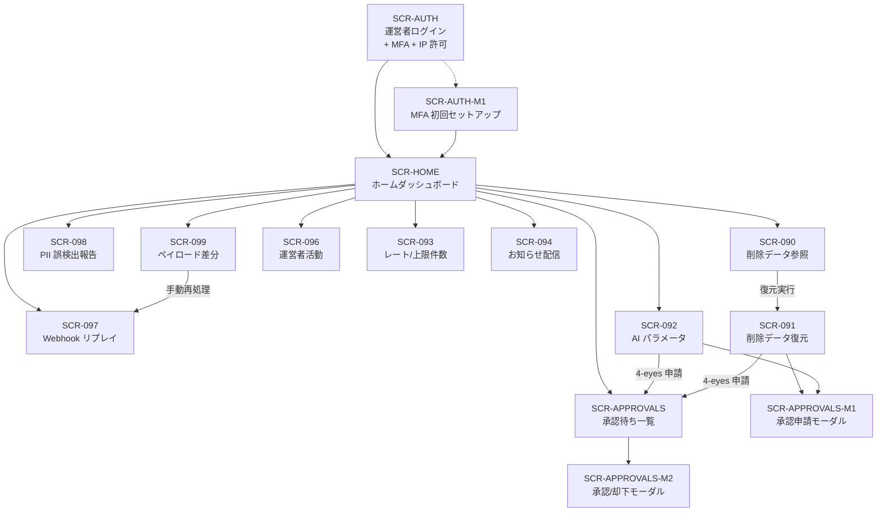

# 画面設計書(運営者)

## 1. 文書概要

### 1.1 目的

運営者システム(`open-faq` 運営事業者向け管理画面)の画面仕様を一元化する。SCR-090〜099 / SCR-AUTH / SCR-AUTH-M1 / SCR-HOME / SCR-APPROVALS / M1 / M2(計 15 画面)を対象とする。各画面に **4-eyes 対象 action code + ticket_id 入力要否** を明示する。

### 1.2 対象範囲

- 対象 15 画面: SCR-AUTH / SCR-AUTH-M1 / SCR-HOME / SCR-090〜099(SCR-095 は MVP 範囲外、欠番)/ SCR-APPROVALS / SCR-APPROVALS-M1 / SCR-APPROVALS-M2
- 対象外: 利用者側画面(01_メインシステム/個別設計書群/02_画面設計書.md 参照)

### 1.3 版数

| 項目 | 値 |
|---|---|
| 版数 | 1.1 |
| 更新日 | 2026-05-17 |

### 1.4 関連ドキュメント

| ドキュメント名 | 役割 | 参照先 |
|---|---|---|
| 索引 | 11 ドキュメント体系の俯瞰 | [00_索引.md](00_索引.md) |
| API 設計書 | 各画面の API 呼び出し | [03_API設計書.md](03_API設計書.md) |
| メッセージ一覧 | 画面ラベル / エラー文言(正本)| [07_メッセージ一覧.md](07_メッセージ一覧.md) |
| 権限設計書 | 4-eyes 対象 10 操作 | [05_権限設計書.md](05_権限設計書.md) |
| 認証・認可設計書 | 6 段認可判定 / 4-eyes 承認フロー | [09_認証認可設計書.md](09_認証認可設計書.md) |
| エラー設計書 | 異常系挙動 | [06_エラー設計書.md](06_エラー設計書.md) |
| テーブル定義書 | `operator_approvals` 物理スキーマ | [04_テーブル定義書.md](04_テーブル定義書.md) |
| ワイヤーフレーム | UI 表現 | [../画面遷移図.html](../画面遷移図.html) |

### 1.5 ダッシュボード / KPI 共通表示ルール(全 SCR 共通)

本節は SCR-HOME / SCR-096 を中心に、運営者画面の KPI カード・一覧・アラート等のダッシュボード系 UI 要素が SCR 横断で守るべき表示ルールを正本化する。メインシステム側 [01_メインシステム/02_基本設計/01_画面設計.md §1.5](../../01_メインシステム/02_基本設計/01_画面設計.md) と語彙を共有し、共有概念は [共有/共有概念.md](../../共有/共有概念.md) を正とする。

#### 1.5.1 数値・期間・最終更新

| 項目 | ルール |
|---|---|
| 整数件数 | 3 桁ごとカンマ区切り(例: `1,234 件`)。単位は「件」「人」「回」など対象を含意する語で必ず付与 |
| 金額 | `¥1,234` 形式(円貨) |
| 比率(%) | 小数 1 桁固定(例: `82.3%`)。`pp` 表記は比較値時のみ |
| 比較値ラベル | `(前月比 +N.N%)` / `(前週比 -M.M%)` 形式で統一。**SCR-HOME の各 KPI カードには比較粒度ラベル(前月比 / 前週比)を必ず付与する**(従来「アクティブ契約=前週比、質問数=前月比、通知失敗=直近 7 日比」のように混在していた粒度を、各カードのラベルで明示する) |
| 増減の方向性 | 解決率増 = 緑、通知失敗率増 = 赤、AI コスト増 = 黄/赤、アクティブ契約数増 = 緑、MAU 増 = 緑、質問数増 = 中立(青) |
| 期間絞り込み(SCR-096)| 任意期間は最大 1 年(SCR-096 監査ログ仕様)|
| 最終更新タイムスタンプ | KPI カード群の右上に「最終更新: YYYY-MM-DD HH:MM(JST)」を統一配置 |
| 集計遅延 | 最終更新が 5 分以上前のとき「⚠ 集計遅延(最終: YYYY-MM-DD HH:MM)」と黄表記で警告 |

#### 1.5.2 ステータス色 & アイコン語彙(全 SCR 共通)

色のみに依存せず、必ず「色 + アイコン + テキストラベル」3 点セットで状態を伝える。色覚多様性配慮。

| 色 | 意味 | アイコン | 主な用途 | 単独使用 |
|---|---|---|---|---|
| 赤 | 要対応 / 期限超過 | ⚠ | 承認期限切れ間近 / DLQ 24h+ 滞留 / PII SLA 超過 / ハッシュチェーン要確認 / 操作頻度異常 | 不可 |
| 黄 | 要監視 | ⏳ または ▲ | AI コスト消化 80% 超 / 通知失敗率上昇 / 残期間 24h / 集計遅延 | 不可 |
| 緑 | 正常 | ✅ | ハッシュチェーン検証済 / 「過去 24h 異常なし」表示 | 不可 |
| 青 | 情報 / 案内 | ℹ️ | お知らせ / 中立 KPI | 不可 |
| 紫 | 高権限操作 | 🔒(HardgateBadge)| `service_operator` の `restore` / `update` / `delete` 行強調(SCR-096) | 不可 |
| グレー | 非活性 / 0 件 | — | EmptyState / 完了済 / 未割当 | 可 |

#### 1.5.3 状態表現(EmptyState / null / 集計中 / 取得失敗 / 期間外)

| 状態 | 表示 | クリック挙動 | 例 |
|---|---|---|---|
| 0 件 / 該当なし | EmptyState 「{対象}はありません」+ 薄いグレー背景 | クリック不可 | 「承認待ちはありません」 |
| null / 未集計 | 「—」(em-dash) + Tooltip「集計予定」 | クリック不可 | バッチ未実行時 |
| 集計中 / 処理中 | 「集計中…」+ スピナー | クリック不可 | 期間変更直後 |
| 取得失敗 | 「取得に失敗しました(再読込)」+ 赤縁 + ⚠ + 該当 `E-OP-*` を Tooltip | 「再読込」ボタンのみ活性 | API エラー時 |
| 期間外 | 「対象期間にデータがありません」 | クリック不可 | 任意期間で範囲外 |
| 集計遅延 | 「⚠ 集計遅延(最終: …)」を画面右上 | — | 集計バッチ遅延時 |

#### 1.5.4 KPI / アラートのクリック導線

KPI カード / 一覧行 / アラートは、可能な限り「数値クリックで詳細画面に遷移」できるようにする。項目表に必ず「クリック挙動」列を設け、遷移先 SCR ID とフィルタ条件を明記する。

---

## 2. 画面一覧

| SCR | 名称 | 主管 FR | 4-eyes 段階 | 再認証 | action code |
|---|---|---|---|---|---|
| SCR-AUTH | 運営者ログイン(URL 分離)| FR-220, FR-221, NFR-311 | なし | -(認証前)| - |
| SCR-AUTH-M1 | MFA 初回セットアップ | FR-220, RB-014, NFR-311 | なし | -(限定セッション)| - |
| SCR-HOME | ホームダッシュボード | (主要 KPI 集約)| なし | 不要 | - |
| SCR-090 | 削除データ参照 | FR-200, FR-223 | なし | 不要 | (操作なし、参照のみ)|
| SCR-091 | 削除データ復元 | FR-201〜FR-209, FR-211, FR-222 | MVP 承認ログのみ | 必須(5 分以内)| `owner.restore_data` |
| SCR-092 | AI 推論パラメータ設定(契約別上書き)| FR-055, FR-061〜FR-066, FR-222 | **MVP ハードゲート** | 必須 | `ai_parameter.update` |
| SCR-093 | レート制限(契約単位)・上限件数(プロジェクト単位)上書き管理 | FR-121, FR-128, FR-224(b)| MVP 承認ログのみ | 必須 | `rate_limit.override` / `usage_limit.override` |
| SCR-094 | お知らせ作成・配信(運営者)| FR-149, FR-188, FR-189 | なし(配信予約は 5 分前まで取消可)| 必須 | (即時配信のみ承認ログ)|
| SCR-096 | 運営者活動ダッシュボード(監査)| FR-229, FR-230, FR-232 | なし | 不要 / エクスポートは記録対象 | - |
| SCR-097 | 課金 Webhook リプレイ・DLQ 操作画面 | FR-302, NFR-808 | なし | 必須(リプレイ実行時)| `webhook.replay` |
| SCR-098 | PII 誤検出報告管理 | FR-060, FR-064, NFR-805 | なし | 必須(ルール更新時)| `pii_rule.update` |
| SCR-099 | Webhook ペイロード差分検出一覧 | FR-302 異常系, AC-041 | なし | 必須(手動再処理選択時)| - |
| SCR-APPROVALS | 承認待ち一覧(4-eyes)| FR-226, §6.2.3 | 4-eyes 中核画面 | 承認 / 却下時に必須 | - |
| SCR-APPROVALS-M1 | 4-eyes 承認申請モーダル | FR-226, §6.2.3, FR-231 | 申請発火点 | 必須 | (親画面から継承)|
| SCR-APPROVALS-M2 | 4-eyes 承認 / 却下モーダル | FR-226, §6.2.3 | 承認 / 却下発火点 | 必須 | `approval.approved` / `approval.rejected` |

## 3. 画面遷移

### 3.1 Mermaid 遷移図

## 4. 共通 UI 部品 + サイドメニュー

### 4.1 既存共通部品

| 部品 | 配置 | 目的 |
|---|---|---|
| グローバルヘッダ | 全画面上部 | サービス名、運営者表示名、MFA バッジ(緑/赤)、運営者 inbox バッジ(未読件数)、ログアウト |
| サイドメニュー | 全画面左 | SCR-090〜094, SCR-096〜099 への遷移、未承認件数バッジ・DLQ 滞留バッジ・PII 未判定バッジ(FR-471)|
| **チケット ID 入力モーダル** | SCR-091〜094 / 097 / 098 / 099 の操作前 | 対応チケット ID(任意文字列、最大 64 文字、必須)+ 操作種別の確認。placeholder で受付例(`JIRA-12345` / `INC-001` / `#1234`)を提示、未入力時は Primary 非活性化(FR-458)|
| **再認証モーダル** | SCR-091〜094 / 097 / 098 / 099 の操作前(過去 5 分以内に再認証していない場合)| パスワード再入力(MVP)+ 操作 1 回限り。**残時間 5 分カウントダウンを常時表示**(FR-457)|
| **4-eyes 申請モーダル** | SCR-092 / マスター鍵ローテ / 契約物理削除 | 申請理由・対象操作・payload **要約**(変更前 → 変更後の対比)を主表示、生 JSON は折り畳み(FR-455)|
| **4-eyes 承認モーダル** | 別運営者のホーム画面の「承認待ち」リスト経由 | 申請内容確認・承認/却下・コメント。`payload_hash` 不一致時は業務語で警告。自己承認は CTA 非活性化 |
| 運営者 inbox バッジ | ヘッダ右上 | 未読件数表示。`critical` 申請通知は赤強調 |
| DLQ 滞留バッジ | サイドメニュー SCR-097 横 | DLQ 滞留件数(1 時間以上 / 24 時間以上)。24 時間以上は **赤強調**(FR-471)|

### 4.2 UI/UX 共通要件で追加する部品

| 部品 | 用途 | 主な仕様 |
|---|---|---|
| Breadcrumb | パンくず | 認証フローおよび全画面割込みモーダルを除く全画面に表示。最大 3 階層 |
| PageHeader | 画面タイトル + 1 行説明文 | 全画面の最上部 |
| **ReauthBadge** | 再認証必須操作の可視化 | Primary ボタン横に再認証ラベル + tooltip。FR-222 対象操作すべてに付与 |
| **ReauthCountdown** | 再認証残時間表示 | 再認証モーダル内およびモーダル閉じた後のヘッダ右側に「再認証残 X:XX」を常時表示 |
| **HardgateBadge** | 4-eyes ハードゲート可視化 | 紫枠 + tooltip「別運営者の承認が必要な操作です」|
| **ApprovalStateBadge** | 4-eyes 申請状態 | `requested`(青)/ `approved`(緑)/ `rejected`(赤)/ `withdrawn`(灰)を色 + テキスト |
| **PayloadDiffViewer** | 4-eyes 申請内容の対比 | 主表示は「変更前 → 変更後」のキー別対比、生 JSON は折り畳み(FR-455)|
| **SelfApprovalGuard** | 自己承認禁止の UI ガード | 自分の申請を開いたとき承認/却下 CTA を非活性化 + 補助文言「自分の申請は承認できません」 |
| **TicketIdField** | 対応チケット ID 入力欄 | placeholder「例: JIRA-12345 / INC-001 / #1234」、未入力時 Primary 非活性化 |
| **PrecheckResultPanel** | 副作用プリチェック結果(SCR-091)| 7 項目(a-g)を「問題なし / 確認が必要 / 対象外」バッジで一覧表示 |
| AppliedFilterChips | 適用済フィルタ表示 + クリア | 「すべてクリア」を常設 |
| BulkActionBar | 一括操作バー | 複数選択時のみ画面下部固定 |
| SummaryCard | KPI サマリーカード | SCR-HOME / SCR-096 等で使用 |
| LoadingSkeleton | スケルトン UI | スピナー単独表示を回避(FR-480)|
| ProgressText | 進捗テキスト(3 秒超操作)| プリチェック実行、CSV エクスポート、Webhook リプレイ等 |
| Toast | 成功・警告・エラー通知 | 成功 4 秒 / 警告 6 秒 / エラーは手動閉じ |

### 4.3 文言の共通基準

詳細は [07_メッセージ一覧.md §2](07_メッセージ一覧.md) を正本とする。

### 4.4 サイドメニュー

| メニュー項目 | 表示順 | バッジ条件 |
|---|---|---|
| ホーム | 1 | - |
| 削除データ参照 (SCR-090)| 2 | - |
| 削除データ復元 (SCR-091)| 3 | - |
| AI 推論パラメータ (SCR-092)| 4 | ハードゲート申請中件数 |
| レート/上限件数上書き (SCR-093)| 5 | - |
| お知らせ配信 (SCR-094)| 6 | scheduled 件数 |
| Webhook リプレイ (SCR-097)| 7 | **DLQ 滞留 1h 以上 / 24h 以上(赤)** |
| PII 誤検出報告 (SCR-098)| 8 | 3 営業日経過件数 |
| ペイロード差分 (SCR-099)| 9 | detected 状態件数(赤)|
| 運営者活動 (SCR-096)| 10 | - |
| 承認待ち一覧 (SCR-APPROVALS)| 11 | 承認待ち件数(申請者・承認者問わず)|
| 運営者 inbox | 12 | 未読件数 |
| ログアウト | 13 | - |

## 5. 画面詳細

文言は [07_メッセージ一覧.md §4](07_メッセージ一覧.md) を正本とする。本書では UI 構造を網羅する。

---

### 5.1 SCR-AUTH 運営者ログイン

#### 画面概要

URL 分離した運営者専用ログイン画面(`https://admin.open-faq.example.com/login`)。利用者側からのリンクは設けない(発見可能性を下げる)。

| 項目 | 内容 |
|---|---|
| ページタイトル | open-faq Admin Console |
| 利用者 | `service_operator` |
| 認証 | メール + パスワード(Argon2id 運営者プロファイル)+ MFA(TOTP)|
| IP 許可 | リクエスト到着前にエッジで適用、未許可 IP は 403(ログイン画面さえ表示しない)|
| ロックアウト | 5 回連続失敗で `(IP × user_id)` ペア単位 15 分ロック |
| パスワードリセット | 60 分有効リンク、**自己リセット禁止** → 別運営者承認経由 |
| MFA セットアップ | 初回 72h トークン経由で SCR-AUTH-M1 へ誘導。QR + 回復コード 10 個 |
| セッション TTL | MVP 初期値 8 時間 |

#### 表示・入力・操作項目

| 区分 | 項目 | 入出力 | バリデーション | エラー表示 |
|---|---|---|---|---|
| 入力 | メールアドレス | 入力 | 必須、254 文字以内、形式チェック | 「メールアドレスを入力してください」/「メールアドレスの形式が正しくありません」 |
| 入力 | パスワード | 入力 | 必須、Argon2id 検証 | 「パスワードを入力してください」/ 認証失敗時の共通文言「メールアドレスまたはパスワードが正しくありません」 |
| 入力 | TOTP コード | 入力(6 桁分割入力 UI、各桁オートタブ)| 必須(MFA 設定済み)、6 桁数字 | 「認証コードが一致しません。アプリで最新コードを確認してください」 |
| 操作 | ログインする | 操作(Primary)| (1) IP 許可リスト照合 (2) Argon2id 検証 (3) TOTP 検証 (4) 認可セッション発行 | IP 拒否 / 認証失敗 / ロックアウト |
| 表示 | **IP 拒否時の明示メッセージ** | アラート帯(画面上部固定)| - | 「許可された IP アドレスからアクセスしてください(現在の IP: {ip})。管理者にお問い合わせください」 |
| 表示 | **ロックアウト残時間表示** | カウントダウン | - | 「{N}分{S}秒後にもう一度お試しください」 |
| 操作 | パスワードを忘れた場合 | リンク(Secondary)| 60 分有効リンク、自己リセット禁止 | - |
| 表示 | MFA 未設定者向け案内 | 出力 | 招待 72h トークンを受領した運営者は SCR-AUTH-M1 へ誘導 | - |
| 完了 | 監査ログ記録(`auth.login.success` / `auth.login.failure`、5 年保持)| - | - | - |

---

### 5.2 SCR-AUTH-M1 MFA 初回セットアップ

#### 画面概要

招待時に発行される 72h セットアップトークンを保持する運営者が、TOTP 秘密鍵と回復コードを初期登録する独立画面。**3 ステップウィザード**: (1) 認証アプリ登録、(2) 初回 TOTP 検証、(3) 回復コード保管。

#### 表示・入力・操作項目

| 区分 | 項目 | 入出力 | バリデーション | エラー表示 |
|---|---|---|---|---|
| 表示 | ステッパー UI(3 段階)| 出力 | 現在ステップを `aria-current="step"` で強調 | - |
| 表示 | セットアップトークン | 出力 | サーバ側でトークン有効性を検証、72h 期限切れは UC-007 へ誘導 | 「セットアップリンクの有効期限が切れています。運用責任者に再発行を依頼してください」 |
| 表示 | TOTP QR コード | 出力 | 一意に発行された TOTP 秘密鍵を QR で表示。QR/手動キーをトグル切替 | - |
| 表示 | 手動キー(QR 切替)| 出力 | QR 読取不可時の代替 | - |
| 入力 | 初回 TOTP コード | 入力(6 桁分割入力)| 必須、6 桁数字、サーバ側で初回検証 | 「認証コードが一致しません」 |
| 表示 | **回復コード保管警告帯** | アラート(上部固定)| - | 「⚠ 回復コードは認証アプリを失った場合の唯一の復旧手段です。安全な場所に保管してください。この画面を閉じると再表示できません」 |
| 表示 | 回復コード(10 個)| 出力 | セットアップ確定時にのみ表示 | - |
| 操作 | 回復コードを **印刷する** | ボタン | `window.print` で印刷ダイアログ起動 | - |
| 操作 | 回復コードを **コピーする** | ボタン | クリップボードにコピー | - |
| 操作 | 回復コードを **PDF でダウンロード** | ボタン | PDF 生成 + ダウンロード | - |
| 入力 | 「回復コードを安全な場所に保管しました」確認チェック | 入力 | 必須(セットアップ完了の前提)| 未チェック時は Primary 非活性化 |
| 操作 | セットアップを完了する | 操作(Primary)| (1) 初回 TOTP 検証 (2) `operator_mfa_secrets.secret` 暗号化保存 (3) 回復コード暗号化保存 (4) 認可セッション昇格 | 検証失敗 |
| 完了 | 監査ログ記録(`auth.mfa.setup`、5 年保持)| - | - | - |

---

### 5.3 SCR-HOME ホームダッシュボード

**画面目的**: 運営者がログイン直後に「今、緊急対応が必要な事案があるか」「全契約規模の主要 KPI に異常がないか」を 1 画面で把握し、該当 SCR(承認待ち / DLQ / PII / Webhook 等)へショートカットするための運用監視ダッシュボード。

#### 画面概要

ログイン直後の遷移先。運営者の **「いま何をすべきか」を 1 画面に集約**。上部に **緊急アラート帯**(24h+ 滞留や承認期限切れ間近)、その下にカードグリッドで主要 KPI と各 SCR への入口を配置。三層構造(Action > Awareness > Navigation)。

表示ルール(数値・期間・最終更新・色語彙・状態表現)は [§1.5 ダッシュボード / KPI 共通表示ルール](#15-ダッシュボード--kpi-共通表示ルール全-scr-共通) に正本化する。

#### (1) 緊急アラート帯(上部固定)

緊急アラートが 1 件以上ある場合は赤系アラートを表示する。0 件時は緑系の「異常なし」ステータスを表示し、アラート表示機構が壊れているのか平常なのかをユーザーが判別できるようにする(色語彙は §1.5.2、状態表現は §1.5.3)。

| 区分 | 項目 | 種類 | 概要 | クリック挙動 |
|---|---|---|---|---|
| 表示 | 承認期限切れ間近(残 24h 以内)| アラート(赤・⚠、件数 > 0 時のみ)| 「⚠ 承認期限切れ間近の申請が {N} 件あります(残 24 時間以内)」 | 行全体クリックまたは「承認待ち一覧へ」リンクで SCR-APPROVALS(`?filter=expiring_24h`) |
| 表示 | DLQ 24h+ 滞留 | アラート(赤・⚠)| 「⚠ 24 時間以上滞留中の Webhook イベントが {N} 件あります」 | 行全体クリックまたは「Webhook リプレイへ」で SCR-097(`?filter=stalled_24h`) |
| 表示 | PII 誤検出 SLA 超過 | アラート(赤・⚠)| 「⚠ 3 営業日を超過した PII 誤検出報告が {N} 件あります」 | 行全体クリックまたは「PII 誤検出管理へ」で SCR-098(`?filter=sla_exceeded`) |
| 表示 | ハッシュチェーン確認が必要(直近 24h)| アラート(赤・⚠、確認が必要な場合のみ)| 「監査ログのハッシュチェーンに確認が必要な項目があります。詳細を確認してください」 | クリックで SCR-096(該当区間に自動フィルタ投入) |
| 表示 | **異常なし表示(全アラート 0 件時)** | ステータスバナー(緑・✅)| 「✅ 緊急対応が必要な事案はありません(ハッシュチェーン: 検証済 / 操作頻度: 正常)」 | — |

#### (2) KPI サマリーカード

各 KPI カードには **比較粒度ラベル**(「(前月比)」/「(前週比)」)を必ず付与する。当月集計 KPI は前月比、週次 / 直近 7 日 KPI は前週比を原則とする(§1.5.1)。最終更新タイムスタンプはカードグループの右上に表示する。

| 項目 | 概要 | 比較粒度 | クリック挙動 |
|---|---|---|---|
| アクティブ契約数 | 現在値 | (前週比 ±N.N%)| クリック → SCR-093(契約一覧、`?status=active`)(MVP は SCR-090 経由) |
| 全契約 MAU | 月次アクティブユーザー数 | (前月比 ±N.N%)| クリック → SCR-096(`?filter=mau`、参考) |
| 全契約 質問数(当月)| 当月累計 | (前月比 ±N.N%)| クリック → SCR-096(`?filter=questions`)|
| 全契約 解決率(当月)| 解決数 / 質問数 % + 前月比(FR-230 連動)| (前月比 ±N.Npp)| クリック → SCR-096(参考)|
| AI 推論コスト(当月)| 円換算合計 | (前月比 ±N.N%)| クリック → SCR-093(レート・上限件数上書き管理) |
| 通知失敗率(直近 7 日)| バウンス + 苦情率。閾値超過時は赤(§1.5.2)| (前週比 ±N.Npp)| クリック → SCR-097(`?filter=notification_failure`)|

#### (3) クイックアクセス(各 SCR への入口)

| 項目 | 表示 | クリック挙動 |
|---|---|---|
| 承認待ち一覧 | カード + 件数バッジ「承認待ち {N} 件」 | クリック → SCR-APPROVALS |
| DLQ 滞留 | カード + 件数バッジ「DLQ 滞留 {N} 件(うち 24h+ {M} 件)」 | クリック → SCR-097 |
| PII 誤検出未判定 | カード + 件数バッジ「PII 誤検出未判定 {N} 件(うち SLA 超過 {M} 件)」 | クリック → SCR-098 |
| ペイロード差分検出 | カード + 件数バッジ「差分検出 {N} 件(未レビュー)」 | クリック → SCR-099 |
| 削除データ参照 | カード | クリック → SCR-090 |
| AI 推論パラメータ | カード(HardgateBadge 🔒 付き、§1.5.2 紫)| クリック → SCR-092 |
| 運営者活動ログ | カード | クリック → SCR-096 |

---

### 5.4 SCR-090 削除データ参照

#### 画面概要

論理削除済みリソースを検索・参照。本文は表示されず、復元判断に必要なメタデータのみ表示。左 60% に一覧、右 40% に詳細プレビューペイン。

#### 表示・操作項目

| 区分 | 項目 | 入出力 | バリデーション |
|---|---|---|---|
| 表示 | パンくず | Breadcrumb | 「ホーム / 削除データ参照」 |
| 表示 | クイックフィルタチップ | QuickFilterChips | 「最近 1 週間」「最近 1 ヶ月」「物理削除予定 7 日以内」「すべて」 |
| 検索条件 | 契約検索(ID/名前)| 入力(部分一致)| 最大 100 文字 |
| 検索条件 | リソース種別 | 選択(複数可、チップ形式)| `owner` / `project` / `faq` / `account` / `announcement` |
| 検索条件 | 削除種別 | 選択(複数可、チップ形式)| `deleted` / `disabled` / `deleted_pending` |
| 検索条件 | 削除日範囲 | 入力(日付範囲)| from ≤ to、**最大期間 1 年** |
| 表示 | 適用済フィルタチップ | AppliedFilterChips | + 「すべてクリア」 |
| 表示 | 件数表示 | テキスト | 「1-50 / 全 N 件」 |
| 一覧 | リソース ID / 契約 ID / 種別 / 削除日時 / 削除種別 | 出力 + バッジ | - |
| 一覧 | 物理削除予定日 列 | 出力(`deleted_pending` 行のみ)| 残 7 日以内は赤、残 8-30 日は黄 |
| 詳細 | リソース種別ヘッダ | 出力 | アイコン + リソース名 |
| 詳細 | 直前主要属性プレビュー | 出力 | **本文は非表示**。表示: リソース ID、種別、契約名、削除日時、削除種別、削除操作者 |
| 詳細 | 物理削除予定日 | 出力 + カウントダウン | `deleted_pending` の場合のみ |
| 詳細 | 復元する | ボタン(Primary、SCR-091 遷移)| 物理削除済は非活性 + tooltip 表示 |
| 表示 | 空状態 | EmptyState | 「該当する削除済みリソースはありません」 |

---

### 5.5 SCR-091 削除データ復元

#### 画面概要

論理削除済みのリソースを副作用プリチェック後に復元。上から (1) 復元対象情報、(2) 入力フィールド、(3) 副作用プリチェック結果セクション、(4) 実行 CTA(タブで「4-eyes 申請」と「即時実行(承認ログ)」を切り替え)。

#### 表示・入力・操作項目

| 区分 | 項目 | 入出力 | バリデーション |
|---|---|---|---|
| 表示 | パンくず | Breadcrumb | 「ホーム / 削除データ参照 / 復元」 |
| 表示 | 復元対象サマリ | 出力 | リソース ID / 種別 / 契約名 / 削除日時 / 直前主要属性プレビュー |
| 入力 | 復元対象 ID | 入力(SCR-090 から遷移)| 必須 |
| 入力 | 復元理由 | 入力(テキストエリア、最大 1000 文字、カウンタ)| 必須、最大 1000 文字 |
| 入力 | 対応チケット ID | TicketIdField | 必須、最大 64 文字 |
| 入力 | 再認証(過去 5 分以内に未実行の場合)| 入力(パスワード)| 必須 |

#### プリチェック(7 項目 a〜g)

| 表示 | 項目 | 内容 |
|---|---|---|
| プリチェック | (a) Stripe サブスクリプション再開可否 | 問題なし / 確認が必要 / 対象外、「確認が必要」時は赤バッジ + 理由 |
| プリチェック | (b) Webhook DLQ 滞留イベント数 | 件数表示 + 詳細リンク → SCR-097 |
| プリチェック | (c) お知らせ受信箱配信保留分 | 件数表示 |
| プリチェック | (d) ウィジェット再有効化可否 | 問題なし / 確認が必要 / 対象外 |
| プリチェック | (e) Stripe customer_id 整合性 | 問題なし / 確認が必要 |
| プリチェック | (f) 進行中登録完了・再入室トークン処置 | 件数表示 |
| プリチェック | (g) 監査・エラーログ参照ポインタ整合 | 問題なし / 確認が必要 |

| 操作 | プリチェックを開始する | 操作(Primary)| プリチェック未実行時、または入力変更後に活性化 |

#### 実行モード

| 表示 | 実行モードタブ | 出力(タブ)| 「4-eyes 申請」「即時実行(承認ログ)」の 2 タブ。MVP ハードゲート対象は「4-eyes 申請」のみ |
| 操作 | **4-eyes 申請する** | 操作(Primary + HardgateBadge)| プリチェック全項目が問題なしの場合のみ、SCR-APPROVALS-M1 へ遷移 |
| 操作 | **復元する** | 操作(Primary、Danger 寄り + 再認証)| プリチェック全項目が問題なし、チケット ID 入力 + 再認証で実行 |
| 表示 | 結果トースト | 出力 | 「復元しました。副作用 (a)〜(g) の連動回復は監査ログを参照してください」 |
| 完了 | 監査ログ記録 | 出力 | `owner.restore` / `faq.restore` 等、操作者・対象・理由・チケット ID・変更前後ステータス |
| 完了 | 管理者ユーザー通知発火(FR-211)| 出力 | 10 分集約窓 |

---

### 5.6 SCR-092 AI 推論パラメータ設定(契約別上書き、ハードゲート)

#### 画面概要

階層タブ「グローバル / 契約別 / プロジェクト別」、編集セクション、ロールアウト進行可視化セクション、変更履歴セクション。

#### 表示・入力・操作項目

| 区分 | 項目 | 入出力 | バリデーション |
|---|---|---|---|
| 階層タブ | グローバル / 契約別 / プロジェクト別 | 選択 | - |
| 表示 | **優先順位の可視化バナー** | 出力(情報パネル)| 「有効値 = min(プロジェクト, オーナー, グローバル)」 |
| 入力 | 信頼度しきい値 | スライダ + 数値入力 | 0.00〜1.00、0.01 刻み |
| 入力 | 関連度しきい値 | スライダ + 数値入力 | 0.00〜1.00、0.01 刻み |
| 入力 | 使用モデル | 選択(プルダウン、検索付き)| KV `ai-models:available` から |
| 入力 | 申請理由 | 入力(テキストエリア、最大 1000 文字)| 必須 |
| 入力 | 対応チケット ID | TicketIdField | 必須、最大 64 文字 |
| 入力 | 再認証(5 分以内)| 入力(パスワード)| 必須 |
| 操作 | **4-eyes 申請する** | 操作(Primary + HardgateBadge)| 別運営者承認必須(**MVP ハードゲート**)|
| 表示 | **ロールアウト進行ステッパー** | Timeline(段階表示)| 「0% → 10% → 50% → 100%」で現在の段階を強調 |
| 操作 | 次のステージへ進める | 操作(Primary)| 各段階で監査ログ記録、4-eyes 再申請 |
| プレビュー | 設定値の保存即時有効通知 | 出力(トースト)| 「AI パラメータを更新しました。次回ハイドレーション(60 秒以内)から有効になります」 |
| 履歴タブ | 過去の変更履歴 | 出力(テーブル)| 直近 90 日。申請者・承認者・before/after・チケット ID・日時 |

---

### 5.7 SCR-093 レート制限・利用設定上書き管理

#### 画面概要

上に契約検索バー、その下に上書き中の設定一覧を配置する。レート制限は **契約単位**、質問数上限・課金対象別無料枠は **プロジェクト単位**。FAQ 件数・個別チャット部屋数には上限値を持たせず、無料枠だけを上書きする。

#### 表示・操作項目

| 区分 | 項目 | 入出力 | バリデーション |
|---|---|---|---|
| 表示 | パンくず | Breadcrumb | 「ホーム / レート制限(契約)・上限件数(プロジェクト)上書き」 |
| 検索 | 契約検索 | 入力 | 部分一致、最大 100 文字 |
| 操作 | + 上書きを追加 | ボタン(Primary)| クリックで保存モーダルを開く |
| 一覧 | レート制限上書き一覧 | テーブル | 行 = 契約 × レート項目、列 = 契約名 / 項目 / グローバル値 / 上書き値 / 有効期限 / 理由 / 設定者 / 操作 |
| 一覧 | 利用設定上書き一覧 | テーブル | 行 = プロジェクト × 課金対象、列 = 契約 / プロジェクト / 課金対象 / 現在の上限 / 無料利用枠 / 上書き値 / 有効期限 / 理由 / 操作。FAQ・チャットの現在の上限は「上限なし」、上書き値は無料枠だけを表示 |
| 一覧 | 上書き有効期限 | テーブルセル + カウントダウン | 期限近接は黄、超過は赤 |
| 一覧 | 上書き理由 | テーブルセル + tooltip | 全文は tooltip |
| 一覧 | 上書き設定者・日時 | テーブルセル | - |
| 操作 | 編集する | ボタン(行アクション)| 保存モーダルを「編集」モードで開く |
| 操作 | **グローバル値に戻す** | ボタン(Danger、確認ダイアログ + 再認証)| 上書きを削除してグローバル値に復帰 |

#### 保存モーダル

| 区分 | 項目 | 入出力 | バリデーション |
|---|---|---|---|
| 表示 | モーダル見出し | 出力 | 「契約別上書きを{新規追加 / 編集}」+ 契約名 |
| 入力 | 契約選択(新規時のみ)| プルダウン(検索付き)| 必須、契約 ID または名前で検索 |
| 入力 | レート制限上書き(`/widget/ask`、契約単位)| 入力 + helper | 1〜10000 req/min |
| 入力 | チャット投稿レート(EU 側)| 入力 + helper | 秒数 + 件数/分 |
| 入力 | チャット投稿レート(admin 側)| 入力 + helper | 秒数 + 件数/分 |
| 入力 | **プロジェクト選択**(利用設定上書き時に必須)| プルダウン(検索付き)| 選択中契約配下のプロジェクトから選択 |
| 入力 | 質問数上限ON / OFF | トグル | OFF時は質問数上限をNULLで上書きし、上限判定・上限アラートを停止する |
| 入力 | 質問数上限・無料枠上書き | 入力 + helper | 上限・無料枠を独立して各 1 件刻みで入力。上限には「{上限}件 - {無料枠}件(無料枠) = {課金対象}件 (¥{月額} / 月)」を併記し、上限OFF時も無料枠は入力可能 |
| 入力 | FAQ / 個別チャット無料枠上書き | 入力 + helper | 無料枠のみ 1 件刻み。上限入力・上限アラートは表示しない |
| 入力 | 上書き理由 | テキストエリア(最大 1000 文字)| 必須 |
| 入力 | 対応チケット ID | TicketIdField | 必須、最大 64 文字 |
| 入力 | 再認証(5 分以内)| パスワード | 必須 |
| 表示 | 差分プレビュー | パネル | 変更前 → 変更後の対比 |
| 操作 | 保存する | ボタン(Primary + 再認証)| MVP 単独実行 + 承認ログ |
| 操作 | キャンセル | ボタン(Secondary)| 変更を保存せずモーダルを閉じる |
| 完了 | **連携 IF #5 でメインへ即時反映** | 出力 | KV TTL 30s でメイン側エッジに反映 |
| 完了 | 管理者ユーザー通知発火(FR-211)| 出力 | 10 分集約窓 |

---

### 5.8 SCR-094 お知らせ作成・配信

#### 画面概要

4 段階ステッパー UI で配信フローを可視化:
1. 作成・下書き
2. テスト送信
3. 配信予約
4. 即時配信(オプション、4-eyes 承認ログ対象)

#### 表示・入力・操作項目

| 区分 | 項目 | 入出力 | バリデーション |
|---|---|---|---|
| 表示 | ステッパー UI | 出力 | 現在ステップを強調 |
| 入力 | 種別 | 選択 | `announcement` / `system` |
| 入力 | 重要度 | 選択(色付き)| `low` / `normal` / `high` / `critical` |
| 入力 | 宛先範囲 | 選択 | 全契約 / 特定契約(複数)/ 特定ユーザー種別(admin)|
| 表示 | **想定配信件数の即時表示** | 出力 | 「{recipientCount} 件に配信されます」 |
| 入力 | 件名 | 入力 | 必須、最大 200 文字、サニタイズ |
| 入力 | 本文 | 入力(リッチエディタ)| 必須、最大 10000 文字、サニタイズ二段階 |
| 入力 | オプトアウト可否 | 選択 | 規約改定・セキュリティ通知は強制送信 |
| 入力 | 送信予定日時 | 入力(日時)| 現在時刻 ≤ 入力値、最大 30 日先 |
| 入力 | 対応チケット ID | TicketIdField | 必須、最大 64 文字 |
| 入力 | 再認証 | 入力(パスワード)| 必須 |
| プレビュー | 件名・本文(サニタイズ後)| 出力 | - |
| プレビュー | 宛先範囲・想定配信件数 | 出力 | - |
| 操作 | **ステップ 1: 下書き保存** | 操作(Primary)| 必須項目検証 |
| 操作 | **ステップ 2: テスト送信** | 操作(Primary、本人宛)| ステップ 1 完了後活性化 |
| 操作 | **ステップ 3: 配信予約** | 操作(Primary)| ステップ 2 完了 + 日時必須 |
| 操作 | 配信予約取消 | 操作 | 配信開始 5 分前まで取消可 |
| 操作 | **ステップ 4: 即時配信(緊急)** | 操作(Danger + HardgateBadge + 二段確認)| 確認モーダル + 再認証 + 4-eyes 承認ログ |
| 操作 | 訂正告知発行(配信開始後)| 操作 | 別 SERVICE_ANNOUNCEMENT として新規発行 |
| 完了 | 連携 IF #7 でメインへ配信指示 | 出力 | メイン側で `inbox_messages` 生成 + メール送信 |

---

### 5.9 SCR-096 運営者活動ダッシュボード(監査)

**画面目的**: 運営者操作の監査ログを検索・閲覧・エクスポート(5 年保持)するための監査トレース画面。主目的は **検索・閲覧・エクスポート(透明性とコンプライアンスの確保)**、副次目的として **ハッシュチェーン検証バッジ / 操作頻度異常検知バッジによる平常時のヘルスチェック + 異常時のショートカット導線** を兼ねる。

#### 画面概要

運営者操作の監査ログを検索・閲覧・エクスポート(5 年保持)。上にハッシュチェーン検証バッジ + 異常検知バッジ、その下にフィルタ、一覧、詳細ペイン。

表示ルール(数値・期間・最終更新・色語彙・状態表現)は [§1.5 ダッシュボード / KPI 共通表示ルール](#15-ダッシュボード--kpi-共通表示ルール全-scr-共通) に正本化する。

#### 表示・操作項目

| 区分 | 項目 | 入出力 | バリデーション | クリック挙動 |
|---|---|---|---|---|
| 表示 | パンくず | Breadcrumb | 「ホーム / 運営者活動」 | — |
| 表示 | **ハッシュチェーン検証バッジ**(平常時 / 異常時の二状態)| バッジ + 詳細 | 直近 24h の検証結果。**平常時**: 緑 ✅「過去 24h 異常なし」/ **異常時**: 赤 ⚠「ハッシュチェーン: 確認が必要」(§1.5.2)| 平常時=クリック不可、異常時=クリックで該当区間の `occurred_at` 範囲を一覧フィルタに自動投入 |
| 表示 | **運営者操作頻度異常検知バッジ**(平常時 / 異常時の二状態)| バッジ | 短時間大量操作の検知件数。**平常時**: 緑 ✅「操作頻度: 正常」/ **異常時**: 赤 ⚠「操作頻度異常 actor_id={op_xxx} ({件数} 操作 / {分} 分)」 | 平常時=クリック不可、異常時=クリックで該当 `actor_id` を一覧フィルタに自動投入 |
| 検索 | クイックフィルタチップ | QuickFilterChips | 「直近 24h」「直近 7 日」「重要操作のみ」「異常検知あり」「すべて」「✕ 全クリア(現在の絞り込み解除)」 | チップクリックで該当条件を一覧フィルタに投入。「✕ 全クリア」で全フィルタ解除 |
| 検索 | `action` | 入力(部分一致)| `<resource>.<verb>` 形式 |
| 検索 | `actor_id` | 入力(完全一致)| - |
| 検索 | `actor_type` | 選択 | `service_operator` / `admin` / `end_user` / `system` |
| 検索 | `target_id` / `target_type` | 入力(完全一致)| - |
| 検索 | `occurred_at` | 入力(期間範囲)| **最大検索期間 1 年** |
| 検索 | `contract_owner_user_id` | 入力 | 運営者は全契約横断可 |
| 検索 | `ip_masked` | 入力(部分一致)| IPv4/IPv6 マスク済 |
| 検索 | `retention_class` | 選択 | `1y` / `5y` / `7y` / 全部 |
| 検索 | `ticket_id` | TicketIdField(任意)| - |
| 一覧 | 操作日時 / actor / action / target / IP / チケット / class | 出力 | カーソル方式 100 件/ページ |
| 一覧 | **高権限操作 強調表示** | 行強調(背景)| `service_operator` の `restore` / `update` / `delete` は紫背景 |
| 詳細 | **before / after JSON 差分** | PayloadDiffViewer | 要約モード優先、生 JSON は折り畳み |
| エクスポート | 形式 | 選択 | CSV / JSON Lines |
| エクスポート | 1 ファイル最大 10 万行 | 出力 | 超過は自動分割 |
| エクスポート | **HMAC-SHA256 署名付き** | 出力 | ファイル末尾に `signature` 行 |
| 操作 | CSV をエクスポート | ボタン(Primary + 再認証)| 監査記録、5000 件以上で非同期化 |
| 表示 | エクスポート進行状況 | ProgressText | 「エクスポート中…(N 件 / M 件)」 |
| 異常系 | KPI 表示 | 出力 | 運営者操作頻度異常 / 全契約横断 MAU・解決率 |

---

### 5.10 SCR-097 課金 Webhook リプレイ・DLQ 操作

#### 画面概要

上から (1) 滞留サマリ アラート帯、(2) フィルタバー、(3) イベント一覧、(4) 詳細ペイン。

#### 表示・操作項目

| 区分 | 項目 | 入出力 | バリデーション |
|---|---|---|---|
| 表示 | **滞留サマリ アラート帯** | アラート(固定)| 「24h+ 滞留: {N} 件 / 30 日近接(残 3 日以内): {M} 件」 |
| 一覧 | 直近 30 日 Webhook イベント | 出力 | `event_id` / `received_at` / `state` / `dlq_path` |
| 一覧 | 状態フィルタ | QuickFilterChips | 「DLQ 滞留」「24h+ 滞留」「30 日近接」「全て」 |
| 一覧 | 詳細フィルタ | チェックボックス | 12 状態。折り畳まず常設パネルで表示 |
| 一覧 | **リプレイ枠残日数 列** | 出力(行毎)| 残 3 日以内は黄、残 0 日は赤背景 |
| 一覧 | 滞留時間バッジ | 出力 | 1h+ は黄、24h+ は赤 |
| 詳細 | Webhook ペイロード(R2 退避から呼び戻し)| 出力 | 機密フィールドはマスク。PayloadDiffViewer 要約モード優先 |
| 詳細 | 過去のリプレイ履歴 | 出力(テーブル)| `dlq_replay_log` を時系列表示 |
| 詳細 | ペイロード差分リンク | リンク | SCR-099 への直接ジャンプ(差分があるとき)|
| 操作 | **リプレイする** | ボタン(Primary + 再認証 + 確認)| 1 時間自動 BO 完了後のみ活性化、受信から 30 日以内、チケット ID 必須 |
| 操作 | **破棄する** | ボタン(Danger + 4-eyes 承認ログ + 再認証)| DLQ 確定イベントのみ。復元不可 |
| 操作 | リプレイ実行時のチケット ID 入力 | TicketIdField | 必須 |
| 完了 | 監査ログ記録(`webhook.replay` / `webhook.discard`、5 年保持)| - | - |

---

### 5.11 SCR-098 PII 誤検出報告管理

#### 画面概要

PII 誤検出報告を 3 営業日以内に判定。上に SLA サマリ帯、中央に一覧、右に詳細プレビューペイン。

#### 表示・操作項目

| 区分 | 項目 | 入出力 | バリデーション |
|---|---|---|---|
| 表示 | パンくず | Breadcrumb | 「ホーム / PII 誤検出報告」 |
| 表示 | **SLA サマリ帯**(上部固定)| アラート | 「期限内: {green} 件 / 期限間近(残 1 日): {yellow} 件 / 期限切れ: {red} 件」 |
| 表示 | クイックフィルタチップ | QuickFilterChips | 「期限切れ」「期限間近」「未判定」「すべて」 |
| 一覧 | 報告一覧 | 出力 | 状態(reported / under_review / ruled_* / archived) |
| 一覧 | **状態バッジ** | 出力 | reported(青)/ under_review(黄)/ ruled_false_positive(緑)/ ruled_correct(灰)/ archived(灰) |
| 一覧 | **3 営業日判定タイマー** | カウントダウン + アイコン | 残 2 営業日以上: 緑 / 残 1 営業日: 黄 / 超過: 赤 |
| 詳細 | 報告内容(マスキング前後)| 出力 | 機密項目は表示制限 |
| 詳細 | 検出層(第 1 層 / 第 2 層 / 第 3 層)| 出力 | - |
| 操作 | `under_review` 開始 | ボタン(Secondary)| 3 営業日タイマー起動 |
| 操作 | `ruled_false_positive` 判定 | ボタン(Primary)| ルール更新候補へ |
| 操作 | `ruled_correct_detection` 判定 | ボタン(Secondary)| アーカイブへ |
| 操作 | 報告を却下する | ボタン(Danger、4-eyes 承認ログ + 再認証)| 報告者へ却下理由を通知 |

#### ルール更新モーダル

| 区分 | 項目 | 入出力 | バリデーション |
|---|---|---|---|
| 入力 | 更新するルール | 出力(現在値 + 提案変更)| KV ルール(正規表現 / 分類器パラメータ)|
| 表示 | **影響件数プレビュー** | 出力 | 「過去 30 日の質問ログに対しドライラン: 検知数 {now} 件 → {after} 件(差分 {diff})」 |
| 入力 | 段階ロールアウト | ラジオ(0% / 10% / 50% / 100%)| - |
| 入力 | 対応チケット ID | TicketIdField | 必須 |
| 入力 | 申請理由 | テキストエリア(最大 1000 文字)| 必須 |
| 操作 | ルールを更新する | ボタン(Primary + 再認証 + 4-eyes 承認ログ)| チケット ID 必須、**過去データ修正なし**(今後の検出のみ)|

---

### 5.12 SCR-099 Webhook ペイロード差分検出一覧

#### 画面概要

同一イベント ID で payload_hash が異なる Webhook 受信を検出・レビュー。上部に検出件数サマリ、左に一覧、右に diff ビューア(unified diff 形式優先)。

#### 表示・操作項目

| 区分 | 項目 | 入出力 | バリデーション |
|---|---|---|---|
| 表示 | パンくず | Breadcrumb | 「ホーム / ペイロード差分検出」 |
| 表示 | サマリ帯(上部)| アラート | 「未レビュー: {N} 件 / レビュー中: {M} 件 / 処理完了: {K} 件」 |
| 表示 | クイックフィルタチップ | QuickFilterChips | 「未レビュー」「レビュー中」「処理完了」「すべて」 |
| 一覧 | 同一 `event_id` + payload_hash 不一致イベント | 出力 | `detected_at` / `event_id` / `contract_owner_user_id` |
| 一覧 | 状態バッジ | 出力 | `detected`(青)/ `reviewed`(黄)/ `reprocessed_manually`(緑)/ `dismissed_no_action`(灰)|
| 詳細 | **diff ビューア(unified 形式優先)** | PayloadDiffViewer | 単一カラムで unified diff。左右並列は折り畳み内。除外フィールドはグレーアウト |
| 詳細 | 除外フィールド一覧(D-06)| 出力 + tooltip | グレーアウトされたフィールドにマウスホバーで「除外理由」表示 |
| 操作 | レビューを開始する | ボタン(Secondary)| `state=reviewed` へ遷移 |
| 操作 | **手動再処理(SCR-097 へ遷移)** | ボタン(Primary、右上固定 + 再認証)| チケット ID 必須 |
| 操作 | 影響なしとして処理完了 | ボタン(Secondary + 理由モーダル)| `dismissed_no_action` へ遷移。理由必須(最大 500 文字)|
| 完了 | 監査ログ記録(`webhook.payload_diff.*`、5 年保持)| - | - |

---

### 5.13 SCR-APPROVALS 承認待ち一覧(4-eyes)

#### 画面概要

4-eyes 原則対象操作の申請を、申請者・承認者の双方が一覧。新規申請の発火は各操作画面、承認 / 却下の発火は本画面の行アクション。

#### 表示・操作項目

| 区分 | 項目 | 入出力 | バリデーション |
|---|---|---|---|
| 表示 | クイックフィルタチップ | チップグループ | 「承認待ち(別運営者)」「自分の申請」「期限切れ間近」「すべて」 |
| 一覧 | 申請一覧 | 出力 | 状態 / 操作種別 / 申請者 / 期限切れ間近のフィルタ |
| 一覧 | **「自分の申請」バッジ** | 出力 | 自分が申請者の行に表示(自己承認禁止の可視化)|
| 一覧 | 状態(ApprovalStateBadge)| 出力 | `requested` / `reviewing` / `approved` / `rejected` / `withdrawn` / `executed` / `expired` の 7 状態 |
| 一覧 | **自己取下げと他者却下の区別** | 出力 | `withdrawn`(自己取下げ)と `rejected`(別運営者却下)を別表示 |
| 一覧 | 残時間カウントダウン | 出力 | 72h タイマー、残 24h 以内は黄、残 6h 以内は赤強調 |
| 操作 | 詳細表示 | 操作 | 自分が申請者 / 承認候補のいずれであっても閲覧可。申請者本人は SCR-APPROVALS-M2 で「自己取下げ」のみ可 |
| 操作 | 承認 / 却下 | 操作 → SCR-APPROVALS-M2 | 別運営者前提。自分の申請行では SelfApprovalGuard で非活性化 |
| 操作 | 取り下げる(自分の申請のみ)| 操作 → SCR-APPROVALS-M2 | 申請者本人のみ表示 |
| 表示 | 空状態 | EmptyState | 「承認待ちはありません」 |
| 完了 | 監査ログ記録 | 出力 | `approval.requested` / `approval.approved` / `approval.rejected` / `approval.withdrawn` / `approval.executed` / `approval.expired` |

---

### 5.14 SCR-APPROVALS-M1 4-eyes 承認申請モーダル

#### 画面概要

各操作画面で「4-eyes 申請」を起動すると開く独立画面。MVP ハードゲート 3 操作と承認ログ対象操作で共通利用。

#### 表示・入力・操作項目

| 区分 | 項目 | 入出力 | バリデーション |
|---|---|---|---|
| 表示 | 操作種別 | 出力 | 親画面から自動連携(`action_code`)|
| 表示 | 対象操作の概要 | 出力 | 親画面から自動連携(`target_type` / `target_id` / `payload_hash`)|
| 表示 | **変更内容の要約(主表示)** | PayloadDiffViewer(要約モード)| 主要変更点を「変更前 → 変更後」のキー別対比で表示 |
| 表示 | 生 JSON(折り畳み)| PayloadDiffViewer(raw モード)| 詳細を必要とする運営者向けに展開可能 |
| 入力 | 申請理由 | 入力(テキストエリア、最大 1000 文字、文字数カウンタ)| 必須 |
| 入力 | 対応チケット ID | TicketIdField | 必須、最大 64 文字 |
| 表示 | **通知先表示** | 出力 | 「申請後、申請者本人を除く運営者 N 名に通知されます」 |
| 操作 | 申請する | 操作(Primary + 再認証)| 再認証検証 → `operator_approvals(state='requested')` INSERT → 全運営者 inbox 通知 |
| 操作 | キャンセル | 操作(Secondary)| フォームを破棄してモーダルを閉じる |
| 完了 | 監査ログ記録(`approval.requested`、5 年保持)| - | - |

---

### 5.15 SCR-APPROVALS-M2 4-eyes 承認 / 却下モーダル

#### 画面概要

SCR-APPROVALS 一覧の行アクションから開く独立画面。申請者本人は「自己取下げ」のみ、別運営者は「承認」または「却下」を実行可能。

#### 表示・入力・操作項目

| 区分 | 項目 | 入出力 | バリデーション |
|---|---|---|---|
| 表示 | 申請者 | 出力 | `requested_by` + 申請日時 + 残時間(72h カウントダウン)|
| 表示 | 対象操作 / 対象 | 出力 | `action_code` / `target_type` / `target_id` |
| 表示 | **変更内容の要約(主表示)** | PayloadDiffViewer(要約モード)| 「変更前 → 変更後」のキー別対比表示 |
| 表示 | 申請理由 | 出力 | 申請モーダルで入力された自由記述 |
| 表示 | 対応チケット ID | 出力 | 申請モーダルで入力された値 |
| 表示 | **payload_hash 不一致警告**(該当時のみ)| アラート(モーダル上部固定)| hash 不一致時に赤帯で警告 + 「最新を表示」「最新で再申請」リンク |
| 表示 | **自己承認禁止ガード**(申請者本人の場合)| アラート + CTA 非活性化 | SelfApprovalGuard が表示 + 「承認」「却下」を非活性化 |
| 入力 | 承認コメント(任意)| 入力 | 最大 1000 文字 |
| 入力 | 却下コメント(必須)| 入力 | 却下時は必須、最大 1000 文字 |
| 操作 | **承認する**(右下、緑系 Primary、再認証)| 操作 | 別運営者前提、`approved_by` 設定 → `state='approved'` 遷移 → 申請者通知 |
| 操作 | **却下する**(左下、赤系 Danger、再認証)| 操作 | 別運営者前提、却下コメント必須 → `state='rejected'` |
| 操作 | 取り下げる(自分の申請のみ)| 操作(再認証)| 申請者本人前提(別運営者は非活性)、`state='withdrawn'` |
| 操作 | 閉じる | 操作(Secondary)| 何も変更せずモーダルを閉じる |
| 完了 | 監査ログ記録(`approval.approved` / `approval.rejected` / `approval.withdrawn`、5 年保持)| - | - |

## 6. ユーザー種別別表示制御

運営者は単一ロール(`service_operator`)。表示制御は「全運営者表示」と「4-eyes 種別による操作可否」の 2 パターン。

## 7. 未決事項

| No | 内容 | 確認先 | 期限 | ステータス |
|---|---|---|---|---|

## 8. 変更履歴

| 日付 | 版数 | 変更内容 | 変更者 |
|---|---|---|---|
| 2026-05-17 | 1.0 | 初版作成 | claude |
| 2026-05-19 | 1.1 | プリチェック結果、復元、操作取消、検証バッジの画面文言を、ユーザーが結果と次の操作を理解しやすい表現へ更新 | codex |
