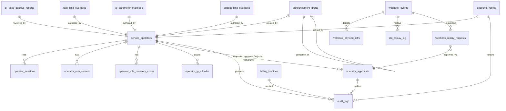

# テーブル定義書(運営者)

## 1. 文書概要

### 1.1 目的

運営者システム専用テーブル(`operator_*` / `audit_logs`(ハッシュチェーン構造の正本)/ `webhook_events` / `operator_approvals` / `accounts_retired` 等)について、カラム / 型 / 制約 / インデックス / 外部キー / コード値 / 保持期間 / 保持起点を一元化する。

### 1.2 対象範囲

- 対象: 運営者専用テーブル 19 個(認証 / 4-eyes / 監査 / Webhook / DLQ / PII / お知らせ下書き / 物理削除証跡 / 契約上書き / 月次請求 等)
- 対象外: 利用者向けテーブル(`accounts` / `projects` / `faqs` 等)、および全契約横断の規約テーブル `terms_versions` / `terms_agreements`(利用規約 / プライバシーポリシーを `doc_type` で区別、メインを正本)── [01_メインシステム/個別設計書群/04_テーブル定義書.md](../../01_メインシステム/個別設計書群/04_テーブル定義書.md) を参照(**再掲なし、共有概念正本**)

### 1.3 版数

| 項目 | 値 |
|---|---|
| 版数 | 1.0 |
| 更新日 | 2026-05-17 |

### 1.4 関連ドキュメント

| ドキュメント名 | 役割 | 参照先 |
|---|---|---|
| 索引 | 11 ドキュメント体系の俯瞰 | [00_索引.md](00_索引.md) |
| 共有概念対応表 | 共有概念の正本所在 | [../../共有/共有概念.md](../../共有/共有概念.md) |
| メイン側 テーブル定義書 | `accounts` / `projects` 等の正本 | [../../01_メインシステム/個別設計書群/04_テーブル定義書.md](../../01_メインシステム/個別設計書群/04_テーブル定義書.md) |
| API 設計書 | テーブルを操作する API | [03_API設計書.md](03_API設計書.md) |
| 認証・認可設計書 | 4-eyes 承認モデル / IP allowlist | [09_認証認可設計書.md](09_認証認可設計書.md) |
| 権限設計書 | 4-eyes 対象 10 操作 | [05_権限設計書.md](05_権限設計書.md) |
| セキュリティ設計書 | 監査ログハッシュチェーン構造 / 3 区分保持 | [10_セキュリティ設計書.md](10_セキュリティ設計書.md) |
| 課金・請求設計書 | 請求書 7 年保持 / Webhook | [11_課金請求設計書.md](11_課金請求設計書.md) |
| 詳細設計書 | 実装関連の詳細(モジュール構成 / バッチ / マイグレーション)| [../03_詳細設計書.md](../03_詳細設計書.md) |

## 2. テーブル一覧

| # | テーブル名 | 論理名 | 概要 | 主キー | 関連 FR | 保持期間 | retention_class | 状態列 |
|---|---|---|---|---|---|---|---|---|
| 1 | `service_operators` | 運営者アカウント | 1 自然人 1 アカウント | `id`(ULID)| FR-220, NFR-311 | 退職後 5 年 | `5y` | `status` |
| 2 | `operator_sessions` | 運営者セッション | 8 時間 TTL、MFA 必須 | `id` | NFR-311, D-18 | 1 年 | `1y` | - |
| 3 | `operator_mfa_secrets` | TOTP シークレット | AES-256-GCM 暗号化 | `operator_id` | FR-221 | アカウント連動 | `5y` | - |
| 4 | `operator_mfa_recovery_codes` | MFA 回復コード | 10 個、Argon2id ハッシュ | `id` | FR-221 | アカウント連動 | `5y` | - |
| 5 | `operator_ip_allowlist` | IP 許可リスト | KV TTL 60s でミラー | `id` | NFR-311 | 永久 | `5y` | - |
| 6 | `operator_approvals` | 4-eyes 申請・承認 | 自己承認禁止 + payload_hash | `id` | FR-226, §6.3.1 | 5 年 | `5y` | `state`(7値)|
| 7 | `audit_logs` | **監査ログ(ハッシュチェーン構造の正本)** | 3 区分保持(1y/5y/7y)+ tombstone | `id` | NFR-306, NFR-602, FR-229, FR-232 | retention_class 別 | `1y` / `5y` / `7y` | - |
| 8 | `webhook_events` | Stripe Webhook 受信 | event_id 冪等 | `event_id`(Stripe `evt_*` 直接利用)| FR-302, NFR-808 | 7 年 | `7y` | `state`(12値)|
| 9 | `webhook_payload_diffs` | Webhook ペイロード差分検出 | SHA-256 差分検出 | `id` | FR-302 異常系, AC-041 | 5 年 | `5y` | `state`(4値)|
| 10 | `dlq_replay_log` | DLQ リプレイ履歴 | 最大 30 日 | `id` | FR-302(c), NFR-809 | 30 日 | `1y` | - |
| 11 | `pii_false_positive_reports` | PII 誤検出報告 | 3 営業日タイマー | `id` | FR-064, NFR-805 | 5 年 | `5y` | `state`(6値)|
| 12 | `announcement_drafts` | お知らせ下書き | 訂正告知の自己参照 | `id` | FR-149, FR-188, FR-189 | 5 年 | `5y` | `state`(8値)|
| 13 | `accounts_retired` | 物理削除契約証跡 | **永久保持**(slug 再利用防止)| `contract_owner_user_id` | NFR-707 | **永久** | `7y`(物理削除 action のみ)| - |
| 14 | `owner_registration_reviews` | 契約登録審査 | EU/EEA/UK 4-eyes 承認、GDPR 越境移転 | `id` | NFR-402 | 7 年 | `7y` | (未決事項 No.1)|
| 15 | `rate_limit_overrides` | 契約別レート上書き | D1 永続化 + KV ミラー | `id` | FR-121, FR-128, FR-224(b)| 5 年 | `5y` | - |
| 16 | `ai_parameter_overrides` | AI パラメータ 3 階層上書き | グローバル/オーナー/プロジェクト | `id` | FR-055, FR-061 | 5 年 | `5y` | - |
| 17 | `budget_limit_overrides` | 運営者上書き予算上限 | 契約別予算 | `id` | FR-121(c) | 5 年 | `5y` | - |
| 18 | `billing_invoices` | 月次請求書 | cron 生成、7 年保持(電子帳簿保存法)| `id` | FR-303, NFR-602(c) | 7 年 | `7y` | `status` |
| 19 | `webhook_replay_requests` | リプレイ要求受付 | 4-eyes 承認経由 | `id` | FR-302, NFR-809 | 5 年 | `5y` | - |

> **メイン側との重要な差異**: メイン側にも `billing_invoices` が存在するが、メイン側は利用者の参照用ビューを提供。本書記載の `billing_invoices` は運営者側で cron 生成・保持の主管テーブル。実装上は同一テーブル名で同一物理テーブルを参照する設計判断とし、正本の所在(メインまたは運営者)は詳細設計で最終確定する。

### 2.1 `audit_logs.retention_class` 値の正本定義(共有概念)

`audit_logs.retention_class` の値は **クラス名表記**(`general` / `billing` / `operator_high_priv`)に統一する。期間表記(`1y` / `5y` / `7y`)はクラス名から導出できる人間可読補助。

| 正本クラス名 | 期間補助表記 | 保持期間 | 用途 |
|---|---|---|---|
| `general` | `1y` | **1 年**(NFR-602a)| 業務監査 |
| `billing` | `7y` | **7 年**(NFR-602b、電子帳簿保存法)| 課金・取引 |
| `operator_high_priv` | `5y` | **5 年**(NFR-602d、SOX 類似)| 運営者高権限操作 |

DDL CHECK 制約は両側で統一:
```sql
CHECK (retention_class IN ('general', 'billing', 'operator_high_priv'))
```

> **表記補足**: 本書および [10_セキュリティ設計書.md §7.2](10_セキュリティ設計書.md) 内で言及される `'1y'` / `'5y'` / `'7y'` 文字列は、クラス名(`general` / `billing` / `operator_high_priv`)の **人間可読補助** として残す(運営者側のドキュメント表記習慣)。両表記とも同一値を指す。

### 2.2 主要関係性(§7.2 ER 図から派生)

| 関係 | 型 | 説明 |
|---|---|---|
| `service_operators` ↔ `operator_sessions` | 1:N | セッション複数(複数デバイス) |
| `service_operators` ↔ `operator_mfa_*` | 1:1 / 1:N | MFA シークレット 1 個 + 回復コード 10 個 |
| `service_operators` ↔ `operator_approvals` | 1:N(申請者・承認者・却下者・撤回者の 4 種類)| 4-eyes |
| `service_operators` ↔ `audit_logs` | 1:N(`actor_id` 経由)| 全運営者操作の証跡 |
| `webhook_events` ↔ `webhook_payload_diffs` | 1:N | 同 `event_id` の差分検出 |
| `webhook_events` ↔ `dlq_replay_log` | 1:N | リプレイ履歴 |
| `announcement_drafts` ↔ `announcement_drafts` | 0..1:N(自己参照、`correction_of`)| 訂正告知元 |
| `operator_approvals` ↔ `audit_logs` | 1:N(`approval_id` 経由)| 4-eyes 承認の証跡参照 |

### 2.3 BR ↔ FR / 設計章マッピング(§7.1.1)

| BR | 業務要件 | 派生 FR | 主管 SCR |
|---|---|---|---|
| BR-017 | 不正利用検知・対処(運営者)| FR-121, FR-128, FR-211(e), FR-224 | SCR-093 |
| BR-018 | SaaS 全体利用状況把握(運営者)| FR-303, FR-304, FR-232 | SCR-096 |
| BR-021 | 月次請求確定通知 | FR-303 | SCR-096 |
| BR-022 | 運営からのお知らせ配信 | FR-149, FR-188, FR-189 | SCR-094 |
| BR-028 | 内部統制機能 | FR-204, FR-211, FR-220〜232, FR-302〜304 | SCR-090〜094, 096〜099 |

## 3. テーブル詳細

### 3.1 `service_operators`(運営者アカウント)

#### DDL(詳細設計書 行 3660-3682)

```sql
-- 運営者アカウント(1 自然人 1 アカウント、FR-220)
CREATE TABLE service_operators (
  id                  TEXT PRIMARY KEY,           -- ULID
  email               TEXT NOT NULL UNIQUE,
  password_hash       TEXT NOT NULL,              -- Argon2id m=128MB t=4 p=4(運営者強化プロファイル)
  display_name        TEXT NOT NULL,
  status              TEXT NOT NULL DEFAULT 'invited',
                                                  -- invited / active / disabled
  failed_login_count  INTEGER NOT NULL DEFAULT 0,
  locked_until        TEXT,                       -- ロックアウト解除時刻(5 回失敗 → 15 分)
  last_login_at       TEXT,
  invited_by          TEXT,                       -- 招待した運営者 ID
  invited_at          TEXT NOT NULL,
  activated_at        TEXT,
  disabled_at         TEXT,
  disabled_reason     TEXT,
  created_at          TEXT NOT NULL,
  updated_at          TEXT NOT NULL,
  CHECK (status IN ('invited', 'active', 'disabled')),
  FOREIGN KEY (invited_by) REFERENCES service_operators(id)
);
CREATE INDEX idx_service_operators_status ON service_operators(status);
CREATE INDEX idx_service_operators_email  ON service_operators(email);
```

#### コード値: `status`

| 値 | 説明 |
|---|---|
| `invited` | 招待中(初回パスワード未設定 + MFA 未セットアップ)|
| `active` | 有効 |
| `disabled` | 無効化(退職等)|

### 3.2 `operator_sessions`(運営者セッション)

#### DDL(行 3688-3704)

```sql
-- 運営者セッション(D-18 TTL 8h、MFA 必須)
CREATE TABLE operator_sessions (
  id                  TEXT PRIMARY KEY,           -- ULID
  operator_id         TEXT NOT NULL,
  token_hash          TEXT NOT NULL UNIQUE,       -- セッショントークンの SHA-256
  csrf_token          TEXT NOT NULL,              -- CSRF 用ランダム
  ip_address          TEXT,                       -- IP マスク前(必要時のみ参照)
  user_agent          TEXT,
  mfa_verified_at     TEXT,                       -- MFA 完了時刻
  reauthenticated_at  TEXT,                       -- 直近の再認証時刻(5 分以内チェック用)
  expires_at          TEXT NOT NULL,              -- created_at + 8h
  revoked_at          TEXT,
  created_at          TEXT NOT NULL,
  FOREIGN KEY (operator_id) REFERENCES service_operators(id)
);
CREATE INDEX idx_operator_sessions_operator ON operator_sessions(operator_id);
CREATE INDEX idx_operator_sessions_expires  ON operator_sessions(expires_at);
```

### 3.3 `operator_mfa_secrets`(TOTP シークレット)

#### DDL(行 3710-3720)

```sql
-- TOTP シークレット(AES-256-GCM 暗号化保存)
CREATE TABLE operator_mfa_secrets (
  operator_id         TEXT PRIMARY KEY,
  secret_encrypted    TEXT NOT NULL,              -- AES-256-GCM 暗号化済
  secret_iv           TEXT NOT NULL,              -- AES-GCM IV
  algorithm           TEXT NOT NULL DEFAULT 'totp-sha1-6-30',
  setup_completed_at  TEXT,
  created_at          TEXT NOT NULL,
  updated_at          TEXT NOT NULL,
  FOREIGN KEY (operator_id) REFERENCES service_operators(id)
);
```

### 3.4 `operator_mfa_recovery_codes`(MFA 回復コード)

#### DDL(行 3726-3735)

```sql
-- MFA 回復コード(10 個、1 回限り)
CREATE TABLE operator_mfa_recovery_codes (
  id                  TEXT PRIMARY KEY,
  operator_id         TEXT NOT NULL,
  code_hash           TEXT NOT NULL,              -- Argon2id ハッシュ
  used_at             TEXT,
  created_at          TEXT NOT NULL,
  FOREIGN KEY (operator_id) REFERENCES service_operators(id)
);
CREATE INDEX idx_recovery_codes_operator ON operator_mfa_recovery_codes(operator_id, used_at);
```

### 3.5 `operator_ip_allowlist`(IP 許可リスト、共有概念正本)

#### DDL(行 3741-3753)

```sql
-- 運営者別 IP 許可リスト(エッジで参照、KV キャッシュ TTL 60s)
CREATE TABLE operator_ip_allowlist (
  id              TEXT PRIMARY KEY,
  operator_id     TEXT NOT NULL,
  cidr            TEXT NOT NULL,                  -- IPv4/IPv6 CIDR
  description     TEXT,
  granted_at      TEXT NOT NULL,
  granted_by      TEXT NOT NULL,
  revoked_at      TEXT,
  FOREIGN KEY (operator_id) REFERENCES service_operators(id),
  FOREIGN KEY (granted_by) REFERENCES service_operators(id)
);
CREATE INDEX idx_ip_allowlist_operator ON operator_ip_allowlist(operator_id, revoked_at);
```

### 3.6 `operator_approvals`(4-eyes 申請・承認、共有概念正本)

#### DDL(行 3763-3800)

```sql
-- 4-eyes 申請・承認レコード
CREATE TABLE operator_approvals (
  id                  TEXT PRIMARY KEY,           -- ULID
  action_code         TEXT NOT NULL,              -- 'owner.physical_delete' 等
  state               TEXT NOT NULL DEFAULT 'requested',
                                                  -- requested / reviewing / approved / rejected / withdrawn / executed / expired
  requested_by        TEXT NOT NULL,
  approved_by         TEXT,                       -- 承認した別運営者
  rejected_by         TEXT,                       -- 却下した別運営者(他者否認)
  withdrawn_by        TEXT,                       -- 撤回した申請者本人(自己取下げ)
  payload_hash        TEXT NOT NULL,              -- sha256(canonical(payload))
  payload_json        TEXT NOT NULL,              -- 正規化後 JSON
  payload_preview     TEXT,                       -- 表示用整形済
  reason              TEXT NOT NULL,              -- 申請理由(必須)
  comment             TEXT,                       -- 承認・却下コメント
  requested_at        TEXT NOT NULL,
  reviewing_at        TEXT,
  approved_at         TEXT,
  rejected_at         TEXT,
  withdrawn_at        TEXT,
  executed_at         TEXT,
  expired_at          TEXT,
  expires_at          TEXT NOT NULL,              -- requested_at + 72h
  CHECK (state IN ('requested','reviewing','approved','rejected','withdrawn','executed','expired')),
  -- 自己承認禁止
  CHECK (requested_by IS NULL OR approved_by IS NULL OR requested_by != approved_by),
  -- 自己却下禁止
  CHECK (requested_by IS NULL OR rejected_by IS NULL OR requested_by != rejected_by),
  -- 撤回者は申請者本人のみ
  CHECK (withdrawn_by IS NULL OR withdrawn_by = requested_by),
  FOREIGN KEY (requested_by) REFERENCES service_operators(id),
  FOREIGN KEY (approved_by)  REFERENCES service_operators(id),
  FOREIGN KEY (withdrawn_by) REFERENCES service_operators(id),
  FOREIGN KEY (rejected_by)  REFERENCES service_operators(id)
);
CREATE INDEX idx_approvals_state_expires  ON operator_approvals(state, expires_at);
CREATE INDEX idx_approvals_action         ON operator_approvals(action_code, state);
CREATE INDEX idx_approvals_requested_by   ON operator_approvals(requested_by, requested_at);
```

#### 設計判断(共有概念正本)

- **自己承認禁止**: DB CHECK 制約 + アプリ層の二重チェック
- **payload_hash 改ざん検知**: 承認時 / 実行時に payload_json を再 hash して検証
- **承認 TTL 72h**: `expires_at = requested_at + 72h`(承認後の実行も 72h 以内)
- **訂正履歴**: 同一 action_code を 2 回申請する場合は別レコード(reject 後の再申請)

詳細フローは [09_認証認可設計書.md §7](09_認証認可設計書.md) を正本とする。

#### コード値: `state`(状態遷移は §8.1 参照)

### 3.7 `audit_logs`(監査ログ、ハッシュチェーン構造の正本)

#### DDL(行 3806-3834)

```sql
-- 監査ログ(ハッシュチェーン、3 区分保持)
CREATE TABLE audit_logs (
  id                  TEXT PRIMARY KEY,           -- ULID
  prev_hash           TEXT NOT NULL,              -- 前レコードの record_hash(初行は 0x00...32B)
  record_hash         TEXT NOT NULL,              -- SHA-256(prev_hash || canonical_json(other fields))
  actor_id            TEXT,                       -- service_operator / account / system / NULL
  actor_type          TEXT NOT NULL,
                                                  -- service_operator / admin / end_user / system
  action              TEXT NOT NULL,              -- <resource>.<verb>(詳細設計 §15 参照)
  target_id           TEXT,
  target_type         TEXT,
  contract_owner_user_id    TEXT,                       -- 横断操作は NULL 可(メイン側 contract_owners.user_id を参照)
  before_value        TEXT,                       -- JSON 差分
  after_value         TEXT,                       -- JSON 差分
  ip_masked           TEXT,                       -- IPv4: 末オクテット 0 / IPv6: 末 80b 0
  ticket_id           TEXT,                       -- 対応チケット(FR-231)
  approval_id         TEXT,                       -- 4-eyes 承認 ID(該当時)
  occurred_at         TEXT NOT NULL,
  retention_class     TEXT NOT NULL,              -- general / billing / operator_high_priv(§2.1 正本クラス名)
  CHECK (actor_type IN ('service_operator','admin','end_user','system')),
  CHECK (retention_class IN ('general', 'billing', 'operator_high_priv')),
  FOREIGN KEY (approval_id) REFERENCES operator_approvals(id)
);
CREATE INDEX idx_audit_actor      ON audit_logs(actor_id, occurred_at);
CREATE INDEX idx_audit_target     ON audit_logs(target_id, occurred_at);
CREATE INDEX idx_audit_action     ON audit_logs(action, occurred_at);
CREATE INDEX idx_audit_owner      ON audit_logs(contract_owner_user_id, occurred_at);
CREATE INDEX idx_audit_retention  ON audit_logs(retention_class, occurred_at);
CREATE INDEX idx_audit_ticket     ON audit_logs(ticket_id);
```

#### ハッシュチェーン設計(D-04、共有概念正本 = 運営者側)

- **計算式**: `record_hash = SHA-256(prev_hash || canonical_json(他全フィールド))`
- **初行**: `prev_hash = 0x00...(32 バイト)`
- **検証バッチ**: `AuditChainVerifierWorker`(日次 02:00 JST、全件再計算)
- **不一致検出時**: 運営者 inbox(`system`/`high`) + メール + 検証実行ログ記録(`retention_class=5y`)
- **鍵管理**: 単一鍵(Cloudflare Secret Store)、年次ローテーション、ローテーション中は 60 日 dual-decrypt

#### tombstone 方式

保持期間経過後、本文(`actor`/`target`/`IP`/`payload`)を物理削除しつつ `id` / `prev_hash` / `record_hash` / `deleted_at` を保持(チェーン破断防止)。tombstone 自体は削除しない。

### 3.8 `webhook_events`(Stripe Webhook 受信、共有概念正本)

#### DDL(行 3840-3864)

```sql
-- Stripe Webhook 受信ログ(event_id 冪等、D-06, D-10)
CREATE TABLE webhook_events (
  event_id            TEXT PRIMARY KEY,           -- Stripe evt_* をそのまま
  event_type          TEXT NOT NULL,              -- 'invoice.paid' 等
  payload_hash        TEXT NOT NULL,              -- sha256(canonical(payload))
  payload_size_bytes  INTEGER NOT NULL,
  received_at         TEXT NOT NULL,
  state               TEXT NOT NULL DEFAULT 'received',
                                                  -- 12 状態(下記 CHECK 制約参照)
  last_transition_at  TEXT NOT NULL,
  attempt_count       INTEGER NOT NULL DEFAULT 0,
  next_retry_at       TEXT,
  dlq_path            TEXT,                       -- R2 退避パス
  contract_owner_user_id    TEXT,                       -- 関連契約(イベント種別による、メイン側 contract_owners.user_id を参照)
  stripe_api_version  TEXT,                       -- '2024-06-20' 等
  CHECK (state IN ('received','verifying_signature','rejected','checking_idempotency',
                   'processing','succeeded','failed','dlq_retrying','dlq_manual_replay',
                   'dlq_archived','duplicate_skipped_hash_match','duplicate_diff_detected_high_alert'))
);
CREATE INDEX idx_webhook_events_state_received ON webhook_events(state, received_at);
CREATE INDEX idx_webhook_events_owner          ON webhook_events(contract_owner_user_id, received_at);
CREATE INDEX idx_webhook_events_next_retry     ON webhook_events(next_retry_at) WHERE next_retry_at IS NOT NULL;
```

#### コード値: `state`(状態遷移は §8.2 参照)

### 3.9 `webhook_payload_diffs`(Webhook ペイロード差分検出)

#### DDL(行 3870-3888)

```sql
-- ペイロード差分検出履歴(同 event_id + payload_hash 不一致)
CREATE TABLE webhook_payload_diffs (
  id                  TEXT PRIMARY KEY,
  event_id            TEXT NOT NULL,
  original_payload_hash TEXT NOT NULL,
  new_payload_hash    TEXT NOT NULL,
  diff_summary        TEXT NOT NULL,              -- JSON: { added: [...], removed: [...], changed: [...] }
  state               TEXT NOT NULL DEFAULT 'detected',
                                                  -- detected / reviewed / reprocessed_manually / dismissed_no_action
  detected_at         TEXT NOT NULL,
  reviewed_at         TEXT,
  reviewed_by         TEXT,
  decided_at          TEXT,
  decision_reason     TEXT,
  CHECK (state IN ('detected','reviewed','reprocessed_manually','dismissed_no_action')),
  FOREIGN KEY (event_id)    REFERENCES webhook_events(event_id),
  FOREIGN KEY (reviewed_by) REFERENCES service_operators(id)
);
CREATE INDEX idx_diffs_state_detected ON webhook_payload_diffs(state, detected_at);
```

### 3.10 `dlq_replay_log`(DLQ リプレイ履歴)

#### DDL(行 3894-3907)

```sql
-- DLQ リプレイ履歴
CREATE TABLE dlq_replay_log (
  id                  TEXT PRIMARY KEY,
  event_id            TEXT NOT NULL,
  replay_type         TEXT NOT NULL,              -- 'auto_bo' / 'manual'
  attempted_at        TEXT NOT NULL,
  attempted_by        TEXT,                       -- manual 時の運営者 ID
  result              TEXT NOT NULL,              -- 'succeeded' / 'failed'
  error_detail        TEXT,
  ticket_id           TEXT,
  FOREIGN KEY (event_id)     REFERENCES webhook_events(event_id),
  FOREIGN KEY (attempted_by) REFERENCES service_operators(id)
);
CREATE INDEX idx_replay_event ON dlq_replay_log(event_id, attempted_at);
```

### 3.11 `pii_false_positive_reports`(PII 誤検出報告)

#### DDL(行 3934-3959)

```sql
-- PII 誤検出報告
CREATE TABLE pii_false_positive_reports (
  id                  TEXT PRIMARY KEY,
  reporter_type       TEXT NOT NULL,              -- 'admin' / 'service_operator'
  reporter_id         TEXT,
  contract_owner_user_id    TEXT,
  detection_layer     TEXT NOT NULL,              -- 'layer_1' / 'layer_2' / 'layer_3'
  detected_text_masked TEXT NOT NULL,             -- マスキング後
  context_excerpt     TEXT,                       -- 周辺コンテキスト(マスキング後)
  state               TEXT NOT NULL DEFAULT 'reported',
                                                  -- reported / under_review / ruled_false_positive /
                                                  -- ruled_correct_detection / rule_updated / archived
  reported_at         TEXT NOT NULL,
  review_started_at   TEXT,
  review_due_at       TEXT,                       -- + 3 営業日
  reviewed_by         TEXT,
  ruled_at            TEXT,
  rule_revision_id    TEXT,                       -- 更新したルールリビジョン
  archived_at         TEXT,
  CHECK (state IN ('reported','under_review','ruled_false_positive','ruled_correct_detection','rule_updated','archived')),
  CHECK (detection_layer IN ('layer_1','layer_2','layer_3')),
  FOREIGN KEY (reviewed_by)     REFERENCES service_operators(id),
  FOREIGN KEY (rule_revision_id) REFERENCES pii_rules_revisions(id)
);
CREATE INDEX idx_pii_state_reported ON pii_false_positive_reports(state, reported_at);
CREATE INDEX idx_pii_review_due     ON pii_false_positive_reports(state, review_due_at) WHERE state = 'under_review';
```

> **注**: `pii_rules_revisions` テーブルは詳細設計内に別途定義(本書一覧外)。必要に応じて本書追加を検討。

### 3.12 `announcement_drafts`(お知らせ下書き)

#### DDL(行 4015-4048)

```sql
-- お知らせ下書き・配信予約(D-09)
CREATE TABLE announcement_drafts (
  id                  TEXT PRIMARY KEY,
  kind                TEXT NOT NULL,              -- 'announcement' / 'system'
  severity            TEXT NOT NULL,              -- 'low' / 'normal' / 'high'
  scope_type          TEXT NOT NULL,              -- 'all' / 'owners' / 'user_types'
  scope_targets_json  TEXT,                       -- owners の場合 [contract_owner_user_id, ...]
  subject             TEXT NOT NULL,
  body_html_sanitized TEXT NOT NULL,              -- 永続化前サニタイズ後
  opt_out             TEXT NOT NULL DEFAULT 'optional',
                                                  -- 'optional' / 'mandatory'
  scheduled_at        TEXT,
  state               TEXT NOT NULL DEFAULT 'draft',
                                                  -- draft / preview / scheduled / sending / sent / failed / cancelled / dlq
  attempt_count       INTEGER NOT NULL DEFAULT 0,
  next_retry_at       TEXT,
  created_by          TEXT NOT NULL,
  created_at          TEXT NOT NULL,
  updated_at          TEXT NOT NULL,
  cancelled_at        TEXT,
  sent_at             TEXT,
  failed_at           TEXT,
  failed_reason       TEXT,
  dlq_at              TEXT,
  correction_of       TEXT,                       -- 訂正告知元 ID
  CHECK (state IN ('draft','preview','scheduled','sending','sent','failed','cancelled','dlq')),
  CHECK (kind IN ('announcement','system')),
  CHECK (severity IN ('low','normal','high')),
  CHECK (opt_out IN ('optional','mandatory')),
  FOREIGN KEY (created_by)    REFERENCES service_operators(id),
  FOREIGN KEY (correction_of) REFERENCES announcement_drafts(id)
);
CREATE INDEX idx_ann_state_scheduled ON announcement_drafts(state, scheduled_at);
CREATE INDEX idx_ann_created_by      ON announcement_drafts(created_by, created_at);
```

> **重要度の正本**: 本テーブルの `severity`(`low` / `normal` / `high`)は内部運用用。利用者向けには [メイン側 メッセージ一覧 §2.4](../../01_メインシステム/個別設計書群/07_メッセージ一覧.md) の通知重要度 4 値(`low` / `normal` / `high` / `critical`)と対応付ける(`critical` は別建ての緊急通知パスで管理)。

### 3.13 `accounts_retired`(物理削除契約証跡、永久保持)

#### DDL(行 3988-3998)

```sql
-- 物理削除済契約識別子の永久保持(NFR-707、slug 再利用防止)
CREATE TABLE accounts_retired (
  contract_owner_user_id    TEXT PRIMARY KEY,     -- 旧 accounts.id(現 contract_owners.user_id)
  slug                TEXT NOT NULL UNIQUE,       -- 旧 accounts.slug(現 contract_owners.slug)
  retired_at          TEXT NOT NULL,
  reason              TEXT NOT NULL,              -- 物理削除理由(運営者入力)
  operator_id         TEXT NOT NULL,
  ticket_id           TEXT,
  FOREIGN KEY (operator_id) REFERENCES service_operators(id)
);
CREATE INDEX idx_retired_retired_at ON accounts_retired(retired_at);
```

#### 設計判断

- **永久保持**(`RetentionPurgeWorker` 対象外)
- **slug 再利用防止が主目的**: `contract_owners.user_id` および `contract_owners.slug` の UNIQUE 制約に WHERE 句を含めない(NFR-707)
- 物理削除実行時に必ず本テーブルへ INSERT。`audit_logs.action = owner.physical_delete`(retention_class=`7y`)と一対

### 3.14 `owner_registration_reviews`(契約登録審査)

#### 詳細設計内 DDL は未収載 ── 基本設計のみ言及

| 項目 | 内容 |
|---|---|
| 用途 | EU / EEA / UK 契約の GDPR 越境移転規制対応、登録審査状態管理 |
| 主管 FR | NFR-402 |
| 想定スキーマ | `id` / `contract_owner_user_id` / `region`(`eu` / `eea` / `uk` / `jp` 等)/ `state`(`pending` / `under_review` / `approved` / `rejected`)/ `consent_document_url` / `reviewer_id`(4-eyes)/ `reviewed_at` / `created_at` |
| 4-eyes 種別 | 承認ログ(action: `owner.legal_review.record`、retention_class=`7y`)|

**未決事項 No.1**: 詳細設計に DDL がないため、詳細設計で正式定義する。

### 3.15 `rate_limit_overrides`(契約別レート上書き)

#### 詳細設計内 DDL は未収載 ── 基本設計のみ言及

| 項目 | 内容 |
|---|---|
| 用途 | 契約別レート制限の運営者上書き(SCR-093 経由、4-eyes 承認ログ)|
| 主管 FR | FR-121, FR-128, FR-224(b) |
| 想定スキーマ | `id` / `contract_owner_user_id` / `endpoint_kind` / `rps` / `rpm` / `valid_until` / `reason` / `created_by` / `created_at` |
| KV ミラー | TTL 60s。エッジで参照 |

> **メイン側との関係**: メイン側では `owner_quota_overrides` テーブルで `rate_limit` / `budget` / `quota` を `resource_kind` で区別して統一実装(行 6337-6350)。運営者側基本設計では `rate_limit_overrides` / `budget_limit_overrides` を別テーブルとして言及するが、DDL 未収載のため、**実装はメイン側統一テーブルに準拠** を方針とする(詳細設計で最終確定)。

### 3.16 `ai_parameter_overrides`(AI パラメータ 3 階層上書き)

#### 詳細設計内 DDL は未収載 ── 基本設計のみ言及

| 項目 | 内容 |
|---|---|
| 用途 | AI 推論パラメータの 3 階層(`global` / `owner` / `project`)上書き(SCR-092、**4-eyes ハードゲート**)|
| 主管 FR | FR-055, FR-061 |
| 想定スキーマ | `id` / `scope`(`global` / `owner` / `project`)/ `contract_owner_user_id` / `project_id` / `confidence_threshold` / `relevance_threshold` / `version` / `created_by` / `created_at` |

> **メイン側との関係**: メイン側 `ai_threshold_persistent_cache`(行 6323-6335)が AI しきい値の永続キャッシュ。本テーブルは運営者上書きの原典で、IF #6 経由でメイン側へ反映される。

### 3.17 `budget_limit_overrides`(契約別予算上限)

§3.15 と同様、詳細設計内 DDL 未収載。

| 項目 | 内容 |
|---|---|
| 用途 | 月次予算上限の運営者上書き(SCR-093、4-eyes 承認ログ)|
| 主管 FR | FR-121(c) |

### 3.18 `billing_invoices`(月次請求書、運営者側主管)

メイン側 [`billing_invoices`](../../01_メインシステム/個別設計書群/04_テーブル定義書.md#324-billing_invoices請求書7-年保持) と同名・同物理テーブル。月次集計確定 cron(運営者側 §11)で生成。

| 項目 | 内容 |
|---|---|
| 主管 FR | FR-303, NFR-602(c) |
| 保持期間 | 7 年(電子帳簿保存法対応) |
| 関連 retention_class | `7y` / `billing` |

DDL はメイン側を参照。

### 3.19 `webhook_replay_requests`(リプレイ要求受付)

#### 詳細設計内 DDL は未収載 ── 基本設計のみ言及

| 項目 | 内容 |
|---|---|
| 用途 | SCR-097 からのリプレイ要求の受付(`dlq_replay_log` と対になる申請レコード)|
| 主管 FR | FR-302, NFR-809 |
| 4-eyes 種別 | 承認ログ(action: `webhook.replay`、retention_class=`5y`)|
| 想定スキーマ | `id` / `event_id` / `requested_by` / `approval_id`(`operator_approvals.id`)/ `executed_at` / `result` / `created_at` |

## 4. ER 図(運営者側、§7.2 から移管)



## 5. テーブル間関連(§2.2 と同期)

§2.2「主要関係性」を参照。

## 6. 命名規則・型方針(§7.9 から移管)

| 種別 | 規則 |
|---|---|
| テーブル名 | snake_case 複数形(`audit_logs`、`webhook_events`)|
| カラム名 | snake_case 単数形(`contract_owner_user_id`、`occurred_at`)|
| 状態列 | `state`、値は snake_case |
| 主キー | UUID v4 / ULID / Stripe ID(`evt_*`、`sub_*`)|
| タイムスタンプ | UTC(`TIMESTAMP`)、表示時 JST 変換 |
| KV キープレフィックス | `<feature>:<scope>:<id>` |
| KV キー命名 | コロン区切り、英小文字 + ハイフン |

## 7. SaaS データ分離観点(運営者側固有)

### 7.1 運営者は全契約横断アクセス

運営者は `service_operator` ロールで全契約のリソースを参照・操作可能(**オーナー境界判定を適用しない**)。代わりに以下の多段ガードを適用:

1. IP allowlist(`operator_ip_allowlist`、§3.5)
2. MFA(`operator_mfa_*`、§3.3 / 3.4)
3. 再認証(5 分以内、`operator_sessions.reauthenticated_at`、§3.2)
4. ロール検証(`service_operator`)
5. 4-eyes 承認(10 操作、`operator_approvals`、§3.6)
6. 監査ログ全件(`audit_logs`、§3.7)

### 7.2 監査ログの完全性

- 全運営者操作 + 全 4-eyes 承認 + 全 API 呼び出しを `audit_logs` に記録
- ハッシュチェーン構造(D-04) + 日次完全性検証バッチ(`AuditChainVerifierWorker` 02:00 JST)
- 監査ログの削除は禁止(保持期間経過時のみ tombstone 処理、削除事実を残す)

詳細は [10_セキュリティ設計書.md §7](10_セキュリティ設計書.md) を正本とする。

## 8. 状態コード値・状態遷移(§4 + 付録 B から移管)

### 8.1 4-eyes 申請・承認状態(`operator_approvals.state`、付録 B.3)

| From | To | トリガー | 制約 |
|---|---|---|---|
| (新規) | `requested` | 運営者申請 | `requested_at=now`、`expires_at=requested_at + 72h` |
| `requested` | `reviewing` | 別運営者の確認開始 | - |
| `requested` | `expired` | 72h 経過 | 自動 |
| `requested` | `withdrawn` | 申請者自己取下げ | `withdrawn_by = requested_by` |
| `reviewing` | `approved` | 別運営者承認 | `requested_by != approved_by` |
| `reviewing` | `rejected` | 別運営者却下 | `requested_by != rejected_by` |
| `reviewing` | `withdrawn` | 申請者自己取下げ | 同上 |
| `reviewing` | `expired` | 72h 経過 | 自動 |
| `approved` | `executed` | 申請者実行 | **payload_hash 再検証一致必須** |
| `approved` | `expired` | 承認後 72h 未実行 | 自動 |

### 8.2 Webhook イベント状態遷移(`webhook_events.state`、付録 B.2)

| From | To | トリガー | 副作用 |
|---|---|---|---|
| (新規) | `received` | Stripe POST 受信 | - |
| `received` | `verifying_signature` | 署名検証開始 | - |
| `verifying_signature` | `rejected` | 署名 NG | 401 + 運営者 high |
| `verifying_signature` | `checking_idempotency` | 署名 OK | - |
| `checking_idempotency` | `processing` | event_id 未処理 | INSERT |
| `checking_idempotency` | `duplicate_skipped_hash_match` | 既処理 + ハッシュ一致 | 200 OK + ログ |
| `checking_idempotency` | `duplicate_diff_detected_high_alert` | 既処理 + ハッシュ不一致 | 200 OK + SCR-099 + high |
| `processing` | `succeeded` | 内部転送成功 | - |
| `processing` | `failed` | 5xx / Timeout 30s | DLQ 投入 |
| `failed` | `dlq_retrying` | 1 時間自動指数 BO | - |
| `dlq_retrying` | `succeeded` | 再試行成功 | - |
| `dlq_retrying` | `dlq_manual_replay` | 1 時間経過 | SCR-097 待ち |
| `dlq_manual_replay` | `succeeded` | 運営者リプレイ成功 | - |
| `dlq_manual_replay` | `dlq_archived` | 30 日経過 | R2 退避 |

### 8.3 お知らせ下書き状態(`announcement_drafts.state`、付録 B.4)

| From | To | トリガー |
|---|---|---|
| (新規) | `draft` | SCR-094 新規作成 |
| `draft` | `preview` | プレビュー表示 |
| `preview` | `draft` | 編集に戻る |
| `preview` | `scheduled` | 配信予約確定 |
| `preview` | `sending` | 即時配信実行 |
| `scheduled` | `sending` | `scheduled_at` 到達 |
| `scheduled` | `cancelled` | `scheduled_at - 5 分` まで取消 |
| `sending` | `sent` | IF #7 成功 |
| `sending` | `failed` | IF #7 失敗 |
| `failed` | `sending` | 自動 BO 再試(1m → 4m → 16m)|
| `failed` | `dlq` | 自動 BO 3 回失敗 → 永久失敗 |

### 8.4 PII 誤検出報告状態(`pii_false_positive_reports.state`、付録 B.5)

| From | To | トリガー |
|---|---|---|
| (新規) | `reported` | 報告元送信 |
| `reported` | `under_review` | 運営者確認開始(3 営業日タイマー)|
| `under_review` | `ruled_false_positive` | 誤検出判定 |
| `under_review` | `ruled_correct_detection` | 正検出判定 |
| `ruled_false_positive` | `rule_updated` | KV ルール更新完了 |
| `rule_updated` | `archived` | 終了 |
| `ruled_correct_detection` | `archived` | 終了 |

### 8.5 Webhook 差分状態(`webhook_payload_diffs.state`、付録 B.6)

| From | To | トリガー |
|---|---|---|
| (新規) | `detected` | BillingWebhookWorker 検出 |
| `detected` | `reviewed` | 運営者 SCR-099 確認 |
| `reviewed` | `reprocessed_manually` | SCR-097 手動再処理 |
| `reviewed` | `dismissed_no_action` | 無視可判断 |

### 8.6 契約状態(`contract_owners.contract_status`、付録 B.7)

メイン側 [テーブル定義書 §8.5](../../01_メインシステム/個別設計書群/04_テーブル定義書.md#85-契約状態遷移contract_ownerscontract_status共有概念正本) を参照。運営者側責務は IF #1 経由の遷移トリガーとサスペンション解除(4-eyes 承認)。

## 9. 監査ログ action コード × retention_class 割当表(付録 F 全件、共有概念正本)

### 9.1 `1y`(業務監査)

`faq.create` / `faq.update` / `faq.publish` / `faq.delete` /
`project.create` / `project.update` / `project.delete` /
`chat.reply` / `chat.close` / `chat.reopen` /
`unresolved.assign` / `unresolved.close` /
`account.login` / `account.logout` / `account.password_change` /
`inbox.read` / `inbox.read.bulk` /
`widget.config.update` /
`apikey.rotate`(利用者側)

### 9.2 `5y`(運営者高権限)

`owner.suspend` / `owner.restore` / `owner.physical_delete`(※物理削除のみ `7y` に格上げ) /
`ai_parameter.update` / `ai_model.switch` /
`rate_limit.override` / `budget_limit.override` /
`announcement.send` /
`operator.invite` / `operator.disable` / `operator.mfa_reset` / `operator.password_reset` /
`operator_approval.request` / `operator_approval.approve` / `operator_approval.reject` / `operator_approval.execute` /
`webhook.replay` / `webhook.payload_diff.*` /
`pii_rule.update` / `audit.export` / `prod.direct_change` / `master_key.rotate`

### 9.3 `7y`(課金・取引)

`billing.invoice.issued` / `billing.credit_note.issued` /
`billing.cron.run` /
`stripe.event.processed` / `stripe.event.replayed` /
`owner.physical_delete`(契約物理削除は `5y` ではなく `7y` 扱い)/
`owner.legal_review.record`

## 10. インデックス方針(§7.10 から移管)

| テーブル | インデックス | 用途 |
|---|---|---|
| `webhook_events` | `(state, received_at)`, `(contract_owner_user_id, received_at)`, `next_retry_at`(WHERE NOT NULL)| DLQ 監視 / リプレイ検索 |
| `audit_logs` | `(actor_id, occurred_at)`, `(target_id, occurred_at)`, `(action, occurred_at)`, `(contract_owner_user_id, occurred_at)`, `(retention_class, occurred_at)`, `ticket_id` | SCR-096 検索 / 保持区分別削除 |
| `pii_false_positive_reports` | `(state, reported_at)`, `(state, review_due_at)` WHERE state='under_review' | 3 営業日判定 |
| `operator_approvals` | `(state, expires_at)`, `(action_code, state)`, `(requested_by, requested_at)` | 承認待ち TTL 監視 |
| `announcement_drafts` | `(state, scheduled_at)`, `(created_by, created_at)` | 1 分ポーリング |
| `billing_invoices` | `(contract_owner_user_id, billing_year_month)` UNIQUE | 冪等性 |

## 11. データ削除モード(運営者側固有)

- `accounts_retired` は **永久保持**(GDPR 越境移転対応 / 契約物理削除の証跡)
- `audit_logs` は保持期間経過後 **tombstone 処理**(削除事実を残す)
- `operator_*` は退職処理時に物理削除(MFA 鍵は即時削除)
- `webhook_events` は 7 年保持後に物理削除(R2 archive 経由)

## 12. 未決事項

| No | 内容 | 確認先 | ステータス |
|---|---|---|---|
| 1 | `owner_registration_reviews` の DDL 未収載(基本設計のみ言及)| 02_運営者システム/03_詳細設計書.md | 補正待ち |
| 2 | `rate_limit_overrides` / `budget_limit_overrides` / `ai_parameter_overrides` の DDL 未収載 | 02_運営者システム/03_詳細設計書.md | メイン側 `owner_quota_overrides` 統一実装に準拠の方針 |
| 3 | `webhook_replay_requests` の DDL 未収載(基本設計のみ言及)| 02_運営者システム/03_詳細設計書.md | 補正待ち |
| 4 | `pii_rules_revisions` テーブル(`pii_false_positive_reports.rule_revision_id` FK 先)| 02_運営者システム/03_詳細設計書.md | 別途定義の有無を確認 |
| 5 | `announcement_drafts.severity`(`low` / `normal` / `high`)と通知重要度 4 値(`critical` 含む)の対応 | メッセージ一覧 07 §2.4 | `critical` 通知は別建てパスで対応済 |

## 13. 変更履歴

| 日付 | 版数 | 変更内容 | 変更者 |
|---|---|---|---|
| 2026-05-17 | 1.0 | 初版作成 | claude |
