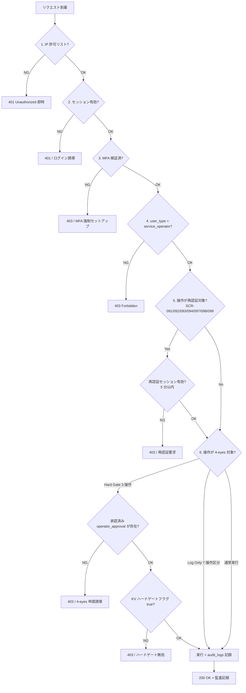
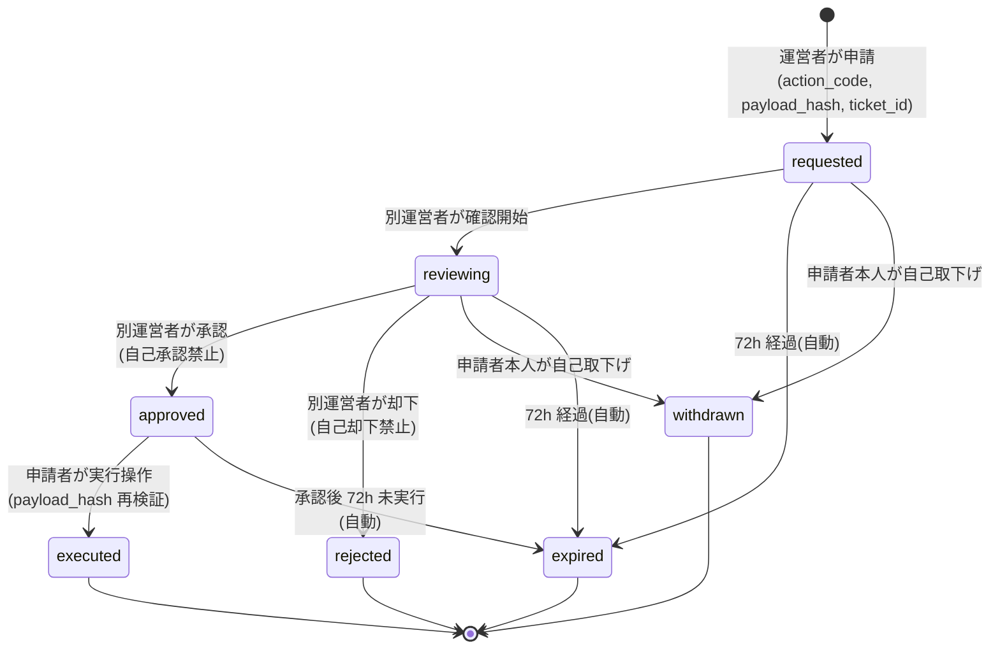

# 認証・認可設計書(運営者)

## 1. 文書概要

### 1.1 目的

運営者システムの認証(ログイン / MFA / セッション / パスワードリセット)、認可(**6 段判定 / 4-eyes 承認フロー**)、IP allowlist、再認証(5 分以内)、運営者アカウント・ライフサイクル を一元化する。

### 1.2 対象範囲

- 対象: 運営者の認証・認可全般
- 対象外: 利用者の認証・認可([01_メインシステム/個別設計書群/09_認証認可設計書.md](../../01_メインシステム/個別設計書群/09_認証認可設計書.md) 参照)

### 1.3 版数

| 項目 | 値 |
|---|---|
| 版数 | 1.0 |
| 更新日 | 2026-05-17 |

### 1.4 関連ドキュメント

| ドキュメント名 | 役割 | 参照先 |
|---|---|---|
| 索引 | 11 ドキュメント体系の俯瞰 | [00_索引.md](00_索引.md) |
| 権限設計書 | 4-eyes 対象 10 操作 | [05_権限設計書.md](05_権限設計書.md) |
| セキュリティ設計書 | 監査・ログ / 鍵管理(参照)| [10_セキュリティ設計書.md](10_セキュリティ設計書.md) |
| API 設計書 | 認証 API / 4-eyes API | [03_API設計書.md](03_API設計書.md) |
| エラー設計書 | 認証・認可エラー | [06_エラー設計書.md](06_エラー設計書.md) |
| テーブル定義書 | `operator_*` / `operator_approvals` | [04_テーブル定義書.md](04_テーブル定義書.md) |
| メイン側 認証・認可設計書 | 利用者認証(IP allowlist 契約単位オプトインの参照元)| [../../01_メインシステム/個別設計書群/09_認証認可設計書.md](../../01_メインシステム/個別設計書群/09_認証認可設計書.md) |

## 2. 認証方式

| 認証方式 | 利用有無 | 概要 | 備考 |
|---|---|---|---|
| メールアドレス / パスワード | ◯ | Argon2id **運営者強化プロファイル**(`m=128MB, t=4, p=4, salt=16B`)| パスワード要件は §5 |
| **MFA(TOTP RFC 6238)** | **◯(必須)** | HMAC-SHA1, 6 桁, 30 秒 | §4 |
| 回復コード | ◯ | 10 個、Argon2id ハッシュ、1 回限り | §4 |
| IP allowlist | ◯ | **ホワイトリスト方式**(共有概念正本)| §3 |
| パスワードリセット | ◯ | 60 分有効、**自己リセット禁止** → 別運営者承認経由 | §6 |
| SSO / SAML | × | MVP 範囲外 | Future |

## 3. IP allowlist(共有概念正本)

(§10.2 から移管)

| 項目 | 仕様 |
|---|---|
| 適用箇所 | 運営者 Worker(`admin.open-faq.example.com`)の入口 |
| データ | `operator_ip_allowlist(operator_id, cidr, description, granted_at)` |
| 評価方式 | リクエスト元 IP が許可 CIDR にマッチするかを KV で即時参照(**TTL 60s**)|
| 未許可時の応答 | **403 Forbidden**(ログイン画面さえ表示しない)|
| ホワイトリスト推奨 | 本社 IP・VPN IP・運営者自宅 IP |
| 一時例外 | メイン要件 §6.2.1 緊急区分(特に区分 2 全員ロックアウト)+ §6.2.2 発動条件成立時に限り、別運営者の追加で許可 + 監査記録 |
| KV キー | `ip-allowlist:<operator_id>` |
| 変更操作 | 4-eyes 承認ログ(`audit_logs.action = ip_allowlist.update`、retention=`5y`)|

メイン側 認証・認可設計書では「**契約単位 IP allowlist オプトイン**」として本書を参照する(契約別に有効化できる Future 機能の正本)。

## 4. MFA(TOTP)

(§10.3 から移管)

| 項目 | 仕様 |
|---|---|
| 方式 | TOTP RFC 6238, HMAC-SHA1, 6 桁, 30 秒 |
| 初回トークン | SCR-AUTH-M1 で QR コード / シークレット表示、有効期限 **72 時間** |
| 回復コード | 10 個、**Argon2id ハッシュ**、1 回限り使用 |
| シークレット保管 | `operator_mfa_secrets`(**AES-256-GCM 暗号化**、オーナー派生鍵で暗号化)|
| MFA リセット | **自己リセット禁止**、別運営者 + 組織内承認(4-eyes 承認ログ)|
| ロックアウト | TOTP 失敗 5 回で `(IP × operator_id)` を 15 分ロック |
| 失敗時 | `audit_logs.action = operator.mfa.failed`(retention=`5y`)|

## 5. セッション・トークン設計

(§10.0 / §10.1 から移管)

| 項目 | 内容 |
|---|---|
| セッション方式 | Cookie + DB セッション(`operator_sessions` テーブル) + KV キャッシュ(TTL 60s) |
| セッション TTL | **8 時間**(MVP、D-18)|
| **再認証(FR-005)** | **5 分以内、操作 1 回限り**(SCR-091 / 092 / 093 / 094 / 097 / 098 / 099 の高権限操作の前)|
| Cookie 属性 | `Secure; HttpOnly; SameSite=Lax; Path=/; Domain=admin.open-faq.example.com` |
| パスワードハッシュ | Argon2id **運営者強化プロファイル**(`m=128MB, t=4, p=4, salt=16B`)|
| パスワード要件 | 12 文字以上、大文字 + 小文字 + 数字 + 記号各 1 文字以上 |
| ログイン失敗ロックアウト | 5 回失敗 → `(IP × operator_id)` を 15 分ロック(FR-007)|
| パスワードリセット | 60 分有効、**自己リセット禁止** → 別運営者承認経由(NFR-311)|
| 同時ログイン | 複数デバイス可、SCR-090 でアクティブセッション一覧確認可 |
| 強制ログアウト | 別運営者の操作で全セッション無効化(KV キャッシュ 60s)|
| CSRF | Double Submit Cookie + `X-CSRF-Token` ヘッダ突合 |

### 5.1 重要操作の再認証(FR-222)対象

| 重要操作 | 関連画面 | API |
|---|---|---|
| 削除データ復元 | SCR-091 | `POST /admin/v1/restorations` |
| AI パラメータ変更 | SCR-092 | `PUT /admin/v1/ai-parameters/{scope}/{id}` |
| レート / 上限件数上書き | SCR-093 | `PUT /admin/v1/overrides/*` |
| お知らせ予約 / 即時配信 | SCR-094 | `POST /admin/v1/announcements/*` |
| Webhook リプレイ | SCR-097 | `POST /admin/v1/webhooks/replay` |
| PII ルール更新 | SCR-098 | `POST /admin/v1/pii-rules/revisions` |
| ペイロード差分手動再処理 | SCR-099 | `POST /admin/v1/webhook-diffs/{id}/reprocess` |

## 6. 運営者アカウント・ライフサイクル(§3.5 から移管)

| イベント | 実行可能者 | 監査記録 |
|---|---|---|
| 発行(`account.invite`)| 既存運営者(MVP は全員)/ ブートストラップ管理者 | `audit_logs(retention_class='5y')`、action=`operator.invite` |
| MFA 初回設定 | 本人(初回 72h セットアップトークン経由)| 同上、action=`operator.mfa.setup` |
| **MFA リセット** | **別運営者 + 組織内承認**(自己リセット禁止)| 同上、action=`operator.mfa.reset` |
| **パスワード再設定** | **別運営者 + 組織内承認**(自己リセット禁止)| 同上、action=`operator.password.reset` |
| 無効化(`account.disable`)| 既存運営者 | 同上、action=`operator.disable` |
| 再有効化(`account.enable`)| 既存運営者 | 同上、action=`operator.enable` |

## 6.1 操作チケット ID 入力規約(§3.6 から移管)

要件 FR-224 / FR-231 に従い、運営者の高権限操作には対応チケット ID の入力を必須化する。

| 項目 | 仕様 |
|---|---|
| 形式 | 任意の文字列。推奨形式 `INC-XXXXX`(運営者側で規約定義)|
| 入力場所 | SCR-091〜094 / SCR-097(リプレイ操作)/ SCR-098(ルール更新)/ SCR-099(差分再処理)の各操作前モーダル |
| 監査記録 | `audit_logs.ticket_id` 列に保存、SCR-096 から逆引き検索可 |
| バリデーション | 必須・空白除外・最大 64 文字 |
| ヘッダ | `X-Op-Ticket-Id`(各 API リクエストの Request Body にも `ticket_id` を必須フィールドとして含める)|

## 7. 認可モデル

### 7.1 認可方式

単一ロール `service_operator` + 4-eyes 多段ガード(本書 §8)+ 全操作監査ログ(セキュリティ設計書 10 §7)

### 7.2 オーナー境界

**運営者はオーナー境界を適用しない**(全契約横断アクセス)。代わりに以下のガード:

1. IP allowlist(§3)
2. MFA(§4)
3. 再認証(5 分以内、§5)
4. ロール検証(`service_operator`)
5. 4-eyes 承認(§8)
6. 監査ログ全件(セキュリティ設計書 10 §7)

### 7.3 6 段認可判定順序(共有概念正本、§3.4 から移管)

各段階のエラー応答とメッセージは [06_エラー設計書.md §5](06_エラー設計書.md) を参照。

## 8. 4-eyes 承認フロー(本書の中核、共有概念正本)

### 8.1 4-eyes 対象操作(§3.3 から移管)

#### MVP ハードゲート(3 操作・フルワークフロー必須)

| 対象操作 | 実装 |
|---|---|
| **(1) 契約物理削除**(`deleted_pending → deleted`)| `operator_approvals` テーブルでの申請 → 別運営者承認 → 実行の **フルワークフローを必須**。承認なしの実行は API 層で拒否(403)。承認待ち TTL 72h |
| **(2) AI 推論パラメータ変更**(信頼度 / 関連度しきい値・モデル切替)| 同上 |
| **(3) マスター鍵ローテーション** | 同上 |

#### MVP 承認ログのみ(7 操作・単独実行許容)

| 対象操作 | action code |
|---|---|
| (4) 契約無効化(`active → suspended`)| `owner.suspend` |
| (5) 契約復元(削除猶予中 → `active`)| `owner.restore` |
| (6) 従量単価表・無料枠の改定 | `pricing.update` |
| (7) 契約別レート制限・上限件数の上書き | `rate_limit.override` / `usage_limit.override` |
| (8) 緊急ウィジェット強制停止 | `owner.force_stop` |
| (9) 削除データの復元(FR-204)| `owner.restore_data` |
| (10) ハードゲート KV フラグ切替 | `feature.hard_gate.toggle` |

### 8.2 ハードゲート KV フラグの管理

KV `feature:hard-gate:<action_code>` は **緊急一時無効化(true → false 一時切替)のみ**(メイン要件 §6.2.1 区分 3 セキュリティインシデント + §6.2.2 発動条件成立時に限る)。

フラグ変更操作は 4-eyes 承認ログ対象(`feature.hard_gate.toggle`、`retention_class='5y'`)。

### 8.3 `operator_approvals` データモデル(論理設計、§6.5 から移管)

物理スキーマは [04_テーブル定義書.md §3.6](04_テーブル定義書.md) を正本とする。論理設計:

| 要素 | 設計 |
|---|---|
| データモデル | `operator_approvals(id, action_code, requested_by, approved_by, payload_hash, payload_json, state, requested_at, approved_at, executed_at, expires_at)` |
| **承認待ち TTL** | **72 時間**(`expires_at = requested_at + 72h`)、超過は自動 `expired` |
| **自己承認禁止** | DB CHECK 制約: `requested_by IS NULL OR approved_by IS NULL OR requested_by != approved_by` + アプリ層チェック |
| **自己却下禁止** | DB CHECK 制約: `requested_by != rejected_by` + アプリ層チェック |
| **payload 改ざん防止** | 承認時に `payload_hash`(SHA-256)を確定、実行時に再計算して照合。不一致は実行不可 |
| **ハードゲート対象** | KV `feature:hard-gate:<action_code>` で動的制御(MVP は 3 操作のみ true)|
| **承認後 TTL** | 承認後 72h 以内未実行で `expired`、再申請が必要 |
| **緊急例外手続き** | MVP では紙ベース回復コード手続き(§12.3 RB-014)|

### 8.4 4-eyes 申請・承認状態遷移(§4.5 から移管)

### 8.5 申請 → 承認 → 実行フロー

1. **申請**(SCR-APPROVALS-M1): 申請者が action / payload / ticket_id を入力。`payload_hash = SHA-256(payload_json)` を計算して保存
2. **通知**: 全運営者へ inbox + email 通知(`high`)
3. **承認**(SCR-APPROVALS-M2): 別運営者が再認証 → ペイロード確認 → 承認。`payload_hash` 再計算で改ざん検証
4. **実行**: 承認後 72h 以内に申請者が実行(`approval_ttl_expires_at` 検証)。`X-Approval-Id: <approval_id>` ヘッダ必須
5. **監査**: 申請・承認・実行を全て `audit_logs` に記録(retention_class = `5y` or `7y`)

### 8.6 自己承認禁止 / 自己却下禁止 / 取下げ規約

- **承認**: `requested_by != approved_by`(DB CHECK + アプリ層チェック)
- **却下**: `requested_by != rejected_by`(DB CHECK + アプリ層チェック)
- **取下げ**: 申請者本人(`requested_by`)のみ可。`withdrawn` 状態へ

## 9. セキュリティ二段ガード(運営者専用、§10.0.3)

運営者向けには以下の追加二段ガードを敷く(本書側で正本管理):

| ガード | 内容 | 参照 |
|---|---|---|
| (a) IP 許可リスト | §3、未許可は 403 即時、ログイン画面さえ表示しない | §3 |
| (b) MFA 必須 | §4、未設定アカウントはログイン不可 | §4 |
| (c) 重要操作の再認証 | §5、5 分以内 + 操作 1 回限り | §5 |
| (d) 4-eyes 承認 | §8、要件 §6.2.3、MVP ハードゲート 3 操作 + 承認ログ 7 操作 | §8 |
| (e) ハードゲート KV フラグ | §8.2、実装定数 + 緊急一時無効化のみ KV | §8.2 |
| (f) 監査ログ 5 年保持 | NFR-602d、運営者高権限操作 | [10_セキュリティ設計書.md §7](10_セキュリティ設計書.md) |

## 10. アカウント状態

| 状態 | 説明 | ログイン可否 | 操作制限 |
|---|---|---|---|
| 有効 | アクティブな運営者 | ◯ | なし |
| MFA 未セットアップ | 初回ログイン後 | △ | SCR-AUTH-M1 のみ |
| ロック中 | ログイン失敗 5 回 | × | 15 分後解除 |
| MFA リセット中 | リセット申請中 | × | 別運営者承認後解除 |
| 退職済み | 退職処理完了(`disabled`) | × | - |

## 11. 認証・認可エラー

詳細は [06_エラー設計書.md](06_エラー設計書.md) を正本とする。本書では主要エラーのみ。

| エラーID | 発生条件 | メッセージID | ステータスコード | システム動作 |
|---|---|---|---|---|
| E-OP-IP-DENIED | IP allowlist 不一致 | (画面表示なし)| **401 即時** | ログイン画面さえ表示しない |
| E-OP-AUTH-CREDENTIAL | パスワード不一致 | MSG-SCR-AUTH-ERROR-004 | 401 | 失敗カウント +1 |
| E-OP-AUTH-LOCKED | 5 回失敗 | MSG-SCR-AUTH-ERROR-002 | 423 | 15 分ロック |
| E-OP-MFA-FAILED | TOTP 失敗 | MSG-SCR-AUTH-ERROR-003 | 401 | 失敗カウント +1 |
| E-OP-MFA-LOCKED | TOTP 5 回失敗 | MSG-OP-MFA-LOCKED | 423 | 15 分ロック |
| E-OP-MFA-SETUP-EXPIRED | セットアップトークン期限切れ | MSG-SCR-AUTH-M1-ERROR-001 | 401 | 管理者へ再発行依頼 |
| E-OP-MFA-RECOVERY-USED | 回復コード再利用 | MSG-SCR-AUTH-M1-ERROR-002 | 401 | - |
| E-OP-REAUTH-REQUIRED | 再認証期限切れ | MSG-OP-REAUTH-REQUIRED | 403 | 再認証モーダル表示 |
| E-OP-4EYES-REQUIRED | 4-eyes 未承認 | MSG-OP-4EYES-NOT-APPROVED | 403 | SCR-APPROVALS へ申請誘導 |
| E-OP-4EYES-HARDGATE | KV ハードゲート false | MSG-OP-4EYES-HARDGATE-OFF | 403 | 即時拒否 |
| E-OP-4EYES-SELF | 自己承認試行 | MSG-OP-4EYES-SELF | **422** | - |
| E-OP-4EYES-EXPIRED | TTL 72h 経過 | MSG-OP-4EYES-EXPIRED | 410 | 再申請が必要 |
| E-OP-4EYES-PAYLOAD-CHANGED | payload_hash 不一致 | MSG-OP-4EYES-PAYLOAD-CHANGED | 409 | 最新の内容を確認してから承認 |
| E-OP-INPUT-TICKET-REQUIRED | ticket_id 必須項目欠落 | MSG-OP-4EYES-TICKET-REQUIRED | 400 | 入力欄エラー表示 |

## 12. 未決事項

| No | 内容 | 確認先 | 期限 | ステータス |
|---|---|---|---|---|

## 13. 変更履歴

| 日付 | 版数 | 変更内容 | 変更者 |
|---|---|---|---|
| 2026-05-17 | 1.0 | 初版作成 | claude |
