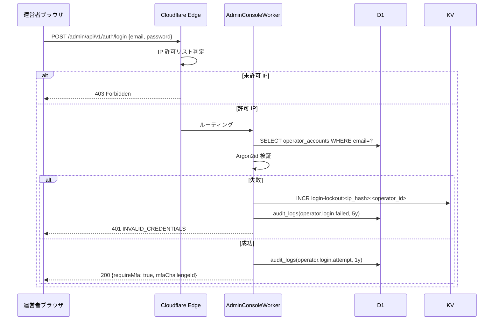

# DD01: 運営者認証・6 段認可(運営者システム)

## 0. 文書情報

| 項目 | 内容 |
|---|---|
| 文書名 | DD01: 運営者認証・6 段認可(運営者システム) |
| 詳細設計ID | DD01 |
| 対象システム | FAQ AI ウィジェット SaaS / 運営者システム |
| 関連機能ID | FR-007, FR-220, FR-221, FR-222, FR-223, FR-224, FR-225, NFR-310, NFR-311 |
| 作成日 | 2026-05-17 |
| 版数 | v1.0 |
| ステータス | 承認済 |

## 1. 対象範囲

| 種別 | ID | 名称 |
|---|---|---|
| 機能 | FR-007 | 再認証(クリティカル操作 5 分以内) |
| 機能 | FR-220 | 運営者 MFA(TOTP) |
| 機能 | FR-221 | 運営者 IP 許可リスト |
| 機能 | FR-222 | 運営者操作監査 |
| 機能 | FR-223 | 削除データ参照(認可境界) |
| 機能 | FR-224 | 契約上書き(運営者操作通知) |
| 機能 | FR-225 | 運営者アカウント・ライフサイクル |
| 画面 | SCR-AUTH | 運営者ログイン |
| 画面 | SCR-AUTH-M1 | MFA 初回セットアップモーダル |
| 画面 | SCR-HOME | 運営者ダッシュボード(認証後ランディング) |
| 画面 | 全画面 | 認証ミドルウェア共通 |
| API | `POST /auth/login` / `POST /auth/mfa/verify` / `POST /auth/reauth` / `POST /auth/logout` | 認証フロー |
| テーブル | `operator_accounts` / `operator_sessions` / `operator_mfa_secrets` / `operator_ip_allowlists` / `operator_reauths` | 運営者主管 |

## 2. 収録ロジック・対応章

| 元章 | 元タイトル | 概要 |
|---|---|---|
| §3 | 利用者・権限詳細設計 | 単一 `service_operator` ロール、MFA、IP 許可、運営者ライフサイクル |
| §5 SCR-AUTH / SCR-HOME | 画面詳細(参照) | 認証画面・ホーム画面のレイアウト・操作 |
| §6 認証関連 | 機能詳細(参照) | ログイン → MFA → セッション発行 → 再認証 |
| §12 セキュリティ詳細(認証部分) | 認証セキュリティ | セッショントークン TTL、HKDF info 値、CSRF、Cookie 属性 |
| §2.5 | リクエストフロー | 6 段認可判定(IP → セッション → MFA → role → 再認証 → 4-eyes) |

## 3. 詳細設計本文

### 3.1 6 段認可判定モデル

運営者リクエストはエッジ + Worker 内で次の 6 段階を **早期返却 / 同一順序** で評価する。失敗した段で即座にレスポンスを返却し、以降の段は評価しない。

| 段 | 判定対象 | 失敗時レスポンス | 評価場所 | 参照キー |
|---|---|---|---|---|
| 1 | IP 許可リスト | 403 Forbidden(エッジ) | Cloudflare Edge | KV: `operator-ip-allowlist:<operator_id>` |
| 2 | セッション有効性 | 401 UNAUTHENTICATED | AdminConsoleWorker | KV: `operator-session:<sid>` |
| 3 | MFA 検証フラグ | 403 FORBIDDEN_MFA_REQUIRED | AdminConsoleWorker | セッション内 `mfaVerifiedAt` |
| 4 | ロール(`service_operator`) | 403 FORBIDDEN_ROLE | AdminConsoleWorker | D1: `operator_accounts.role` |
| 5 | 再認証(クリティカル操作) | 403 RE_AUTH_REQUIRED | AdminConsoleWorker | KV: `re-auth:<sid>` |
| 6 | 4-eyes 承認 | 403 FORBIDDEN_HARD_GATE | AdminConsoleWorker | KV: `feature:hard-gate:<action>` |

判定の正本は [基本設計 / 認証・認可設計](../02_基本設計/08_認証・認可設計.md) §3〜§7。本書は実装上のミドルウェア順序と早期返却ルールを確定する。

### 3.2 ログインフロー

### 3.3 MFA(TOTP)検証

| 項目 | 仕様 |
|---|---|
| アルゴリズム | TOTP(RFC 6238、SHA-1、30 秒、6 桁) |
| シークレット保管 | `operator_mfa_secrets.secret_encrypted`(マスター鍵 + HKDF info=`mfa-secret` で派生暗号化) |
| 初回セットアップ | `mfa-setup:<operator_id>`(72h)に QR コードトークンを格納し、SCR-AUTH-M1 で読取・確認後 `mfa_enabled=1` |
| リカバリーコード | 10 個、SHA-256 ハッシュで保管、使用時に該当エントリ無効化 + 監査(`mfa.recovery_code.used`) |
| 検証成功時 | セッション内 `mfaVerifiedAt = now()` を記録し、KV へ即時反映 |
| 失敗時ロックアウト | 5 回連続失敗で 15 分(`login-lockout`)/ 同 IP・アカウントペア単位 |

### 3.4 セッション管理

| 項目 | 仕様 |
|---|---|
| セッショントークン | ULID 26 文字 + ランダム 32 バイト + HKDF info=`operator-session` で派生 HMAC 検証用 |
| TTL | **8 時間**(D-18)、最終アクセスから滑走式に延長(最大 24h、絶対上限) |
| Cookie 属性 | `Domain=admin.open-faq.example.com; Path=/; Secure; HttpOnly; SameSite=Strict; __Host-` プレフィックス |
| CSRF | Cookie とは別の `X-CSRF-Token` ヘッダ(Worker 起動時に発行、セッション JSON 内に保管) |
| KV キャッシュ | `operator-session:<sid>`、TTL 60 秒。失効時は D1 にフォールバックし `operator_sessions` テーブルを参照 |
| 同時セッション | アカウント毎 最大 3 セッション、超過時は最古を `revoked` 遷移(`operator.session.revoke`) |

### 3.5 再認証(クリティカル操作)

| 項目 | 仕様 |
|---|---|
| 対象操作 | 4-eyes 対象 10 操作 + お知らせ schedule / 監査エクスポート / Webhook リプレイ |
| 検証ウィンドウ | 直近 **5 分以内**(FR-007) |
| 認証要素 | パスワード再入力 OR TOTP 再入力(運営者選択) |
| 状態保管 | KV `re-auth:<sid>` に `{ operatorId, reauthenticatedAt, consumed }`、TTL 15 分、`consumed=true` で即時失効 |
| 1 回限り | 1 つの再認証トークンは 1 回のクリティカル操作のみで消費 |
| 監査 | `reauth`(5y、`{operatorId, reauthId}`) |

### 3.6 IP 許可リスト

| 項目 | 仕様 |
|---|---|
| 値形式 | CIDR 配列(IPv4 / IPv6 両対応)、`operator_ip_allowlists.cidr` |
| 適用範囲 | エッジ Cloudflare Worker(`/webhooks/*` を除く全パス) |
| KV キャッシュ | `operator-ip-allowlist:<operator_id>`、TTL 60 秒 |
| 変更操作 | `operator_ip.grant` / `operator_ip.revoke`(5y)、変更時に KV Invalidate |
| 緊急バイパス | 紙ベース回復コードで `master_key.emergency_bypass` 監査経由のみ(MVP) |

### 3.7 運営者アカウント・ライフサイクル(FR-225)

| 状態 | 説明 | 遷移条件 |
|---|---|---|
| `invited` | 招待メール送信済、未受諾 | 既存運営者が招待発行 |
| `active` | 通常稼働 | `operator.accept` 後 |
| `disabled` | 一時無効化 | `operator.disable`(理由付き) |
| `revoked` | 解任(永続無効) | `operator.disable` 後 + 90 日経過 |

すべての遷移は `operator_accounts.lifecycle_state` 列で管理し、対応 action コード(`operator.invite` / `operator.accept` / `operator.disable` / `operator.subrole.grant` / `operator.subrole.revoke`、すべて 5y)を `audit_logs` に記録する。

### 3.8 ミドルウェア実装ガイドライン

`admin/src/admin-console/middleware/` 配下に次の順序でミドルウェアを連結する:

1. `ip-allowlist.ts` ── エッジで判定済の場合はパススルー、Worker からの直接呼び出しに備えて再判定
2. `session.ts` ── KV → D1 フォールバック、`mfaVerifiedAt` を `Context` に注入
3. `mfa.ts` ── `mfaVerifiedAt` 必須、ログインフロー専用パスは除外
4. `csrf.ts` ── `__Host-` プレフィックス Cookie + `X-CSRF-Token` 一致
5. `ticket-id.ts` ── `X-Op-Ticket-Id` ヘッダ必須(クリティカル操作のみ、`^[A-Za-z0-9_\-]{1,64}$`)
6. `reauth.ts` ── `re-auth:<sid>` 存在 + `now - reauthenticatedAt ≤ 5min`
7. `four-eyes.ts` ── `feature:hard-gate:<action>` 真 → `X-Approval-Id` 必須、未付与で 403

### 3.9 HKDF info 値リスト(認証関連、★TH-12)

| info 値 | 用途 | キー長 | 派生元 |
|---|---|---|---|
| `operator-session` | セッショントークン HMAC 検証 | 32 バイト | Secrets Store マスター鍵 |
| `mfa-secret` | MFA TOTP シークレット暗号化 | 32 バイト | 同上 |
| `internal-api` | mTLS + JWT 署名 | 32 バイト | 同上(連携 IF #1〜#12 共通) |
| `audit-chain` | ハッシュチェーン HMAC(DD03 参照) | 32 バイト | 同上 |
| `audit-export` | 監査エクスポート HMAC 署名(D-17) | 32 バイト | 同上 |
| `pii-encryption` | PII 暗号化(メイン主管、参照のみ) | 32 バイト | 同上 |

完全な HKDF info 値リストは [基本設計 / セキュリティ設計](../02_基本設計/09_セキュリティ設計.md) §6 を正本とする。

### 3.10 主要エラーコード

| エラー ID | HTTP | 発生段 | 説明 |
|---|---|---|---|
| `E-OP-AUTH-001` | 401 | 段 2 | UNAUTHENTICATED(セッションなし / 失効) |
| `E-OP-AUTH-002` | 401 | ログイン | INVALID_CREDENTIALS |
| `E-OP-AUTH-003` | 403 | 段 3 | FORBIDDEN_MFA_REQUIRED |
| `E-OP-AUTH-004` | 403 | 段 4 | FORBIDDEN_ROLE |
| `E-OP-AUTH-005` | 403 | 段 5 | RE_AUTH_REQUIRED |
| `E-OP-AUTH-006` | 403 | 段 1 | IP_NOT_ALLOWED |
| `E-OP-AUTH-007` | 429 | ログイン | LOCKED_OUT(15 分) |
| `E-OP-4EYES-001` | 403 | 段 6 | FORBIDDEN_HARD_GATE |

完全な E-OP-AUTH-* 一覧は [基本設計 / エラー設計](../02_基本設計/05_エラー設計.md) §4 を正本とする。

## 4. 関連設計

| 種別 | 参照先 |
|---|---|
| 要件 | [../01_要件定義/index.md](../01_要件定義/index.md) |
| 基本設計 | [../02_基本設計/index.md](../02_基本設計/index.md) |
| 認証・認可設計(正本) | [../02_基本設計/08_認証・認可設計.md](../02_基本設計/08_認証・認可設計.md) |
| 権限設計(正本) | [../02_基本設計/04_権限設計.md](../02_基本設計/04_権限設計.md) |
| セキュリティ設計(正本) | [../02_基本設計/09_セキュリティ設計.md](../02_基本設計/09_セキュリティ設計.md) |
| 関連 DD | [DD02_4-eyes承認フロー.md](DD02_4-eyes承認フロー.md) / [DD03_監査ハッシュチェーン.md](DD03_監査ハッシュチェーン.md) |
| 運用設計 | [../04_運用設計/index.md](../04_運用設計/index.md) |
| 将来対応 | [../05_future/index.md](../05_future/index.md) |

## 5. テスト観点

### 5.1 ユニットテスト

- IP 許可リスト判定(IPv4 / IPv6 / CIDR 境界 / KV キャッシュヒット・ミス)
- Argon2id パスワード検証(成功 / 失敗 / タイミング攻撃耐性)
- TOTP 検証(時刻スキュー ±30 秒許容 / 再使用拒否)
- セッション TTL 計算(8h 滑走 + 24h 絶対上限)
- 再認証ウィンドウ判定(`now - reauthenticatedAt ≤ 5min`、`consumed=true` で失効)
- HKDF info 値別派生鍵の確定的計算

### 5.2 結合テスト(Miniflare)

- ログイン → MFA → セッション発行 → 任意 API 呼出
- ロックアウト(5 回失敗 → 15 分)
- 同時セッション 3 → 4 件目で最古 revoke
- IP 変更時のセッション継続(セッショントークンは IP に縛らない、再認証は要)
- CSRF トークン不一致で 403

### 5.3 E2E テスト(Playwright)

| テスト ID | シナリオ |
|---|---|
| `e2e-auth-001` | ログイン正常 → ホーム表示 |
| `e2e-auth-002` | 未許可 IP → 403 Forbidden(エッジ) |
| `e2e-auth-003` | MFA 未セットアップ → SCR-AUTH-M1 強制表示 |
| `e2e-auth-004` | クリティカル操作で再認証要 → モーダル表示 → 認証後実行 |
| `e2e-auth-005` | ロックアウト 15 分計測 |

### 5.4 受入条件マッピング

| AC | 検証手段 |
|---|---|
| AC-037(運営者 MFA + 再認証) | 認証テスト全件 + E2E |

## 6. 未確定事項・確認事項

| 確認事項ID | 確認内容 | 優先度 | ステータス |
|---|---|---|---|
| - | v1.0 リリース時点で全項目確定済み | 低 | 確認済 |
