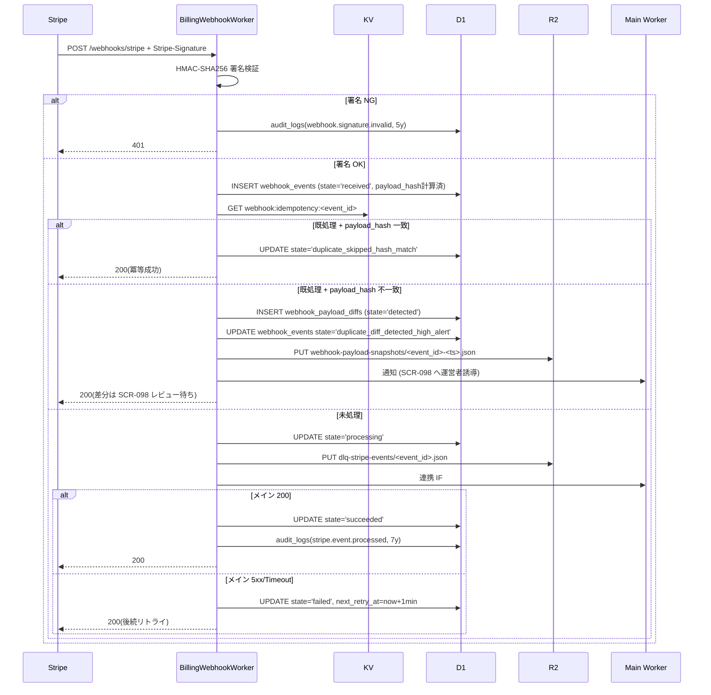

# DD04: Stripe Webhook 一次受信(運営者システム)

## 0. 文書情報

| 項目 | 内容 |
|---|---|
| 文書名 | DD04: Stripe Webhook 一次受信(運営者システム) |
| 詳細設計ID | DD04 |
| 対象システム | FAQ AI ウィジェット SaaS / 運営者システム |
| 関連機能ID | FR-302, NFR-808, NFR-809, AC-041, D-06, D-10, TH-8, TH-9 |
| 作成日 | 2026-05-17 |
| 版数 | v1.0 |
| ステータス | 承認済 |

## 1. 対象範囲

| 種別 | ID | 名称 |
|---|---|---|
| 機能 | FR-302 | Webhook 受信(Stripe / Resend) |
| 画面 | SCR-096 | Webhook リプレイ・DLQ 操作 |
| 画面 | SCR-098 | Webhook ペイロード差分検出レビュー |
| API | `POST /webhooks/stripe` | Stripe Webhook 一次受信(IP 制限適用外) |
| API | `POST /webhooks/resend` | Resend Webhook 一次受信(同上) |
| API | `POST /webhooks/replay` | 手動リプレイ |
| API | `POST /webhook-payload-diffs/{id}/reprocess` | 差分検出後の再処理 |
| API | `POST /webhook-payload-diffs/{id}/dismiss` | 差分検出の却下 |
| テーブル | `webhook_events` | 受信イベント主台帳 |
| テーブル | `webhook_payload_diffs` | ペイロード差分検出記録 |
| テーブル | `dlq_replay_log` | DLQ リプレイ履歴 |
| 連携 IF | #10 | 課金 Webhook 一次受信 → メイン転送(本書主管) |

## 2. 収録ロジック・対応章

| 元章 | 元タイトル | 概要 |
|---|---|---|
| §10 連携 IF #10 詳細 | Stripe Webhook 一次受信 → メイン転送 | 唯一の受信先(D-10) |
| §6 webhook 機能(参照) | 署名検証 / 冪等性 / 差分検出 / DLQ | 一次受信ロジック |
| §7 webhook API | 手動リプレイ + 差分 reprocess/dismiss | API スキーマ |
| 付録 B.2 | `webhook_events.state` | 12 状態遷移 |
| 付録 H | Webhook 除外フィールド完全リスト(★TH-8) | 正規化対象除外 |

## 3. 詳細設計本文

### 3.1 受信エンドポイント(D-10)

| エンドポイント | 用途 | IP 制限 | 署名検証 |
|---|---|---|---|
| `POST /webhooks/stripe` | Stripe イベント受信(唯一の受信先) | 適用外 | `Stripe-Signature` HMAC-SHA256 |
| `POST /webhooks/resend` | Resend バウンス・配信通知 | 適用外 | Resend Signature(HMAC) |

メイン側は `/webhooks/stripe` を一切受けない(D-10)。本書側のみが Stripe との接続点を持つ。

### 3.2 受信処理フロー



### 3.3 状態遷移(`webhook_events.state`)

| From | To | トリガー | 副作用 |
|---|---|---|---|
| - | received | POST 受信 | row INSERT |
| received | verifying_signature | 即時 | - |
| verifying_signature | rejected | HMAC NG | 401 + high alert |
| verifying_signature | checking_idempotency | HMAC OK | payload_hash 計算 |
| checking_idempotency | processing | 未処理 | INSERT + R2 退避 |
| checking_idempotency | duplicate_skipped_hash_match | 既処理 + 一致 | 200 + ログ |
| checking_idempotency | duplicate_diff_detected_high_alert | 既処理 + 不一致 | webhook_payload_diffs INSERT、SCR-098 待ち |
| processing | succeeded | IF #10 200 | audit:stripe.event.processed(7y) |
| processing | failed | 5xx/Timeout | DLQ 投入 |
| failed | dlq_retrying | DLQAutoBackoffWorker | 指数 BO |
| dlq_retrying | succeeded | 再試行成功 | - |
| dlq_retrying | dlq_manual_replay | 1h 経過 | 運営者 high |
| dlq_manual_replay | succeeded | SCR-096 リプレイ | audit:webhook.replay(5y) |
| dlq_manual_replay | dlq_archived | 30 日経過 | リプレイ不可 |

### 3.4 冪等性ストア

| キー | 値 | TTL | 用途 |
|---|---|---|---|
| `webhook:idempotency:<event_id>` | `{ payloadHash, state, processedAt }` | 30 日 | D1 `webhook_events` のキャッシュ |

冪等性判定の正本は `webhook_events.event_id` UNIQUE 制約(D1)。KV は高速判定のためのキャッシュ層であり、KV ミス時は D1 にフォールバック。

### 3.5 ペイロード正規化 + 差分検出(D-06)

#### 3.5.1 正規化アルゴリズム

```text
function canonical_json(payload, api_version):
    excludeFields = getExcludeFields(api_version)
    filtered = removeFields(payload, excludeFields)
    return RFC8785_canonicalize(filtered)  // キーソート + Unicode NFC + 数値正規化

function payload_hash(payload, api_version):
    return sha256(canonical_json(payload, api_version))
```

#### 3.5.2 全バージョン共通除外フィールド(ルートレベル)

```text
created
request.id
request.idempotency_key
idempotency_key_resent
livemode
api_version
pending_webhooks
```

#### 3.5.3 全バージョン共通除外(`data.object` レベル)

```text
data.object.created
data.object.updated_at
data.object.test_clock
data.object.metadata.test_*
data.object.metadata._stripe_internal_*
data.previous_attributes
```

#### 3.5.4 全バージョン共通除外(配列再帰)

```text
*.created
*.updated_at
```

#### 3.5.5 Stripe API バージョン `2024-06-20` 固有

(現時点で追加除外なし)

### 3.6 複数バージョン併存運用ルール

Stripe ダッシュボードで API バージョンをアップグレードすると、**同一契約への Webhook が新旧バージョンを跨いで配信される**。この前提で本書では以下のルールを定める:

| 項目 | 仕様 |
|---|---|
| バージョン保管 | `webhook_events.stripe_api_version` 列に受信時の `api_version` を保管 |
| ハッシュ計算 | `EXCLUDE_FIELDS_BY_VERSION[stripe_api_version]` を選択して `canonical_json` 呼出 |
| マップ未登録時 | `EXCLUDE_FIELDS_BY_VERSION["default"]` = 共通リストにフォールバックし、運営者 inbox normal(`webhook.unknown_api_version`、5y)で通知 |
| 同 `event_id` 異 API バージョン | 既処理 `event_id` + `api_version` 不一致 → 通常フローでは `webhook_payload_diffs` に記録するが、`stripe_api_version_mismatch` フラグを立てて SCR-098 で見分け可能にする |
| 廃止予告 | Stripe が API バージョンを EOL 通知してから 180 日以内に該当バージョンのサポートを終了。本書改訂で `EXCLUDE_FIELDS_BY_VERSION` から削除 |
| サポート対象範囲 | 同時にサポートするバージョン数は **最大 2**(現行 + 直前の 1 つ)。3 つ以上は技術的負債とみなし要件レビュー対象 |

#### 3.6.1 バージョン管理マップ実装例

```text
const EXCLUDE_FIELDS_BY_VERSION: Record<string, string[]> = {
  "default": [...H1_FIELDS, ...H2_FIELDS, ...H3_FIELDS],
  "2024-06-20": [...H1_FIELDS, ...H2_FIELDS, ...H3_FIELDS], // 追加なし
  // バージョン追加時:
  // "2024-12-XX": [...H1_FIELDS, ..., "data.object.new_field_xxx"],
};

function getExcludeFields(apiVersion: string): string[] {
  if (EXCLUDE_FIELDS_BY_VERSION[apiVersion]) {
    return EXCLUDE_FIELDS_BY_VERSION[apiVersion];
  }
  log.warn("unknown_api_version", { apiVersion });
  notifyOperator("normal", `Stripe API version ${apiVersion} not in exclude list`);
  return EXCLUDE_FIELDS_BY_VERSION["default"];
}
```

#### 3.6.2 バージョン追加手順

1. Stripe 公式変更履歴を確認
2. 同一 event の再送で値が変わるフィールドを特定
3. 本書の除外フィールド表に追記
4. `BillingWebhookWorker` の正規化関数(`canonical_json`)の `EXCLUDE_FIELDS_BY_VERSION` マップを更新
5. 既存 Webhook イベントの再ハッシュ計算は実施しない(同 API バージョンでの整合性のみ保証)
6. 監査記録: `audit:webhook.exclude_list.update`(5y)を追加(action コードを [DD09_監査actionコード.md](DD09_監査actionコード.md) に追加)

#### 3.6.3 監視

- `webhook_events.stripe_api_version` の分布を SCR-095 KPI セクションで可視化(同時稼働バージョン数の追跡)
- 未登録バージョン受信時の通知頻度が日次 10 件超で運営者 high(`webhook.unknown_api_version.spike`、5y)

### 3.7 除外フィールド適用例

入力 payload:
```json
{
  "id": "evt_xxx",
  "created": 1715500000,
  "livemode": false,
  "api_version": "2024-06-20",
  "request": { "id": "req_xxx", "idempotency_key": "abc" },
  "pending_webhooks": 0,
  "data": {
    "object": {
      "id": "in_xxx",
      "created": 1715500000,
      "amount_paid": 10000,
      "metadata": { "contract_owner_user_id": "01J...", "test_run": "true" }
    },
    "previous_attributes": { "status": "open" }
  },
  "type": "invoice.paid"
}
```

除外後の正規化対象:
```json
{
  "id": "evt_xxx",
  "data": {
    "object": {
      "id": "in_xxx",
      "amount_paid": 10000,
      "metadata": { "contract_owner_user_id": "01J..." }
    }
  },
  "type": "invoice.paid"
}
```

`payload_hash = sha256(canonical_json(filtered_payload))`

### 3.8 DLQ 自動指数バックオフ + 手動リプレイ

`DLQAutoBackoffWorker`(5 分 cron)が `state='failed'` のイベントを最大 3 回リトライする:

| attempt | バックオフ | 累計経過 |
|---|---|---|
| 1 | 1 分 | 1 分 |
| 2 | 4 分 | 5 分 |
| 3 | 16 分 | 21 分 |
| 失敗継続(1h 経過) | `dlq_manual_replay` 遷移 | 運営者 high alert |

詳細擬似コードは [DD08_Cron実装.md](DD08_Cron実装.md) §14.2.6 を参照。

**手動リプレイ API**:

```yaml
/webhooks/replay:
  post:
    summary: Webhook 手動リプレイ
    parameters:
      - $ref: "#/components/parameters/XOpTicketId"
      - $ref: "#/components/parameters/IdempotencyKey"
      - $ref: "#/components/parameters/XCsrfToken"
    requestBody:
      required: true
      content:
        application/json:
          schema:
            type: object
            required: [eventId]
            properties:
              eventId: { type: string }
    responses:
      "200": { description: リプレイ実行完了 }
      "409":
        content:
          application/problem+json:
            schema: { $ref: "#/components/schemas/Problem" }
      "410":
        content:
          application/problem+json:
            schema: { $ref: "#/components/schemas/Problem" }
```

`409` は既処理(成功状態)、`410` は 30 日経過 `dlq_archived` 状態。

### 3.9 ペイロード差分検出後のレビュー(SCR-098)

差分検出後は `webhook_payload_diffs.state` で SCR-098 上のレビューフローを管理:

| From | To | トリガー |
|---|---|---|
| - | detected | BillingWebhookWorker が差分検出 |
| detected | reviewed | start-review |
| reviewed | reprocessed_manually | reprocess(再認証 + チケット必須) |
| reviewed | dismissed_no_action | dismiss(理由必須) |

詳細は [DD11_状態遷移詳細.md](DD11_状態遷移詳細.md) §B.6 を参照。

### 3.10 Stripe API 呼出(★TH-9)

月次請求 cron で Stripe API を呼び出す:

| 操作 | エンドポイント | 冪等キー |
|---|---|---|
| Invoice 作成 | `POST /v1/invoices` | `monthly-billing-${owner.id}-${target_month}` |
| Invoice Item 作成 | `POST /v1/invoiceitems` | 同上 + `-item` |
| Invoice Finalize | `POST /v1/invoices/{id}/finalize` | 同上 + `-final` |
| Credit Note 発行 | `POST /v1/credit_notes` | `credit-note-${invoiceId}-${reason}` |
| Subscription Resume | `POST /v1/subscriptions/{id}` `cancel_at_period_end=false` | `sub-resume-${subscriptionId}` |

詳細擬似コードは [DD08_Cron実装.md](DD08_Cron実装.md) §14.2.1 を参照。

### 3.11 連携 IF #10(本書 → メイン)

本書側 BillingWebhookWorker は受信 → 正規化 → メイン側 `/internal/admin-integration/v1/billing/webhook-event` へ mTLS + JWT で転送する。完全な JSON Schema は [基本設計 / API 設計](../02_基本設計/02_API設計.md) §5.8 + [基本設計 / 課金・請求設計](../02_基本設計/10_課金・請求設計.md) §13 を正本とする。

### 3.12 主要エラーコード

| エラー ID | HTTP | 説明 |
|---|---|---|
| `E-OP-WEBHOOK-001` | 401 | SIGNATURE_INVALID |
| `E-OP-WEBHOOK-002` | 409 | EVENT_ALREADY_PROCESSED(リプレイ拒否) |
| `E-OP-WEBHOOK-003` | 410 | EVENT_ARCHIVED(30 日経過) |
| `E-OP-WEBHOOK-004` | 502 | UPSTREAM_MAIN_FAILED(連携 IF #10 5xx) |

完全な E-OP-WEBHOOK-* 一覧は [基本設計 / エラー設計](../02_基本設計/05_エラー設計.md) を正本とする。

## 4. 関連設計

| 種別 | 参照先 |
|---|---|
| 要件 | [../01_要件定義/index.md](../01_要件定義/index.md) |
| 基本設計 | [../02_基本設計/index.md](../02_基本設計/index.md) |
| API 設計(正本) | [../02_基本設計/02_API設計.md](../02_基本設計/02_API設計.md) |
| 課金・請求設計(正本) | [../02_基本設計/10_課金・請求設計.md](../02_基本設計/10_課金・請求設計.md) |
| メインテーブル設計 | [../../01_メインシステム/02_基本設計/03_テーブル設計.md](../../01_メインシステム/02_基本設計/03_テーブル設計.md) |
| 関連 DD | [DD08_Cron実装.md](DD08_Cron実装.md) / [DD11_状態遷移詳細.md](DD11_状態遷移詳細.md) |
| 運用設計 | [../04_運用設計/index.md](../04_運用設計/index.md) |
| 将来対応 | [../05_future/index.md](../05_future/index.md) |

## 5. テスト観点

### 5.1 ユニットテスト

- HMAC-SHA256 署名検証(正当 / 改ざん / タイミング攻撃耐性)
- `canonical_json` 正規化(除外フィールド + キーソート + 配列再帰)
- 同 event_id + 同 payload_hash → duplicate_skipped_hash_match
- 同 event_id + 異 payload_hash → diff detected
- 指数バックオフ計算(1m / 4m / 16m)
- 30 日経過判定(dlq_archived)

### 5.2 結合テスト(Miniflare + Stripe Test Mode)

- 正常受信 → 連携 IF #10 → succeeded
- 一時失敗 → 自動 BO 3 回 → dlq_manual_replay
- 手動リプレイ → succeeded
- 差分検出 → reviewed → reprocess
- 30 日経過 → dlq_archived
- 不明な API バージョン → デフォルトリスト + 通知

### 5.3 E2E テスト(Playwright)

| テスト ID | シナリオ |
|---|---|
| `e2e-scr097-001` | DLQ 一覧 → 30 日ウィンドウ → 手動リプレイ |
| `e2e-scr099-001` | 差分検出 → SCR-098 表示 → reprocess / dismiss |

### 5.4 負荷試験

| シナリオ | 構成 | 合格基準 |
|---|---|---|
| (A4) Stripe Webhook 受信 | 100 event/分 + 10% で差分検出 | 冪等性 + DLQ 挙動 |
| (A3) Webhook 集中受信 | Stripe Webhook 1000 件/分 × 5 分 | p95 ≤ 500ms、`webhook_events.state` 整合性 100% |
| (A5) DLQ 大量リプレイ | 1000 件の `dlq_manual_replay` を同時起動 | サーキットブレーカ open 率が想定通り、5xx → 自動 BO で全件最終完了 |

### 5.5 受入条件マッピング

| AC | 検証手段 |
|---|---|
| AC-041(Webhook 冪等性 + 差分検出) | 統合テスト(差分検出ケース含)+ リプレイ運用 |

## 6. 未確定事項・確認事項

| 確認事項ID | 確認内容 | 優先度 | ステータス |
|---|---|---|---|
| - | v1.0 リリース時点で全項目確定済み | 低 | 確認済 |
