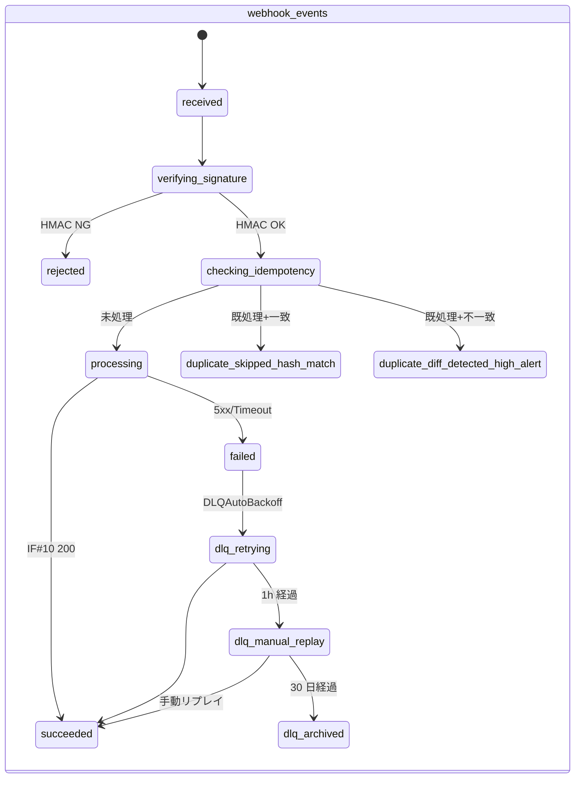
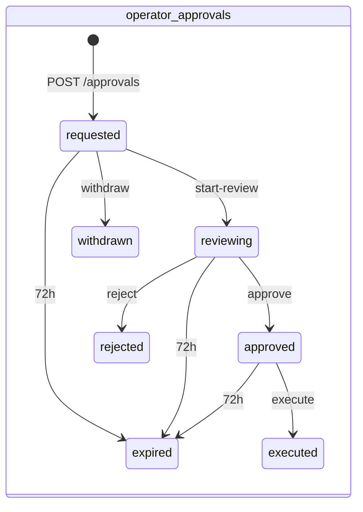
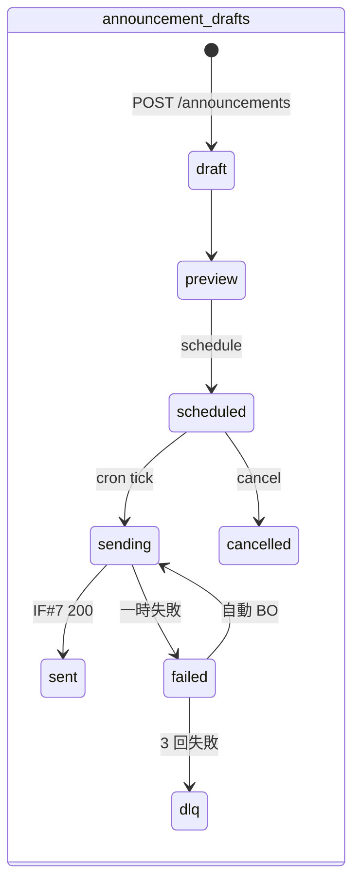
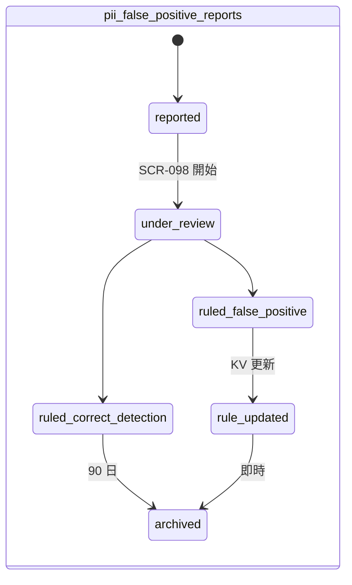
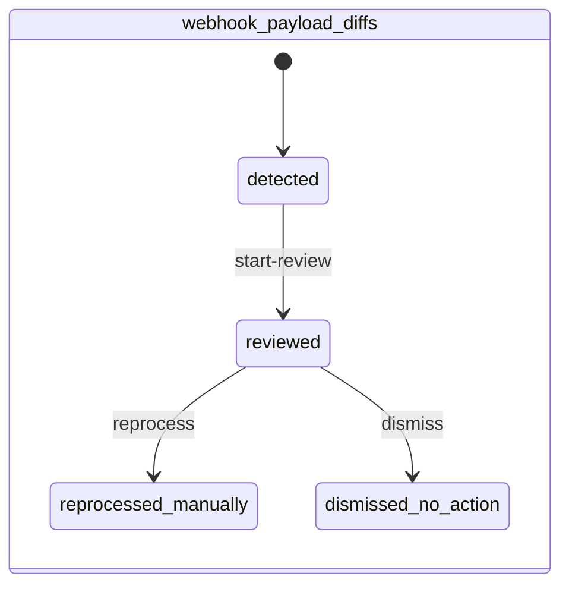

# DD11: 状態遷移詳細(運営者システム)

## 0. 文書情報

| 項目 | 内容 |
|---|---|
| 文書名 | DD11: 状態遷移詳細(運営者システム) |
| 詳細設計ID | DD11 |
| 対象システム | FAQ AI ウィジェット SaaS / 運営者システム |
| 関連機能ID | D-08, AC-041, FR-302, FR-188, FR-189, FR-226, FR-064 |
| 作成日 | 2026-05-17 |
| 版数 | v1.0 |
| ステータス | 承認済 |

## 1. 対象範囲

| 種別 | ID | 名称 |
|---|---|---|
| テーブル | `webhook_events.state` | 12 状態 |
| テーブル | `operator_approvals.state` | 7 状態 |
| テーブル | `announcement_drafts.state` | 8 状態 |
| テーブル | `pii_false_positive_reports.state` | 6 状態 |
| テーブル | `webhook_payload_diffs.state` | 4 状態 |
| テーブル | `accounts.contract_status`(参照、メイン主管) | オーナー行 4 値 |

## 2. 収録ロジック・対応章

| 元章 | 元タイトル | 概要 |
|---|---|---|
| 付録 B 全文 | 状態遷移詳細表(本書版) | 5 状態機械の遷移表 |
| §4 | 状態詳細設計(参照) | 個別設計書の正本リンク |

## 3. 詳細設計本文

### 3.1 `webhook_events.state`(12 状態、AC-041)

| From | To | トリガー | 副作用 |
|---|---|---|---|
| - | received | POST 受信 | row INSERT |
| received | verifying_signature | 即時 | - |
| verifying_signature | rejected | HMAC NG | 401 + high alert |
| verifying_signature | checking_idempotency | HMAC OK | payload_hash 計算 |
| checking_idempotency | processing | 未処理 | INSERT + R2 退避 |
| checking_idempotency | duplicate_skipped_hash_match | 既処理 + 一致 | 200 + ログ |
| checking_idempotency | duplicate_diff_detected_high_alert | 既処理 + 不一致 | webhook_payload_diffs INSERT、SCR-099 待ち |
| processing | succeeded | IF #10 200 | audit:stripe.event.processed(7y) |
| processing | failed | 5xx/Timeout | DLQ 投入 |
| failed | dlq_retrying | DLQAutoBackoffWorker | 指数 BO |
| dlq_retrying | succeeded | 再試行成功 | - |
| dlq_retrying | dlq_manual_replay | 1h 経過 | 運営者 high |
| dlq_manual_replay | succeeded | SCR-097 リプレイ | audit:webhook.replay(5y) |
| dlq_manual_replay | dlq_archived | 30 日経過 | リプレイ不可 |

主管担当: [DD04_Stripe_Webhook一次受信.md](DD04_Stripe_Webhook一次受信.md)。

### 3.2 `operator_approvals.state`(7 状態、FR-226)

| From | To | トリガー | ガード |
|---|---|---|---|
| - | requested | POST /approvals | expires_at = +72h |
| requested | reviewing | start-review | requested_by ≠ reviewer |
| reviewing | approved | approve | DB CHECK 自己承認禁止 |
| reviewing | rejected | reject | requested_by ≠ rejected_by、コメント必須 |
| requested | withdrawn | withdraw(申請者本人) | withdrawn_by == requested_by(自己取下げ) |
| requested/reviewing | expired | 72h 経過 | バッチ |
| approved | executed | execute | now < approved_at + 72h、payload_hash 一致 |
| approved | expired | 72h 経過 | バッチ |

主管担当: [DD02_4-eyes承認フロー.md](DD02_4-eyes承認フロー.md)。

### 3.3 `announcement_drafts.state`(8 状態、FR-188 / FR-189)

| From | To | トリガー |
|---|---|---|
| - | draft | POST /announcements |
| draft | preview | preview |
| preview | scheduled | schedule(再認証 + チケット必須) |
| scheduled | sending | AnnouncementSchedulerWorker(scheduled_at ≤ now+5min) |
| scheduled | cancelled | cancel(now < scheduled_at - 5min) |
| sending | sent | 連携 IF #7 200 OK |
| sending | failed | 連携 IF #7 一時失敗(5xx/Timeout)、`attempt_count++` |
| failed | sending | 自動指数 BO(1m → 4m → 16m、最大 3 回) |
| failed | dlq | 自動 BO 3 回失敗、運営者 inbox high |

主管担当: [DD06_お知らせ承認・配信.md](DD06_お知らせ承認・配信.md)。

### 3.4 `pii_false_positive_reports.state`(6 状態、FR-064)

| From | To | トリガー |
|---|---|---|
| - | reported | 報告転送 |
| reported | under_review | SCR-098 開始(3 営業日タイマー起動) |
| under_review | ruled_false_positive | 判定 |
| under_review | ruled_correct_detection | 判定 |
| ruled_false_positive | rule_updated | KV ルール更新 |
| - | archived | 90 日経過 or rule_updated 後 |

主管担当: [DD10_PII偽陽性報告.md](DD10_PII偽陽性報告.md)。

### 3.5 `webhook_payload_diffs.state`(4 状態、AC-041 異常系)

| From | To | トリガー |
|---|---|---|
| - | detected | BillingWebhookWorker が差分検出 |
| detected | reviewed | start-review |
| reviewed | reprocessed_manually | reprocess(再認証 + チケット必須) |
| reviewed | dismissed_no_action | dismiss(理由必須) |

主管担当: [DD04_Stripe_Webhook一次受信.md](DD04_Stripe_Webhook一次受信.md) §3.9。

### 3.6 `accounts.contract_status`(参考、メイン主管)

オーナー行のみで意味を持つ 4 値:

| 値 | 説明 | 遷移経路 |
|---|---|---|
| `active` | 通常稼働 | 初期値 + `owner.restore_data` で復活 |
| `suspended` | 一時停止 | `owner.suspend`(運営者) |
| `deleted_pending` | 退会受付済、猶予期間中(30 日) | 利用者の退会操作 |
| `deleted` | 物理削除済(`accounts_retired` 移行) | `owner.physical_delete`(ハードゲート、運営者) |

メイン主管。本書側は SCR-090 / SCR-091 で参照表示のみ。詳細は [メインシステム / contract_status 設計](../../01_メインシステム/02_基本設計/03_テーブル設計.md) を正本参照。

### 3.7 状態遷移実装ガイドライン

| 項目 | ガイドライン |
|---|---|
| 楽観ロック | 全状態テーブルに `version` 列を持ち、`UPDATE ... WHERE id=? AND version=? AND state=?` パターンで競合検出 |
| 影響行数チェック | `UPDATE` 後に `rowsAffected=0` で 409 Conflict 返却 |
| 監査記録 | 状態遷移ごとに対応 action コード([DD09_監査actionコード.md](DD09_監査actionコード.md))を `audit_logs` に必ず記録 |
| DB CHECK 制約 | 多重ガードのため、可能な状態値を CHECK 制約で列挙(`CHECK (state IN ('requested','reviewing','approved','rejected','withdrawn','executed','expired'))`) |
| バッチ駆動遷移 | `expired` / `archived` / `dlq_archived` 等の時間経過遷移は専用 cron Worker で実行 |
| 観察可能性 | 各状態の在庫数(現在のレコード数)を KPI として `monitoring:thresholds:<kpi_id>` で監視 |

### 3.8 状態遷移共通エラーコード

| エラー ID | HTTP | 説明 |
|---|---|---|
| `E-OP-STATE-001` | 409 | INVALID_STATE_TRANSITION(許可されない from → to ペア) |
| `E-OP-STATE-002` | 409 | VERSION_CONFLICT(楽観ロック競合) |
| `E-OP-STATE-003` | 410 | RESOURCE_ARCHIVED(`archived` / `dlq_archived` 状態は操作不可) |
| `E-OP-STATE-004` | 423 | RESOURCE_LOCKED(`executing` 等で並行更新拒否) |

各機能固有のエラー ID(`E-OP-ANN-*` / `E-OP-WEBHOOK-*` 等)は各 DD を参照。

### 3.9 状態テーブル一覧

| テーブル | 状態列 | 状態数 | 主管 DD |
|---|---|---|---|
| `webhook_events` | `state` | 12 | DD04 |
| `operator_approvals` | `state` | 7 | DD02 |
| `announcement_drafts` | `state` | 8 | DD06 |
| `pii_false_positive_reports` | `state` | 6 | DD10 |
| `webhook_payload_diffs` | `state` | 4 | DD04 |
| `restorations` | `state` | 3(`executing` / `succeeded` / `failed`) | DD05 |
| `accounts`(参照) | `contract_status` | 4 | メイン主管 |
| `operator_accounts` | `lifecycle_state` | 4(`invited` / `active` / `disabled` / `revoked`) | DD01 |

すべての完全な DDL + CHECK 制約は [基本設計 / テーブル設計](../02_基本設計/03_テーブル設計.md) を正本とする。

### 3.10 状態遷移サマリ

## 4. 関連設計

| 種別 | 参照先 |
|---|---|
| 要件 | [../01_要件定義/index.md](../01_要件定義/index.md) |
| 基本設計 | [../02_基本設計/index.md](../02_基本設計/index.md) |
| テーブル設計(正本) | [../02_基本設計/03_テーブル設計.md](../02_基本設計/03_テーブル設計.md) |
| メインテーブル設計 | [../../01_メインシステム/02_基本設計/03_テーブル設計.md](../../01_メインシステム/02_基本設計/03_テーブル設計.md) |
| 関連 DD | [DD02_4-eyes承認フロー.md](DD02_4-eyes承認フロー.md) / [DD04_Stripe_Webhook一次受信.md](DD04_Stripe_Webhook一次受信.md) / [DD06_お知らせ承認・配信.md](DD06_お知らせ承認・配信.md) / [DD10_PII偽陽性報告.md](DD10_PII偽陽性報告.md) |
| 運用設計 | [../04_運用設計/index.md](../04_運用設計/index.md) |
| 将来対応 | [../05_future/index.md](../05_future/index.md) |

## 5. テスト観点

### 5.1 ユニットテスト

- 各状態の許可遷移ペア網羅(マトリクステーブル)
- 拒否ペア(`draft → sent` 等)で 409 返却
- 楽観ロック競合(同一 from で 2 並列 UPDATE → 1 件成功 / 1 件 409)
- バッチ駆動遷移(72h / 90 日 / 30 日 / 1h)の境界

### 5.2 結合テスト(Miniflare)

- 各状態機械の完全パス(happy path)
- 失敗パス(`rejected` / `failed` / `dlq` / `archived` 全件)
- バッチ実行で `expired` / `archived` 遷移
- 状態遷移時の `audit_logs` 必須記録(対応 action コード)

### 5.3 E2E テスト(Playwright)

各 DD の E2E シナリオ(`e2e-scr090-001`〜`e2e-scr099-001`、`e2e-4eyes-*-001` 等)で全状態を踏破。

### 5.4 状態遷移マトリクス検証 CI

- 本書の遷移表と実装(state machine モジュール)の整合性を `03_script/check-state-machine.sh` で検証(TODO: スクリプト整備)
- 各 state テーブルの CHECK 制約と本書記載の値リストの一致

## 6. 未確定事項・確認事項

| 確認事項ID | 確認内容 | 優先度 | ステータス |
|---|---|---|---|
| - | v1.0 リリース時点で全項目確定済み | 低 | 確認済 |
