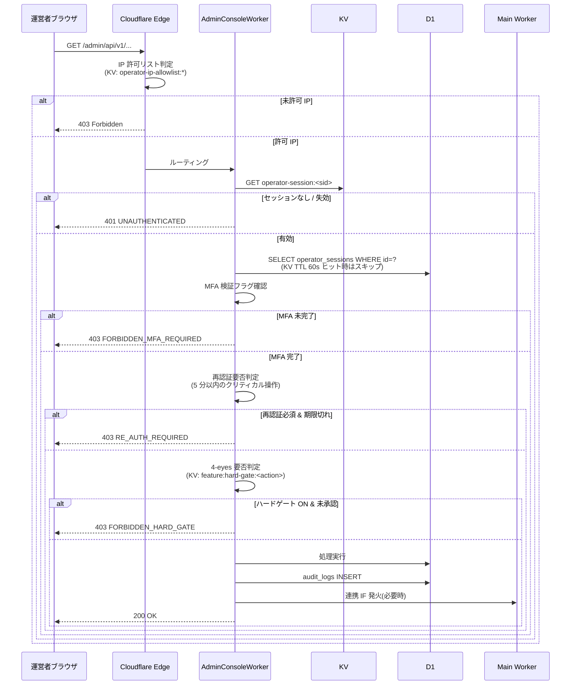

# 詳細設計 index(運営者システム)

## 0. 文書情報

| 項目 | 内容 |
|---|---|
| 文書種別 | 詳細設計 index |
| 対象システム | FAQ AI ウィジェット SaaS / 運営者システム(顧客管理システム / `admin.open-faq.example.com`) |
| 版数 | v1.0 |
| 作成日 | 2026-05-17 |
| ステータス | 承認済 |
| クラウド前提 | Cloudflare(Workers / D1 / KV / R2 / Queues / Workers AI / Secrets Store / Cron Triggers) |
| メール配信 | Resend |
| 課金プロバイダ | Stripe(Webhook 一次受信は運営者側) |
| 上位文書 | [基本設計](../02_基本設計/index.md) / [要件定義](../01_要件定義/index.md) |
| 兄弟文書 | [メインシステム 詳細設計 index](../../01_メインシステム/03_詳細設計/index.md) |

---

## 1. 詳細設計方針

### 1.1 本書の位置付け

本書は基本設計 v3.0 を実装着手可能な粒度に詳細化した文書である。基本設計が「方式・全体像」を確定するのに対し、本書は「DDL・API スキーマ・KV キー命名・Cron UTC 式・HKDF info 値・action コード一覧・エラーログスキーマなど、実装担当者が即時着手できる具体値」を確定する。

表記、採番、文書同期、基本設計と詳細設計の境界などの文書保守ルールは [CLAUDE.md](../../CLAUDE.md) に置く。

### 1.2 用語とスコープ

- 用語: 基本設計 付録 A の用語を参照する。
- 主語: 「運営者」「管理者ユーザー」「エンドユーザー」を厳密に区別。本書のスコープは運営者(`service_operator`)が触れる機能のみ。
- 本書は **MVP 範囲のみ** を記載する。MVP で実現する実装仕様、初期値、運用制約だけを本文に置く。

### 1.3 実装データ形式・命名

| 項目 | 規約 |
|---|---|
| ID 形式 | ULID 26 文字(運営者・チケット・申請・リプレイ等)/ Stripe ID は `evt_*` `sub_*` `inv_*` `cn_*` をそのまま PK |
| 命名 | テーブル: snake_case 複数形 / カラム: snake_case 単数形 / 状態列: `state` または `status` / KV キー: `<feature>:<scope>:<id>` コロン区切り英小文字 + ハイフン |
| 日時 | `TIMESTAMP` 型 ISO 8601 UTC(`2026-05-12T10:00:00Z`)。表示時に JST 変換 |
| 真偽値 | `INTEGER` 0/1 |
| JSON | `TEXT` 列に JSON 文字列で保存 |
| エラー | RFC 7807 `application/problem+json`(`type` / `title` / `status` / `code` / `detail` / `trace_id`) |
| 改行 | ファイル末尾は LF 改行で終わる |

### 1.4 詳細化区分

| 区分 | 本書で確定する内容 |
|---|---|
| API | エンドポイントごとの OpenAPI スキーマ、JSON Schema、エラーコード一覧(TH-1) |
| DDL | NULL 制約、外部キー、CHECK 制約、インデックスの正確な構文(TH-2) |
| 画面詳細 | SCR-090〜099 のコンポーネント、項目、API 呼出、4-eyes UI(TH-3, TH-5) |
| HTML サニタイザ | 許可タグ・属性ホワイトリスト具体値(TH-4) |
| 監査 action コード | `<resource>.<verb>` 全コード一覧 + retention_class(TH-6) |
| KV キー一覧 | 個別キーの命名・TTL 値・サンプル値(TH-7) |
| Webhook 除外フィールド | D-06 付録 H 列挙の Stripe API バージョン別拡充(TH-8) |
| Stripe API | Subscription resume / Invoice / Credit Note の具体パラメータ(TH-9) |
| Cron 実装 | UTC 表現の cron 式(TH-10) |
| エラーログ詳細 | 構造化ログのスキーマ、必須フィールド、機密項目マスキング(TH-11) |
| HKDF info 値 | 正式リスト(TH-12) |
| その他 | 連携 IF #1〜#12 通信スキーマ、Runbook 雛形、SLA 計測ロジック、状態遷移詳細 |

### 1.5 最重要方針(再掲)

基本設計 §0 / 要件 §2 を継承:

1. 運営者は本サービス全契約横断の最小限の運用権限のみを持ち、利用者側業務(FAQ 公開・チャット返信・退会受付など)を肩代わりしない。
2. 4-eyes 原則は MVP ハードゲート 3 操作 + 承認ログのみ 7 操作で実装する。
3. すべての運営者操作は監査ログ(ハッシュチェーン)に記録し、3 区分保持(1y / 5y / 7y)で物理管理する。
4. 課金 Webhook の一次受信は本書側のみが行い、メイン側は受けない(D-10)。
5. 運営者プレーンと利用者プレーンはサブドメイン分離(D-01)、Worker 分離(D-02)で攻撃面を最小化する。

### 1.6 スコープ(運営者コンソール限定)

本書はメイン §1.4 で「運営者主管」と区分されたものを詳細化する:

| # | 機能ブロック | 主管 SCR | 主管 FR / NFR |
|---|---|---|---|
| 1 | 運営者認証(MFA + IP 許可 + 再認証 5 分) | ログイン画面、全画面 | FR-220, FR-221, FR-222, FR-007, NFR-311 |
| 2 | 4-eyes 申請承認(MVP 3 ハードゲート + 7 承認ログ) | 承認待ち一覧、各操作モーダル | FR-226, §6.2.1(基本設計) |
| 3 | 削除データ参照・復元(副作用 (a)〜(g) ロールバック) | SCR-090 / SCR-091 | FR-200〜FR-211, FR-222, FR-223 |
| 4 | AI 推論パラメータ 3 階層上書き | SCR-092 | FR-055, FR-061〜FR-066, AC-034 |
| 5 | 契約別レート/予算上書き + サプレスリスト復帰 | SCR-093 | FR-121, FR-128, FR-224, NFR-503, NFR-504 |
| 6 | お知らせ作成・配信(運営者) | SCR-094 | FR-149, FR-188, FR-189 |
| 7 | 監査ログ閲覧・エクスポート(HMAC 署名) | SCR-096 | FR-229, FR-230, FR-232, NFR-306, NFR-602 |
| 8 | 課金 Webhook リプレイ・DLQ 操作 | SCR-097 | FR-302, NFR-808, NFR-809 |
| 9 | PII 誤検出報告管理(3 営業日判定) | SCR-098 | FR-060, FR-064, NFR-805 |
| 10 | Webhook ペイロード差分検出 | SCR-099 | FR-302 異常系, AC-041 |
| 11 | 月次請求確定 cron(月初 02:00 JST) | バックグラウンド | FR-303, AC-042 |
| 12 | 監査ハッシュチェーン日次検証 | バックグラウンド | NFR-306, RB-017 |
| 13 | 運営者操作通知(FR-211、10 分集約) | 連携 IF #12 | FR-211, D-19 |

### 1.7 メインシステム正本範囲

次はメインシステム詳細設計の正本対象であり、本書では連携境界として扱う:

- 利用者認証・管理者ユーザー登録完了・パスワードリセット(`/auth/*`)
- 公開ウィジェット(`/widget/*`)
- 未解決質問・個別チャット(`/inquiries/*`, `/chat/*`)
- FAQ CRUD・FTS 検索(`/projects/*/faqs/*`)
- 管理者ユーザー inbox(主管はメイン、本書は連携 IF #12 で配信指示のみ)
- ウィジェット側レート制限の実適用(主管はメイン、本書は連携 IF #5 で上書き値同期)
- メール送信(主管はメイン、本書は運営者通知 + テスト送信のみ Resend 直叩き)
- サプレスリスト本体(主管はメイン、本書は SCR-093 経由で個別アドレス復帰承認のみ)

メイン主管エンティティ(`accounts`, `projects`, `faqs`, `question_logs`, `chat_rooms`, `chat_messages`, `inquiries`, `inbox_messages` 等)は [メインテーブル設計](../../01_メインシステム/02_基本設計/03_テーブル設計.md) を正本参照し、本書では運営者側主管 20 エンティティのみ DDL を書き下す。

### 1.8 MVP 初期値

| 項目 | 本書での扱い |
|---|---|
| Workers AI 利用モデル | `@cf/meta/llama-3.1-8b-instruct` |
| データリージョン | Cloudflare apac |
| AI しきい値初期値 | 信頼度 0.60 / 関連度 0.50 |
| PII 検出 | 第 1 層(正規表現) + 第 3 層(FAQ 整合性検査) |
| 4-eyes | ハードゲート 3 操作 + 承認ログのみ 7 操作 |

---

## 2. システム全体構成

### 2.1 Worker トポロジー

本書側は **メインシステムと別の wrangler プロジェクト**(D-02)としてデプロイする。攻撃面の縮小、MFA / IP 許可ミドルウェアの分離、独立デプロイ・独立ロールバックを目的とする。

```mermaid
flowchart TB
    subgraph Browser[運営者ブラウザ]
        SPA[Admin SPA<br/>admin.open-faq.example.com<br/>Cloudflare Pages]
    end

    subgraph External[外部サービス]
        Stripe[Stripe API / Webhook]
        Resend[Resend API / Webhook]
    end

    subgraph AdminPlane[運営者プレーン Worker 群]
        AdminConsole[AdminConsoleWorker<br/>SPA 配信 + 全運営 API<br/>/admin/api/v1/*]
        BillingWebhook[BillingWebhookWorker<br/>POST /webhooks/stripe<br/>POST /webhooks/resend]
        Scheduler[AnnouncementSchedulerWorker<br/>1 分 cron]
        ChainVerifier[AuditChainVerifierWorker<br/>日次 02:00 JST cron]
        MonthlyBilling[MonthlyBillingCronWorker<br/>月初 02:00 JST cron]
        RetentionPurge[RetentionPurgeWorker<br/>日次 03:00 JST cron]
        AuditArchive[R2AuditArchiveWorker<br/>年次 12/31 04:00 JST cron]
        DlqBackoff[DLQAutoBackoffWorker<br/>5 分 cron]
    end

    subgraph DataPlane[データプレーン]
        D1Admin[(D1: admin_db<br/>運営者主管 21 テーブル)]
        KV[(KV: admin_cache<br/>セッション / レート / AI パラメータ / フラグ)]
        R2[(R2: admin_archive<br/>DLQ 退避 / 監査エクスポート / アーカイブ)]
        Queues[(Queues: admin_queues<br/>webhook-dlq / notification-batch / restore-rollback)]
        AI[(Workers AI<br/>AI 推論 / PII 検査)]
        Secrets[Secrets Store<br/>マスター鍵 / API キー]
    end

    subgraph Main[メインシステム]
        MainWorker[Main Worker<br/>app.open-faq.example.com<br/>/internal/admin-integration/v1/*]
        MainDB[(メイン D1)]
    end

    SPA -- Cookie + CSRF --> AdminConsole
    Stripe -- POST /webhooks/stripe<br/>HMAC-SHA256 署名 --> BillingWebhook
    Resend -- POST /webhooks/resend --> BillingWebhook

    AdminConsole --> D1Admin
    AdminConsole --> KV
    AdminConsole --> Secrets
    BillingWebhook --> D1Admin
    BillingWebhook --> R2
    BillingWebhook --> Queues
    Scheduler --> D1Admin
    Scheduler --> Queues
    ChainVerifier --> D1Admin
    MonthlyBilling --> D1Admin
    MonthlyBilling --> Stripe
    RetentionPurge --> D1Admin
    RetentionPurge --> R2
    AuditArchive --> D1Admin
    AuditArchive --> R2
    DlqBackoff --> Queues
    DlqBackoff --> D1Admin

    AdminConsole -- mTLS + JWT<br/>連携 IF #1, #2, #4, #5, #6, #7, #12 --> MainWorker
    MainWorker -- mTLS + JWT<br/>連携 IF #8, #9 --> AdminConsole
    BillingWebhook -- mTLS + JWT<br/>連携 IF #10 --> MainWorker
    Scheduler -- 連携 IF #7 --> MainWorker
    AdminConsole -.読取参照(必要時).-> MainDB
```



### 2.2 Worker 責務マトリクス

| Worker | 責務 | バインド | 主な処理時間 |
|---|---|---|---|
| `AdminConsoleWorker` | 運営者ログイン、MFA、IP 許可、再認証、4-eyes 承認、SCR-090〜099 の全 API、内部 API クライアント(連携 IF 発信側) | `D1: admin_db` / `KV: admin_cache` / `Secrets` / Queues producer / R2 reader | リクエスト駆動 |
| `BillingWebhookWorker` | Stripe / Resend Webhook 一次受信、署名検証、event_id 冪等、ペイロード正規化 + 差分検出、内部転送(連携 IF #10)、DLQ 投入 + R2 退避 | `D1` / `R2` / `Queues` / `Secrets` | リクエスト駆動(30 秒以内) |
| `AnnouncementSchedulerWorker` | お知らせ配信予約の 1 分ポーリング、`scheduled_at ≤ now+5min` を `sending` 遷移、連携 IF #7 でメイン転送 | `D1` / `Queues` | 1 分間隔 |
| `AuditChainVerifierWorker` | 監査ログ全件のハッシュチェーン再計算(D-04)、不一致時の運営者 inbox + メール通知 | `D1` / `Secrets`(チェーン鍵) | 日次 02:00 JST |
| `MonthlyBillingCronWorker` | 月初 02:00 JST の請求書発行(D-11)、`(owner_account_id, billing_year_month)` 冪等、Stripe Invoice API 発行、契約通知 + 監査記録 | `D1` / Stripe / Queues | 月次 |
| `RetentionPurgeWorker` | 監査ログの 3 区分(1y / 5y / 7y)物理削除バッチ、R2 アーカイブ書出後に DELETE | `D1` / `R2` | 日次 03:00 JST |
| `R2AuditArchiveWorker` | 5y / 7y の年次 R2 圧縮アーカイブ書出 | `D1` / `R2` | 年次 12/31 04:00 JST |
| `DLQAutoBackoffWorker` | Cloudflare Queues DLQ の自動指数 BO(1m → 4m → 16m、最大 3 回)、1 時間経過で `dlq_manual_replay` 遷移 | `Queues` / `D1` | 5 分間隔 |

### 2.3 ドメイン・URL 分離(D-01)

| ホスト | 用途 | 入口制御 |
|---|---|---|
| `admin.open-faq.example.com` | 運営者プレーン全機能 | IP 許可リスト(エッジで `403 Forbidden` 早期返却) |
| `admin.open-faq.example.com/login` | 運営者ログイン | 利用者側からのリンクなし(発見可能性を下げる) |
| `admin.open-faq.example.com/webhooks/stripe` | Stripe Webhook 受信専用(D-10、唯一の受信先) | Stripe-Signature 検証、IP 許可リスト適用外 |
| `admin.open-faq.example.com/webhooks/resend` | Resend Webhook 受信 | Resend Signature 検証、IP 許可リスト適用外 |
| `app.open-faq.example.com` | 利用者プレーン(メインシステム正本) | 本書側 SPA からは Cookie スコープ分離(`Domain=admin.open-faq.example.com`) |
| `app.open-faq.example.com/internal/admin-integration/v1/*` | メイン側内部 API(連携 IF #1〜#12) | mTLS + JWT(本書側 Worker からのみアクセス可能) |

`/webhooks/stripe` と `/webhooks/resend` は IP 許可リストの適用外とする(外部サービスからのコールバックを受信するため)が、署名検証で代替する。それ以外のすべてのパスは IP 許可リスト適用後にルーティングされる。

### 2.4 環境構成

| 環境 | 用途 | wrangler.toml 環境名 | データ |
|---|---|---|---|
| `dev` | 開発(各開発者ローカル) | `local` | Miniflare 内 D1 / KV / R2 |
| `stg` | 結合テスト・E2E | `staging` | 本番別 D1 / 別 R2 バケット |
| `prod` | 本番 | `production` | `admin_db` / `admin_cache` / `admin_archive` |

各環境で個別の Stripe / Resend Webhook Secret、HKDF マスター鍵、JWT 署名鍵を発行する。staging から本番への昇格は GitHub OIDC + Environment Protection Rules で 2 名承認を必須化。

### 2.5 リクエストフロー



### 2.6 ディレクトリ構成例

実装プロジェクトの参考レイアウト(別 wrangler プロジェクト):

```text
admin/
├── wrangler.toml                 # AdminConsoleWorker
├── wrangler.billing-webhook.toml # BillingWebhookWorker
├── wrangler.scheduler.toml       # AnnouncementSchedulerWorker, ...
├── src/
│   ├── admin-console/
│   │   ├── handlers/             # /admin/api/v1/* ハンドラ
│   │   │   ├── auth.ts
│   │   │   ├── approvals.ts
│   │   │   ├── deleted-resources.ts
│   │   │   ├── restorations.ts
│   │   │   ├── ai-parameters.ts
│   │   │   ├── overrides.ts
│   │   │   ├── announcements.ts
│   │   │   ├── audit-logs.ts
│   │   │   ├── webhooks-ops.ts
│   │   │   └── pii-fp-reports.ts
│   │   ├── middleware/
│   │   │   ├── ip-allowlist.ts
│   │   │   ├── session.ts
│   │   │   ├── mfa.ts
│   │   │   ├── reauth.ts
│   │   │   ├── csrf.ts
│   │   │   ├── ticket-id.ts
│   │   │   └── four-eyes.ts
│   │   └── lib/
│   │       ├── audit.ts          # audit_logs INSERT + ハッシュチェーン
│   │       ├── hkdf.ts           # HKDF info 値別派生鍵
│   │       ├── totp.ts
│   │       ├── argon2.ts
│   │       ├── pii.ts
│   │       └── stripe.ts
│   ├── billing-webhook/
│   │   ├── handler.ts
│   │   ├── verify.ts             # HMAC-SHA256 署名検証
│   │   ├── canonical.ts          # JSON 正規化 + SHA-256
│   │   └── forward.ts            # 連携 IF #10 mTLS+JWT
│   ├── scheduler/
│   │   ├── announcements.ts      # 1 分 cron
│   │   ├── audit-chain.ts        # 日次 02:00 JST
│   │   ├── monthly-billing.ts    # 月初 02:00 JST
│   │   ├── retention-purge.ts    # 日次 03:00 JST
│   │   └── r2-audit-archive.ts   # 年次 12/31
│   └── shared/
│       ├── errors.ts             # 全エラーコード定義
│       ├── action-codes.ts       # 監査 action コード列挙
│       ├── kv-keys.ts            # KV キー定数
│       ├── logger.ts             # 構造化ログ
│       └── types.ts
├── migrations/
│   └── d1-admin/
│       ├── 0001_init_operators.sql
│       ├── 0002_init_audit_logs.sql
│       ├── 0003_init_webhook_events.sql
│       └── ...
├── tests/
│   ├── unit/                     # Vitest
│   ├── integration/              # Miniflare
│   ├── e2e/                      # Playwright(SCR-090〜094, SCR-096〜099)
│   └── webhook/                  # Stripe Test Mode
├── scripts/
│   ├── audit-export-verify.ts    # HMAC 署名検証ツール(運営者配布)
│   └── canonical-json.ts         # 正規化アルゴリズム参考実装
└── openapi/
    └── admin-api.yaml            # OpenAPI v3.1 抜粋
```

実装プロジェクトの実際のディレクトリ名は実装段階で確定して構わない(本書はあくまで責務マッピングの参考)。

---

## 3. 共通処理方針

### 3.1 メール通知

メール通知の正本は [基本設計 / メッセージ一覧](../02_基本設計/06_メッセージ一覧.md) §8(運営者向け通知 + IF #12 経由通知)。通知契機 13 種(運営者宛)+ 5 種(IF #12 経由 利用者向け)+ テンプレートは当該ドキュメントを正本とする。

通知重要度は `low` / `normal` / `high` / `critical` の 4 値。`critical` は強制送信(オーナー + 全プロジェクト管理者(`account_project_grants.role='admin'` を 1 件でも保持するメンバー)に必ずメール配信)を予約する。10 分集約窓(`notify-batch:<owner_account_id>:<kind>`)は D-19 で確定。

### 3.2 セキュリティ

セキュリティ詳細は [基本設計 / セキュリティ設計](../02_基本設計/09_セキュリティ設計.md) を正本とする。本書では以下のサブ領域を詳細化する:

- 監査ログハッシュチェーン構造(prev_hash + record_hash、HKDF info=`audit-chain`)
- 3 区分保持(`general` / `billing` / `operator_high_priv`)の物理対応
- `accounts_retired` 永久保持(法令対応)
- GDPR 越境移転対応
- Webhook ペイロード差分検出(D-06、付録 H の除外フィールドリスト)
- HKDF info 値リスト(`internal-api` / `audit-chain` / `audit-export` / `pii-encryption` 等)

### 3.3 構造化ログ

エラー設計の正本は [基本設計 / エラー設計](../02_基本設計/05_エラー設計.md)。本書では構造化ログ JSON Schema、必須フィールド、機密項目マスキング規約を確定する(DD12 参照)。

### 3.4 リリース戦略

リリース運用とフィーチャーフラグ運用は [運用設計](../04_運用設計/index.md) 配下の運用手順書へ移管した。本書では設計決定(D-01〜D-20)との対応のみを扱う(§7 リリース戦略参照)。

---

## 4. 詳細設計ファイル一覧

| ファイル | ドメイン | 対応 FR | 主関連章 |
|---|---|---|---|
| [DD01_運営者認証・6段認可.md](DD01_運営者認証・6段認可.md) | 運営者認証・6 段認可(MFA / IP / 再認証) | FR-007, FR-220〜FR-225, NFR-311 | §3, §5 SCR-AUTH/HOME, §12 |
| [DD02_4-eyes承認フロー.md](DD02_4-eyes承認フロー.md) | 4-eyes 申請・承認・実行・自己承認禁止 | FR-226 | §5 SCR-APPROVALS, §6.4, §7.4, 付録 C.X |
| [DD03_監査ハッシュチェーン.md](DD03_監査ハッシュチェーン.md) | 監査ハッシュチェーン構造・日次検証 | FR-229〜FR-232, NFR-306, NFR-602 | §6 監査機能, §12 ハッシュチェーン, §16 |
| [DD04_Stripe_Webhook一次受信.md](DD04_Stripe_Webhook一次受信.md) | Stripe Webhook 一次受信・冪等性・差分検出 | FR-302, NFR-808, NFR-809 | §10 IF #10, §6 webhook, §7, 付録 B.2 |
| [DD05_削除データ復元.md](DD05_削除データ復元.md) | 削除データ参照・復元(副作用 a〜g) | FR-200〜FR-211, FR-222, FR-223 | §5 SCR-090/091, §6 復元, §7.5, 付録 B.7 |
| [DD06_お知らせ承認・配信.md](DD06_お知らせ承認・配信.md) | お知らせ作成・予約・配信・取消 | FR-149, FR-188, FR-189 | §5 SCR-094, §6 お知らせ, §7.7, 付録 B.4 |
| [DD07_KV・R2オブジェクト.md](DD07_KV・R2オブジェクト.md) | KV キー全表 + R2 オブジェクトパス | TH-7 全般 | §9 全文, 付録 J |
| [DD08_Cron実装.md](DD08_Cron実装.md) | Cron UTC 式 + 擬似コード + 失敗時通知 | FR-303, AC-042, D-04/05/09/11 | §14 全文, 付録 L |
| [DD09_監査actionコード.md](DD09_監査actionコード.md) | 監査 action コード一覧(約 60 件) | NFR-602, D-08 | §15 全文, 付録 F |
| [DD10_PII偽陽性報告.md](DD10_PII偽陽性報告.md) | PII 誤検出報告 3 営業日判定 + ルール改定 | FR-060, FR-064, NFR-805, AC-036 | §5 SCR-098, §6 PII, 付録 B.5 |
| [DD11_状態遷移詳細.md](DD11_状態遷移詳細.md) | 主要 5 状態機械 + ペイロード差分 state | D-08, AC-041 | 付録 B 全文 |
| [DD12_運営者用ログ・テスト.md](DD12_運営者用ログ・テスト.md) | 構造化ログ + テスト戦略 + 受入条件 | NFR-103〜106, AC-036〜046 | §16, §17 全文 |

---

## 5. 実装順序

依存関係を踏まえた MVP 実装順序の推奨は次のとおり:

1. **認証 / 認可基盤**(DD01)── 全機能の前提。MFA / IP / 再認証 / セッション。
2. **監査ログ基盤**(DD03、DD09)── ハッシュチェーン + action コード一覧。以降の全ての操作で `audit_logs INSERT` が必須となる。
3. **4-eyes 基盤**(DD02)── ハードゲート 3 操作の前提。`operator_approvals` テーブル + 6 段認可判定。
4. **KV / R2 / Cron 基盤**(DD07、DD08)── 機能フラグ / レート上書き / 月次請求 / ハッシュ検証の土台。
5. **個別運営機能**(DD05 削除復元 / DD06 お知らせ / DD10 PII)── 4-eyes と監査の上に乗る業務機能。
6. **Webhook / 差分検出**(DD04、DD11)── Stripe 連携 + 差分検出 + ペイロードレビュー。
7. **構造化ログ / テスト**(DD12)── 横串で全機能の検証。

順序は CI/CD パイプライン構築と並行可能。E2E テスト(Playwright)は DD02 / DD05 / DD06 の各 PR で追加し、4-eyes E2E は基盤完成後にまとめて整備する。

---

## 6. 非機能・運用設計サマリ

非機能・運用詳細は [運用設計](../04_運用設計/index.md) の「顧客管理システム 非機能・運用詳細由来」へ移管した。本書では cron、監査 action、API、DB など実装詳細との接点のみを扱う。

代表的な非機能目標(運用設計から再掲):

- 管理画面一覧 p95 ≤ 800ms(NFR-105)
- 監査ログ検索 p95 ≤ 1000ms(100 万件以下)
- 監査ログエクスポート ≤ 60s(10 万行)
- ハッシュチェーン日次検証 ≤ 3600s(1000 万行以下)
- DLQ 1h 超過件数 = 0(高アラート閾値)
- 4-eyes 承認待ち 72h 超過件数 = 0(高アラート閾値)

詳細な KPI 動的閾値の初期値は [DD07_KV・R2オブジェクト.md](DD07_KV・R2オブジェクト.md) §J.X を参照。

---

## 7. リリース戦略

### 7.1 リリース運用

リリース運用とフィーチャーフラグ運用は [運用設計](../04_運用設計/index.md) 配下の「顧客管理システム リリース戦略由来」へ移管した。本書では設計決定との対応のみを扱う。

### 7.2 設計決定 D-01〜D-20 詳細化マッピング

| # | 決定事項 | 採用方針(基本設計 §15 抜粋) | 本書での詳細化箇所 |
|---|---|---|---|
| D-01 | 運営者ログイン URL 分離 | `admin.open-faq.example.com` 専用 | index §2.3, DD01 |
| D-02 | 運営者 Worker のデプロイ単位 | 別 wrangler プロジェクト | index §2.1, §2.6 |
| D-03 | mTLS + JWT 鍵管理 | Origin CA + HKDF info=`internal-api`、60 日 dual-decrypt | DD01, DD04 |
| D-04 | ハッシュチェーン検証バッチ | 日次 02:00 JST 全件再計算 | DD03, DD08 |
| D-05 | 祝日マスタ取得バッチ | 年次 11/1 03:00 JST | DD08 |
| D-06 | Webhook ペイロード比較除外フィールド | 付録 H に固定列挙 | DD04 |
| D-07 | FR-204 副作用ロールバック (a)〜(g) | 7 ステップ具体手順 | DD05 |
| D-08 | 監査ログ 3 区分の物理分離方式 | 単一テーブル + `retention_class` 列 | DD03, DD09 |
| D-09 | お知らせ配信予約スケジューラ | Cron Triggers + D1 ポーリング 1 分 | DD06, DD08 |
| D-10 | 課金 Webhook 一次受信エンドポイント | 唯一の受信先 | DD04 |
| D-11 | 月次請求確定 cron 実装方式 | 月初 02:00 JST、(owner_account_id, year_month) UNIQUE | DD08 |
| D-12 | 4-eyes 申請承認 UI/データモデル | `operator_approvals` テーブル | DD02 |
| D-13 | PII 誤検出ルール更新の即時反映 | KV `pii-rules:*`、過去データ修正なし | DD10, DD07 |
| D-14 | 契約別レート/予算上書き即時反映 | KV TTL 30s + IF #5 | DD07 |
| D-15 | AI 推論パラメータ 3 階層 | KV `ai-params:*`、project > owner > global | DD07 |
| D-17 | 監査エクスポート HMAC 署名 | HKDF info=`audit-export`、SHA-256 | DD03 |
| D-18 | 運営者セッショントークン TTL | MVP 8h | DD01 |
| D-19 | 運営者操作通知の集約窓 | 10 分集約(owner_account_id, operation_kind) | DD06 |
| D-20 | 運営者 inbox の保持 | 1 年 + retention_class='5y' リンク | DD06 |

### 7.3 詳細設計引継ぎ事項 確定マッピング

基本設計 §16 引継ぎ事項 12 区分の本書での確定箇所:

| # | 引継ぎ事項(基本設計 §16) | 本書での確定箇所 |
|---|---|---|
| TH-1 | API 詳細 | 各 DD + [基本設計 / API 設計](../02_基本設計/02_API設計.md) |
| TH-2 | DDL | [基本設計 / テーブル設計](../02_基本設計/03_テーブル設計.md) |
| TH-3 | 画面詳細 | [基本設計 / 画面設計](../02_基本設計/01_画面設計.md) |
| TH-4 | HTML サニタイザ | DD06(お知らせ) |
| TH-5 | 4-eyes UI | DD02 |
| TH-6 | 監査 action コード | DD09 |
| TH-7 | KV キー一覧 | DD07 |
| TH-8 | Webhook 除外フィールド | DD04 |
| TH-9 | Stripe API | DD04 |
| TH-10 | Cron 実装 | DD08 |
| TH-11 | エラーログ詳細 | DD12 |
| TH-12 | HKDF info 値 | DD01, DD03 |

**全 12 区分確定済**。未確定が発生した場合は運用設計の残課題管理へエスカレーション。

---

## 8. 未確定事項・確認事項

| 確認事項ID | 確認内容 | 優先度 | ステータス |
|---|---|---|---|
| - | v1.0 リリース時点で全項目確定済み | 低 | 確認済 |
