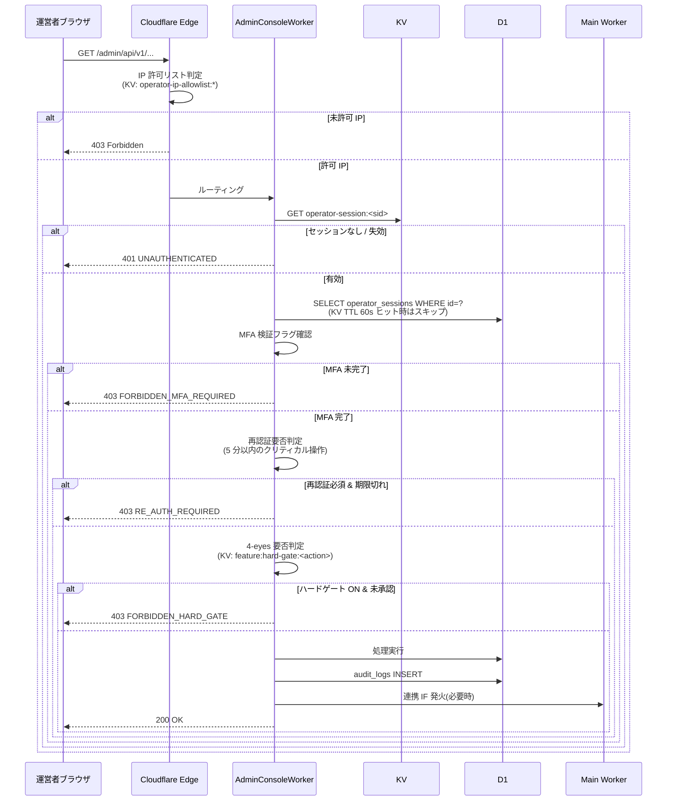

# 顧客管理システム 詳細設計書

> **位置づけ**: 本書は実装関連の詳細(モジュール構成 / KV キー・R2 / 非機能 / Cron / 監査 action コード / テスト戦略 / リリース戦略 / 設計決定マッピング / 引継ぎマッピング)を扱う。画面・API・DB・権限・エラー・セキュリティ・状態遷移・連携 IF・メール通知は **個別設計書群/ 配下の 11 ドキュメント体系** を正本とし、本書からは参照のみ行う。
>
> 仕様変更時は **必ず 個別設計書群/ 配下の対応ドキュメント** を更新すること。詳細は [CLAUDE.md](../CLAUDE.md) の「変更適用順序」と [個別設計書群/00_索引.md](個別設計書群/00_索引.md) を参照。

| 項目 | 内容 |
|---|---|
| 文書種別 | 詳細設計書 |
| 対象システム | 顧客管理システム(運営者コンソール) |
| 版 | v1.0 |
| クラウド前提 | Cloudflare(Workers / D1 / KV / R2 / Queues / Workers AI / Secrets Store / Cron Triggers) |
| メール配信 | Resend |
| 課金プロバイダ | Stripe(Webhook 一次受信は本書側) |
| 上位文書 | [基本設計書](02_基本設計書.md) / [要件定義書](01_要件定義書.md) |
| 兄弟文書 | [メインシステム 詳細設計書](../01_メインシステム/03_詳細設計書.md) |

---

## 目次

0. 本書の前提
1. 本書の目的とスコープ
2. システム全体構成
3. 利用者・権限詳細設計
4. 状態詳細設計
5. 画面詳細設計(SCR-090〜099)
6. 機能詳細設計
7. API 詳細設計
8. データベース詳細設計
9. KV キー・R2 オブジェクト一覧
10. 連携 IF・外部 IF 詳細
11. メール通知設計
12. セキュリティ詳細設計
13. 非機能・運用詳細設計
14. Cron 実装詳細
15. 監査 action コード一覧
16. エラーログ・構造化ログ
17. テスト戦略・受入条件マッピング
18. リリース戦略・フィーチャーフラグ
19. 設計決定 D-01〜D-20 詳細化マッピング
20. 詳細設計引継ぎ事項 確定マッピング
- 付録 A 用語集差分
- 付録 B 状態遷移詳細表
- 付録 C SCR ↔ FR ↔ AC ↔ API トレース表
- 付録 D 連携 IF JSON Schema 抜粋
- 付録 E 4-eyes 操作詳細
- 付録 F 3 区分保持の物理対応
- 付録 G 要件 ID 詳細トレース
- 付録 H Webhook 除外フィールド完全リスト
- 付録 I OpenAPI 抜粋
- 付録 J KV キー早見表
- 付録 K 構造化ログ JSON Schema
- 付録 L Cron UTC 一覧

---

## 0. 本書の前提

### 0.1 本書の位置付け

本書は基本設計書 v3.0(`02_運営者システム/02_基本設計書.md`)を実装着手可能な粒度に詳細化した文書である。基本設計が「方式・全体像」を確定するのに対し、本書は「DDL・API スキーマ・KV キー命名・Cron UTC 式・HKDF info 値・action コード一覧・エラーログスキーマなど、実装担当者が即時着手できる具体値」を確定する。

表記、採番、文書同期、基本設計と詳細設計の境界などの文書保守ルールは [CLAUDE.md](../CLAUDE.md) に置く。

### 0.2 用語とスコープ

- 用語: 基本設計 v3.0 付録 A の用語を参照する。
- 主語: 「運営者」「管理者ユーザー」「エンドユーザー」を厳密に区別。本書のスコープは運営者(`service_operator`)が触れる機能のみ。
- 本書は **MVP 範囲のみ** を記載する。MVP で実現する実装仕様、初期値、運用制約だけを本文に置く。

### 0.3 実装データ形式・命名

| 項目 | 規約 |
|---|---|
| ID 形式 | ULID 26 文字(運営者・チケット・申請・リプレイ等)/ Stripe ID は `evt_*` `sub_*` `inv_*` `cn_*` をそのまま PK |
| 命名 | テーブル: snake_case 複数形 / カラム: snake_case 単数形 / 状態列: `state` または `status` / KV キー: `<feature>:<scope>:<id>` コロン区切り英小文字 + ハイフン |
| 日時 | `TIMESTAMP` 型 ISO 8601 UTC(`2026-05-12T10:00:00Z`)。表示時に JST 変換 |
| 真偽値 | `INTEGER` 0/1 |
| JSON | `TEXT` 列に JSON 文字列で保存 |
| エラー | RFC 7807 `application/problem+json`(`type` / `title` / `status` / `code` / `detail` / `trace_id`) |
| 改行 | ファイル末尾は LF 改行で終わる |

---

## 1. 本書の目的とスコープ

### 1.1 目的

本書は、顧客管理システム(運営者コンソール、`admin.open-faq.example.com`)の詳細設計を確定する。基本設計 v2.9 §1〜§17 + 付録 A〜H で確定した方式に対し、本書は次を具体化する。

| 区分 | 本書で確定する内容 |
|---|---|
| API | エンドポイントごとの OpenAPI スキーマ、JSON Schema、エラーコード一覧(§7、付録 I、TH-1) |
| DDL | NULL 制約、外部キー、CHECK 制約、インデックスの正確な構文(§8、TH-2) |
| 画面詳細 | SCR-090〜099 のコンポーネント、項目、API 呼出、4-eyes UI(§5、TH-3, TH-5) |
| HTML サニタイザ | 許可タグ・属性ホワイトリスト具体値(§5.7、TH-4) |
| 監査 action コード | `<resource>.<verb>` 全コード一覧 + retention_class(§15、付録 F、TH-6) |
| KV キー一覧 | 個別キーの命名・TTL 値・サンプル値(§9、付録 J、TH-7) |
| Webhook 除外フィールド | D-06 付録 H 列挙の Stripe API バージョン別拡充(§10.3、付録 H、TH-8) |
| Stripe API | Subscription resume / Invoice / Credit Note の具体パラメータ(§7.13、TH-9) |
| Cron 実装 | UTC 表現の cron 式(§14、付録 L、TH-10) |
| エラーログ詳細 | 構造化ログのスキーマ、必須フィールド、機密項目マスキング(§16、付録 K、TH-11) |
| HKDF info 値 | 正式リスト(§12.6、TH-12) |
| その他 | 連携 IF #1〜#12 通信スキーマ、Runbook 雛形、SLA 計測ロジック、状態遷移詳細 |

### 1.2 最重要方針(再掲)

基本設計 §0 / 要件 §2 を継承:

1. 運営者は本サービス全契約横断の最小限の運用権限のみを持ち、利用者側業務(FAQ 公開・チャット返信・退会受付など)を肩代わりしない。
2. 4-eyes 原則は MVP ハードゲート 3 操作 + 承認ログのみ 7 操作で実装する。
3. すべての運営者操作は監査ログ(ハッシュチェーン)に記録し、3 区分保持(1y / 5y / 7y)で物理管理する。
4. 課金 Webhook の一次受信は本書側のみが行い、メイン側は受けない(D-10)。
5. 運営者プレーンと利用者プレーンはサブドメイン分離(D-01)、Worker 分離(D-02)で攻撃面を最小化する。

### 1.3 スコープ(運営者コンソール限定)

本書はメイン §1.4 で「運営者主管」と区分されたものを詳細化する:

| # | 機能ブロック | 主管 SCR | 主管 FR / NFR |
|---|---|---|---|
| 1 | 運営者認証(MFA + IP 許可 + 再認証 5 分) | ログイン画面、全画面 | FR-220, FR-221, FR-222, FR-007, NFR-311 |
| 2 | 4-eyes 申請承認(MVP 3 ハードゲート + 7 承認ログ) | 承認待ち一覧、各操作モーダル | FR-226, §6.2.1(基本設計) |
| 3 | 削除データ参照・復元(副作用 (a)〜(g) ロールバック) | SCR-090 / SCR-091 | FR-200〜FR-211, FR-222, FR-223 |
| 4 | AI 推論パラメータ 3 階層上書き | SCR-092 | FR-055, FR-061〜FR-066, AC-034 |
| 5 | 契約別レート/予算上書き + サプレスリスト復帰 | SCR-093 | FR-121, FR-128, FR-224, NFR-503, NFR-504 |
| 6 | お知らせ作成・配信(運営者) | SCR-094 | FR-149, FR-188, FR-189 |
| 7 | 監査ログ閲覧・エクスポート(HMAC 署名) | SCR-096 | FR-229, FR-230, FR-232, NFR-306, NFR-602 |
| 8 | 課金 Webhook リプレイ・DLQ 操作 | SCR-097 | FR-302, NFR-808, NFR-809 |
| 9 | PII 誤検出報告管理(3 営業日判定) | SCR-098 | FR-060, FR-064, NFR-805 |
| 10 | Webhook ペイロード差分検出 | SCR-099 | FR-302 異常系, AC-041 |
| 11 | 月次請求確定 cron(月初 02:00 JST) | バックグラウンド | FR-303, AC-042 |
| 12 | 監査ハッシュチェーン日次検証 | バックグラウンド | NFR-306, RB-017 |
| 13 | 運営者操作通知(FR-211、10 分集約) | 連携 IF #12 | FR-211, D-19 |

### 1.4 メインシステム正本範囲

次はメインシステム詳細設計(`01_メインシステム/03_詳細設計書.md`)の正本対象であり、本書では連携境界として扱う:

- 利用者認証・管理者ユーザー登録完了・パスワードリセット(`/auth/*`)
- 公開ウィジェット(`/widget/*`)
- 未解決質問・個別チャット(`/inquiries/*`, `/chat/*`)
- FAQ CRUD・FTS 検索(`/projects/*/faqs/*`)
- 管理者ユーザー inbox(主管はメイン、本書は連携 IF #12 で配信指示のみ)
- ウィジェット側レート制限の実適用(主管はメイン、本書は連携 IF #5 で上書き値同期)
- メール送信(主管はメイン、本書は運営者通知 + テスト送信のみ Resend 直叩き)
- サプレスリスト本体(主管はメイン §11.3.2、本書は SCR-093 経由で個別アドレス復帰承認のみ)

メイン主管エンティティ(`accounts`, `accounts`, `projects`, `faqs`, `question_logs`, `chat_rooms`, `chat_messages`, `inquiries`, `inbox_messages` 等)はメイン §9 を正本参照し、本書 §8 では運営者側主管 20 エンティティのみ DDL を書き下す。

### 1.5 MVP 初期値

| 項目 | 本書での扱い |
|---|---|---|
| Workers AI 利用モデル | `@cf/meta/llama-3.1-8b-instruct` |
| データリージョン | Cloudflare apac |
| AI しきい値初期値 | 信頼度 0.60 / 関連度 0.50 |
| PII 検出 | 第 1 層(正規表現) + 第 3 層(FAQ 整合性検査) |
| 4-eyes | ハードゲート 3 操作 + 承認ログのみ 7 操作 |

---

## 2. システム全体構成

### 2.1 Worker トポロジー

本書側は **メインシステムと別の wrangler プロジェクト**(D-02)としてデプロイする。攻撃面の縮小、MFA / IP 許可ミドルウェアの分離、独立デプロイ・独立ロールバックを目的とする。

```mermaid
flowchart TB
    subgraph Browser[運営者ブラウザ]
        SPA[Admin SPA<br/>admin.open-faq.example.com<br/>Cloudflare Pages]
    end

    subgraph External[外部サービス]
        Stripe[Stripe API / Webhook]
        Resend[Resend API / Webhook]
    end

    subgraph AdminPlane[運営者プレーン Worker 群]
        AdminConsole[AdminConsoleWorker<br/>SPA 配信 + 全運営 API<br/>/admin/api/v1/*]
        BillingWebhook[BillingWebhookWorker<br/>POST /webhooks/stripe<br/>POST /webhooks/resend]
        Scheduler[AnnouncementSchedulerWorker<br/>1 分 cron]
        ChainVerifier[AuditChainVerifierWorker<br/>日次 02:00 JST cron]
        MonthlyBilling[MonthlyBillingCronWorker<br/>月初 02:00 JST cron]
        RetentionPurge[RetentionPurgeWorker<br/>日次 03:00 JST cron]
        AuditArchive[R2AuditArchiveWorker<br/>年次 12/31 04:00 JST cron]
        DlqBackoff[DLQAutoBackoffWorker<br/>5 分 cron]
    end

    subgraph DataPlane[データプレーン]
        D1Admin[(D1: admin_db<br/>運営者主管 21 テーブル)]
        KV[(KV: admin_cache<br/>セッション / レート / AI パラメータ / フラグ)]
        R2[(R2: admin_archive<br/>DLQ 退避 / 監査エクスポート / アーカイブ)]
        Queues[(Queues: admin_queues<br/>webhook-dlq / notification-batch / restore-rollback)]
        AI[(Workers AI<br/>AI 推論 / PII 検査)]
        Secrets[Secrets Store<br/>マスター鍵 / API キー]
    end

    subgraph Main[メインシステム]
        MainWorker[Main Worker<br/>app.open-faq.example.com<br/>/internal/admin-integration/v1/*]
        MainDB[(メイン D1)]
    end

    SPA -- Cookie + CSRF --> AdminConsole
    Stripe -- POST /webhooks/stripe<br/>HMAC-SHA256 署名 --> BillingWebhook
    Resend -- POST /webhooks/resend --> BillingWebhook

    AdminConsole --> D1Admin
    AdminConsole --> KV
    AdminConsole --> Secrets
    BillingWebhook --> D1Admin
    BillingWebhook --> R2
    BillingWebhook --> Queues
    Scheduler --> D1Admin
    Scheduler --> Queues
    ChainVerifier --> D1Admin
    MonthlyBilling --> D1Admin
    MonthlyBilling --> Stripe
    RetentionPurge --> D1Admin
    RetentionPurge --> R2
    AuditArchive --> D1Admin
    AuditArchive --> R2
    DlqBackoff --> Queues
    DlqBackoff --> D1Admin

    AdminConsole -- mTLS + JWT<br/>連携 IF #1, #2, #4, #5, #6, #7, #12 --> MainWorker
    MainWorker -- mTLS + JWT<br/>連携 IF #8, #9 --> AdminConsole
    BillingWebhook -- mTLS + JWT<br/>連携 IF #10 --> MainWorker
    Scheduler -- 連携 IF #7 --> MainWorker
    AdminConsole -.読取参照(必要時).-> MainDB
```



### 2.2 Worker 責務マトリクス

| Worker | 責務 | バインド | 主な処理時間 |
|---|---|---|---|
| `AdminConsoleWorker` | 運営者ログイン、MFA、IP 許可、再認証、4-eyes 承認、SCR-090〜099 の全 API、内部 API クライアント(連携 IF 発信側) | `D1: admin_db` / `KV: admin_cache` / `Secrets` / Queues producer / R2 reader | リクエスト駆動 |
| `BillingWebhookWorker` | Stripe / Resend Webhook 一次受信、署名検証、event_id 冪等、ペイロード正規化 + 差分検出、内部転送(連携 IF #10)、DLQ 投入 + R2 退避 | `D1` / `R2` / `Queues` / `Secrets` | リクエスト駆動(30 秒以内) |
| `AnnouncementSchedulerWorker` | お知らせ配信予約の 1 分ポーリング、`scheduled_at ≤ now+5min` を `sending` 遷移、連携 IF #7 でメイン転送 | `D1` / `Queues` | 1 分間隔 |
| `AuditChainVerifierWorker` | 監査ログ全件のハッシュチェーン再計算(D-04)、不一致時の運営者 inbox + メール通知 | `D1` / `Secrets`(チェーン鍵) | 日次 02:00 JST |
| `MonthlyBillingCronWorker` | 月初 02:00 JST の請求書発行(D-11)、`(owner_account_id, billing_year_month)` 冪等、Stripe Invoice API 発行、契約通知 + 監査記録 | `D1` / Stripe / Queues | 月次 |
| `RetentionPurgeWorker` | 監査ログの 3 区分(1y / 5y / 7y)物理削除バッチ、R2 アーカイブ書出後に DELETE | `D1` / `R2` | 日次 03:00 JST |
| `R2AuditArchiveWorker` | 5y / 7y の年次 R2 圧縮アーカイブ書出 | `D1` / `R2` | 年次 12/31 04:00 JST |
| `DLQAutoBackoffWorker` | Cloudflare Queues DLQ の自動指数 BO(1m → 4m → 16m、最大 3 回)、1 時間経過で `dlq_manual_replay` 遷移 | `Queues` / `D1` | 5 分間隔 |

### 2.3 ドメイン・URL 分離(D-01)

| ホスト | 用途 | 入口制御 |
|---|---|---|
| `admin.open-faq.example.com` | 運営者プレーン全機能 | IP 許可リスト(エッジで `403 Forbidden` 早期返却) |
| `admin.open-faq.example.com/login` | 運営者ログイン | 利用者側からのリンクなし(発見可能性を下げる) |
| `admin.open-faq.example.com/webhooks/stripe` | Stripe Webhook 受信専用(D-10、唯一の受信先) | Stripe-Signature 検証、IP 許可リスト適用外 |
| `admin.open-faq.example.com/webhooks/resend` | Resend Webhook 受信 | Resend Signature 検証、IP 許可リスト適用外 |
| `app.open-faq.example.com` | 利用者プレーン(メインシステム正本) | 本書側 SPA からは Cookie スコープ分離(`Domain=admin.open-faq.example.com`) |
| `app.open-faq.example.com/internal/admin-integration/v1/*` | メイン側内部 API(連携 IF #1〜#12) | mTLS + JWT(本書側 Worker からのみアクセス可能) |

`/webhooks/stripe` と `/webhooks/resend` は IP 許可リストの適用外とする(外部サービスからのコールバックを受信するため)が、署名検証で代替する。それ以外のすべてのパスは IP 許可リスト適用後にルーティングされる。

### 2.4 環境構成

| 環境 | 用途 | wrangler.toml 環境名 | データ |
|---|---|---|---|
| `dev` | 開発(各開発者ローカル) | `local` | Miniflare 内 D1 / KV / R2 |
| `stg` | 結合テスト・E2E | `staging` | 本番別 D1 / 別 R2 バケット |
| `prod` | 本番 | `production` | `admin_db` / `admin_cache` / `admin_archive` |

各環境で個別の Stripe / Resend Webhook Secret、HKDF マスター鍵、JWT 署名鍵を発行する。staging から本番への昇格は GitHub OIDC + Environment Protection Rules で 2 名承認を必須化(§13.11)。

### 2.5 リクエストフロー



### 2.6 ディレクトリ構成例

実装プロジェクトの参考レイアウト(別 wrangler プロジェクト):

```text
admin/
├── wrangler.toml                 # AdminConsoleWorker
├── wrangler.billing-webhook.toml # BillingWebhookWorker
├── wrangler.scheduler.toml       # AnnouncementSchedulerWorker, ...
├── src/
│   ├── admin-console/
│   │   ├── handlers/             # /admin/api/v1/* ハンドラ
│   │   │   ├── auth.ts
│   │   │   ├── approvals.ts
│   │   │   ├── deleted-resources.ts
│   │   │   ├── restorations.ts
│   │   │   ├── ai-parameters.ts
│   │   │   ├── overrides.ts
│   │   │   ├── announcements.ts
│   │   │   ├── audit-logs.ts
│   │   │   ├── webhooks-ops.ts
│   │   │   └── pii-fp-reports.ts
│   │   ├── middleware/
│   │   │   ├── ip-allowlist.ts
│   │   │   ├── session.ts
│   │   │   ├── mfa.ts
│   │   │   ├── reauth.ts
│   │   │   ├── csrf.ts
│   │   │   ├── ticket-id.ts
│   │   │   └── four-eyes.ts
│   │   └── lib/
│   │       ├── audit.ts          # audit_logs INSERT + ハッシュチェーン
│   │       ├── hkdf.ts           # HKDF info 値別派生鍵
│   │       ├── totp.ts
│   │       ├── argon2.ts
│   │       ├── pii.ts
│   │       └── stripe.ts
│   ├── billing-webhook/
│   │   ├── handler.ts
│   │   ├── verify.ts             # HMAC-SHA256 署名検証
│   │   ├── canonical.ts          # JSON 正規化 + SHA-256
│   │   └── forward.ts            # 連携 IF #10 mTLS+JWT
│   ├── scheduler/
│   │   ├── announcements.ts      # 1 分 cron
│   │   ├── audit-chain.ts        # 日次 02:00 JST
│   │   ├── monthly-billing.ts    # 月初 02:00 JST
│   │   ├── retention-purge.ts    # 日次 03:00 JST
│   │   └── r2-audit-archive.ts   # 年次 12/31
│   └── shared/
│       ├── errors.ts             # 全エラーコード定義
│       ├── action-codes.ts       # 監査 action コード列挙
│       ├── kv-keys.ts            # KV キー定数
│       ├── logger.ts             # 構造化ログ
│       └── types.ts
├── migrations/
│   └── d1-admin/
│       ├── 0001_init_operators.sql
│       ├── 0002_init_audit_logs.sql
│       ├── 0003_init_webhook_events.sql
│       └── ...
├── tests/
│   ├── unit/                     # Vitest
│   ├── integration/              # Miniflare
│   ├── e2e/                      # Playwright(SCR-090〜094, SCR-096〜099)
│   └── webhook/                  # Stripe Test Mode
├── scripts/
│   ├── audit-export-verify.ts    # HMAC 署名検証ツール(運営者配布)
│   └── canonical-json.ts         # 正規化アルゴリズム参考実装
└── openapi/
    └── admin-api.yaml            # OpenAPI v3.1 抜粋
```

実装プロジェクトの実際のディレクトリ名は実装段階で確定して構わない(本書はあくまで責務マッピングの参考)。

---

## 3. 利用者・権限詳細設計
> **本章は [個別設計書群/05_権限設計書.md](個別設計書群/05_権限設計書.md) および [個別設計書群/09_認証認可設計書.md](個別設計書群/09_認証認可設計書.md) を正本とする(本書は参照のみ)。単一 `service_operator` ロール、4-eyes 対象 10 操作(ハードゲート 3 + 承認ログ 7)、6 段認可判定(IP allowlist → セッション → MFA → role → 再認証 → 4-eyes)、MFA(TOTP)、IP 許可リスト、運営者アカウント・ライフサイクルは当該ドキュメントを正本とする。


## 4. 状態詳細設計
> **本章は [個別設計書群/04_テーブル定義書.md §8](個別設計書群/04_テーブル定義書.md) **。`operator_approvals.state`(7 値)、`webhook_events.state`(12 値)、`announcement_drafts.state`(8 値)、`pii_false_positive_reports.state`(6 値)、`webhook_payload_diffs.state`(4 値)の全状態遷移は当該ドキュメントを正本とする。


## 5. 画面詳細設計(SCR-090〜099)
> **本章は [個別設計書群/02_画面設計書.md](個別設計書群/02_画面設計書.md) および [個別設計書群/07_メッセージ一覧.md](個別設計書群/07_メッセージ一覧.md) を正本とする(本書は参照のみ)。全 15 画面(SCR-090〜099 / SCR-AUTH / SCR-AUTH-M1 / SCR-HOME / SCR-APPROVALS / M1 / M2)の表示・入力・操作・バリデーション・モーダル・状態別表示・メッセージ ID(121 件)・4-eyes UI(PayloadDiffViewer / SelfApprovalGuard / ReauthCountdown / HardgateBadge)は当該ドキュメントを正本とする。


## 6. 機能詳細設計
> **本章は [個別設計書群/03_API設計書.md](個別設計書群/03_API設計書.md) および [個別設計書群/04_テーブル定義書.md](個別設計書群/04_テーブル定義書.md) を正本とする(本書は参照のみ)。運営者機能(F-OP-*)のロジック・データ・API 連動の全項目は当該ドキュメントを正本とする。


## 7. API 詳細設計(★TH-1, TH-9)
> **本章は [個別設計書群/03_API設計書.md](個別設計書群/03_API設計書.md) **。運営者管理 API 28 個、4-eyes 承認 API、削除データ復元、AI パラメータ、契約上書き、お知らせ配信、監査ログ閲覧・エクスポート、Webhook リプレイ、PII ルール更新の全 API 仕様(リクエスト / レスポンス / 認可 / エラー)は当該ドキュメントを正本とする。


## 8. データベース詳細設計(★TH-2)
> **本章は [個別設計書群/04_テーブル定義書.md](個別設計書群/04_テーブル定義書.md) **。運営者専用 19 テーブル(`operator_*` / `audit_logs` ハッシュチェーン / `webhook_events` / `operator_approvals` / `accounts_retired` 等)の DDL、CHECK 制約、インデックス、外部キー、コード値、状態遷移は当該ドキュメントを正本とする。


## 9. KV キー・R2 オブジェクト一覧(★TH-7)

本章は基本設計 §16 引継ぎ事項 TH-7 を確定する。全 KV キーの命名・値スキーマ・TTL・サンプル・参照 Worker を一覧化する。

### 9.1 KV キー命名規則

| 項目 | 規約 |
|---|---|
| 一般形式 | `<feature>:<scope>:<id>`(英小文字 + ハイフン + コロン区切り) |
| 機能ごとに TTL を設定 | 認証系 60s〜15min、フラグ系 60s、ルール系 60s、レート/予算 30s、トークン系 個別 |
| 文字制限 | 英数 + `-` + `_` + `:`、最大 512 バイト |
| 値形式 | JSON 文字列、bool、数値、または ID 文字列 |
| Namespace | `admin_cache`(本書側専用 KV namespace) |

### 9.2 KV キー全表

#### 9.2.1 認証・セッション

| キー形式 | 値スキーマ | TTL | 更新タイミング | 参照 Worker | サンプル |
|---|---|---|---|---|---|
| `operator-session:<session_id>` | `{ operatorId, mfaVerifiedAt, reauthenticatedAt, csrfToken, expiresAt }` | 60 秒(キャッシュ) | ログイン時、ログアウト時失効 | AdminConsoleWorker | `{"operatorId":"01J...","mfaVerifiedAt":"...","csrfToken":"abc"}` |
| `operator-ip-allowlist:<operator_id>` | `["203.0.113.0/24","2001:db8::/48"]`(CIDR 配列) | 60 秒 | IP リスト変更時に Invalidate | エッジ(AdminConsoleWorker) | `["203.0.113.0/24"]` |
| `mfa-setup:<account_id>` | `{ token, secret, expiresAt }` | 72 時間 | MFA セットアップ開始時 | AdminConsoleWorker | - |
| `password-reset:<token_hash>` | `{ operatorId, expiresAt }` | 60 分 | リセット要求時 | AdminConsoleWorker | - |
| `re-auth:<session_id>` | `{ operatorId, reauthenticatedAt, consumed }` | 15 分(1 回限り、`consumed=true` で即時失効) | 再認証成功時 | AdminConsoleWorker | `{"operatorId":"01J...","consumed":false}` |
| `login-lockout:<ip_hash>:<account_id>` | `{ failedCount, lockedUntil }` | 15 分 | ログイン失敗時 | AdminConsoleWorker | `{"failedCount":5,"lockedUntil":"..."}` |

#### 9.2.2 機能フラグ

| キー形式 | 値 | TTL | 用途 |
|---|---|---|---|
| `feature:hard-gate:<action_code>` | `true` / `false` | 60 秒(キャッシュ) | MVP ハードゲート 3 操作を制御 |
| `feature:ai-model:rollout:<version>` | `{ percentage: 0\|10\|50\|100 }` | 60 秒 | AI モデルロールアウト |
| `feature:pii-rule-rollout:<revision_id>` | `{ percentage: 0\|10\|50\|100 }` | 60 秒 | PII ルールロールアウト |
| `feature:announcement-batch-size` | 数値 | 60 秒 | 1 cron tick あたりのお知らせ最大処理件数(既定 100) |

#### 9.2.3 ルール・パラメータ

| キー形式 | 値スキーマ | TTL | 主管 | 更新元 |
|---|---|---|---|---|
| `pii-rules:regex` | `[{ id, pattern, enabled }, ...]` | 60 秒(D-13) | 本書 | SCR-098 `POST /pii-rules/revisions` |
| `pii-rules:classifier` | `{ threshold, weights, modelId }` | 60 秒(D-13) | 本書 | 同上 |
| `ai-params:global` | `{ confidenceThreshold, relevanceThreshold, modelId }` | 60 秒(D-15) | 本書 | SCR-092 |
| `ai-params:owner:<owner_account_id>` | 同上 | 60 秒 | 本書 | SCR-092 |
| `ai-params:project:<project_id>` | 同上 | 60 秒 | 本書 | SCR-092 |
| `ai-models:available` | `["@cf/meta/llama-3.1-8b-instruct", ...]` | 60 秒 | 本書 | 運営者手動 |
| `ai-cost:unit-prices` | `{ "<model_id>": { "input_per_1k_tokens": <yen>, "output_per_1k_tokens": <yen> } }` | 60 秒 | 本書 | 運営者手動(NFR-804 (m) FR-304) |

#### 9.2.4 レート / 予算上書き

| キー形式 | 値スキーマ | TTL | 用途 |
|---|---|---|---|
| `rate-limit:<owner_account_id>` | `{ widgetAskPerMin, chatEndUserPerMin, chatStaffPerMin }` | 30 秒(D-14) | メイン側参照 |
| `budget-limit:<owner_account_id>` | `{ monthlyBudgetYen }` | 30 秒 | 同上 |
| `budget-limit:min` | 数値 | 永続(運営者更新時のみ Invalidate) | バリデーション下限 |
| `budget-limit:max` | 数値 | 永続 | バリデーション上限 |

#### 9.2.5 Webhook・トークン

| キー形式 | 値スキーマ | TTL | 用途 |
|---|---|---|---|
| `webhook:idempotency:<event_id>` | `{ payloadHash, state, processedAt }` | 30 日 | event_id 冪等(D1 `webhook_events` のキャッシュ) |
| `audit-export:<job_id>` | `{ status, files, signature }` | 24 時間 | エクスポート進捗 |

#### 9.2.6 通知集約

| キー形式 | 値スキーマ | TTL | 用途 |
|---|---|---|---|
| `notify-batch:<owner_account_id>:<operation_kind>` | `{ entries: [...], firstAt }` | 10 分(D-19) | FR-211 集約窓 |

### 9.3 R2 オブジェクトパス

Namespace: `admin_archive`(本書側専用 R2 バケット)

| パス | 用途 | 保持 | アクセス |
|---|---|---|---|
| `dlq-stripe-events/<event_id>.json` | DLQ 退避 Webhook ペイロード | 30 日(life-cycle rule) | BillingWebhookWorker / SCR-097 |
| `audit-export/<job_id>-<seq>.csv` | 監査ログエクスポート(CSV) | 24 時間 | AdminConsoleWorker |
| `audit-export/<job_id>-<seq>.jsonl` | 同(JSONL) | 24 時間 | 同上 |
| `audit-export/<job_id>-<seq>.sig` | HMAC 署名ファイル(D-17) | 24 時間 | 同上 |
| `webhook-payload-snapshots/<event_id>-<received_at>.json` | ペイロード差分検出時のスナップショット | 30 日 | BillingWebhookWorker |
| `audit-archive/<retention_class>/<year>/<month>.tar.gz` | 監査ログ年次アーカイブ | 法令対応期間内 | R2AuditArchiveWorker |
| `backup/d1-snapshots/<env>/<date>.sqlite` | D1 日次バックアップ(NFR-803 三層) | 日次 30 日 / 週次 12 週 / 月次 12 ヶ月 | Backup Worker(別 Worker) |

---

## 10. 連携 IF・外部 IF 詳細(★TH-8)
> **本章は [個別設計書群/03_API設計書.md](個別設計書群/03_API設計書.md) §5.8 + [個別設計書群/11_課金請求設計書.md](個別設計書群/11_課金請求設計書.md) §13 を正本とする(本書は参照のみ)。連携 IF #1〜#12(送信 8 + 受信 2)+ Stripe Webhook 一次受信(署名検証 / 冪等性 / DLQ / 差分検出)は当該ドキュメントを正本とする。


## 11. メール通知設計
> **本章は [個別設計書群/07_メッセージ一覧.md](個別設計書群/07_メッセージ一覧.md) §8(運営者向け通知 + IF #12 経由通知)**。通知契機 13 種(運営者宛)+ 5 種(IF #12 経由 利用者向け)+ テンプレートは当該ドキュメントを正本とする。


## 12. セキュリティ詳細設計(★TH-12)
> **本章は [個別設計書群/10_セキュリティ設計書.md](個別設計書群/10_セキュリティ設計書.md) **。監査ログハッシュチェーン構造、3 区分保持(`general` / `billing` / `operator_high_priv`)、`accounts_retired` 永久保持、GDPR 越境移転対応、Webhook ペイロード差分検出は当該ドキュメントを正本とする。


## 13. 非機能・運用詳細設計

非機能・運用詳細は [../運用手順書.md](../03_運用/運用手順書.md) の「顧客管理システム 非機能・運用詳細由来」へ移管した。本書では cron、監査 action、API、DB など実装詳細との接点のみを扱う。

## 14. Cron 実装詳細(★TH-10)

基本設計 §6.5 / §6.2.7 / §10.4 + D-04 / D-05 / D-09 / D-11 を物理化し、UTC cron 式を確定する。

### 14.1 Cron Triggers UTC cron 式表(全 cron)

**前提**: Cloudflare Cron Triggers は標準 cron 構文(分・時・日・月・曜日)のみをサポートし、`L`(last day of month)・`W`・`#` 等の拡張構文は使用できない。月末日付や JST の月初判定は **Worker 内のロジック**で行う(後述 §14.1.1 ガード)。JST = UTC + 9 時間。

| Worker | JST 想定 | UTC cron 式 | UTC 換算 | Worker 内ガード | 冪等性キー | リトライ | 関連 D |
|---|---|---|---|---|---|---|---|
| `MonthlyBillingCronWorker` | 月初 1 日 02:00 JST | `0 17 * * *`(毎日 17:00 UTC) | 翌日 02:00 JST | `if (jstNow().day !== 1) return;` | `(owner_account_id, billing_year_month)` UNIQUE | 3 回 | D-11 |
| `AuditChainVerifierWorker` | 日次 02:00 JST | `0 17 * * *` | 翌日 02:00 JST | - | `(verify_date)` | - | D-04 |
| `AnnouncementSchedulerWorker` | 1 分ポーリング | `* * * * *` | 毎分 | - | - | - | D-09 |
| `DLQAutoBackoffWorker` | 5 分ポーリング | `*/5 * * * *` | 5 分間隔 | - | `(event_id, attempt)` | 指数 BO 3 回 | - |
| `RetentionPurgeWorker` | 日次 03:00 JST | `0 18 * * *` | 翌日 03:00 JST | - | `(purge_date, retention_class)` | - | D-08 |
| `R2AuditArchiveWorker` | 年次 12/31 04:00 JST | `0 19 30 12 *` | UTC 12/30 19:00 = JST 12/31 04:00 | - | `(archive_year)` | - | - |
| `OperatorNotifyAggregatorWorker` | 1 分(10 分集約処理) | `* * * * *` | 毎分 | - | KV TTL | - | D-19 |

#### 14.1.1 Worker 内 JST 判定ガード(MonthlyBillingCronWorker)

Cloudflare Cron Triggers は `L`(月末日)構文をサポートしないため、`MonthlyBillingCronWorker` は **毎日 17:00 UTC に起動し、JST 換算で当日が月初(`day === 1`)である場合のみ処理を進める**:

```text
function shouldRun(): boolean {
    const utcNow = new Date();              // Worker 起動時刻(UTC)
    const jstNow = new Date(utcNow.getTime() + 9 * 60 * 60 * 1000);
    return jstNow.getUTCDate() === 1;       // JST の日付が 1 日のとき true
}

if (!shouldRun()) {
    log.info("monthly-billing: skipped (jstDay != 1)");
    return;
}
// 以降が §14.2.1 の処理
```

ガード判定自体は毎日実行されるが、`shouldRun()=false` で即 return するため副作用は発生しない。閏年・夏時間影響を受けず、確定的に「JST の月初日に 1 回だけ」実行される。

#### 14.1.2 月末日のずれ対策

`R2AuditArchiveWorker` は `0 19 30 12 *`(UTC 12/30 19:00 = JST 12/31 04:00)を採用。JST の意図時刻を起点に UTC 計算した結果で、`L` 構文に依存しない。

UTC 換算の検算ルール(本書改訂時の必須チェック):

| JST 想定 | UTC 換算 | cron 式 | 検算 |
|---|---|---|---|
| 03:00 JST | 前日 18:00 UTC | `0 18 <day-1> <month> *` | 翌日 03:00 JST に発火 ✓ |
| 02:00 JST | 前日 17:00 UTC | `0 17 <day-1> <month> *` | 翌日 02:00 JST に発火 ✓ |
| 04:00 JST | 前日 19:00 UTC | `0 19 <day-1> <month> *` | 翌日 04:00 JST に発火 ✓ |
| 12/31 04:00 JST | 12/30 19:00 UTC | `0 19 30 12 *` | 12/31 04:00 JST に発火 ✓ |

### 14.2 各 cron の擬似コード

#### 14.2.1 `MonthlyBillingCronWorker`(D-11)

```text
function monthlyBilling():
    target_month = (now - 1 day).format("YYYY-MM")  // 月初実行時に前月を対象
    audit_logs(billing.cron.run, 7y, payload={month: target_month, started_at: now})
    
    owners = D1.query("SELECT id FROM accounts WHERE is_owner = 1 AND contract_status='active'")
    success = 0; failed = 0
    for owner in owners:
        try:
            usage = computeUsage(owner.id, target_month)
            amount = computeAmount(usage)
            existing = D1.query("SELECT id FROM billing_invoices WHERE owner_account_id=? AND billing_year_month=?", owner.id, target_month)
            if existing:
                continue  // 冪等
            invoiceId = ULID()
            D1.exec("INSERT INTO billing_invoices (id, owner_account_id, billing_year_month, amount_yen, status, issued_at) VALUES (?, ?, ?, ?, 'issued', ?)", invoiceId, owner.id, target_month, amount, now)
            stripeInvoice = stripe.invoiceItems.create({customer: owner.stripe_customer_id, amount: amount, currency: 'jpy', metadata: {owner_account_id: owner.id, billing_year_month: target_month}})
            stripeInv = stripe.invoices.create({customer: owner.stripe_customer_id, auto_advance: false, metadata: {owner_account_id, billing_year_month}, idempotencyKey: `monthly-billing-${owner.id}-${target_month}`})
            D1.exec("UPDATE billing_invoices SET stripe_invoice_id=? WHERE id=?", stripeInv.id, invoiceId)
            audit_logs(billing.invoice.issued, 7y, payload={invoice_id: invoiceId})
            sendMail(owner, FR-148)
            sendInbox(owner, FR-187)
            success++
        catch e:
            failed++
            if attempt >= 3:
                notifyOperator(high, "Monthly billing failed for owner=${owner.id}")
    
    audit_logs(billing.cron.run, 7y, payload={summary: {success, failed}})
```

#### 14.2.2 `AuditChainVerifierWorker`(D-04)

```text
function auditChainVerify():
    verify_date = today
    runId = ULID()
    audit_logs(audit.chain.verify.start, 5y, payload={verify_date, run_id: runId})
    
    prev_hash = "0" * 64
    mismatch_count = 0
    cursor = null
    do:
        rows = D1.query("SELECT id, prev_hash, record_hash, ... FROM audit_logs WHERE id > ? ORDER BY occurred_at, id LIMIT 1000", cursor)
        for r in rows:
            expected = sha256(prev_hash + canonical_json(r.{actor_id, action, ..., retention_class}))
            if expected != r.record_hash:
                audit_logs(audit.chain.verify.fail, 5y, payload={row_id: r.id, expected, actual: r.record_hash})
                notifyOperator(high, "Audit chain mismatch at row=${r.id}")
                mismatch_count++
            prev_hash = r.record_hash
            cursor = r.id
    while rows.length > 0
    
    audit_logs(audit.chain.verify, 5y, payload={verify_date, run_id: runId, mismatch_count, total_rows: ...})
```

#### 14.2.4 `AnnouncementSchedulerWorker`(D-09)

```text
function announcementSchedule():
    candidates = D1.query("SELECT id FROM announcement_drafts WHERE state='scheduled' AND scheduled_at <= ? LIMIT ?", now + 5min, KV.get("feature:announcement-batch-size") || 100)
    for c in candidates:
        D1.exec("UPDATE announcement_drafts SET state='sending' WHERE id=? AND state='scheduled'", c.id)
        try:
            result = callMainIF(7, {announcementId: c.id, ...})
            if result.ok:
                D1.exec("UPDATE announcement_drafts SET state='sent', sent_at=? WHERE id=?", now, c.id)
                audit_logs(announcement.send, 5y, payload={announcement_id: c.id, recipients: result.recipients})
            else:
                handleRetry(c.id)
        catch e:
            handleRetry(c.id)
```

#### 14.2.6 `DLQAutoBackoffWorker`

```text
function dlqAutoBackoff():
    candidates = D1.query("SELECT * FROM webhook_events WHERE state='failed' AND next_retry_at <= ? AND attempt_count < 3", now)
    for e in candidates:
        try:
            payload = R2.get(`dlq-stripe-events/${e.event_id}.json`)
            result = callMainIF(10, payload)
            if result.ok:
                D1.exec("UPDATE webhook_events SET state='succeeded', last_transition_at=? WHERE event_id=?", now, e.event_id)
                D1.exec("INSERT INTO dlq_replay_log (id, event_id, replay_type, attempted_at, result) VALUES (?, ?, 'auto_bo', ?, 'succeeded')", ULID(), e.event_id, now)
                audit_logs(stripe.event.processed, 7y)
            else:
                attempt = e.attempt_count + 1
                backoffMs = [1*60_000, 4*60_000, 16*60_000][attempt - 1]
                D1.exec("UPDATE webhook_events SET attempt_count=?, next_retry_at=?, last_transition_at=? WHERE event_id=?", attempt, now + backoffMs, now, e.event_id)
                if attempt >= 3:
                    D1.exec("UPDATE webhook_events SET state='dlq_manual_replay' WHERE event_id=?", e.event_id)
                    notifyOperator(high, "Webhook DLQ stuck: ${e.event_id}")
    
    // 30 日経過 archived
    D1.exec("UPDATE webhook_events SET state='dlq_archived' WHERE state='dlq_manual_replay' AND received_at < ?", now - 30days)
```

#### 14.2.7 `RetentionPurgeWorker`(D-08)

```text
function retentionPurge():
    today = today
    runId = ULID()
    audit_logs(retention.purge.run.start, 5y, payload={run_id: runId, date: today})
    
    for cls, days in [('1y', 365), ('5y', 365*5), ('7y', 365*7)]:
        cutoff = today - days
        deletedCount = D1.exec("DELETE FROM audit_logs WHERE retention_class=? AND occurred_at < ?", cls, cutoff)
        audit_logs(retention.purge.run, 5y, payload={run_id: runId, retention_class: cls, deleted_count: deletedCount})
    
    // 通知ログ・エラーログも個別保持
    D1.exec("DELETE FROM inbox_messages WHERE created_at < ?", today - 365)
```

#### 14.2.8 `R2AuditArchiveWorker`

```text
function r2AuditArchive():
    year = now.year - 1
    for cls in ['5y', '7y']:
        for month in 1..12:
            rows = D1.query("SELECT * FROM audit_logs WHERE retention_class=? AND occurred_at BETWEEN ? AND ?", cls, `${year}-${month}-01`, `${year}-${month}-31`)
            if rows.length == 0: continue
            jsonl = rows.map(r => JSON.stringify(r)).join('\n')
            gzipped = gzip(jsonl)
            R2.put(`audit-archive/${cls}/${year}/${month}.tar.gz`, gzipped)
    audit_logs(retention.archive.run, 5y, payload={archive_year: year})
```

### 14.3 Cron 失敗時の通知ポリシー

| Worker | 連続失敗回数 | 通知 |
|---|---|---|
| MonthlyBillingCronWorker | 3 回 | 運営者 high |
| AuditChainVerifierWorker | 1 回(不一致検出) | 運営者 high |
| AnnouncementSchedulerWorker | 5 回(同一 ID) | 運営者 normal、対象 announcement を `failed` 遷移 |
| DLQAutoBackoffWorker | 3 回 / event | 運営者 high(`dlq_manual_replay` 遷移時) |

---

## 15. 監査 action コード一覧(★TH-6)

`<resource>.<verb>` 命名規約で全 action コードを確定する。

### 15.1 命名規約

| 項目 | 規約 |
|---|---|
| 形式 | `<resource>.<verb>` または `<resource>.<sub-resource>.<verb>` |
| 文字 | 英小文字 + ハイフン + ドット + アンダースコア |
| 動詞 | 過去形は使わない(`create`/`update`/`delete`/`approve`/`reject`/`execute` 等) |

### 15.2 全 action コード一覧(約 60 件)

| action コード | retention_class | 4-eyes 対象 | payload スキーマ参照 |
|---|---|---|---|
| **owner.*** | | | |
| `owner.suspend` | 5y | MVP Log Only / Beta Hard Gate | `{ownerAccountId, reason, suspendedAt}` |
| `owner.restore` | 5y | MVP Log Only / Beta Hard Gate | `{ownerAccountId, restorationId, reason, rollback}` |
| `owner.physical_delete` | 5y | **MVP Hard Gate** | `{ownerAccountId, slug, reason, ticketId}` |
| `owner.restore_data` | 5y | MVP Log Only / Beta Hard Gate | `{ownerAccountId, resourceType, resourceId, reason, rollback}` |
| `owner.update` | 5y | - | `{ownerAccountId, before, after}` |
| **operator.*** | | | |
| `operator.invite` | 5y | - | `{invitedId, invitedBy, email}` |
| `operator.accept` | 5y | - | `{operatorId}` |
| `operator.disable` | 5y | - | `{operatorId, reason}` |
| `operator.session.revoke` | 5y | - | `{operatorId, sessionId}` |
| `operator.login.attempt` | 1y | - | `{email, success, ipMasked}` |
| `operator.login.success` | 5y | - | `{operatorId, sessionId}` |
| `operator.login.failed` | 5y | - | `{email, failedCount}` |
| `operator.lockout` | 5y | - | `{accountId, lockedUntil}` |
| `operator.password.reset.request` | 5y | - | `{email}` |
| `operator.password.reset` | 5y | - | `{operatorId, approvalId}` |
| `operator.subrole.grant` | 5y | - | `{operatorId, subrole}` |
| `operator.subrole.revoke` | 5y | - | `{operatorId, subrole}` |
| **operator_approval.*** | | | |
| `operator_approval.request` | 5y | - | `{approvalId, actionCode, payloadHash}` |
| `operator_approval.start_review` | 5y | - | `{approvalId, reviewerId}` |
| `operator_approval.approve` | 5y | - | `{approvalId, approvedBy}` |
| `operator_approval.reject` | 5y | - | `{approvalId, rejectedBy, comment}` |
| `operator_approval.withdraw` | 5y | - | `{approvalId, withdrawnBy, comment?}` |
| `operator_approval.execute` | 5y | - | `{approvalId, executedBy, result}` |
| `operator_approval.expire` | 5y | - | `{approvalId}` |
| **operator_mfa.*** | | | |
| `mfa.setup` | 5y | - | `{operatorId}` |
| `mfa.verify` | 5y | - | `{operatorId, success}` |
| `mfa.recovery_code.used` | 5y | - | `{operatorId, codeIdMasked}` |
| `reauth` | 5y | - | `{operatorId, reauthId}` |
| **operator_ip.*** | | | |
| `operator_ip.grant` | 5y | - | `{operatorId, cidr}` |
| `operator_ip.revoke` | 5y | - | `{operatorId, cidr}` |
| **ai_parameter.*** | | | |
| `ai_parameter.update` | 5y | **MVP Hard Gate** | `{scope, scopeId, before, after, version}` |
| `ai_model.switch` | 5y | - | `{from, to, rolloutPercentage}` |
| **rate_limit.*** / **budget_limit.*** | | | |
| `rate_limit.override` | 5y | MVP Log Only / Beta Hard Gate | `{ownerAccountId, before, after, overrideId}` |
| `budget_limit.override` | 5y | MVP Log Only / Beta Hard Gate | `{ownerAccountId, before, after, overrideId}` |
| `suppress_list.restore` | 5y | MVP Log Only | `{ownerAccountId, email}` |
| `widget.force_stop` | 5y | MVP Log Only / Beta Hard Gate | `{ownerAccountId, reason}` |
| **announcement.*** | | | |
| `announcement.create` | 5y | - | `{announcementId, kind, severity, scope}` |
| `announcement.preview` | 1y | - | `{announcementId}` |
| `announcement.schedule` | 5y | - | `{announcementId, scheduledAt}` |
| `announcement.cancel` | 5y | - | `{announcementId, cancelledBy}` |
| `announcement.test_send` | 1y | - | `{announcementId, sentTo}` |
| `announcement.send` | 5y | - | `{announcementId, recipients}` |
| `announcement.dispatch.dlq` | 5y | - | `{announcementId, attemptCount, failedReason}`(自動 BO 3 回失敗で永久失敗) |
| `announcement.correction.issue` | 5y | - | `{newAnnouncementId, correctionOf}` |
| **webhook.*** | | | |
| `webhook.receive` | 7y | - | `{eventId, eventType, payloadHash}` |
| `webhook.replay` | 5y | - | `{eventId, replayId, attemptedBy}` |
| `webhook.signature.invalid` | 5y | - | `{ipMasked, attemptedAt}` |
| `webhook.payload_diff.detect` | 5y | - | `{diffId, eventId, originalHash, newHash}` |
| `webhook.payload_diff.review` | 5y | - | `{diffId, reviewedBy}` |
| `webhook.payload_diff.reprocess` | 5y | - | `{diffId, replayId}` |
| `webhook.payload_diff.dismiss` | 5y | - | `{diffId, reason}` |
| **billing.*** | | | |
| `billing.invoice.issued` | 7y | - | `{invoiceId, ownerAccountId, amount, billingYearMonth}` |
| `billing.invoice.finalized` | 7y | - | `{invoiceId}` |
| `billing.credit_note.issued` | 7y | - | `{creditNoteId, invoiceId, amount, reason}` |
| `billing.cron.run` | 7y | - | `{month, success, failed}` |
| `pricing.update` | 7y | MVP Log Only / Beta Hard Gate | `{pricingVersion, before, after, effectiveFrom}` |
| **stripe.*** | | | |
| `stripe.event.processed` | 7y | - | `{eventId, eventType}` |
| `stripe.subscription.resume` | 5y | - | `{subscriptionId, ownerAccountId}` |
| **pii.*** | | | |
| `pii_fp_report.create` | 1y | - | `{reportId, detectionLayer}` |
| `pii_fp_report.transition` | 5y | - | `{reportId, from, to}` |
| `pii_rule.update` | 5y | - | `{revisionId, rolloutPercentage}` |
| **audit.*** | | | |
| `audit.export` | 5y | - | `{exportId, format, rows}` |
| `audit.search` | 1y | - | `{operatorId, filter, hitCount, ticketId}`(APPI 30 条:監査ログ閲覧自体の記録) |
| `audit.chain.verify` | 5y | - | `{verifyDate, runId, mismatchCount}` |
| `audit.chain.verify.fail` | 5y | - | `{runId, rowId, expected, actual}` |
| **master_key.*** | | | |
| `master_key.rotate` | 5y | **MVP Hard Gate** | `{rotationId, oldKeyId, newKeyId}` |
| `master_key.emergency_bypass` | 5y | - | `{bypassId, reason, witnesses, ticketId}`(RB-014 MVP の紙ベース回復コード使用記録) |
| **retention.*** | | | |
| `retention.purge.run` | 5y | - | `{runId, retentionClass, deletedCount}` |
| `retention.archive.run` | 5y | - | `{archiveYear}` |
| **prod.*** | | | |
| `prod.direct_change` | 5y | - | `{operatorId, query, ticketId}` |
| **mail.*** | | | |
| `mail.suppress.add` | 5y | - | `{email, reason}` |
| `mail.suppress.remove` | 5y | - | `{email, approvalId}` |
| `mail.footer.update` | 5y | - | `{before, after, operatorId}`(特定電子メール法フッタ設定変更) |
| **feature.*** | | | |
| `feature.hard_gate.toggle` | 5y | MVP Log Only / Beta Hard Gate | `{actionCode, before, after, reason}`(ハードゲート KV フラグ切替) |
| **monitoring.*** | | | |
| `monitoring.threshold.update` | 5y | - | `{kpiId, before, after, reason}`(監視 KPI しきい値変更) |

### 15.3 action コード使用ルール

1. 新規 action コード追加時は **本表に追記** + `src/shared/action-codes.ts` 定数を更新する。
2. CI で本表と実装の整合性を検証(grep ベース + TypeScript 型)。
3. 既存 action コードの retention_class 変更は RB-018 に従う。
4. 4-eyes 対象列の変更(ハードゲート ↔ Log Only)は KV `feature:hard-gate:<action>` の操作で行い、本表の備考を更新する。

---

## 16. エラーログ・構造化ログ(★TH-11)
> **本章は [個別設計書群/06_エラー設計書.md](個別設計書群/06_エラー設計書.md) **。エラー ID 体系(`E-OP-*` 87 件)、エラー分類 13 種、異常系共通方針、`critical` レベルエラーは当該ドキュメントを正本とする。


## 17. テスト戦略・受入条件マッピング

### 17.1 テスト種別 × 責務(基本設計 §14.1 準拠)

| 種別 | 範囲 | ツール | 実施タイミング | 責務 |
|---|---|---|---|---|
| ユニット | Workers ハンドラ・ドメインロジック・SLA 計測・ハッシュチェーン計算 | Vitest | コミット毎 | 本書 |
| 結合 | D1 / R2 / KV を含む、運営者認証・4-eyes 承認・Webhook 受信 | Miniflare + Vitest | PR 毎 | 本書 |
| E2E(運営画面) | SCR-090〜099 主要フロー、4-eyes 承認、削除データ復元、お知らせ配信 | Playwright | nightly + リリース前 | 本書 |
| Webhook 統合 | Stripe 署名検証、event_id 冪等、ペイロード差分検出、DLQ 自動 BO、手動リプレイ | カスタム + Stripe Test Mode | リリース前 + 月次 | 本書 |
| AI 品質回帰 | FAQ × 想定質問ペア(MVP 50) | カスタムバッチ | モデル更新時 + プロンプト変更時 | データセット = 本書、実行 = メイン CI |
| プロンプト注入回帰 | 20 ケース以上 | カスタム | モデル更新時 + 四半期 | テストセット = 本書、実行 = メイン CI |
| ペネトレーション | 全エンドポイント(運営者プレーン重点) | 外部委託 | 年 1 回 + 重大機能変更時 | 共同(本書側で実施記録 5 年保持) |
| オーナー境界によるデータ分離 | クロス契約アクセス試行(自動 50 + 手動 5) | カスタム | 月次自動 + 年次手動 | メイン主管 + 本書側で運営者横断クエリ境界 |
| 負荷試験 | 監査ログ検索 (100 万件以下) / エクスポート (10 万行/60s) / 4-eyes 承認 API | k6 | 月次 + 主要リリース前 | 本書 |
| 4-eyes E2E | 申請 → 承認 → 実行 → 失敗ロールバック | Playwright | nightly | 本書 |

**カバレッジ目標** (MVP リリース判定で達成必須):

| 種別 | 目標値 | 補足 |
|------|--------|------|
| ユニット statements | <!-- TBD: 80% 目安、要 PO 承認 --> ≥ 80% | SLA 計測 / ハッシュチェーン計算は ≥ 90% |
| ユニット branches | <!-- TBD: 75% --> ≥ 75% | 状態遷移ガード系は ≥ 90% |
| 結合 (Miniflare) | API エンドポイント網羅率 100% | 認可境界・状態遷移 1 件以上 |
| E2E (Playwright) | SCR-090〜099 各画面で主要フロー 1 件以上 + 4-eyes 完全フロー | — |
| AC マッピング | §17.3 受入条件すべてに対応するテスト ID | AC 識別子をテスト記述に埋め込み |

**負荷試験シナリオ詳細** (本書主管):

| シナリオ | 構成 | 目的 |
|---------|------|------|
| (A1) 監査ログ検索負荷 | audit_logs 100 万件、SCR-096 検索 50 RPS | p95 ≤ 1000ms 検証 |
| (A2) 監査ログエクスポート | 10 万行/ファイル、5 並列実行 | ≤ 60s + メモリ上限遵守 |
| (A3) 4-eyes 承認バースト | 同時申請 50 件 / 承認 50 件 | 楽観ロック・状態遷移整合性 |
| (A4) Stripe Webhook 受信 | 100 event/分 + 10% で差分検出 | 冪等性 + DLQ 挙動 |

合格基準: 全シナリオで §13.1 目標値 + http_req_failed < 1%。<!-- TBD: 初回実施日とログ保管場所。担当: SRE -->

**ペネトレーション実施記録テンプレート** (5 年保持):

- 保管場所: <!-- TBD: docs/security/pentest/YYYY-MM-DD.md -->
- 記載項目: scope / 実施者 / 日付 / findings (Critical/High/Medium/Low) / retest 結果 / 残課題チケット ID
- 整合: GitHub Issue に findings を同期 (Critical/High は §12.9 SLA で対応)

### 17.2 SCR × FR × AC × テストレベル早見表

| SCR | 主 FR | AC | ユニット | 結合 | E2E |
|---|---|---|---|---|---|
| SCR-090 | FR-200, FR-223 | - | 検索条件バリデーション | API 経由表示 | 一覧表示 + 詳細遷移 |
| SCR-091 | FR-201〜211 | - | (a)〜(g) 各ステップ | トランザクション + ロールバック | 復元フロー全体 + 423 ケース |
| SCR-092 | FR-055, FR-061〜066 | AC-034 | 階層解決 | KV PUT + メイン同期 | 4-eyes ハードゲート + 段階ロールアウト |
| SCR-093 | FR-121, FR-128 | AC-040, AC-044 | バリデーション | KV PUT | 上書き + IF #5 同期 |
| SCR-094 | FR-149, FR-188-189 | - | サニタイズ | 1 分 cron 配信 | 予約 + 取消 + テスト送信 + 訂正告知 |
| SCR-096 | FR-229, FR-230, FR-232 | AC-038 | ハッシュチェーン計算 | カーソル検索 | エクスポート + HMAC 検証 |
| SCR-097 | FR-302, NFR-808 | AC-041 | 状態遷移 | DLQ 自動 BO + 手動リプレイ | 30 日ウィンドウ |
| SCR-098 | FR-060, FR-064 | AC-036 | ルール更新 | KV 即時反映 | 3 営業日タイマー |
| SCR-099 | FR-302 異常系 | AC-041 | 差分検出アルゴリズム | 同 event_id 再送 | dismiss / reprocess |

### 17.3 受入条件マッピング(本書側主管)

| AC | 主管 | 検証手段 |
|---|---|---|
| AC-036(PII 3 層 + 報告フロー) | 本書 | 単体 + 報告 E2E + 都度運用 |
| AC-037(運営者 MFA + 再認証) | 本書 | 認証テスト |
| AC-038(運営者操作監査 + 通知) | 本書 | E2E + 月次監査 |
| AC-041(Webhook 冪等性 + 差分検出) | 本書 | 統合テスト(差分検出ケース含)+ リプレイ運用 |
| AC-042(月次請求 cron 冪等) | 本書 | 統合テスト |
| AC-046(p95 4 週間達成) | メイン主管 / 本書観測 | Analytics Engine ダッシュボード |

### 17.4 品質回帰データセット

| データセット | 件数(MVP) | 管理 | 実行 |
|---|---|---|---|
| AI 品質回帰(質問→FAQ→回答) | 50 | 本書 SCR-096 経由 | メイン CI |
| プロンプト注入 | 20+(役割再定義 / タグ脱出 / コード注入 / 言語切替 / 指示上書き / ロール変更 / SP 開示 / FAQ 外事実 / 機密抽出) | 本書 | メイン CI |
| PII 第 1 層 | 陽性 100 + 陰性 100 / 各国内パターン | 本書 | 本書 CI |
| HTML サニタイズ攻撃 | 50 ペイロード | 本書 | 本書 CI |

### 17.5 負荷試験 (顧管側、メイン §17.5 と対称形)

メイン §17.5 で定義した 5 シナリオ (S1〜S5) に加え、本書側 (運営者画面) 固有のシナリオを以下に定義する。

| シナリオ | 構成 | 目的 | 合格基準 |
|---|---|---|---|
| (A1) 監査ログ大量検索 | 200 契約 × 5 年分監査ログ (約 550 万行) を `GET /audit-logs` で `(action, occurred_at)` 範囲検索 100 並列 | SCR-096 検索性能 / インデックス選択性 | p95 ≤ 1000ms |
| (A2) 監査ログ大量エクスポート | 10 万行エクスポートを 5 並列で同時起動 | R2 chunk PUT のスループット、メモリ上限 128MB の遵守 | 全ジョブ完了 ≤ 90s、メモリ上限ヒット率 0% |
| (A3) Webhook 集中受信 | Stripe Webhook 1000 件/分 × 5 分間 | 署名検証 + 冪等性ストア (KV) のスループット | p95 ≤ 500ms、`webhook_events.state` 整合性 100% |
| (A4) 4-eyes 同時申請 | 100 申請を 10 秒間に集中投入、別運営者から 100 並列承認 | `operator_approvals` テーブルの楽観ロック、同時実行制御 | レース条件で重複承認 = 0 件、申請 → 承認 → 実行が単調進行 |
| (A5) DLQ 大量リプレイ | 1000 件の `dlq_manual_replay` を同時起動 | サーキットブレーカ・指数 BO の挙動 | サーキットブレーカ open 率が想定通り、5xx → 自動 BO で全件最終完了 |

実行: k6 + Miniflare 組合せ。月次 + 主要リリース前。<!-- TBD: 顧管側 k6 シナリオファイル所在 + 初回実施日。担当: SRE -->

---

## 18. リリース戦略・フィーチャーフラグ

リリース運用とフィーチャーフラグ運用は [../運用手順書.md](../03_運用/運用手順書.md) の「顧客管理システム リリース戦略由来」へ移管した。本書では設計決定との対応のみを扱う。

## 19. 設計決定 D-01〜D-20 詳細化マッピング

| # | 決定事項 | 採用方針(基本設計 §15 抜粋) | 本書での詳細化箇所 |
|---|---|---|---|
| D-01 | 運営者ログイン URL 分離 | `admin.open-faq.example.com` 専用 | §2.3, §5.6 |
| D-02 | 運営者 Worker のデプロイ単位 | 別 wrangler プロジェクト | §2.1, §2.6 |
| D-03 | mTLS + JWT 鍵管理 | Origin CA + HKDF info=`internal-api`、60 日 dual-decrypt | §10.1, §12.6 |
| D-04 | ハッシュチェーン検証バッチ | 日次 02:00 JST 全件再計算 | §8.6, §12.4, §14.2.2 |
| D-05 | 祝日マスタ取得バッチ | 年次 11/1 03:00 JST | §6.5, §10.6, §14.2.3 |
| D-06 | Webhook ペイロード比較除外フィールド | 付録 H に固定列挙 | §10.3, 付録 H |
| D-07 | FR-204 副作用ロールバック (a)〜(g) | 7 ステップ具体手順 | §5.3.2, §6.2.2, §7.5.3 |
| D-08 | 監査ログ 3 区分の物理分離方式 | 単一テーブル + `retention_class` 列 | §8.3.8, §8.5, §14.2.7 |
| D-09 | お知らせ配信予約スケジューラ | Cron Triggers + D1 ポーリング 1 分 | §6.2.6, §14.2.4 |
| D-10 | 課金 Webhook 一次受信エンドポイント | 唯一の受信先 | §2.3, §6.2.3, §10.2 |
| D-11 | 月次請求確定 cron 実装方式 | 月初 02:00 JST、(owner_account_id, year_month) UNIQUE | §6.2.7, §8.3.21, §14.2.1 |
| D-12 | 4-eyes 申請承認 UI/データモデル | `operator_approvals` テーブル | §5.2, §6.4, §8.3.7 |
| D-13 | PII 誤検出ルール更新の即時反映 | KV `pii-rules:*`、過去データ修正なし | §6.2.10, §9.2.3, §7.11.3 |
| D-14 | 契約別レート/予算上書き即時反映 | KV TTL 30s + IF #5 | §6.2.8, §9.2.4, §7.6 |
| D-15 | AI 推論パラメータ 3 階層 | KV `ai-params:*`、project > owner > global | §6.2.9, §9.2.3, §7.6.1 |
| D-17 | 監査エクスポート HMAC 署名 | HKDF info=`audit-export`、SHA-256 | §6.2.11, §7.9.2, §12.6 |
| D-18 | 運営者セッショントークン TTL | MVP 8h | §3.3, §12.1 |
| D-19 | 運営者操作通知の集約窓 | 10 分集約(owner_account_id, operation_kind) | §6.2.12, §11.2 |
| D-20 | 運営者 inbox の保持 | 1 年 + retention_class='5y' リンク | §8.3.22, §11.6 |

---

## 20. 詳細設計引継ぎ事項 確定マッピング

基本設計 §16 引継ぎ事項 12 区分の本書での確定箇所:

| # | 引継ぎ事項(基本設計 §16) | 本書での確定箇所 |
|---|---|---|
| TH-1 | API 詳細 | §7 + 付録 I |
| TH-2 | DDL | §8 |
| TH-3 | 画面詳細 | §5 |
| TH-4 | HTML サニタイザ | §5.7 |
| TH-5 | 4-eyes UI | §5.2 + 付録 E |
| TH-6 | 監査 action コード | §15 + 付録 F |
| TH-7 | KV キー一覧 | §9 + 付録 J |
| TH-8 | Webhook 除外フィールド | §10.3 + 付録 H |
| TH-9 | Stripe API | §7.13 |
| TH-10 | Cron 実装 | §14 + 付録 L |
| TH-11 | エラーログ詳細 | §16 + 付録 K |
| TH-12 | HKDF info 値 | §12.6 |

**全 12 区分確定済**。未確定が発生した場合は §18.4 残課題へエスカレーション。

---

## 付録 A. 用語集差分(基本設計 付録 A 補完)

基本設計 v2.9 付録 A の用語表を参照し、本書で新たに使用する用語のみを補完:

| 用語 | 定義 |
|---|---|
| 構造化ログ | `level`/`worker`/`request_id`/`trace_id` を含む JSON 形式のログ(§16) |
| 二段階サニタイズ | 永続化前 + 表示時の二度の HTML サニタイズ(§5.7) |
| 自動 BO | 自動指数バックオフ(automatic backoff、1m → 4m → 16m、最大 3 回、§14.2.6) |
| 集約窓 | 通知の重複排除のための時間窓(10 分、D-19) |
| ペイロード差分ビューア | CMP-L、SCR-099 の既処理 / 新 / 除外の 3 ペイン表示部品(§5.2.3) |
| HKDF info 値 | HMAC-based Key Derivation Function の用途識別子(§12.6) |

---

## 付録 B. 状態遷移詳細表(本書版)

§4 の 6 状態機械をまとめて参照可能にする。

### B.2 `webhook_events.state`

| From | To | トリガー | 副作用 |
|---|---|---|---|
| - | received | POST 受信 | row INSERT |
| received | verifying_signature | 即時 | - |
| verifying_signature | rejected | HMAC NG | 401 + high alert |
| verifying_signature | checking_idempotency | HMAC OK | payload_hash 計算 |
| checking_idempotency | processing | 未処理 | INSERT + R2 退避 |
| checking_idempotency | duplicate_skipped_hash_match | 既処理 + 一致 | 200 + ログ |
| checking_idempotency | duplicate_diff_detected_high_alert | 既処理 + 不一致 | webhook_payload_diffs INSERT、SCR-099 待ち |
| processing | succeeded | IF #10 200 | audit:stripe.event.processed(7y) |
| processing | failed | 5xx/Timeout | DLQ 投入 |
| failed | dlq_retrying | DLQAutoBackoffWorker | 指数 BO |
| dlq_retrying | succeeded | 再試行成功 | - |
| dlq_retrying | dlq_manual_replay | 1h 経過 | 運営者 high |
| dlq_manual_replay | succeeded | SCR-097 リプレイ | audit:webhook.replay(5y) |
| dlq_manual_replay | dlq_archived | 30 日経過 | リプレイ不可 |

### B.3 `operator_approvals.state`

| From | To | トリガー | ガード |
|---|---|---|---|
| - | requested | POST /approvals | expires_at = +72h |
| requested | reviewing | start-review | requested_by ≠ reviewer |
| reviewing | approved | approve | DB CHECK 自己承認禁止 |
| reviewing | rejected | reject | requested_by ≠ rejected_by、コメント必須 |
| requested | withdrawn | withdraw(申請者本人) | withdrawn_by == requested_by(自己取下げ) |
| requested/reviewing | expired | 72h 経過 | バッチ |
| approved | executed | execute | now < approved_at + 72h、payload_hash 一致 |
| approved | expired | 72h 経過 | バッチ |

### B.4 `announcement_drafts.state`

| From | To | トリガー |
|---|---|---|
| - | draft | POST /announcements |
| draft | preview | preview |
| preview | scheduled | schedule(再認証 + チケット必須) |
| scheduled | sending | AnnouncementSchedulerWorker(scheduled_at ≤ now+5min) |
| scheduled | cancelled | cancel(now < scheduled_at - 5min) |
| sending | sent | 連携 IF #7 200 OK |
| sending | failed | 連携 IF #7 一時失敗(5xx/Timeout)、`attempt_count++` |
| failed | sending | 自動指数 BO(1m → 4m → 16m、最大 3 回) |
| failed | dlq | 自動 BO 3 回失敗、運営者 inbox high |

### B.5 `pii_false_positive_reports.state`

| From | To | トリガー |
|---|---|---|
| - | reported | 報告転送 |
| reported | under_review | SCR-098 開始(3 営業日タイマー起動) |
| under_review | ruled_false_positive | 判定 |
| under_review | ruled_correct_detection | 判定 |
| ruled_false_positive | rule_updated | KV ルール更新 |
| - | archived | 90 日経過 or rule_updated 後 |

### B.6 `webhook_payload_diffs.state`

| From | To | トリガー |
|---|---|---|
| - | detected | BillingWebhookWorker が差分検出 |
| detected | reviewed | start-review |
| reviewed | reprocessed_manually | reprocess(再認証 + チケット必須) |
| reviewed | dismissed_no_action | dismiss(理由必須) |

### B.7 `accounts.contract_status`(オーナー行)(参考、メイン主管)

メイン §4.9 を正本参照。本書側は SCR-090 / SCR-091 で参照表示のみ。

---

## 付録 C. SCR ↔ FR ↔ AC ↔ API トレース表

メイン §20 と同形式で、各 SCR にテスト ID を紐付ける。テスト ID は `<level>-<feature>-<seq>` 形式で固定（メイン §20 と整合）。ファイルパスは MVP リリース前に確定する。

| SCR | 関連 FR | AC | 主管 API | テストファイル | テスト ID |
|---|---|---|---|---|---|
| SCR-090 | FR-200, FR-223 | - | `GET /admin/api/v1/deleted-resources` | `apps/admin-console/e2e/deleted-resources/list.spec.ts` | `e2e-scr090-001` |
| SCR-091 | FR-201, FR-202, FR-203, FR-204(a)〜(g), FR-205, FR-206, FR-207, FR-208, FR-209, FR-211, FR-222 | - | `POST /admin/api/v1/restorations` | `apps/admin-console/e2e/restorations/full.spec.ts` | `e2e-scr091-001` |
| SCR-092 | FR-055, FR-061, FR-062, FR-063, FR-064, FR-065, FR-066, FR-222 | AC-034 | `PUT /admin/api/v1/ai-parameters/{scope}/{id}` | `apps/admin-console/e2e/ai-parameters/4eyes.spec.ts` | `e2e-scr092-001` |
| SCR-093 | FR-121, FR-128, FR-224(b) | AC-040, AC-044 | `PUT /admin/api/v1/overrides/rate-limit/{owner_account_id}`, `/overrides/budget/{owner_account_id}` | `apps/admin-console/e2e/overrides/rate-budget.spec.ts` | `e2e-scr093-001` |
| SCR-094 | FR-149, FR-188, FR-189 | - | `POST /admin/api/v1/announcements`, `/announcements/{id}/{preview\|schedule\|cancel\|send\|test-send}` | `apps/admin-console/e2e/announcements/lifecycle.spec.ts` | `e2e-scr094-001` |
| SCR-096 | FR-229, FR-230, FR-232 | AC-038 | `GET /admin/api/v1/audit-logs`, `POST /audit-logs/exports` | `apps/admin-console/e2e/audit-logs/search-export.spec.ts` | `e2e-scr096-001` |
| SCR-097 | FR-302, NFR-808 | AC-041 | `POST /admin/api/v1/webhooks/replay` | `apps/admin-console/e2e/webhooks/replay.spec.ts` | `e2e-scr097-001` |
| SCR-098 | FR-060, FR-064 | AC-036 | `POST /admin/api/v1/pii-fp-reports/{id}/transition`, `/pii-rules/revisions` | `apps/admin-console/e2e/pii-fp/transition.spec.ts` | `e2e-scr098-001` |
| SCR-099 | FR-302 異常系 | AC-041 | `POST /admin/api/v1/webhook-payload-diffs/{id}/{reprocess\|dismiss}` | `apps/admin-console/e2e/webhook-diff/review.spec.ts` | `e2e-scr099-001` |

### C.X 4-eyes フロー E2E テストシナリオ（観点 N 補完）

4-eyes 申請 → 承認 → 実行 → 失敗ロールバックの完全フロー E2E を別途定義し、SCR 個別 E2E と分離管理する:

| シナリオ ID | 内容 | 対象 action_code 例 | テストファイル |
|---|---|---|---|
| `e2e-4eyes-happy-001` | 正常: 申請→start_review→承認→実行 → 監査ログ 4 件記録 | `ai_parameter.update` | `apps/admin-console/e2e/4eyes/happy-path.spec.ts` |
| `e2e-4eyes-self-block-001` | 自己承認拒否: requester==approver で 403 | `ai_parameter.update` | `apps/admin-console/e2e/4eyes/self-approve-block.spec.ts` |
| `e2e-4eyes-expire-001` | 72h 期限切れ自動 expire | `owner.physical_delete` | `apps/admin-console/e2e/4eyes/expire-flow.spec.ts` |
| `e2e-4eyes-rollback-001` | 実行失敗→ロールバック→監査ログ `execute_failed` 記録 | `owner.restore` | `apps/admin-console/e2e/4eyes/execute-failure-rollback.spec.ts` |
| `e2e-4eyes-hash-001` | payload_hash 改ざん検出（承認時に Hash 不一致で却下） | `master_key.rotate` | `apps/admin-console/e2e/4eyes/payload-tampering.spec.ts` |

---

## 付録 D. 連携 IF JSON Schema 抜粋

§10.1 を補完。本書側が **JSON Schema を主管する 2 件**(#7 / #12)+ Stripe Webhook 一次受信 #10 は詳細スキーマを掲載。本書が **クライアントとして呼び出す側で、メインが主管する 5 件**(#1 / #2 / #4 / #5 / #6)は参照行のみ掲載し、完全な JSON Schema は **メイン §11.5.2 / §11.5.3 が正本**。連携 IF #8 / #9 は補助 IF。

### 連携 IF 参照マトリクス(メイン主管)

| IF # | 方向 | エンドポイント | メイン側 JSON Schema 正本 | 本書での呼出箇所 |
|---|---|---|---|---|
| #1 | 本書 → メイン | `POST /internal/admin-integration/v1/owner/suspend` / `.../owner/resume` | メイン §11.5.2 D.1 | §10.1 / §7.5.4 |
| #2 | 本書 → メイン | `POST /internal/admin-integration/v1/owner/forced-logout` | メイン §11.5.2 D.2 | §10.1 / §7.5.4 |
| #4 | 本書 → メイン | `POST /internal/admin-integration/v1/restore/execute` | メイン §11.5.2 D.4 | §10.1 / §7.5.4 |
| #5 | 本書 → メイン | `POST /internal/admin-integration/v1/rate-limit/override` | メイン §11.5.2 D.5 | §10.1 / §7.6 |
| #6 | 本書 → メイン | `POST /internal/admin-integration/v1/threshold/update` | メイン §11.5.2 D.6 | §10.1 / §7.7 |

各 IF の認証(mTLS + JWT、`info=internal-api` HKDF 派生鍵)、Idempotency Key 規約、DLQ 滞留上限、タイムアウトは §10.1 マトリクス参照。

### 本書主管(下記 D.1 〜 D.4)

### D.2 連携 IF #7 お知らせ配信(本書 → メイン)

```json
{
  "type": "object",
  "required": ["announcementId", "kind", "severity", "scope", "subject", "bodyHtml"],
  "properties": {
    "announcementId": { "type": "string" },
    "kind": { "type": "string", "enum": ["announcement", "system"] },
    "severity": { "type": "string", "enum": ["low", "normal", "high"] },
    "scope": {
      "type": "object",
      "required": ["type"],
      "properties": {
        "type": { "type": "string", "enum": ["all", "owners", "user_types"] },
        "ownerAccountIds": { "type": "array", "items": { "type": "string" } },
        "userTypes": { "type": "array", "items": { "type": "string", "enum": ["admin"] } }
      }
    },
    "subject": { "type": "string", "maxLength": 200 },
    "bodyHtml": { "type": "string", "maxLength": 10000 },
    "optOut": { "type": "string", "enum": ["optional", "mandatory"] },
    "scheduledAt": { "type": "string", "format": "date-time" }
  }
}
```

### D.3 連携 IF #12 運営者操作通知(本書 → メイン)

```json
{
  "type": "object",
  "required": ["operationId", "ownerAccountId", "operationKind", "occurredAt", "actorOperatorId"],
  "properties": {
    "operationId": { "type": "string" },
    "ownerAccountId": { "type": "string" },
    "operationKind": { "type": "string", "enum": [
      "owner.restore_data", "owner.restore", "owner.suspend",
      "rate_limit.override", "budget_limit.override",
      "ai_parameter.update", "widget.force_stop"
    ]},
    "occurredAt": { "type": "string", "format": "date-time" },
    "actorOperatorId": { "type": "string" },
    "ticketId": { "type": ["string", "null"], "maxLength": 64 },
    "summary": { "type": "string" }
  }
}
```

---

## 付録 E. 4-eyes 操作詳細(MVP)

| # | action_code | MVP ハードゲート | MVP 承認ログ |
|---|---|---|---|
| 1 | `owner.physical_delete` | 必須 | - |
| 2 | `ai_parameter.update` | 必須 | - |
| 3 | `master_key.rotate` | 必須 | - |
| 4 | `owner.suspend` | - | 単独 + 事後監査 |
| 5 | `owner.restore` | - | 対象 |
| 6 | `pricing.update` | - | 対象 |
| 7 | `rate_limit.override` / `budget_limit.override` | - | 対象 |
| 8 | `widget.force_stop` | - | 対象 |
| 9 | `feature.hard_gate.toggle` | - | 対象 |
| 10 | `owner.restore_data`(FR-204、削除データ復元) | - | 対象 |

### E.1 4-eyes 申請モーダル仕様(CMP-E、★TH-5)

§5.2.1 と整合。実装上のレイアウト指針:

```text
+---------------------------------------------------+
| ★ 申請モーダル: AI 推論パラメータ更新                |
+---------------------------------------------------+
| action_code: ai_parameter.update                    |
| 申請者: 田中(現在ログイン中)                          |
|                                                     |
| 申請理由 [必須、最大1000文字]                         |
| ┌─────────────────────────────────────────────┐ |
| │                                              │ |
| └─────────────────────────────────────────────┘ |
|                                                     |
| 対応チケット ID [必須、最大64文字]                    |
| ┌──────────────────┐                              |
| │ TKT-               │                              |
| └──────────────────┘                              |
|                                                     |
| payload プレビュー(編集不可、整形済 JSON)             |
| ┌─────────────────────────────────────────────┐ |
| │ {                                             │ |
| │   "scope": "owner",                          │ |
| │   "scopeId": "01J9...",                        │ |
| │   "confidenceThreshold": 0.65,                │ |
| │   ...                                          │ |
| │ }                                              │ |
| └─────────────────────────────────────────────┘ |
| payload_hash: sha256:abc123def...                   |
| 承認 TTL: 72 時間                                    |
|                                                     |
| [キャンセル]                          [申請する] →   |
+---------------------------------------------------+
```

### E.2 4-eyes 承認モーダル仕様(CMP-F、★TH-5)

```text
+---------------------------------------------------+
| ★ 承認モーダル: AI 推論パラメータ更新                |
+---------------------------------------------------+
| 申請者: 田中(2026-05-12 10:00)                       |
| あなた: 佐藤(承認者)                                  |
| 申請ID: 01J9V0...                                    |
| 申請から: 1 時間 15 分前                              |
| 期限: 70 時間 45 分後                                 |
|                                                     |
| 申請理由:                                            |
| ┌─────────────────────────────────────────────┐ |
| │ 契約 acme 向け関連度しきい値を緩和         │ |
| │ #TKT-1234                                      │ |
| └─────────────────────────────────────────────┘ |
|                                                     |
| payload プレビュー(整形済 JSON、改ざんチェック済):   |
| ┌─────────────────────────────────────────────┐ |
| │ {                                             │ |
| │   "scope": "owner",                          │ |
| │   "scopeId": "01J9...",                        │ |
| │   "confidenceThreshold": 0.65,                │ |
| │   ...                                          │ |
| │ }                                              │ |
| └─────────────────────────────────────────────┘ |
| ✓ payload_hash: sha256:abc123def...(検証 OK)        |
|                                                     |
| コメント [任意]                                       |
| ┌─────────────────────────────────────────────┐ |
| │                                              │ |
| └─────────────────────────────────────────────┘ |
|                                                     |
| [保留]               [却下(コメント必須)]  [承認]    |
+---------------------------------------------------+
```

---

## 付録 F. 3 区分保持の物理対応(action_code × retention_class)

§8.5 + §15.2 を完全列挙:

### F.1 1 年保持(NFR-602(a) 業務監査)

| action_code | 主管 |
|---|---|
| `faq.create` / `faq.update` / `faq.publish` / `faq.unpublish` / `faq.delete` | メイン |
| `chat.reply` / `chat.close` / `chat.reopen` | メイン |
| `account.login` / `account.logout` | メイン + 本書(本書側は `operator.login.*`) |
| `inbox.read` | メイン + 本書 |
| `announcement.preview` | 本書 |
| `announcement.test_send` | 本書 |
| `pii_fp_report.create` | 本書 |

### F.2 5 年保持(NFR-602(b) 運営者高権限)

| action_code | 4-eyes |
|---|---|
| `owner.suspend` / `owner.restore` / `owner.physical_delete` / `owner.update` | ✅(`physical_delete` のみハードゲート) |
| `ai_parameter.update` / `ai_model.switch` | ✅ ハードゲート |
| `rate_limit.override` / `budget_limit.override` / `suppress_list.restore` / `widget.force_stop` | ✅(Beta から) |
| `announcement.create` / `announcement.schedule` / `announcement.cancel` / `announcement.send` / `announcement.correction.issue` | - |
| `operator.*` 全般(`invite` / `accept` / `disable` / `session.revoke` / `login.success` / `login.failed` / `lockout` / `password.reset.request` / `password.reset` / `subrole.grant` / `subrole.revoke`) | - |
| `operator_approval.*` 全般(`request` / `start_review` / `approve` / `reject` / `withdraw` / `execute` / `expire`) | - |
| `mfa.setup` / `mfa.verify` / `mfa.recovery_code.used` / `reauth` | - |
| `operator_ip.grant` / `operator_ip.revoke` | - |
| `webhook.replay` / `webhook.signature.invalid` / `webhook.payload_diff.*` | - |
| `pii_fp_report.transition` / `pii_rule.update` | - |
| `audit.export` / `audit.chain.verify` / `audit.chain.verify.fail` | - |
| `master_key.rotate` | ✅ ハードゲート |
| `retention.purge.run` / `retention.archive.run` | - |
| `prod.direct_change` | - |
| `mail.suppress.add` / `mail.suppress.remove` | - |

### F.3 7 年保持(NFR-602(c) 課金・取引)

| action_code |
|---|
| `billing.invoice.issued` / `billing.invoice.finalized` |
| `billing.credit_note.issued` |
| `billing.cron.run` |
| `stripe.event.processed` / `stripe.subscription.resume` |
| `webhook.receive` |

---

## 付録 G. 要件 ID 詳細トレース

本書で詳細化した要件 ID の一覧(要件 v2.2 / 基本設計 v2.9 とのリンク):

### G.1 機能要件(FR)

| FR | 主な詳細化箇所 |
|---|---|
| FR-005 / FR-006 / FR-007 | §3.3, §12.1 |
| FR-055 | §6.2.9, §7.6.1 |
| FR-060 / FR-064 | §6.2.10, §7.11, §12.7 |
| FR-061〜FR-066 | §6.2.9, §7.6.1, §9.2.3 |
| FR-121 / FR-128 | §6.2.8, §7.6.2, §9.2.4 |
| FR-148 / FR-149 / FR-187 / FR-188 / FR-189 | §6.2.6, §6.2.7, §7.7 |
| FR-180〜192 | §11.6, §8.3.22 |
| FR-200〜FR-209, FR-211 | §5.3.1, §5.3.2, §6.2.2, §7.5 |
| FR-220〜FR-225 | §3, §8.3.1〜8.3.6 |
| FR-226 | §6.4, §8.3.7, §7.4 |
| FR-229 / FR-230 / FR-231 / FR-232 | §6.2.11, §7.9, §8.3.8 |
| FR-302 | §6.2.3, §6.2.4, §7.10, §10.2 |
| FR-303 | §6.2.7, §7.13, §8.3.21 |
| FR-304 | §13.3 |

### G.2 非機能要件(NFR)

| NFR | 主な詳細化箇所 |
|---|---|
| NFR-101〜106 | §13.1 |
| NFR-201〜205 | §13.2 |
| NFR-304 / NFR-305 / NFR-306 | §12.1, §12.4, §12.6 |
| NFR-310 / NFR-311 | §3.3, §3.4, §10.2, §12.1 |
| NFR-318 | §12.10 |
| NFR-320〜324 | §12.8 |
| NFR-330〜332 | §12.9 |
| NFR-502 / NFR-503 / NFR-504 | §11.3 |
| NFR-602(a)(b)(c) | §8.5, §15.2, 付録 F |
| NFR-705 | §8.3.22, §11.6, §13.4, §16.3 |
| NFR-707 | §8.3.18, §8.7 |
| NFR-803 | §13.5 |
| NFR-804(a)〜(l) | §13.3 |
| NFR-805 | §12.7 |
| NFR-807 / NFR-808 / NFR-809 | §13.3, §10.2 |
| NFR-820 | §13.8 |
| NFR-1001〜1003 | §13.6 |

### G.3 受入条件(AC)

| AC | 主管 | 主な検証箇所 |
|---|---|---|
| AC-034 | 共通 | §6.2.9, §7.6.1, §17.2 |
| AC-036 | 共通 | §6.2.10, §12.7, §17.3 |
| AC-037 / AC-038 | 本書 | §3, §6.2.11, §17.3 |
| AC-040 / AC-044 | メイン主管 / 本書 | §6.2.8 |
| AC-041 / AC-042 | 本書 | §6.2.3, §6.2.7, §17.3 |
| AC-046 | 共通 | §18.3 |

### G.4 Runbook(RB)

すべての RB-001〜RB-020 は §13.10 で参照。

### G.5 制約(R)

| R | 主な詳細化箇所 |
|---|---|
| R-010 | §13.2(マルチリージョン化、§18.4 T3) |
| R-011 | §5.7, §11.5 |
| R-013 | §13.12 |
| R-015 | §2.3, §3, §12 |

### G.X 未マッピング FR / NFR 検出ルール（本書側網羅性保証）

- 本書で詳細化される FR / NFR / AC / RB / R は G.1〜G.5 + 第 20 章 + 付録 C / 付録 F で網羅する。
- メイン側付録 F.X と対称形で、未マッピング ID を CI で検出する:
  - **CI スクリプト**: `03_script/check-fr-coverage.sh`（TODO: スクリプト整備で追加）
  - **入力**: 顧管要件 v2.2 (`02_運営者システム/01_要件定義書.md`) の `FR-XXX` / `NFR-XXX` / `AC-XXX` / `RB-XXX` / `R-XXX` ID 全件
  - **本書スコープ**: 顧管要件のうち詳細化対象 ID（運営者コンソール・SCR-090〜094 / SCR-096〜099 配下・連携 IF 受信・4-eyes・SLA エンジン）。スコープ外 ID は **§1.4** に明示し、本書では参照しない
  - **判定基準**: スコープ内 ID の未マッピング ≤ 0 件 / 警告閾値 95% 未満
- **除外 ID 一覧**: 現時点なし。除外時は `<ID>: <理由> / <代替参照先>` 形式で本節末に追記する。
- **AC × テスト ID 紐付け**: 本書付録 C「SCR ↔ FR ↔ AC ↔ API」表に **テストファイル / テスト ID** 列を追加し、メイン §20 と同形式で管理する（下記更新済）。

---

## 付録 H. Webhook 除外フィールド完全リスト(★TH-8)

§10.3 を補完。Stripe API バージョン別の除外フィールド完全リスト。

### H.1 全バージョン共通(ルートレベル)

```text
created
request.id
request.idempotency_key
idempotency_key_resent
livemode
api_version
pending_webhooks
```

### H.2 全バージョン共通(`data.object` レベル)

```text
data.object.created
data.object.updated_at
data.object.test_clock
data.object.metadata.test_*
data.object.metadata._stripe_internal_*
data.previous_attributes
```

### H.3 全バージョン共通(配列再帰)

```text
*.created
*.updated_at
```

### H.4 Stripe API バージョン `2024-06-20` 固有

(現時点で追加除外なし)

### H.5 バージョン管理ルール + 併存運用

#### H.5.1 バージョン追加手順

新しい Stripe API バージョンをサポートする際は、以下の手順:

1. Stripe 公式変更履歴を確認
2. 同一 event の再送で値が変わるフィールドを特定
3. 本付録 H.X として追加
4. `BillingWebhookWorker` の正規化関数(`canonical_json`)の `EXCLUDE_FIELDS_BY_VERSION` マップを更新
5. 既存 Webhook イベントの再ハッシュ計算は実施しない(同 API バージョンでの整合性のみ保証)
6. 監査記録: `audit:webhook.exclude_list.update`(5y)を追加(action コードを §15.2 に追加)

#### H.5.2 複数バージョン併存運用ルール

Stripe ダッシュボードで API バージョンをアップグレードすると、**同一契約への Webhook が新旧バージョンを跨いで配信される**(切替期間中の混在 + テストモード / 本番モードで異なる API バージョンを使い分けるケース等)。この前提で本書では以下のルールを定める:

| 項目 | 仕様 |
|---|---|
| バージョン保管 | `webhook_events.stripe_api_version` 列(§8.3.9)に受信時の `api_version` を保管 |
| ハッシュ計算 | `EXCLUDE_FIELDS_BY_VERSION[stripe_api_version]` を選択して `canonical_json` 呼出 |
| マップ未登録時 | `EXCLUDE_FIELDS_BY_VERSION["default"]` = H.1〜H.3 共通リストにフォールバックし、運営者 inbox normal(`webhook.unknown_api_version`、5y)で通知 |
| 同 `event_id` 異 API バージョン | 既処理 `event_id` + `api_version` 不一致 → §10.2 の通常フローでは `webhook_payload_diffs` に記録するが、`stripe_api_version_mismatch` フラグを立てて SCR-099 で見分け可能にする |
| 廃止予告 | Stripe が API バージョンを EOL 通知してから 180 日以内に該当バージョンのサポートを終了。本書改訂で `EXCLUDE_FIELDS_BY_VERSION` から削除 |
| サポート対象範囲 | 同時にサポートするバージョン数は **最大 2**(現行 + 直前の 1 つ)。3 つ以上は技術的負債とみなし要件レビュー対象 |

#### H.5.3 バージョン管理マップ実装例

```text
const EXCLUDE_FIELDS_BY_VERSION: Record<string, string[]> = {
  "default": [...H1_FIELDS, ...H2_FIELDS, ...H3_FIELDS],
  "2024-06-20": [...H1_FIELDS, ...H2_FIELDS, ...H3_FIELDS], // H.4 で追加なし
  // バージョン追加時:
  // "2024-12-XX": [...H1_FIELDS, ..., "data.object.new_field_xxx"],
};

function getExcludeFields(apiVersion: string): string[] {
  if (EXCLUDE_FIELDS_BY_VERSION[apiVersion]) {
    return EXCLUDE_FIELDS_BY_VERSION[apiVersion];
  }
  log.warn("unknown_api_version", { apiVersion });
  notifyOperator("normal", `Stripe API version ${apiVersion} not in exclude list`);
  return EXCLUDE_FIELDS_BY_VERSION["default"];
}
```

#### H.5.4 監視

- `webhook_events.stripe_api_version` の分布を SCR-096 KPI セクションで可視化(同時稼働バージョン数の追跡)
- 未登録バージョン受信時の通知頻度が日次 10 件超で運営者 high(`webhook.unknown_api_version.spike`、5y)

### H.6 除外フィールド適用例

入力 payload:
```json
{
  "id": "evt_xxx",
  "created": 1715500000,
  "livemode": false,
  "api_version": "2024-06-20",
  "request": { "id": "req_xxx", "idempotency_key": "abc" },
  "pending_webhooks": 0,
  "data": {
    "object": {
      "id": "in_xxx",
      "created": 1715500000,
      "amount_paid": 10000,
      "metadata": { "owner_account_id": "01J...", "test_run": "true" }
    },
    "previous_attributes": { "status": "open" }
  },
  "type": "invoice.paid"
}
```

除外後の正規化対象:
```json
{
  "id": "evt_xxx",
  "data": {
    "object": {
      "id": "in_xxx",
      "amount_paid": 10000,
      "metadata": { "owner_account_id": "01J..." }
    }
  },
  "type": "invoice.paid"
}
```

`payload_hash = sha256(canonical_json(filtered_payload))`

---

## 付録 I. OpenAPI 抜粋

§7.14 を補完。代表的な 5 つのエンドポイントの OpenAPI v3.1 抜粋:

```yaml
openapi: 3.1.0
info:
  title: Admin Console API
  version: "2026-05-12"
  description: 顧客管理システム 運営者コンソール API
servers:
  - url: https://admin.open-faq.example.com/admin/api/v1

security:
  - sessionCookie: []

components:
  securitySchemes:
    sessionCookie:
      type: apiKey
      in: cookie
      name: admin_session

  parameters:
    XOpTicketId:
      in: header
      name: X-Op-Ticket-Id
      required: true
      schema:
        type: string
        pattern: "^[A-Za-z0-9_\\-]{1,64}$"
        maxLength: 64

    XApprovalId:
      in: header
      name: X-Approval-Id
      required: false
      schema: { type: string }

    IdempotencyKey:
      in: header
      name: Idempotency-Key
      required: true
      schema: { type: string }

    XCsrfToken:
      in: header
      name: X-CSRF-Token
      required: true
      schema: { type: string }

  schemas:
    Problem:
      type: object
      required: [type, title, status, code, trace_id]
      properties:
        type: { type: string, format: uri }
        title: { type: string }
        status: { type: integer }
        code: { type: string }
        detail: { type: string }
        trace_id: { type: string }
        instance: { type: string }

    Approval:
      type: object
      properties:
        approvalId: { type: string }
        actionCode: { type: string }
        state:
          type: string
          enum: [requested, reviewing, approved, rejected, withdrawn, executed, expired]
        requestedBy: { type: string }
        approvedBy: { type: string, nullable: true }
        payloadHash: { type: string }
        requestedAt: { type: string, format: date-time }
        expiresAt: { type: string, format: date-time }

paths:
  /approvals:
    post:
      summary: 4-eyes 申請作成
      parameters:
        - $ref: "#/components/parameters/XOpTicketId"
        - $ref: "#/components/parameters/IdempotencyKey"
        - $ref: "#/components/parameters/XCsrfToken"
      requestBody:
        required: true
        content:
          application/json:
            schema:
              type: object
              required: [actionCode, payload, reason]
              properties:
                actionCode: { type: string }
                payload: { type: object }
                reason: { type: string, maxLength: 1000 }
      responses:
        "201":
          description: 申請完了
          content:
            application/json:
              schema:
                type: object
                properties:
                  approvalId: { type: string }
                  expiresAt: { type: string, format: date-time }
                  payloadHash: { type: string }
        "409":
          content:
            application/problem+json:
              schema: { $ref: "#/components/schemas/Problem" }

  /restorations:
    post:
      summary: 削除データ復元
      parameters:
        - $ref: "#/components/parameters/XOpTicketId"
        - $ref: "#/components/parameters/XApprovalId"
        - $ref: "#/components/parameters/IdempotencyKey"
        - $ref: "#/components/parameters/XCsrfToken"
      requestBody:
        required: true
        content:
          application/json:
            schema:
              type: object
              required: [resourceType, resourceId, reason]
              properties:
                resourceType:
                  type: string
                  enum: [owner, project, faq, account, announcement]
                resourceId: { type: string }
                reason: { type: string, maxLength: 1000 }
      responses:
        "200":
          content:
            application/json:
              schema:
                type: object
                properties:
                  restorationId: { type: string }
                  restoredAt: { type: string, format: date-time }
                  rollback: { type: object }
        "423":
          content:
            application/problem+json:
              schema: { $ref: "#/components/schemas/Problem" }

  /ai-parameters/{scope}/{scopeId}:
    put:
      summary: AI パラメータ更新(ハードゲート)
      parameters:
        - in: path
          name: scope
          required: true
          schema: { type: string, enum: [global, owner, project] }
        - in: path
          name: scopeId
          required: true
          schema: { type: string }
        - $ref: "#/components/parameters/XOpTicketId"
        - $ref: "#/components/parameters/XApprovalId"
        - $ref: "#/components/parameters/IdempotencyKey"
        - $ref: "#/components/parameters/XCsrfToken"
      requestBody:
        required: true
        content:
          application/json:
            schema:
              type: object
              required: [confidenceThreshold, relevanceThreshold, modelId, rolloutPercentage, reason]
              properties:
                confidenceThreshold: { type: number, minimum: 0, maximum: 1 }
                relevanceThreshold: { type: number, minimum: 0, maximum: 1 }
                modelId: { type: string }
                rolloutPercentage: { type: integer, enum: [0, 10, 50, 100] }
                reason: { type: string, maxLength: 1000 }
      responses:
        "200": { description: 適用完了 }
        "403":
          content:
            application/problem+json:
              schema: { $ref: "#/components/schemas/Problem" }

  /audit-logs:
    get:
      summary: 監査ログ検索
      parameters:
        - in: query
          name: action
          schema: { type: string }
        - in: query
          name: from
          schema: { type: string, format: date-time }
        - in: query
          name: to
          schema: { type: string, format: date-time }
        - in: query
          name: cursor
          schema: { type: string }
        - in: query
          name: limit
          schema: { type: integer, default: 100, maximum: 200 }
      responses:
        "200":
          content:
            application/json:
              schema:
                type: object
                properties:
                  items:
                    type: array
                    items:
                      type: object
                  nextCursor: { type: string, nullable: true }

  /webhooks/replay:
    post:
      summary: Webhook 手動リプレイ
      parameters:
        - $ref: "#/components/parameters/XOpTicketId"
        - $ref: "#/components/parameters/IdempotencyKey"
        - $ref: "#/components/parameters/XCsrfToken"
      requestBody:
        required: true
        content:
          application/json:
            schema:
              type: object
              required: [eventId]
              properties:
                eventId: { type: string }
      responses:
        "200": { description: リプレイ実行完了 }
        "409":
          content:
            application/problem+json:
              schema: { $ref: "#/components/schemas/Problem" }
        "410":
          content:
            application/problem+json:
              schema: { $ref: "#/components/schemas/Problem" }

  /approvals/{id}/start-review:
    post:
      summary: 4-eyes 承認確認開始
      parameters:
        - in: path
          name: id
          required: true
          schema: { type: string }
        - $ref: "#/components/parameters/XOpTicketId"
        - $ref: "#/components/parameters/IdempotencyKey"
      responses:
        "200": { description: reviewing 遷移完了 }
        "403":
          content: { application/problem+json: { schema: { $ref: "#/components/schemas/Problem" } } }

  /approvals/{id}/approve:
    post:
      summary: 4-eyes 承認
      parameters:
        - in: path
          name: id
          required: true
          schema: { type: string }
        - $ref: "#/components/parameters/XOpTicketId"
        - $ref: "#/components/parameters/IdempotencyKey"
        - $ref: "#/components/parameters/XCsrfToken"
      requestBody:
        required: true
        content:
          application/json:
            schema:
              type: object
              required: [payloadHash]
              properties:
                payloadHash: { type: string }
                comment: { type: string }
      responses:
        "200": { description: approved 遷移完了 }
        "403":
          content: { application/problem+json: { schema: { $ref: "#/components/schemas/Problem" } } }

  /approvals/{id}/reject:
    post:
      summary: 4-eyes 却下(別運営者)
      parameters:
        - in: path
          name: id
          required: true
          schema: { type: string }
        - $ref: "#/components/parameters/XOpTicketId"
      requestBody:
        required: true
        content:
          application/json:
            schema:
              type: object
              required: [comment]
              properties:
                comment: { type: string }
      responses:
        "200": { description: rejected 遷移完了 }
        "403":
          content: { application/problem+json: { schema: { $ref: "#/components/schemas/Problem" } } }

  /approvals/{id}/withdraw:
    post:
      summary: 4-eyes 自己取下げ(申請者本人)
      parameters:
        - in: path
          name: id
          required: true
          schema: { type: string }
        - $ref: "#/components/parameters/XOpTicketId"
      responses:
        "200": { description: withdrawn 遷移完了 }
        "403":
          content: { application/problem+json: { schema: { $ref: "#/components/schemas/Problem" } } }
        "409":
          content: { application/problem+json: { schema: { $ref: "#/components/schemas/Problem" } } }

  /owners/{ownerAccountId}/suspend:
    post:
      summary: 契約無効化(MVP Log Only / Beta Hard Gate)
      parameters:
        - in: path
          name: ownerAccountId
          required: true
          schema: { type: string }
        - $ref: "#/components/parameters/XOpTicketId"
        - $ref: "#/components/parameters/XApprovalId"
        - $ref: "#/components/parameters/IdempotencyKey"
        - $ref: "#/components/parameters/XCsrfToken"
      requestBody:
        required: true
        content:
          application/json:
            schema:
              type: object
              required: [reason]
              properties:
                reason: { type: string, maxLength: 1000 }
      responses:
        "200": { description: 無効化完了 }
        "403":
          content: { application/problem+json: { schema: { $ref: "#/components/schemas/Problem" } } }

  /owners/{ownerAccountId}/physical-delete:
    post:
      summary: 契約物理削除(MVP Hard Gate、X-Approval-Id 必須)
      parameters:
        - in: path
          name: ownerAccountId
          required: true
          schema: { type: string }
        - $ref: "#/components/parameters/XOpTicketId"
        - $ref: "#/components/parameters/XApprovalId"
        - $ref: "#/components/parameters/IdempotencyKey"
        - $ref: "#/components/parameters/XCsrfToken"
      requestBody:
        required: true
        content:
          application/json:
            schema:
              type: object
              required: [ownerAccountId, slug, reason]
              properties:
                ownerAccountId: { type: string }
                slug: { type: string }
                reason: { type: string, maxLength: 1000 }
      responses:
        "200": { description: 物理削除完了 }
        "403":
          description: ハードゲート違反 / payload 不一致
          content: { application/problem+json: { schema: { $ref: "#/components/schemas/Problem" } } }

  /overrides/rate-limit/{ownerAccountId}:
    put:
      summary: 契約別レート制限上書き
      parameters:
        - in: path
          name: ownerAccountId
          required: true
          schema: { type: string }
        - $ref: "#/components/parameters/XOpTicketId"
        - $ref: "#/components/parameters/IdempotencyKey"
        - $ref: "#/components/parameters/XCsrfToken"
      requestBody:
        required: true
        content:
          application/json:
            schema:
              type: object
              required: [widgetAskPerMin, chatEndUserPerMin, reason]
              properties:
                widgetAskPerMin: { type: integer, minimum: 0 }
                chatEndUserPerMin: { type: integer, minimum: 0 }
                reason: { type: string, maxLength: 1000 }
      responses:
        "200": { description: 上書き反映完了 }

  /overrides/budget-limit/{ownerAccountId}:
    put:
      summary: 契約別予算上限上書き
      parameters:
        - in: path
          name: ownerAccountId
          required: true
          schema: { type: string }
        - $ref: "#/components/parameters/XOpTicketId"
        - $ref: "#/components/parameters/IdempotencyKey"
        - $ref: "#/components/parameters/XCsrfToken"
      requestBody:
        required: true
        content:
          application/json:
            schema:
              type: object
              required: [monthlyJpy, reason]
              properties:
                monthlyJpy: { type: integer, minimum: 0 }
                reason: { type: string, maxLength: 1000 }
      responses:
        "200": { description: 反映完了 }

  /announcements:
    post:
      summary: お知らせ作成
      parameters:
        - $ref: "#/components/parameters/XOpTicketId"
        - $ref: "#/components/parameters/IdempotencyKey"
        - $ref: "#/components/parameters/XCsrfToken"
      requestBody:
        required: true
        content:
          application/json:
            schema:
              type: object
              required: [kind, severity, scope, subject, bodyHtml]
              properties:
                kind: { type: string, enum: [maintenance, incident, feature, policy] }
                severity: { type: string, enum: [info, normal, high] }
                scope: { type: string, enum: [all, owner_subset] }
                ownerAccountIds: { type: array, items: { type: string } }
                subject: { type: string }
                bodyHtml: { type: string }
                optOut: { type: string, enum: [none, optional, mandatory] }
      responses:
        "201":
          content:
            application/json:
              schema:
                type: object
                properties:
                  announcementId: { type: string }
                  state: { type: string, enum: [draft] }
        "422":
          description: HTML サニタイザ拒否
          content: { application/problem+json: { schema: { $ref: "#/components/schemas/Problem" } } }

  /pii-fp-reports:
    post:
      summary: PII 誤検出報告作成
      parameters:
        - $ref: "#/components/parameters/IdempotencyKey"
        - $ref: "#/components/parameters/XCsrfToken"
      requestBody:
        required: true
        content:
          application/json:
            schema:
              type: object
              required: [detectionLayer, sampleText, reason]
              properties:
                detectionLayer: { type: string, enum: [regex, classifier, llm] }
                sampleText: { type: string }
                reason: { type: string }
      responses:
        "201":
          content: { application/json: { schema: { type: object, properties: { reportId: { type: string } } } } }

  /pii-rules/revisions:
    post:
      summary: PII ルール改定(段階ロールアウト)
      parameters:
        - $ref: "#/components/parameters/XOpTicketId"
        - $ref: "#/components/parameters/IdempotencyKey"
        - $ref: "#/components/parameters/XCsrfToken"
      requestBody:
        required: true
        content:
          application/json:
            schema:
              type: object
              required: [layer, rules, rolloutPercentage]
              properties:
                layer: { type: string, enum: [regex, classifier] }
                rules: { type: array, items: { type: object } }
                rolloutPercentage: { type: integer, enum: [0, 10, 50, 100] }
      responses:
        "201":
          content: { application/json: { schema: { type: object, properties: { revisionId: { type: string } } } } }
```

完全な OpenAPI は実装プロジェクトの `admin/openapi/admin-api.yaml` で管理(本書付録 I は全状態変更系 API を網羅、参照用クライアント生成は本付録から可能)。

---

## 付録 J. KV キー早見表

§9.2 を 1 ページにまとめる:

| キー形式 | 値 | TTL | 用途 |
|---|---|---|---|
| `operator-session:<sid>` | JSON | 60s | セッションキャッシュ |
| `operator-ip-allowlist:<operator_id>` | JSON 配列 | 60s | エッジ IP 判定 |
| `mfa-setup:<account_id>` | JSON | 72h | 初回 MFA |
| `password-reset:<token_hash>` | JSON | 60m | リセット |
| `re-auth:<sid>` | JSON | 15m | 1 回限り |
| `login-lockout:<ip_hash>:<account_id>` | JSON | 15m | ロックアウト |
| `feature:hard-gate:<action_code>` | bool | 60s | 4-eyes 切替 |
| `feature:pii-layer2:enabled` | bool | 60s | PII NER |
| `feature:ai-model:rollout:<version>` | JSON | 60s | モデル段階展開 |
| `feature:pii-rule-rollout:<revision>` | JSON | 60s | PII ルール段階 |
| `feature:announcement-batch-size` | int | 60s | お知らせバッチ |
| `pii-rules:regex` | JSON 配列 | 60s | PII 第 1 層 |
| `ai-params:global` | JSON | 60s | AI 既定値 |
| `ai-params:owner:<owner_account_id>` | JSON | 60s | 契約上書き |
| `ai-params:project:<project_id>` | JSON | 60s | プロジェクト上書き |
| `ai-models:available` | JSON 配列 | 60s | モデル一覧 |
| `ai-cost:unit-prices` | JSON | 60s | 単価表(FR-304) |
| `rate-limit:<owner_account_id>` | JSON | 30s | レート上書き |
| `budget-limit:<owner_account_id>` | JSON | 30s | 予算上書き |
| `budget-limit:min` / `max` | int | 永続 | バリデーション |
| `webhook:idempotency:<event_id>` | JSON | 30d | 冪等キャッシュ |
| `audit-export:<job_id>` | JSON | 24h | エクスポート進捗 |
| `notify-batch:<owner_account_id>:<kind>` | JSON | 10m | FR-211 集約 |
| `monitoring:thresholds:<kpi_id>` | JSON | 永続 | KPI 動的閾値 (下表で初期値定義) |
| `cb:internal-api:<endpoint>` | JSON | 60s (open 時) | サーキットブレーカ状態 (§13.2.2) |
| `sre:planned-outage:<id>` | JSON | 永続 | 計画停止期間 (SLA 除外用、§13.2.0) |

### J.X 監視 KPI 動的閾値の初期値 (`monitoring:thresholds:<kpi_id>`)

`SLAComputeWorker` (§14.2、新設) が KPI 集計時に参照する。MVP の初期値を以下に固定し、運営が `wrangler kv key put` で CLI 更新する。

| kpi_id | 初期値 | 単位 | 意味 | チューニングガイド |
|---|---|---|---|---|
| `NFR-103-ai-p95` | 2500 | ms | AI 推論 p95 目標 | MVP で 2500ms を維持。p95 が 80% を超える日が月内 3 回以上 → 緩和判定 (運営合議) |
| `NFR-105-admin-p95` | 800 | ms | 管理画面一覧 p95 | 4 週連続達成で AC-046 判定 |
| `NFR-106-unread-p95` | 200 | ms | 未読件数バッジ p95 | 同上 |
| `audit-search-p95` | 1000 | ms | 監査ログ検索 p95 | 100 万件超過時に運営者へ通知 |
| `audit-export-duration-p95` | 60 | s | エクスポート完了時間 p95 | 行平均サイズ実測値で運営者へ通知 |
| `chain-verify-duration` | 3600 | s | ハッシュチェーン日次検証時間 | 1000 万行超過時に分割検証へ |
| `dlq-stale-1h-count` | 0 | count | 1h 超過 DLQ 件数 | 0 維持、1 件で high alert |
| `four-eyes-pending-72h` | 0 | count | 72h 経過承認待ち件数 | 0 維持、1 件で high alert |
| `webhook-payload-diff-detected-24h` | 0 | count | 24h 内 detected 件数 | 0 維持、1 件で normal alert |
| `pii-fp-pending-3bd` | 0 | count | 3 営業日経過 PII 誤検出報告 | 0 維持、1 件で normal alert |
| `owner-mau-total` | — | count | 全契約横断 MAU | 観測のみ、閾値なし |
| `ai-cost-per-owner-monthly` | 50000 | yen | 契約月次 AI 原価 (運営判断用) | 5 万円超過契約は月次レビュー対象 |

**変更履歴監査**: 閾値変更時は **`monitoring.threshold.update`** action コード (`retention_class='5y'`) で `audit_logs` に記録。`before` / `after` 値を `audit_logs.diff` に格納。

### J.Y サーキットブレーカ KV (`cb:internal-api:<endpoint>`)

§13.2.2 で定義。値の形式:

```json
{
  "state": "closed" | "open" | "half_open",
  "openedAt": 1715600000000,
  "failureCount": 3
}
```

TTL は `open` 状態時 60s、`closed` 復帰時は明示 DELETE。

---

## 付録 K. 構造化ログ JSON Schema

§16.1 と同一。実装ファイル `admin/src/shared/logger.ts` の型定義と一致させること。

---

## 付録 L. Cron UTC 一覧

§14.1 を 1 ページに集約:

| Worker | UTC cron 式 | JST 想定時刻 | 用途 |
|---|---|---|---|
| MonthlyBillingCronWorker | `0 17 * * *`(毎日 17:00 UTC、Worker 内で JST 月初 1 日のみ実行) | 翌月 02:00 JST | 月次請求 |
| AuditChainVerifierWorker | `0 17 * * *` | 02:00 JST | ハッシュチェーン検証 |
| AnnouncementSchedulerWorker | `* * * * *` | 毎分 | お知らせ予約配信 |
| DLQAutoBackoffWorker | `*/5 * * * *` | 5 分間隔 | DLQ 自動 BO |
| RetentionPurgeWorker | `0 18 * * *` | 03:00 JST | 保持期間別物理削除 |
| R2AuditArchiveWorker | `0 19 31 12 *` | 12/31 04:00 JST | 年次 R2 アーカイブ |
| OperatorNotifyAggregatorWorker | `* * * * *` | 毎分 | FR-211 10 分集約処理 |

UTC ↔ JST 変換: JST = UTC + 9 時間。Cloudflare Cron Triggers は `L`(last day of month)をサポートしないため、月初・月末判定は Worker 内ガードで行う。

---

## 文書末尾

| 項目 | 内容 |
|---|---|
| 版 | v2.0.7 |
| 作成日 | 2026-05-12 |
| 最終更新 | 2026-05-14(基本設計 v2.9 / 要件定義 v2.2 同期) |
| 関連文書 | [02_基本設計書.md v2.5](02_基本設計書.md) / [01_要件定義書.md v1.7](01_要件定義書.md) / [01_メインシステム/03_詳細設計書.md v2.0.7](../01_メインシステム/03_詳細設計書.md) |
