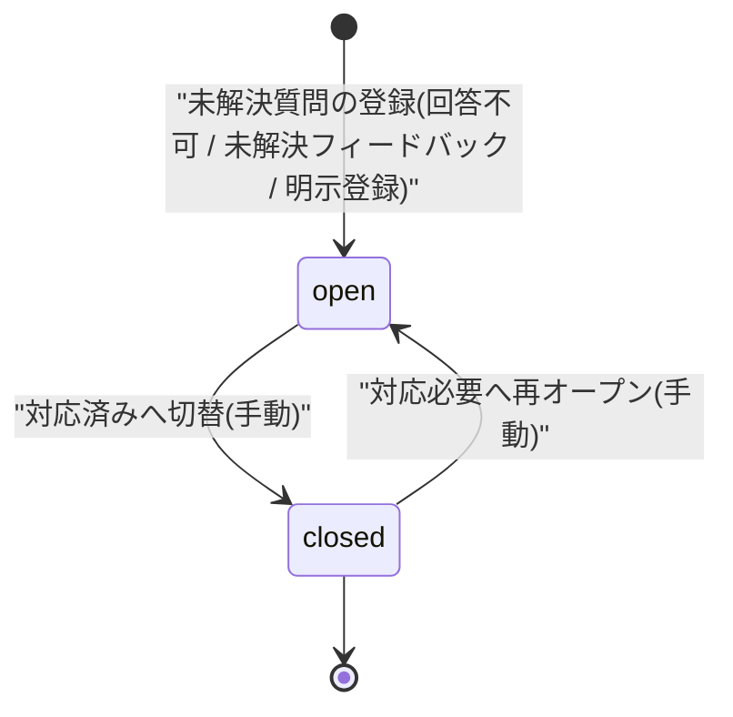

# STS-001: 未解決質問 状態遷移

> **この状態遷移図は「未解決質問(`T_INQUIRIES`)の状態と、実装上の遷移契機・ガード条件・更新操作・実行可能ロール・エラー時挙動」を定義します。**

*種別 状態遷移図 ・ ステータス ドラフト*

## 1. 目的

本状態遷移図は、AI が回答できなかった質問や利用者が未解決と申告した質問を追跡・対応する未解決質問(`T_INQUIRIES`)の状態を対象とし、ウィジェットからの登録(`open`)と管理画面での対応完了(`closed`)の分岐・可否判定を実装粒度で支えることを目的とする。状態名・遷移そのものの正本は [状態モデル §4.2](../../02_basic_design/08_state-model.md#42-未解決質問状態) であり、本書はその遷移を実装上いつ・誰が起こし、どのガード条件で成立し、Repository 更新がどう発生するかを詳細化する。

## 2. 対象データ・対象機能

状態を持つ対象データと、その状態が影響する対象機能・関連 ID(業務 UC / 関連 SCR・API・SYS・TBL)を示す。登録は 3 つのウィジェット向け Route Handler が起点となり、状態切替は管理画面の 1 API が担う。

| 対象データ | 対象機能 | 状態を持つ理由 | 状態によって変わる処理 |
|----|----|----|----|
| `T_INQUIRIES`([TBL-017](../../02_basic_design/02_backend/04_database/TBL-017.md#TBL-017)) | 回答不可時の登録([API-038](../../02_basic_design/02_backend/03_apis/API-038.md#API-038))/ 未解決フィードバック登録([API-069](../../02_basic_design/02_backend/03_apis/API-069.md#API-069))/ 明示登録([API-039](../../02_basic_design/02_backend/03_apis/API-039.md#API-039))/ 詳細・状況切替([API-035](../../02_basic_design/02_backend/03_apis/API-035.md#API-035)) | 対応が必要な質問と対応完了した質問を区別し、対応状況を可視化・管理するため | 一覧・ダッシュボードの要対応集計(`open` 新着抽出)・状況切替の許可可否を状態で切り替える |

対象機能の業務文脈は登録側 [UC-049](../../01_requirements/04_business_usecases/UC-049.md#UC-049)・[UC-050](../../01_requirements/04_business_usecases/UC-050.md#UC-050)・[UC-083](../../01_requirements/04_business_usecases/UC-083.md#UC-083)、対応側 [UC-029](../../01_requirements/04_business_usecases/UC-029.md#UC-029)・[UC-030](../../01_requirements/04_business_usecases/UC-030.md#UC-030)・[UC-031](../../01_requirements/04_business_usecases/UC-031.md#UC-031) に対応する。登録の非同期後処理は [SYS-002](../../02_basic_design/02_backend/01_system/SYS-002.md#SYS-002)・[SYS-003](../../02_basic_design/02_backend/01_system/SYS-003.md#SYS-003) が担う。

## 3. 状態一覧

対象データが取りうる状態を [状態モデル §4.2](../../02_basic_design/08_state-model.md#42-未解決質問状態) に一致させて示す。状態値の物理定義(CHECK 制約)は対応テーブルの [`§コード値`](../../02_basic_design/02_backend/04_database/TBL-017.md#コード値区分値) を正本とする。

| 状態ID | 状態名 | 説明 | 初期状態 | 終了状態 | 備考 |
|----|----|----|----|----|----|
| S1 | `open` | [状態モデル §4.2](../../02_basic_design/08_state-model.md#42-未解決質問状態) | ◯ | — | 登録時の既定値([`status` DEFAULT `'open'`](../../02_basic_design/02_backend/04_database/TBL-017.md#カラム定義)) |
| S2 | `closed` | [状態モデル §4.2](../../02_basic_design/08_state-model.md#42-未解決質問状態) | — | — | `open` へ再オープン可(再オープン制限なし・[API-035](../../02_basic_design/02_backend/03_apis/API-035.md#API-035)) |

> [!NOTE]
> **`closed` は業務上の対応完了状態であり、レコードの終端ではない。** `open ↔ closed` は双方向に切り替え可能で、終端(論理削除)は状態値ではなく [`valid`](../../02_basic_design/02_backend/04_database/TBL-017.md#カラム定義)(`1`=有効 / `0`=論理削除)で表す。本書は `status` の遷移のみを対象とする。

## 4. 状態遷移図

対象データの状態遷移を [状態モデル §4.2](../../02_basic_design/08_state-model.md#42-未解決質問状態) と一致させて図示する。登録で `open` に入り、管理画面の手動切替で `open ↔ closed` を双方向に遷移する。

## 5. 状態遷移一覧

各遷移の実装上の契機・ガード条件・更新操作・実行可能ロール・エラー時挙動を示す。登録契機はいずれもウィジェットセッション認証の Route Handler(API)であり、状態切替は利用者セッション(Cookie + CSRF)の管理画面 API が起こす。

| 現在状態 | イベント | 条件 | 次状態 | 実行処理 | 実行可能ロール | エラー時 | 備考 |
|----|----|----|----|----|----|----|----|
| (なし) | 回答不可登録 | AI 判定が未回答理由(`no_faq_match` / `low_confidence` / `contradiction` の 3 値)のいずれか。AI タイムアウト / プロバイダエラー(`ai_unavailable`)は処理エラーで対象外とし登録しない([FR-082](../../01_requirements/02_functional_requirement/02_faq-ai-fr.md#FR-082)) | `open` | 質問ログ記録と同一トランザクションで未解決質問を新規作成し `status` を既定 `'open'` で確定する([API-038](../../02_basic_design/02_backend/03_apis/API-038.md#API-038) P-05・Repository 作成あり) | ウィジェット利用者(ウィジェットセッション) | AI タイムアウト / プロバイダエラーは [ERR-036](../../02_basic_design/05_errors/ERR-036.md#ERR-036)(503)を返し未解決質問を作成しない。DB 書込失敗はエラー識別子付きの [ERR-009](../../02_basic_design/05_errors/ERR-009.md#ERR-009) 体系外の 500 を返しトランザクションをロールバックする | 冪等性は `questionLogId` 基準([API-038](../../02_basic_design/02_backend/03_apis/API-038.md#API-038)) |
| (なし) | 未解決フィードバック登録 | 対象質問ログへのフィードバックが `unhelpful`(役に立たなかった)。`helpful` は登録しない | `open` | 質問ログへ `unhelpful` を記録し、当該質問を未解決質問として新規作成し `status` を既定 `'open'` で確定する(理由コード `user_unresolved`・[API-069](../../02_basic_design/02_backend/03_apis/API-069.md#API-069) P-04・Repository 作成あり) | ウィジェット利用者(ウィジェットセッション) | 必須項目違反・値不正は [ERR-001](../../02_basic_design/05_errors/ERR-001.md#ERR-001)(400)を返し未解決質問を作成しない | 冪等性は `idempotencyKey` 基準([API-069](../../02_basic_design/02_backend/03_apis/API-069.md#API-069)) |
| (なし) | 明示登録 | 対象質問ログが存在する。冪等キーで重複登録を排除する | `open` | 対象質問ログから未解決質問を新規作成し `status` を既定 `'open'` で確定する(チャット部屋は作成しない・[API-039](../../02_basic_design/02_backend/03_apis/API-039.md#API-039) P-03・Repository 作成あり) | ウィジェット利用者(ウィジェットセッション) | 標準エラー体系([エラー設計](../../02_basic_design/05_errors/index.md))に従う。重複要求は冪等キーで既存の登録結果を返す | 冪等性は `idempotencyKey` 基準([API-039](../../02_basic_design/02_backend/03_apis/API-039.md#API-039)) |
| `open` | 対応済みへ切替 | 対象の未解決質問が存在し、要求時点から他操作で変化していない | `closed` | `status` を `closed` へ更新し更新日時を記録する([API-035](../../02_basic_design/02_backend/03_apis/API-035.md#API-035) PATCH・Repository 更新あり)。担当者概念・状態変更履歴の永続化は行わない | オーナー / メンバー(利用者セッション + CSRF) | 対象が他操作で変化していた場合は更新を確定せず最新状況の確認を促す([UC-031](../../01_requirements/04_business_usecases/UC-031.md#UC-031) 例外フロー)。冪等性は `Idempotency-Key` で担保する | FAQ 下書き保存・FAQ 公開に連動して自動遷移しない(連動ロジックなし・手動判断のみ) |
| `closed` | 対応必要へ再オープン | 対象の未解決質問が存在し、要求時点から他操作で変化していない | `open` | `status` を `open` へ更新し更新日時を記録する([API-035](../../02_basic_design/02_backend/03_apis/API-035.md#API-035) PATCH・Repository 更新あり)。再オープン制限なし | オーナー / メンバー(利用者セッション + CSRF) | 対象が他操作で変化していた場合は更新を確定せず最新状況の確認を促す([UC-031](../../01_requirements/04_business_usecases/UC-031.md#UC-031) 例外フロー) | `open ↔ closed` の双方向遷移を許容([API-035](../../02_basic_design/02_backend/03_apis/API-035.md#API-035)) |

> [!NOTE]
> **登録 API はいずれも `open` を既定値として作成し、`closed` で直接作成する経路は存在しない。** `closed` へは登録後の [API-035](../../02_basic_design/02_backend/03_apis/API-035.md#API-035) PATCH による手動切替でのみ到達する。同一切替値の再送は状態を変えず冪等に応答する。

## 6. 状態別の許可操作

状態ごとに許可・禁止する操作と、画面での表示制御を示す。切替はオーナー / メンバーの手動判断でのみ発生し、状態は FAQ 操作から独立して保たれる([UC-031](../../01_requirements/04_business_usecases/UC-031.md#UC-031) 事後条件)。

| 状態 | 許可操作 | 禁止操作 | 表示制御 | 備考 |
|----|----|----|----|----|
| `open` | 詳細閲覧・`closed` への切替(対応済み) | — | 要対応として一覧・ダッシュボード新着(`status='open'` 新着順)に集計・表示する([API-040](../../02_basic_design/02_backend/03_apis/API-040.md#API-040)) | 登録直後の初期状態。切替は手動判断のみ |
| `closed` | 詳細閲覧・`open` への再オープン(対応必要) | — | 要対応集計から除外し、対応済みとして表示する | 再オープン制限なし。終端状態ではない |

> [!NOTE]
> **状態切替はプロジェクトの関係者(オーナー / メンバー)のみ行える。** 割当なし・部外者の除外(境界判定)と操作権限の可否は権限設計を正本とし、本書では業務ロールの範囲のみを示す。閲覧・切替はいずれも当該プロジェクトへの有効な関係者に限る([UC-029](../../01_requirements/04_business_usecases/UC-029.md#UC-029)・[UC-031](../../01_requirements/04_business_usecases/UC-031.md#UC-031) 事前条件)。

## 7. 後続工程への引き継ぎ事項

テスト設計・詳細設計へ引き継ぐ観点(境界となる遷移・並行遷移時の競合・冪等性・異常系での状態確定)を示す。登録 3 経路の初期状態確定と、切替 API の双方向遷移・競合制御が主要な検証観点である。

| 引き継ぎ先 | 観点 | 内容 |
|----|----|----|
| テスト設計 | 遷移網羅 | 登録 3 経路(回答不可 / 未解決フィードバック / 明示登録)が `open` を確定すること、`open ↔ closed` の双方向切替、`ai_unavailable` 時に未解決質問を作成しないこと(禁止遷移)を検証観点として引き継ぐ |
| テスト設計 | 境界・異常系での状態確定 | 回答不可登録は質問ログと同一トランザクションで作成され、DB 書込失敗時にロールバックして未解決質問が残らないこと、AI タイムアウト / プロバイダエラー時に `open` を作成しないことを検証する |
| テスト設計 | 冪等性 | 登録 API の冪等キー(`questionLogId` / `idempotencyKey`)再送と、切替 API の同一値 PATCH 再送が状態を二重に変えないことを検証する |
| 詳細設計 | 競合制御 | 状況切替時に対象が他操作で変化していた場合の楽観的排他(要求時点との差分検出・最新確認の促し)の実装方針を委ねる |
| 詳細設計 | トランザクション境界 | 回答不可登録の質問ログ + 未解決質問の同一トランザクション化と、`open` 確定の原子性の実装方針を委ねる |
