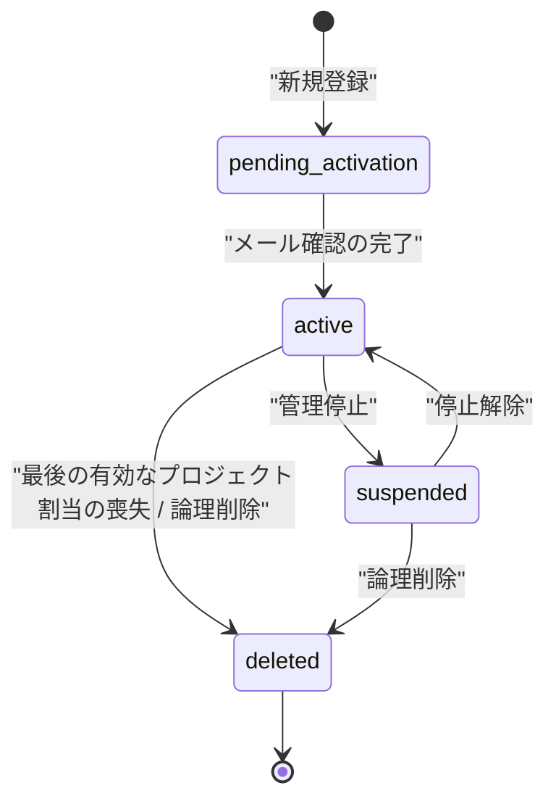

# STS-002: アカウント状態遷移

> **この状態遷移図は「アカウント(`M_USER`)の状態と、実装上の遷移契機・ガード条件・更新操作・実行可能ロール・エラー時挙動」を定義します。**

*種別 状態遷移図 ・ ステータス ドラフト*

## 1. 目的

本状態遷移図は、ログイン・機能利用の可否を左右するアカウント(`M_USER`)の状態を対象とし、新規登録直後の確認待ちから有効化・論理削除に至る分岐・可否判定を実装粒度で支えることを目的とする。状態名・遷移そのものの正本は [状態モデル §1](../../02_basic_design/08_state-model.md#1-アカウント状態) であり、本書はその遷移を実装上いつ・誰が起こし、どのガード条件で成立し、Repository 更新がどう発生するかを詳細化する。

## 2. 対象データ・対象機能

状態を持つ対象データと、その状態が影響する対象機能・関連 ID(業務 UC / 関連 SCR・API・SYS・TBL)を示す。有効化は新規登録の確認導線が起点、遷移は割当喪失に伴うシステム処理が起点となる。

| 対象データ | 対象機能 | 状態を持つ理由 | 状態によって変わる処理 |
|----|----|----|----|
| `M_USER`([TBL-001](../../02_basic_design/02_backend/04_database/TBL-001.md#TBL-001)) | 新規登録・メール確認([API-001](../../02_basic_design/02_backend/03_apis/API-001.md#API-001)・[API-006](../../02_basic_design/02_backend/03_apis/API-006.md#API-006))/ 招待受諾([API-008](../../02_basic_design/02_backend/03_apis/API-008.md#API-008))/ ログイン([API-002](../../02_basic_design/02_backend/03_apis/API-002.md#API-002))/ プロジェクト割当解除に伴うアカウント無効化([API-023](../../02_basic_design/02_backend/03_apis/API-023.md#API-023)) | ログイン許可・機能利用の可否をアカウント状態で制御するため | 状態に応じてログイン許可・メール確認導線の要否・機能停止・一覧除外を切り替える |

対象機能の業務文脈は [UC-002](../../01_requirements/04_business_usecases/UC-002.md#UC-002)(新規登録)・[UC-003](../../01_requirements/04_business_usecases/UC-003.md#UC-003)(登録確認メール検証)・[UC-006](../../01_requirements/04_business_usecases/UC-006.md#UC-006)(招待受諾)・[UC-021](../../01_requirements/04_business_usecases/UC-021.md#UC-021)(メンバー割当解除に伴うアカウント利用停止)に対応する。ログイン時のセッション失効判定・重要操作の再認証は [SYS-028](../../02_basic_design/02_backend/01_system/SYS-028.md#SYS-028)、ログイン失敗ロックアウトは [SYS-029](../../02_basic_design/02_backend/01_system/SYS-029.md#SYS-029)、認証関連通知のオプトアウト不可送信は [SYS-006](../../02_basic_design/02_backend/01_system/SYS-006.md#SYS-006) が担う。

## 3. 状態一覧

対象データが取りうる状態を [状態モデル §1](../../02_basic_design/08_state-model.md#1-アカウント状態) に一致させて示す。状態値の物理定義(CHECK 制約)は対応テーブルの [`§コード値`](../../02_basic_design/02_backend/04_database/TBL-001.md#コード値) を正本とする。

| 状態ID | 状態名 | 説明 | 初期状態 | 終了状態 | 備考 |
|----|----|----|----|----|----|
| S1 | `pending_activation` | [状態モデル §1](../../02_basic_design/08_state-model.md#1-アカウント状態) | ◯ | — | 新規登録([API-001](../../02_basic_design/02_backend/03_apis/API-001.md#API-001) P-02)時点の初期状態。列 DEFAULT は `'active'`([`status`](../../02_basic_design/02_backend/04_database/TBL-001.md#カラム定義))のため、`pending_activation` での確定方法は詳細設計に委ねる |
| S2 | `active` | [状態モデル §1](../../02_basic_design/08_state-model.md#1-アカウント状態) | — | — | — |
| S3 | `suspended` | [状態モデル §1](../../02_basic_design/08_state-model.md#1-アカウント状態) | — | — | 本書で扱う実装済み遷移契機は確認できない(§7 参照) |
| S4 | `deleted` | [状態モデル §1](../../02_basic_design/08_state-model.md#1-アカウント状態) | — | ◯ | 論理削除。`deleted_at` を記録([TBL-001](../../02_basic_design/02_backend/04_database/TBL-001.md#カラム定義)) |

> [!NOTE]
> **`suspended` は状態モデル・物理定義(CHECK 制約)上は存在するが、本リポジトリの API/SYS 設計に `M_USER.status` を `suspended` へ遷移させる実装済みの契機は見当たらない。** 課金アカウント(`M_BILLING_ACCOUNT.status='suspended'`。[状態モデル §2](../../02_basic_design/08_state-model.md#2-課金アカウント状態))のサスペンションとは別軸であり、本書では両者を混同せず `M_USER.status` のみを対象とする。詳細は §7 で課題化する。

## 4. 状態遷移図

対象データの状態遷移を [状態モデル §1](../../02_basic_design/08_state-model.md#1-アカウント状態) と一致させて図示する。本書が実装契機を特定できた遷移は実線相当の遷移として示し、契機未特定の `suspended` 関連遷移も状態モデルとの一致のため図には残す。

## 5. 状態遷移一覧

各遷移の実装上の契機・ガード条件・更新操作・実行可能ロール・エラー時挙動を示す。メンバー招待は登録済みユーザー限定のため、招待受諾自体はアカウント状態を遷移させない([API-021](../../02_basic_design/02_backend/03_apis/API-021.md#API-021) は招待先メールに一致する既存 `M_USER` を要求し、未登録メールは拒否する)。

| 現在状態 | イベント | 条件 | 次状態 | 実行処理 | 実行可能ロール | エラー時 | 備考 |
|----|----|----|----|----|----|----|----|
| (なし) | 新規登録 | 入力値(表示名・メール形式・パスワード強度・規約 / プライバシー同意)が検証を通過し、メール重複がない | `pending_activation` | `M_USER` を新規作成し `status` を `pending_activation` で確定する(Repository 作成あり。[API-001](../../02_basic_design/02_backend/03_apis/API-001.md#API-001) P-02) | 未認証(申込者本人) | メール重複は [ERR-014](../../02_basic_design/05_errors/ERR-014.md#ERR-014)(409)、入力検証エラーは [ERR-001](../../02_basic_design/05_errors/ERR-001.md#ERR-001)(400)を返し `M_USER` を作成しない | 冪等性は `Idempotency-Key` で担保([API-001](../../02_basic_design/02_backend/03_apis/API-001.md#API-001)) |
| `pending_activation` | メール確認完了 | メール確認トークンが有効(期限内・未使用)で対象アカウントに一致する | `active` | 対象アカウントのメールアドレスを確認済みにし、確認トークンを使用済みにする(Repository 更新あり。[API-006](../../02_basic_design/02_backend/03_apis/API-006.md#API-006) P-02〜P-03) | 未認証(申込者本人。トークンで本人性を担保) | トークン期限切れは [ERR-006](../../02_basic_design/05_errors/ERR-006.md#ERR-006)(410)、使用済みは [ERR-007](../../02_basic_design/05_errors/ERR-007.md#ERR-007)(410)、トークン不在は [ERR-008](../../02_basic_design/05_errors/ERR-008.md#ERR-008)(404)を返し状態は変えない | 確認メール再送は既存未使用トークンを失効し新規発行する([API-001](../../02_basic_design/02_backend/03_apis/API-001.md#API-001) P-06) |
| `active` | 最後の有効なプロジェクト割当の喪失 | プロジェクト割当解除の結果、当該ユーザーが有効な割当(`M_PRJ_USERS.valid=1`)を持つ他プロジェクトが 0 件になる | `deleted` | 対象プロジェクトの割当を論理削除(`valid=0`)したうえで、当該アカウントを論理削除する。あわせて当該ユーザーの全有効セッションを失効し、未使用の招待トークンを失効する(Repository 更新あり。[API-023](../../02_basic_design/02_backend/03_apis/API-023.md#API-023) P-03〜P-04) | オーナー / メンバー(操作実行者。対象は割当解除される本人ではない) | 対象が自分自身またはオーナーの場合は [ERR-021](../../02_basic_design/05_errors/ERR-021.md#ERR-021)(403)/ [ERR-022](../../02_basic_design/05_errors/ERR-022.md#ERR-022)(403)を返し遷移しない。再認証未充足は [ERR-013](../../02_basic_design/05_errors/ERR-013.md#ERR-013)(401) | 他プロジェクトに有効割当が残る場合は割当解除のみでアカウント状態は `active` を維持する([API-023](../../02_basic_design/02_backend/03_apis/API-023.md#API-023) レスポンス `accountDeactivated` で無効化有無を返す) |
| `pending_activation` / `active` | ログイン試行 | メール / パスワードが一致し、ロック中でない | (状態は変えない) | ログイン失敗が続けて規定回数へ達するとロックし(状態値ではなく `login_failed_count` / `locked_until` で管理)、成功時は失敗回数を 0 へ初期化する([RULE-001](../../01_requirements/01_business_requirement/08_rule.md#RULE-001)。[SYS-029](../../02_basic_design/02_backend/01_system/SYS-029.md#SYS-029) PR-01〜PR-08。Repository 更新あり) | 本人 | ロック中は [ERR-003](../../02_basic_design/05_errors/ERR-003.md#ERR-003)(423)を返し認証しない。認証情報不一致は [ERR-002](../../02_basic_design/05_errors/ERR-002.md#ERR-002)(401) | ロックアウトは `status` の遷移ではなく `login_failed_count` / `locked_until` の更新で表す([TBL-001](../../02_basic_design/02_backend/04_database/TBL-001.md#カラム定義))。ロック解除後は再受付する([SYS-029](../../02_basic_design/02_backend/01_system/SYS-029.md#SYS-029) PR-07) |

> [!NOTE]
> **`active → suspended`(管理停止)・`suspended → active`(停止解除)・`suspended → deleted` の 3 遷移は、状態モデル・CHECK 制約上は定義されているが、本書が参照した基本設計(API/SYS)の範囲では実行契機(操作 API・システム処理)を特定できなかった。** 推測で契機を補わず、§7 で課題化する。

## 6. 状態別の許可操作

状態ごとに許可・禁止する操作と、画面での表示制御を示す。

| 状態 | 許可操作 | 禁止操作 | 表示制御 | 備考 |
|----|----|----|----|----|
| `pending_activation` | メール確認完了・確認メール再送 | ログイン・一般機能利用 | メール確認待ちの案内を表示する | ログイン試行は認証情報が一致しても `active` へ遷移していない限り機能利用に進めない([API-001](../../02_basic_design/02_backend/03_apis/API-001.md#API-001)・[API-006](../../02_basic_design/02_backend/03_apis/API-006.md#API-006) の範囲) |
| `active` | 全機能(自身が関与するプロジェクトの範囲) | — | 通常表示 | セッション有効性・重要操作の再認証要否は [SYS-028](../../02_basic_design/02_backend/01_system/SYS-028.md#SYS-028) が判定する |
| `suspended` | — | — | — | 本書が特定した実装済み遷移契機がないため、状態別の許可操作は基本設計上未定義(§7 参照) |
| `deleted` | — | ログイン・一般機能利用 | 一覧・操作対象から除外する | 保持期間中の請求情報閲覧は `M_BILLING_ACCOUNT.status='withdrawn'`([状態モデル §2](../../02_basic_design/08_state-model.md#2-課金アカウント状態))の別軸で許可されるものであり、`M_USER.status='deleted'` とは連動しない。本書では `M_USER.status` のみを扱う |

## 7. 後続工程への引き継ぎ事項

テスト設計・詳細設計へ引き継ぐ観点(境界となる遷移・並行遷移時の競合・冪等性・異常系での状態確定)を示す。

| 引き継ぎ先 | 観点 | 内容 |
|----|----|----|
| テスト設計 | 遷移網羅 | `pending_activation → active`(メール確認)・`active → deleted`(最後の割当喪失)の 2 遷移と、確認トークンの期限切れ / 使用済み / 不在の各異常系を検証観点として引き継ぐ |
| テスト設計 | 境界・異常系での状態確定 | 最後の有効割当喪失時に、割当の論理削除・アカウントの `deleted` 更新・全セッション失効・未使用招待トークン失効が単一トランザクションで確定し、途中失敗時にいずれも反映されないことを検証する |
| テスト設計 | 冪等性 | 新規登録・メール確認再送の `Idempotency-Key` 再送、割当解除の再送が状態を二重に変えないことを検証する |
| 詳細設計 | `suspended` 遷移契機の確定 | `active ⇄ suspended` および `suspended → deleted` を発動する運用管理者操作・API・実行可能ロール・ガード条件・エラー時挙動が基本設計に未定義のため、追加要件として起票し確定させる(本書では推測で補わない) |
| 詳細設計 | 割当解除経路の状態遷移実装 | `active → deleted` を、プロジェクト削除に伴う一括割当解除経路([API-018](../../02_basic_design/02_backend/03_apis/API-018.md#API-018)・[UC-073](../../01_requirements/04_business_usecases/UC-073.md#UC-073))でも同一のガード条件(最後の有効割当喪失)で適用する実装方針を委ねる |
| 詳細設計 | 競合制御 | 同一アカウントへの並行割当解除(複数プロジェクトから同時に外される場合)時の楽観ロック・冪等性の実装方針を委ねる |
