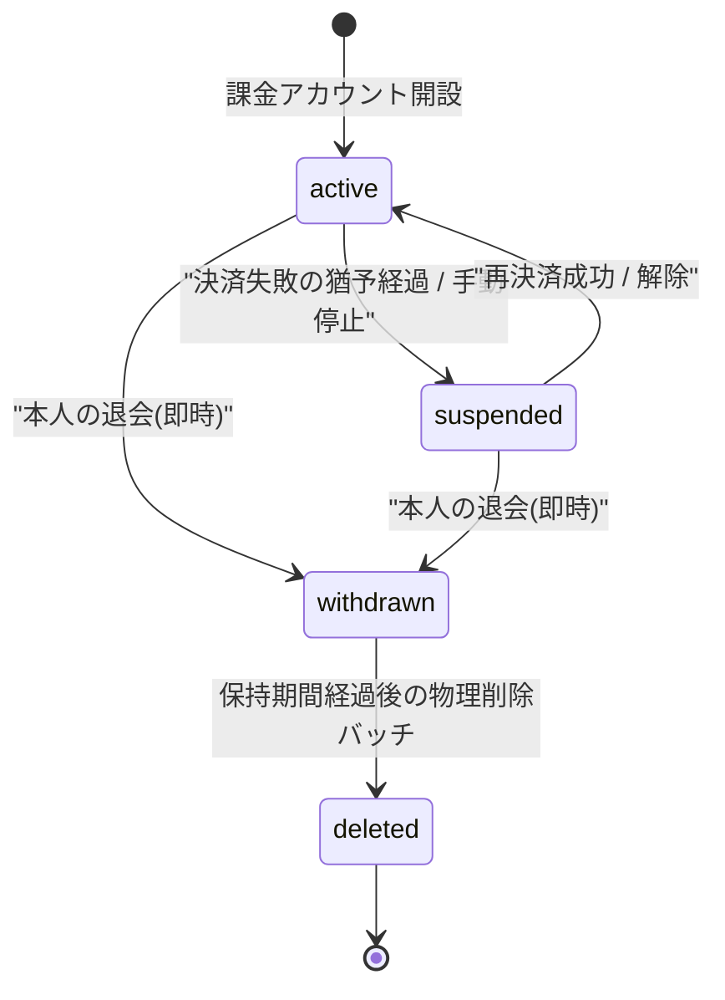

# STS-003: 課金アカウント状態遷移

> **この状態遷移図は「課金アカウント(`M_BILLING_ACCOUNT`)の状態と、実装上の遷移契機・ガード条件・更新操作・実行可能ロール・エラー時挙動」を定義します。**

*種別 状態遷移図 ・ ステータス ドラフト*

## 1. 目的

本状態遷移図は、ユーザー単位で課金・請求を束ねる課金アカウント(`M_BILLING_ACCOUNT`)の状態を対象とし、決済失敗猶予からのサスペンション移行・退会・保持期間経過後の削除確定という分岐・可否判定を実装粒度で支えることを目的とする。状態名・遷移そのものの正本は [状態モデル §2](../../02_basic_design/08_state-model.md#2-課金アカウント状態) であり、遷移条件は [課金・請求設計 §5](../../02_basic_design/05_billing-design.md#5-課金アカウント状態ライフサイクル) を正本とする。本書はこれらを実装上いつ・誰が起こし、どのガード条件で成立し、Repository 更新がどう発生するかを詳細化する。

## 2. 対象データ・対象機能

状態を持つ対象データと、その状態が影響する対象機能・関連 ID(業務 UC / 関連 SCR・API・SYS・TBL)を示す。サスペンション移行・復帰は Webhook 受信と定期監視が起点となり、退会は利用者本人の API 操作、削除確定はバッチが担う。

| 対象データ | 対象機能 | 状態を持つ理由 | 状態によって変わる処理 |
|----|----|----|----|
| `M_BILLING_ACCOUNT`([TBL-002](../../02_basic_design/02_backend/04_database/TBL-002.md#TBL-002)) | 決済失敗猶予・サスペンション移行([SYS-020](../../02_basic_design/02_backend/01_system/SYS-020.md#SYS-020))/ 課金プロバイダ通知受信・取込([SYS-004](../../02_basic_design/02_backend/01_system/SYS-004.md#SYS-004))/ 支払方法登録・更新([API-045](../../02_basic_design/02_backend/03_apis/API-045.md#API-045))/ アカウント退会([API-056](../../02_basic_design/02_backend/03_apis/API-056.md#API-056))/ 保持期間経過アカウントの物理削除([SYS-034](../../02_basic_design/02_backend/01_system/SYS-034.md#SYS-034)) | 課金・請求の利用可否と、当該オーナーが作成したプロジェクトのウィジェット応答可否を状態で制御するため | 管理画面の操作範囲(全機能 / 課金・退会のみ / 請求閲覧のみ / ログイン不可)とウィジェット応答(通常 / 機能停止)を状態に応じて切り替える |

対象機能の業務文脈は決済失敗・猶予・サスペンション移行 [UC-055](../../01_requirements/04_business_usecases/UC-055.md#UC-055)、課金プロバイダ通知の受信・反映 [UC-056](../../01_requirements/04_business_usecases/UC-056.md#UC-056)、本人による退会 [UC-022](../../01_requirements/04_business_usecases/UC-022.md#UC-022)、退会済みユーザーの請求情報閲覧 [UC-081](../../01_requirements/04_business_usecases/UC-081.md#UC-081)、保持期間・猶予に応じた物理削除 [UC-066](../../01_requirements/04_business_usecases/UC-066.md#UC-066) に対応する。

## 3. 状態一覧

対象データが取りうる状態を [状態モデル §2](../../02_basic_design/08_state-model.md#2-課金アカウント状態) に一致させて示す。状態値の物理定義(CHECK 制約)は [`M_BILLING_ACCOUNT` §コード値](../../02_basic_design/02_backend/04_database/TBL-002.md#コード値) を正本とする。

| 状態ID | 状態名 | 説明 | 初期状態 | 終了状態 | 備考 |
|----|----|----|----|----|----|
| S1 | `active` | [状態モデル §2](../../02_basic_design/08_state-model.md#2-課金アカウント状態) | ◯ | — | 課金アカウント開設時の既定値([`status` DEFAULT `'active'`](../../02_basic_design/02_backend/04_database/TBL-002.md#カラム定義)) |
| S2 | `suspended` | [状態モデル §2](../../02_basic_design/08_state-model.md#2-課金アカウント状態) | — | — | `active` へ復帰可(復帰制限なし) |
| S3 | `withdrawn` | [状態モデル §2](../../02_basic_design/08_state-model.md#2-課金アカウント状態) | — | — | 本人の退会で即時到達。復帰・撤回不可 |
| S4 | `deleted` | [状態モデル §2](../../02_basic_design/08_state-model.md#2-課金アカウント状態) | — | ◯ | 保持期間経過後の物理削除バッチで確定。識別子は再利用しない([TBL-002 コード値](../../02_basic_design/02_backend/04_database/TBL-002.md#コード値) `data_deletion_mode` 参照) |

## 4. 状態遷移図

対象データの状態遷移を [状態モデル §2](../../02_basic_design/08_state-model.md#2-課金アカウント状態) と一致させて図示する。決済失敗の猶予経過でサスペンションへ移行し、退会は `active` / `suspended` いずれからも即時に `withdrawn` へ到達する。

## 5. 状態遷移一覧

各遷移の実装上の契機・ガード条件・更新操作・実行可能ロール・エラー時挙動を示す。サスペンション関連の遷移は Webhook(課金プロバイダ通知受信)と Cron Triggers(猶予経過の定期判定)が起こし、退会は利用者セッションの Route Handler、削除確定は Cron Triggers が起こす。

| 現在状態 | イベント | 条件 | 次状態 | 実行処理 | 実行可能ロール | エラー時 | 備考 |
|----|----|----|----|----|----|----|----|
| `active` | 決済失敗確定通知の受信 | 課金プロバイダからの通知の送信元正当性を検証でき、かつ冪等性キー `(provider, event_id)` で未受信(重複でない) | `active`(状態は変えず猶予監視を開始) | 受信時刻を起点に猶予期間の監視を開始する記録を行う(Repository 更新あり・[SYS-004](../../02_basic_design/02_backend/01_system/SYS-004.md#SYS-004) PR-01〜PR-04・[SYS-020](../../02_basic_design/02_backend/01_system/SYS-020.md#SYS-020) PR-01・PR-02)。オーナーへ重要度 critical の支払い通知を送る([SYS-020](../../02_basic_design/02_backend/01_system/SYS-020.md#SYS-020) PR-03) | 外部システム(課金プロバイダ、Webhook 経由) | 署名不正 / 検証失敗は処理せず拒否し状態を変えない。重複受信(処理済みの `event_id`)は冪等にスキップする([SYS-004](../../02_basic_design/02_backend/01_system/SYS-004.md#SYS-004) PR-02) | 猶予期間の具体値は [システム仕様書 §4](../../02_basic_design/07_system-spec.md#4-データ保持期間削除猶予) を正本とする。猶予中も管理画面ログイン・支払方法更新([API-045](../../02_basic_design/02_backend/03_apis/API-045.md#API-045))は許可する |
| `active` | 猶予経過判定(定期起動) | 猶予中の課金アカウントについて、猶予期間([システム仕様書 §4](../../02_basic_design/07_system-spec.md#4-データ保持期間削除猶予))を経過し、かつ再決済が未成立である | `suspended` | `status` を `suspended` へ更新する(Repository 更新あり・[SYS-020](../../02_basic_design/02_backend/01_system/SYS-020.md#SYS-020) PR-04・PR-05)。以後、当該オーナーが作成したプロジェクトのウィジェット応答を機能停止へ切替え、管理画面操作を課金・退会のみへ制限する([PERM-009](../../02_basic_design/04_permissions/PERM-009.md#PERM-009)) | Cron Triggers(定期監視) | 猶予経過前・再決済成立済みの場合は移行せず正常終了する([SYS-020](../../02_basic_design/02_backend/01_system/SYS-020.md#SYS-020) PR-04 判定) | 手動停止による `active → suspended` は運用管理者操作を契機とする業務方針のみが基本設計上示され、実行系(API/画面)の記載は確認できていない(課題候補) |
| `suspended` | 再決済成功 / 解除の通知受信 | 課金プロバイダからの通知の送信元正当性を検証でき、かつ冪等性キー `(provider, event_id)` で未受信 | `active` | `status` を `active` へ即時復帰させる(Repository 更新あり・[SYS-020](../../02_basic_design/02_backend/01_system/SYS-020.md#SYS-020) PR-06)。以後、ウィジェット応答・管理画面操作範囲を通常へ戻す | 外部システム(課金プロバイダ、Webhook 経由) | 署名不正 / 検証失敗は処理せず拒否し状態を変えない。重複受信は冪等にスキップする([SYS-004](../../02_basic_design/02_backend/01_system/SYS-004.md#SYS-004) PR-02) | 猶予中 / サスペンション中いずれからも同一契機で `active` へ復帰する([課金・請求設計 §5.1](../../02_basic_design/05_billing-design.md#51-決済失敗からサスペンションへ)) |
| `active` | 本人の退会 | 再認証トークンが有効。退会確認入力(`confirmEmail`)がアカウントのメールアドレスと完全一致する。課金アカウント状態が未だ `withdrawn` / `deleted` でない | `withdrawn` | 同一操作内で、本人がメンバー参加するプロジェクトの割当を解除し、本人がオーナーであるプロジェクトを削除(運用停止)へ遷移させたうえで `status` を `withdrawn` へ更新し `withdrawn_at` を記録する(Repository 更新あり・[API-056](../../02_basic_design/02_backend/03_apis/API-056.md#API-056) P-02〜P-06)。運用データ削除は [SYS-027](../../02_basic_design/02_backend/01_system/SYS-027.md#SYS-027) を起動して行う(API-056 P-07) | 本人(利用者セッション + CSRF + 再認証) | `confirmEmail` 不一致は [ERR-001](../../02_basic_design/05_errors/ERR-001.md#ERR-001)(400)を返し状態を変えない。既に `withdrawn` / `deleted` の場合は重複退会として 409 を返す([API-056](../../02_basic_design/02_backend/03_apis/API-056.md#API-056) P-03) | 猶予なく即時成立。撤回・取消の経路は持たない([課金・請求設計 §5.2](../../02_basic_design/05_billing-design.md#52-退会から削除へ)) |
| `suspended` | 本人の退会 | `active` からの退会条件と同一(再認証・メール一致・未退会) | `withdrawn` | `active` からの退会と同一の実行処理(Repository 更新あり・[API-056](../../02_basic_design/02_backend/03_apis/API-056.md#API-056)) | 本人(利用者セッション + CSRF + 再認証。サスペンション中でも退会は許可される操作範囲・[PERM-009](../../02_basic_design/04_permissions/PERM-009.md#PERM-009)) | `active` からの退会と同一 | サスペンション中でも課金・退会のみは操作可([PERM-009](../../02_basic_design/04_permissions/PERM-009.md#PERM-009)) |
| `withdrawn` | 保持期間経過(定期起動) | 退会日時 `withdrawn_at` を起点に保持期間([システム仕様書 §4](../../02_basic_design/07_system-spec.md#4-データ保持期間削除猶予))を経過している | `deleted` | 課金・請求従属データ(サブスクリプション・請求書・課金 Webhook 受信ログ・退会記録)と認証従属データを依存順に物理削除したのち、`status` を `deleted` へ更新して識別子非再利用の最小限のトムストーンとして残す(Repository 更新あり・[SYS-034](../../02_basic_design/02_backend/01_system/SYS-034.md#SYS-034) PR-02〜PR-04) | Cron Triggers(定期バッチ) | 保持期間未経過の課金アカウントは対象から除外し移行しない。処理途中の失敗時の状態確定順序(Tx境界)は詳細設計へ引き継ぐ(§7) | 削除内容は監査記録として残す([SYS-034](../../02_basic_design/02_backend/01_system/SYS-034.md#SYS-034) PR-05) |

> [!NOTE]
> **`withdrawn` は復帰不可の終端手前状態である。** `withdrawn → active` の経路は持たず、`withdrawn` からは保持期間経過による `deleted` への一方向遷移のみが定義される([課金・請求設計 §5.2](../../02_basic_design/05_billing-design.md#52-退会から削除へ))。

## 6. 状態別の許可操作

状態ごとに許可・禁止する操作と、画面での表示制御を示す。操作範囲の正本は [PERM-009](../../02_basic_design/04_permissions/PERM-009.md#PERM-009)、状態別のウィジェット応答は [課金・請求設計 §5](../../02_basic_design/05_billing-design.md#5-課金アカウント状態ライフサイクル) を参照する。

| 状態 | 許可操作 | 禁止操作 | 表示制御 | 備考 |
|----|----|----|----|----|
| `active` | 全機能 | — | 通常表示・ウィジェット通常応答 | — |
| `suspended` | 課金情報確認 / 退会 | それ以外の管理画面操作(403) | 制限バナー・支払い回復導線を表示。当該オーナーが作成したプロジェクトのウィジェットは機能停止応答を返す(該当エラーは [ERR-004](../../02_basic_design/05_errors/ERR-004.md#ERR-004)) | 当該オーナーのプロジェクトに参加するメンバーの操作も制限を受ける([PERM-009](../../02_basic_design/04_permissions/PERM-009.md#PERM-009)) |
| `withdrawn` | ログイン / 請求情報の閲覧([API-043](../../02_basic_design/02_backend/03_apis/API-043.md#API-043)・[API-044](../../02_basic_design/02_backend/03_apis/API-044.md#API-044)) | 請求閲覧以外の操作・新規書込(403) | 請求情報のみ表示。ウィジェットは停止 | 保持期間中は本人のみログイン可([UC-081](../../01_requirements/04_business_usecases/UC-081.md#UC-081)) |
| `deleted` | — | ログイン(不可) | 一覧・操作対象から除外 | 識別子は再利用しない |

## 7. 後続工程への引き継ぎ事項

テスト設計・詳細設計へ引き継ぐ観点(境界となる遷移・並行遷移時の競合・冪等性・異常系での状態確定など)を示す。Webhook 経由の状態更新とバッチによる削除確定が主要な検証観点である。

| 引き継ぎ先 | 観点 | 内容 |
|----|----|----|
| テスト設計 | 遷移網羅 | `active ↔ suspended` の双方向遷移、`active`/`suspended → withdrawn` の即時遷移、`withdrawn → deleted` の一方向遷移、`withdrawn → active` が存在しないこと(禁止遷移)を検証観点として引き継ぐ |
| テスト設計 | 冪等性 | 課金プロバイダ通知の冪等性キー `(provider, event_id)` による重複受信スキップが、猶予監視開始・サスペンション移行・復帰のいずれの遷移でも状態を二重に変えないことを検証する |
| テスト設計 | 境界・異常系での状態確定 | 猶予経過ちょうどの境界値判定、退会 API の `confirmEmail` 不一致・重複退会時に状態が変化しないこと、SYS-034 の削除処理途中失敗時に `deleted` を確定しないことを検証する |
| 詳細設計 | 競合制御 | 猶予経過の定期判定とサスペンション解除通知が同時に到達した場合の整合(復帰を優先する順序)の実装方針を委ねる |
| 詳細設計 | トランザクション境界 | API-056(退会)におけるメンバー割当解除・オーナープロジェクト削除・課金アカウント `withdrawn` 更新の同一操作内での原子性、および SYS-034 における課金・請求従属削除 → 認証従属削除 → 課金アカウント `deleted` 確定の Tx 境界の実装方針を委ねる |
| 詳細設計 | 手動停止の実行系 | `active → suspended` の「手動停止」契機を起こす具体的な運用管理者向け API・画面の詳細化を委ねる(基本設計では業務方針のみを保持) |
