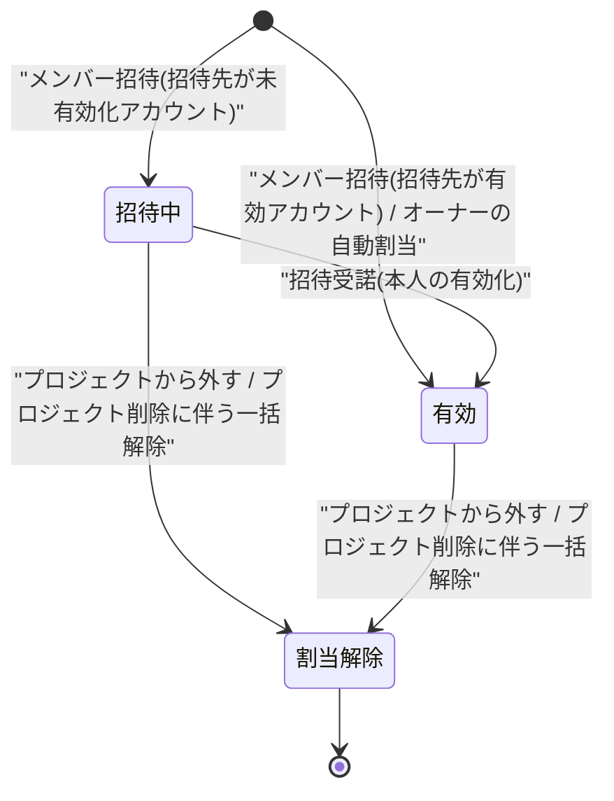

# STS-004: メンバー割当状態遷移

> **この状態遷移図は「メンバー割当(ユーザー × プロジェクト)の状態と、実装上の遷移契機・ガード条件・更新操作・実行可能ロール・エラー時挙動」を定義します。**

*種別 状態遷移図 ・ ステータス ドラフト*

## 1. 目的

本状態遷移図は、プロジェクトへメンバーを迎え入れるメンバー招待([UC-019](../../01_requirements/04_business_usecases/UC-019.md#UC-019))から、既存ユーザーの受諾([UC-006](../../01_requirements/04_business_usecases/UC-006.md#UC-006))・プロジェクトから外す操作([UC-021](../../01_requirements/04_business_usecases/UC-021.md#UC-021))・プロジェクト削除に伴う一括解除([UC-073](../../01_requirements/04_business_usecases/UC-073.md#UC-073))までを対象とし、招待中・有効・割当解除の判定と可否を実装粒度で支えることを目的とする。状態名・遷移そのものの正本は [状態モデル §3](../../02_basic_design/08_state-model.md#3-メンバー割当状態) であり、本書はその遷移を実装上いつ・誰が起こし、どのガード条件で成立し、Repository 更新がどう発生するかを詳細化する。

## 2. 対象データ・対象機能

メンバー割当は単一テーブルの単一カラムでは表せない合成状態であり、招待状態は被招待ユーザーの `M_USER.status`、割当そのものの有効・無効は `M_PRJ_USERS.valid` の 2 軸で持つ。両者を合成した状態が影響する対象機能・関連 ID(業務 UC / 関連 API・TBL)を示す。

| 対象データ | 対象機能 | 状態を持つ理由 | 状態によって変わる処理 |
|----|----|----|----|
| `M_PRJ_USERS.valid`([TBL-003](../../02_basic_design/02_backend/04_database/TBL-003.md#TBL-003))+ `M_USER.status`([TBL-001](../../02_basic_design/02_backend/04_database/TBL-001.md#TBL-001)、招待された本人分) | メンバー招待([API-021](../../02_basic_design/02_backend/03_apis/API-021.md#API-021))/ 招待受諾([API-008](../../02_basic_design/02_backend/03_apis/API-008.md#API-008))/ 招待メール再送([API-024](../../02_basic_design/02_backend/03_apis/API-024.md#API-024))/ プロジェクト割当解除([API-023](../../02_basic_design/02_backend/03_apis/API-023.md#API-023))/ プロジェクト削除に伴う一括解除([SYS-010](../../02_basic_design/02_backend/01_system/SYS-010.md#SYS-010)) | 招待済み・有効化待ちのメンバーと、当該プロジェクトを実際に利用できる有効なメンバーを区別し、一覧表示・担当割当・通知宛先の対象範囲を制御するため | メンバー一覧の状態フィルタ([API-020](../../02_basic_design/02_backend/03_apis/API-020.md#API-020))・招待メール再送の可否・プロジェクト操作権限([UC-021](../../01_requirements/04_business_usecases/UC-021.md#UC-021) 事前条件)・最後の有効な割当喪失時のアカウント利用停止判定を状態で切り替える |

対象機能の業務文脈は招待側 [UC-019](../../01_requirements/04_business_usecases/UC-019.md#UC-019)、受諾側 [UC-006](../../01_requirements/04_business_usecases/UC-006.md#UC-006)、解除側 [UC-021](../../01_requirements/04_business_usecases/UC-021.md#UC-021)、削除連鎖側 [UC-073](../../01_requirements/04_business_usecases/UC-073.md#UC-073) に対応する。プロジェクト削除に伴う一括解除の後続処理は [SYS-010](../../02_basic_design/02_backend/01_system/SYS-010.md#SYS-010) が担う。

## 3. 状態一覧

対象データが取りうる状態を [状態モデル §3](../../02_basic_design/08_state-model.md#3-メンバー割当状態) に一致させて示す。状態値の物理定義(CHECK 制約)は [`M_PRJ_USERS`](../../02_basic_design/02_backend/04_database/TBL-003.md#カラム定義) の `valid` および [`M_USER`](../../02_basic_design/02_backend/04_database/TBL-001.md#コード値) の `status` を正本とする。

| 状態ID | 状態名 | 説明 | 初期状態 | 終了状態 | 備考 |
|----|----|----|----|----|----|
| S1 | 招待中(`pending_activation`) | [状態モデル §3](../../02_basic_design/08_state-model.md#3-メンバー割当状態) | ◯ | — | `M_PRJ_USERS.valid=1` かつ被招待ユーザーの `M_USER.status='pending_activation'` の合成状態 |
| S2 | 有効(`active`) | [状態モデル §3](../../02_basic_design/08_state-model.md#3-メンバー割当状態) | ◯ | — | `M_PRJ_USERS.valid=1` かつ当該ユーザーの `M_USER.status='active'` の合成状態 |
| S3 | 割当解除(`valid=0`) | [状態モデル §3](../../02_basic_design/08_state-model.md#3-メンバー割当状態) | — | ◯ | `M_PRJ_USERS.valid=0`([`valid` DEFAULT `1`](../../02_basic_design/02_backend/04_database/TBL-003.md#カラム定義)からの更新)。招待中・有効いずれからも到達する終端状態 |

> [!NOTE]
> **本書は `M_PRJ_USERS` × `M_USER` の合成状態を対象とする。** `M_USER.status` 自体が持つ `suspended` / `deleted` 等の遷移(アカウント状態全体)は [状態モデル §1](../../02_basic_design/08_state-model.md#1-アカウント状態) を正本とし、本書では扱わない。本書が対象とするのは「当該プロジェクトの割当」というプロジェクト単位の合成状態のみである。

## 4. 状態遷移図

対象データの状態遷移を [状態モデル §3](../../02_basic_design/08_state-model.md#3-メンバー割当状態) と一致させて図示する。未登録メールは招待できないため([API-021](../../02_basic_design/02_backend/03_apis/API-021.md#API-021) P-02)、招待対象の `M_USER.status` に応じて「招待中」または「有効」のいずれかへ直接入る。

## 5. 状態遷移一覧

各遷移の実装上の契機・ガード条件・更新操作・実行可能ロール・エラー時挙動を示す。招待・受諾はいずれもオーナー / メンバーまたは本人の利用者セッション(Cookie + CSRF)の API が起こし、一括解除はプロジェクト削除に連鎖するシステム処理が起こす。

| 現在状態 | イベント | 条件 | 次状態 | 実行処理 | 実行可能ロール | エラー時 | 備考 |
|----|----|----|----|----|----|----|----|
| (なし) | メンバー招待 | 招待先メールに一致する登録済み `M_USER` が存在し、当該プロジェクトへの既存割当(重複)が無い | 招待先が `pending_activation` なら招待中 / `active` なら有効 | 当該プロジェクトの割当(`M_PRJ_USERS`)を新規作成(`valid=1`)し、招待トークン(`purpose='activation'`)を発行して招待メールを送信する([API-021](../../02_basic_design/02_backend/03_apis/API-021.md#API-021) P-04・Repository 作成あり)。招待先の `M_USER.status` は更新しない(既存値をそのまま合成状態の判定に用いる) | オーナー / メンバー(利用者セッション + CSRF、再認証必須) | 招待先メールが未登録は [ERR-035](../../02_basic_design/05_errors/ERR-035.md#ERR-035)(404)、既存割当ありは [ERR-018](../../02_basic_design/05_errors/ERR-018.md#ERR-018)(409)、再認証未済は [ERR-013](../../02_basic_design/05_errors/ERR-013.md#ERR-013)(401)を返し割当を作成しない | 未登録メールは招待できず、独立サインアップでの先行登録を促す([API-021](../../02_basic_design/02_backend/03_apis/API-021.md#API-021) P-02) |
| 招待中 | 招待受諾 | 招待トークンが期限内・未使用であり、招待先メールがログイン中ユーザーのメールと一致する(本人受諾) | 有効 | 対象プロジェクトへの割当を有効化(`valid=1` へ確定・実質は招待作成時から `valid=1` のため状態変化は被招待ユーザー側の有効化に連動)し、招待トークンを使用済みにする(同一トランザクション・[API-008](../../02_basic_design/02_backend/03_apis/API-008.md#API-008) P-04・P-05・Repository 更新あり) | 招待された本人(利用者セッション) | トークン期限切れは [ERR-006](../../02_basic_design/05_errors/ERR-006.md#ERR-006)(410)、使用済みは [ERR-007](../../02_basic_design/05_errors/ERR-007.md#ERR-007)(410)、宛先不一致は [ERR-030](../../02_basic_design/05_errors/ERR-030.md#ERR-030)(403)を返し状態を変えない | 状態変化の実体は被招待ユーザー本人の `M_USER.status`(`pending_activation` → `active`)側の有効化であり、`M_PRJ_USERS.valid` は招待作成時点から不変(合成状態としてのみ「招待中→有効」に遷移する) |
| 招待中 | 招待メール再送 | 対象が未有効化(`pending_activation`)のメンバーであり、オーナー / 自身は対象外 | 招待中(状態変化なし) | 旧有効化トークンを失効させ、同一の招待先情報で新規トークンを再発行して招待メールを再送する([API-024](../../02_basic_design/02_backend/03_apis/API-024.md#API-024) P-03・P-04・Repository 更新あり) | オーナー / メンバー(利用者セッション + CSRF、再認証必須) | 対象がオーナー / 自身は [ERR-021](../../02_basic_design/05_errors/ERR-021.md#ERR-021)(403)・[ERR-022](../../02_basic_design/05_errors/ERR-022.md#ERR-022)(403)、対象不在は [ERR-017](../../02_basic_design/05_errors/ERR-017.md#ERR-017)(404)を返す | 状態遷移を伴わない操作(トークン再発行のみ) |
| 招待中 / 有効 | プロジェクトから外す | 対象が当該プロジェクトに割り当てられており、対象が自分自身でもオーナーでもない | 割当解除 | 当該プロジェクトの割当を論理削除(`valid=0`)する。他プロジェクトの有効割当が 0 件になる場合はアカウントを論理削除し、全セッション失効と未使用招待トークン失効を行う([API-023](../../02_basic_design/02_backend/03_apis/API-023.md#API-023) P-03・P-04・Repository 更新あり) | オーナー / メンバー(利用者セッション + CSRF、再認証必須) | 対象が自分自身は [ERR-022](../../02_basic_design/05_errors/ERR-022.md#ERR-022)(403)、オーナーは [ERR-021](../../02_basic_design/05_errors/ERR-021.md#ERR-021)(403)、対象不在は [ERR-017](../../02_basic_design/05_errors/ERR-017.md#ERR-017)(404)を返し割当を変えない | 解除対象が実行中の長時間処理を持つ場合は中断せず完了まで待機・保護し、対象データの物理削除はジョブ終端後とする([API-023](../../02_basic_design/02_backend/03_apis/API-023.md#API-023) P-04b) |
| 招待中 / 有効 | プロジェクト削除に伴う一括解除 | 当該プロジェクトの削除が確定している | 割当解除 | 当該プロジェクトに紐づくメンバーの割当を一括で解除(`valid=0`)する。解除後に他プロジェクトへ有効な割当を持たないメンバー(オーナーを除く)は利用できない状態にする([SYS-010](../../02_basic_design/02_backend/01_system/SYS-010.md#SYS-010) PR-02・PR-05・Repository 更新あり) | システム(プロジェクト削除確定に連鎖) | 割当解除の処理に失敗した場合は整合を取り直し、割当・利用状態の不整合を残さない([SYS-010](../../02_basic_design/02_backend/01_system/SYS-010.md#SYS-010) PR-07) | オーナーのアカウントは利用を維持する。当該プロジェクトに他のメンバー割当が存在しない場合は割当解除を行わず削除のみを完了する |

> [!NOTE]
> **「招待中」から「有効」への遷移は `M_PRJ_USERS.valid` の値変化を伴わない。** 招待作成時点で `valid=1` が確定しており、合成状態としての「招待中→有効」は被招待ユーザー本人の `M_USER.status` 側の有効化(招待受諾)にのみ連動する。`M_PRJ_USERS.valid` が値を変えるのは割当解除への遷移のみである。

## 6. 状態別の許可操作

状態ごとに許可・禁止する操作と、画面での表示制御を示す。招待中は当該プロジェクトを利用できず、有効になって初めて業務操作が行える([UC-019](../../01_requirements/04_business_usecases/UC-019.md#UC-019) 目的)。

| 状態 | 許可操作 | 禁止操作 | 表示制御 | 備考 |
|----|----|----|----|----|
| 招待中 | 招待メール再送・プロジェクトから外す | 当該プロジェクトへのログイン後の業務操作 | メンバー一覧で招待状態フィルタ(`pending_activation`)に含め、表示名・参加日を `null` で表示する([API-020](../../02_basic_design/02_backend/03_apis/API-020.md#API-020)) | 招待メール再送はオーナー / 自身を対象外とする |
| 有効 | 当該プロジェクトの業務操作全般・プロジェクトから外す | — | メンバー一覧で有効状態フィルタ(`active`)に含め、表示名・参加日を表示する([API-020](../../02_basic_design/02_backend/03_apis/API-020.md#API-020)) | 当該プロジェクトを実際に利用できる状態 |
| 割当解除 | — | 当該プロジェクトへのすべての操作 | メンバー一覧・一覧集計から除外する | 他プロジェクトに有効な割当が残らないメンバー(オーナーを除く)は連動してアカウント自体も利用できない状態になる |

> [!NOTE]
> **状態変更(招待・再送・解除)はプロジェクトの関係者(オーナー / メンバー)のみ行える。** 割当なし・部外者の除外(境界判定)と操作権限の可否は権限設計を正本とし、本書では業務ロールの範囲のみを示す。招待受諾は招待された本人のみが行える([UC-006](../../01_requirements/04_business_usecases/UC-006.md#UC-006) 事前条件)。

## 7. 後続工程への引き継ぎ事項

テスト設計・詳細設計へ引き継ぐ観点(境界となる遷移・並行遷移時の競合・冪等性・異常系での状態確定)を示す。合成状態の 2 軸(`M_PRJ_USERS.valid` / `M_USER.status`)がずれない整合性検証が主要な観点である。

| 引き継ぎ先 | 観点 | 内容 |
|----|----|----|
| テスト設計 | 遷移網羅 | 招待(招待先が未有効化 / 有効の 2 分岐)・招待受諾・招待メール再送・プロジェクトから外す・プロジェクト削除に伴う一括解除の全遷移と、未登録メール招待・重複割当・自分自身 / オーナーの解除といった禁止遷移を検証観点として引き継ぐ |
| テスト設計 | 合成状態の整合性 | `M_PRJ_USERS.valid` と `M_USER.status` の 2 軸がずれた状態(例: 割当解除済みだが他プロジェクトに有効割当が残りアカウントは維持等)を境界値として検証する |
| テスト設計 | 異常系での状態確定 | 招待受諾のトークン期限切れ・使用済み・宛先不一致時に割当状態を変えないこと、割当解除の失敗時に整合を取り直すこと([SYS-010](../../02_basic_design/02_backend/01_system/SYS-010.md#SYS-010) PR-07)を検証する |
| テスト設計 | 冪等性 | 招待 API・受諾 API・解除 API の `Idempotency-Key` 再送が状態を二重に変えないことを検証する |
| 詳細設計 | 競合制御 | 招待受諾と招待メール再送・プロジェクトから外す操作が同時に発生した場合の楽観的排他・トークン失効順序の実装方針を委ねる |
| 詳細設計 | 連鎖処理の実装方針 | プロジェクト削除に伴う一括解除における、割当解除とアカウント利用停止・長時間処理保護([API-023](../../02_basic_design/02_backend/03_apis/API-023.md#API-023) P-04b)の実行順序・トランザクション境界の実装方針を委ねる |
