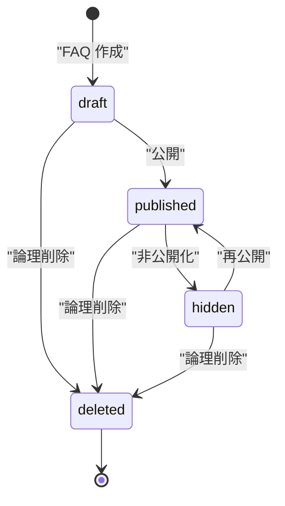

# STS-005: FAQ状態遷移

> **この状態遷移図は「FAQ(`M_FAQS`)の状態と、実装上の遷移契機・ガード条件・更新操作・実行可能ロール・エラー時挙動」を定義します。**

*種別 状態遷移図 ・ ステータス ドラフト*

## 1. 目的

本状態遷移図は、AI 回答の根拠として利用者に提示する FAQ(`M_FAQS`)の状態を対象とし、作成・公開・非公開・削除の分岐・可否判定を実装粒度で支えることを目的とする。状態名・遷移そのものの正本は [状態モデル §4.1](../../02_basic_design/08_state-model.md#41-faq-状態) であり、本書はその遷移を実装上いつ・誰が起こし、どのガード条件で成立し、Repository 更新がどう発生するかを詳細化する。

## 2. 対象データ・対象機能

状態を持つ対象データと、その状態が影響する対象機能・関連 ID(業務 UC / 関連 SCR・API・TBL)を示す。作成・更新・削除は単票 API が、複数件の状態変更は一括 API が担う。

| 対象データ | 対象機能 | 状態を持つ理由 | 状態によって変わる処理 |
|----|----|----|----|
| `M_FAQS`([TBL-006](../../02_basic_design/02_backend/04_database/TBL-006.md#TBL-006)) | FAQ 作成・更新・削除([API-026](../../02_basic_design/02_backend/03_apis/API-026.md#API-026))/ FAQ 一括状態変更([API-027](../../02_basic_design/02_backend/03_apis/API-027.md#API-027)) | AI 回答の根拠として利用者に提示してよい FAQ と、下書き・取り下げ・削除で提示すべきでない FAQ を区別するため | 公開検索・AI 回答候補選定への出現可否([状態モデル §4.1](../../02_basic_design/08_state-model.md#41-faq-状態))を状態で切り替える |

対象機能の業務文脈は [UC-024](../../01_requirements/04_business_usecases/UC-024.md#UC-024)(作成・編集)・[UC-025](../../01_requirements/04_business_usecases/UC-025.md#UC-025)(削除)・[UC-026](../../01_requirements/04_business_usecases/UC-026.md#UC-026)(一括状態変更)に対応する。

## 3. 状態一覧

対象データが取りうる状態を [状態モデル §4.1](../../02_basic_design/08_state-model.md#41-faq-状態) に一致させて示す。状態値の物理定義(CHECK 制約)は対応テーブルの [`§コード値`](../../02_basic_design/02_backend/04_database/TBL-006.md#コード値区分値) を正本とする。

| 状態ID | 状態名 | 説明 | 初期状態 | 終了状態 | 備考 |
|----|----|----|----|----|----|
| S1 | `draft` | [状態モデル §4.1](../../02_basic_design/08_state-model.md#41-faq-状態) | ◯ | — | 作成時の既定値([`status` DEFAULT `'draft'`](../../02_basic_design/02_backend/04_database/TBL-006.md#カラム定義)) |
| S2 | `published` | [状態モデル §4.1](../../02_basic_design/08_state-model.md#41-faq-状態) | — | — | AI 回答候補選定・公開検索の対象([システム仕様書](../../02_basic_design/07_system-spec.md#1-aiしきい値)) |
| S3 | `hidden` | [状態モデル §4.1](../../02_basic_design/08_state-model.md#41-faq-状態) | — | — | `published` へ再公開可 |
| S4 | `deleted` | [状態モデル §4.1](../../02_basic_design/08_state-model.md#41-faq-状態) | — | ◯ | 論理削除。取り消し不可([UC-025](../../01_requirements/04_business_usecases/UC-025.md#UC-025) 事後条件) |

> [!NOTE]
> **`deleted` は状態値であり、有効フラグ [`valid`](../../02_basic_design/02_backend/04_database/TBL-006.md#カラム定義) とは別に管理する。** `M_FAQS` は `status`(業務状態)と `valid`(物理削除前の有効 / 無効フラグ)を両方持つ。削除操作時にどちらをどう更新するかの実装順序は詳細設計(Repository 層)で確定する。物理削除は保持期間経過後に [SYS-027](../../02_basic_design/02_backend/01_system/SYS-027.md#SYS-027) が担う。

## 4. 状態遷移図

対象データの状態遷移を [状態モデル §4.1](../../02_basic_design/08_state-model.md#41-faq-状態) と一致させて図示する。作成で `draft` に入り、`published ↔ hidden` を双方向に遷移し、いずれの状態からも削除で `deleted` へ終端する。

## 5. 状態遷移一覧

各遷移の実装上の契機・ガード条件・更新操作・実行可能ロール・エラー時挙動を示す。作成・単票の状態変更・削除は [API-026](../../02_basic_design/02_backend/03_apis/API-026.md#API-026) が、複数件の一括状態変更は [API-027](../../02_basic_design/02_backend/03_apis/API-027.md#API-027) が起こす。いずれも利用者セッション(Cookie + CSRF)の Route Handler が契機となる。

| 現在状態 | イベント | 条件 | 次状態 | 実行処理 | 実行可能ロール | エラー時 | 備考 |
|----|----|----|----|----|----|----|----|
| (なし) | FAQ 作成 | 質問 500 字・回答 5,000 字以内([API-026](../../02_basic_design/02_backend/03_apis/API-026.md#API-026) P-02)。`draft` 保存時は質問・回答を任意(空可)とする | `draft` | FAQ を新規作成し `status` を既定 `'draft'` で確定する(未解決質問起点の場合は登録元との対応関係も記録・[UC-024](../../01_requirements/04_business_usecases/UC-024.md#UC-024) 事後条件・Repository 作成あり) | オーナー / メンバー(当該プロジェクトの編集権限) | 入力値検証エラーは [ERR-001](../../02_basic_design/05_errors/ERR-001.md#ERR-001)(400)を返し作成しない | — |
| (なし) | FAQ 作成(即時公開) | 質問・回答が必須項目を満たす([API-026](../../02_basic_design/02_backend/03_apis/API-026.md#API-026) P-02) | `published` | FAQ を新規作成し `status` を `'published'` で確定し `publishedAt` を記録する(Repository 作成あり) | オーナー / メンバー(当該プロジェクトの編集権限) | 入力値検証エラーは [ERR-001](../../02_basic_design/05_errors/ERR-001.md#ERR-001)(400)を返し作成しない | 作成時に `published` を直接選択可([API-026](../../02_basic_design/02_backend/03_apis/API-026.md#API-026) Request Body `status`) |
| `draft` | 公開 | 対象 FAQ が存在し `version` が要求時点と一致する。質問・回答が必須項目を満たす([API-026](../../02_basic_design/02_backend/03_apis/API-026.md#API-026) P-02) | `published` | `status` を `'published'` へ更新し `publishedAt` を記録する([API-026](../../02_basic_design/02_backend/03_apis/API-026.md#API-026) P-04・P-05・Repository 更新あり) | オーナー / メンバー(当該プロジェクトの編集権限) | `version` 不一致は [ERR-023](../../02_basic_design/05_errors/ERR-023.md#ERR-023)(409)、必須項目未充足は [ERR-001](../../02_basic_design/05_errors/ERR-001.md#ERR-001)(400)を返し更新しない | 一括変更は [API-027](../../02_basic_design/02_backend/03_apis/API-027.md#API-027) が対象 ID ごとに評価(行単位で成否判定) |
| `published` | 非公開化 | 対象 FAQ が存在し `version` が要求時点と一致する | `hidden` | `status` を `'hidden'` へ更新する(Repository 更新あり) | オーナー / メンバー(当該プロジェクトの編集権限) | `version` 不一致は [ERR-023](../../02_basic_design/05_errors/ERR-023.md#ERR-023)(409)を返し更新しない | 非公開化後は AI 回答候補・公開検索から除外される([状態モデル §4.1](../../02_basic_design/08_state-model.md#41-faq-状態)) |
| `hidden` | 再公開 | 対象 FAQ が存在し `version` が要求時点と一致する。質問・回答が必須項目を満たす([API-026](../../02_basic_design/02_backend/03_apis/API-026.md#API-026) P-02) | `published` | `status` を `'published'` へ更新し `publishedAt` を再記録する(Repository 更新あり) | オーナー / メンバー(当該プロジェクトの編集権限) | `version` 不一致は [ERR-023](../../02_basic_design/05_errors/ERR-023.md#ERR-023)(409)を返し更新しない | — |
| `draft` / `published` / `hidden` | 論理削除 | 対象 FAQ が存在し `version` が要求時点と一致する(既に `deleted` の対象は対象外) | `deleted` | `status` を `'deleted'` へ更新し削除日時を記録する([API-026](../../02_basic_design/02_backend/03_apis/API-026.md#API-026) DELETE・Repository 更新あり)。取り消しは行わない | オーナー / メンバー(当該プロジェクトの編集権限) | `version` 不一致・対象が既に削除済みは [ERR-023](../../02_basic_design/05_errors/ERR-023.md#ERR-023)(409)を返し更新しない | 復旧はサポート窓口経由でのみ救済([UC-025](../../01_requirements/04_business_usecases/UC-025.md#UC-025) 事後条件)。物理削除は保持期間経過後に [SYS-027](../../02_basic_design/02_backend/01_system/SYS-027.md#SYS-027) が担う |

> [!NOTE]
> **一括状態変更([API-027](../../02_basic_design/02_backend/03_apis/API-027.md#API-027))は `draft`/`published`/`hidden` 間の遷移のみを扱い、論理削除(`deleted`)は対象としない。** 件数上限は [RULE-019](../../01_requirements/01_business_requirement/08_rule.md#RULE-019) を正本とする。対象外(他プロジェクト / 既に論理削除済み)は行単位で失敗として集計し、他の行の成功には影響しない([API-027](../../02_basic_design/02_backend/03_apis/API-027.md#API-027) P-03)。

## 6. 状態別の許可操作

状態ごとに許可・禁止する操作と、画面での表示制御を示す。FAQ の状態変更は未解決質問の対応状況(`open`/`closed`)と非連動である([UC-024](../../01_requirements/04_business_usecases/UC-024.md#UC-024)・[UC-026](../../01_requirements/04_business_usecases/UC-026.md#UC-026) 事後条件)。

| 状態 | 許可操作 | 禁止操作 | 表示制御 | 備考 |
|----|----|----|----|----|
| `draft` | 編集・公開・論理削除 | — | 一覧に下書きとして表示し、ウィジェット・AI 回答候補には出現しない | 質問・回答が空でも保存可 |
| `published` | 編集・非公開化・論理削除 | — | ウィジェットの公開検索・AI 回答候補選定に出現する([システム仕様書](../../02_basic_design/07_system-spec.md#1-aiしきい値)) | — |
| `hidden` | 編集・再公開・論理削除 | — | 一覧に非公開として表示し、ウィジェット・AI 回答候補には出現しない | `published` への再公開制限なし |
| `deleted` | — | 編集・公開・非公開化・再公開 | 一覧・AI 回答候補選定の対象から除外する | 論理削除。復旧不可(サポート窓口経由のみ) |

> [!NOTE]
> **状態変更はプロジェクトの関係者(オーナー / メンバー)のみ行える。** 割当なし・部外者の除外(境界判定)と操作権限の可否は権限設計を正本とし、本書では業務ロールの範囲のみを示す。編集・状態変更・削除はいずれも当該プロジェクトへの有効な編集権限を持つ関係者に限る([UC-024](../../01_requirements/04_business_usecases/UC-024.md#UC-024)・[UC-025](../../01_requirements/04_business_usecases/UC-025.md#UC-025) 事前条件)。

## 7. 後続工程への引き継ぎ事項

テスト設計・詳細設計へ引き継ぐ観点(境界となる遷移・並行遷移時の競合・冪等性・異常系での状態確定)を示す。`published ↔ hidden` の双方向遷移と、全状態から到達可能な論理削除(終端)の網羅が主要な検証観点である。

| 引き継ぎ先 | 観点 | 内容 |
|----|----|----|
| テスト設計 | 遷移網羅 | `draft → published`・`published ↔ hidden`・`draft`/`published`/`hidden` の各状態からの論理削除(`deleted`)、`deleted` からの再遷移が発生しないこと(禁止遷移)を検証観点として引き継ぐ |
| テスト設計 | 境界・異常系での状態確定 | `published` 遷移時の質問・回答必須項目の未充足で状態が変わらないこと、`version` 不一致(楽観ロック競合)時に更新を確定しないことを検証する |
| テスト設計 | 一括操作の行単位成否 | [API-027](../../02_basic_design/02_backend/03_apis/API-027.md#API-027) で対象外行(他プロジェクト / 既に論理削除済み)のみが失敗し、他行の成功に影響しないことを検証する |
| 詳細設計 | 競合制御 | 状態変更時の楽観ロック(`version` 不一致検出)と冪等キー([`Idempotency-Key`](../../02_basic_design/02_backend/03_apis/API-026.md#API-026))再送時の重複更新防止の実装方針を委ねる |
| 詳細設計 | 論理削除の内部整合 | `status='deleted'` への更新と有効フラグ [`valid`](../../02_basic_design/02_backend/04_database/TBL-006.md#カラム定義) の更新順序・整合(同一 Tx で確定させるか)の実装方針を委ねる |
