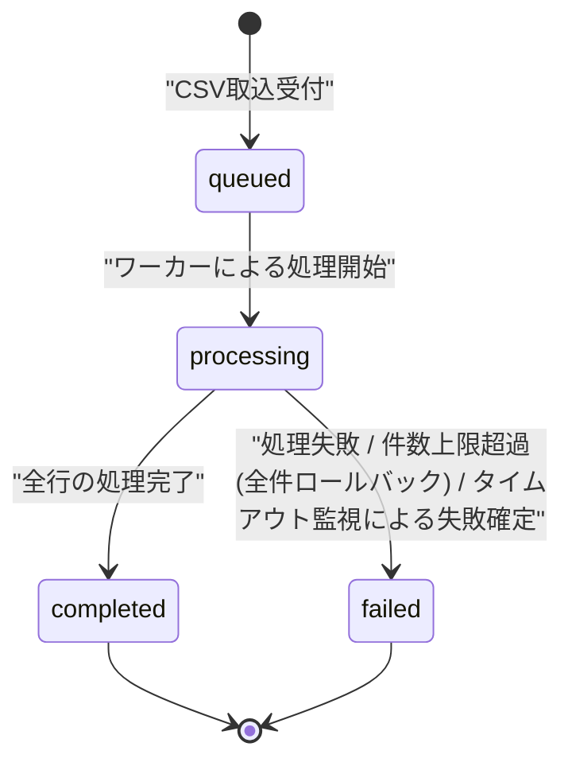

# STS-006: FAQ取込ジョブ状態遷移

> **この状態遷移図は「FAQ取込ジョブ(`TP_IMPORT_JOBS`)の状態と、実装上の遷移契機・ガード条件・更新操作・実行可能ロール・エラー時挙動」を定義します。**

*種別 状態遷移図 ・ ステータス ドラフト*

## 1. 目的

本状態遷移図は、FAQ CSV 一括取込の受付から完了・失敗確定までを追跡する取込ジョブ(`TP_IMPORT_JOBS`)の状態を対象とし、非同期ワーカーによる行単位取込の進捗管理と、画面ポーリングでの状態・結果表示の分岐を実装粒度で支えることを目的とする。状態名・遷移そのものの正本は [状態モデル §6](../../02_basic_design/08_state-model.md#6-faq取込ジョブ状態) であり、本書はその遷移を実装上いつ・誰が起こし、どのガード条件で成立し、Repository 更新がどう発生するかを詳細化する。

## 2. 対象データ・対象機能

状態を持つ対象データと、その状態が影響する対象機能・関連 ID(業務 UC / 関連 SCR・API・SYS・TBL)を示す。受付は CSV インポート API が起点となり、状態の進行は非同期ワーカーが、状態の参照は画面ポーリング用 API が担う。

| 対象データ | 対象機能 | 状態を持つ理由 | 状態によって変わる処理 |
|----|----|----|----|
| `TP_IMPORT_JOBS`([TBL-033](../../02_basic_design/02_backend/04_database/TBL-033.md#TBL-033)) | FAQ CSV インポート受付([API-028](../../02_basic_design/02_backend/03_apis/API-028.md#API-028))/ ジョブ非同期実行([SYS-014](../../02_basic_design/02_backend/01_system/SYS-014.md#SYS-014))/ 取込ジョブ状態取得([API-067](../../02_basic_design/02_backend/03_apis/API-067.md#API-067)) | 画面応答を待たせず行単位取込を進めるため、受付・処理中・完了・失敗を区別して進捗と結果を追跡する | 状態に応じて進捗バー / 結果サマリの表示切替、失敗明細の提示可否を切り替える |

対象機能の業務文脈は [UC-046](../../01_requirements/04_business_usecases/UC-046.md#UC-046)(システムが FAQ 一括取り込みジョブを非同期実行する)に対応する。取込対象・受付契機のシーケンスは [SEQ-087](../../02_basic_design/03_sequences/SEQ-087.md#SEQ-087) が担う。

## 3. 状態一覧

対象データが取りうる状態を [状態モデル §6](../../02_basic_design/08_state-model.md#6-faq取込ジョブ状態) に一致させて示す。状態値の物理定義(CHECK 制約)は対応テーブルの [`§コード値・区分値`](../../02_basic_design/02_backend/04_database/TBL-033.md#コード値区分値) を正本とする。

| 状態ID | 状態名 | 説明 | 初期状態 | 終了状態 | 備考 |
|----|----|----|----|----|----|
| S1 | `queued` | [状態モデル §6](../../02_basic_design/08_state-model.md#6-faq取込ジョブ状態) | ◯ | — | CSV 取込受付時の既定値 |
| S2 | `processing` | [状態モデル §6](../../02_basic_design/08_state-model.md#6-faq取込ジョブ状態) | — | — | ワーカーが行単位取込を実行中 |
| S3 | `completed` | [状態モデル §6](../../02_basic_design/08_state-model.md#6-faq取込ジョブ状態) | — | ◯ | 全件成功と部分失敗を含む |
| S4 | `failed` | [状態モデル §6](../../02_basic_design/08_state-model.md#6-faq取込ジョブ状態) | — | ◯ | ジョブ異常終了またはタイムアウト |

## 4. 状態遷移図

対象データの状態遷移を [状態モデル §6](../../02_basic_design/08_state-model.md#6-faq取込ジョブ状態) と一致させて図示する。受付で `queued` に入り、ワーカー起動で `processing` へ進み、全行処理完了で `completed`、処理失敗またはタイムアウト監視での失敗確定で `failed` へ至る線形進行のみで、逆行遷移は存在しない。

## 5. 状態遷移一覧

各遷移の実装上の契機・ガード条件・更新操作・実行可能ロール・エラー時挙動を示す。受付は利用者セッションの Route Handler が起こし、処理開始・完了・失敗確定はいずれも非同期ワーカー(Cloudflare Queues 消費処理)側で起こる。

| 現在状態 | イベント | 条件 | 次状態 | 実行処理 | 実行可能ロール | エラー時 | 備考 |
|----|----|----|----|----|----|----|----|
| (なし) | CSV取込受付 | 受理形式(CSV・UTF-8・ヘッダ行・件数・サイズ = 設計値)と各行の文字数([RULE-011](../../01_requirements/01_business_requirement/08_rule.md#RULE-011))の検証を通過する([API-028](../../02_basic_design/02_backend/03_apis/API-028.md#API-028) P-01/P-02) | `queued` | 取込ジョブを新規作成し `status` を既定 `'queued'` で確定する(総行数はこの時点では未設定・[API-028](../../02_basic_design/02_backend/03_apis/API-028.md#API-028) P-03・Repository 作成あり)。ジョブ ID を発行し非同期処理(Cloudflare Queues)へ投入する | オーナー / 該当プロジェクトの編集権限を持つメンバー(利用者セッション + CSRF) | 受付前の形式不正は [ERR-024](../../02_basic_design/05_errors/ERR-024.md#ERR-024)(415/400)を返しジョブを作成しない | 冪等性は `Idempotency-Key` で担保する([API-028](../../02_basic_design/02_backend/03_apis/API-028.md#API-028)) |
| `queued` | ワーカーによる処理開始 | Queues メッセージの消費によりワーカーが当該ジョブを取得する | `processing` | 総行数を確定して記録し `status` を `processing` へ更新する([SYS-014](../../02_basic_design/02_backend/01_system/SYS-014.md#SYS-014) [PR-01](../../02_basic_design/02_backend/01_system/SYS-014.md#PR-01)・Repository 更新あり) | システム(非同期ワーカー) | ワーカー起動失敗・メッセージ取得失敗は Queues の自動リトライへ委ね `status` は `queued` のまま保持する | 多重起動時は先着ワーカーのみが `processing` へ更新し後着は競合を検知してスキップする(§6 状態別の許可操作を参照) |
| `processing` | 全行の処理完了 | 取込対象の全行について新規登録 / 既存上書き / 行失敗のいずれかの反映が完了する([SYS-014](../../02_basic_design/02_backend/01_system/SYS-014.md#SYS-014) [PR-02](../../02_basic_design/02_backend/01_system/SYS-014.md#PR-02)〜[PR-06](../../02_basic_design/02_backend/01_system/SYS-014.md#PR-06)) | `completed` | 処理済み行数・成功行数・失敗行数と失敗明細(`error_summary`)を集計して記録し `status` を `completed` へ更新する(全件成功・部分失敗を区別しない共通状態・[SYS-014](../../02_basic_design/02_backend/01_system/SYS-014.md#SYS-014) [PR-06](../../02_basic_design/02_backend/01_system/SYS-014.md#PR-06)・[PR-07](../../02_basic_design/02_backend/01_system/SYS-014.md#PR-07)・Repository 更新あり) | システム(非同期ワーカー) | 集計・更新処理自体の失敗は当該ジョブを失敗として扱い `failed` へ更新する(下段の「処理失敗」に従う) | 完了後は依頼したアカウント利用者へ完了を通知する([SYS-014](../../02_basic_design/02_backend/01_system/SYS-014.md#SYS-014) [PR-07](../../02_basic_design/02_backend/01_system/SYS-014.md#PR-07)) |
| `processing` | 処理失敗 | ワーカー処理中に回復不能な異常(DB 書込失敗の継続・予期しない例外等)が発生する | `failed` | `status` を `failed` へ更新する。1 行の失敗は行失敗記録([SYS-014](../../02_basic_design/02_backend/01_system/SYS-014.md#SYS-014) [PR-05](../../02_basic_design/02_backend/01_system/SYS-014.md#PR-05))として `completed` へ進み、ジョブ全体を `failed` にはしない(Repository 更新あり) | システム(非同期ワーカー) | 異常内容をログへ記録し運用へ通知する。取込済み行の巻き戻しは行わない(行単位確定は独立) | ジョブ全体の失敗は「行単位の失敗」とは区別する(§3 備考) |
| `processing` | 件数上限超過(全件ロールバック) | 取込により当該プロジェクトの有効 FAQ 件数が [RULE-010](../../01_requirements/01_business_requirement/08_rule.md#RULE-010) の強制拒否しきい値を超える([IPO-015 No.6](../04_ipo/IPO-015.md#IPO-015) 件数上限ガード) | `failed` | 当該ジョブで反映した全行をロールバックし `status` を `failed` へ更新する(部分取込しない・Repository 更新あり) | システム(非同期ワーカー) | 失敗理由コード `CSV_FAQ_LIMIT_EXCEEDED`([ERR-037](../../02_basic_design/05_errors/ERR-037.md#ERR-037))をジョブの失敗理由として記録する | 「処理失敗」と異なり反映済み全行を巻き戻す(単一トランザクション) |
| `processing` | タイムアウト監視による失敗確定 | 監視処理が `processing` のまま進捗が更新されない滞留ジョブを検知する(監視間隔・滞留判定しきい値は[システム仕様書 §7](../../02_basic_design/07_system-spec.md#7-バッチ運用設計値)を参照) | `failed` | 監視処理(Cron Triggers)が滞留ジョブを検出し `status` を `failed` へ更新する(Repository 更新あり) | システム(監視バッチ) | 更新競合(ワーカーが同時に `completed` へ更新済み)を検知した場合は先着(ワーカー側の更新)を優先し監視側の更新は行わない | 監視対象・実行契機の詳細化は[BAT-003](../05_batch/BAT-003.md#BAT-003)に委ねる |

> [!NOTE]
> **`queued` → `completed` / `queued` → 直接 `failed` の経路は存在しない。** `processing` を経由しない状態変化は発生せず、`completed`・`failed` はいずれも終端状態でありそこから再遷移しない(取込結果の訂正は新規ジョブの再受付で行う)。

## 6. 状態別の許可操作

状態ごとに許可・禁止する操作と、画面での表示制御を示す。状態の進行はシステム(非同期ワーカー / 監視バッチ)のみが行い、利用者は状態を直接変更できず参照のみ行う。

| 状態 | 許可操作 | 禁止操作 | 表示制御 | 備考 |
|----|----|----|----|----|
| `queued` | 状態参照(ポーリング) | 手動での状態変更 / ジョブの中断・再開 | 進捗バーを「受付済み」として表示する | ワーカー起動待ち |
| `processing` | 状態参照(ポーリング) | 手動での状態変更 / 同一ジョブへの多重ワーカー処理開始(競合検知でスキップ) | 進捗バーを処理済み行数 / 総行数で更新表示する([API-067](../../02_basic_design/02_backend/03_apis/API-067.md#API-067)) | 行単位の成否は集計完了まで確定表示しない |
| `completed` | 結果サマリ・失敗明細の参照 | 状態の再変更 | 結果サマリ(全件成功 / 部分失敗)と失敗行一覧を表示する | 終端状態。再取込は新規ジョブとして行う |
| `failed` | 状態参照(失敗確定の表示) | 状態の再変更 / 部分結果の確定表示 | ジョブ失敗を表示する(失敗明細は保証しない) | 終端状態。再取込は新規ジョブとして行う |

## 7. 後続工程への引き継ぎ事項

テスト設計・詳細設計へ引き継ぐ観点(境界となる遷移・並行遷移時の競合・冪等性・異常系での状態確定など)を示す。

| 引き継ぎ先 | 観点 | 内容 |
|----|----|----|
| テスト設計 | 遷移網羅 | `queued → processing → completed` の正常線形進行、`processing → failed`(処理失敗 / タイムアウト監視)への異常確定、逆行遷移が発生しないことを検証観点として引き継ぐ |
| テスト設計 | 境界・異常系での状態確定 | 全行失敗時も `completed`(部分失敗として集計)になり `failed` にはならないこと、ワーカー処理中の回復不能例外時にのみ `failed` へ確定することを検証する |
| テスト設計 | 冪等性 | CSV 取込受付の `Idempotency-Key` 再送でジョブが二重作成されないこと、Queues メッセージの重複配信時にワーカーが多重に `processing` 更新を行わないことを検証する |
| 詳細設計 | 競合制御 | 同一ジョブへの多重ワーカー処理開始時の排他(先着優先)、監視処理とワーカーの同時更新時の競合解決(先着優先)の実装方針を委ねる |
| 詳細設計 | トランザクション境界 | 行単位取込(新規登録 / 既存上書き / 行失敗記録)と、全行処理完了時の集計・`completed` 確定の Tx 境界の実装方針を委ねる |
