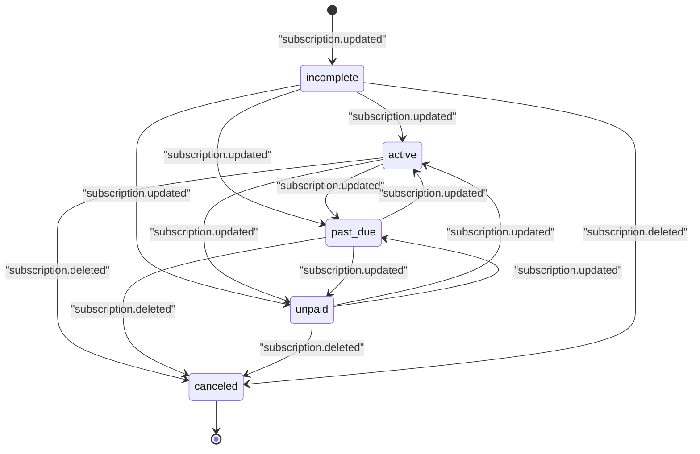

# STS-007: 課金サブスクリプション状態遷移

> **この状態遷移図は「課金サブスクリプション(`T_BILL_SUBS`)の状態と、実装上の遷移契機・ガード条件・更新操作・実行可能ロール・エラー時挙動」を定義します。**

*種別 状態遷移図 ・ ステータス ドラフト*

## 1. 目的

本状態遷移図は、課金プロバイダ(Stripe)側のサブスクリプション状態を写像して保持する課金サブスクリプション(`T_BILL_SUBS`)の状態を対象とし、課金プロバイダ通知の取込([SYS-004](../../02_basic_design/02_backend/01_system/SYS-004.md#SYS-004))が状態をどう確定させるかを実装粒度で支えることを目的とする。状態名・遷移そのものの正本は [状態モデル §7.1](../../02_basic_design/08_state-model.md#71-課金サブスクリプション状態) であり、本書はその遷移を実装上いつ・何が起こし、どのガード条件で成立し、Repository 更新がどう発生するかを詳細化する。

## 2. 対象データ・対象機能

状態を持つ対象データと、その状態が影響する対象機能・関連 ID(業務 UC / 関連 SCR・API・SYS・TBL)を示す。状態確定は課金プロバイダ通知の受信・検証・取込のみが起点であり、利用者操作による直接更新は行わない。

| 対象データ | 対象機能 | 状態を持つ理由 | 状態によって変わる処理 |
|----|----|----|----|
| `T_BILL_SUBS`([TBL-018](../../02_basic_design/02_backend/04_database/TBL-018.md#TBL-018)) | 課金プロバイダ通知の受信・検証・取込([SYS-004](../../02_basic_design/02_backend/01_system/SYS-004.md#SYS-004) / [API-060](../../02_basic_design/02_backend/03_apis/API-060.md#API-060))・請求画面での状態表示([API-043](../../02_basic_design/02_backend/03_apis/API-043.md#API-043)) | 課金プロバイダ側のサブスク状態を写像し、請求画面での状態表示・支払失敗猶予判定の起点情報として保持するため | 請求画面の請求状態表示、決済失敗猶予・サスペンション移行([SYS-020](../../02_basic_design/02_backend/01_system/SYS-020.md#SYS-020))の起算契機を切り替える |

対象機能の業務文脈は [UC-056](../../01_requirements/04_business_usecases/UC-056.md#UC-056)(課金プロバイダ通知の受信・検証・再処理)に対応する。決済失敗確定を起点とする猶予・課金アカウントサスペンション移行は [UC-055](../../01_requirements/04_business_usecases/UC-055.md#UC-055)・[SYS-020](../../02_basic_design/02_backend/01_system/SYS-020.md#SYS-020) が別データ(`M_BILLING_ACCOUNT`)を対象に担う。

## 3. 状態一覧

対象データが取りうる状態を [状態モデル §7.1](../../02_basic_design/08_state-model.md#71-課金サブスクリプション状態) に一致させて示す。状態値の物理定義(CHECK 制約)は対応テーブルの [`§コード値・区分値`](../../02_basic_design/02_backend/04_database/TBL-018.md#コード値区分値) を正本とする。

| 状態ID | 状態名 | 説明 | 初期状態 | 終了状態 | 備考 |
|----|----|----|----|----|----|
| S1 | `incomplete` | [状態モデル §7.1](../../02_basic_design/08_state-model.md#71-課金サブスクリプション状態) | ◯ | — | 初回サブスク作成時の課金プロバイダ通知取込で確定 |
| S2 | `active` | [状態モデル §7.1](../../02_basic_design/08_state-model.md#71-課金サブスクリプション状態) | — | — | — |
| S3 | `past_due` | [状態モデル §7.1](../../02_basic_design/08_state-model.md#71-課金サブスクリプション状態) | — | — | — |
| S4 | `unpaid` | [状態モデル §7.1](../../02_basic_design/08_state-model.md#71-課金サブスクリプション状態) | — | — | — |
| S5 | `canceled` | [状態モデル §7.1](../../02_basic_design/08_state-model.md#71-課金サブスクリプション状態) | — | ◯ | 解約済み。以後の状態更新通知は対象外 |

## 4. 状態遷移図

対象データの状態遷移を [状態モデル §7.1](../../02_basic_design/08_state-model.md#71-課金サブスクリプション状態) と一致させて図示する。すべての遷移は課金プロバイダ通知の種別(`subscription.updated` / `subscription.deleted`)の取込によってのみ発生する。

## 5. 状態遷移一覧

各遷移の実装上の契機・ガード条件・更新操作・実行可能ロール・エラー時挙動を示す。実行契機はすべて課金プロバイダ通知の Webhook 取込([API-060](../../02_basic_design/02_backend/03_apis/API-060.md#API-060))であり、利用者・運用者による直接操作は存在しない。

| 現在状態 | イベント | 条件 | 次状態 | 実行処理 | 実行可能ロール | エラー時 | 備考 |
|----|----|----|----|----|----|----|----|
| (なし) | `subscription.updated` の取込(対象サブスクリプション未作成) | 署名検証を通過し、冪等性キー `(provider, event_id)` で未受信と判定される。通知本文の対象サブスクリプションが未作成である([SYS-004](../../02_basic_design/02_backend/01_system/SYS-004.md#SYS-004) PR-01・PR-02) | `incomplete` | 課金プロバイダ通知取込のトランザクション内で対象課金アカウントに紐づく `T_BILL_SUBS` を新規作成し `status` を通知本文が示す状態(初回は `incomplete`)で確定する([SYS-004](../../02_basic_design/02_backend/01_system/SYS-004.md#SYS-004) PR-04・Repository 作成あり) | (なし・Webhook 契機) | 署名不正は [ERR-031](../../02_basic_design/05_errors/ERR-031.md#ERR-031)(401)で受信自体を拒否し状態を作成しない。反映失敗は取込失敗として記録・再処理対象化する([SYS-004](../../02_basic_design/02_backend/01_system/SYS-004.md#SYS-004) PR-06) | — |
| `incomplete` / `active` / `past_due` / `unpaid` | `subscription.updated` の取込 | 署名検証を通過し、冪等性キー `(provider, event_id)` で未受信と判定される。通知本文の対象サブスクリプションが解決できる | 通知本文が示す状態(`active` / `past_due` / `unpaid` のいずれか) | `T_BILL_SUBS.status` を通知本文が示す状態へ更新する([API-060](../../02_basic_design/02_backend/03_apis/API-060.md#API-060) 列挙値 `subscription.updated`・Repository 更新あり) | (なし・Webhook 契機) | 署名不正は [ERR-031](../../02_basic_design/05_errors/ERR-031.md#ERR-031)(401)。重複受信は [ERR-032](../../02_basic_design/05_errors/ERR-032.md#ERR-032)(200・状態変更なし)で冪等応答する。反映失敗は取込失敗として記録・再処理対象化する([SYS-004](../../02_basic_design/02_backend/01_system/SYS-004.md#SYS-004) PR-06) | 同一通知の重複受信は受信ログのみ記録し状態を変えない([SYS-004](../../02_basic_design/02_backend/01_system/SYS-004.md#SYS-004) PR-02) |
| `incomplete` / `active` / `past_due` / `unpaid` | `subscription.deleted` の取込 | 署名検証を通過し、冪等性キー `(provider, event_id)` で未受信と判定される。通知本文の対象サブスクリプションが解決できる | `canceled` | `T_BILL_SUBS.status` を `canceled` へ更新する([API-060](../../02_basic_design/02_backend/03_apis/API-060.md#API-060) 列挙値 `subscription.deleted`・Repository 更新あり) | (なし・Webhook 契機) | 署名不正は [ERR-031](../../02_basic_design/05_errors/ERR-031.md#ERR-031)(401)。重複受信は [ERR-032](../../02_basic_design/05_errors/ERR-032.md#ERR-032)(200・状態変更なし)で冪等応答する。反映失敗は取込失敗として記録・再処理対象化する([SYS-004](../../02_basic_design/02_backend/01_system/SYS-004.md#SYS-004) PR-06) | `canceled` 到達後の状態更新通知は対象サブスクリプションが再作成されない限り発生しない想定 |

> [!NOTE]
> **`T_BILL_SUBS.status` の更新は課金プロバイダ通知の取込のみが行い、課金アカウント状態(`M_BILLING_ACCOUNT.status`)を直接更新しない。** 決済失敗確定を起点とする猶予期間監視・サスペンション移行は、`payment.failed` / `invoice.payment_failed` 通知を契機に [SYS-020](../../02_basic_design/02_backend/01_system/SYS-020.md#SYS-020) が `M_BILLING_ACCOUNT` を対象に別トラックで行う([状態モデル §2](../../02_basic_design/08_state-model.md#2-課金アカウント状態))。

## 6. 状態別の許可操作

状態ごとに許可・禁止する操作と、画面での表示制御を示す。いずれの状態も利用者からの直接操作対象ではなく、請求画面での閲覧用途に用いる。

| 状態 | 許可操作 | 禁止操作 | 表示制御 | 備考 |
|----|----|----|----|----|
| `incomplete` | 請求画面での状態閲覧([API-043](../../02_basic_design/02_backend/03_apis/API-043.md#API-043)) | 利用者による直接更新 | 初回支払未完了として表示する | — |
| `active` | 請求画面での状態閲覧 | 利用者による直接更新 | 有効として表示する | — |
| `past_due` | 請求画面での状態閲覧 | 利用者による直接更新 | 支払遅延として表示する | 課金アカウントの機能可否は `M_BILLING_ACCOUNT.status` に従う([状態モデル §2](../../02_basic_design/08_state-model.md#2-課金アカウント状態)) |
| `unpaid` | 請求画面での状態閲覧 | 利用者による直接更新 | 未払いとして表示する | 課金アカウントの機能可否は `M_BILLING_ACCOUNT.status` に従う([状態モデル §2](../../02_basic_design/08_state-model.md#2-課金アカウント状態)) |
| `canceled` | 請求画面での状態閲覧 | 利用者による直接更新 | 解約済みとして表示する | 終端状態 |

## 7. 後続工程への引き継ぎ事項

テスト設計・詳細設計へ引き継ぐ観点(境界となる遷移・並行遷移時の競合・冪等性・異常系での状態確定)を示す。通知取込の冪等性と、課金アカウント状態との非連動性が主要な検証観点である。

| 引き継ぎ先 | 観点 | 内容 |
|----|----|----|
| テスト設計 | 遷移網羅 | `incomplete` → `active` / `past_due` / `unpaid` の初回分岐、`active` / `past_due` / `unpaid` 間の相互遷移、いずれの状態からも `canceled` へ到達すること、`canceled` からの遷移が発生しないこと(禁止遷移)を検証観点として引き継ぐ |
| テスト設計 | 冪等性 | 同一 `(provider, event_id)` の重複通知再送が状態を二重に変更しないこと([SYS-004](../../02_basic_design/02_backend/01_system/SYS-004.md#SYS-004) PR-02)を検証する |
| テスト設計 | 異常系での状態確定 | 署名検証失敗時に状態を作成・更新しないこと、反映失敗時に取込失敗として記録され状態が中途半端に確定しないことを検証する |
| 詳細設計 | 非連動性の実装確認 | `T_BILL_SUBS.status` の更新処理が `M_BILLING_ACCOUNT.status` を直接書き換えないこと、両者の更新が独立したトランザクションで行われることの実装方針を委ねる |
| 詳細設計 | トランザクション境界 | 通知取込の受信履歴記録([SYS-004](../../02_basic_design/02_backend/01_system/SYS-004.md#SYS-004) PR-03)と状態反映(PR-04)の同一トランザクション化・部分失敗時のロールバック方針を委ねる |
