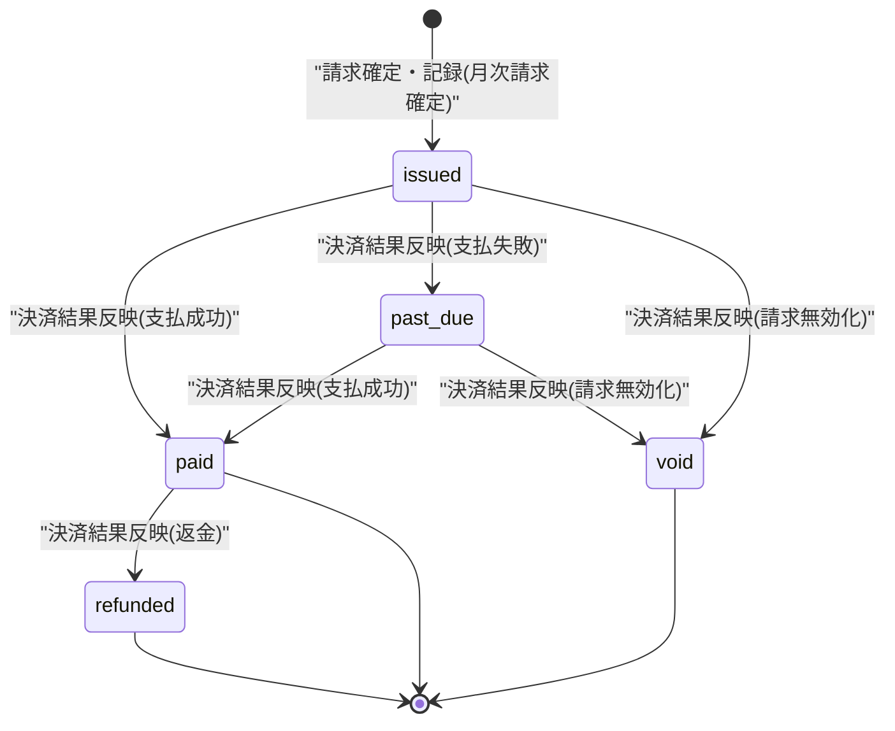

# STS-008: 請求書状態遷移

> **この状態遷移図は「請求書(`T_BILL_INVOICES`)の状態と、実装上の遷移契機・ガード条件・更新操作・実行可能ロール・エラー時挙動」を定義します。**

*種別 状態遷移図 ・ ステータス ドラフト*

## 1. 目的

本状態遷移図は、月次請求確定で発行されるオーナー単位(課金アカウント単位)の請求書(`T_BILL_INVOICES`)の状態を対象とし、月次請求確定による発行と課金プロバイダからの決済結果反映による支払完了 / 支払遅延 / 無効化の分岐・可否判定を実装粒度で支えることを目的とする。状態名・遷移そのものの正本は [状態モデル §7.2](../../02_basic_design/08_state-model.md#72-請求書状態) であり、本書はその遷移を実装上いつ・誰(何)が起こし、どのガード条件で成立し、Repository 更新がどう発生するかを詳細化する。

## 2. 対象データ・対象機能

状態を持つ対象データと、その状態が影響する対象機能・関連 ID(業務 UC / 関連 SCR・API・SYS・TBL)を示す。発行は月次請求確定バッチが起点となり、以降の状態反映は課金プロバイダ Webhook 受信が担う。

| 対象データ | 対象機能 | 状態を持つ理由 | 状態によって変わる処理 |
|----|----|----|----|
| `T_BILL_INVOICES`([TBL-019](../../02_basic_design/02_backend/04_database/TBL-019.md#TBL-019)) | 月次請求確定([SYS-019](../../02_basic_design/02_backend/01_system/SYS-019.md#SYS-019))/ 課金プロバイダ通知の受信・検証・取込([SYS-004](../../02_basic_design/02_backend/01_system/SYS-004.md#SYS-004))/ 請求サマリ参照([API-043](../../02_basic_design/02_backend/03_apis/API-043.md#API-043)) | 発行済み請求と支払完了・支払遅延・無効化を区別し、請求画面の請求状態表示・督促要否を制御するため | 請求画面(SCR-028)の請求状態表示・請求履歴集計、決済失敗猶予([SYS-020](../../02_basic_design/02_backend/01_system/SYS-020.md#SYS-020))との連動可否を状態で切り替える |

対象機能の業務文脈は発行側 [UC-054](../../01_requirements/04_business_usecases/UC-054.md#UC-054)、決済結果反映側 [UC-056](../../01_requirements/04_business_usecases/UC-056.md#UC-056) に対応する。決済失敗確定からサスペンションへの猶予連動は [課金・請求設計 §5.1](../../02_basic_design/05_billing-design.md#51-決済失敗からサスペンションへ) が担う。

## 3. 状態一覧

対象データが取りうる状態を [状態モデル §7.2](../../02_basic_design/08_state-model.md#72-請求書状態) に一致させて示す。状態値の物理定義(CHECK 制約)は対応テーブルの [`§コード値`](../../02_basic_design/02_backend/04_database/TBL-019.md#コード値区分値) を正本とする。

| 状態ID | 状態名 | 説明 | 初期状態 | 終了状態 | 備考 |
|----|----|----|----|----|----|
| S1 | `draft` | [状態モデル §7.2](../../02_basic_design/08_state-model.md#72-請求書状態) | — | — | 決済プロバイダ確定前の内部状態。MVP では請求確定時に `issued` で記録し `draft` は使用しない([状態モデル §7.2](../../02_basic_design/08_state-model.md#72-請求書状態)) |
| S2 | `issued` | [状態モデル §7.2](../../02_basic_design/08_state-model.md#72-請求書状態) | ◯ | — | [SYS-019](../../02_basic_design/02_backend/01_system/SYS-019.md#SYS-019) の請求確定・記録で新規作成される初期状態 |
| S3 | `paid` | [状態モデル §7.2](../../02_basic_design/08_state-model.md#72-請求書状態) | — | ◯ | 支払完了。以後の遷移なし |
| S4 | `past_due` | [状態モデル §7.2](../../02_basic_design/08_state-model.md#72-請求書状態) | — | — | 支払遅延。`paid` / `void` へ遷移可 |
| S5 | `refunded` | [状態モデル §7.2](../../02_basic_design/08_state-model.md#72-請求書状態) | — | — | 決済プロバイダの `charge.refunded`([API-060](../../02_basic_design/02_backend/03_apis/API-060.md#API-060))により `paid` から遷移(§5・[状態モデル §7.2](../../02_basic_design/08_state-model.md#72-請求書状態)) |
| S6 | `void` | [状態モデル §7.2](../../02_basic_design/08_state-model.md#72-請求書状態) | — | ◯ | 無効化。以後の遷移なし |

## 4. 状態遷移図

対象データの状態遷移を [状態モデル §7.2](../../02_basic_design/08_state-model.md#72-請求書状態) と一致させて図示する。月次請求確定で `issued` に入り、以降は課金プロバイダ Webhook 受信の決済結果反映で `paid` / `past_due` / `void` へ遷移する。

## 5. 状態遷移一覧

各遷移の実装上の契機・ガード条件・更新操作・実行可能ロール・エラー時挙動を示す。発行契機は月次請求確定バッチ(Cron Triggers)であり、以降の状態反映はいずれも課金プロバイダ Webhook 受信(Route Handler)が起こす。

| 現在状態 | イベント | 条件 | 次状態 | 実行処理 | 実行可能ロール | エラー時 | 備考 |
|----|----|----|----|----|----|----|----|
| (なし) | 請求確定・記録 | 当該オーナー(課金アカウント)・当該月が未確定([SYS-019](../../02_basic_design/02_backend/01_system/SYS-019.md#SYS-019) PR-04)。プロジェクト単位の月次集計をオーナー単位へ集約した請求金額が確定している | `issued` | 課金対象件数([課金・請求設計 §6](../../02_basic_design/05_billing-design.md#6-利用量集計方針))から算定した金額で請求書を新規作成し `status` を `issued` で確定する([SYS-019](../../02_basic_design/02_backend/01_system/SYS-019.md#SYS-019) PR-04・Repository 作成あり) | システム(Cron Triggers・月初の定期起動) | 確定済み・対象なしのオーナーは作成せず冪等にスキップする([SYS-019](../../02_basic_design/02_backend/01_system/SYS-019.md#SYS-019) PR-07) | 冪等性は `(billing_account_id, billing_ym)` の一意制約([TBL-019](../../02_basic_design/02_backend/04_database/TBL-019.md#インデックス) `uq_billing_invoices_owner_month`)で担保する |
| `issued` | 決済結果反映(支払成功) | Webhook 署名検証を通過し、冪等性キー `(provider, event_id)` で未処理の通知である([SYS-004](../../02_basic_design/02_backend/01_system/SYS-004.md#SYS-004) PR-02) | `paid` | `status` を `paid` へ更新し支払日時を記録する([API-060](../../02_basic_design/02_backend/03_apis/API-060.md#API-060) `payment.succeeded` / `invoice.paid`・Repository 更新あり) | システム(課金プロバイダ Webhook 受信) | 署名検証失敗は [ERR-031](../../02_basic_design/05_errors/ERR-031.md#ERR-031)(401)で取り込まず状態は変えない。重複受信は [ERR-032](../../02_basic_design/05_errors/ERR-032.md#ERR-032)(200)で冪等応答し状態は変えない | 決済失敗猶予中の課金アカウントは同時に `active` へ復帰する([課金・請求設計 §5.1](../../02_basic_design/05_billing-design.md#51-決済失敗からサスペンションへ)) |
| `issued` | 決済結果反映(支払失敗) | Webhook 署名検証を通過し、冪等性キー `(provider, event_id)` で未処理の通知である([SYS-004](../../02_basic_design/02_backend/01_system/SYS-004.md#SYS-004) PR-02) | `past_due` | `status` を `past_due` へ更新する([API-060](../../02_basic_design/02_backend/03_apis/API-060.md#API-060) `payment.failed` / `invoice.payment_failed`・Repository 更新あり) | システム(課金プロバイダ Webhook 受信) | 署名検証失敗は [ERR-031](../../02_basic_design/05_errors/ERR-031.md#ERR-031)(401)で取り込まず状態は変えない。重複受信は [ERR-032](../../02_basic_design/05_errors/ERR-032.md#ERR-032)(200)で冪等応答し状態は変えない | 決済失敗確定として決済失敗の猶予起算に連動する([課金・請求設計 §5.1](../../02_basic_design/05_billing-design.md#51-決済失敗からサスペンションへ)・[SYS-020](../../02_basic_design/02_backend/01_system/SYS-020.md#SYS-020)) |
| `past_due` | 決済結果反映(支払成功) | Webhook 署名検証を通過し、冪等性キー `(provider, event_id)` で未処理の通知である([SYS-004](../../02_basic_design/02_backend/01_system/SYS-004.md#SYS-004) PR-02) | `paid` | `status` を `paid` へ更新し支払日時を記録する([API-060](../../02_basic_design/02_backend/03_apis/API-060.md#API-060) `payment.succeeded` / `invoice.paid`・Repository 更新あり) | システム(課金プロバイダ Webhook 受信) | 署名検証失敗は [ERR-031](../../02_basic_design/05_errors/ERR-031.md#ERR-031)(401)で取り込まず状態は変えない。重複受信は [ERR-032](../../02_basic_design/05_errors/ERR-032.md#ERR-032)(200)で冪等応答し状態は変えない | 猶予中の再決済成功として課金アカウントを即時 `active` へ復帰させる([課金・請求設計 §5.1](../../02_basic_design/05_billing-design.md#51-決済失敗からサスペンションへ)) |
| `issued` | 決済結果反映(請求無効化) | Webhook 署名検証を通過し、冪等性キー `(provider, event_id)` で未処理の通知である([SYS-004](../../02_basic_design/02_backend/01_system/SYS-004.md#SYS-004) PR-02) | `void` | `status` を `void` へ更新する([API-060](../../02_basic_design/02_backend/03_apis/API-060.md#API-060) `invoice.voided`・Repository 更新あり) | システム(課金プロバイダ Webhook 受信) | 署名検証失敗は [ERR-031](../../02_basic_design/05_errors/ERR-031.md#ERR-031)(401)で取り込まず状態は変えない。重複受信は [ERR-032](../../02_basic_design/05_errors/ERR-032.md#ERR-032)(200)で冪等応答し状態は変えない | — |
| `past_due` | 決済結果反映(請求無効化) | Webhook 署名検証を通過し、冪等性キー `(provider, event_id)` で未処理の通知である([SYS-004](../../02_basic_design/02_backend/01_system/SYS-004.md#SYS-004) PR-02) | `void` | `status` を `void` へ更新する([API-060](../../02_basic_design/02_backend/03_apis/API-060.md#API-060) `invoice.voided`・Repository 更新あり) | システム(課金プロバイダ Webhook 受信) | 署名検証失敗は [ERR-031](../../02_basic_design/05_errors/ERR-031.md#ERR-031)(401)で取り込まず状態は変えない。重複受信は [ERR-032](../../02_basic_design/05_errors/ERR-032.md#ERR-032)(200)で冪等応答し状態は変えない | — |
| `paid` | 決済結果反映(返金) | Webhook 署名検証を通過し、冪等性キー `(provider, event_id)` で未処理の通知である([SYS-004](../../02_basic_design/02_backend/01_system/SYS-004.md#SYS-004) PR-02) | `refunded` | `status` を `refunded` へ更新し返金日時を記録する([API-060](../../02_basic_design/02_backend/03_apis/API-060.md#API-060) `charge.refunded`・Repository 更新あり) | システム(課金プロバイダ Webhook 受信) | 署名検証失敗は [ERR-031](../../02_basic_design/05_errors/ERR-031.md#ERR-031)(401)で取り込まず状態は変えない。重複受信は [ERR-032](../../02_basic_design/05_errors/ERR-032.md#ERR-032)(200)で冪等応答し状態は変えない | 返金操作自体の起票UI(運用/ユーザー起点)は現行画面スコープ外([状態モデル §7.2](../../02_basic_design/08_state-model.md#72-請求書状態)) |

> [!NOTE]
> **月次請求確定は `issued` を既定状態として作成し、`draft` で作成する経路は存在しない。** `draft` は決済プロバイダの確定前の内部状態で、MVP の作成経路では使用しない([状態モデル §7.2](../../02_basic_design/08_state-model.md#72-請求書状態))。`refunded` は決済プロバイダの `charge.refunded`([API-060](../../02_basic_design/02_backend/03_apis/API-060.md#API-060) 受信・[SYS-004](../../02_basic_design/02_backend/01_system/SYS-004.md#SYS-004) 取込)により `paid` から遷移する(§5)。[SYS-019](../../02_basic_design/02_backend/01_system/SYS-019.md#SYS-019) は `issued` の発行契機のみを担う。

## 6. 状態別の許可操作

状態ごとに許可・禁止する操作と、画面での表示制御を示す。参照はオーナーの請求画面([SCR-028](../../02_basic_design/01_frontend/01_screens/SCR-028.md#SCR-028))のみで、いずれの状態も利用者による直接の状態変更操作は持たない([課金・請求設計 §8](../../02_basic_design/05_billing-design.md#8-請求画面で確認できる内容))。

| 状態 | 許可操作 | 禁止操作 | 表示制御 | 備考 |
|----|----|----|----|----|
| `issued` | 請求内容の閲覧([API-043](../../02_basic_design/02_backend/03_apis/API-043.md#API-043)) | 状態の直接変更 | 請求画面に「請求済」として表示 | 決済結果反映待ち |
| `paid` | 請求内容の閲覧 | 状態の直接変更 | 請求画面に「支払成功」として表示 | 終了状態 |
| `past_due` | 請求内容の閲覧・支払方法更新([API-045](../../02_basic_design/02_backend/03_apis/API-045.md#API-045)) | 状態の直接変更 | 請求画面に「支払失敗確定」として表示し支払方法更新を促す | 決済失敗の猶予起算と連動([SYS-020](../../02_basic_design/02_backend/01_system/SYS-020.md#SYS-020)) |
| `void` | 請求内容の閲覧 | 状態の直接変更 | 請求画面に「無効」として表示し請求対象外を明示 | 終了状態 |

## 7. 後続工程への引き継ぎ事項

テスト設計・詳細設計へ引き継ぐ観点(境界となる遷移・並行遷移時の競合・冪等性・異常系での状態確定など)を示す。発行の一意性確定と、Webhook 経由の決済結果反映の冪等性が主要な検証観点である。

| 引き継ぎ先 | 観点 | 内容 |
|----|----|----|
| テスト設計 | 遷移網羅 | 月次請求確定による `issued` の新規発行、`issued`/`past_due` から `paid`/`void` への遷移、`past_due` から `paid` への復帰を検証観点として引き継ぐ |
| テスト設計 | 冪等性 | 月次請求確定の `(billing_account_id, billing_ym)` 一意制約による二重発行防止、Webhook 受信の `(provider, event_id)` 冪等性キーによる重複反映防止を検証する |
| テスト設計 | 異常系での状態確定 | Webhook 署名検証失敗時に状態を変更しないこと、重複受信時に冪等応答し状態を変更しないことを検証する |
| 詳細設計 | 競合制御 | 同一請求書に対する複数 Webhook 通知の到達順序が入れ替わった場合(支払失敗後に支払成功が遅延到達 等)の状態確定方針の実装方針を委ねる |
| 詳細設計 | 返金運用 | `refunded`(決済プロバイダ `charge.refunded`)への遷移は §4・§5 で定義済み。返金操作自体の起票 UI(運用/ユーザー起点)は現行画面スコープ外であり将来対応で確定する |
