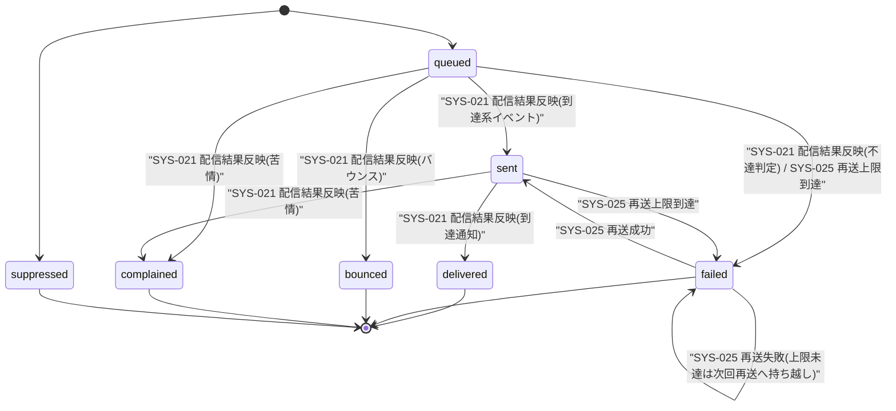

# STS-009: 通知配信状態遷移

> **この状態遷移図は「通知ログ(`H_NOTIF_LOGS`)の配信状態と、実装上の遷移契機・ガード条件・更新操作・実行可能ロール・エラー時挙動」を定義します。**

*種別 状態遷移図 ・ ステータス ドラフト*

## 1. 目的

本状態遷移図は、メール配信事業者(Resend)からの配信結果コールバックと定期再送処理を対象に、通知ログ(`H_NOTIF_LOGS`)の配信状態がいつ・どの処理によって更新されるかを実装粒度で示すことを目的とする。状態名・遷移そのものの正本は [状態モデル §8.2](../../02_basic_design/08_state-model.md#82-通知配信状態) であり、本書はその遷移を実装上いつ・誰(どの処理)が起こし、どのガード条件で成立し、Repository 更新がどう発生するかを詳細化する。本書が対象とする遷移契機は [SYS-021](../../02_basic_design/02_backend/01_system/SYS-021.md#SYS-021)(メール配信状態 Webhook 処理)・[SYS-025](../../02_basic_design/02_backend/01_system/SYS-025.md#SYS-025)(配信失敗通知の再送)・[SYS-007](../../02_basic_design/02_backend/01_system/SYS-007.md#SYS-007)(送信品質監視による通知送信抑制)の 3 処理に限る。

## 2. 対象データ・対象機能

状態を持つ対象データと、その状態が影響する対象機能・関連 ID(業務 UC / 関連 SCR・API・SYS・TBL)を示す。状態更新は Webhook コールバック(SYS-021)と定期再送バッチ(SYS-025)の 2 経路から起こり、品質監視(SYS-007)はプロジェクト単位の送信可否に作用する。

| 対象データ | 対象機能 | 状態を持つ理由 | 状態によって変わる処理 |
|----|----|----|----|
| `H_NOTIF_LOGS`([TBL-026](../../02_basic_design/02_backend/04_database/TBL-026.md#TBL-026)) | メール配信状態 Webhook 処理([SYS-021](../../02_basic_design/02_backend/01_system/SYS-021.md#SYS-021))/ 配信失敗通知の再送([SYS-025](../../02_basic_design/02_backend/01_system/SYS-025.md#SYS-025)) | 通知の到達状況を追跡し、不達・苦情の宛先への送信停止や再送要否の判定を行うため | 再送対象抽出(`failed` のみ対象)・送信停止リスト登録要否(`bounced`/`complained` のみ対象)を状態で切り替える |

対象機能の業務文脈は [UC-058](../../01_requirements/04_business_usecases/UC-058.md#UC-058)(Webhook 処理)・[UC-062](../../01_requirements/04_business_usecases/UC-062.md#UC-062)(配信失敗通知の再送)・[UC-065](../../01_requirements/04_business_usecases/UC-065.md#UC-065)(送信品質監視)に対応する。Webhook 受信の契機 API は [API-059](../../02_basic_design/02_backend/03_apis/API-059.md#API-059)、送信・再送の窓口 IF は [API-058](../../02_basic_design/02_backend/03_apis/API-058.md#API-058) である。

## 3. 状態一覧

対象データが取りうる状態を [状態モデル §8.2](../../02_basic_design/08_state-model.md#82-通知配信状態) に一致させて示す。状態値の物理定義(CHECK 制約)は対応テーブルの [`§コード値`](../../02_basic_design/02_backend/04_database/TBL-026.md#コード値区分値) を正本とする。

| 状態ID | 状態名 | 説明 | 初期状態 | 終了状態 | 備考 |
|----|----|----|----|----|----|
| S1 | `queued` | [状態モデル §8.2](../../02_basic_design/08_state-model.md#82-通知配信状態) | ◯ | — | 送信 IF([API-058](../../02_basic_design/02_backend/03_apis/API-058.md#API-058) `send`)呼び出し時に確定する初期状態。本書が対象とする SYS-021/025/007 の遷移契機には含まれない |
| S2 | `sending` | [状態モデル §8.2](../../02_basic_design/08_state-model.md#82-通知配信状態) | — | — | 送信 IF 呼び出し中の中間状態。本書が対象とする SYS-021/025/007 の遷移契機には含まれない |
| S3 | `sent` | [状態モデル §8.2](../../02_basic_design/08_state-model.md#82-通知配信状態) | — | — | — |
| S4 | `delivered` | [状態モデル §8.2](../../02_basic_design/08_state-model.md#82-通知配信状態) | — | ◯ | — |
| S5 | `failed` | [状態モデル §8.2](../../02_basic_design/08_state-model.md#82-通知配信状態) | — | ◯ | 再送上限到達で終了状態として確定する。上限未達なら再送対象として残る |
| S6 | `bounced` | [状態モデル §8.2](../../02_basic_design/08_state-model.md#82-通知配信状態) | — | ◯ | — |
| S7 | `complained` | [状態モデル §8.2](../../02_basic_design/08_state-model.md#82-通知配信状態) | — | ◯ | — |
| S8 | `suppressed` | [状態モデル §8.2](../../02_basic_design/08_state-model.md#82-通知配信状態) | — | ◯ | 本書が対象とする SYS-021/025/007 に直接の遷移契機なし(§7 引き継ぎ事項参照) |

## 4. 状態遷移図

対象データの状態遷移を [状態モデル §8.2](../../02_basic_design/08_state-model.md#82-通知配信状態) と一致させ、本書が対象とする SYS-021/025/007 由来の遷移のみを実線で図示する。`queued`/`sending` への到達および `suppressed` への遷移は状態モデルの定義に含まれるが、本書の対象範囲(SYS-021/025/007)には遷移契機が無いため開始点として置くのみで遷移元を持たない。

## 5. 状態遷移一覧

各遷移の実装上の契機・ガード条件・更新操作・実行可能ロール・エラー時挙動を示す。Webhook 契機は署名検証を通過した Route Handler(API)、再送契機は Cron Triggers 駆動のバッチが起こす。

| 現在状態 | イベント | 条件 | 次状態 | 実行処理 | 実行可能ロール | エラー時 | 備考 |
|----|----|----|----|----|----|----|----|
| `queued` | 配信結果反映(到達系イベント) | Resend 署名検証に成功し、イベントの発生時刻が記録済みの状態より新しい | `sent` | `delivery_state` を `sent` へ更新し送信日時を記録する([API-059](../../02_basic_design/02_backend/03_apis/API-059.md#API-059) P-03・Repository 更新あり) | 外部システム(Resend・署名検証済み Webhook) | 署名検証失敗は状態を変更せず [ERR-031](../../02_basic_design/05_errors/ERR-031.md#ERR-031)(401)を返す。重複受信は状態を変更せず [ERR-032](../../02_basic_design/05_errors/ERR-032.md#ERR-032)(200・冪等リプレイ)を返す | イベント発生時刻が記録済みより古い場合は上書きしない(順序逆転・遅延到達への整合性保証・[API-059](../../02_basic_design/02_backend/03_apis/API-059.md#API-059) P-03) |
| `sent` | 配信結果反映(到達通知) | Resend 署名検証に成功し、イベントの発生時刻が記録済みの状態より新しい | `delivered` | `delivery_state` を `delivered` へ更新し配信日時を記録する([API-059](../../02_basic_design/02_backend/03_apis/API-059.md#API-059) P-03・Repository 更新あり) | 外部システム(Resend・署名検証済み Webhook) | 署名検証失敗・重複受信時の扱いは上行と同じ | — |
| `queued` | 配信結果反映(不達判定) | Resend 署名検証に成功し、イベント種別が不達判定 | `failed` | `delivery_state` を `failed` へ更新し失敗日時・失敗理由を記録する([API-059](../../02_basic_design/02_backend/03_apis/API-059.md#API-059) P-03・Repository 更新あり) | 外部システム(Resend・署名検証済み Webhook) | 署名検証失敗・重複受信時の扱いは上行と同じ | 不達がバウンス種別に該当する場合は `bounced` 側の遷移が優先する |
| `queued` | 配信結果反映(バウンス) | Resend 署名検証に成功し、イベント種別がバウンス | `bounced` | `delivery_state` を `bounced` へ更新し失敗日時・失敗理由を記録したうえで、宛先を送信停止リストへ登録する([API-059](../../02_basic_design/02_backend/03_apis/API-059.md#API-059) P-03・P-04・Repository 更新あり + `M_EMAIL_SUPPRESS` 作成あり) | 外部システム(Resend・署名検証済み Webhook) | 署名検証失敗・重複受信時の扱いは上行と同じ | 送信停止リスト登録は全プロジェクト横断([TBL-007](../../02_basic_design/02_backend/04_database/TBL-007.md#TBL-007)) |
| `queued` | 配信結果反映(苦情) | Resend 署名検証に成功し、イベント種別が苦情 | `complained` | `delivery_state` を `complained` へ更新し失敗日時・失敗理由を記録したうえで、宛先を送信停止リストへ登録する([API-059](../../02_basic_design/02_backend/03_apis/API-059.md#API-059) P-03・P-04・Repository 更新あり + `M_EMAIL_SUPPRESS` 作成あり) | 外部システム(Resend・署名検証済み Webhook) | 署名検証失敗・重複受信時の扱いは上行と同じ | — |
| `sent` | 配信結果反映(苦情) | Resend 署名検証に成功し、イベントの発生時刻が記録済みの状態より新しい | `complained` | `delivery_state` を `complained` へ更新し、宛先を送信停止リストへ登録する(同上・Repository 更新あり + `M_EMAIL_SUPPRESS` 作成あり) | 外部システム(Resend・署名検証済み Webhook) | 署名検証失敗・重複受信時の扱いは上行と同じ | 送信成功後に届く遅延苦情通知を反映する経路 |
| `failed` | 再送 | スケジューラ起動時点で `failed` かつ宛先が送信停止リスト非該当かつ再送回数が[システム仕様書 §3](../../02_basic_design/07_system-spec.md#3-タイムアウトセッション認証)の通知再送回数上限未満で、直近失敗日時からの経過時間が同上バックオフの次回間隔に達している | `sent`(再送成功時)/ `failed`(再送失敗・上限未達時) | 再送を実行し結果に応じて `delivery_state` を更新し試行回数を加算する([SYS-025](../../02_basic_design/02_backend/01_system/SYS-025.md#SYS-025) PR-04・PR-05・Repository 更新あり) | システム(Cron Triggers 駆動の定期バッチ) | 再送呼び出し自体が失敗した場合は標準エラー体系([エラー設計](../../02_basic_design/05_errors/index.md))に従い当該対象をスキップし次回バッチで再評価する | 冪等キーで重複送信を排除する([API-058](../../02_basic_design/02_backend/03_apis/API-058.md#API-058) P-01) |
| `failed` | 確定失敗記録(上限到達 / 抑制該当) | 再送回数が[システム仕様書 §3](../../02_basic_design/07_system-spec.md#3-タイムアウトセッション認証)の通知再送回数上限に到達、または宛先が送信停止リスト該当 | `failed`(状態値は変わらず確定失敗として記録) | 再送を行わず確定失敗として記録する([SYS-025](../../02_basic_design/02_backend/01_system/SYS-025.md#SYS-025) PR-06・Repository 更新あり) | システム(Cron Triggers 駆動の定期バッチ) | — | 状態値自体は `failed` のまま変化しないため §4 の自己遷移として表す |

> [!NOTE]
> **送信品質監視([SYS-007](../../02_basic_design/02_backend/01_system/SYS-007.md#SYS-007))はプロジェクト単位の送信可否を切り替える処理であり、個別の通知ログ(`H_NOTIF_LOGS.delivery_state`)を直接遷移させない。** SYS-007 が集計する送信レート・バウンス率・苦情率は `H_NOTIF_LOGS` を参照のみ(`- R - -`)し、悪化判定時の更新先はプロジェクト([TBL-004](../../02_basic_design/02_backend/04_database/TBL-004.md#TBL-004))の送信抑制状態と送信停止リスト([TBL-007](../../02_basic_design/02_backend/04_database/TBL-007.md#TBL-007))である([SYS-007](../../02_basic_design/02_backend/01_system/SYS-007.md#SYS-007) §5 入出力一覧)。

## 6. 状態別の許可操作

状態ごとに許可・禁止する操作と、画面での表示制御を示す。本状態は利用者操作の対象ではなく、いずれも Webhook コールバック・再送バッチによってのみ更新される。

| 状態 | 許可操作 | 禁止操作 | 表示制御 | 備考 |
|----|----|----|----|----|
| `queued` / `sending` | Webhook による状態更新の待ち受け | 利用者による手動更新 | — | 本書の対象範囲(SYS-021/025/007)には遷移契機なし |
| `sent` | Webhook による `delivered`/`complained` への更新の待ち受け | 利用者による手動更新 | — | — |
| `delivered` | — | 状態更新(終了状態) | — | 到達確定 |
| `failed` | 再送対象としての抽出([SYS-025](../../02_basic_design/02_backend/01_system/SYS-025.md#SYS-025)) | 送信停止リスト該当宛先への再送 | 再送上限到達分は確定失敗として扱う | 上限未達の間は繰り返し再送対象になり得る |
| `bounced` / `complained` | — | 状態更新(終了状態)・当該宛先への以後の送信 | — | 送信停止リストへ登録済み([TBL-007](../../02_basic_design/02_backend/04_database/TBL-007.md#TBL-007)) |
| `suppressed` | — | 状態更新(終了状態) | — | 本書の対象範囲(SYS-021/025/007)には遷移契機なし(§7 引き継ぎ事項参照) |

## 7. 後続工程への引き継ぎ事項

テスト設計・詳細設計へ引き継ぐ観点(境界となる遷移・並行遷移時の競合・冪等性・異常系での状態確定)を示す。Webhook の順序逆転・重複受信への冪等性と、再送バッチの上限確定が主要な検証観点である。

| 引き継ぎ先 | 観点 | 内容 |
|----|----|----|
| テスト設計 | 遷移網羅 | Webhook 契機の到達系(`sent`→`delivered`)・不達系(`bounced`/`complained`/`failed`)、再送バッチの `failed`→`sent`(再送成功)・`failed`→`failed`(再送失敗・持ち越し)・確定失敗記録を検証観点として引き継ぐ |
| テスト設計 | 境界・異常系での状態確定 | イベント発生時刻が記録済みより古い通知を受信した場合に上書きしないこと([API-059](../../02_basic_design/02_backend/03_apis/API-059.md#API-059) P-03)、再送呼び出し自体の失敗時に対象をスキップし状態を不整合にしないことを検証する |
| テスト設計 | 冪等性 | Webhook の重複受信で状態・送信停止リストを変更せず既存結果を返すこと([ERR-032](../../02_basic_design/05_errors/ERR-032.md#ERR-032))、再送の冪等キー(`idempotency_key`)再送で二重送信が発生しないことを検証する |
| 詳細設計 | 競合制御 | Webhook 受信と再送バッチが同一対象へ同時に到達した場合の順序保証・楽観的排他の実装方針を委ねる |
| 詳細設計 | 状態遷移の対象外領域の確定 | `queued`/`sending` への到達契機(送信 IF 呼び出し時の初期状態確定)と `suppressed` への遷移契機(送信抑制対象への送信試行時の扱い)は本書の対象範囲(SYS-021/025/007)に含まれないため、詳細設計側で送信 IF([API-058](../../02_basic_design/02_backend/03_apis/API-058.md#API-058))の実装として確定する |
