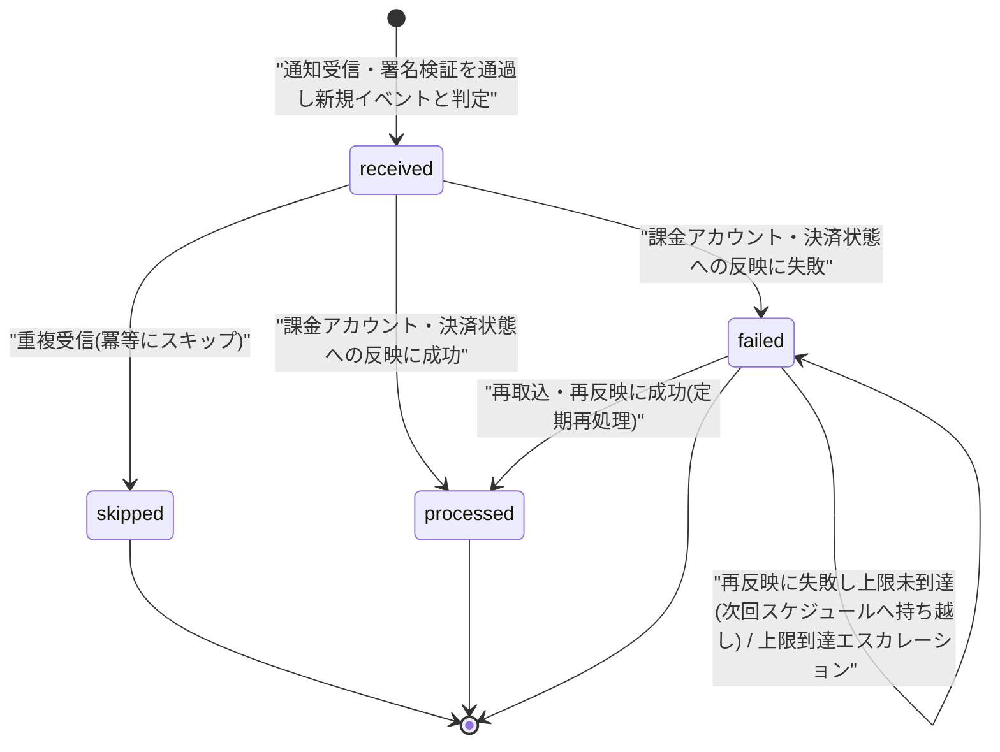

# STS-010: 課金Webhook取込状態遷移

> **この状態遷移図は「課金Webhook受信ログ(`T_BILLING_WEBHOOK_LOG`)の取込状態と、実装上の遷移契機・冪等判定・重複判定・再処理の実装粒度でのガード条件・更新操作・エラー時挙動」を定義します。**

*種別 状態遷移図 ・ ステータス ドラフト*

## 1. 目的

本状態遷移図は、課金プロバイダ(Stripe)から届く決済・課金アカウント状態の通知の受信・検証・取込を追跡する課金Webhook受信ログ(`T_BILLING_WEBHOOK_LOG`)の取込状態を対象とし、通知受信時の冪等判定・重複スキップ・課金アカウント状態への反映可否・反映失敗時の再処理という分岐を実装上いつ・どのガード条件で成立させるかを定義することを目的とする。状態名・遷移そのものの正本は [状態モデル §8.3](../../02_basic_design/08_state-model.md#83-webhook取込状態) であり、本書はその遷移を実装上いつ・誰が起こし、どのガード条件で成立し、Repository 更新がどう発生するかを詳細化する。

## 2. 対象データ・対象機能

状態を持つ対象データと、その状態が影響する対象機能・関連 ID(業務 UC / 関連 SCR・API・SYS・TBL)を示す。受信・検証・初回取込は Webhook 受信の Route Handler が起点となり、失敗分の再処理は定期スケジュールの Cron Triggers 起点バッチが担う。

| 対象データ | 対象機能 | 状態を持つ理由 | 状態によって変わる処理 |
|----|----|----|----|
| `T_BILLING_WEBHOOK_LOG`([TBL-032](../../02_basic_design/02_backend/04_database/TBL-032.md#TBL-032)) | 課金プロバイダ Webhook 受信([API-060](../../02_basic_design/02_backend/03_apis/API-060.md#API-060))/ 通知の受信・検証・取込([SYS-004](../../02_basic_design/02_backend/01_system/SYS-004.md#SYS-004))/ 取込失敗の再処理([SYS-033](../../02_basic_design/02_backend/01_system/SYS-033.md#SYS-033)) | 重複受信の検出と取込失敗の再処理対象を区別し、課金アカウント・決済状態への反映済み範囲を管理するため | 重複受信時の反映スキップ可否・失敗分の再処理抽出対象・上限到達時のエスカレーション要否を状態で切り替える |

対象機能の業務文脈は [UC-056](../../01_requirements/04_business_usecases/UC-056.md#UC-056)(通知受信・検証・再処理)に対応する。受信・検証・初回反映のシーケンスは [SEQ-108](../../02_basic_design/03_sequences/SEQ-108.md#SEQ-108) が示す。

## 3. 状態一覧

対象データが取りうる状態を [状態モデル §8.3](../../02_basic_design/08_state-model.md#83-webhook取込状態) に一致させて示す。状態値の物理定義(CHECK 制約)は対応テーブルの [`§コード値・区分値`](../../02_basic_design/02_backend/04_database/TBL-032.md#コード値区分値) を正本とする。

| 状態ID | 状態名 | 説明 | 初期状態 | 終了状態 | 備考 |
|----|----|----|----|----|----|
| S1 | `received` | [状態モデル §8.3](../../02_basic_design/08_state-model.md#83-webhook取込状態) | ◯ | — | 署名検証を通過し新規イベントと判定された時点の既定値([`status` DEFAULT `'received'`](../../02_basic_design/02_backend/04_database/TBL-032.md#カラム定義)) |
| S2 | `processed` | [状態モデル §8.3](../../02_basic_design/08_state-model.md#83-webhook取込状態) | — | ◯ | 課金アカウント・決済状態への反映が確定した終端 |
| S3 | `failed` | [状態モデル §8.3](../../02_basic_design/08_state-model.md#83-webhook取込状態) | — | — | 再処理対象。上限到達後も値は `failed` のまま(状態遷移ではなく通知のみで終端扱い) |
| S4 | `skipped` | [状態モデル §8.3](../../02_basic_design/08_state-model.md#83-webhook取込状態) | — | ◯ | 冪等性キー `(provider, event_id)` の重複判定で確定する終端 |

> [!NOTE]
> **`received` は「受信済み(未取込)」であり終端ではない。** 署名検証に失敗した通知は受信ログへ `signature_valid = 0` で記録するが `T_BILLING_WEBHOOK_LOG.status` の遷移対象外とし取込を開始しない([SYS-004](../../02_basic_design/02_backend/01_system/SYS-004.md#SYS-004) PR-01)。本書は署名検証を通過した受信ログの `status` 遷移のみを対象とする。

## 4. 状態遷移図

対象データの状態遷移を [状態モデル §8.3](../../02_basic_design/08_state-model.md#83-webhook取込状態) と一致させて図示する。`received` から重複判定で `skipped`、反映成否で `processed` / `failed` へ分岐し、`failed` は再処理バッチが定期的に拾って `processed` への再遷移または `failed` への持ち越しを繰り返す。

## 5. 状態遷移一覧

各遷移の実装上の契機・ガード条件・更新操作・実行可能ロール・エラー時挙動を示す。初回受信・判定は Workers 上の Webhook 用 Route Handler が同一リクエスト内で行い、失敗分の再処理は Cron Triggers 起点のバッチが別トランザクションで拾う。

| 現在状態 | イベント | 条件 | 次状態 | 実行処理 | 実行可能ロール | エラー時 | 備考 |
|----|----|----|----|----|----|----|----|
| (なし) | 通知受信・署名検証 | 送信元署名(HMAC-SHA256)の検証に成功する | `received` | 受信ログを新規作成し `signature_valid = 1`・`status` を既定 `'received'` で確定する([API-060](../../02_basic_design/02_backend/03_apis/API-060.md#API-060) P-01・P-03・Repository 作成あり) | 課金プロバイダ(外部システム。認可なし・署名検証のみ) | 署名検証失敗は受信ログへ `signature_valid = 0` で記録し `status` 遷移対象外とする(取込を開始しない)。401 を返す([API-060](../../02_basic_design/02_backend/03_apis/API-060.md#API-060) エラー一覧) | 検証失敗分は本書 §3 の対象外(遷移前に排除) |
| `received` | 重複受信の判定 | 冪等性キー `(provider, event_id)` が既存の受信ログと一致する。判定は [`uq_billing_wh_event`](../../02_basic_design/02_backend/04_database/TBL-032.md#インデックス) の一意制約違反を契機に行い、有効期間は受信ログの保持期間([システム仕様書](../../02_basic_design/07_system-spec.md#2-課金利用量上限))に準拠する | `skipped` | `status` を `skipped` へ更新し課金アカウント・サブスクリプション・請求書への反映を行わない(Repository 更新あり) | 課金プロバイダ(外部システム経由・Route Handler が自動判定) | 一意制約違反時は例外を捕捉し正常応答として扱う(冪等リプレイ。エラーではない)。同一イベントの再送は既存レコードの状態を変えない | 冪等性キー境界近傍(ほぼ同時到達)での一意制約違反時の競合解決・リトライ方式は実装で確定する |
| `received` | 課金アカウント・決済状態への反映成功 | 通知種別([API-060](../../02_basic_design/02_backend/03_apis/API-060.md#API-060) の列挙値)に応じた課金アカウント・サブスクリプション・請求書への更新が成功する | `processed` | `status` を `processed` へ更新し `processed_at` を記録する([SYS-004](../../02_basic_design/02_backend/01_system/SYS-004.md#SYS-004) PR-04・PR-05・Repository 更新あり) | 課金プロバイダ(外部システム経由・Route Handler が自動反映) | — | 反映先の状態遷移そのものは対象エンティティ側(課金アカウント §2 / サブスクリプション / 請求書)の状態モデルに従う |
| `received` | 課金アカウント・決済状態への反映失敗 | 通知内容に応じた更新処理が例外・タイムアウト等で完了しない | `failed` | `status` を `failed` へ更新し `error_detail` に失敗内容を記録する(Repository 更新あり)。同一トランザクション内で反映先(課金アカウント等)への部分更新はロールバックする([SYS-004](../../02_basic_design/02_backend/01_system/SYS-004.md#SYS-004) PR-06) | 課金プロバイダ(外部システム経由・Route Handler が自動記録) | 失敗記録後に運用者へ通知する([SYS-004](../../02_basic_design/02_backend/01_system/SYS-004.md#SYS-004) §5 取込失敗の運用通知) | `received` から `failed` への遷移確定と同一トランザクションで受信応答を返す(課金プロバイダ側の再送要否に影響するため) |
| `failed` | 再取込・再反映(定期再処理) | Cron Triggers が定期スケジュールで起動し、`status = 'failed'` を [`idx_billing_wh_status`](../../02_basic_design/02_backend/04_database/TBL-032.md#インデックス) で抽出した対象について再取込・再反映が成功する | `processed` | `status` を `processed` へ更新し `processed_at` を記録する([SYS-033](../../02_basic_design/02_backend/01_system/SYS-033.md#SYS-033) PR-02・PR-03・Repository 更新あり) | システム(Cron Triggers 起点バッチ。人手操作なし) | — | 実行間隔は [システム仕様書 §7](../../02_basic_design/07_system-spec.md#7-バッチ運用設計値)(15 分)。再処理対象の抽出単位は詳細設計で確定する |
| `failed` | 再取込・再反映が失敗し上限未到達 | 再反映が失敗し、再処理回数([TBL-032](../../02_basic_design/02_backend/04_database/TBL-032.md#TBL-032) `retry_count`)が上限回数([システム仕様書 §7](../../02_basic_design/07_system-spec.md#7-バッチ運用設計値) 5 回)未到達 | `failed` | `status` を `failed` のまま維持し `retry_count` をインクリメント、`error_detail` を最新の失敗内容へ更新する(Repository 更新あり) | システム(Cron Triggers 起点バッチ) | 次回スケジュールへ持ち越す(即時エスカレーションしない) | 再処理周期は [システム仕様書 §7](../../02_basic_design/07_system-spec.md#7-バッチ運用設計値)(15 分) |
| `failed` | 再取込・再反映が失敗し上限到達 | 再反映が失敗し、再処理回数([TBL-032](../../02_basic_design/02_backend/04_database/TBL-032.md#TBL-032) `retry_count`)が上限回数([システム仕様書 §7](../../02_basic_design/07_system-spec.md#7-バッチ運用設計値) 5 回)に到達する | `failed` | `status` を `failed` のまま維持する(状態遷移なし。Repository 更新なし) | システム(Cron Triggers 起点バッチ) | 運用者へエスカレーション通知する([SYS-033](../../02_basic_design/02_backend/01_system/SYS-033.md#SYS-033) PR-04) | `failed` は状態としては終端に遷移せず、通知のみで運用対応へ引き継ぐ |

## 6. 状態別の許可操作

状態ごとに許可・禁止する操作と、画面での表示制御を示す。本エンティティは運用者・システムのみが扱い、一般利用者向けの画面表示は持たない。

| 状態 | 許可操作 | 禁止操作 | 表示制御 | 備考 |
|----|----|----|----|----|
| `received` | 反映処理の実行(同一リクエスト内) | 手動での状態変更 | なし(利用者向け画面表示は行わない) | 受信直後の一時状態。長時間 `received` のまま残ることを想定しない |
| `processed` | 参照(保持期間内) | 再処理対象化 | なし | 保持期間経過後は物理削除対象([システム仕様書](../../02_basic_design/07_system-spec.md#2-課金利用量上限)) |
| `failed` | 定期再処理バッチによる再取込 | 一般操作からの手動再処理(MVP では画面提供なし) | なし(運用通知でのみ検知) | 再処理は [SYS-033](../../02_basic_design/02_backend/01_system/SYS-033.md#SYS-033) のみが起こす |
| `skipped` | 参照(保持期間内) | 再処理対象化 | なし | 冪等リプレイの記録として保持のみ |

## 7. 後続工程への引き継ぎ事項

テスト設計・詳細設計へ引き継ぐ観点(境界となる遷移・並行遷移時の競合・冪等性・再処理上限・異常系での状態確定)を示す。

| 引き継ぎ先 | 観点 | 内容 |
|----|----|----|
| テスト設計 | 遷移網羅 | `received → skipped`(重複)・`received → processed`(反映成功)・`received → failed`(反映失敗)・`failed → processed`(再処理成功)・`failed → failed`(再処理失敗・上限未到達 / 上限到達)を検証観点として引き継ぐ |
| テスト設計 | 冪等性 | 冪等性キー `(provider, event_id)` の重複判定で `skipped` に確定し、課金アカウント・サブスクリプション・請求書へ二重反映されないことを検証する |
| テスト設計 | 異常系での状態確定 | 反映失敗時に受信ログを `failed` で確定しつつ反映先への部分更新をロールバックすること、署名検証失敗分が `status` 遷移の対象外となることを検証する |
| 詳細設計 | 競合制御 | 冪等性キー境界近傍(ほぼ同時到達)での一意制約違反時の競合解決・リトライ方式を実装で確定する([SEQ-108](../../02_basic_design/03_sequences/SEQ-108.md#SEQ-108) 詳細設計への移管候補) |
