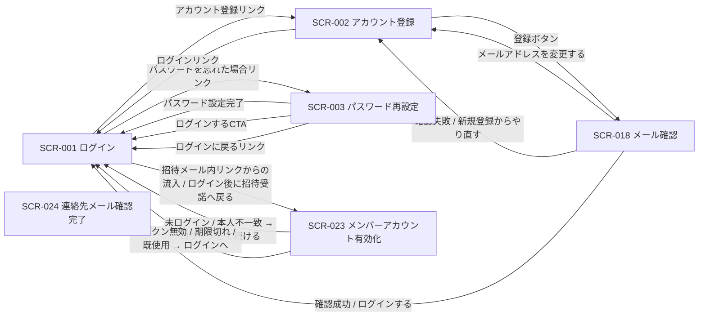

# STR-001: 未認証者 認証フロー 画面遷移

> **本遷移図は、未認証の利用者がログイン・新規登録・パスワード再設定・メール確認・招待受諾・連絡先メール確認を行う認証系画面群の導線と例外遷移を定義します。**

*種別 画面遷移図 ・ ステータス ドラフト*

| 遷移図ID | 業務ユースケースID | 対応画面 |
|----|----|----|
| STR-001 | [UC-001](../../01_requirements/04_business_usecases/UC-001.md#UC-001) ・ [UC-002](../../01_requirements/04_business_usecases/UC-002.md#UC-002) ・ [UC-003](../../01_requirements/04_business_usecases/UC-003.md#UC-003) ・ [UC-004](../../01_requirements/04_business_usecases/UC-004.md#UC-004) ・ [UC-005](../../01_requirements/04_business_usecases/UC-005.md#UC-005) ・ [UC-006](../../01_requirements/04_business_usecases/UC-006.md#UC-006) ・ [UC-007](../../01_requirements/04_business_usecases/UC-007.md#UC-007) | [SCR-001](../../02_basic_design/01_frontend/01_screens/SCR-001.md#SCR-001) [SCR-002](../../02_basic_design/01_frontend/01_screens/SCR-002.md#SCR-002) [SCR-003](../../02_basic_design/01_frontend/01_screens/SCR-003.md#SCR-003) [SCR-018](../../02_basic_design/01_frontend/01_screens/SCR-018.md#SCR-018) [SCR-023](../../02_basic_design/01_frontend/01_screens/SCR-023.md#SCR-023) [SCR-024](../../02_basic_design/01_frontend/01_screens/SCR-024.md#SCR-024) |

## 1. 目的

本遷移図は、未認証の利用者がログイン画面を起点に、新規登録・パスワード再設定・メール確認・招待受諾・連絡先メール確認の各画面へ移動し、認証済み状態(または再送・やり直し)へ到達するまでの業務横断の導線と例外遷移を集約する。

## 2. 対象ロール

本遷移図が対象とするロールを示す。ロールの正式名は [用語集](../../01_requirements/00_glossary.md#GLO-001) を参照する。

| ロール | 対象 | 備考 |
|----|----|----|
| 未認証ユーザー | ◯ | ログイン・新規登録・パスワード再設定・メール確認の起点 |
| 招待されたユーザー(本人) | ◯ | 招待受諾はログイン済み本人を前提とする |
| オーナー | △ | 連絡先メール確認は所有権者であればロール不問(招待受諾以外の認証系導線の対象外) |
| メンバー | △ | 連絡先メール確認は所有権者であればロール不問(招待受諾以外の認証系導線の対象外) |

## 3. 画面一覧

本遷移図に登場する画面を示す。各画面の詳細は `SCR-NNN` を参照する。

| 画面ID | 画面名 | 概要 | 利用可能ロール | 備考 |
|----|----|----|----|----|
| [SCR-001](../../02_basic_design/01_frontend/01_screens/SCR-001.md#SCR-001) | ログイン | メールアドレスとパスワードで本人確認する | 未認証ユーザー | 起点画面 |
| [SCR-002](../../02_basic_design/01_frontend/01_screens/SCR-002.md#SCR-002) | アカウント登録 | 表示名・メールアドレス・パスワードでアカウントを新規作成する | 未認証ユーザー | 独立サインアップ |
| [SCR-003](../../02_basic_design/01_frontend/01_screens/SCR-003.md#SCR-003) | パスワード再設定 | 再設定リンク送信と新しいパスワード設定の2段階 | 未認証ユーザー | — |
| [SCR-018](../../02_basic_design/01_frontend/01_screens/SCR-018.md#SCR-018) | メール確認 | 新規登録後の確認メールリンクから本人確認する | 未認証ユーザー | — |
| [SCR-023](../../02_basic_design/01_frontend/01_screens/SCR-023.md#SCR-023) | メンバーアカウント有効化 | 招待受諾によりプロジェクトへの割当を有効化する | 招待されたユーザー(本人) | 受諾はログイン済み本人限定 |
| [SCR-024](../../02_basic_design/01_frontend/01_screens/SCR-024.md#SCR-024) | 連絡先メール確認完了 | プロジェクト連絡先メールの所有権を確認する | 対象ユーザー(トークン) | ロール不問(所有権者) |

## 4. 画面遷移図

未認証者を起点とする認証系画面群の業務横断の導線を示す(全画面共通グローバルナビは省略)。

## 5. 画面遷移一覧

§4 の各遷移を定義する。全画面共通グローバルナビは省略する。

| 遷移元画面 | 操作 | 条件 | 遷移先画面 | 遷移不可時 | 備考 |
|----|----|----|----|----|----|
| SCR-001 | 「アカウント登録」リンクを押下 | — | SCR-002 | — | — |
| SCR-001 | 「パスワードを忘れた場合」リンクを押下 | — | SCR-003 | — | — |
| SCR-002 | 「登録する」ボタンを押下 | 入力検証を満たす | SCR-018 | 検証違反時は現画面に留まる | メール重複時は現画面にエラー表示 |
| SCR-002 | 「ログイン」リンクを押下 | — | SCR-001 | — | — |
| SCR-003 | 「新しいパスワードを設定する」を押下 | 再設定リンクが有効・入力検証を満たす | SCR-001 | リンク無効 / 期限切れ時は §6 例外へ | 成功時は全セッション失効 |
| SCR-003 | 「ログインする」ボタンを押下(設定完了後) | 設定完了済み | SCR-001 | — | — |
| SCR-003 | 「ログインに戻る」リンクを押下 | — | SCR-001 | — | 段階1からの離脱 |
| SCR-018 | 「メールアドレスを変更する」リンクを押下 | — | SCR-002 | — | — |
| SCR-018 | 「新規登録からやり直す」ボタンを押下 | 確認失敗(期限切れ・使用済み) | SCR-002 | — | — |
| SCR-018 | 「ログインする」ボタンを押下 | 確認成功 | SCR-001 | — | — |
| SCR-023 | 招待メール内リンクを開く | 招待受諾用トークンを保持 | SCR-023 | トークン無効 / 期限切れ / 既使用時は §6 例外へ | 未ログイン時は SCR-001 を経由 |
| SCR-023 | 「ログインして続ける」を押下(未ログイン時) | — | SCR-001 | — | ログイン後に SCR-023 へ復帰 |
| SCR-023 | 「ログインし直す」を押下(本人不一致時) | 招待先メールと不一致 | SCR-001 | — | 招待先メール本人での再ログインを促す |
| SCR-023 | 「参加を受諾する」を押下 | ログイン済み・本人一致 | SCR-023(受諾完了状態) | トークン無効 / 期限切れ / 既使用時は §6 例外へ | 受諾完了後はダッシュボードへ進むボタンを表示(プロジェクトワークスペース側の導線) |
| SCR-024 | プロジェクト連絡先メール確認リンクを開く | 連絡先確認用トークンを保持 | SCR-024 | トークン無効 / 期限切れ / 既使用時は現画面にメッセージ表示 | 遷移先を持たない(結果表示のみ) |

## 6. 例外時の遷移

セッション・権限・境界違反等の例外導線を集約する。状態の意味は [状態モデル](../../02_basic_design/08_state-model.md) を参照する。

| 発生条件 | 遷移先 | 表示内容 | 備考 |
|----|----|----|----|
| ログイン失敗の連続によるロックアウト | SCR-001(現画面) | ロックアウト警告 | 解除条件は [システム仕様書 §3](../../02_basic_design/07_system-spec.md#3-タイムアウトセッション認証) を参照 |
| アカウント状態が停止中 | SCR-001(現画面) | 利用制限中の旨 | アカウント状態は [状態モデル §1](../../02_basic_design/08_state-model.md#1-アカウント状態) を参照 |
| パスワード再設定リンクが無効 / 期限切れ | SCR-003(段階2・エラー状態) | リンク無効 / 期限切れ案内と再送導線 | — |
| メール確認リンクが無効 / 期限切れ / 使用済み | SCR-018(確認失敗状態) | 確認できない旨と新規登録やり直し導線 | — |
| 招待受諾トークンが無効 / 期限切れ | SCR-023(エラー状態) | トークン無効 / 期限切れ案内とログイン画面への導線 | — |
| 招待受諾トークンが使用済み | SCR-023(エラー状態) | 既使用案内とログイン画面への導線 | — |
| 招待受諾時の本人不一致(別アカウントでログイン中) | SCR-023(エラー状態) | 本人不一致案内とログインし直す導線 | 招待先メール本人での再認証を要求 |
| 連絡先メール確認トークンが無効 / 期限切れ | SCR-024(現画面) | トークン期限切れ / 無効メッセージ | 遷移先を持たない結果表示 |
| 連絡先メール確認トークンが使用済み | SCR-024(現画面) | 既使用メッセージ | 遷移先を持たない結果表示 |
| 既に有効なセッションを保有した状態での SCR-001 再訪問 | ダッシュボード相当画面 | — | 本人確認手順を省略(SCR-001 §7 EVT-01) |

## 7. 後続工程への引き継ぎ事項

- 正常導線(ログイン成功 / 新規登録から確認完了 / パスワード再設定完了 / 招待受諾完了 / 連絡先メール確認完了)と、各例外導線(ロックアウト・リンク無効 / 期限切れ・使用済み・本人不一致)の双方をテストケースとして網羅する。
- SCR-023 の招待受諾完了後の遷移先(ダッシュボード)は、プロジェクトワークスペース系の画面遷移図(オーナー / メンバー導線)側で定義する範囲であり、本書では認証系画面群からの離脱点として扱う。
- SCR-024 の到達者はロール不問(連絡先メールアドレスの所有権者)であり、認証済み / 未認証を問わず単独ページとして機能する点をテスト観点に含める。
