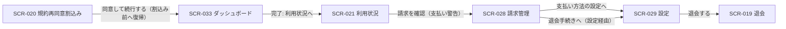

# STR-002: オーナー アカウント・課金管理 画面遷移

> **本遷移図は、オーナーがダッシュボードを起点に自分の作成したプロジェクト全体の利用状況・請求管理・支払方法・退会を確認・操作する画面群の導線と、規約再同意割込み・サスペンション時の例外遷移を定義します。**

*種別 画面遷移図 ・ ステータス ドラフト*

| 遷移図ID | 業務ユースケースID | 対応画面 |
|----|----|----|
| STR-002 | [UC-032](../../01_requirements/04_business_usecases/UC-032.md#UC-032) ・ [UC-035](../../01_requirements/04_business_usecases/UC-035.md#UC-035) ・ [UC-036](../../01_requirements/04_business_usecases/UC-036.md#UC-036) ・ [UC-037](../../01_requirements/04_business_usecases/UC-037.md#UC-037) ・ [UC-013](../../01_requirements/04_business_usecases/UC-013.md#UC-013) ・ [UC-022](../../01_requirements/04_business_usecases/UC-022.md#UC-022) ・ [UC-081](../../01_requirements/04_business_usecases/UC-081.md#UC-081) | [SCR-033](../../02_basic_design/01_frontend/01_screens/SCR-033.md#SCR-033) [SCR-021](../../02_basic_design/01_frontend/01_screens/SCR-021.md#SCR-021) [SCR-028](../../02_basic_design/01_frontend/01_screens/SCR-028.md#SCR-028) [SCR-029](../../02_basic_design/01_frontend/01_screens/SCR-029.md#SCR-029) [SCR-019](../../02_basic_design/01_frontend/01_screens/SCR-019.md#SCR-019) [SCR-020](../../02_basic_design/01_frontend/01_screens/SCR-020.md#SCR-020) |

## 1. 目的

本遷移図は、オーナーがダッシュボードを起点に利用状況・請求管理・支払方法・退会の各画面を横断して自分の課金状況を把握・管理する導線と、規約再同意割込みやサスペンション・退会済みなどアカウント状態に起因する例外遷移を集約する。

## 2. 対象ロール

本遷移図が対象とするロールを示す。ロールの正式名は [用語集](../../01_requirements/00_glossary.md#GLO-001) を参照する。

| ロール | 対象 | 備考 |
|----|----|----|
| オーナー | ◯ | 自分が作成したプロジェクト全体の利用状況・請求・支払方法・退会を扱う本導線の主対象 |
| メンバー | △ | ダッシュボード(SCR-033)・設定(SCR-029)の一部・退会(SCR-019)・規約再同意割込み(SCR-020)は利用できるが、利用状況(SCR-021)・請求管理(SCR-028)・支払方法セクションはオーナー専有のため対象外 |

## 3. 画面一覧

本遷移図に登場する画面を示す。各画面の詳細は `SCR-NNN` を参照する。

| 画面ID | 画面名 | 概要 | 利用可能ロール | 備考 |
|----|----|----|----|----|
| [SCR-033](../../02_basic_design/01_frontend/01_screens/SCR-033.md#SCR-033) | ダッシュボード | Myプロジェクト / Joinプロジェクトの一覧とセットアップ進捗 / KPI 表示 | オーナー / メンバー | 起点画面 |
| [SCR-021](../../02_basic_design/01_frontend/01_screens/SCR-021.md#SCR-021) | 利用状況 | 自分が作成したプロジェクト全体の当月利用状況スナップショット | オーナー | 読み取り専用 |
| [SCR-028](../../02_basic_design/01_frontend/01_screens/SCR-028.md#SCR-028) | 請求管理 | 当月請求見込み・支払方法・請求履歴 | オーナー | — |
| [SCR-029](../../02_basic_design/01_frontend/01_screens/SCR-029.md#SCR-029) | 設定 | 支払い方法セクション(オーナーのみ)・危険な操作セクション | オーナー / メンバー | 支払い方法セクションはオーナーのみ表示 |
| [SCR-019](../../02_basic_design/01_frontend/01_screens/SCR-019.md#SCR-019) | 退会 | アカウントの即時退会(影響提示 / 再認証 / 確定) | オーナー / メンバー | — |
| [SCR-020](../../02_basic_design/01_frontend/01_screens/SCR-020.md#SCR-020) | 規約再同意割込み | 利用規約 / プライバシーポリシー改定時の再同意割込み | オーナー / メンバー | 全ロール共通の割込み画面 |

## 4. 画面遷移図

オーナーを主対象とするアカウント・課金管理系画面群の業務横断の導線を示す(全画面共通グローバルナビは省略)。

## 5. 画面遷移一覧

§4 の各遷移を定義する。全画面共通グローバルナビは省略する。

| 遷移元画面 | 操作 | 条件 | 遷移先画面 | 遷移不可時 | 備考 |
|----|----|----|----|----|----|
| SCR-033 | 完了状態で「利用状況へ」を押下 | オーナー・セットアップ完了 | SCR-021 | — | メンバーには当該導線を表示しない |
| SCR-021 | 「請求を確認」を押下 | 支払方法未登録または支払い失敗時のバナー表示中 | SCR-028 | — | — |
| SCR-021 | 「プロジェクトへ」を押下 | 作成したプロジェクトが 0 件 | SCR-004(プロジェクト・本書対象外) | — | プロジェクトワークスペース系遷移図の対象 |
| SCR-028 | 「利用量と上限を確認」を押下 | — | SCR-026(利用量と上限・本書対象外) | — | プロジェクト単位設定系遷移図の対象 |
| SCR-028 | 「支払い方法の設定へ」を押下(本体 / バナー CTA いずれも) | — | SCR-029(支払い方法セクション) | — | — |
| SCR-028 | 「退会手続きへ」を押下 | 退会済みでない | SCR-029(危険な操作セクション) | 退会済み時は本導線を表示しないため遷移不可 | SCR-029 経由で SCR-019 へ進む |
| SCR-029 | 「支払い方法を登録・変更」を押下 | オーナー・再認証成功 | SCR-029(現画面・更新後表示) | 再認証失敗時は現画面に留まる | 画面遷移を伴わない更新 |
| SCR-029 | 「退会する」を押下 | 退会済みでない | SCR-019 | 退会済み時は本導線を表示しないため遷移不可 | — |
| SCR-019 | 「個人設定へ戻る」を押下 | — | SCR-022(個人設定・本書対象外) | — | 認証系画面群の遷移図の対象 |
| SCR-019 | 「退会を確定する」を押下 | 登録メールアドレス一致・再認証成功 | SCR-022(個人設定・本書対象外) | 検証違反 / 再認証失敗時は現画面(確認ダイアログ)に留まる | 退会確定後はアカウントが `withdrawn` へ移行 |
| SCR-020 | 「同意して続行する」を押下 | 改定対象の全チェック充足 | 割込み前の画面(SCR-033 等) | 未充足時はボタン非活性 | 割込み発生元の画面へ復帰 |

## 6. 例外時の遷移

セッション・権限・境界違反等の例外導線を集約する。状態の意味は [状態モデル](../../02_basic_design/08_state-model.md) を参照する。

| 発生条件 | 遷移先 | 表示内容 | 備考 |
|----|----|----|----|
| ログイン後に未同意の改定文書がある | SCR-020 | 改定内容の確認と再同意の割込み | 全画面モーダル。同意完了で割込み前の操作へ復帰 |
| 課金アカウントがサスペンション中 | SCR-001(ログイン) | サスペンション中の利用制限案内 | 課金アカウント状態は [状態モデル §2](../../02_basic_design/08_state-model.md#2-課金アカウント状態) を参照。エラー応答は [ERR-004](../../02_basic_design/05_errors/ERR-004.md#ERR-004) |
| アカウントが退会済み(`withdrawn`)で請求情報閲覧以外を要求 | SCR-028(閲覧専用) | 退会済みのため請求情報の閲覧のみ可能である旨 | アカウント状態は [状態モデル §2](../../02_basic_design/08_state-model.md#2-課金アカウント状態) を参照。エラー応答は [ERR-034](../../02_basic_design/05_errors/ERR-034.md#ERR-034)。SCR-028/SCR-029 とも支払方法変更・退会導線を非表示化して閲覧専用化する |
| セッション切れ | SCR-001(ログイン) | 再ログイン要求 | — |

## 7. 後続工程への引き継ぎ事項

- 正常導線(ダッシュボード → 利用状況 → 請求管理 → 設定 → 退会)と、各例外導線(規約再同意割込み・サスペンション・退会済み閲覧専用化)の双方をテストケースとして網羅する。
- 退会確定(SCR-019 EVT-03)によりアカウント状態が `withdrawn` へ移行した直後の再訪問時に、SCR-028・SCR-029 が閲覧専用化される境界条件をテスト観点に含める。
- SCR-033 からのプロジェクト系画面(SCR-004 等)・SCR-021/SCR-028 からのプロジェクト単位設定画面(SCR-026 等)への遷移は、それぞれ別の画面遷移図(プロジェクトワークスペース系)の対象として本書では起点表記のみとする。
