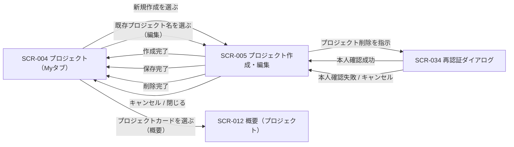

# STR-003: オーナー プロジェクト管理 画面遷移

> **本遷移図はオーナーがMyプロジェクト一覧を起点にプロジェクトを作成・編集・削除し、概要画面へ至るまでの画面導線と例外遷移を定義します。**

*種別 画面遷移図 ・ ステータス ドラフト*

| 遷移図ID | 業務ユースケースID | 対応画面 |
|----|----|----|
| STR-003 | [UC-014](../../01_requirements/04_business_usecases/UC-014.md#UC-014) ・ [UC-015](../../01_requirements/04_business_usecases/UC-015.md#UC-015) ・ [UC-016](../../01_requirements/04_business_usecases/UC-016.md#UC-016) ・ [UC-017](../../01_requirements/04_business_usecases/UC-017.md#UC-017) | [SCR-004](../../02_basic_design/01_frontend/01_screens/SCR-004.md#SCR-004) [SCR-005](../../02_basic_design/01_frontend/01_screens/SCR-005.md#SCR-005) [SCR-034](../../02_basic_design/01_frontend/01_screens/SCR-034.md#SCR-034) [SCR-012](../../02_basic_design/01_frontend/01_screens/SCR-012.md#SCR-012) |

## 1. 目的

本遷移図は、オーナーがMyプロジェクト一覧を起点に、新規作成・既存プロジェクトの編集(削除を含む)・概要確認へ進むまでの画面横断の導線と例外遷移を集約する。

## 2. 対象ロール

本遷移図が対象とするロールを示す。ロールの正式名は [用語集](../../01_requirements/00_glossary.md#GLO-001) を参照する。

| ロール | 対象 | 備考 |
|----|----|----|
| オーナー | ◯ | Myプロジェクトの作成・編集・削除の全権者 |
| メンバー | — | 本導線の対象外(新規作成・編集・削除はオーナー専有) |

## 3. 画面一覧

本遷移図に登場する画面を示す。各画面の詳細は `SCR-NNN` を参照する。

| 画面ID | 画面名 | 概要 | 利用可能ロール | 備考 |
|----|----|----|----|----|
| [SCR-004](../../02_basic_design/01_frontend/01_screens/SCR-004.md#SCR-004) | プロジェクト | Myプロジェクト / Joinプロジェクトの一覧 | オーナー / メンバー | 起点画面。Myタブのみ本遷移図の対象 |
| [SCR-005](../../02_basic_design/01_frontend/01_screens/SCR-005.md#SCR-005) | プロジェクト作成・編集 | 作成・編集・削除の全画面割込みモーダル | オーナー | 削除は削除確認名称入力による確認操作を経る |
| [SCR-034](../../02_basic_design/01_frontend/01_screens/SCR-034.md#SCR-034) | 再認証ダイアログ | 重要操作前の本人確認 | オーナー / メンバー | プロジェクト削除時に割込み |
| [SCR-012](../../02_basic_design/01_frontend/01_screens/SCR-012.md#SCR-012) | 概要 | 選択中プロジェクトの概要 | オーナー / メンバー | 一覧からプロジェクトを選択した遷移先 |

## 4. 画面遷移図

ロール別・業務横断の導線を示す(全画面共通グローバルナビは省略)。

## 5. 画面遷移一覧

§4 の各遷移を定義する。全画面共通グローバルナビは省略する。

| 遷移元画面 | 操作 | 条件 | 遷移先画面 | 遷移不可時 | 備考 |
|----|----|----|----|----|----|
| SCR-004 | 「+ 新規プロジェクトを作成」を選ぶ | Myタブ表示中 | SCR-005（新規作成モード） | — | — |
| SCR-004 | 既存プロジェクト名を選ぶ | Myタブ表示中・当該プロジェクトのオーナー | SCR-005（編集モード） | 取得失敗時はエラーをトーストで表示しモーダルを閉じる | — |
| SCR-004 | プロジェクトカードの「概要を開く」を選ぶ | 有効な割当を持つ | SCR-012 | 割当なしは §6 例外へ | Myタブ / Joinタブ共通 |
| SCR-005 | 「プロジェクトを作成」を確定する | 入力検証を満たす | SCR-004 | 検証違反・重複名は現モーダルに留まる | 作成後は自分のMyプロジェクト一覧へ反映 |
| SCR-005 | 「保存」を確定する | 入力検証を満たす | SCR-004 | 検証違反時は現モーダルに留まる | 連絡先メール変更時は確認待ちに遷移（モーダルは維持） |
| SCR-005 | 「プロジェクトを削除」を押下する | 削除確認名称が現プロジェクト名と完全一致 | SCR-034 | 一致しない場合は削除ボタンが無効のまま遷移しない | 削除対象と影響の内容はSCR-005内の削除確認名称入力欄で確認する |
| SCR-034 | 本人確認を完了する | 再認証成功 | SCR-005 | — | 呼出元の削除操作を続行しプロジェクトを削除する |
| SCR-034 | キャンセル、または本人確認に失敗する | — | SCR-005 | 削除を中断し編集モーダルへ戻る | プロジェクトは削除されない |
| SCR-005 | 削除が完了する | 本人確認成功後の削除処理成功 | SCR-004 | — | 一覧から当該プロジェクトが除かれる |
| SCR-005 | 「キャンセル」または「×」を押下する | 未保存の変更がある場合は離脱確認で破棄を選ぶ | SCR-004 | 未保存の変更を維持する場合はモーダルに留まる | — |

## 6. 例外時の遷移

セッション・権限・境界違反等の例外導線を集約する。状態の意味は [状態モデル](../../02_basic_design/08_state-model.md) を参照する。

| 発生条件 | 遷移先 | 表示内容 | 備考 |
|----|----|----|----|
| セッション切れ | SCR-001 | 再ログイン要求 | — |
| プロジェクト境界違反（所有境界を満たさないオーナー操作） | 404 相当 | リソース非存在を偽装 | 判定は [PERM-005](../../02_basic_design/04_permissions/PERM-005.md#PERM-005) |
| プロジェクト境界違反（割当なしの部外者による概要参照） | 404 相当 | リソース非存在を偽装 | 判定は [PERM-005](../../02_basic_design/04_permissions/PERM-005.md#PERM-005) |
| 非オーナー（メンバー）によるオーナー専有機能（新規作成 / 編集 / 削除）の要求 | 403 相当 | 権限不足を表示 | 境界通過後の操作権限判定 |
| プロジェクト削除時の再認証トークン無効・未提示 | SCR-005 | 再認証を再度要求 | — |

## 7. 後続工程への引き継ぎ事項

- 網羅すべき遷移パターン: 新規作成の正常導線、編集の正常導線、削除の正常導線（削除確認名称一致→再認証成功→削除完了）、削除の例外導線（削除確認名称不一致で削除不可・再認証失敗/キャンセルで削除中断）、Myタブ / Joinタブでの導線差異（新規作成・編集・削除はMyタブのみ）。
- SCR-005の削除確認名称入力欄がUC-017における「削除対象と関連データの取扱いの提示」に相当するが、削除対象・影響範囲（メンバー割当解除・アカウント利用停止対象等）を明示的に一覧表示する項目はSCR-005の画面項目に定義がない。表示内容の要否は上流（SCR-005）で要確認。
