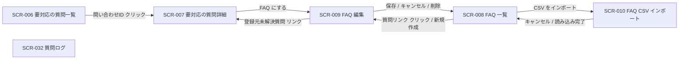

# STR-004: オーナー/メンバー FAQ運用 画面遷移

> **本遷移図はオーナー/メンバーが要対応の質問への対応から FAQ の整備(作成・編集・削除・一括操作・CSV入出力)・質問ログの参照までを行う、FAQ 運用の中核となる画面導線と例外遷移を定義します。**

*種別 画面遷移図 ・ ステータス ドラフト*

| 遷移図ID | 業務ユースケースID | 対応画面 |
|----|----|----|
| STR-004 | [UC-074](../../01_requirements/04_business_usecases/UC-074.md#UC-074) | [SCR-006](../../02_basic_design/01_frontend/01_screens/SCR-006.md#SCR-006) [SCR-007](../../02_basic_design/01_frontend/01_screens/SCR-007.md#SCR-007) [SCR-008](../../02_basic_design/01_frontend/01_screens/SCR-008.md#SCR-008) [SCR-009](../../02_basic_design/01_frontend/01_screens/SCR-009.md#SCR-009) [SCR-010](../../02_basic_design/01_frontend/01_screens/SCR-010.md#SCR-010) [SCR-032](../../02_basic_design/01_frontend/01_screens/SCR-032.md#SCR-032) |

## 1. 目的

本遷移図は、オーナー/メンバーが要対応の質問一覧を起点に質問への対応・FAQ 化を行い、FAQ 一覧での整備(作成・編集・削除・一括操作・CSV インポート/エクスポート)と質問ログの参照までを行う、FAQ 運用の業務横断の導線と例外遷移を集約する。

## 2. 対象ロール

本遷移図が対象とするロールを示す。ロールの正式名は [用語集](../../01_requirements/00_glossary.md#GLO-001) を参照する。

| ロール | 対象 | 備考 |
|----|----|----|
| オーナー | ◯ | 対象プロジェクトの作成者。FAQ 運用の操作権限はメンバーと同一 |
| メンバー | ◯ | 対象プロジェクトへの有効な割当を持つ利用者。FAQ 運用の操作権限はオーナーと同一 |

## 3. 画面一覧

本遷移図に登場する画面を示す。各画面の詳細は `SCR-NNN` を参照する。

| 画面ID | 画面名 | 概要 | 利用可能ロール | 備考 |
|----|----|----|----|----|
| [SCR-006](../../02_basic_design/01_frontend/01_screens/SCR-006.md#SCR-006) | 要対応の質問一覧 | AI が回答できなかった質問・未解決とフィードバックされた質問の一覧 | オーナー / メンバー | 起点画面 |
| [SCR-007](../../02_basic_design/01_frontend/01_screens/SCR-007.md#SCR-007) | 要対応の質問詳細 | 未解決質問 1 件の内容・応答ログ・対応状況 | オーナー / メンバー | — |
| [SCR-008](../../02_basic_design/01_frontend/01_screens/SCR-008.md#SCR-008) | FAQ一覧 | FAQ の検索・絞り込み・一括操作・CSV 入出力 | オーナー / メンバー | — |
| [SCR-009](../../02_basic_design/01_frontend/01_screens/SCR-009.md#SCR-009) | FAQ編集 | FAQ 1 件の新規作成・編集・削除 | オーナー / メンバー | — |
| [SCR-010](../../02_basic_design/01_frontend/01_screens/SCR-010.md#SCR-010) | FAQ CSVインポート | FAQ の CSV 一括登録モーダル | オーナー / メンバー | 全画面割込みモーダル |
| [SCR-032](../../02_basic_design/01_frontend/01_screens/SCR-032.md#SCR-032) | 質問ログ | 質問ログのキーワード / 期間 / 回答状態での検索 | オーナー / メンバー | 参照専用(独立導線) |

## 4. 画面遷移図

ロール別・業務横断の導線を示す(全画面共通グローバルナビは省略)。

## 5. 画面遷移一覧

§4 の各遷移を定義する。全画面共通グローバルナビは省略する。

| 遷移元画面 | 操作 | 条件 | 遷移先画面 | 遷移不可時 | 備考 |
|----|----|----|----|----|----|
| SCR-006 | 問い合わせ ID リンクを押下 | 対象プロジェクトの関係者 | SCR-007 | — | — |
| SCR-007 | 「FAQ にする」を押下 | 対象プロジェクトの関係者 | SCR-009(新規作成・未解決質問起点) | — | 質問文を新規フォームへ反映 |
| SCR-009 | 「登録元未解決質問」リンクを押下 | 登録元の未解決質問が存在する | SCR-007 | 登録元が存在しない場合はリンク非表示 | 新規作成(未解決質問起点)時のみ表示 |
| SCR-008 | 質問リンクを押下 | 対象プロジェクトの関係者 | SCR-009(編集モード) | — | — |
| SCR-008 | 「+ 新規作成」を押下(通常時 / 空状態時) | 対象プロジェクトの関係者 | SCR-009(新規モード) | — | — |
| SCR-009 | 「保存」を押下し成功 | §5 バリデーションを満たす | SCR-008 | 版衝突・件数上限超過時は現画面に留まる | — |
| SCR-009 | 「削除」を確認ダイアログで確定 | 既存 FAQ 編集時 | SCR-008 | 失敗時は現画面に留まる | — |
| SCR-009 | 「キャンセル」を押下 | 未保存変更なし、またはキャンセル確認ダイアログで確定 | SCR-008 | — | — |
| SCR-008 | 「CSV をインポート」を押下 | 対象プロジェクトの関係者 | SCR-010 | — | 全画面割込みモーダルで開く |
| SCR-010 | 「キャンセル」/「×」を押下(処理中でない) | — | SCR-008 | 処理中は中断確認ダイアログを経由 | — |
| SCR-010 | 取込ボタンを押下し完了(全件成功 / 部分失敗) | §5 バリデーションを満たす | SCR-008 | ジョブ異常終了・タイムアウト時は現画面に留まる | 成功分を FAQ 一覧へ反映 |

## 6. 例外時の遷移

セッション・権限・境界違反等の例外導線を集約する。状態の意味は [状態モデル](../../02_basic_design/08_state-model.md) を参照する。

| 発生条件 | 遷移先 | 表示内容 | 備考 |
|----|----|----|----|
| セッション切れ | SCR-001 | 再ログイン要求 | — |
| プロジェクト境界違反(部外者・割当なし) | 404 相当 | リソース非存在を偽装 | 判定は [PERM-005](../../02_basic_design/04_permissions/PERM-005.md#PERM-005) |
| SCR-009 保存時の版衝突(楽観ロック) | SCR-009(現画面) | 版衝突ダイアログを表示し最新読込 / 編集継続を選択させる | 遷移は発生しない |
| SCR-010 取込中の中断操作 | SCR-008 | 中断確認ダイアログ経由でモーダルを閉じる | 処理中でない場合は確認なしで遷移 |

## 7. 後続工程への引き継ぎ事項

- 実装・テスト設計で網羅すべき遷移パターンとして、正常導線(SCR-006→SCR-007→SCR-009→SCR-008、SCR-008⇄SCR-009、SCR-008⇄SCR-010)と例外導線(版衝突・取込中断・境界違反)の双方を対象とする。
- SCR-007 と SCR-009 の間で「FAQ にする」/「登録元未解決質問」リンクによる双方向導線があるため、往復後の画面状態(未保存変更の有無等)の確認観点をテスト設計に含める。
- SCR-032(質問ログ)は本遷移図内の他画面からの直接導線を持たない参照専用画面であり、プロジェクトワークスペースの共通ナビゲーション経由での到達を前提とする。
