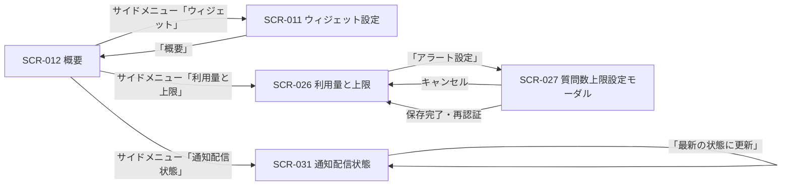

# STR-005: オーナー ウィジェット・上限設定 画面遷移

> **本遷移図はオーナー / メンバーがプロジェクト単位でウィジェット設定・質問数上限設定・通知配信状態を確認・変更する画面導線と例外遷移を定義します。**

*種別 画面遷移図 ・ ステータス ドラフト*

| 遷移図ID | 業務ユースケースID | 対応画面 |
|----|----|----|
| STR-005 | [UC-038](../../01_requirements/04_business_usecases/UC-038.md#UC-038) ・ [UC-039](../../01_requirements/04_business_usecases/UC-039.md#UC-039) ・ [UC-075](../../01_requirements/04_business_usecases/UC-075.md#UC-075) ・ [UC-033](../../01_requirements/04_business_usecases/UC-033.md#UC-033) ・ [UC-034](../../01_requirements/04_business_usecases/UC-034.md#UC-034) ・ [UC-077](../../01_requirements/04_business_usecases/UC-077.md#UC-077) | [SCR-011](../../02_basic_design/01_frontend/01_screens/SCR-011.md#SCR-011) [SCR-026](../../02_basic_design/01_frontend/01_screens/SCR-026.md#SCR-026) [SCR-027](../../02_basic_design/01_frontend/01_screens/SCR-027.md#SCR-027) [SCR-031](../../02_basic_design/01_frontend/01_screens/SCR-031.md#SCR-031) |

## 1. 目的

本遷移図は、オーナー / メンバーがプロジェクト概要を起点に、ウィジェット設定(鍵ローテーション・AI しきい値を含む)・質問数上限設定・通知配信状態の各設定系画面へ進み、確認・変更を行うまでの業務横断の導線と例外遷移を集約する。

## 2. 対象ロール

本遷移図が対象とするロールを示す。ロールの正式名は [用語集](../../01_requirements/00_glossary.md#GLO-001) を参照する。

| ロール | 対象 | 備考 |
|----|----|----|
| オーナー | ◯ | 対象プロジェクトの作成者。全操作が可能 |
| メンバー | ◯ | 対象プロジェクトへの有効な割当を持つ非オーナー。SCR-011 / SCR-026 / SCR-027 / SCR-031 のいずれもオーナーと同じ操作範囲(参照・変更) |

## 3. 画面一覧

本遷移図に登場する画面を示す。各画面の詳細は `SCR-NNN` を参照する。

| 画面ID | 画面名 | 概要 | 利用可能ロール | 備考 |
|----|----|----|----|----|
| [SCR-012](../../02_basic_design/01_frontend/01_screens/SCR-012.md#SCR-012) | 概要 | プロジェクト概要。各設定系画面への起点 | オーナー / メンバー | 起点画面(本遷移図では導線元としてのみ登場) |
| [SCR-011](../../02_basic_design/01_frontend/01_screens/SCR-011.md#SCR-011) | ウィジェット設定 | 公開キー・埋め込みコード・見た目・AI しきい値の設定 | オーナー / メンバー | 鍵ローテーション確認ダイアログを内包 |
| [SCR-026](../../02_basic_design/01_frontend/01_screens/SCR-026.md#SCR-026) | 利用量と上限 | 当月利用量・質問数の月次上限の確認 | オーナー / メンバー | — |
| [SCR-027](../../02_basic_design/01_frontend/01_screens/SCR-027.md#SCR-027) | 質問数上限設定(モーダル) | 月次上限件数・アラート閾値の設定 | オーナー / メンバー | SCR-026 上のモーダル。保存時に再認証 |
| [SCR-031](../../02_basic_design/01_frontend/01_screens/SCR-031.md#SCR-031) | 通知配信状態 | 通知の配信状態・失敗件数・バウンス件数の確認 | オーナー / メンバー | 参照専用(再送・抑制解除操作なし) |

## 4. 画面遷移図

ロール別・業務横断の導線を示す(全画面共通グローバルナビは省略)。

## 5. 画面遷移一覧

§4 の各遷移を定義する。全画面共通グローバルナビは省略する。

| 遷移元画面 | 操作 | 条件 | 遷移先画面 | 遷移不可時 | 備考 |
|----|----|----|----|----|----|
| SCR-012 | サイドメニュー「ウィジェット」を選択 | 対象プロジェクトへの割当を持つ | SCR-011 | §6 例外へ | 公開キー再発行・AI しきい値編集は SCR-011 内で完結 |
| SCR-011 | 「概要」を押下 | — | SCR-012 | — | — |
| SCR-012 | サイドメニュー「利用量と上限」を選択 | 対象プロジェクトへの割当を持つ | SCR-026 | §6 例外へ | — |
| SCR-026 | 「アラート設定」を押下 | — | SCR-027 | — | モーダル表示 |
| SCR-027 | 「キャンセル」を押下 | — | SCR-026 | — | 未保存の変更がある場合は破棄確認を経て閉じる |
| SCR-027 | 「保存」を押下 | 入力検証(件数範囲・アラート閾値)を満たし、再認証に成功 | SCR-026 | 検証違反時は現画面に留まる。再認証失敗時は §6 例外へ | — |
| SCR-012 | サイドメニュー「通知配信状態」を選択 | 対象プロジェクトへの割当を持つ | SCR-031 | §6 例外へ | — |
| SCR-031 | 「最新の状態に更新」を押下 | — | SCR-031(自画面再表示) | — | 配信実績の再取得のみ |

## 6. 例外時の遷移

セッション・権限・境界違反等の例外導線を集約する。状態の意味は [状態モデル](../../02_basic_design/08_state-model.md) を参照する。

| 発生条件 | 遷移先 | 表示内容 | 備考 |
|----|----|----|----|
| セッション切れ | SCR-001 | 再ログイン要求 | — |
| プロジェクト境界違反(部外者・割当なし) | 404 相当 | リソース非存在を偽装 | 判定は [PERM-005](../../02_basic_design/04_permissions/PERM-005.md#PERM-005) |
| SCR-011 公開キー再発行の再認証(パスワード)失敗 | SCR-011(再発行確認ダイアログ) | 再発行失敗エラーを表示、キーは変更しない | ダイアログを閉じない |
| SCR-027 保存時の再認証(パスワード)失敗 | SCR-027(再認証モーダル) | 再認証失敗エラーを表示、保存を中断 | モーダルは閉じない |

## 7. 後続工程への引き継ぎ事項

- 正常導線(SCR-012 起点 → SCR-011 / SCR-026 → SCR-027 / SCR-031)と、各画面固有の例外導線(境界違反・再認証失敗)を網羅したテストケースを作成する。
- SCR-026 は上限 ON / OFF / 集計前・取得失敗の表示状態を持つため、SCR-027 への遷移をそれぞれの表示状態から検証する。
- SCR-011 の鍵ローテーションと AI しきい値保存は同一画面内の独立イベントであり、いずれも SCR-012 への遷移とは独立して完結することをテストで確認する。
