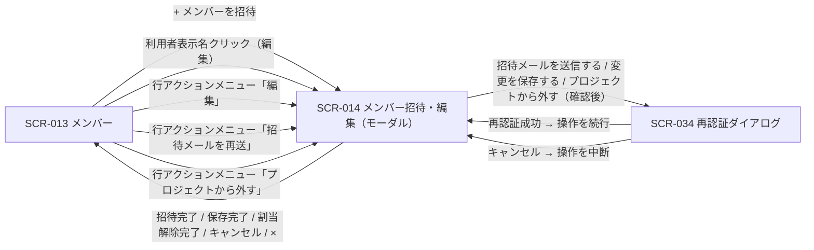

# STR-006: オーナー・メンバー管理導線

> **本遷移図はオーナー / メンバーがプロジェクトのメンバー一覧から招待・編集・割当解除を行う画面導線と例外遷移を定義します。**

*種別 画面遷移図 ・ ステータス ドラフト*

| 遷移図ID | 業務ユースケースID | 対応画面 |
|----|----|----|
| STR-006 | [UC-018](../../01_requirements/04_business_usecases/UC-018.md#UC-018) ・ [UC-019](../../01_requirements/04_business_usecases/UC-019.md#UC-019) ・ [UC-020](../../01_requirements/04_business_usecases/UC-020.md#UC-020) ・ [UC-021](../../01_requirements/04_business_usecases/UC-021.md#UC-021) | [SCR-013](../../02_basic_design/01_frontend/01_screens/SCR-013.md#SCR-013) [SCR-014](../../02_basic_design/01_frontend/01_screens/SCR-014.md#SCR-014) |

## 1. 目的

本遷移図は、オーナー / メンバーがプロジェクトのメンバー一覧を起点に、メンバーの招待・編集・招待メール再送・割当解除を行うまでの業務横断の導線と例外遷移を集約する。

## 2. 対象ロール

本遷移図が対象とするロールを示す。ロールの正式名は [用語集](../../01_requirements/00_glossary.md#GLO-001) を参照する。

| ロール | 対象 | 備考 |
|----|----|----|
| オーナー | ◯ | 当該プロジェクトの全権操作者 |
| メンバー | ◯ | 当該プロジェクトへの有効な割当を持つ利用者 |

## 3. 画面一覧

本遷移図に登場する画面を示す。各画面の詳細は `SCR-NNN` を参照する。

| 画面ID | 画面名 | 概要 | 利用可能ロール | 備考 |
|----|----|----|----|----|
| [SCR-013](../../02_basic_design/01_frontend/01_screens/SCR-013.md#SCR-013) | メンバー | 当該プロジェクトの割当メンバー一覧 | オーナー / メンバー | 起点画面 |
| [SCR-014](../../02_basic_design/01_frontend/01_screens/SCR-014.md#SCR-014) | メンバー招待・編集(モーダル) | 招待 / 編集 / 再送 / 割当解除を行う全画面割込みモーダル | オーナー / メンバー | SCR-013から起動 |
| [SCR-034](../../02_basic_design/01_frontend/01_screens/SCR-034.md#SCR-034) | 再認証ダイアログ | 重要操作前の本人確認ダイアログ | オーナー / メンバー | SCR-014から割込み表示 |

## 4. 画面遷移図

ロール別・業務横断の導線を示す(全画面共通グローバルナビは省略)。

## 5. 画面遷移一覧

§4 の各遷移を定義する。全画面共通グローバルナビは省略する。

| 遷移元画面 | 操作 | 条件 | 遷移先画面 | 遷移不可時 | 備考 |
|----|----|----|----|----|----|
| SCR-013 | 「+ メンバーを招待」を押下 | 当該プロジェクトへの有効な割当を持つ | SCR-014(招待モード) | — | 空状態からの起動も同一導線 |
| SCR-013 | 利用者表示名リンクを押下 | 対象がオーナー行・自分の行以外 | SCR-014(編集モード) | オーナー行・自分の行はリンク化されず遷移不可 | — |
| SCR-013 | 行アクションメニュー「編集」を押下 | 当該プロジェクトへの有効な割当を持つ | SCR-014(編集モード) | — | — |
| SCR-013 | 行アクションメニュー「招待メールを再送」を押下 | 対象者が招待中(本人未有効化) | SCR-014(編集モード) | 対象者が有効化済みの場合はメニュー非表示 | — |
| SCR-013 | 行アクションメニュー「プロジェクトから外す」を押下 | 対象がオーナー行・自分の行以外 | SCR-014(編集モード) | オーナー行・自分の行はメニュー非表示 | — |
| SCR-014(招待モード) | 「招待メールを送信する」を押下 | 入力検証を満たす | SCR-034 | 検証違反時は現画面に留まる | 再認証成功でAPI-021を実行 |
| SCR-014(編集モード) | 「変更を保存する」を押下 | 入力検証を満たす | SCR-034 | 検証違反時は現画面に留まる | 再認証成功でAPI-022を実行 |
| SCR-014(編集モード) | 「プロジェクトから外す」を押下し確認ダイアログで「外す」を押下 | 対象がオーナー行・自分の行以外 | SCR-034 | — | 再認証成功でAPI-023を実行 |
| SCR-034 | 再認証に成功 | パスワードが正しい | SCR-014 | 認証失敗時はSCR-034に留まりエラー表示 | 呼出元の操作を続行 |
| SCR-034 | キャンセルを押下 | — | SCR-014 | — | 呼出元の操作を中断 |
| SCR-014 | 招待完了 / 保存完了 / 割当解除完了 | 処理成功 | SCR-013 | — | 一覧を最新化 |
| SCR-014 | 「×」または「キャンセル」を押下 | — | SCR-013 | 未保存の入力がある場合は破棄確認を行う | 変更を破棄 |

## 6. 例外時の遷移

セッション・権限・境界違反等の例外導線を集約する。状態の意味は [状態モデル](../../02_basic_design/08_state-model.md) を参照する。

| 発生条件 | 遷移先 | 表示内容 | 備考 |
|----|----|----|----|
| セッション切れ | SCR-001 | 再ログイン要求 | — |
| プロジェクト境界違反(部外者・割当なし) | 404 相当 | リソース非存在を偽装 | 判定は [PERM-005](../../02_basic_design/04_permissions/PERM-005.md#PERM-005) |
| 招待先メールアドレスが未登録 | SCR-014(招待モード)に留まる | 先に利用登録を促すエラー(EM-06)を表示 | 入力内容は保持 |
| 招待先メールアドレスが重複(既に参加・招待中) | SCR-014(招待モード)に留まる | 重複エラー(EM-03)を表示 | — |
| 自分自身またはオーナーを外そうとする | SCR-013 / SCR-014 | 「プロジェクトから外す」操作を受け付けず理由を表示(EM-04) | 対象行では操作自体を非表示化 |
| 割当解除が最後の有効な割当に該当 | SCR-014の確認ダイアログに留まる | アカウント利用停止となる旨の警告(#15)を表示し確認を求める | 承認後にSCR-034へ |

## 7. 後続工程への引き継ぎ事項

- 正常導線(招待 / 編集 / 招待メール再送 / 割当解除)、権限別導線(オーナー行・自分の行での操作制限)、例外導線(未登録メール・重複・最後の割当)を網羅した画面遷移テストケースを設計する。
- 招待メール経由でのアカウント有効化(SCR-023)は本人が別途踏むメール導線であり、本遷移図の起点画面(SCR-013)へのオーナー / メンバー操作導線とは別系統のため対象外とする。
