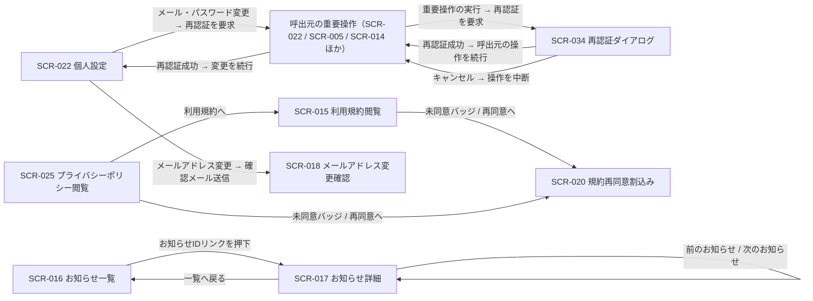

# STR-007: 全ロール共通 個人・通知領域 画面遷移

> **本遷移図はオーナー / メンバーが共通に利用する個人設定・お知らせ・規約閲覧と、重要操作前の再認証割込みの画面導線と例外遷移を定義します。**

*種別 画面遷移図 ・ ステータス ドラフト*

| 遷移図ID | 業務ユースケースID | 対応画面 |
|----|----|----|
| STR-007 | [UC-008](../../01_requirements/04_business_usecases/UC-008.md#UC-008) ・ [UC-009](../../01_requirements/04_business_usecases/UC-009.md#UC-009) ・ [UC-010](../../01_requirements/04_business_usecases/UC-010.md#UC-010) ・ [UC-011](../../01_requirements/04_business_usecases/UC-011.md#UC-011) ・ [UC-012](../../01_requirements/04_business_usecases/UC-012.md#UC-012) ・ [UC-013](../../01_requirements/04_business_usecases/UC-013.md#UC-013) ・ [UC-017](../../01_requirements/04_business_usecases/UC-017.md#UC-017) ・ [UC-043](../../01_requirements/04_business_usecases/UC-043.md#UC-043) ・ [UC-044](../../01_requirements/04_business_usecases/UC-044.md#UC-044) ・ [UC-045](../../01_requirements/04_business_usecases/UC-045.md#UC-045) | [SCR-015](../../02_basic_design/01_frontend/01_screens/SCR-015.md#SCR-015) [SCR-016](../../02_basic_design/01_frontend/01_screens/SCR-016.md#SCR-016) [SCR-017](../../02_basic_design/01_frontend/01_screens/SCR-017.md#SCR-017) [SCR-022](../../02_basic_design/01_frontend/01_screens/SCR-022.md#SCR-022) [SCR-025](../../02_basic_design/01_frontend/01_screens/SCR-025.md#SCR-025) [SCR-034](../../02_basic_design/01_frontend/01_screens/SCR-034.md#SCR-034) |

## 1. 目的

本遷移図は、オーナー / メンバーがロールに依存せず共通に利用する個人設定・お知らせ閲覧・利用規約 / プライバシーポリシー閲覧の導線と、これらの画面やプロジェクト管理画面から重要操作時に割り込む再認証ダイアログの導線・例外遷移を集約する。

## 2. 対象ロール

本遷移図が対象とするロールを示す。ロールの正式名は [用語集](../../01_requirements/00_glossary.md#GLO-001) を参照する。

| ロール | 対象 | 備考 |
|----|----|----|
| オーナー | ◯ | 個人設定・お知らせ・規約閲覧・再認証はロール非依存で共通利用 |
| メンバー | ◯ | 個人設定・お知らせ・規約閲覧・再認証はロール非依存で共通利用 |

## 3. 画面一覧

本遷移図に登場する画面を示す。各画面の詳細は `SCR-NNN` を参照する。

| 画面ID | 画面名 | 概要 | 利用可能ロール | 備考 |
|----|----|----|----|----|
| [SCR-016](../../02_basic_design/01_frontend/01_screens/SCR-016.md#SCR-016) | お知らせ一覧 | 自分宛お知らせの一覧・絞り込み・既読化 | オーナー / メンバー | 起点画面 |
| [SCR-017](../../02_basic_design/01_frontend/01_screens/SCR-017.md#SCR-017) | お知らせ詳細 | 個別お知らせの本文表示・自動既読 | オーナー / メンバー | SCR-016から遷移 |
| [SCR-022](../../02_basic_design/01_frontend/01_screens/SCR-022.md#SCR-022) | 個人設定 | 自分のプロフィール・セキュリティ・参加プロジェクトの編集 | オーナー / メンバー | 起点画面(アカウントメニューから起動) |
| [SCR-015](../../02_basic_design/01_frontend/01_screens/SCR-015.md#SCR-015) | 利用規約閲覧 | 利用規約最新版の全文閲覧・同意状態表示 | オーナー / メンバー / 認証前 | 認証不要URLを兼ねる |
| [SCR-025](../../02_basic_design/01_frontend/01_screens/SCR-025.md#SCR-025) | プライバシーポリシー閲覧 | プライバシーポリシー最新版の全文閲覧・同意状態表示 | オーナー / メンバー / 認証前 | 認証不要URLを兼ねる |
| [SCR-034](../../02_basic_design/01_frontend/01_screens/SCR-034.md#SCR-034) | 再認証ダイアログ | 重要操作前の本人確認ダイアログ | オーナー / メンバー | 個人設定・プロジェクト管理等の重要操作から割込み表示 |
| [SCR-018](../../02_basic_design/01_frontend/01_screens/SCR-018.md#SCR-018) | メールアドレス変更確認 | 新メールアドレス宛の確認手続き | オーナー / メンバー | SCR-022のメールアドレス変更後に引き渡し |
| [SCR-020](../../02_basic_design/01_frontend/01_screens/SCR-020.md#SCR-020) | 規約再同意割込み | 改定文書への再同意割込み | オーナー / メンバー | SCR-015 / SCR-025の未同意バッジから遷移 |

## 4. 画面遷移図

ロール別・業務横断の導線を示す(全画面共通グローバルナビは省略)。

## 5. 画面遷移一覧

§4 の各遷移を定義する。全画面共通グローバルナビは省略する。

| 遷移元画面 | 操作 | 条件 | 遷移先画面 | 遷移不可時 | 備考 |
|----|----|----|----|----|----|
| SCR-016 | お知らせIDリンクを押下 | — | SCR-017 | — | 押下と同時に個別既読化 |
| SCR-017 | 「一覧へ戻る」を押下 | — | SCR-016 | — | — |
| SCR-017 | 「前のお知らせ」「次のお知らせ」を押下 | 前後にお知らせが存在する | SCR-017 | 先頭 / 末尾では非活性 | 同一画面内で対象を差し替え |
| SCR-025 | 「利用規約」を押下 | — | SCR-015 | — | — |
| SCR-015 | 未同意バッジの「再同意へ」を押下 | ログイン済み・未同意 | SCR-020 | 未ログイン時はバッジ自体を非表示 | — |
| SCR-025 | 未同意バッジの「再同意する」を押下 | ログイン済み・未同意 | SCR-020 | 未ログイン時はバッジ自体を非表示 | — |
| SCR-022 | メールアドレス変更・パスワード変更を含む「保存する」「パスワードを変更する」を押下 | 認証済み本人 | SCR-034 | — | 呼出元の重要操作としてSCR-034を起動 |
| SCR-034 | 再認証に成功 | パスワードが正しい | 呼出元画面(SCR-022) | 認証失敗時はSCR-034に留まりエラー表示 | 呼出元の操作を続行 |
| SCR-034 | 「キャンセル」を押下 | — | 呼出元画面(SCR-022) | — | 呼出元の操作を中断 |
| SCR-022 | メールアドレス変更の保存 | 再認証成功済み | SCR-018 | — | 現行ログインメールは確認完了まで維持 |

## 6. 例外時の遷移

セッション・権限・境界違反等の例外導線を集約する。状態の意味は [状態モデル](../../02_basic_design/08_state-model.md) を参照する。

| 発生条件 | 遷移先 | 表示内容 | 備考 |
|----|----|----|----|
| セッション切れ | SCR-001 | 再ログイン要求 | — |
| 再認証に失敗(パスワード誤り) | SCR-034に留まる | 認証失敗エラーを表示し再入力を促す | 呼出元の重要操作は未実行のまま |
| 利用規約 / プライバシーポリシーへ未ログインで到達 | SCR-015 / SCR-025 | 同意状態バッジを非表示のまま全文を表示 | 認証不要URLのため境界判定は行わない |
| ログイン後の操作中に改定文書へ未同意 | SCR-020 | 改定内容の確認と再同意を割込み表示 | 割込み前の操作へ復帰 |
| お知らせ個別既読化がAPI失敗 | SCR-017に遷移は継続 | 既読化エラーを表示するが本文閲覧は継続 | — |

## 7. 後続工程への引き継ぎ事項

- 正常導線(お知らせ一覧から詳細・前後移動、規約 / プライバシーポリシーの相互閲覧、個人設定からの再認証割込み経由の変更確定)と例外導線(未ログイン閲覧、再認証失敗、改定文書未同意の割込み)を網羅した画面遷移テストケースを設計する。
- 再認証ダイアログ(SCR-034)はプロジェクト管理領域(SCR-005 / SCR-014 等)からも共通で呼び出されるが、それらの呼出元固有の遷移は STR-001 等の該当業務領域の遷移図が正本であり本書では対象外とする。
- お知らせの配信対象・既読化の一括操作範囲(絞り込み条件との関係)は SCR-016 §7 が正本であり、本書は画面間の遷移のみを扱う。
