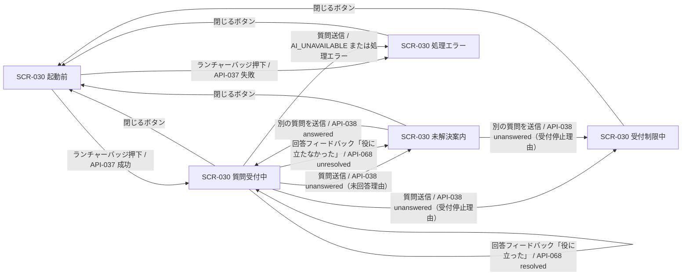

# STR-008: エンドユーザー 公開ウィジェット 画面遷移

> **本遷移図は設置サイト訪問者(ウィジェット利用者)が公開ウィジェットで起動から質問・回答・未解決・フィードバックまでを行う導線と例外遷移を定義します。**

*種別 画面遷移図 ・ ステータス ドラフト*

| 遷移図ID | 業務ユースケースID | 対応画面 |
|----|----|----|
| STR-008 | [UC-040](../../01_requirements/04_business_usecases/UC-040.md#UC-040) ・ [UC-041](../../01_requirements/04_business_usecases/UC-041.md#UC-041) ・ [UC-042](../../01_requirements/04_business_usecases/UC-042.md#UC-042) ・ [UC-051](../../01_requirements/04_business_usecases/UC-051.md#UC-051) ・ [UC-053](../../01_requirements/04_business_usecases/UC-053.md#UC-053) ・ [UC-083](../../01_requirements/04_business_usecases/UC-083.md#UC-083) | [SCR-030](../../02_basic_design/01_frontend/01_screens/SCR-030.md#SCR-030) |

## 1. 目的

本遷移図は、設置サイト訪問者が公開ウィジェットを起動してから、質問送信・AI 回答受領・未解決案内・受付制限・回答フィードバックを経て、閉じる／再開するまでの業務横断の導線と例外遷移を集約する。公開ウィジェットは管理コンソールとは別バンドルで配信され、本遷移図は管理コンソール側の画面(SCR-004 以降)を対象としない。

## 2. 対象ロール

本遷移図が対象とするロールを示す。ロールの正式名は [用語集](../../01_requirements/00_glossary.md#GLO-001) を参照する。

| ロール | 対象 | 備考 |
|----|----|----|
| ウィジェット利用者(エンドユーザー) | ◯ | 設置サイト訪問者。オーナー / メンバーのログインを要さない |
| オーナー | — | 本導線の対象外(管理コンソール側の別遷移図で定義) |
| メンバー | — | 本導線の対象外(管理コンソール側の別遷移図で定義) |

## 3. 画面一覧

本遷移図に登場する画面を示す。各画面の詳細は `SCR-NNN` を参照する。

| 画面ID | 画面名 | 概要 | 利用可能ロール | 備考 |
|----|----|----|----|----|
| [SCR-030](../../02_basic_design/01_frontend/01_screens/SCR-030.md#SCR-030) | FAQ ウィジェット | 設置サイトに埋め込まれる会話形式の単一画面。起動前・展開中の各状態を同一画面内で表す | ウィジェット利用者(エンドユーザー) | 起点画面(管理コンソールとは別バンドル) |

## 4. 画面遷移図

SCR-030 単一画面が保持する会話状態を、契機となる API 呼び出し・応答条件で結んだ導線を示す(全画面共通グローバルナビは省略。管理コンソール側画面は対象外)。

## 5. 画面遷移一覧

§4 の各遷移を定義する。全画面共通グローバルナビは省略する。

| 遷移元画面 | 操作 | 条件 | 遷移先画面 | 遷移不可時 | 備考 |
|----|----|----|----|----|----|
| SCR-030(起動前) | ランチャーバッジを押下 | [API-037](../../02_basic_design/02_backend/03_apis/API-037.md#API-037) が成功 | SCR-030(質問受付中) | — | SCR-030 EVT-02。IO は [IO-033](../03_io_specs/IO-033.md#IO-033) |
| SCR-030(起動前) | ランチャーバッジを押下 | [API-037](../../02_basic_design/02_backend/03_apis/API-037.md#API-037) が失敗 | SCR-030(処理エラー) | — | §6 例外へ。IO は [IO-033](../03_io_specs/IO-033.md#IO-033) |
| SCR-030(質問受付中) | 質問を入力し送信 | [API-038](../../02_basic_design/02_backend/03_apis/API-038.md#API-038) が `answered` を返す | SCR-030(質問受付中) | 未入力・最大長超過は送信を中止(SCR-030 §5) | 回答フィードバック選択まで次の質問送信は不可(SCR-030 EM-04) |
| SCR-030(質問受付中) | 質問を入力し送信 | [API-038](../../02_basic_design/02_backend/03_apis/API-038.md#API-038) が `unanswered`(未回答理由 `low_confidence` / `no_faq_match` / `contradiction`)を返す | SCR-030(未解決案内) | — | [API-039](../../02_basic_design/02_backend/03_apis/API-039.md#API-039) で未解決質問を同時登録。IO は [IO-034](../03_io_specs/IO-034.md#IO-034) |
| SCR-030(質問受付中) | 質問を入力し送信 | [API-038](../../02_basic_design/02_backend/03_apis/API-038.md#API-038) が `unanswered`(受付停止理由 `usage_limit_reached` / `payment_required`)を返す | SCR-030(受付制限中) | — | 質問入力・送信ボタンを無効化 |
| SCR-030(質問受付中) | 回答フィードバックで「役に立たなかった」を選択 | [API-068](../../02_basic_design/02_backend/03_apis/API-068.md#API-068) が `result=unresolved` を返す | SCR-030(未解決案内) | 記録失敗時は現画面に留まり再度フィードバックを促す | 未解決質問を登録(理由コード `user_unresolved`)。IO は [IO-034](../03_io_specs/IO-034.md#IO-034) |
| SCR-030(質問受付中) | 回答フィードバックで「役に立った」を選択 | [API-068](../../02_basic_design/02_backend/03_apis/API-068.md#API-068) が `result=resolved` を返す | SCR-030(質問受付中) | 記録失敗時は現画面に留まり再度フィードバックを促す | 次の質問入力・送信が可能になる |
| SCR-030(未解決案内) | 別の質問を入力し送信 | [API-038](../../02_basic_design/02_backend/03_apis/API-038.md#API-038) が `answered` を返す | SCR-030(質問受付中) | — | 未解決案内後も質問入力・送信は継続可能 |
| SCR-030(未解決案内) | 別の質問を入力し送信 | [API-038](../../02_basic_design/02_backend/03_apis/API-038.md#API-038) が `unanswered`(受付停止理由)を返す | SCR-030(受付制限中) | — | — |
| SCR-030(質問受付中 / 未解決案内 / 受付制限中 / 処理エラー) | 閉じるボタンを押下 | — | SCR-030(起動前) | — | 同一ページ内では会話・入力内容・受付状態を保持する(UC-040) |
| SCR-030(起動前) | ランチャーバッジを再度押下(同一ページ内で再起動) | 直前に会話を保持している | SCR-030(直前の会話状態) | — | UC-040 代替フロー。保持していた会話の続きから再開する |

## 6. 例外時の遷移

セッション・権限・境界違反等の例外導線を集約する。状態の意味は [状態モデル](../../02_basic_design/08_state-model.md) を参照する。

| 発生条件 | 遷移先 | 表示内容 | 備考 |
|----|----|----|----|
| 公開キー不正(現行・旧キーいずれにも不一致、または旧キー猶予期限超過) | SCR-030(処理エラー) | 接続不可の一律メッセージ(EM-03) | [API-037](../../02_basic_design/02_backend/03_apis/API-037.md#API-037) `WIDGET_KEY_INVALID` → [ERR-026](../../02_basic_design/05_errors/ERR-026.md#ERR-026) |
| 許可ドメイン外からの起動・質問送信 | SCR-030(処理エラー) | 接続不可の一律メッセージ(EM-03) | `DOMAIN_NOT_ALLOWED` → [ERR-027](../../02_basic_design/05_errors/ERR-027.md#ERR-027) |
| 課金アカウントがサスペンション中 | SCR-030(処理エラー) | 接続不可の一律メッセージ(EM-03) | `BILLING_ACCOUNT_SUSPENDED` → [ERR-004](../../02_basic_design/05_errors/ERR-004.md#ERR-004) |
| レート制限超過(質問送信の連続要求) | SCR-030(質問受付中)に留まる | 接続不可の一律メッセージ(EM-03) | `RATE_LIMITED` → [ERR-009](../../02_basic_design/05_errors/ERR-009.md#ERR-009) |
| AI 推論タイムアウト / プロバイダエラー | SCR-030(処理エラー) | 接続不可の一律メッセージ(EM-03) | `AI_UNAVAILABLE` → [ERR-036](../../02_basic_design/05_errors/ERR-036.md#ERR-036)。未解決質問は登録しない |
| DB 書き込み失敗などの致命的エラー | SCR-030(処理エラー) | 接続不可の一律メッセージ(EM-03) | `INTERNAL_SERVER_ERROR`。エラー識別子を付与し有人調査を可能にする |
| 回答フィードバック記録失敗 | SCR-030(質問受付中)に留まる | 接続不可の一律メッセージ(EM-03) | 記録できるまで次の質問入力・送信は行えない(SCR-030 EVT-08) |

## 7. 後続工程への引き継ぎ事項

- 質問送信(EVT-04)の応答分岐(`answered` / 未回答理由 3 値 / 受付停止理由 2 値 / 処理エラー)を網羅した画面遷移テストケースを設計する。
- 回答フィードバック(EVT-08)の「役に立った」「役に立たなかった」双方、および記録失敗時の再フィードバック導線をテスト設計でケース化する。
- 同一ページ内での閉じる→再起動時の会話継続(UC-040 代替フロー)は、セッション有効期限([IO-033](../03_io_specs/IO-033.md#IO-033) O-02)超過時の扱いが基本設計に明記されておらず要確認。
- 受付制限中(SCR-030 §4 #12)からの復帰契機(翌月リセット・上限引き上げ・上限オフ・支払方法登録)は本遷移図の対象外とし、UC-053 および課金・請求設計に委ねる。
