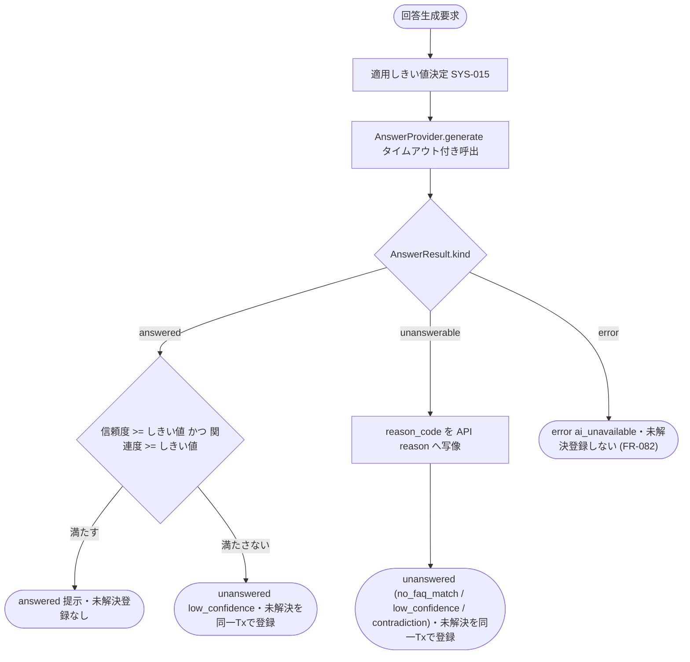

# IPO-001: AI 回答可否判定

> **本記述書は「ウィジェット利用者の質問に AI が回答してよいか」を、AI 推論の信頼度と候補 FAQ 全文検索の関連度を適用しきい値(信頼度・関連度)と突き合わせて判定し、回答・未解決・処理エラーのいずれを確定するかの処理ロジックを定義します。**

*種別 IPO処理機能記述書 ・ 優先度 P0 ・ ステータス ドラフト*

| 項目 | 値 |
|----|----|
| IPO ID | IPO-001 |
| 業務ユースケースID | [UC-047](../../01_requirements/04_business_usecases/UC-047.md#UC-047) ・ [UC-041](../../01_requirements/04_business_usecases/UC-041.md#UC-041) ・ [UC-048](../../01_requirements/04_business_usecases/UC-048.md#UC-048) |
| 関連 API / SYS | [API-038](../../02_basic_design/02_backend/03_apis/API-038.md#API-038) ・ [API-057](../../02_basic_design/02_backend/03_apis/API-057.md#API-057) ・ [SYS-015](../../02_basic_design/02_backend/01_system/SYS-015.md#SYS-015) |
| 参照 SEQ | — (ウィジェット質問→AI回答→未解決登録フローの詳細シーケンスは [DSQ-001](../08_sequences/DSQ-001.md#DSQ-001)。しきい値伝播は [SEQ-122](../../02_basic_design/03_sequences/SEQ-122.md#SEQ-122)) |
| 利用テーブル | [TBL-006](../../02_basic_design/02_backend/04_database/TBL-006.md#TBL-006) ・ [TBL-030](../../02_basic_design/02_backend/04_database/TBL-030.md#TBL-030) ・ [TBL-031](../../02_basic_design/02_backend/04_database/TBL-031.md#TBL-031) ・ [TBL-025](../../02_basic_design/02_backend/04_database/TBL-025.md#TBL-025) |

## 1. 目的

本処理は、ウィジェット質問送信([API-038](../../02_basic_design/02_backend/03_apis/API-038.md#API-038) の P-03〜P-05)の中核として、AI 推論 IF([API-057](../../02_basic_design/02_backend/03_apis/API-057.md#API-057) `AnswerProvider.generate`)の結果と適用しきい値を突き合わせ、`answered`(回答提示可) / `unanswered`(未解決へ回す・理由付き) / `error`(処理エラー)のいずれを確定するかを判定する Service 層ロジックである。実装者が押さえるべき前提は次の 3 点である。

- しきい値の正本は[システム仕様書 §1](../../02_basic_design/07_system-spec.md#1-aiしきい値)(信頼度 0.60 / 関連度 0.50 のグローバル既定・[RULE-012](../../01_requirements/01_business_requirement/08_rule.md#RULE-012))。プロジェクト設定値は [TBL-031](../../02_basic_design/02_backend/04_database/TBL-031.md#TBL-031)(`TP_AI_THRESH_CACHE`)に保持し、取得・伝播・フォールバックは [SYS-015](../../02_basic_design/02_backend/01_system/SYS-015.md#SYS-015) が担う。
- 関連度は候補 FAQ 全文検索(FTS)の一致スコアであり、AI 推論 IF は返さない。候補 FAQ は公開状態(`published`)かつ当該プロジェクトの FAQ([TBL-006](../../02_basic_design/02_backend/04_database/TBL-006.md#TBL-006))を全文検索([TBL-030](../../02_basic_design/02_backend/04_database/TBL-030.md#TBL-030) `TP_FAQ_FTS`)し、一致スコア降順で上位 N 件を候補とする(N は[システム仕様書 §1](../../02_basic_design/07_system-spec.md#1-aiしきい値)の設計値・[FR-198](../../01_requirements/02_functional_requirement/02_faq-ai-fr.md#FR-198))。関連度(relevance)は候補最上位の FTS スコア。
- AI 推論タイムアウト(8 秒。[システム仕様書 §3](../../02_basic_design/07_system-spec.md#3-タイムアウトセッション認証)・[RULE-020](../../01_requirements/01_business_requirement/08_rule.md#RULE-020))/ プロバイダエラーは**処理エラー**であり、未解決質問として自動登録しない([FR-082](../../01_requirements/02_functional_requirement/02_faq-ai-fr.md#FR-082))。

## 2. 処理概要

質問文と候補 FAQ(前段の全文検索で確定した上位 N 件)を入力に、適用しきい値の決定 → AI 推論呼出 → 結果判定(信頼度 かつ 関連度)→ 出力確定までを 1 単位として俯瞰する。候補 FAQ の全文検索・関連度算定は本判定の前段であり、その結果(候補集合と関連度スコア)を入力として受け取る。

| 機能名 | 処理概要 | 起動条件 | 終了条件 |
|----|----|----|----|
| AI 回答可否判定 | 適用しきい値を決定し、`AnswerProvider.generate` の結果(信頼度)と候補最上位の関連度(FTS スコア)を突き合わせて回答提示可否を確定する | ウィジェット質問送信で受付検証(認証・レート・上限)を通過し、候補 FAQ 全文検索(上位 N 件)を経て回答生成が要求されたとき | `answered` / `unanswered`(理由付き)/ `error`(処理エラー)のいずれかを呼び出し元へ返したとき |

## 3. IPO 一覧

入力・処理・出力の対応と例外・分岐を 1 行 1 処理で一覧化する。判定分岐の詳細条件は `## 4. 処理詳細` に定義する。

| No | Input | Process | Output | 例外・分岐 | 備考 |
|----|----|----|----|----|----|
| 0 | 対象プロジェクト、質問文 | 公開かつ当該プロジェクトの FAQ を全文検索し、一致スコア降順で上位 N 件を候補として抽出(前段) | 候補 FAQ 上位 N 件・各候補の関連度スコア(FTS) | 候補 0 件は `unanswerable(no_match)` 相当 | FTS は [TBL-030](../../02_basic_design/02_backend/04_database/TBL-030.md#TBL-030)、N は[システム仕様書 §1](../../02_basic_design/07_system-spec.md#1-aiしきい値)、[FR-198](../../01_requirements/02_functional_requirement/02_faq-ai-fr.md#FR-198) |
| 1 | 対象プロジェクト、[TBL-031](../../02_basic_design/02_backend/04_database/TBL-031.md#TBL-031) のプロジェクト設定値有無 | 適用しきい値を決定([SYS-015](../../02_basic_design/02_backend/01_system/SYS-015.md#SYS-015):設定値優先・未登録はグローバル既定) | 適用しきい値(信頼度 / 関連度) | 取得不能時はグローバル既定へフォールバックしアラート | しきい値正本は[システム仕様書 §1](../../02_basic_design/07_system-spec.md#1-aiしきい値) |
| 2 | 質問文、候補 FAQ(公開分・上位 N)、適用しきい値 | `AnswerProvider.generate` をタイムアウト付きで呼出([API-057](../../02_basic_design/02_backend/03_apis/API-057.md#API-057)) | `AnswerResult`(`answered` / `unanswerable` / `error`) | タイムアウト / プロバイダエラーは `error` へ | `timeout_ms` は[システム仕様書 §3](../../02_basic_design/07_system-spec.md#3-タイムアウトセッション認証) |
| 3 | `AnswerResult(kind=answered)` の信頼度、候補最上位の関連度(No.0 の FTS スコア)、適用しきい値 | 信頼度・関連度をしきい値と比較(両方満たせば提示可) | `answered`(提示)/ `unanswered(low_confidence)` | いずれかがしきい値未満なら `unanswered(low_confidence)` | 関連度供給元は No.0 の FTS スコア(境界値の扱いは `## 5.`) |
| 4 | `AnswerResult(kind=unanswerable)` の `reason_code` | 未回答理由コードを API 応答 `reason` へ写像 | `unanswered(no_faq_match / low_confidence / contradiction)` | 写像に定義の無い `reason_code` は本処理で確定しない | 写像表は `## 4.` No.4。矛盾検出は AI 推論 IF 責務([EIF-001](../06_external_if/EIF-001.md#EIF-001)) |
| 5 | `AnswerResult(kind=error)` の `reason_code` | 処理エラーとして確定(`ai_unavailable`) | `error`(未解決登録しない) | `provider_error` / `timeout` を対象 | [FR-082](../../01_requirements/02_functional_requirement/02_faq-ai-fr.md#FR-082) |

## 4. 処理詳細

各処理の判定条件・入出力・エラー時挙動を実装可能な粒度で定義する。物理カラム名の定義は [DBP-001](../07_db_physical/DBP-001.md#DBP-001)、AI 連携仕様は [EIF-001](../06_external_if/EIF-001.md#EIF-001)、しきい値伝播の実装は [SYS-015](../../02_basic_design/02_backend/01_system/SYS-015.md#SYS-015) に委ねる。

| No | 処理名 | 処理内容(疑似コード / 判定条件) | 入力 | 出力 | 条件 | エラー時 |
|----|----|----|----|----|----|----|
| 1 | 適用しきい値決定 | `t = SYS-015.resolveThreshold(projectId)`。設定値登録済み → プロジェクト設定値、未登録 → グローバル既定値。信頼度・関連度は 1 セットで扱い部分フォールバックしない | 対象プロジェクト、設定値有無 | 信頼度しきい値 / 関連度しきい値 | 回答生成の直前 | 取得不能時はグローバル既定で継続し [SYS-015](../../02_basic_design/02_backend/01_system/SYS-015.md#SYS-015) がアラート通知 |
| 2 | AI 推論呼出 | `r = AnswerProvider.generate({ question, candidate_faqs, policy:{faq_only,forbid_new_facts,learn:false}, locale, timeout_ms })`。`timeout_ms` は正本値([システム仕様書 §3](../../02_basic_design/07_system-spec.md#3-タイムアウトセッション認証)) | 質問文、候補 FAQ(公開分)、適用しきい値 | `AnswerResult` | しきい値決定後 | タイムアウト超過 / 呼出例外は `kind=error` として扱う(No.5 へ) |
| 3 | 提示可否判定 | `if r.kind==answered and r.confidence >= 信頼度しきい値 and relevance >= 関連度しきい値 → answered else → unanswered(low_confidence)`。`relevance` は候補最上位の全文検索(FTS)一致スコア(No.0 で算定、質問ログの `relevance_score` に記録)。`confidence` は `AnswerProvider` 応答値 | `AnswerResult(answered)`、候補最上位の関連度、適用しきい値 | `answered` / `unanswered(low_confidence)` | `kind=answered` のとき | スコア欠損時は判定不能として `unanswered(low_confidence)` 相当で未解決へ回す |
| 4 | 未回答理由写像 | `AnswerResult.reason_code → API 応答 reason`(下記写像表)。写像後は未解決質問を生成する分岐へ渡す | `AnswerResult(unanswerable)` の `reason_code` | API 応答 `reason` | `kind=unanswerable` のとき | 写像に無い `reason_code` は本処理で確定しない |
| 5 | 処理エラー確定 | `if r.kind==error(reason_code ∈ {provider_error,timeout}) → 処理エラー(ai_unavailable)`。質問ログは処理エラーとして記録し、**未解決質問を登録しない**([FR-082](../../01_requirements/02_functional_requirement/02_faq-ai-fr.md#FR-082)) | `AnswerResult(error)` の `reason_code` | `error` | `kind=error` のとき | AI エラーは [ERR-036](../../02_basic_design/05_errors/ERR-036.md#ERR-036)(503)。`rate_limited` は本処理到達前に受付制御で処理する |

未回答理由コード([API-057](../../02_basic_design/02_backend/03_apis/API-057.md#API-057) `AnswerResult.reason_code`)から API 応答 `reason`([API-038](../../02_basic_design/02_backend/03_apis/API-038.md#API-038))・質問ログの結果理由コード([TBL-025](../../02_basic_design/02_backend/04_database/TBL-025.md#TBL-025))への写像は次のとおり。未回答理由は `no_faq_match` / `low_confidence` / `contradiction` の 3 値であり、個人情報(PII)は回答文マスキング([RULE-024](../../01_requirements/01_business_requirement/08_rule.md#RULE-024))で扱うため未回答理由には現れない(マスキング工程は本判定の後段・別工程。`## 5.` 参照)。

| `AnswerResult.kind` | `reason_code` | API 応答 | 質問ログ結果理由 | 未解決登録 |
|----|----|----|----|----|
| `unanswerable` | `no_match` | `unanswered` `reason=no_faq_match` | `no_faq_match` | する(同一 Tx) |
| `unanswerable` | `low_confidence` | `unanswered` `reason=low_confidence` | `low_confidence` | する(同一 Tx) |
| `unanswerable` | `contradiction` | `unanswered` `reason=contradiction`([RULE-023](../../01_requirements/01_business_requirement/08_rule.md#RULE-023)) | `contradiction` | する(同一 Tx) |
| `answered`(しきい値未満) | — | `unanswered` `reason=low_confidence` | `low_confidence` | する(同一 Tx) |
| `error` | `provider_error` / `timeout` | `error`([ERR-036](../../02_basic_design/05_errors/ERR-036.md#ERR-036) 503) | `ai_unavailable` | **しない**([FR-082](../../01_requirements/02_functional_requirement/02_faq-ai-fr.md#FR-082)) |
| `answered`(しきい値以上) | — | `answered` | `answered` | しない |

未解決質問の生成有無で分岐する全体像を示す。未回答理由 3 種(`no_faq_match` / `low_confidence` / `contradiction`)はいずれも本処理から確定し、それぞれ同一トランザクションで未解決質問を生成する。

## 5. 後続工程への引き継ぎ事項

詳細シーケンス([DSQ-001](../08_sequences/DSQ-001.md#DSQ-001))・テスト設計へ引き継ぐ観点を挙げる。未解決質問の状態遷移は [STS-001](../01_state_transitions/STS-001.md#STS-001)、入出力契約は [IO-001](../03_io_specs/IO-001.md#IO-001) を参照。回答文の個人情報マスキング([RULE-024](../../01_requirements/01_business_requirement/08_rule.md#RULE-024))は `answered` 確定後の応答整形前に `AnswerService`(`AnswerProvider` の外・上位)が行う別工程であり、本判定の主務外(処理順は [DSQ-001](../08_sequences/DSQ-001.md#DSQ-001) を参照)。

- 提示可否判定の境界値(信頼度・関連度が「しきい値ちょうど」のとき提示可とするか。本書は `>=`(等号を含む=提示可)で確定。テストで両しきい値の等号境界を検証)。
- 判定不能(信頼度・関連度スコアの欠損)を `unanswered(low_confidence)` として未解決へ回す扱いの確認。
- 適用しきい値取得不能時に [SYS-015](../../02_basic_design/02_backend/01_system/SYS-015.md#SYS-015) がグローバル既定へフォールバックしアラート([MSG-013](../../02_basic_design/06_messages/MSG-013.md#MSG-013))を発火する契機のテスト観点。
- `AnswerResult(kind=error)` 時に未解決質問を登録しないこと([FR-082](../../01_requirements/02_functional_requirement/02_faq-ai-fr.md#FR-082))と、`unanswerable` 時は質問ログと未解決質問を同一トランザクションで生成すること(API-038 P-05)の分岐検証。
- 冪等性は `questionLogId` を基準に担保する前提での再送時挙動(同一質問の重複判定は判定処理の外側で制御)。
