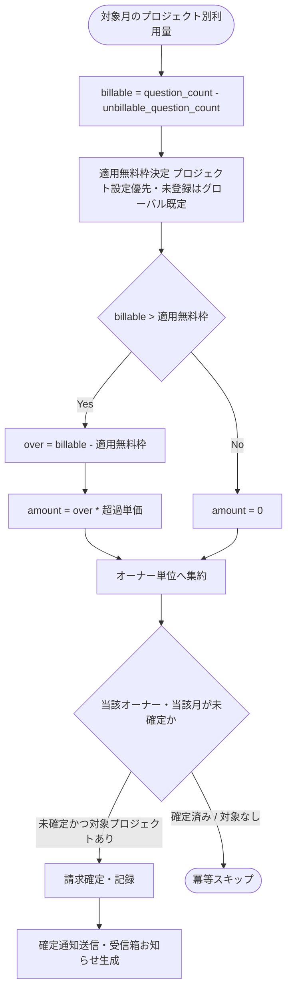

# IPO-002: 月次請求確定ロジック

> **本記述書は、月初の締め後に対象月の利用量をプロジェクト単位で月次集計し、無料枠控除・超過単価計算を経てオーナー単位(課金アカウント単位)へ集約して請求額を確定する処理ロジックを定義します。**

*種別 IPO処理機能記述書 ・ 優先度 P0 ・ ステータス ドラフト*

| 項目 | 値 |
|----|----|
| IPO ID | IPO-002 |
| 業務ユースケースID | [UC-054](../../01_requirements/04_business_usecases/UC-054.md#UC-054) |
| 関連 API / SYS | [SYS-019](../../02_basic_design/02_backend/01_system/SYS-019.md#SYS-019) ・ [API-043](../../02_basic_design/02_backend/03_apis/API-043.md#API-043) ・ [API-058](../../02_basic_design/02_backend/03_apis/API-058.md#API-058) |
| 参照 SEQ | — (実行機構・起動制御は [BAT-005](../05_batch/BAT-005.md#BAT-005)) |
| 利用テーブル | [TBL-018](../../02_basic_design/02_backend/04_database/TBL-018.md#TBL-018) ・ [TBL-019](../../02_basic_design/02_backend/04_database/TBL-019.md#TBL-019) ・ [TBL-020](../../02_basic_design/02_backend/04_database/TBL-020.md#TBL-020) ・ [TBL-009](../../02_basic_design/02_backend/04_database/TBL-009.md#TBL-009) ・ [TBL-002](../../02_basic_design/02_backend/04_database/TBL-002.md#TBL-002) |

## 1. 目的

本処理は、月初起動([SYS-019](../../02_basic_design/02_backend/01_system/SYS-019.md#SYS-019) `PR-01`〜`PR-04`)の中核として、対象月に計測した利用量([TBL-020](../../02_basic_design/02_backend/04_database/TBL-020.md#TBL-020) `T_USAGE_METER`)から課金対象件数を確定し、無料枠控除・超過単価計算を経てプロジェクト単位の超過分を算定した上でオーナー単位(課金アカウント単位)へ集約し、請求書([TBL-019](../../02_basic_design/02_backend/04_database/TBL-019.md#TBL-019) `T_BILL_INVOICES`)を確定する Service 層ロジックである。実装者が押さえるべき前提は次の 3 点である。

- 無料枠・超過単価の正本は[システム仕様書 §2](../../02_basic_design/07_system-spec.md#2-課金利用量上限)(質問数:無料枠 1,000 件 / 月・超過単価 0.5 円 / 件)。プロジェクト設定値は [TBL-009](../../02_basic_design/02_backend/04_database/TBL-009.md#TBL-009)(`M_PRJ_QUOTA_LIMITS` `resource_kind='q_monthly_limit'` の `free_quota`)に保持し、未登録時はシステム仕様書のグローバル既定値を用いる。
- 課金対象件数は「総質問数 − 推論失敗件数」([TBL-020](../../02_basic_design/02_backend/04_database/TBL-020.md#TBL-020) `question_count − unbillable_question_count`)であり、無料枠消費・超過分算定はこの課金対象件数のみを分母とする([課金・請求設計書 §6](../../02_basic_design/05_billing-design.md#6-利用量集計方針)・[RULE-013](../../01_requirements/01_business_requirement/08_rule.md#RULE-013))。推論失敗(`ai_unavailable`)分は無料枠を消費せず請求からも除外する。
- 確定単位はオーナー(課金アカウント)・対象月であり、当該単位が確定済み、または請求対象のプロジェクトが存在しない場合は冪等にスキップする([SYS-019](../../02_basic_design/02_backend/01_system/SYS-019.md#SYS-019) `PR-07`)。起動契機・スケジュール・リトライ・排他制御などの実行機構は [BAT-005](../05_batch/BAT-005.md#BAT-005) に委ねる。

## 2. 処理概要

対象月・請求対象のオーナー(課金アカウント)一覧を入力に、プロジェクト単位の月次集計 → 無料枠控除・超過単価計算 → オーナー単位への集約 → 冪等判定 → 請求確定・通知までを 1 単位として俯瞰する。

| 機能名 | 処理概要 | 起動条件 | 終了条件 |
|----|----|----|----|
| 月次請求確定 | 対象月の課金対象件数を無料枠・超過単価と突き合わせてプロジェクト単位の超過分を算定し、オーナー単位へ集約して請求額を確定する | 月初起動により前月分を対象として呼び出されたとき([BAT-005](../05_batch/BAT-005.md#BAT-005)) | 全対象オーナーについて確定 / 冪等スキップのいずれかを終えたとき |

## 3. IPO 一覧

入力・処理・出力の対応と例外・分岐を 1 行 1 処理で一覧化する。判定分岐の詳細条件は `## 4. 処理詳細` に定義する。

| No | Input | Process | Output | 例外・分岐 | 備考 |
|----|----|----|----|----|----|
| 1 | 対象月、プロジェクトごとの [TBL-020](../../02_basic_design/02_backend/04_database/TBL-020.md#TBL-020)(`question_count` / `unbillable_question_count`) | 課金対象件数を算出(総質問数 − 推論失敗件数) | プロジェクト別課金対象件数 | 対象月の計測行が無いプロジェクトは課金対象件数 0 として扱う | 分母の正本は[課金・請求設計書 §6](../../02_basic_design/05_billing-design.md#6-利用量集計方針) |
| 2 | プロジェクト別課金対象件数、[TBL-009](../../02_basic_design/02_backend/04_database/TBL-009.md#TBL-009) の無料枠設定値有無 | 適用無料枠を決定(プロジェクト設定値優先・未登録はグローバル既定) | プロジェクト別適用無料枠 | 取得不能時はグローバル既定へフォールバック | 無料枠正本は[システム仕様書 §2](../../02_basic_design/07_system-spec.md#2-課金利用量上限) |
| 3 | プロジェクト別課金対象件数、適用無料枠、超過単価 | 超過件数(課金対象件数 − 無料枠。負値は 0)に超過単価を乗じて課金額を算定 | プロジェクト別課金額 | 課金対象件数が無料枠以下なら課金額 0 | 超過単価正本は[システム仕様書 §2](../../02_basic_design/07_system-spec.md#2-課金利用量上限) |
| 4 | オーナーが作成した全プロジェクトの課金額 | プロジェクト別課金額をオーナー単位(課金アカウント単位)へ合算 | オーナー別請求金額(内訳付き) | 対象プロジェクトが 0 件のオーナーは合算対象外 | 集約単位は[課金・請求設計書 §1](../../02_basic_design/05_billing-design.md#1-課金モデルと判定単位) |
| 5 | オーナー(課金アカウント)、対象月、[TBL-019](../../02_basic_design/02_backend/04_database/TBL-019.md#TBL-019) の既存請求有無 | 当該オーナー・当該月が未確定か判定(冪等判定) | 確定対象 / スキップ対象の別 | 確定済み・対象なしはスキップ([SYS-019](../../02_basic_design/02_backend/01_system/SYS-019.md#SYS-019) `PR-07`) | 一意性は[TBL-019 インデックス](../../02_basic_design/02_backend/04_database/TBL-019.md#インデックス) `uq_billing_invoices_owner_month` |
| 6 | 確定対象のオーナー別請求金額(内訳付き) | 請求書を確定・記録し、確定通知メールと受信箱お知らせを生成 | 確定した請求書、通知結果 | 確定後の通知失敗は請求確定自体をロールバックしない | 通知は[API-058](../../02_basic_design/02_backend/03_apis/API-058.md#API-058)・実行機構は[BAT-005](../05_batch/BAT-005.md#BAT-005) |

## 4. 処理詳細

各処理の判定条件・入出力・エラー時挙動を実装可能な粒度で定義する。物理カラム名の定義は [DBP-004](../07_db_physical/DBP-004.md#DBP-004)、起動契機・リトライ・部分失敗時の扱いは [BAT-005](../05_batch/BAT-005.md#BAT-005) に委ねる。

| No | 処理名 | 処理内容(疑似コード / 判定条件) | 入力 | 出力 | 条件 | エラー時 |
|----|----|----|----|----|----|----|
| 1 | 課金対象件数算出 | `billable = question_count - unbillable_question_count`(対象月・プロジェクトごとに [TBL-020](../../02_basic_design/02_backend/04_database/TBL-020.md#TBL-020) を参照。計測行が無い場合は `billable = 0`) | 対象月、`question_count`、`unbillable_question_count` | プロジェクト別 `billable` | プロジェクト単位の月次集計時 | 計測行欠損はエラーとせず 0 件として継続 |
| 2 | 適用無料枠決定 | `q = TBL-009.resolve(project_id, 'q_monthly_limit').free_quota`。設定行あり(`valid=1`) → 当該値、無し → [システム仕様書 §2](../../02_basic_design/07_system-spec.md#2-課金利用量上限) のグローバル既定(1,000 件)| プロジェクト、[TBL-009](../../02_basic_design/02_backend/04_database/TBL-009.md#TBL-009) の設定値有無 | 適用無料枠 | 超過分算定の直前 | 取得不能時はグローバル既定へフォールバックしアラート([SYS-015](../../02_basic_design/02_backend/01_system/SYS-015.md#SYS-015) と同様の方針) |
| 3 | 超過分・課金額算定 | `over = max(billable - q, 0)`。`amount = over * unit_price`(`unit_price` は[システム仕様書 §2](../../02_basic_design/07_system-spec.md#2-課金利用量上限) の質問数超過単価 0.5 円 / 件) | `billable`、適用無料枠、超過単価 | プロジェクト別課金額 | 無料枠決定後 | `billable <= q` のとき `amount = 0`(超過なし) |
| 4 | オーナー単位集約 | `total = sum(amount for each project where M_PROJECTS.owner_user_id = owner の当月課金額)`。内訳はプロジェクト別課金額を明細として保持 | オーナーが作成した全プロジェクトの課金額 | オーナー別請求金額・内訳 | プロジェクト別算定完了後 | 集約対象プロジェクトが 0 件のオーナーは請求書を作成しない(No.5 で対象なしスキップ) |
| 5 | 冪等判定 | `if exists(T_BILL_INVOICES where billing_account_id=owner.id and billing_ym=対象月) → 確定済みスキップ else if total 対象プロジェクト 0 件 → 対象なしスキップ else → 確定対象` | オーナー(課金アカウント)、対象月、[TBL-019](../../02_basic_design/02_backend/04_database/TBL-019.md#TBL-019) の既存行有無 | 確定対象 / スキップ対象の別 | オーナー単位集約後 | 一意制約 `uq_billing_invoices_owner_month` 違反時もスキップと同義に扱う |
| 6 | 請求確定・記録 | 確定対象のオーナーについて [TBL-019](../../02_basic_design/02_backend/04_database/TBL-019.md#TBL-019) へ `status='issued'`・`amount_total`(オーナー別請求金額)を同一トランザクションで記録([SYS-019](../../02_basic_design/02_backend/01_system/SYS-019.md#SYS-019) `SEV-035`) | 確定対象オーナーの請求金額・内訳 | 確定した請求書 | 冪等判定で確定対象のとき | 記録失敗時は当該オーナーの確定を行わず後続オーナーの処理は継続([BAT-005](../05_batch/BAT-005.md#BAT-005) が再処理契機を担う) |
| 7 | 確定通知送信 | 確定した請求について [API-058](../../02_basic_design/02_backend/03_apis/API-058.md#API-058) `send` でオーナー宛メールを送信し配信結果を記録、受信箱へ「請求確定」お知らせを生成([SYS-019](../../02_basic_design/02_backend/01_system/SYS-019.md#SYS-019) `SEV-036`) | 確定した請求書 | 通知結果(メール配信ログ・受信箱お知らせ) | 請求を確定したとき | 通知送信の失敗時は請求確定を取り消さず、通知のみ失敗として記録([BAT-005](../05_batch/BAT-005.md#BAT-005) の再送方針に従う) |

超過分・課金額算定(No.3)の境界値の扱いを示す。課金対象件数が無料枠と同数(等号)のときは超過なしとする。

## 5. 後続工程への引き継ぎ事項

詳細シーケンス・テスト設計へ引き継ぐ観点を挙げる。実行機構(起動トリガ・リトライ・部分失敗時の扱い)は [BAT-005](../05_batch/BAT-005.md#BAT-005) を参照。

- 超過分算定の境界値(課金対象件数が無料枠と等しいとき超過 0 とする扱い。本書は `billable > 適用無料枠` で超過ありとし等号は超過なしとして確定)のテスト観点。
- 無料枠取得不能時にグローバル既定へフォールバックする契機と、フォールバック発生時のアラート通知有無の確認。
- オーナー単位集約(No.4)は「オーナーが作成した全プロジェクト」を対象とする前提(サスペンション中プロジェクトは[課金・請求設計書 §6](../../02_basic_design/05_billing-design.md#6-利用量集計方針)により集計対象外)の検証。
- 冪等判定(No.5)の一意制約 `uq_billing_invoices_owner_month` 違反時の扱いと、確定処理の一部失敗(No.6 記録失敗)時に他オーナーの処理を継続する分離境界の検証。
- 請求確定(No.6)と通知送信(No.7)のトランザクション境界(通知失敗が請求確定のロールバック要因にならないこと)の確認。
