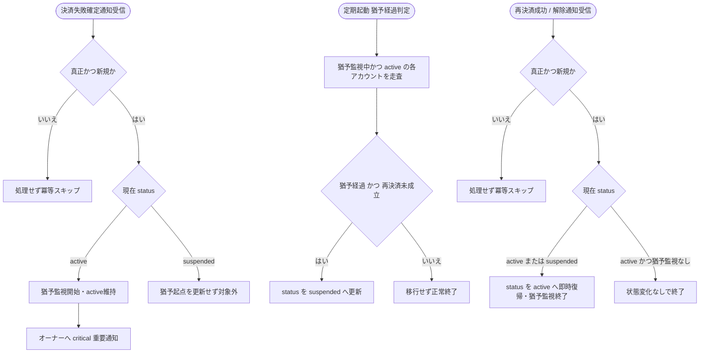

# IPO-003: 決済失敗猶予・サスペンション判定ロジック

> **本記述書は「決済失敗確定通知を受けた課金アカウントを猶予期間中は有効のまま維持し、猶予経過かつ再決済未成立であればサスペンションへ移行し、再決済成功・解除の通知を受けた時点で即時に通常状態へ復帰させる」判定ロジックを定義します。**

*種別 IPO処理機能記述書 ・ 優先度 P0 ・ ステータス ドラフト*

| 項目 | 値 |
|----|----|
| IPO ID | IPO-003 |
| 業務ユースケースID | [UC-055](../../01_requirements/04_business_usecases/UC-055.md#UC-055) |
| 関連 API / SYS | [SYS-020](../../02_basic_design/02_backend/01_system/SYS-020.md#SYS-020) |
| 参照 SEQ | [SEQ-098](../../02_basic_design/03_sequences/SEQ-098.md#SEQ-098) |
| 利用テーブル | [TBL-002](../../02_basic_design/02_backend/04_database/TBL-002.md#TBL-002) ・ [TBL-018](../../02_basic_design/02_backend/04_database/TBL-018.md#TBL-018) |

## 1. 目的

本処理は、課金プロバイダからの決済失敗確定通知([SYS-020](../../02_basic_design/02_backend/01_system/SYS-020.md#SYS-020) PR-01・PR-02)を起点に猶予期間の監視を開始し、定期起動の猶予経過判定でサスペンション移行の可否を確定し、再決済成功・解除の通知受信時は猶予中・サスペンション中いずれからも即時に通常状態へ復帰させる Service 層ロジックである。実装者が押さえるべき前提は次の 3 点である。

- 猶予期間の正本値は[システム仕様書 §4](../../02_basic_design/07_system-spec.md#4-データ保持期間削除猶予)(決済失敗確定通知受信時刻起点で 7 日・[RULE-016](../../01_requirements/01_business_requirement/08_rule.md#RULE-016))。本書は日数を再定義せず ID 参照する。
- 課金アカウント状態(`active` / `suspended`)の意味・遷移条件そのものは[状態モデル §2](../../02_basic_design/08_state-model.md#2-課金アカウント状態)・[課金・請求設計 §5.1](../../02_basic_design/05_billing-design.md#51-決済失敗からサスペンションへ)・[STS-003](../01_state_transitions/STS-003.md#STS-003)を正本とし、本書は判定ロジックの入出力・分岐条件に限定する。
- 実行機構(通知受信の起動契機・定期判定のスケジュール・冪等性キー制御・リトライ)は対の [BAT-006](../05_batch/BAT-006.md#BAT-006) に委ねる。本書は「入力を受けてどう判定し何を確定するか」に集中する。

## 2. 処理概要

決済失敗確定通知の受信、猶予経過判定の定期起動、再決済成功・解除通知の受信という 3 つの契機を入力に、それぞれ課金アカウントの状態確定までを 1 単位として俯瞰する。

| 機能名 | 処理概要 | 起動条件 | 終了条件 |
|----|----|----|----|
| 決済失敗猶予・サスペンション判定 | 決済失敗確定通知で猶予監視を開始し、猶予経過判定でサスペンション移行可否を確定し、再決済成功・解除通知で即時復帰を確定する | 決済失敗確定 / 再決済成功 / 解除の通知受信、または猶予経過判定の定期起動があったとき | 課金アカウント状態(`active` 維持 / `suspended` 移行 / `active` 復帰)を確定したとき |

## 3. IPO 一覧

入力・処理・出力の対応と例外・分岐を 1 行 1 処理で一覧化する。判定分岐の詳細条件は `## 4. 処理詳細` に定義する。

| No | Input | Process | Output | 例外・分岐 | 備考 |
|----|----|----|----|----|----|
| 1 | 決済失敗確定通知、通知の真正性検証結果、冪等性キーの照合結果 | 真正性を検証できた新規通知かを判定 | 猶予監視開始可否 | 検証不能 / 重複受信は処理せず冪等にスキップ | 検証・冪等制御の実行機構は [BAT-006](../05_batch/BAT-006.md#BAT-006) |
| 2 | 猶予監視開始可否、対象課金アカウントの現在状態 | 猶予監視を開始し課金アカウントを `active` のまま維持 | 猶予監視開始の記録、オーナーへの重要通知契機 | 既に `suspended` 中の再受信は猶予起点を更新せず新規猶予としない(`## 4.` No.2) | 状態は変えず記録のみ行う |
| 3 | 猶予中の課金アカウント一覧、各アカウントの猶予起点、猶予期間([システム仕様書 §4](../../02_basic_design/07_system-spec.md#4-データ保持期間削除猶予)) | 定期起動時に猶予経過かつ再決済未成立かを判定 | 猶予経過判定結果(経過 / 未経過) | 判定対象は猶予監視中かつ現在 `active` の課金アカウントに限る | 定期起動のスケジュールは [BAT-006](../05_batch/BAT-006.md#BAT-006) |
| 4 | 猶予経過判定結果、対象課金アカウントの現在状態 | 猶予経過かつ再決済未成立であれば `suspended` へ移行 | `suspended` 移行の記録、ウィジェット応答・管理画面操作範囲の切替契機 | 猶予未経過 / 既に復帰済みは移行せず正常終了 | 移行後の許可操作は [STS-003 §6](../01_state_transitions/STS-003.md#STS-003) |
| 5 | 再決済成功 / 解除の通知、通知の真正性検証結果、冪等性キーの照合結果、対象課金アカウントの現在状態(`active` 猶予中 / `suspended`) | 検証を通過した新規通知であれば現在状態を問わず `active` へ即時復帰 | `active` 復帰の記録、ウィジェット応答・管理画面操作範囲の復旧契機 | 検証不能 / 重複受信は処理せず冪等にスキップ。既に `active`(猶予未開始)の場合は変化なしで正常終了 | 猶予経過判定(No.3・No.4)と同時到達した場合は復帰を優先(`## 4.` No.5) |

## 4. 処理詳細

各処理の判定条件・入出力・エラー時挙動を実装可能な粒度で定義する。通知の署名検証・冪等性キー `(provider, event_id)` の物理照合は [SYS-004](../../02_basic_design/02_backend/01_system/SYS-004.md#SYS-004)・[BAT-006](../05_batch/BAT-006.md#BAT-006) に委ね、物理カラム名の定義は [DBP-002](../07_db_physical/DBP-002.md#DBP-002) に委ねる。

| No | 処理名 | 処理内容(疑似コード / 判定条件) | 入力 | 出力 | 条件 | エラー時 |
|----|----|----|----|----|----|----|
| 1 | 通知真正性・新規性判定 | `if 署名検証OK and (provider,event_id) が未受信 → 新規真正通知 else → 処理せず冪等スキップ` | 決済失敗確定通知、検証結果、冪等性キー照合結果 | 新規真正通知フラグ | 通知受信時 | 検証失敗 / 重複は課金アカウント状態・猶予を変更せず終了([SYS-020](../../02_basic_design/02_backend/01_system/SYS-020.md#SYS-020) PR-01) |
| 2 | 猶予監視開始 | `if 新規真正通知 and 対象課金アカウント.status == active → 受信時刻を起点に猶予監視を開始(status は active のまま)`。既に `suspended` 中に決済失敗確定通知を重ねて受けた場合は本処理の対象外とし、猶予起点を更新しない(サスペンション移行済みの猶予再起算は行わない) | 新規真正通知フラグ、対象課金アカウントの現在状態 | 猶予監視開始の記録 | `status == active` のとき | 対象外(`suspended` 中)の場合は記録のみ残し状態・猶予起点を変更しない |
| 3 | オーナーへの重要通知 | `猶予監視開始の記録後 → オーナー宛て重要度 critical の支払い通知を送信` | 猶予監視開始の記録 | 支払い重要通知の送信契機 | 猶予監視を開始したとき | 通知送信そのものの実行機構・文面は [MSG-009](../../02_basic_design/06_messages/MSG-009.md#MSG-009)(`suspension_event=start` 相当の停止予告)に委ねる |
| 4 | 猶予経過判定 | `for 猶予監視中かつ status == active の各課金アカウント: if (現在時刻 − 猶予起点) >= 猶予期間([システム仕様書 §4](../../02_basic_design/07_system-spec.md#4-データ保持期間削除猶予)) and 再決済未成立 → 経過 else → 未経過`。境界値(猶予期間ちょうど)は経過側に含める(`>=`) | 猶予中の課金アカウント一覧、各アカウントの猶予起点、現在時刻、再決済成立有無 | 猶予経過判定結果(アカウントごとに 経過 / 未経過) | 定期起動時 | 猶予起点が特定できない場合は判定対象から除外し `## 5.` の課題として扱う |
| 5 | サスペンション移行確定 | `if 猶予経過判定 == 経過 and status == active → status を suspended へ更新` | 猶予経過判定結果、対象課金アカウントの現在状態 | `suspended` への状態確定 | 猶予経過かつ再決済未成立のとき | 判定から更新確定までの間に再決済成功通知が到達した場合は復帰(No.6)を優先し、`suspended` へ移行しない(競合制御は `## 5.` へ引き継ぎ) |
| 6 | 即時復帰確定 | `if 新規真正通知(再決済成功 / 解除) and status in (active, suspended) → status を active へ即時更新(猶予監視は終了)`。現在状態が `active` かつ猶予監視中でない(既に猶予解除済み)場合は状態変化なしで冪等に終了 | 新規真正通知フラグ、対象課金アカウントの現在状態 | `active` への状態確定、猶予監視終了の記録 | 検証を通過した新規通知のとき | 検証失敗 / 重複は状態を変更せず終了。No.5 と同時到達時は本処理を優先する(`## 5.` 参照) |

未回答理由コード相当の分岐は本処理に存在しないため、状態確定までの分岐を図で示す。

## 5. 後続工程への引き継ぎ事項

詳細シーケンス・テスト設計へ引き継ぐ観点(境界値・冪等性・並行実行・フォールバック契機)を挙げる。実行機構(通知受信の起動・定期判定のスケジュール・冪等性キー物理制御)は [BAT-006](../05_batch/BAT-006.md#BAT-006) を参照。状態遷移そのものの契機・許可操作は [STS-003](../01_state_transitions/STS-003.md#STS-003) を参照。

- **猶予起点の保持先が基本設計上未確定**: 本書は猶予経過判定(`## 4.` No.4)の入力として「猶予起点」を用いるが、[TBL-002](../../02_basic_design/02_backend/04_database/TBL-002.md#TBL-002)(`M_BILLING_ACCOUNT`)には `withdrawn_at` 相当の猶予起点カラムが定義されておらず、[システム仕様書 §4](../../02_basic_design/07_system-spec.md#4-データ保持期間削除猶予)の格納先も「定数(課金状態管理)」に留まる。猶予起点をどのテーブル・カラムに保持するか([TBL-002](../../02_basic_design/02_backend/04_database/TBL-002.md#TBL-002) への追加か、受信ログ([TBL-032](../../02_basic_design/02_backend/04_database/TBL-032.md#TBL-032))の `received_at` を参照値として用いるか)の確定を DBP へ引き継ぐ(課題候補)。
- **猶予経過判定と復帰通知の競合制御**: 定期判定によるサスペンション移行確定(No.5)と、再決済成功・解除通知による即時復帰確定(No.6)がほぼ同時に到達した場合、復帰を優先する順序で確定すること([STS-003 §7](../01_state_transitions/STS-003.md#STS-003)の引き継ぎに対応)。実装上の排他制御(楽観ロック / 更新順序)は詳細シーケンスへ引き継ぐ。
- **猶予期間の境界値**: 「猶予期間ちょうど経過」を経過側に含めるか(本書は `>=` で確定)の境界値テスト。
- **`suspended` 中の決済失敗確定通知の重複的な受信**: 既にサスペンション中に同種の通知を重ねて受けた場合に猶予起点を再起算しないことの検証(`## 4.` No.2)。
- **冪等性の境界**: 冪等性キー `(provider, event_id)` の照合失敗時・ほぼ同時の重複到達時の一意制約違反時挙動は [BAT-006](../05_batch/BAT-006.md#BAT-006) の実装方針へ引き継ぐ。
