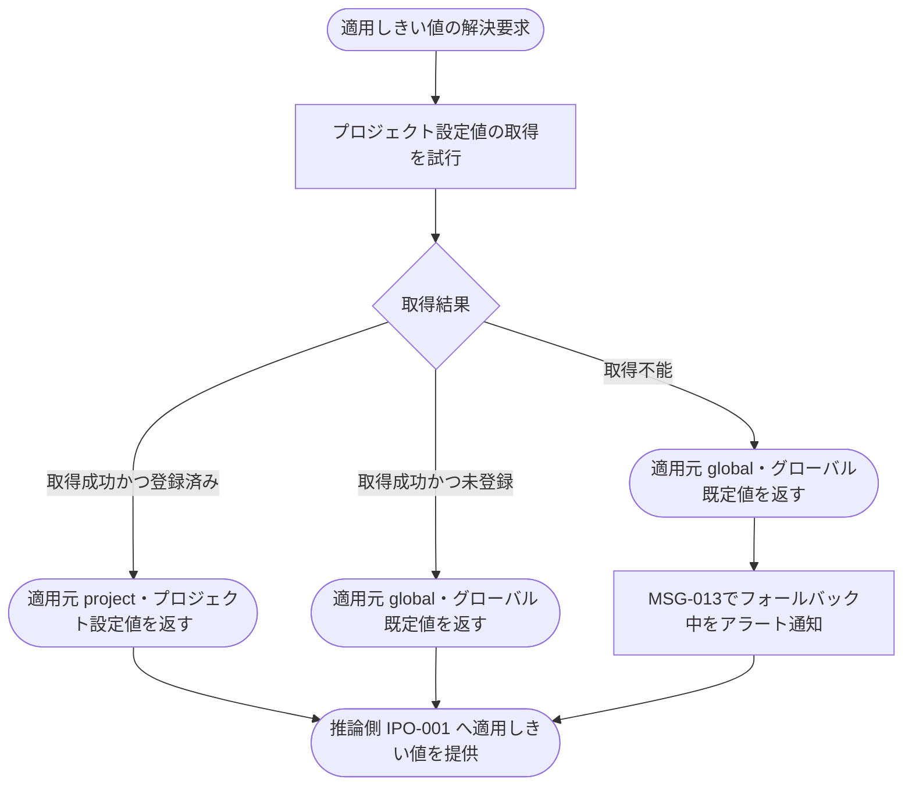

# IPO-004: AIしきい値伝播・フォールバック判定ロジック

> **本記述書は、プロジェクト単位の AI 回答可否しきい値(信頼度・関連度)について、グローバル既定値とプロジェクト設定値の優先順位判定、設定変更時の伝播、キャッシュ取得不能時のフォールバック分岐を確定する処理ロジックを定義します。**

*種別 IPO処理機能記述書 ・ 優先度 P0 ・ ステータス ドラフト*

| 項目 | 値 |
|----|----|
| IPO ID | IPO-004 |
| 業務ユースケースID | [UC-047](../../01_requirements/04_business_usecases/UC-047.md#UC-047) ・ [UC-075](../../01_requirements/04_business_usecases/UC-075.md#UC-075) |
| 関連 API / SYS | [API-066](../../02_basic_design/02_backend/03_apis/API-066.md#API-066) ・ [SYS-015](../../02_basic_design/02_backend/01_system/SYS-015.md#SYS-015) |
| 参照 SEQ | [SEQ-102](../../02_basic_design/03_sequences/SEQ-102.md#SEQ-102) ・ [SEQ-121](../../02_basic_design/03_sequences/SEQ-121.md#SEQ-121) |
| 利用テーブル | [TBL-031](../../02_basic_design/02_backend/04_database/TBL-031.md#TBL-031) |

## 1. 目的

本処理は、AI 推論時に適用するしきい値(信頼度・関連度)を、プロジェクト設定値とグローバル既定値の優先順位に従って解決し、しきい値の登録・更新・削除を以降の推論へ伝播し、キャッシュ取得不能時にグローバル既定値へフォールバックしてアラートを発火する Service 層ロジックである。実装者が押さえるべき前提は次の 3 点である。

- しきい値の正本は[システム仕様書 §1](../../02_basic_design/07_system-spec.md#1-aiしきい値)(信頼度 0.60 / 関連度 0.50 のグローバル既定・[RULE-012](../../01_requirements/01_business_requirement/08_rule.md#RULE-012))。適用条件は「プロジェクト設定値が登録済みならその値、未登録ならグローバル既定値」の 2 段階のみであり、それ以外の適用順序は存在しない。
- プロジェクト設定値は[TBL-031](../../02_basic_design/02_backend/04_database/TBL-031.md#TBL-031)(`TP_AI_THRESH_CACHE`)に信頼度・関連度を 1 セットで保持する。片方だけの登録・部分的なフォールバック(信頼度のみプロジェクト値・関連度のみグローバル既定、等)は行わない([RULE-012](../../01_requirements/01_business_requirement/08_rule.md#RULE-012))。
- 本ロジックは [API-066](../../02_basic_design/02_backend/03_apis/API-066.md#API-066)(取得・更新・削除)と AI 推論時の解決要求の双方から呼び出される共通処理であり、[SYS-015](../../02_basic_design/02_backend/01_system/SYS-015.md#SYS-015) の実装詳細に当たる。AI 推論可否そのものの判定(信頼度・関連度としきい値の比較)は [IPO-001](IPO-001.md#IPO-001) が担い、本処理は「どのしきい値を適用するか」の解決に責務を限定する。

## 2. 処理概要

しきい値の変更検知または AI 推論からの解決要求を入力に、プロジェクト設定値の登録有無・取得可否を判定し、適用しきい値を確定して伝播・フォールバック・アラートまでを 1 単位として俯瞰する。

| 機能名 | 処理概要 | 起動条件 | 終了条件 |
|----|----|----|----|
| AIしきい値伝播・フォールバック判定 | プロジェクト設定値とグローバル既定値の優先順位を判定し、適用しきい値を確定して伝播する。キャッシュ取得不能時はグローバル既定値へフォールバックしアラートを発火する | プロジェクト設定値の登録・更新・削除を検知したとき、または AI 推論から適用しきい値の解決要求を受けたとき | 適用しきい値(信頼度・関連度)を確定し呼び出し元へ返した、または伝播完了・アラート発火まで終えたとき |

## 3. IPO 一覧

入力・処理・出力の対応と例外・分岐を 1 行 1 処理で一覧化する。判定分岐の詳細条件は `## 4. 処理詳細` に定義する。

| No | Input | Process | Output | 例外・分岐 | 備考 |
|----|----|----|----|----|----|
| 1 | [API-066](../../02_basic_design/02_backend/03_apis/API-066.md#API-066) PUT のしきい値入力値(信頼度・関連度、または削除要求) | 入力を検証し、更新は[TBL-031](../../02_basic_design/02_backend/04_database/TBL-031.md#TBL-031)へ登録、削除要求は当該プロジェクト行を削除して未登録状態へ戻す | プロジェクト設定値の登録済み / 未登録状態 | 片方のみの指定は不正(登録・削除いずれもしない) | 検証ロジックは[API-066](../../02_basic_design/02_backend/03_apis/API-066.md#API-066) P-04、本処理は登録・削除確定を担う |
| 2 | プロジェクト設定値の登録・更新・削除確定(No.1 の結果) | 変更後の設定状態を以降の推論が参照できる状態へ伝播 | 伝播完了 | — | 伝播方式・反映遅延の上限は[SYS-015](../../02_basic_design/02_backend/01_system/SYS-015.md#SYS-015)、具体的な配信機構は本書対象外 |
| 3 | 対象プロジェクト、AI 推論からの適用しきい値解決要求 | [TBL-031](../../02_basic_design/02_backend/04_database/TBL-031.md#TBL-031)からプロジェクト設定値の取得を試行し、優先順位([システム仕様書 §1](../../02_basic_design/07_system-spec.md#1-aiしきい値))で適用値を確定 | 適用しきい値(信頼度・関連度)、適用元(`project` / `global`) | 取得不能時はグローバル既定値へ直接フォールバック | 取得成功かつ未登録の場合もグローバル既定値(フォールバックではなく通常経路) |
| 4 | No.3 で取得不能と判定された事実 | フォールバック動作中であることを[MSG-013](../../02_basic_design/06_messages/MSG-013.md#MSG-013)(`event_type=ai_threshold_fallback`)でアラート通知 | アラート通知 | 取得不能時のみ発火(未登録時は発火しない) | 通知先・文面は[MSG-013](../../02_basic_design/06_messages/MSG-013.md#MSG-013)が正本 |

## 4. 処理詳細

各処理の判定条件・入出力・エラー時挙動を実装可能な粒度で定義する。物理カラム名の定義は [DBP-013](../07_db_physical/DBP-013.md#DBP-013)、伝播機構の起動制御・排他制御は対の [BAT](../05_batch/index.md) に委ねる。

| No | 処理名 | 処理内容(疑似コード / 判定条件) | 入力 | 出力 | 条件 | エラー時 |
|----|----|----|----|----|----|----|
| 1 | 入力検証・登録確定 | `if confidence!=null and relevance!=null → 1セットで登録・更新` / `if confidence==null and relevance==null → 当該プロジェクト行を削除` / `else → 検証エラー(登録・削除いずれもしない)` | 信頼度・関連度の入力値(または削除要求) | プロジェクト設定値の登録済み / 未登録状態 | [API-066](../../02_basic_design/02_backend/03_apis/API-066.md#API-066) PUT 受付時 | 片方のみの指定・範囲外(0.0〜1.0 外)は[ERR-001](../../02_basic_design/05_errors/ERR-001.md#ERR-001)(400)。登録・削除いずれも実行しない |
| 2 | 変更伝播 | `propagate(project_id, 変更後の登録状態)` を実行し、以降の推論解決(No.3)が変更後の状態を参照できるようにする | 登録・更新・削除確定後のプロジェクト設定状態 | 伝播完了 | No.1 の確定直後 | 伝播失敗時のリトライ・再送制御は対の BAT に委ねる(本処理は判定ロジックのみ) |
| 3 | 優先順位判定・適用値解決 | `try: v = TP_AI_THRESH_CACHE.find(project_id)` → `if v exists → apply(v, source="project")` / `if v not exists → apply(GLOBAL_DEFAULT, source="global")` → `catch(取得不能): apply(GLOBAL_DEFAULT, source="global"); フォールバック扱いとして記録` | 対象プロジェクト ID | 適用しきい値(信頼度・関連度)、適用元(`project` / `global`) | AI 推論からの解決要求時 | 取得不能(例外・タイムアウト)時はグローバル既定値へ直接フォールバックし継続。推論自体は打ち切らない |
| 4 | フォールバックアラート発火 | `if No.3の分岐==取得不能 → notify(MSG-013, event_type="ai_threshold_fallback")` | No.3 のフォールバック判定結果 | アラート通知(システム通知メール) | 取得不能によるフォールバックが発生したとき | 通知自体の送達失敗はメール再送制御([システム仕様書 §3](../../02_basic_design/07_system-spec.md#3-タイムアウトセッション認証))に委ねる。未登録(正常系)では発火しない |

優先順位判定とフォールバックの分岐を示す。「未登録」と「取得不能」はいずれもグローバル既定値を返す点で出力が同じだが、後者のみアラートを発火する点で分岐が異なる。

## 5. 後続工程への引き継ぎ事項

詳細シーケンス([SEQ-102](../../02_basic_design/03_sequences/SEQ-102.md#SEQ-102)・[SEQ-121](../../02_basic_design/03_sequences/SEQ-121.md#SEQ-121))・テスト設計へ引き継ぐ観点を挙げる。推論結果への適用は [IPO-001](IPO-001.md#IPO-001) 処理詳細 No.1 を参照。

- 「未登録」(正常系・グローバル既定値を静かに使用)と「取得不能」(異常系・グローバル既定値へフォールバックしアラート発火)を取り違えないことのテスト観点(出力値は同一だが分岐と副作用が異なる)。
- 片方のみ number・片方のみ null の入力([API-066](../../02_basic_design/02_backend/03_apis/API-066.md#API-066) P-04)を検証エラーとして拒否し、登録・削除のいずれも実行しないことの確認。
- 伝播の反映遅延中(変更確定後・伝播完了前)に解決要求が来た場合の整合性(反映遅延の上限は[SYS-015](../../02_basic_design/02_backend/01_system/SYS-015.md#SYS-015)、具体的な排他制御・再送は対の BAT へ委譲)。
- 削除(リセット)によりプロジェクト行が未登録へ戻った直後、解決要求がグローバル既定値を正しく返すことの境界値検証。
- フォールバックアラート([MSG-013](../../02_basic_design/06_messages/MSG-013.md#MSG-013) `event_type=ai_threshold_fallback`)の発火が取得不能時のみに限定され、未登録時に誤発火しないことの確認。
