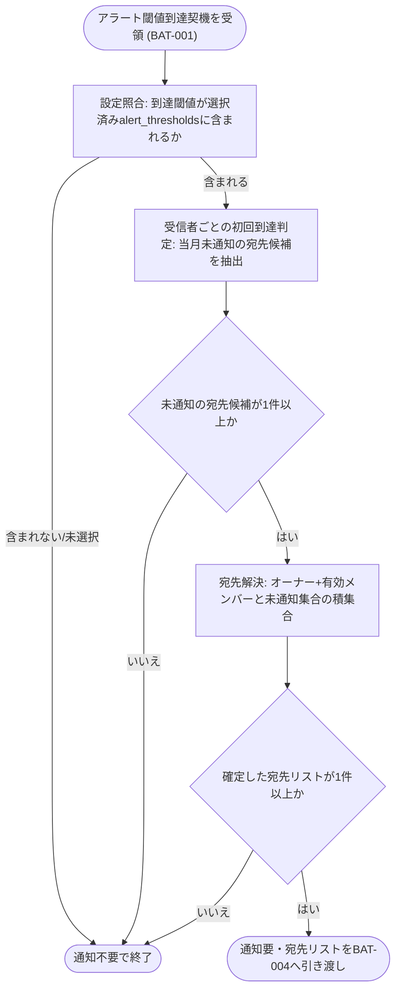

# IPO-005: 質問数上限アラート判定ロジック

> **本記述書は、プロジェクトの当月質問数がアラート閾値へ到達したことの検知を受けて、当月内で当該閾値が受信者ごとに未通知であるかを判定し、通知先(オーナー + 有効メンバー)を確定するまでの処理ロジックを定義します。**

*種別 IPO処理機能記述書 ・ 優先度 P0 ・ ステータス ドラフト*

| 項目 | 値 |
|----|----|
| IPO ID | IPO-005 |
| 業務ユースケースID | [UC-052](../../01_requirements/04_business_usecases/UC-052.md#UC-052) |
| 関連 API / SYS | [API-046](../../02_basic_design/02_backend/03_apis/API-046.md#API-046) ・ [SYS-017](../../02_basic_design/02_backend/01_system/SYS-017.md#SYS-017) |
| 参照 SEQ | — (契機引き渡し元の集計処理は [BAT-001](../05_batch/BAT-001.md#BAT-001)。通知配信の実行機構は [BAT-004](../05_batch/BAT-004.md#BAT-004)) |
| 利用テーブル | [TBL-009](../../02_basic_design/02_backend/04_database/TBL-009.md#TBL-009) ・ [TBL-020](../../02_basic_design/02_backend/04_database/TBL-020.md#TBL-020) ・ [TBL-026](../../02_basic_design/02_backend/04_database/TBL-026.md#TBL-026) |

## 1. 目的

本処理は、[BAT-001](../05_batch/BAT-001.md#BAT-001)(SYS-016)が課金対象件数から算出した利用率を基にアラート閾値到達の契機を引き渡した後、[SYS-017](../../02_basic_design/02_backend/01_system/SYS-017.md#SYS-017) の判定部分(`PR-01`〜`PR-03`)として、当該閾値が当月内で受信者ごとに未通知であることを確定し、通知先(オーナー + 当該プロジェクトの有効なメンバー)を重複排除して確定する Service 層ロジックである。実装者が押さえるべき前提は次の 3 点である。

- アラート閾値の値集合(25 / 50 / 80 / 90 / 100%)・複数選択可・未選択時は通知なしの業務ルールは [RULE-014](../../01_requirements/01_business_requirement/08_rule.md#RULE-014) が正本。プロジェクトごとの選択値は [TBL-009](../../02_basic_design/02_backend/04_database/TBL-009.md#TBL-009) `alert_thresholds` に保持する。
- 利用率算出・「当月はじめて到達」の一次判定・契機引き渡しの当月一度性(プロジェクト × 請求月 × 閾値単位)は [BAT-001](../05_batch/BAT-001.md#BAT-001)(SYS-016 `PR-02`〜`PR-03`)が担う。本処理は契機を受け取った後、**受信者ごとの重複通知抑制**(同一プロジェクト・同一請求月・同一閾値の通知を受信者ごとに一度だけ行う)を確定する後段の判定であり、利用率の再算出は行わない。
- 通知の実行(受信箱お知らせ生成・メール送信・送信結果記録)は対の [BAT-004](../05_batch/BAT-004.md#BAT-004) が担い、本処理は通知要否と確定した宛先リストを出力するところまでを担う。

## 2. 処理概要

アラート閾値到達契機(対象プロジェクト・請求年月・到達閾値)を入力に、設定照合 → 受信者ごとの初回到達判定 → 宛先解決までを 1 単位として俯瞰する。

| 機能名 | 処理概要 | 起動条件 | 終了条件 |
|----|----|----|----|
| 質問数上限アラート判定 | 上限・閾値設定と当月質問数を照合し、受信者ごとに当月未通知であることを確定して通知先を確定する | [BAT-001](../05_batch/BAT-001.md#BAT-001) からアラート閾値到達契機(対象プロジェクト・請求年月・到達閾値)を受け取ったとき | 通知要(確定した宛先リスト)/ 通知不要(スキップ)のいずれかを [BAT-004](../05_batch/BAT-004.md#BAT-004) へ引き渡したとき |

## 3. IPO 一覧

入力・処理・出力の対応と例外・分岐を 1 行 1 処理で一覧化する。判定分岐の詳細条件は `## 4. 処理詳細` に定義する。

| No | Input | Process | Output | 例外・分岐 | 備考 |
|----|----|----|----|----|----|
| 1 | 対象プロジェクト、請求年月、到達閾値、[TBL-009](../../02_basic_design/02_backend/04_database/TBL-009.md#TBL-009) の上限・閾値設定 | 到達閾値が当該プロジェクトの選択済みアラート閾値に含まれるかを照合 | 照合結果(有効 / 無効) | 選択済み閾値に含まれない場合は通知不要 | 閾値の値集合正本は [RULE-014](../../01_requirements/01_business_requirement/08_rule.md#RULE-014) |
| 2 | 対象プロジェクト、請求年月、到達閾値、[TBL-026](../../02_basic_design/02_backend/04_database/TBL-026.md#TBL-026) の通知ログ | 通知先候補ごとに当月内で当該閾値の通知済みログの有無を判定 | 未通知の宛先候補集合 | 全候補が通知済みなら通知不要 | 重複抑制は受信者単位。判定条件は `## 4.` No.2 |
| 3 | 対象プロジェクト | オーナーと当該プロジェクトの有効なメンバーを取得し、未通知の宛先候補集合と突き合わせて重複を除去 | 確定した宛先リスト | 有効な宛先が 0 件なら通知不要 | 有効なメンバーの定義は [用語集](../../01_requirements/00_glossary.md#GLO-002) に従う |

## 4. 処理詳細

各処理の判定条件・入出力・エラー時挙動を実装可能な粒度で定義する。物理カラム名の定義は [DBP-002](../07_db_physical/DBP-002.md#DBP-002)、通知の実行機構(お知らせ生成・メール送信・再送)は [BAT-004](../05_batch/BAT-004.md#BAT-004) に委ねる。

| No | 処理名 | 処理内容(疑似コード / 判定条件) | 入力 | 出力 | 条件 | エラー時 |
|----|----|----|----|----|----|----|
| 1 | 設定照合 | `if 到達閾値 ∈ プロジェクトの alert_thresholds → 続行 else → 通知不要で終了`。`alert_thresholds` が空配列(未選択)の場合も通知不要 | 対象プロジェクト、到達閾値、[TBL-009](../../02_basic_design/02_backend/04_database/TBL-009.md#TBL-009) `alert_thresholds` | 照合結果 | アラート閾値到達契機の受領時 | 設定取得不能時は通知を行わず異常ログへ記録([SYS-017](../../02_basic_design/02_backend/01_system/SYS-017.md#SYS-017) 運用へ委ねる) |
| 2 | 受信者ごとの初回到達判定 | `未通知候補 = 宛先候補のうち、(project_id, billing_ym, 到達閾値, 宛先) の組で当月に送信成功済み([TBL-026](../../02_basic_design/02_backend/04_database/TBL-026.md#TBL-026) `notification_type=NOTIF-SYSTEM_NOTICE` かつ `delivery_state` が送達完了系)の通知ログが存在しない宛先の集合`。存在すれば当該宛先を除外し、当月内での重ねた通知を防ぐ | 対象プロジェクト、請求年月、到達閾値、宛先候補、通知ログ | 未通知の宛先候補集合 | 設定照合が有効のとき | ログ参照不能時は当該宛先を未通知側として扱わず除外し、二重送信より欠落を優先する(過検知防止) |
| 3 | 宛先解決 | `候補 = {オーナー} ∪ {当該プロジェクトの有効なメンバー}`。重複ユーザーは 1 件に集約したうえで No.2 の未通知集合と積集合を取る | 対象プロジェクト | 確定した宛先リスト | 未通知の宛先候補集合が 1 件以上のとき | 有効な割当が 0 件(オーナーのみ運用等)でもオーナーは常に候補に含める |
| 4 | 通知要否確定 | `if 確定した宛先リスト.length > 0 → 通知要 else → 通知不要` | 確定した宛先リスト | 通知要(宛先リスト)/ 通知不要 | 宛先解決後 | — |

質問数の計上区分(総質問数 / 課金対象外)は本処理の入力ではなく、利用率算出([BAT-001](../05_batch/BAT-001.md#BAT-001) 内 [RULE-013](../../01_requirements/01_business_requirement/08_rule.md#RULE-013))の責務である。本処理は到達済み契機(到達閾値)を所与として重複抑制と宛先確定のみを行う。

## 5. 後続工程への引き継ぎ事項

詳細シーケンス・テスト設計へ引き継ぐ観点を挙げる。通知配信の実行(お知らせ生成・メール送信・再送・送信結果記録)は [BAT-004](../05_batch/BAT-004.md#BAT-004) を参照。

- 受信者ごとの重複抑制の判定キー((プロジェクト, 請求年月, 到達閾値, 宛先)の組)が、既存の通知ログ([TBL-026](../../02_basic_design/02_backend/04_database/TBL-026.md#TBL-026))の検索条件として一意に特定できることの実装確認(閾値を検索条件に含める物理設計は [DBP-002](../07_db_physical/DBP-002.md#DBP-002) へ委ねる)。
- 境界値: 複数閾値(例 80% と 90%)へ同時到達したケースでの各閾値独立判定、および同一請求月内で異なる閾値へ順次到達したケースでの重複抑制の動作。
- 宛先候補が変動するケース(判定時点でメンバーの有効割当が解除・追加された場合)の扱いをテストで確認する。
- ログ参照不能時に「未通知側として扱わず除外する」(過検知防止・欠落許容)方針の妥当性をテストで検証する。
- [BAT-001](../05_batch/BAT-001.md#BAT-001) 側の当月一度性(プロジェクト × 請求月 × 閾値単位の契機引き渡し)と、本処理の受信者単位の重複抑制が二重に機能し、契機の多重引き渡し時にも宛先単位で過不足なく通知されることの整合確認。
