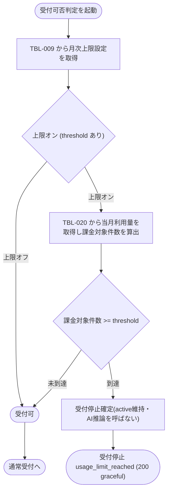

# IPO-006: 上限到達受付停止判定ロジック

> **本記述書は「ウィジェット利用者の質問送信を受け付けてよいか」を、当該プロジェクトの月次上限件数と当月の課金対象件数から同期で判定する処理を定義します。**

*種別 IPO処理機能記述書 ・ 優先度 P0 ・ ステータス ドラフト*

| 項目 | 値 |
|----|----|
| IPO ID | IPO-006 |
| 業務ユースケースID | [UC-053](../../01_requirements/04_business_usecases/UC-053.md#UC-053) |
| 関連 API / SYS | [API-038](../../02_basic_design/02_backend/03_apis/API-038.md#API-038)(受付ガード P-02) ・ [SYS-018](../../02_basic_design/02_backend/01_system/SYS-018.md#SYS-018) |
| 参照 SEQ | [SEQ-097](../../02_basic_design/03_sequences/SEQ-097.md#SEQ-097)(基本フロー)・[DSQ-001](../08_sequences/DSQ-001.md#DSQ-001)(受付ガード全体の詳細化) |
| 利用テーブル | [TBL-009](../../02_basic_design/02_backend/04_database/TBL-009.md#TBL-009) ・ [TBL-020](../../02_basic_design/02_backend/04_database/TBL-020.md#TBL-020) |

## 1. 目的

本処理は、ウィジェット質問送信([API-038](../../02_basic_design/02_backend/03_apis/API-038.md#API-038) P-02 の一部)の受付ガードとして、当該プロジェクトの月次上限件数([TBL-009](../../02_basic_design/02_backend/04_database/TBL-009.md#TBL-009) `resource_kind='q_monthly_limit'`)と当月の課金対象件数([TBL-020](../../02_basic_design/02_backend/04_database/TBL-020.md#TBL-020))を同期で照合し、質問送信を受け付けるか、受付を停止して安全な定型文を返すかを確定する Service 層ロジックである。実装者が押さえるべき前提は次の 3 点である。

- 受付停止しきい値(100%)・最終ガード追加通知(125%)の設計値の正本は[システム仕様書 §2](../../02_basic_design/07_system-spec.md#2-課金利用量上限)([RULE-013](../../01_requirements/01_business_requirement/08_rule.md#RULE-013))。本書はこの設計値を用いた比較ロジックのみを定義し再定義しない。
- 判定分母は**課金対象件数**であり、総質問数(`question_count`)からではなく課金対象外質問数(`unbillable_question_count`。推論失敗 `ai_unavailable` 分)を除いた件数で判定する([TBL-020 コード値・区分値](../../02_basic_design/02_backend/04_database/TBL-020.md#コード値区分値))。参照する当月利用量は質問応答 API が同期加算した確定値であり、本処理自体は加算を行わない。
- 停止応答は 4xx/5xx のエラーではなく **200 の graceful 応答**(`type=unanswered`・`reason=usage_limit_reached`)であり、課金アカウント状態は `active` を維持する([課金・請求設計 §2.1](../../02_basic_design/05_billing-design.md#21-停止状態とウィジェット応答一覧))。支払方法ゲート停止(`reason=payment_required`)は別経路であり本処理の対象外(`## 5.` 参照)。

## 2. 処理概要

対象プロジェクトの月次上限設定と当月利用量を入力に、上限オン/オフの判定 → 課金対象件数と上限件数の比較 → 受付可否の確定までを 1 単位として俯瞰する。本処理はウィジェット質問送信のうち AI 推論呼出([IPO-001](IPO-001.md#IPO-001))より前段の受付ガードであり、受付停止時は AI 推論を呼び出さない。

| 機能名 | 処理概要 | 起動条件 | 終了条件 |
|----|----|----|----|
| 上限到達受付停止判定 | 月次上限件数と当月の課金対象件数を同期で照合し、受付可否(受付可 / 受付停止)を確定する | ウィジェット質問送信でドメイン照合・オーナー単位レート制限を通過し、上限到達判定が要求されたとき | 受付可、または受付停止(`usage_limit_reached`)のいずれかを呼び出し元へ返したとき |

## 3. IPO 一覧

入力・処理・出力の対応と例外・分岐を 1 行 1 処理で一覧化する。判定分岐の詳細条件は `## 4. 処理詳細` に定義する。

| No | Input | Process | Output | 例外・分岐 | 備考 |
|----|----|----|----|----|----|
| 1 | 対象プロジェクトの [TBL-009](../../02_basic_design/02_backend/04_database/TBL-009.md#TBL-009) 設定行(`resource_kind='q_monthly_limit'`) | 月次上限件数(`threshold`)の設定有無を判定(上限オン/オフ) | 上限オン(`threshold` 値)/ 上限オフ | 設定行なし、または `threshold IS NULL` は上限オフ | 上限オフ時は本処理の後続比較を行わず受付可を確定 |
| 2 | 対象プロジェクト・当月(JST 暦月)の [TBL-020](../../02_basic_design/02_backend/04_database/TBL-020.md#TBL-020) 行 | 当月の課金対象件数を算出(`question_count - unbillable_question_count`) | 課金対象件数 | 当月行が未作成(当月利用実績なし)は課金対象件数 0 として扱う | 分母の正本は[課金・請求設計 §6](../../02_basic_design/05_billing-design.md#6-利用量集計方針) |
| 3 | 課金対象件数、月次上限件数(上限オンのとき) | 課金対象件数が上限件数に到達しているかを比較 | 受付可 / 受付停止 | 到達(比較演算子は `## 4.` No.3 で確定)のとき受付停止 | 到達判定は[システム仕様書 §2](../../02_basic_design/07_system-spec.md#2-課金利用量上限)の受付停止しきい値(100%) |
| 4 | 受付停止確定 | 課金アカウント状態を変更せず `active` を維持したまま、支払方法の有無に関わらず受付を停止する | 受付停止応答(`usage_limit_reached`) | 支払方法登録済でも停止(免除しない) | [課金・請求設計 §2](../../02_basic_design/05_billing-design.md#2-質問数上限とウィジェット受付停止) |

## 4. 処理詳細

各処理の判定条件・入出力・エラー時挙動を実装可能な粒度で定義する。物理カラム名の定義は [DBP-001](../07_db_physical/DBP-001.md#DBP-001)、AI 推論呼出以降の処理ロジックは [IPO-001](IPO-001.md#IPO-001) に委ねる。

| No | 処理名 | 処理内容(疑似コード / 判定条件) | 入力 | 出力 | 条件 | エラー時 |
|----|----|----|----|----|----|----|
| 1 | 上限オン/オフ判定 | `limit = TBL-009.find(project_id, resource_kind='q_monthly_limit', valid=1)`。`limit` が存在せず、または `limit.threshold IS NULL` → 上限オフ。存在し `threshold` に値あり → 上限オン(値を `threshold` として保持) | 対象プロジェクト ID | 上限オン/オフ、`threshold`(オンのとき) | 受付ガード評価の直前(ドメイン照合・レート制限通過後) | 設定取得不能時は後段へ渡さず処理エラーとして扱う([DSQ-001](../08_sequences/DSQ-001.md#DSQ-001) 異常系・例外系) |
| 2 | 課金対象件数算出 | `usage = TBL-020.find(project_id, billing_ym=当月JST暦月)`。存在しない → `billable = 0`。存在する → `billable = usage.question_count - usage.unbillable_question_count` | 対象プロジェクト ID、当月(JST 暦月) | 課金対象件数(`billable`) | 上限オンのときのみ算出(上限オフは算出不要) | 参照は質問応答 API が同期加算した確定値のみ(本処理は加算しない) |
| 3 | 到達判定 | `if 上限オン and billable >= threshold → 受付停止 else → 受付可`。等号を含む(`billable == threshold` の時点で到達・停止) | 上限オン/オフ、`billable`、`threshold` | 受付可 / 受付停止 | 上限オンのとき | 上限オフは常に受付可(比較を行わない) |
| 4 | 受付停止確定 | `if 受付停止 → 課金アカウント状態は変更せず active を維持。支払方法の有無に関わらず新規質問受付を停止し AI 推論を呼び出さない` | 到達判定結果 | 受付停止応答(`type=unanswered`, `reason=usage_limit_reached`) | 受付停止のとき | — |

到達判定から受付可否確定までの分岐を示す。上限オフ・未到達はいずれも通常受付へ合流し、後段の AI 推論呼出([IPO-001](IPO-001.md#IPO-001))へ進む。

## 5. 後続工程への引き継ぎ事項

詳細シーケンス([DSQ-001](../08_sequences/DSQ-001.md#DSQ-001))・テスト設計へ引き継ぐ観点を挙げる。実行機構(トリガ契機・排他制御・部分失敗時の扱い)は対の BAT が未作成のため本処理では定義せず、実装時は同期呼出内の判定ロジックとして扱う。

- 到達判定の境界値(課金対象件数が「上限件数ちょうど」のとき受付停止とするか。本書は `>=`(等号を含む=受付停止)で確定。テストで境界値を検証)。
- 最終ガード追加通知(125%)は本処理の受付可否確定とは別契機(SYS-018 の付随処理外・[課金・請求設計 §2](../../02_basic_design/05_billing-design.md#2-質問数上限とウィジェット受付停止))であり、本判定は 100% 到達のみを扱う。125% 検知時の追加通知ロジックは本書の対象外。
- 支払方法ゲート停止(`reason=payment_required`)との判定順序(いずれを先に評価するか)は基本設計に明記が無く、本書では扱わない(課題化候補)。
- 上限設定変更(引き上げ・オフ化)による即時復帰([課金・請求設計 §2](../../02_basic_design/05_billing-design.md#2-質問数上限とウィジェット受付停止))は、設定値を都度取得する本処理の性質上キャッシュ無効化なしに反映されることの確認。
- `T_USAGE_METER` の当月行が未作成(当月初回質問など)のとき課金対象件数を 0 として扱う分岐の検証。
