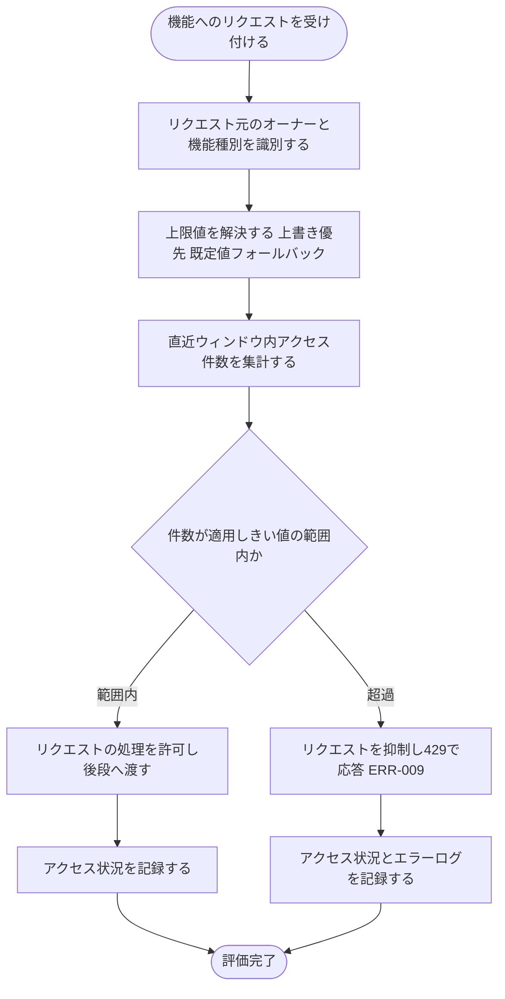

# IPO-007: レート制限判定ロジック

> **本記述書は「オーナー単位・機能種別ごとに定めたレート制限の上限に対し、当該オーナーの直近ウィンドウ内アクセス件数を評価してリクエストを許可するか抑制するか」を判定する処理ロジックを定義します。**

*種別 IPO処理機能記述書 ・ 優先度 P0 ・ ステータス ドラフト*

| 項目 | 値 |
|----|----|
| IPO ID | IPO-007 |
| 業務ユースケースID | [UC-071](../../01_requirements/04_business_usecases/UC-071.md#UC-071) |
| 関連 API / SYS | [SYS-008](../../02_basic_design/02_backend/01_system/SYS-008.md#SYS-008) |
| 参照 SEQ | — (ゲートウェイ層の横断ガードのため機能固有 SEQ には結線しない。ウィジェット質問送信での適用箇所は [DSQ-001](../08_sequences/DSQ-001.md#DSQ-001)) |
| 利用テーブル | [TBL-008](../../02_basic_design/02_backend/04_database/TBL-008.md#TBL-008) ・ [TBL-009](../../02_basic_design/02_backend/04_database/TBL-009.md#TBL-009) ・ [TBL-027](../../02_basic_design/02_backend/04_database/TBL-027.md#TBL-027) ・ [TBL-028](../../02_basic_design/02_backend/04_database/TBL-028.md#TBL-028) |

## 1. 目的

本処理は、[SYS-008](../../02_basic_design/02_backend/01_system/SYS-008.md#SYS-008) が定めるゲートウェイ層の横断ガードのうち、オーナー単位・機能種別(`resource_kind`)ごとの上限に対して当該オーナーの直近ウィンドウ内アクセス件数を評価し、リクエストを許可するか抑制するかを確定する `lib/guard/rate-limit`([MOD-001](../11_module/MOD-001.md#MOD-001) M-12)の判定ロジックである。実装者が押さえるべき前提は次の 3 点である。

- 上限値(既定件数・ウィンドウ長)の正本は[システム仕様書 §5](../../02_basic_design/07_system-spec.md#5-レート制限キャパシティ目安)。オーナー・機能種別単位の上書きは [TBL-008](../../02_basic_design/02_backend/04_database/TBL-008.md#TBL-008)に保持し、上書き行が無ければ既定値を適用する。
- レート制限は**オーナー単位**(当該オーナーが所有する全プロジェクトを束ねた範囲)で評価し、プロジェクト単位化(月次上限件数・無料枠)の対象外である([UC-071](../../01_requirements/04_business_usecases/UC-071.md#UC-071) 代替フロー)。月次上限件数・無料枠の判定は本処理の対象外([TBL-009](../../02_basic_design/02_backend/04_database/TBL-009.md#TBL-009) を用いる別処理)。
- 本処理はゲートウェイ層で全 API 横断に作用し、特定の機能 API に結線しない。実行機構(起動契機・呼び出し順・冪等性・障害時扱い)は各 API のリクエスト受付経路に委ねここでは扱わない。

## 2. 処理概要

機能リクエスト(オーナー・機能種別)を入力に、上限値の解決 → 直近ウィンドウ内アクセス件数の評価 → 許可 / 抑制の確定 → アクセス状況記録までを 1 単位として俯瞰する。

| 機能名 | 処理概要 | 起動条件 | 終了条件 |
|----|----|----|----|
| レート制限判定 | オーナー・機能種別ごとの上限を解決し、直近ウィンドウ内アクセス件数と比較して許可 / 抑制を確定する | いずれかの機能へのリクエストを受け付けたとき | 許可(後段へ渡す)/ 抑制(429 で応答)のいずれかを確定し、アクセス状況を記録したとき |

## 3. IPO 一覧

入力・処理・出力の対応と例外・分岐を 1 行 1 処理で一覧化する。判定分岐の詳細条件は `## 4. 処理詳細` に定義する。

| No | Input | Process | Output | 例外・分岐 | 備考 |
|----|----|----|----|----|----|
| 1 | リクエスト元、機能リクエスト | リクエスト元のオーナーと機能種別(`resource_kind`)を識別する | オーナー識別子、機能種別 | オーナー識別不能時は判定不能として抑制側で扱う | 機能種別は [TBL-008 コード値・区分値](../../02_basic_design/02_backend/04_database/TBL-008.md#コード値区分値)の 4 種 |
| 2 | オーナー識別子、機能種別 | 上限値(しきい値・ウィンドウ長)を解決([TBL-008](../../02_basic_design/02_backend/04_database/TBL-008.md#TBL-008) の有効な上書き優先・無ければ[システム仕様書 §5](../../02_basic_design/07_system-spec.md#5-レート制限キャパシティ目安)の既定値) | 適用しきい値、適用ウィンドウ長 | 上書き複数該当・取得不能時の扱いは `## 4.` No.2 | 上書きの正本は TBL-008 |
| 3 | オーナー識別子、機能種別、適用ウィンドウ長 | 当該オーナー・機能種別の直近ウィンドウ内アクセス件数を集計する | 直近ウィンドウ内アクセス件数 | 集計不能時は判定不能として抑制側で扱う | 集計方式は `## 4.` No.3 |
| 4 | 直近ウィンドウ内アクセス件数、適用しきい値 | 件数がしきい値の範囲内か判定する | 許可 / 抑制 | 範囲内なら許可、超過なら抑制 | `## 4.` No.4 |
| 5 | 許可 / 抑制の判定結果 | 評価結果に応じてアクセス状況を記録する(抑制時はエラーログにも記録) | 監査ログ記録、抑制時はエラーログ記録 | — | [TBL-027](../../02_basic_design/02_backend/04_database/TBL-027.md#TBL-027) ・ [TBL-028](../../02_basic_design/02_backend/04_database/TBL-028.md#TBL-028) |

## 4. 処理詳細

各処理の判定条件・入出力・エラー時挙動を実装可能な粒度で定義する。物理カラム名の定義は [DBP-010](../07_db_physical/DBP-010.md#DBP-010) に委ねる。

| No | 処理名 | 処理内容(疑似コード / 判定条件) | 入力 | 出力 | 条件 | エラー時 |
|----|----|----|----|----|----|----|
| 1 | リクエスト識別 | `owner = resolveOwner(request)`、`kind = resolveResourceKind(request)`(4 種のいずれか) | 機能リクエスト | オーナー識別子、機能種別 | 機能リクエスト受信時 | オーナー・種別いずれか識別不能なら判定不能として抑制側で扱う(後段へ渡さない) |
| 2 | 上限値解決 | `override = 当該(オーナー, 機能種別)の有効な上書き設定を取得(有効期限内のもの)`。`if override が存在 → しきい値・ウィンドウ長は override の値(ウィンドウ長未設定なら既定ウィンドウ長を適用) else → しきい値・ウィンドウ長は[システム仕様書 §5](../../02_basic_design/07_system-spec.md#5-レート制限キャパシティ目安)の既定値` | オーナー識別子、機能種別 | 適用しきい値、適用ウィンドウ長 | オーナー識別後 | 有効な上書き設定が複数存在する場合は最も新しく作成された行を採用。取得不能時は既定値へフォールバックしアクセス状況記録は継続 |
| 3 | ウィンドウ内アクセス件数集計 | `count = 直近「適用ウィンドウ長」秒間に当該オーナー・機能種別で記録された許可済みアクセス件数`。ウィンドウは固定窓(現在時刻を含む直近の適用ウィンドウ長)で評価し、ウィンドウ境界を跨いだ件数は次ウィンドウへ持ち越さない | オーナー識別子、機能種別、適用ウィンドウ長 | 直近ウィンドウ内アクセス件数 | 上限値解決後 | 集計元の記録が取得不能な場合は判定不能として抑制側で扱う |
| 4 | 制限評価 | `if count < 適用しきい値 → 許可 else → 抑制`(件数はカウント対象開始前の値。許可した時点でカウントへ含める) | 直近ウィンドウ内アクセス件数、適用しきい値 | 許可 / 抑制 | ウィンドウ内アクセス件数集計後 | 判定不能(No.1 / No.3)はいずれも抑制側で扱う |
| 5 | リクエスト許可 | 後段の業務処理へリクエストを渡す | 許可判定 | 後段処理への継続 | 許可と判定された場合 | — |
| 6 | リクエスト抑制 | 後段へ渡さず [ERR-009](../../02_basic_design/05_errors/ERR-009.md#ERR-009)(429)を返す | 抑制判定 | 429 応答 | 抑制と判定された場合 | 抑制はアクセス状況記録(監査ログ)に加えエラーログへも記録し濫用検知につなげる |
| 7 | アクセス状況記録 | `評価結果(許可 / 抑制、オーナー、機能種別、判定時刻)を記録`。抑制時は追加でエラーログへ記録 | 評価結果 | 監査ログ記録、抑制時はエラーログ記録 | 評価を行った場合(許可・抑制いずれも) | 記録先は [TBL-027](../../02_basic_design/02_backend/04_database/TBL-027.md#TBL-027) ・ [TBL-028](../../02_basic_design/02_backend/04_database/TBL-028.md#TBL-028) |

## 5. 後続工程への引き継ぎ事項

詳細シーケンス・テスト設計へ引き継ぐ観点を挙げる。

- ウィンドウ境界値の扱い(固定窓の切り替わり直後にバースト通過を許容するか)の確認。本書は固定窓方式(現在時刻を含む直近の適用ウィンドウ長、境界を跨いだ持ち越しなし)で確定。
- 直近ウィンドウ内アクセス件数が適用しきい値ちょうどのとき許可とするかの境界値確認。本書は「しきい値未満のみ許可」(ちょうどで抑制)で確定。
- オーナー・機能種別の識別不能時、および直近ウィンドウ内アクセス件数の集計不能時をいずれも抑制側で扱う安全側フォールバックのテスト観点。
- [TBL-008](../../02_basic_design/02_backend/04_database/TBL-008.md#TBL-008) の有効な上書き行が複数存在するケース(採用ルール)と、有効期限到達直後に既定値へ切り替わる境界のテスト観点。
- ゲートウェイ層での高頻度呼び出しに対する集計処理の並行実行時の整合性(同時到達リクエストでの二重許可の抑止)は詳細シーケンス設計で確認する。
